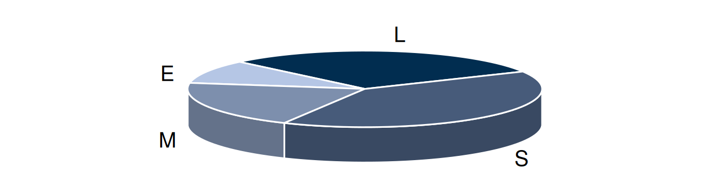

```{r s01, echo=FALSE}


source("intro.R")

```

# Variabili Statistiche e Distribuzioni di Frequenza

La statistica si fonda sulla necessità di comprendere e descrivere fenomeni complessi in modo sistematico e universale. Per farlo, è indispensabile adottare un linguaggio rigoroso che consenta di astrarre dai dettagli specifici e lavorare direttamente sulle relazioni tra i dati. La formalizzazione non è un vezzo, ma una necessità: permette di trattare insiemi di dati di qualunque dimensione o complessità senza cambiare le regole del ragionamento.

Il linguaggio formale che utilizzeremo in questo libro è pensato per garantire una sintesi efficace e una generalizzazione immediata. Una manciata di osservazioni e un archivio di miliardi di righe possono essere analizzati con gli stessi strumenti e le stesse regole. Questa uniformità concettuale è ciò che rende il pensiero statistico potente: non ci si perde nei dettagli numerici, ma si lavora direttamente sulle proprietà e sulle trasformazioni delle strutture che i dati rappresentano.

Adottare una notazione rigorosa consente inoltre di comunicare con chiarezza e precisione. Ogni simbolo, ogni operatore ha un significato ben definito che elimina ambiguità e rende possibile il ragionamento collaborativo, indipendentemente dal contesto applicativo. La formalizzazione non è solo un linguaggio per il calcolo, ma uno strumento per pensare, per astrarre e per collegare il particolare all'universale.

Lavorare in questo modo significa concentrarsi sui concetti fondamentali, svincolandosi dalla necessità di riferirsi continuamente alla numerosità dei dati o alla loro specifica natura. È così che il linguaggio statistico diventa non solo un mezzo per analizzare, ma anche per costruire modelli e sviluppare inferenze che si applicano a fenomeni ben oltre i dati osservati.

In statistica, la scelta dei simboli gode di una flessibilità maggiore rispetto ad altre discipline come la fisica, dove molte notazioni sono rigidamente standardizzate. Questa libertà riflette la natura più applicativa e interdisciplinare della statistica, che si adatta a contesti diversi e a una grande varietà di fenomeni. Tuttavia, nel tempo, si è consolidata una notazione comune, grazie alla diffusione di libri di testo e alla pratica accademica, che offre un riferimento condiviso pur lasciando margini per piccole personalizzazioni.

In fisica, al contrario, cambiare i simboli può portare a confusione o addirittura compromettere la comprensione. Ad esempio, la costante gravitazionale universale \( G \) e la velocità della luce nel vuoto \( c \) sono simboli universalmente riconosciuti. Rinominare \( G \) con un altro simbolo, come \( k \), o \( c \) con \( v \), rischierebbe di generare fraintendimenti, poiché quei simboli sono già associati ad altri concetti fondamentali, come la costante elastica e la velocità generica di un corpo.

In statistica, invece, sebbene esistano convenzioni consolidate – come indicare una variabile casuale con una lettera maiuscola (\( X \)) e un’osservazione specifica con una minuscola (\( x_i \)) – la comunità accetta varianti ragionevoli, purché siano chiaramente definite. In questo libro, useremo una notazione che rispetta gli standard più diffusi, integrandola con piccole personalizzazioni pensate per migliorare la chiarezza e la leggibilità, senza mai perdere il rigore. Questo approccio garantisce che il linguaggio sia al tempo stesso accessibile e conforme alle convenzioni accademiche, facilitando il collegamento con altri testi e contesti di studio.

## Variabili Statistiche

Una _Variabile Statistica_ (VS) è una qualunque caratteristica osservabile sugli individui (unità statistiche) della popolazione di riferimento, che _varia_ da individuo ad individuo.


### Notazione di Base
- $\mathbf{x}=(x_1,x_2,...,x_i,...,x_n)$, etichette simboliche per i dati, il primo dato osservato, il secondo ecc.
- $i$, indice che conta le osservazioni nell'ordine in cui sono state osservate
  - $i\in\{1,2,...,n\}$
  - il primo, il secondo, ... l'$i$-esimo, ... l'$n$-esimo (l'ultimo)
- $n$, numerosità assoluta: il numero totale di individui osservati.
- $S_X=\{\mathrm{x}_1,...,\mathrm{x}_j,...,\mathrm{x}_K\}$, l'insieme di tutte le modalità possibili che la variabile statistica è suscettibile di assumere.
- $j$, indice che conta le modalità: prima, seconda, ..., $j$-esima,..., la $K$-esima.
- $K$, numero di modalità.

:::{.example #vg name="Variabile: genere"}
$\phantom{.}$

- $\mathbf{x}=(x_1 = M, x_2 =F, x_3 =M, x_4=F,x_5=F,x_6=F)$
- $n=6$
- $S_X=\{\mathrm{x}_1 = F,\mathrm{x}_2 = M\}$
- $K=2$
:::

:::{.example name="Variabile: titolo di studio"}
$\phantom{.}$

- $\mathbf{x}=(x_1 = E, x_2 =M, x_3 =L, x_4=S,x_5=S,x_6=S,
x_7=L,x_8=M,x_9=L,x_{10}=S)$
- $n=10$
- $S_X=\{\mathrm{x}_1 = E,\mathrm{x}_2 = M, \mathrm{x}_3=S,\mathrm{x}_4=L\}$
- $K=4$
:::

:::{.example name="Variabile: Numero di interventi di manutenzione giornalieri"}
$\phantom{.}$
 
- $\mathbf{x}=(x_1 = 0, x_2 =1, x_3 =0, x_4=2,x_5=1,x_6=1,
x_7=0,x_8=1,x_9=3,x_{10}=1)$
- $n=10$
- $S_X=\{\mathrm{x}_1 = 0,\mathrm{x}_2 = 1,\mathrm{x}_3=2,\mathrm{x}_4=3,...\}$
- $K=+\infty$
:::

### Ordinamento e conteggio

Se l'ordine di osservazione non è influente ai fini della conoscenza del fenomeno
i dati possono essere permutati (mescolati) a piacimento, la sequenza:

$$(x_{(1)},x_{(2)},...,x_{(i)},...,x_{(n)}),$$ 

indica i dati riordinati, dal più piccolo, al più grande. Se i dati sono numerici
l'ordinamento è univoco, se i dati sono categoriali l'ordinamento è arbitrario.

:::{.example name="Continua"}
Continuiamo l'esempio della variabile genere discussa
nell'esempio \@ref(exm:vg)

- $\mathbf{x}=(x_1 = M, x_2 =F, x_3 =M, x_4=F,x_5=F,x_6=F)$
- $S_X=\{\mathrm{x}_1 = F,\mathrm{x}_2 = M\}$
- $x_{(1)}=F,x_{(2)}=F,x_{(3)}=F,x_{(4)}=F,x_{(5)}=M,x_{(6)}=M$
:::

:::{.example name="Continua: codifica 0, 1"}
$\phantom{.}$

- Variabile: genere {M -> 0,F-> 1}
- $\mathbf{x}=(x_1 = 0, x_2 =1, x_3 =0, x_4=1,x_5=1,x_6=1)$
- $S_X=\{\mathrm{x}_1 = 0,\mathrm{x}_2 = 1\}$
- $x_{(1)}=0,x_{(2)}=0,x_{(3)}=1,x_{(4)}=1,x_{(5)}=1,x_{(6)}=1$
- **nota**: nella codifica 0, 1 ha senso sommare i dati:
\[x_1+x_2+x_3+x_4+x_6=4,~~\text{Numero di femmine}\]
:::

:::{.example name="Continua: Variabile titolo di studio"}
$\phantom{.}$

- $\mathbf{x}=(x_1 = E, x_2 =M, x_3 =L, x_4=S,x_5=S,x_6=S,
x_7=L,x_8=M,x_9=L,x_{10}=S)$
- $S_X=\{\mathrm{x}_1 = E,\mathrm{x}_2 = M, x_3=S, x_4=L\}$
- $x_{(1)}=E,x_{(2)}=M,x_{(3)}=M,x_{(4)}=S,x_{(5)}=S,x_{(6)}=S,x_{(7)}=S,x_{(8)}=L,x_{(9)}=L,
x_{(10)}=L$

:::

:::{.example name="Continua: Codifica Numerica"}
$\phantom{.}$

- Variabile: titolo di studio {E -> 1, M -> 2, S -> 3, L -> 4}
- $\mathbf{x}=(x_1 = 1, x_2 = 2, x_3 = 4, x_4= 3,x_5=3,x_6=3,
x_7=4,x_8=2,x_9=4,x_{10}=3)$
- $S_X=\{\mathrm{x}_1 = 1,\mathrm{x}_2 = 2, x_3=3, x_4=4\}$
- $x_{(1)}=1,x_{(2)}=2,x_{(3)}=2,x_{(4)}=3,x_{(5)}=3,x_{(6)}=3,x_{(7)}=3,x_{(8)}=4,x_{(9)}=4,
x_{(10)}=4$
- ha senso sommare i dati?

La codifica numerica corretta sarebbe più complessa

```{r 02-distr-freq-1}
x<-c(x_1 = 1, x_2 = 2, x_3 = 4, x_4= 3,x_5=3,x_6=3,x_7=4,x_8=2,x_9=4,`x_{10}`=3)

x_lab <- 1:4

dat <- data.frame(outer(x, x_lab, FUN = function(x, y) as.integer(x == y)))
dat <- rbind(dat,Tot = colSums(dat))
names(dat) <- c("E","M","S","L")
row.names(dat) <- paste0("$",row.names(dat),"$")
tabl(t(dat))
```

I totali di colonna hanno senso e indicano il numero di individui che ha un determinato titolo 
di studio.

Questa codifica è sovra abbondante infatti come per maschio e femmina possiamo contare
solo un colonna di presenza 1 (è femmina) e assenza 0 (non è femmina e quindi maschio), per una variabile a 4 modalità
possiamo contare solo 3, ad esempio

- 0,0,0 elementari
- 1,0,0 medie
- 0,1,0 superiori
- 0,0,1 università

```{r 02-distr-freq-2}
x<-c(x_1 = 1, x_2 = 2, x_3 = 4, x_4= 3,x_5=3,x_6=3,x_7=4,x_8=2,x_9=4,`x_{10}`=3)

x_lab <- 1:4

dat <- data.frame(outer(x, x_lab, FUN = function(x, y) as.integer(x == y)))[,-1]
dat <- rbind(dat,Tot = colSums(dat))
names(dat) <- c("M","S","L")
row.names(dat) <- paste0("$",row.names(dat),"$")
tabl(t(dat))
```

Per sapere il numero persone che ha al massimo le elementari basta fare 10 (numero totale di individui)
 meno 2 (medie) più 4 (superiori) più 3 (laureati):
 
 \[
 10-(2+4+3)=1~~~\text{con le elemntari}
 \]

:::

:::{.example name="Continua: Numero di interventi di manutenzione giornalieri"}
$\phantom{.}$

- $\mathbf{x}=(x_1 = 0, x_2 =1, x_3 =0, x_4=2,x_5=1,x_6=1,
x_7=0,x_8=1,x_9=3,x_{10}=1)$
- $S_X=\{\mathrm{x}_1 = 0,\mathrm{x}_2 = 1,\mathrm{x}_3=2,\mathrm{x}_4=3,...\}$
- $x_{(1)}=0,x_{(2)}=0,x_{(3)}=0,x_{(4)}=1,x_{(5)}=1,x_{(6)}=1,x_{(7)}=1,x_{(8)}=1,x_{(9)}=2,
x_{(10)}=3$
- ha senso sommare i dati?
- cosa rappresenta la somma dei dati?
:::

:::{.example name="Ore uomo dedicate a interventi di manutenzione"}
$\phantom{.}$

Supponiamo di aver collezionato il numero di ore uomo (e frazioni di ora) dedicate
ad ogni intervento di manutenzione L'unità statistica sarà l'intervento, $i=1$ il primo, $i=2$, il secondo, ecc. e assumerà un valore decimale $x_3=3.5$ significa che la terza manutenzione ha impiegato un addetto per 3 ore e mezza.

- $\mathbf{x}=(x_1 = 0.4, x_2 =2.7, x_3 =3.5, x_4=1.4,x_5=4.3,x_6=4.6,
x_7=0.2,x_8=1.9,x_9=3.4,x_{10}=0.1)$
- $S_X=\{\mathrm{x}_1 = 0.0,\mathrm{x}_2 = 0.1,\mathrm{x}_3=0.2,\mathrm{x}_4=0.3,...\}$
- $x_{(1)}=0.1, x_{(2)}=0.2, x_{(3)}=0.4, x_{(4)}=1.4, x_{(5)}=1.9, x_{(6)}=2.7, x_{(7)}=3.4, x_{(8)}=3.5, x_{(9)}=4.3, x_{(10)}=4.6$
- ha senso sommare i dati?
- cosa rappresenta la somma dei dati?
:::

### Le unità di misura

In statistica, ogni dato è sempre espresso in una specifica unità di misura, che conferisce significato al valore numerico registrato. Le unità di misura variano in base alla natura dei dati e al fenomeno osservato, e possono includere:

1. **Conteggi**: I dati che rappresentano quantità possono essere espressi in unità di conteggio, come unità singole, decine, centinaia, migliaia, ecc. Ad esempio, se registriamo il numero di visitatori in un parco in un anno, può essere più comodo esprimere 12.000 visitatori come "12 migliaia" (12 x 1000), facilitando la lettura. Analogamente, 1.200 prodotti venduti potrebbero essere espressi come "1,2 migliaia" per rendere i confronti immediati tra dati di grandezza diversa.

2. **Misure metriche**: Le grandezze fisiche come la lunghezza, la massa, la capacità e la temperatura sono espresse in unità metriche, come metri, chilogrammi, e litri. Ad esempio, per confrontare il peso di vari articoli, un dato in grammi potrebbe risultare scomodo se molto elevato; per articoli pesanti, come $12~000$ grammi, potrebbe essere più leggibile esprimere il dato in chilogrammi come 12 kg, dove 1 kg = $1~000$ grammi. Questo cambio di unità mantiene invariato il rapporto tra le osservazioni, facilitando la comprensione e l'analisi.

3. **Misure derivate o di rapporto**: Alcune unità di misura rappresentano rapporti tra grandezze, come chilometri all'ora (km/h) per la velocità, o litri per 100 chilometri (L/100 km) per il consumo di carburante. Ad esempio, se un'auto consuma 7 litri ogni 100 km, esprimere il consumo in questa unità (7 L/100 km) è più immediato e rappresentativo di un valore medio, rispetto all'uso di litri per singolo chilometro (0.07 L/km), che potrebbe risultare poco intuitivo.

4. **Misure di risultati e punteggi**: In statistica, si usano spesso trasformazioni che combinano più misure per produrre un indicatore con una scala di misura propria, utile per confrontare sinteticamente informazioni complesse. Consideriamo la seguente formula generale:
\[
x_i = f(a_{i1}, a_{i2}, a_{i3}, \dots)
\]
dove \( a_{ij} \) rappresenta le varie misure o statistiche che contribuiscono al calcolo del valore \( x_i \), cioè l'indicatore della i-esima osservazione.
Per esempio, immaginiamo di voler calcolare un **punteggio di idoneità** per i candidati a un lavoro, basato su tre misure diverse:

    - \( a_{i1} \): esperienza in anni,
    - \( a_{i2} \): punteggio di un test tecnico (da 0 a 100),
    - \( a_{i3} \): valutazione del colloquio (da 0 a 5).
  
Per produrre un indicatore che misuri l'idoneità complessiva su una scala uniforme, potremmo usare una formula come:
      \[
      x_i = 0.5 \cdot a_{i1} + 0.3 \cdot a_{i2} + 2 \cdot a_{i3}
      \]
      Questa formula pondera ciascuna misura per dare maggiore peso all'esperienza (0.5) e al colloquio (2) rispetto al test tecnico (0.3). Per il quinto candidato ($i=5$) con 5 anni di esperienza, un punteggio di 80 al test e una valutazione di 4 al colloquio, il punteggio di idoneità risulterebbe:
      \[
      x_5 = 0.5 \cdot 5 + 0.3 \cdot 80 + 2 \cdot 4 = 2.5 + 24 + 8 = 34.5
      \]
      In questo caso, il punteggio di idoneità \( x_i \) è su una scala propria, definita dalle scelte di peso e dalle unità combinate, e consente di confrontare i candidati in modo sintetico, anche se ogni componente ha un'unità di misura diversa.
      

### Trasformazioni lineari

In matematica e statistica, una trasformazione lineare è un’operazione che modifica i dati mantenendo invariati i rapporti tra le osservazioni. La forma generale di una trasformazione lineare è:

\[
y_i = a + b x_i
\]

dove:

  - \( x_i \) rappresenta la **misura i-esima** del dato originale.
  - \( a \) rappresenta uno **spostamento dell'origine** (traslazione), che posiziona i dati su un nuovo punto di partenza, spostando l'intero grafico verso l'alto o verso il basso.
  - \( b \) è il **fattore di scala**, che ridimensiona i valori, influenzando la pendenza della retta. Un fattore maggiore di 1 espande i valori, mentre uno tra 0 e 1 li contrae.

Geometricamente, il termine \( a \) trasla il grafico lungo l'asse verticale senza modificare le distanze relative tra i punti, mentre \( b \) varia la pendenza, allargando o comprimendo i dati rispetto all'origine.

#### Cambiamento di scala come trasformazione lineare

Un cambiamento di scala è una trasformazione lineare applicata a ogni misura i-esima del dato, che permette di adattare l'unità di misura senza alterare i rapporti tra le osservazioni. Vediamo alcuni esempi pratici.

:::{.example name="Dati spese"}

Supponiamo di avere i dati su diverse spese in euro e di volerli esprimere in migliaia di euro per facilitare la lettura. La trasformazione è:

\[
y_i = \frac{1}{1000} \cdot x_i
\]

Dove \( x_i \) è il valore in euro della misura i-esima e \( y_i \) è il valore corrispondente in migliaia di euro. Per chiarire questo concetto, prendiamo \( i=4 \) con \( x_4 = 12~000 \):

\[
y_4 = \frac{1}{1000} \cdot 12~000 = 12
\]

Quindi, invece di esprimere la quarta misura come $12~000$ euro, la rappresentiamo come 12 _migliaia_ di euro, semplificando la gestione e la comparabilità dei dati.
::: 

:::{.example name="Conversione temperature"}

Anche la conversione da gradi Celsius (\( C \)) a gradi Fahrenheit (\( F \)) segue una trasformazione lineare, espressa come:

\[
F_i = 32 + \frac{9}{5} \cdot C_i
\]

Qui, il termine 32 rappresenta uno **spostamento dell'origine**, poiché 0 °C corrisponde a 32 °F, mentre il fattore \( \frac{9}{5} \) espande i valori per adattarsi alla scala Fahrenheit. Ad esempio, se \( i=2 \) e \( C_2 = 25 \):

\[
F_2 = 32 + \frac{9}{5} \cdot 25 = 32 + 45 = 77
\]

Questa trasformazione mantiene la proporzionalità tra le temperature, adattando la scala e le unità di misura.
:::

Le trasformazioni lineari \( y = a + bx \) mantengono le distanze relative tra i dati poiché ogni differenza tra due valori \( x_i \) e \( x_j \) viene amplificata o ridotta di un fattore costante \( b \). In altre parole, per ogni coppia di dati \( x_i, x_j \) vale la relazione:

\[
y_i - y_j = b (x_i - x_j)
\]

Quindi, la proporzionalità tra le differenze dei valori originali si conserva, preservando l'ordine e la struttura relativa dei dati.

In termini più intuitivi immaginate di avere 5 punti distribuiti su una retta, rappresentati da valori numerici come coordinate lungo un asse \( x \). Se si cambia l'unità di misura (ad esempio passando da metri a centimetri) o se si decide di nascondere i numeri, la loro disposizione relativa sulla retta rimane la stessa agli occhi di chi osserva: le distanze tra i punti e l'ordine dei punti non cambiano.

Questo accade perché una trasformazione lineare del tipo \( y = a + bx \) modifica solo la scala e la posizione dell'intero sistema, ma non altera le proporzioni tra le distanze dei punti. È come osservare un disegno su un foglio: se ingrandisci o rimpicciolisci il foglio, le figure disegnate mantengono le stesse relazioni interne tra di loro.

All'occhio, quindi, i punti "restano uguali" perché la trasformazione lineare agisce uniformemente su tutti i punti, preservando le loro distanze relative e l'allineamento lungo la retta.

#### Rappresentazione grafica delle trasformazioni lineari

```{r tranf-lin}
set.seed(1)
x <- sort(c(0,round(sample((2:8)*2,4,F))))
x_r <- round(x/2,2)

redd <- paste0("x_",1:5,"=",x,collapse = ", ")
redd_r <- paste0("x_",1:5,"=",x_r,collapse = ", ")
```

Come abbiamo visto una trasformazione lineare è data 
$$
y_i= a+ b\cdot x_i, \forall i =1,...,n
$$

**caso 1: $a=0$, $b<1$**

I dati si contraggono, lo zero resta invariato
Per esempio: supponiamo di avere osservato ($`r redd`$), e fissato $b=1/2$
$$
y_i= \frac{1}{2} \cdot x_i, \forall i = 1,...,5
$$
allora ($`r redd_r`$). Geometricamente
```{r tranf-lin-gr1}
opar <- par()
par(mar=c(0,0,0,0))
margin_x <- 0.001
margin_y <- 0.02

dx <- x - x_r
dy <- 1 - 0

# Nuove coordinate con margini separati per x e y
x0_adj <- x - margin_x * dx
y0_adj <- 1 - margin_y * dy
x1_adj <- x_r + margin_x * dx
y1_adj <- 0 + margin_y * dy
plot(range(x)*c(0,1.1),c(-.5,1.5),type="n",axes=F,xlab="",ylab="")
arrows(0,1,max(x)*1.1,1)
points(x,rep(1,times=5),pch=4,col=2)
arrows(0,0,max(x)*1.1,0)
points(x_r,rep(0,times=5),pch=4,col=2)
text(x,1.25,x,cex=.5)
text(x_r,-.25,x_r,cex=.5)
arrows(x0_adj,y0_adj,x1_adj,y1_adj,length = .1)
```

Osserviamo che i dati si restringono, i dati originari vanno da $`r min(x)`$ a $`r max(x)`$, quelli trasformati da $`r min(x_r)`$ a $`r max(x_r)`$. Notiamo che lo zero resta invariato.


**caso 2: $a= 0$, $b>1$**
```{r}
set.seed(1)
x <- sort(c(0,round(sample((2:8)*2,4,F))))
x_r <- round(x*2,2)
redd <- paste0("x_",1:5,"=",x,collapse = ", ")
redd_r <- paste0("x_",1:5,"=",x_r,collapse = ", ")
```
I dati si espandono, lo zero resta invariato.
Per esempio: supponiamo di avere osservato ($`r redd`$), e fissato $b=2$
$$
y_i= 2\cdot x_i, \forall i = 1,...,5
$$
allora ($`r redd_r`$). Geometricamente
```{r tranf-lin-gr2}
margin_x <- 0.001
margin_y <- 0.02

dx <- x - x_r
dy <- 1 - 0

# Nuove coordinate con margini separati per x e y
x0_adj <- x - margin_x * dx
y0_adj <- 1 - margin_y * dy
x1_adj <- x_r + margin_x * dx
y1_adj <- 0 + margin_y * dy
plot(c(0,36),c(-.5,1.5),type="n",axes=F,xlab="",ylab="")
arrows(0,1,max(x_r)*1.1,1)
points(x,rep(1,times=5),pch=4,col=2)
arrows(0,0,max(x_r)*1.1,0)
points(x_r,rep(0,times=5),pch=4,col=2)
text(x,1.25,x,cex=.5)
text(x,1.25,x,cex=.5)
text(x_r,-.25,x_r,cex=.5)
arrows(x0_adj,y0_adj,x1_adj,y1_adj,length = .1)
```


Osserviamo che i dati si espandono, i dati originari vanno da $`r min(x)`$ a $`r max(x)`$, quelli trasformati da $`r min(x_r)`$ a $`r max(x_r)`$. Notiamo che lo zero resta invariato.


**caso 3: $a\ne 0$, $b=1$**

```{r}
set.seed(1)
x <- sort(c(0,round(sample((2:8)*2,4,F))))
x_r <- round(1+x,2)
redd <- paste0("x_",1:5,"=",x,collapse = ", ")
redd_r <- paste0("x_",1:5,"=",x_r,collapse = ", ")
```
Le distanze tra i dati restano invariate, lo zero cambia.
Per esempio: supponiamo di avere osservato ($`r redd`$), e fissato $a=+1$
$$
y_i= 1 + x_i, \forall i = 1,...,5
$$
allora ($`r redd_r`$). Geometricamente
```{r tranf-lin-gr3}
margin_x <- 0.001
margin_y <- 0.02

dx <- x - x_r
dy <- 1 - 0

# Nuove coordinate con margini separati per x e y
x0_adj <- x - margin_x * dx
y0_adj <- 1 - margin_y * dy
x1_adj <- x_r + margin_x * dx
y1_adj <- 0 + margin_y * dy
plot(c(-1,19),c(-.5,1.5),type="n",axes=F,xlab="",ylab="")
arrows(0,1,max(x_r)*1.1,1)
points(x,rep(1,times=5),pch=4,col=2)
arrows(0,0,max(x_r)*1.1,0)
points(x_r,rep(0,times=5),pch=4,col=2)
text(x,1.25,x,cex=.5)
text(sort(c(x,x_r)),-.25,sort(c(x,x_r)),cex=.5,col=1:2)
arrows(x0_adj,y0_adj,x1_adj,y1_adj,length = .1)
segments(x,1,x,0,lty=2,col="gray")
```


Osserviamo che i dati sono stati traslati a destra di uno, i dati originari vanno da $`r min(x)`$ a $`r max(x)`$, quelli trasformati da $`r min(x_r)`$ a $`r max(x_r)`$. Notiamo che lo zero è cambiato nella nuova scala.

**caso 4: $a\ne 0$, $b\ne 1$**

```{r}
set.seed(1)
x <- sort(c(0,round(sample((2:8)*2,4,F))))
x_r <- round(3+x/2,2)
redd <- paste0("x_",1:5,"=",x,collapse = ", ")
redd_r <- paste0("x_",1:5,"=",x_r,collapse = ", ")
```
Le distanze tra i dati restano invariate, lo zero cambia.
Per esempio: supponiamo di avere osservato ($`r redd`$), e fissato $a=+1$ e $b=1/2$
$$
y_i= 3 + \frac 12 \cdot x_i, \forall i = 1,...,5
$$
allora ($`r redd_r`$). Geometricamente
```{r tranf-lin-gr4}
margin_x <- 0.001
margin_y <- 0.02

dx <- x - x_r
dy <- 1 - 0

# Nuove coordinate con margini separati per x e y
x0_adj <- x - margin_x * dx
y0_adj <- 1 - margin_y * dy
x1_adj <- x_r + margin_x * dx
y1_adj <- 0 + margin_y * dy
plot(c(-1,19),c(-.5,1.5),type="n",axes=F,xlab="",ylab="")
arrows(0,1,max(x)*1.1,1)
points(x,rep(1,times=5),pch=4,col=2)
arrows(0,0,max(x)*1.1,0)
points(x_r,rep(0,times=5),pch=4,col=2)
text(x,1.25,x,cex=.5)
text(x_r,-.25,x_r,cex=.5)
arrows(x0_adj,y0_adj,x1_adj,y1_adj,length = .1)
par(opar)
```

Osserviamo che i dati sono stati traslati a destra di uno, i dati originari vanno da $`r min(x)`$ a $`r max(x)`$, quelli trasformati da $`r min(x_r)`$ a $`r max(x_r)`$. Notiamo che lo zero è cambiato nella nuova scala.

#### Scelta dei coefficienti

A volte i coefficienti $a$ e $b$ vengono usati per modificare a piacimento il massimo e il minimo dei dati,
per trasformare, ad esempio, punteggi in centesimi in punteggi in trentesimi.

Se i dati originari esistono nell'intervallo $[x_{\min},x_{\max}]$, ovvero tutti i dati $x_{\min}\le x_i\le x_{\max}$
e vogliamo trasformarli in dati $y_i$ tali che $y_{\min}\le y_i\le y_{\max}$, dove $y_{\min}$ e $y_{\max}$ sono fissati arbitrariamente. Se imponiamo

$$
\begin{cases}
y_{\text{min}} = a + b \cdot x_{\text{min}} \\
y_{\text{max}} = a + b \cdot x_{\text{max}}
\end{cases}
$$

Avremo:
$$
b = \frac{y_{\text{max}} - y_{\text{min}}}{x_{\text{max}} - x_{\text{min}}}
$$

e quindi:
\[
a = y_{\text{min}} - \frac{y_{\text{max}} - y_{\text{min}}}{x_{\text{max}} - x_{\text{min}}} \cdot x_{\text{min}}
\]
 in definitiva
$$
y = \left( y_{\text{min}} - \frac{y_{\text{max}} - y_{\text{min}}}{x_{\text{max}} - x_{\text{min}}} \cdot x_{\text{min}} \right) + \frac{y_{\text{max}} - y_{\text{min}}}{x_{\text{max}} - x_{\text{min}}} \cdot x
$$

:::{.example name="Conversione punteggi tra 0 e 50"}

Supponiamo di aver somministrato un questionario con 25 domande, che assegnano punteggio $0$ se la risposta è sbagliata,
$+1$ se la risposta è parzialmente corretta e $+2$ se la risposta è corretta. Sia $x_i$ la somma dei punteggi dello studente etichettato con $i$, che potrà:

1. sbagliarle tutte $x_i=0\cdot 25 =0$
2. rispondere correttamente a tutte $x_i=2\cdot 25 =50$.

Il punteggio originario varia in una scala tra $0$ e $50$.

Per trasformare il punteggio in trentesimi faremo
$$
y_i = \left(0 - \left(\frac{30-0}{50-0}\right)\cdot 0\right)+\left(\frac{30-0}{50-0}\right) x_i=\frac 35x_i
$$

Il nuovo punteggio varrà quindi

1. se tutte le domande sono sbagliate $x_i = 0 \rightarrow y_i = 0$
2. se tutte le domande sono corrette  $x_i = 50 \rightarrow y_i = 30$

Il punteggio trasformato varia tra 0 e 30. Se per esempio lo studente 3 ha ottenuto il punteggio $x_3=43$ avrà un voto in trentesimi pari a
$$
y_3=\frac{30}{50}\cdot43=`r 3/5*43`
$$

:::

:::{.example name="Conversione punteggi tra -25 e 25"}

Supponiamo di aver somministrato un questionario con 15 domande, che assegnano punteggio $-1$ se la risposta è sbagliata,
$0$ se la risposta non è data e $+1$ se la risposta è corretta

Sia $x_i$ la somma dei punteggi dello studente etichettato con $i$, che potrà:

1. sbagliarle tutte $x_i=-1\cdot 25 =-25$
2. rispondere correttamente a tutte $x_i=1\cdot 25 =25$

Per trasformare il punteggio in trentesimi faremo
$$
y_i = \left(0 - \left(\frac{30-0}{50-0}\right)\cdot (-25)\right)+\left(\frac{30-0}{50-0}\right) x_i=15+\frac 35x_i
$$

Il nuovo punteggio varrà

1. se tutte le domande sono sbagliate $x_i = -25 \rightarrow y_i = 15+3/5\cdot(-25)=0$
2. se tutte le domande sono corrette  $x_i = +25 \rightarrow y_i = 15+3/5\cdot(+25)=30$

Il punteggio trasformato varia tra 0 e 30. Se per esempio lo studente 3 ha ottenuto il punteggio $x_3=21$ avrà un voto in trentesimi pari a
$$
y_3=15+\frac{3}{5}\cdot43=`r 15+3/5*21`
$$

:::


## Distribuzione di Frequenza

La frequenza indica quanto una modalità insiste sul collettivo. Le frequenze si dividono in:

:::{.info data-latex=""}
:::{.definition name="Frequenze Assolute"}
Si definiscono le $n_j$ le __frequenze assolute__: il numero di individui che presentano la modalità $j$. 
:::
:::

:::{.info data-latex=""}
:::{.definition name="Frequenze Relative"}
Si definiscono le $f_j=n_j/n$ le __frequenze relative__: la proporzione di individui che presentano la modalità $j$. 
:::
:::

:::{.info data-latex=""}
:::{.definition name="Frequenze Percentuali"}
Si definiscono le $f_{\% j}=f_j\times 100$ le __frequenze percentuali__: la percentuale di individui che presentano la modalità $j$. 
:::
:::

:::{.info data-latex=""}
:::{.proposition}
Le proprietà della frequenze assolute($n_{j}$) sono:

-  $0\leq n_{j} \leq n, \forall j=1,...,K$,
-  $\sum_{j=1}^{K} n_{j} = n$.

:::
:::

:::{.info data-latex=""}
:::{.proposition}
Le proprietà della frequenze relative ($f_{j}$) sono:

-  $0\leq f_{j} \leq 1, \forall j=1,...,K$,
-  $\sum_{j=1}^{K} f_{j} = 1$.

:::
:::

:::{.info data-latex=""}
:::{.proposition}
Le proprietà della frequenze percentuali ($f_{\% j}$) sono:

-  $0\leq f_{\%,\, j} \leq 100, \forall j=1,...,K$,
-  $\sum_{j=1}^{K} f_{\%,\, j} = 100$.
:::
:::

:::{.info data-latex=""}
:::{.definition name="Distribuzione di Frequenza"}

Una **distribuzione di frequenza** è una tabella a cui vengono associate le modalità e le frequenze
:::
:::

:::{.example name="Continua: Variabile: genere"}

$$x_{(1)}=F,x_{(2)}=F,x_{(3)}=F,x_{(4)}=F,x_{(5)}=M,x_{(6)}=M$$

<!-- $X$          | $n_j$   | $f_j$     | $f_{\% j}$ (\#tab:sesso) -->
<!-- -------------|---------|-----------|------------- -->
<!-- F            |  4      |  4/6=0.67 | 67% -->
<!-- M            |  2      |  3/6=0.33 | 33% -->
<!-- **Tot**      | **6**   |    **1**  | **100%** -->
<!-- Tabella: \@ref(tab:sesso) distribuzione di frequenza del genere in un collettivo di $n=6$ individui. -->


```{r sesso,echo=FALSE}
nomi<-c("$X$","$n_j$","$f_j$","$f_{\\% j}$")
sex<-c("F","M","Tot")
n<-c("$4$","$2$","$6$")
f<-c("$4/6=0.67$","$2/6=0.33$","$1.00$")
fp<-c("$67\\%$","$33\\%$","$100\\%$")
prn <- data.frame(sex,n,f,fp)
names(prn)<- nomi

kable(prn,booktabs=T,escape=F,linesep="",align = c("lrrr"),
      #caption = "Distribuzione di frequenza del genere in un collettivo di $n=6$ individui."
      )%>%
  row_spec(2,hline_after = T)%>%
  row_spec(3,hline_after = T,bold = T)%>%
  kableExtra::kable_styling(latex_options = "hold_position")

```
:::

:::{.example name="Continua: Variabile titolo di studio"}
Consideriamo i 10 dati ordinati:
$x_{(1)}=E,x_{(2)}=M,x_{(3)}=M,x_{(4)}=S,x_{(5)}=S$ 
$,x_{(6)}=S,x_{(7)}=S,x_{(8)}=L,x_{(9)}=L,x_{(10)}=L$
la loro tabella di frequenza è

```{r titolo,echo=FALSE}
nomi<-c("$X$","$n_j$","$f_j$","$f_{\\% j}$")
tit<-c("E","M","S","L","Tot")
n<-c("$1$","$2$","$4$","$3$","$10$")
f<-c("$1/10=0.1$","$2/10=0.2$","$4/10=0.4$","$3/10=0.3$","$1.0$")
fp<-c("$10\\%$","$20\\%$","$40\\%$","$30\\%$","$100\\%$")
prn <- data.frame(tit,n,f,fp)
names(prn)<- nomi

kable(prn,booktabs=T,escape=F,linesep="",align = c("lrrr"),
      #caption = "Distribuzione di frequenza del titolo di studio in un collettivo di $n=10$ individui."
      )%>%
  row_spec(4,hline_after = T)%>%
  row_spec(5,hline_after = T,bold = T)%>%
  kableExtra::kable_styling(latex_options = "hold_position")

```
:::

:::{.example name="Variabile: Numero di interventi di manutenzione giornalieri"}
$\phantom{.}$
 
- $\mathbf{x}=(x_1 = 0, x_2 =1, x_3 =0, x_4=2,x_5=1,x_6=1,
x_7=0,x_8=1,x_9=3,x_{10}=2)$
- $n=10$
- $S_X=\{\mathrm{x}_1 = 0,\mathrm{x}_2 = 1,\mathrm{x}_3=2,\mathrm{x}_4=3,...\}$
- $K=+\infty$

```{r int_giorn,echo=FALSE}
nomi<-c("$X$","$n_j$","$f_j$","$f_{\\% j}$")
tit<-c(0:3,"Tot")
n<-c("$3$","$4$","$2$","$1$","$10$")
f<-c("$3/10=0.3$","$4/10=0.4$","$2/10=0.2$","$1/10=0.1$","$1.0$")
fp<-c("$30\\%$","$40\\%$","$20\\%$","$10\\%$","$100\\%$")
prn <- data.frame(tit,n,f,fp)
names(prn)<- nomi

kable(prn,booktabs=T,escape=F,linesep="",align = c("lrrr"),
      #caption = "Distribuzione di frequenza del titolo di studio in un collettivo di $n=10$ individui."
      )%>%
  row_spec(4,hline_after = T)%>%
  row_spec(5,hline_after = T,bold = T)%>%
  kableExtra::kable_styling(latex_options = "hold_position")

```
:::


### Dati quantitativi continui

Se i dati sono quantitativi continui il numero delle modalità è spesso di
gran lunga superiore al numero dei dati e non sempre è possibile fissare un limite superiore 
in anticipo all'osservazione dei dati. Se per esempio volessi misurare il 
reddito di una persona in centesimi, otterrei:

:::{.example name="Variabile: Reddito mensile lordo in migliaia di euro"}
$\phantom{x}$

- unità di rilevazione: famiglie del comune A a febbraio 2021
- $n=45$
- $S_X=\{0.00,0.01,0.02,...,100.00,100.01,...,2000.00,...,10~000,...\}$

Qui di seguito i dati nell'ordine in cui sono stati raccolti è sono mostrati sopra, mentre
i dati riordinati sono mostrati sotto:

<!-- :::{.center data-latex=""} -->

\vspace{10pt}
<!-- \fontsize{6}{4}\selectfont -->
\scriptsize
```{r dati2,results='asis',echo=FALSE}
set.seed(13)   # per ottenere sempre la stessa simulazione
n <- 45      # ampiezza campionaria
nomex <- "Consumo"
samp <- sample((round(c(runif(9,0,3),runif(16,3,5),runif(10,5,10),runif(10,10,20)),2)))
sams <- sort(samp)

samp1 <- format(samp,nsmall = 2)
sams1 <- format(sams,nsmall = 2)
# c1 <- paste("$x_{(", 1:9 ,")}=$",sep="")
# c2 <- paste("$x_{(",10:18,")}=$",sep="")
# c3 <- paste("$x_{(",19:27,")}=$",sep="")
# c4 <- paste("$x_{(",28:36,")}=$",sep="")
# c5 <- paste("$x_{(",37:45,")}=$",sep="")
# 
# out <- data.frame(c1,s1=samp[1:9],c2,s2=samp[10:18],c3,s2=samp[19:27],c4,s2=samp[28:36],c5,s2=samp[37:45])

#names(samp) <- nomex

# out %>%
# kbl(booktabs = T, escape = F, linesep = "",caption = "Dati riordinati in ordine crescente",
# col.names = rep("",times=10))
 # cat("\\[\\begin{array}{crcrcrcrcr|crcrcrcrcr}\n")
 # for (i in 1:9){
 # #cat("\\tiny ")
 # cat(paste(paste("x_{" ,seq(0,(4*9),by=9)+i, "}= & ",samp1[seq(0,(4*9),by=9)+i],collapse = " & ",sep=""),
 #           " & ",
 #           paste("x_{(",seq(0,(4*9),by=9)+i,")}= & ",sams1[seq(0,(4*9),by=9)+i],collapse = " & ",sep=""),
 #           "\\\\ \n"))
 # }
 # cat("\\end{array}\\]")

 
 
cat("\\[\\begin{array}{crcrcrcrcr}\n")
cat("\\hline","\n")
 for (i in 1:9){
 #cat("\\tiny ")
 cat(paste("x_{" ,seq(0,(4*9),by=9)+i, "}= & ",samp1[seq(0,(4*9),by=9)+i],collapse = " & ",sep=""),"\\\\ \n")
 }
cat("\\hline","\n")
 for (i in 1:9){
cat(paste("x_{(",seq(0,(4*9),by=9)+i,")}= & ",sams1[seq(0,(4*9),by=9)+i],collapse = " & ",sep=""), "\\\\ \n")
}
cat("\\hline","\n")
 cat("\\end{array}\\]")

 
```

\normalsize
<!-- ::: -->

Come si osserva aver rimesso in ordine i dati non ci aiuta a capire la distribuzione del fenomeno.
:::

### Raggruppamenti in Classi

L'idea è quella di raggruppare i dati in **intervalli contigui** e procedere alla
rappresentazione in distribuzione di frequenza. 
In tabella \@ref(tab:classi) vediamo a sinistra troppe poche classi, al centro troppe, 
mentre a destra vediamo che il numero delle classi e la loro ampiezza variabile rende più leggibile la distribuzione dei dati.

```{r classi,echo=FALSE}
brk  <- c(0,5,20)
k <- length(brk)-1
ls2e(stat_base(samp,brk))
dat3$`$f_{j\\%}$` <- dat3$`$f_j$`*100

poche <- dat3[1:(k+1),c(1:2,12)]

brk  <- seq(0,20,by=2.5)
k <- length(brk)-1
ls2e(stat_base(samp,brk))
dat3$`$f_{j\\%}$` <- dat3$`$f_j$`*100

# kable((dat3[1:(k+1),c(1:4,12)]),digits = 2) %>%
#   kable_styling(full_width = F)

# dat3[1:(k+1),c(1:4,12)] %>%
# kbl(booktabs = T, escape = F, digits = 2,linesep = "",caption = "Troppe classi, non si coglie la distribuzone.")%>%
#   kableExtra::kable_styling(latex_options = "hold_position")

troppe <- dat3[1:(k+1),c(1:2,12)]

brk  <- c(0,3,5,10,20)
k <- length(brk)-1
ls2e(stat_base(samp,brk))
dat3$`$f_{j\\%}$` <- dat3$`$f_j$`*100

giuste <- dat3[1:(k+1),c(1:2,12)]

kable(list(poche,troppe,giuste),booktabs = T, escape = F, digits = 2,linesep = "",caption = "A sinistra abbiamo troppe poche classi, si perde troppa variabilità. Al centro sono state scelte troppe classi, non si coglie la distribuzone. A destra infine le classi sono state scelte ad hoc per rappresentare al meglio i dati cercando un compromesso tra sintesi e ricchezza dei dati.")

```


### Frequenze Cumulate

:::{.info data-latex=""}
:::{.definition name="Frequenze cumulate"}
Si definisce frequenza cumulata $F_j$ la somma di tutte le $f$ fino a $j$,
$$
F_j = f_1 + f_2 + ... + f_j
$$
:::
:::

Notiamo che:

- $F_1 = f_1$
- $F_2= f_1+f_2=F_1+f_2$
- $F_3= f_1+f_2+f_3=F_2+f_3$
- ...
- $F_j= f_1+f_2+...+f_j=F_{j-1}+f_j$
- ...
- $F_K= f_1+f_2+...+f_K=1$

ovvero $F_j=f_1+...+f_j$ _cumula_ tutte le frequenze dalla 1 alla $j$.

:::{.example name="Continua: Variabile titolo di studio"}
$\phantom{.}$

:::  {.center data-latex=""}
```{r tit studio}
x <- c("E","M","M","S","S","S","S","U","U","U")
n <- (table(x))
kbl(cbind("$n_j$"= n,"$f_j$" = n/sum(n),"$F_j$"= cumsum(n)/sum(n)),booktabs = T, escape = F, digits = 2) %>%
    kable_styling(full_width = F, latex_options = "HOLD_position")
```
::: 

E si legge: $F_1=0.1$ ci dice che il 10% del collettivo in esame ha come massimo titolo ha non più delle elementari. $F_1=0.3$ ci dice che il 30% del collettivo ha come massimo titolo ha non più delle medie. $F_4=0.7$ ci dice che il 30% del collettivo ha come massimo titolo ha non più delle superiori e $F_5=1$ che il 100% del collettivo ha, al massimo, la laurea.
:::


:::{.example name="Continua: Reddito"}
$\phantom{.}$

:::  {.center data-latex=""}
```{r classi2}
brk  <- c(0,3,5,10,20)
k <- length(brk)-1
ls2e(stat_base(samp,brk))
dat3$`$f_{j\\%}$` <- dat3$`$f_j$`*100
kbl((dat3[1:(k+1),c(1:2,4,7)]),digits = 2,booktabs = T, escape = F) %>%
    kable_styling(full_width = F, latex_options = "HOLD_position")
```
:::  

E si legge: $F_1=0.21$ ci dice che il 20% del collettivo in esame guadagna al massimo 3 (mila euro); alternativamente leggiamo che il 20% del collettivo **non** guadagna più di 3 (mila euro). $F_2=0.56$ ci dice che il 56% del collettivo guadagna al massimo 5. $F_2=0.56$ ci dice che il 56% del collettivo guadagna al massimo 5 (mila euro); il 56% non guadagna più di 5 (mila euro).  $F_3=0.78$ ci dice che il 78% del collettivo guadagna 10 (mila euro); il 78% non guadagna più di 10 (mila euro). E infine il 100% del collettivo guadagna al massimo 20  (mila euro).
:::

## Rappresentazioni Grafiche

Diversi grafici statistici consentono di leggere in modo visivo una tabella di frequenza. 
Le frequenze vengono rappresentate come barre verticali -orizzontali- (diagramma a barre), 
o come angoli di una circonferenza (diagramma a torta).

:::{.example name="Continua: Variabile titolo di studio"}
Consideriamo i 10 dati ordinati:
$x_{(1)}=E,x_{(2)}=M,x_{(3)}=M,x_{(4)}=S,x_{(5)}=S$ 
$,x_{(6)}=S,x_{(7)}=S,x_{(8)}=L,x_{(9)}=L,x_{(10)}=L$
e la loro tabella di frequenza

```{r titolo2,echo=FALSE}
nomi<-c("$X$","$n_j$","$f_j$","$f_{\\% j}$")
tit<-c("E","M","S","L","Tot")
n<-c("$1$","$2$","$4$","$3$","$10$")
f<-c("$1/10=0.1$","$2/10=0.2$","$4/10=0.4$","$3/10=0.3$","$1.0$")
fp<-c("$10\\%$","$20\\%$","$40\\%$","$30\\%$","$100\\%$")
prn <- data.frame(tit,n,f,fp)
names(prn)<- nomi

kable(prn,booktabs=T,escape=F,linesep="",align = c("lrrr"),
      #caption = "Distribuzione di frequenza del titolo di studio in un collettivo di $n=10$ individui."
      )%>%
  row_spec(4,hline_after = T)%>%
  row_spec(5,hline_after = T,bold = T)%>%
  kableExtra::kable_styling(latex_options = "hold_position")

```

Un diagramma a barre verticali trasforma le frequenze (assolute o relative)
nelle altezze dei rettangoli

```{r}
fig.def()
# Dati forniti
dati <- c("E", "M", "L", "S", "S", "S", "L", "M", "L", "S")

# Creazione del fattore con l'ordine specificato
dati_factor <- factor(dati, levels = c("E", "M", "S", "L"))

# Conteggio delle occorrenze di ciascun livello
conteggi <- table(dati_factor)

# Grafico a barre
barplot(conteggi, main = "Diagramma a Barre", col = ablue, ylim = c(0, max(conteggi) + 1),
        xlab = "Titolo di Studio", ylab = "Frequenze Assolute")
```

Mentre un diagramma a torta rappresenta le frequenze come spicchi della circonferenza
e ovvero in angoli con una proporzione. Sia $\alpha_j$ l'angolo dello spicchio $j$ 
in corrispondenza della modalità $j$, allora
$$
\alpha_j : 360°=n_j:n
$$
da cui si ricava facilmente che l'angolo di ogni spicchio è
$$
\alpha_j =f_j \cdot 360°
$$
o, in radianti
$$
\theta_j =f_j \cdot 2\pi
$$

```{r,fig.cap="Grafico a torta"}
# Grafico a torta normale
fig.def()
par(mar=c(0,0,3,0))
pie(conteggi, main = "Grafico a Torta", col = c(lighten(iblue,.75), lighten(iblue,.5), lighten(iblue,.25), iblue),border = "white")
```

:::{.att data-latex=""}
Attenzione la terza dimensione è inutile, non ha interpretazione fenomenica e
rischi di non fare cogliere l'angolatura giusta.

```{r,fig.cap="Attenzione alla terza dimensione",fig.align='center',fig.dpi=ifelse(html,160,320)}

# Grafico a torta normale
fig.def()
# Grafico a torta 3D
clip(-1.1,1.1,-.5,.5)
png("img/grafico_torta_3d.png", width = 1600, height = 1200, res = 300)
par(mar = c(0, 0, 0, 0))
pie3D(conteggi, 
      col = c(lighten(iblue,.75), lighten(iblue,.5), lighten(iblue,.25),iblue), 
      explode = 0.0, labelcex = 0.8,theta = .34,start = 3/4*pi,height = .1,border = "white",labels = c("E","M","S","L"))
invisible(dev.off())

# Ritaglia l'immagine usando magick
img <- image_read("img/grafico_torta_3d.png")
img_trimmed <- image_trim(img)  # Ritaglia automaticamente lo spazio bianco

# Aggiunge un margine di 20 pixel intorno all'immagine ritagliata
img_with_margin <- image_border(img_trimmed, color = "white", geometry = "70x50")

# Salva l'immagine finale con margine
image_write(img_with_margin, "img/grafico_torta_3d_margin.png")

# Includi l'immagine ritagliata con margine


```
:::
:::

## Istogramma di Densità

È grafico che rappresenta rettangoli contigui la cui area è la frequenza e la base è l'intervallo di raggruppamento. Usiamo il simbolo $b_j$ per denotare l'ampiezza della base del rettangolo, l'altezza dei rettangoli viene chiamata _densità_.

:::{.info data-latex=""}
:::{.definition name="Densità di Frequenza"}
Si definisce la _densità di frequenza_ della classe $j$ il rapporto tra la frequenza e l'ampiezza della classe.
  \[h_j = Const.\times \frac {f_j} {b_j}\]
dove $Const.$ è una costante numerica e $b_j=\text{x}_{j+1}-\text{x}_{j}$.
:::
:::

Se $Const.=1$ si ottiene _l'istogramma di densità relativa_, la somma delle aree dei rettangoli è 1. Se $Const.=n$ si ottiene _l'istogramma di densità assoluta_, la somma delle aree dei rettangoli è $n$. Se $Const.=100$ si ottiene _l'istogramma di densità percentuale_, la somma delle aree dei rettangoli  è 100. Per comodità tutti gli esempi si riferiscono all'istogramma di densità percentuale.

\tiny
```{r conti}
nm <- c("$[\\text{x}_j$,", "$\\text{x}_{j+1})$", "$n_j$", "$f_j=\\frac{n_j}{n}$", "$b_j=\\text{x}_{j+1}-\\text{x}_{j}$", "$h_j=100\\times\\frac{f_j}{b_j}$ ")

r1 <- c("$[\\text{x}_1=0$,", "$\\text{x}_{2}=3)$", "$n_1=9$", "$f_1=\\frac {n_1} n =\\frac 9{45}=0.20$", "$b_1=3-0=3$", "$h_1=100\\times\\frac{0.20}{3}=6.67$")
r2 <- c("$[\\text{x}_2=3$,", "$\\text{x}_{3}=5)$", "$n_2=16$", "$f_2=\\frac {n_2} n =\\frac {16}{45}=0.36$", "$b_2=5-3=2$", "$h_2=100\\times\\frac{0.36}{2}=17.78$")
r3 <- c("$[\\text{x}_3=5$,", "$\\text{x}_{4}=10)$", "$n_3=10$", "$f_3=\\frac {n_3} n =\\frac {10}{45}=0.22$", "$b_3=10-5=5$", "$h_3=100\\times\\frac{0.22}{5}=4.44$")
r4 <- c("$[\\text{x}_4=10$", "$\\text{x}_{5}=20)$", "$n_4=10$", "$f_4=\\frac {n_4} n =\\frac {10}{45}=0.22$", "$b_4=20-10=10$", "$h_4=100\\times\\frac{0.22}{10}=2.22$")

out <- data.frame(rbind(r1,r2,r3,r4))
names(out) <- nm

kable(out,booktabs = T, escape = F, digits = 2,row.names = F,caption = "Come ricavare le quantità necessarie per calcolare l'istogramma di densità percentuale")%>%
  kableExtra::kable_styling(latex_options = "hold_position",font_size = 11)
fig.def(height = 2,titolo = FALSE)
```
\normalsize

:::{.example }

La tabella \@ref(tab:conti) mostra passo, passo lo sviluppo del calcolo. La figura \@ref(fig:hist) la corrispondente rappresentazione grafica.

```{r hist,fig.align='left',fig.cap="Rappresentazione grafica dell'istogramma di densità percentuale, l'area di ogni rettangolo corrisponde alla frequenza percentuale della classe, rappresentata sull'asse delle ascisse"}

brk  <- c(0,3,5,10,20)
k <- length(brk)-1
ls2e(stat_base(samp,brk))
dat3$`$f_{j\\%}$` <- dat3$`$f_j$`*100
if (!html) par(cex=.5)
histp(axes = T)

arrows(brk[-1],.1,brk[-5],.1,cod=3,length = .05,col=ared)

text((dat3[,1]+dat3[,2])/2,.5,dat3$`$b_j$`,col=ared)
text((dat3[,1]+dat3[,2])/2,dat3$`$h_j$`*5/8,round(dat3$`$f_j$`*100,2),cex=1/cex,col=iblue)
segments(-1,dat3$`$h_j$`,brk[-5]+.2,dat3$`$h_j$`,lty=2)

```
:::

## La Funzione di Ripartizione

Se i dati sono quantitativi continui raggruppati in classi, la Funzione di Ripartizione
della VS $X$ è la funzione che misura l'area dell'istogramma di densità (le aree sommano ad 1)
dal più piccolo dei dati $x_{(0)}$ fino ad un $x$ qualunque.
Se nel caso dell'esempio precedente scegliessimo $x=7.2$, graficamente vedremmo la figura \@ref(fig:FdR).
Notiamo innanzitutto che:

\begin{eqnarray*}
   F(\text{x}_1)&=&  0\\
   F(\text{x}_2) &=& F_1\\
   F(\text{x}_3) &=& F_2\\
   \vdots~~~ && \vdots\\
   F(\text{x}_j) &=& F_{j-1}\\   
   \vdots~~~ && \vdots\\
   F(\text{x}_{K+1}) &=& 1   
\end{eqnarray*}

```{r FdR,fig.cap="Rappresentazione grafica della Funzione di Ripartizione di $X$ valutata nel punto $7.2$, $F(7.2)$ è l'area da 0 a 7.2 dell'istogramma."}
k <- length(brk)-1
br1  <- brk[-(k+1)]
br2  <- brk[-1]
histp()
axis(1,brk)
h.int(0,7.2,density=20,col=4)
axis(1,7.2)
```

Nel nostro caso $F(7.2)$ è la comma delle frequenze fino a 5 più l'area del rettangolo di base $(7.2-5)$ e altezza $h_3=`r dat2[3,6]`/100$, ovvero
\begin{eqnarray*}
   F(7.2) &=& f_1+f_2+\frac{(7.2-5)}{100}\times`r dat2[3,6]` \\
   &=& F_2 +2.5\times`r dat2[3,6]/100`\\
   &=& `r F.int(7.2)`
\end{eqnarray*}
Se per esempio ci interessasse sapere, in modo approssimato, che percentuale e quanti 
individui che guadagno meno di 7.2 (mila euro) al mese, basta moltiplicare
$F(7.2)$ per 100 e per $n$, rispettivamente.
\begin{eqnarray*}
   \%(X<7.2) &=& 100\times F(7.2) \\
   &=& `r 100*F.int(7.2)`\% \\
   \#(X<7.2) &=& 45\times F(7.2) \\
   &=& `r 45*F.int(7.2)` 
\end{eqnarray*}
Dove $\%(X<7.2)$ significa la _percentuale_ approssimata di dati minori di 7.2 e
dove $\#(X<7.2)$ significa il _numero_ approssimato di dati minori di 7.2.

Se per esempio sono interessato alla percentuale (o al numero) di dati compresi tra
2.4 e 7.2 osservo che
\begin{eqnarray*}
   \%(2.4<X<7.2) &=& 100\times (F(7.2)-F(2.4)) \\
   F(2.4) &=& \frac{2.4-0}{100}\times`r dat2[1,6]` \\
   &=&`r dat2[1,6]/100*2.4`\\
   \%(2.4<X<7.2) &=& 100\times (`r F.int(7.2)`-`r F.int(2.4)`) \\
   &=& `r 100*(F.int(7.2)-F.int(2.4))`. 
\end{eqnarray*}
Infatti calcolare l'area tra 2.4 e 7.2 equivale a calcolare l'area
fino a 7.2, l'area fino a 2.4 e sottrarle.

Più in generale la funzione di ripartizione cumula l'area dal più piccolo degli $\text{x}$ fino al
più grande.

\begin{eqnarray*}
   F(x) &=& 0 \quad \text{per ogni } x\le \text{x}_1\\
   F(x) &=& F(\text{x}_{j^*-1}) + \frac{x-\text{x}_{j^*}}{100}h_{j^*}\\
   F(x) &=& 1 \quad \text{per ogni } x\ge \text{x}_{K+1}\\
\end{eqnarray*}

dove $j^*$ è la classe che contiene $x$.
Se la volessimo rappresentare graficamente, nel nostro esempio sarebbe così:

```{r plot FdR}
curve(F.int(x),-1,22,n = 1001,axes=F,ylab="F(x)")
axis(1,brk)
axis(2,round(c(0,dat2$Fj),4),las=2)
segments(x0 = -10,x1 = dat2$xsup,y0 = dat2$Fj,y1 = dat2$Fj,lty=2,col="grey")
segments(x0 = dat2$xsup,x1 = dat2$xsup,y0 = 0,y1 = dat2$Fj,lty=2,col="grey")
segments(x0 = 7.2,x1 = 7.2,y0 = 0,y1 = F.int(7.2),lty=2,col=ared)
segments(x0 = -10,x1 = 7.2,y0 = F.int(7.2),y1 = F.int(7.2),lty=2,col=ared)
axis(1,7.2,col.axis =ared)
axis(2,round(F.int(7.2),4),las=2,col.axis =ared)
```


## L'inversa della Funzione di Ripartizione

La funzione di ripartizione è una funziona che crescente che vale zero quando
$x$ è il più piccolo dei dati e vale uno quando $x$ è il più grande dei dati.
\[
F:S_X\to [0,1]
\]
Definiamo $Q=F^{-1}$ la funzione inversa:
\[
Q:[0,1]\to S_X
\]
ed è tale che
\[
Q(p)=x_p:F(x_p)=p, 0\le p\le 1
\]


## Indicatori Sintetici di Centralità e di Variabilità

Un indicatore è un numero che sintetizza una caratteristica del fenomeno collettivo.
Esempi di indicatori sono: il massimo del fenomeno, il minimo del fenomeno, la media del fenomeno,
la modalità più ricorrente, ecc.

Gli **indicatori di centralità** sintetizzano l'intero fenomeno in un numero. Indicatori di che osserveremo  centralità sono:

- La **media aritmetica** (variabili quantitative) nella sezione \@ref(media)
- La **mediana** (variabili quantitative e variabili qualitative ordinate) nella sezione \@ref(mediana)
- La **moda** (ogni tipo di variabile) nella sezione \@ref(moda)

La media aritmetica è una _media analitica_ perché dipende dal valore che la variabile assume sulle unità. 
Mediana e Moda sono invece _medie lasche_ perché dipendono dall'ordinamento dei dati.

Gli **indicatori di variabilità** misurano lo scostamento del fenomeno oggetto di studio dall'indicatore di centralità. Vedremo:

- La **varianza** \@ref(var) e la **standard deviation** nella sezione \@ref(sd)
- Lo **scarto interquartile** nella sezione \@ref(sqi)


## Riepilogo

:::{.info2 data-latex=""}
\vspace{10pt}\scriptsize
:::  {.center data-latex=""}
```{r riepilogo distr}

c1 <- c("$[\\text{x}_1,$","$[\\text{x}_2,$","$...$","$[\\text{x}_j,$","$...$","$[\\text{x}_K,$")
c2 <- c("$\\text{x}_2)$","$\\text{x}_3)$","$...$","$\\text{x}_{j+1})$","$...$","$\\text{x}_{K+1})$")
c3 <- c("$n_1$","$n_2$","$...$","$n_j$","$...$","$n_K$")
c4 <- c("$f_1=\\frac{n_1}{n}$","$f_2=\\frac{n_2}n$","$...$","$f_j=\\frac{n_j}n$","$...$","$f_K=\\frac{n_K}n$")
c5 <- c("$F_1=f_1$","$F_2=F_1+f_2$","$...$","$F_j=F_{j-1}+f_j$","$...$","$F_K=F_{K-1}+f_K$")
c6 <- c("$b_1=\\text{x}_2-\\text{x}_1$","$b_2=\\text{x}_3-\\text{x}_2$","$...$","$b_j=\\text{x}_{j+1}-\\text{x}_j$","$...$","$b_K=\\text{x}_{K+1}-\\text{x}_K$")
c7 <- c("$h_1=100\\times \\frac{ h_1}{b_1}$","$h_2=100\\times \\frac{ f_2}{b_2}$","$...$","$h_j=100\\times \\frac{ f_j}{b_j}$","$...$","$f_K=100\\times \\frac{ f_K}{b_K}$")


out <- data.frame(c1,c2,c3,c4,c5,c6,c7)

names(samp) <- nomex

if (html){
kable(out,col.names = c("Estremo inf","Estremo sup","freq. ass.","freq. relativa","freq. cum.","ampiezza","densità"),booktabs = T, escape = F,linesep = "") %>%
  column_spec(c(1,2),background = "white") %>%
  column_spec(3,background = "#d3dded")%>%
  column_spec(4,background = "white")%>%
  column_spec(5,background = "#d3dded")%>%
  column_spec(6,background = "white")%>%
  column_spec(7,background = "#d3dded")%>%
  kable_styling(font_size = 14)
}
if (!html){
kable(out,col.names = c("Estremo inf","Estremo sup","freq. ass.","freq. relativa","freq. cum.","ampiezza","densità"),booktabs = T, escape = F,linesep = "") %>%
  column_spec(c(1,2),background = "white") %>%
  column_spec(4,background = "white")%>%
  column_spec(6,background = "white")
}

```
:::  
:::
\normalsize
