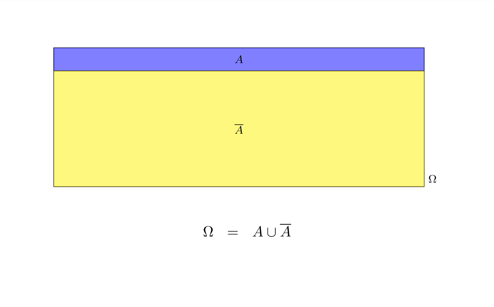
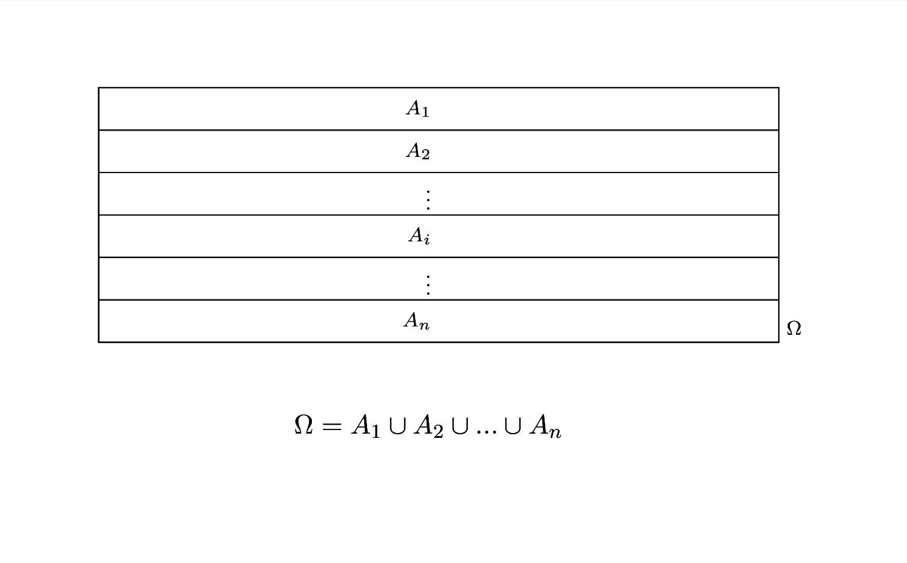

\part{Probabilità}


```{r 05-Probabilita-1,,echo=F,include=FALSE}
#rm(list = ls())


source("intro.R")
```


# Cenni di Teoria della probabilità

## Concetti di base 

La definizione più moderna che possiamo dare è che

> *La probabilità è una misura dell'incertezza*

che un osservatore *razionale* esprime sull'accadibilità di un evento.

Questa definizione consente di ampliare i campi di applicazione della
teoria della probabilità oltre il mero calcolo dei giochi d'azzardo. Ma
per arrivare a questa definizione molto ampia, matematici, scienziati e
filosofi discutono di caso, caos, disordine, frequenza, probabilità,
possibilità, verosimiglianza, ecc. da diversi secoli. La storia della
filosofia e del calcolo della probabilità è affascinate e complessa ed
esula dagli obiettivi di questi appunti. Rimando ai più curiosi il libro
di Costantini e Geymonat:

> D. Costantini e L. Geymonat, Filosofia della probabilità, Feltrinelli,
> Milano 1982.

### Eventi

Un evento $E$ è un *fatto* (potenzialmente verificabile), espresso nel
linguaggio comune, che non sappiamo se è vero o se è falso:

-   uscirà 6 dal lancio di un dado (perfetto).
-   uscirà testa dal lancio di una moneta non regolare.
-   Domani pioverà.
-   l'indice Dow Jones tra un'ora quoterà 35 000.

Dicendo che il *fatto* deve essere *potenzialmente verificabile*
escludiamo tutti quegli eventi che sono fuori dalla portata dei nostri
sensi. Ovvero speculare sull'esistenza di Dio o della vita dopo la morte
o di scenari ipotetici nel passato non è compito della probabilità.

### Algebra degli eventi

Usiamo gli operatori dell'insiemistica per combinare gli eventi tra di
loro, trasformando le operazioni sintattiche del linguaggio comune in
unioni ed intersezioni di eventi.

::: {.info data-latex=""}
::: {.definition name="Unione tra Eventi"}
Siano $A$ e $B$ due eventi, l'espressione $$
A\cup B
$$ è vera se **almeno uno dei due** è vero.
:::
:::

::: {.example}
\begin{eqnarray*}
    A&=&  \text{Domani pioverà}\\
    B&=&  \text{Domani ci sarà traffico}
\end{eqnarray*} $$
A\cup B\qquad\text{sarà vera se domani pioverà }\textbf{o}\text{ ci sarà traffico }\textbf{o}\text{ ci sarà pioggia e traffico.}
$$
:::

::: {.info data-latex=""}
::: {.definition name="Intersezione tra Eventi"}
Siano $A$ e $B$ due eventi, l'espressione $$
A\cap B\qquad\text{è vera se è vero $A$ }\textbf{e}\text{  è vero $B$.}
$$
:::
:::

::: {.example}
\begin{eqnarray*}
    A&=&  \text{Domani pioverà}\\
    B&=&  \text{Domani ci sarà traffico}
\end{eqnarray*} 
$$
A\cap B\qquad\text{sarà vera se domani pioverà }\textbf{e}\text{ ci sarà traffico.}
$$
:::

::: {.info data-latex=""}
::: {.definition name="Evento Complementare"}
Sia $A$ un evento, si definisce $\bar A$ l'evento complementare di $A$
:::
:::

::: {.example}
\begin{eqnarray*}
    A&=&  \text{Domani pioverà}\\
    \bar A&=&  \text{Domani }\textbf{non}\text{ pioverà}
\end{eqnarray*}
:::

\[
\text{domani}\textbf{ non}\text{ pioverà}
\]

::: {.info data-latex=""}
::: {.definition name="Evento Certo"}
Sia $A$ un evento, si definisce l'evento certo $\Omega$ l'evento:
\begin{eqnarray*}
\Omega &=& A\cup\bar A
\end{eqnarray*}
:::
:::

::: {.example}

\begin{eqnarray*}
    A&=&  \text{Domani pioverà}\\
    \bar A&=&  \text{Domani }\textbf{non}\text{ pioverà}\\
    \Omega &=& \text{Domani o pioverà o non pioverà}
\end{eqnarray*}

:::

::: {.info data-latex=""}
::: {.definition name="Evento Impossibile"}
Sia $A$ un evento, si definisce l'evento certo $\emptyset$ l'evento:
\begin{eqnarray*}
\emptyset &=& A\cap\bar A
\end{eqnarray*}
:::
:::

::: {.example}

\begin{eqnarray*}
    A&=&  \text{Domani pioverà}\\
    \bar A&=&  \text{Domani }\textbf{non}\text{ pioverà}\\
    \emptyset &=& \text{Domani pioverà \bf e non pioverà}
\end{eqnarray*}

:::

### Operazioni su insieme

::: {.nota data-latex=""}
Gli operatori Unione $\cup$ e Intersezione $\cap$ si comportano sugli
insiemi come somme $+$ e moltiplicazione $\times$ si comportano sui
numeri. In particolare \begin{align*}
  A\cup B &=  B\cup A ,&&\text{prorietà commutativa}\\
  A\cap B &=  B\cap A ,&&\text{prorietà commutativa}\\
  (A\cup B)\cup C &=   A\cup (B\cup C),       &&\text{prorietà associativa}\\
  (A\cap B)\cap C &=   A\cap (B\cap C),       &&\text{prorietà associativa}\\
  (A\cup B)\cap C &=  (A\cap C)\cup(B\cap C), &&\text{prorietà distributiva}\\
  A\cup B\cap C   &=   A\cup (B\cap C),       &&\text{l'intersezione ha priorità sull'unione...}\\ 
  (A\cup B)\cap C &\ne A\cup (B\cap C),       &&\text{a meno di opportune parentesi}
\end{align*}
:::

### La probabilità è una funzione

La probabilità assegna ad ogni evento il grado di credibilità $$
P(A)
$$ indica la probabilità che l'evento $A$ sia vero. In particolare $$
P(A)=P(\Omega)=1
$$ se $A$ è un evento **certo** 
$$
P(A)=P(\emptyset)=0
$$ 

se $A$ è un evento **impossibile** e in generale 

$$
0\le P(A)\le 1
$$

### Definizioni di probabilità

-   approccio classico (Laplace)
-   approccio frequentista
-   approccio soggettivista

::: {.info data-latex=""}
::: {.definition name="Approccio Classico (Laplace)"}
la probabilità è il rapporto tra il numero dei casi favorevoli e il
numero dei casi possibili, posto che gli eventi siano tutti
equiprobabili.

$$
P(A)=\frac{\#(\text{casi favorevoli ad $A$} )}{\#(\text{casi totali} )}
$$
:::
:::

::: {.example}
Un'urna contiene 5 sfere Rosse, 3 sfere Blu e 2 Nere. La probabilità
dell'evento 
$$
R =\text{Estraggo una Rossa}
$$ 
è data da 
$$
P(R)=\frac{5}{5+3+2}=0.5
$$
:::

::: {.info data-latex=""}
::: {.definition name="Approccio Frequentista"}
**Postulato empirico del caso.**

In un gruppo di prove ripetute più volte *nelle stesse condizioni*,
ciascuno degli eventi possibili si presenta con una frequenza relativa
che tende alla probabilità all'aumentare del numero di prove; ossia

$$
P(A)=\frac{n_A}{n}+\epsilon_n
\quad\mbox{dove}\quad \epsilon_{n}\to 0 \quad\mbox{per}\quad n\to\infty .
$$
:::
:::

::: {.example}
Viene lanciata 200 vole una moneta (che non sappiamo se è bilanciata
oppure no), Si è osservato che 136 su 200 lanci sono TESTA La
probabilità dell'evento $$
T =\text{“Esce Testa''}
$$ è data da 
$$
P(T)\approx\frac{136}{200}=`r 136/200`
$$

Viene lanciata 2000 vole una moneta (che non sappiamo se è bilanciata
oppure no), Si è osservato che 1360 su 2000 lanci sono TESTA La
probabilità dell'evento 
$$
T =\text{“Esce Testa''}
$$ 
è data da 
$$
P(T)\approx\frac{1360}{2000}=`r 1360/2000`
$$

Ma saremo più *sicuri* che avendo lanciato solo 200 volte.
:::

::: {.definition name="Approccio Soggettivista"}
<!-- In questo approccio la probabilità è la rappresentazione formale dell'ignoranza -->

<!-- sulla previsione.  -->

L'approccio soggettivista alla probabilità, sviluppato da Bruno de
Finetti, si differenzia dagli approcci classico e frequentista. Secondo
de Finetti, la probabilità non è una proprietà intrinseca degli eventi,
ma rappresenta il grado di credenza o fiducia che un individuo assegna
all'accadimento di un certo evento. In questo contesto, la probabilità è
personale e varia da soggetto a soggetto, riflettendo l'informazione,
l'esperienza e il giudizio personale.

La probabilità soggettiva si esprime attraverso le scommesse. Per
esempio, dire che un evento ha probabilità del 60% equivale a dire che
si è disposti a scommettere con un rapporto di 3:2 in favore
dell'evento, sia come scommettitore che come allibratore. 
Questa visione mette in luce come le probabilità siano
strettamente legate alle decisioni e alle aspettative personali, e come
possano essere aggiornate in base a nuove informazioni (teoria
Bayesiana). 

L'approccio soggettivistico è particolarmente utile in situazioni dove i
dati sono limitati o dove è difficile definire una frequenza a lungo
termine, come nelle previsioni meteorologiche o nelle valutazioni di
rischio in ambiti finanziari o assicurativi.
:::

## Teoria di Kolmogorov

La teoria di Kolmogorov è una teoria matematica, estremamente
formalizzata, che non si preoccupa di assegnare le probabilità agli
eventi ma alle regole formali per assegnarla senza cadere in
contraddizioni. La teoria muove da 3 assiomi che andremo ad elencare tra
poco, di estremo *buon senso* e muove per definizioni e teoremi verso
strumenti di grande aiuto nella soluzione di problemi concreti.

::: definition
Sia $\Omega$ l'evento certo, Si definisce uno spazio probabilizzato
$\{\Omega,\mathscr{A},P\}$, dove $\mathscr{A}$ è un'algebra costruita su
$\Omega$ e $P$ è una misura di probabilità.
:::

### Algebra degli Eventi

L'algebra degli eventi è una particolare collezione di sottoinsiemi di
$\Omega$ che siamo interessati a probabilizzare. È uno spazio astratto
che etichetta tutte le i possibili eventi che possiamo costruire a
partire da alcuni eventi di partenza. Un'algebra degli eventi viene
solitamente indicata con una lettera calligrafica corsiva. In queste
pagine useremo il carattere tipografico $\mathscr{A}$.

$\mathscr{A}$: un insieme di sotto insiemi di $\Omega$, che contiene
l'insieme vuoto, tutto $\Omega$ ed è chiuso rispetto alle unioni e alle
intersezioni e al passaggio al complementare: se $A\in\mathscr{A}$ e
$B\in\mathscr{A}$ allora


\begin{eqnarray*}
  A\cup B &\in& \mathscr{A}\\
  A\cap B &\in& \mathscr{A}\\
  \bar A &\in& \mathscr{A}
  \end{eqnarray*}


::: {.example}
Per illustrare l'idea di un'algebra degli eventi con un esempio finito, consideriamo un insieme $\Omega$ che rappresenta lo spazio campionario di un semplice lancio di due monete. $\Omega$ è dato da tutte le possibili combinazioni dei risultati di due lanci di moneta: $\Omega = {\text{(T, T)}, \text{(T, C)}, \text{(C, T)}, \text{(C, C)}}$.

Certo, consideriamo ora il lancio di due monete. In questo caso, lo spazio campionario $\Omega$ è dato da tutte le possibili combinazioni dei risultati di due lanci di moneta: $\Omega = \{\text{(T, T)}, \text{(T, C)}, \text{(C, T)}, \text{(C, C)}\}$.

Costruiamo un'algebra degli eventi $\mathscr{A}$ per questo esperimento. Questa algebra potrebbe includere i seguenti sottoinsiemi di $\Omega$:

1. L'insieme vuoto $\emptyset$, che rappresenta l'evento impossibile.
2. L'intero insieme $\Omega$, che rappresenta l'evento certo.
3. Singoli elementi come $\{\text{(T, T)}\}$, $\{\text{(T, C)}\}$, $\{\text{(C, T)}\}$, $\{\text{(C, C)}\}$, che rappresentano gli eventi di ottenere specifiche combinazioni.
4. Combinazioni di questi eventi, come $\{\text{(T, T)}, \text{(T, C)}\}$, che rappresenta l'evento in cui la prima moneta mostra T, indipendentemente dal risultato della seconda moneta.

Questi sottoinsiemi rispettano le proprietà di un'algebra degli eventi:

- Contengono l'insieme vuoto e l'intero insieme $\Omega$.
- Sono chiusi rispetto alle operazioni di unione, intersezione e passaggio al complementare. Ad esempio:
   - Unione: $\{\text{(T, T)}\} \cup \{\text{(C, C)}\} = \{\text{(T, T)}, \text{(C, C)}\} \in \mathscr{A}$.
   - Intersezione: $\{\text{(T, T)}, \text{(T, C)}\} \cap \{\text{(T, T)}, \text{(C, T)}\} = \{\text{(T, T)}\} \in \mathscr{A}$.
   - Complementare: $\overline{\{\text{(T, T)}\}} = \{\text{(T, C)}, \text{(C, T)}, \text{(C, C)}\} \in \mathscr{A}$.

In questo modo, l'algebra degli eventi $\mathscr{A}$ cattura tutte le possibili combinazioni di eventi che possono verificarsi nel contesto di due lanci di moneta.

In definitiva

\begin{eqnarray*}
\mathscr{A}   &=&  \{\emptyset, \\
              && \text{(T, T)}, \text{(T, C)}, \text{(C, T)}, \text{(C, C)} \\
              && \{\text{(T, T)}\cup \text{(T, C)}\}, \{\text{(T, T)}\cup \text{(C, T)}\} , \{\text{(T, T)}\cup \text{(C, C)}\},\\
              && \{\text{(T, C)}\cup \text{(C, T)}\}, \{\text{(T, C)}\cup \text{(C, C)}\} , \{\text{(C, T)}\cup \text{(C, C)}\},\\
              && \{\text{(T, T)}\cup \text{(T, C)}\cup\text{(C,T)}\}, \{\text{(T, T)}\cup \text{(T, C)}\cup \text{(C, C)}\},\\
              && \{\text{(T, T)}\cup \text{(C, T)}\cup\text{(C,C)}\}, \{\text{(T, C)}\cup \text{(C, T)}\cup \text{(C, C)}\},\\
              && \Omega\}
\end{eqnarray*}
  


:::

### Assiomi di Kolmogorov

::: {.info data-latex=""}
La probabilità $P$ è una funzione che trasforma ogni evento $A$ di
$\mathscr{A}$ in un numero reale
$$P:\mathscr{A}\to\mathbb{R},~~\forall A\in\mathscr{A}$$

Tale che

$~~~~i.\phantom{i}\phantom{i}~$ $P(A)\ge 0,~\forall A\in\mathscr{A}$

$~~~~ii.\phantom{i}~$ $P(\Omega)=1$

$~~~~iii.~$
$\forall A,B\in\mathscr{A}:A\cap B=\emptyset, P(A\cup B)=P(A)+P(B)$
:::

La forza della teoria consiste nel ricavare tutti i risultati partendo
da questi 3 assiomi.

### Proprietà di $P$

Dagli assiomi precedenti possiamo ricavare diverse proprietà
interessanti di $P$ che non sono scritte in modo esplicito negli assiomi
ma si ricavano per dimostrazione.

::: {.info data-latex=""}
::: {.proposition name="Proprietà Principali di $P$"}
Tra le tante enunciamo le più immediate ed utili:

1.  $0\le P(A) \le 1,~\forall A\in\mathscr{A}$

2.  $P(\emptyset)=0$

3.  $P(A)=1-P(\bar A)$

4.  $P(A\cap B)=P(A)-P(A\cap \bar B)$

5.  $P(A\cup B)=P(A)+P(B)-P(A\cap B)$
:::
:::

::: {.proof}
Nell'ordine

1.  Dall'assioma *i* sappiamo che $$P(A)>0$$ e dall'assioma *ii* che
    $$P(\Omega)=1$$ Siccome $$A\cup\bar A=\Omega$$ in virtù dell'assioma
    *iii* otteniamo \begin{eqnarray*}
    P(A\cup\bar A)&=&  P(\Omega)\\
    P(A)+P(\bar A)&=& 1\\
    P(A)&\le& 1
    \end{eqnarray*}

2.  Siccome il complementare di $\Omega$ è l'insieme vuoto $$
    \bar\Omega=\emptyset
    $$ dalla 1. sappiamo che la probabilità è compresa tra zero ed 1 e
    quindi \begin{eqnarray*}
    P(\Omega\cup\emptyset)&=&  P(\Omega)\\
    P(\Omega)+P(\emptyset)&=& 1\\
    P(\emptyset)= 0
    \end{eqnarray*}

3.  Siccome $$A\cup\bar A=\Omega$$ in virtù dell'assioma *iii* otteniamo
    \begin{eqnarray*}
    P(A\cup\bar A)&=&  P(\Omega)\\
    P(A)+P(\bar A)&=& 1\\
    P(A)&=& 1-P(\bar A)
    \end{eqnarray*}

4.  Osserviamo che $$A=(A\cap B)\cup(A\cap\bar B)$$ e quindi
    \begin{eqnarray*}
    P(A)&=&  P((A\cap B)\cup(A\cap\bar B))\\
    P(A)&=&  P(A\cap B)+P(A\cap\bar B)\\
    P(A\cap B)&=& P(\bar A)-P(A\cap\bar B)\\
    P(A\cap\bar B)&=& P(\bar A)-P(A\cap B)   
    \end{eqnarray*}

5.  Notiamo che $$A\cup B=(A\cap\bar B)\cup(B\cap\bar A)\cup(A\cap B)$$
    cioè $A\cup B$ si può riscrivere come l'unione di tre eventi
    disgiunti $(A\cap\bar B)$, $(B\cap\bar A)$ e $\cup(A\cap B)$. e
    quindi \begin{eqnarray*}
    P(A\cup B)&=&P((A\cap\bar B)\cup(B\cap\bar A)\cup(A\cap B))\\
    P(A\cup B)&=&P(A\cap\bar B)+P(B\cap\bar A)+P(A\cap B)\\
    P(A\cup B)&=&P(A)-P(A\cap B)+P(B)-P(B\cap A)+P(A\cap B)\\
    P(A\cup B)&=&P(A)+P(B)-P(B\cap A)
    \end{eqnarray*} in figura \@ref(fig:demorgan) una rappresentazione
    grafica.
:::

```{r demorgan,fig.cap="Regola di De Morgan per due insiemi: la probabilità dell'unione è la somma della probilità di tre eventi disgiunti",echo=FALSE}
par(mar=c(0,0,0,0)+.1)
plot(c(0,10),c(0,10),axes = F,xlab="",ylab="",type="n",asp=.6)
rect(0,2,10,9)
text(9,8,expression(Omega),cex=2)
ellisse(3,5,2.8,2.1,col = ared,density=30,lwd=.1)
ellisse(7,5,2.8,2.1,col = iblue,density=30,angle=-45,lwd=.1)
text(2,5,expression(paste(A,intersect(bar(B)))),cex=1)
text(5,5,expression(paste(A,intersect(B))),cex=1)
text(8,5,expression(paste(B,intersect(bar(A)))),cex=1)
```

::: {.info data-latex=""}
:::: {.definition name="Eventi Incompatibili"}
$A$ e $B$ si dicono **incompatibili** se e solo se
$$A\cap B = \emptyset$$ in figura \@ref(fig:incomp) una rappresentazione
grafica.
::::
:::

```{r incomp,fig.cap="Regola di De Morgan per due insiemi: la probabilità dell'unione è la somma della probaiblità di tre eventi disgiunti",echo=FALSE}
par(mar=c(0,0,0,0)+.1)

plot(c(0,10),c(0,10),axes = F,xlab="",ylab="",type="n",asp=.8)
rect(0,2,10,9)
text(9,8,expression(Omega),cex=2)
ellisse(3,5,1.4,1.1,col = ared,density=30,lwd=.1)
ellisse(7,5,1.5,1.1,col = iblue,density=30,angle=-45,lwd=.1)
text(3,5,expression(A),cex=2)
text(7,5,expression(B),cex=2)
fig.def(titolo = F)
```

::: {.example}
Un'urna ha 8 palline bianche numerate da 1 a 8 e 5 palline nere numerate
da 5 a 9. L'evento $$A=\text{esce un numero inferiore a 4},$$ e l'evento
$$B=\text{esce una pallina nera},$$ Sono chiaramente incompatibili.
:::

## Probabilità Condizionata

La probabilità di un evento $A$ condizionata ad un evento $B$ risponde
alla domanda

> *Se* $B$ fosse vero, con quale probabilità sarebbe vero $A$?

::: {.info data-latex=""}
::: {#pcond .definition name="Probabilità Condizionata"}
Si definisce probabilità di $A$ condizionata a $B$ (probabilità di $A$
dato $B$) la quantità 
$$
P(A|B)=\frac{P(A\cap B)}{P(B)}
$$
:::
:::

::: {.example}
Un'urna ha 8 palline bianche numerate da 1 a 8 e 5 palline nere numerate
da 5 a 9. Si considerino l'evento
$$A=\text{esce un numero maggiore o uguale a 6},$$ e l'evento
$$B=\text{esce una pallina nera}.$$

Ovviamente \begin{eqnarray*}
   P(A)&=&  \frac{7}{13}=`r 7/13`\\
   P(B)&=&  \frac{5}{13}=`r 5/13`\\
   P(A\cap B)&=&  \frac{4}{13}=`r 4/13`
\end{eqnarray*} e infine \begin{eqnarray*}
   P(A|B)&=&  \frac{P(A\cap B)}{P(B)}\\
   &=&  \frac{\frac{4}{13}}{\frac{5}{13}}=`r 4/5`\\
   P(B|A)&=&  \frac{P(A\cap B)}{P(A)}\\
   &=&  \frac{\frac{4}{13}}{\frac{7}{13}}=`r 4/7`
\end{eqnarray*}
:::

La probabilità condizionata ci consente di esprimere la probabilità
dell'intersezione come prodotto di probabilità condizionate. Infatti in
alcune circostanze è più facile ricavare una probabilità condizionata
invece della probabilità dell'intersezione. La *Chain Rule* è il modo di
esprimere probabilità dell'intersezione come prodotto di condizionate.

Versione a coppie $$P(A\cap B)=P(A)P(B|A)=P(B)P(A|B)$$

la dimostrazione deriva direttamente dalla definizione \@ref(def:pcond).

Versione a triple $$P(A\cap B\cap C)=P(A)P(B|A)P(C|A\cap B)$$

Per mostrare la versione a triple basta analizzare prima l'intersezione
di due eventi $A$ e $B\cap C$, ovvero


\begin{eqnarray*}
   P(A\cap B\cap C)&=&  P(A\cap (B\cap C))\\
   &=&  P(A)P(B\cap C|A)\\
   &=&  P(A)P(B|A)P(C|A\cap B)
\end{eqnarray*}

Versione generale
$$P(A_1\cap A_2\cap A_3 \cap...\cap A_n)=P(A_1)P(A_2|A_1)P(A_3|_1\cap A_2)...P(A_{n}|A_1\cap A_2\cap ...\cap A_{n-1})$$

Per mostrare la versione generale basta iterare il ragionamento in
triplette.

### Indipendenza tra Eventi

L'**indipendenza** è un concetto estremamente importante in probabilità.
Se due eventi $A$ e $B$ sono *indipendenti* significa che l'accadere o
meno dell'uno non altera in alcun modo la probabilità dell'altro.

::: {.info data-latex=""}
::: {.definition name="Indipendenza tra Eventi"}
Due eventi $A$ e $B$ si dicono **indipendenti** se e solo se
\begin{eqnarray*}
P(A|B)&=&P(A)\\
P(B|A)&=&P(B)
\end{eqnarray*}
:::
:::

e quindi, se $A$ e $B$ sono indipendenti 
$$
P(A\cap B)=P(A)P(B)
$$ 
Infatti 
$$
P(A\cap B)=P(A)P(B|A)=P(A)P(B)
$$

### Indipendenza e Incompatibilità

Se $A$ e $B$ sono **incompatibili** allora **non** sono
**indipendenti**, vice versa se $A$ e $B$ sono **indipendenti** allora
**non** sono **incompatibili**:

::: {.att data-latex=""}
-   Se $A\ne \emptyset$ e $B\ne \emptyset$ sono incompatibili, allora
    $P(A\cap B)=0\ne P(A)P(B)$
-   Se $A$ e $B$ sono indipendenti, allora $P(A\cap B)=P(A)P(B)\ne 0$
:::

### Partizioni di $\Omega$

Un *partizione* di $\Omega$ è una collezione di due o più eventi
disgiunti che uniti insieme restituiscono $\Omega$. Se $A$ è un evento e
$\bar A$ è il suo complementare è immediato che la coppia $\{A,\bar A\}$
è una *partizione* in quanto $A\cup\bar A=\Omega$. In questo caso
parleremo di *bipartizione*.

::: {.definition name="Bipartizione"}
Sia $A$ è un evento e $\bar A$ è il suo complementare, allora la coppia
$\{A,\bar A\}$ è una *bipartizione* di $\Omega$.
:::

```{r,out.height="35%"}
library(knitr)

```


<!-- {out.width="50%"} -->

Più in generale definiamo una *partizione finita*:

::: {.definition name="Partizione finita"}
Sia $\{A_1,...,A_n\}$, $n<+\infty$ una collezione di eventi di $\Omega$
tali che

1.  $A_i\cap A_j=\emptyset, ~\forall i\ne j$
2.  $\bigcup_{i=1}^n A_i=\Omega$

Allora $\{A_1,...,A_n\}$ è detta una *partizione* (finita) di $\Omega$
:::

```{r,out.height="35%"}
library(knitr)

```

<!-- {out.width="50%"} -->

### Teorema delle probabilità totali

Il teorema dell probabilità totali permette di esprime la probabilità un
evento come somma della probabilità delle intersezioni che lo
compongono.

::: {.info data-latex=""}
::: {.theorem name="Probabilità Totali versione a coppie"}
Siano $A$ e $B$ due eventi diversi dal vuoto, allora \begin{eqnarray*}
P(B)&=&P(A)P(B|A)+P(\bar A)P(B|\bar A)
\end{eqnarray*}
:::
:::

```{r,out.height="35%"}
library(knitr)
include_graphics("img/2x2.png")
```

<!--  -->

::: {.proof}
Si parte considerando l'identità insiemistica 
$$
B = (A\cap B) \cup (\bar A \cap B)
$$ 
e quindi 
\begin{eqnarray*}
  P(B)&=&P(A\cap B)+P(\bar A\cap B)\\
  &=& P(A)P(B|A)+P(\bar A)P(B|\bar A), \qquad \text{per la chain rule}
\end{eqnarray*}
:::

::: {.example}
Quando piove Giulio arriva in ritardo con probabilità 0.18, mentre se
non piove arriva in ritardo con probabilità 0.01. Le previsioni del
tempo dicono che domani pioverà con probabilità 0.85. Calcolare la
probabilità che Giulio, domani, arrivi in ritardo.

**Soluzione.** Sia $B=\text{“Domani Giulio arriverà in ritardo''}$ e sia
$A=\text{“Domani pioverà''}$. Sappiamo dalle previsioni che $P(A)=0.85$,
mentre $P(\bar A)=1-0.85=0.15$. Inoltre sappiamo che $P(B|A)=0.18$
mentre $P(B|\bar A)=0.01$ Inoltre osserviamo che $B$ si può dividere
nell'intersezione in due insiemi disgiunti: piove *ed* arriva in ritardo
*oppure* non piove *ed* arriva in ritardo, in simboli

$$
B = (A\cap B) \cup (\bar A \cap B)
$$

Dal teorema dell probabilità totali

\begin{eqnarray*}
P(B)&=&P(A)P(B|A)+P(\bar A)P(B|\bar A)\\
&=& 0.85\times 0.18 + 0.15\times 0.01\\
&=& `r .85*.18+.15*.01`
\end{eqnarray*}
:::

Il teorema può essere esteoso alla versione a triple: Siano $\{A_1,A_2,A_3\}$ e $\{B_1,B_2,B_3\}$ due partizioni di $\Omega$:
$A_1\cap A_2=\emptyset, ~A_1\cap A_3=\emptyset,~A_2\cap A_3=\emptyset$ e
$\Omega=B_1\cup B_2\cup B_3$, e $B_1\cap B_2=\emptyset, ~B_1\cap B_3=\emptyset,~B_2\cap B_3=\emptyset$ e $\Omega=B_1\cup B_2\cup B_3$. Allora


\begin{eqnarray*}
P(B_1)&=&P(A_1)P(B_1|A_1)+P(A_2)P(B_1| A_2)+(A_3)P(B_1| A_3)\\
P(B_2)&=&P(A_1)P(B_2|A_1)+P(A_2)P(B_2| A_2)+(A_3)P(B_2| A_3)\\
P(B_3)&=&P(A_1)P(B_3|A_1)+P(A_2)P(B_3| A_2)+(A_3)P(B_3| A_3)\\
\end{eqnarray*}

::: {.info data-latex=""}
::: {.theorem name="Probabilità Totali versione Generale"}
Siano $\{A_1,...,A_n\}$ e $\{B_1,...,B_m\}$ due partizioni di $\Omega$, ovvero
$A_i\cap A_j=\emptyset, ~\forall i\ne j$ e $\Omega=\bigcup_{i=1}^n A_i$ e 
$B_i\cap B_j=\emptyset, ~\forall i\ne j$ e $\Omega=\bigcup_{i=1}^n B_i$
Allora 

$$
P(B_j)=\sum_{i=1}^nP(A_i)P(B_j|A_i),\qquad j=1,...,m
$$
:::
:::

```{r,out.height="35%"}
library(knitr)
include_graphics("img/nxm.png")
```

<!--  -->

::: {.proof}
Si parte considerando l'identità insiemistica

$$
B_j = (A_1\cap B_j) \cup ( A_2 \cap B_j) \cup ... \cup ( A_n \cap B_j)
$$

e quindi


\begin{eqnarray*}
P(B_j)&=&P(A_1\cap B_j)+P( A_2\cap B_j)+...+P( A_n\cap B_j)\\
&=& P(A_1)P(B_j|A_1)+P(A_2)P(B_j|A_2)+...+P(A_n)P(B_j|A_n), \qquad \text{per la chian rule}\\
&=& \sum_{i=1}^nP(A_i)P(B_j|A_i)
\end{eqnarray*}

:::

::: {.example}
Un'urna contiene 10 palline: due etichettate con $A$, tre etichettate
con $B$ e le rimanenti cinque etichettate con $C$. Se si estrae la
pallina $A$ si estrae da l'urna $\mathcal{A}$ che contiene 3 palline
vincenti e una perdente, se si estrae la pallina $B$ si estrae da l'urna
$\mathcal{B}$ che contiene due palline vincenti e una perdente e se si
estrae la pallina $C$ si estrae da l'urna $\mathcal{C}$ che contiene 1
pallina vincente e due perdenti. Qual è la probabilità di vincere?

**Soluzione.** Anzitutto notiamo che

\begin{eqnarray*}
P(A)&=&\frac 2{10}\\
P(B)&=&\frac 3{10}\\
P(C)&=&\frac 5{10}
\end{eqnarray*} Sia $V=\text{“Vincere''}$, dai dati abbiamo che


\begin{eqnarray*}
P(V)&=&P(A)P(V|A)+P(B)P(V| B)+(C)P(V| C)\\
&=& \frac 2{10} \times \frac 34 + \frac 3{10} \times \frac 23 + \frac 5{10} \times \frac 13\\
&=& `r 2/10*3/4+3/10*2/3+5/10*1/3`
\end{eqnarray*}

:::

### Il Teorema di Bayes

Il teorema di Bayes è un risultato probabilitistico che consente di
esprimere le probabilità condizionate ed è utilizzato come base per
quella che è nota come teoria statistica bayesiana, di cui non entreremo
nel dettaglio.

::: {.info data-latex=""}
::: {.theorem name="Teorema di Bayes versione a coppie."}
Si considerino due eventi $A$ e $B$ di cui sono note $P(A)$, $P(B|A)$ e
$P(B|\bar A)$, allora

$$
P(A|B)=\frac{P(A)P(B|A)}{P(A)P(B|A)+P(\bar A)P(B|\bar A)}
$$
:::
:::

::: {.proof}

\begin{align*}
P(A|B)&=\frac{P(A\cap B)}{P(B)}, &&\text{per definizione}\\
&= \frac{P(A)P(B|A)}{P(B)},&& \text{per la chain rule}\\
&= \frac{P(A)P(B|A)}{P(A)P(B|A)+P(\bar A)P(B|\bar A)},&& \text{per il teorema delle prob. tot.}
\end{align*}

:::

::: {.example}
Quando piove Giulio arriva in ritardo con probabilità 0.18, mentre se
non piove arriva in ritardo con probabilità 0.01. Le previsioni del
tempo dicono che domani pioverà con probabilità 0.85. Se il giorno dopo
Giulio entrasse in ritardo con qual probabilità avrebbe piovuto?

**Soluzione.** Sia $B=\text{“Domani Giulio arriverà in ritardo''}$ e sia
$A=\text{“Domani pioverà''}$. Sappiamo dalle previsioni che $P(A)=0.85$,
mentre $P(\bar A)=1-0.85=0.15$. Inoltre sappiamo che $P(B|A)=0.18$
mentre $P(B|\bar A)=0.01$ Inoltre osserviamo che $B$ si può dividere
nell'intersezione in due insiemi disgiunti: piove *ed* arriva in ritardo
*oppure* non piove *ed* arriva in ritardo, in simboli

$$
B = (A\cap B) \cup (\bar A \cap B)
$$

Dal teorema dell probabilità totali


\begin{eqnarray*}
P(B)&=&P(A)P(B|A)+P(\bar A)P(B|\bar A)\\
&=& 0.85\times 0.18 + 0.15\times 0.01\\
&=& `r .85*.18+.15*.01`
\end{eqnarray*}

Dal teorema di Bayes


\begin{eqnarray*}
P(B|A)&=&\frac{P(A)P(B|A)}{P(A)P(B|A)+P(\bar A)P(B|\bar A)}\\
&=& \frac{0.85\times 0.18}{0.85\times 0.18 + 0.15\times 0.01}\\
&=& `r .85*.18/(.85*.18+.15*.01)`
\end{eqnarray*}

:::

::: {.info data-latex=""}
::: {.theorem name="Teorema di Bayes versione Generale"}
Siano $\{A_1,...,A_n\}$ e $\{B_1,...,B_n\}$ due partizioni di $\Omega$,
di cui sono note $P(A_i), \forall i$ e $P(B_j|A_i), \forall i,j$, allora
$$
P(A_i|B_j)=\frac{P(A_i)P(B_j|A_i)} {\sum_{i=1}^nP(A_i)P(B|A_i)}
$$
:::
:::

::: {.example}
Un'urna contiene 10 palline: due etichettate con $A$, tre etichettate
con $B$ e le rimanenti cinque etichettate con $C$. Se si estrae la
pallina $A$ si estrae da l'urna $\mathcal{A}$ che contiene 3 palline
vincenti e una perdente, se si estrae la pallina $B$ si estrae da l'urna
$\mathcal{B}$ che contiene due palline vincenti e una perdente e se si
estrae la pallina $C$ si estrae da l'urna $\mathcal{C}$ che contiene 1
pallina vincente e due perdenti. Giulio ha appena giocato e ha vinto,
qual è la probabilità che sia uscita una pallina etichettata con $C$?

**Soluzione.** Anzitutto notiamo che

\begin{eqnarray*}
P(A)&=&\frac 2{10}\\
P(B)&=&\frac 3{10}\\
P(C)&=&\frac 5{10}
\end{eqnarray*} Sia $V=\text{“Vincere''}$, dai dati abbiamo che

\begin{eqnarray*}
P(V)&=&P(A)P(V|A)+P(B)P(V| B)+(C)P(V| C)\\
&=& \frac 2{10} \times \frac 34 + \frac 3{10} \times \frac 23 + \frac 5{10} \times \frac 13\\
&=& `r 2/10*3/4+3/10*2/3+5/10*1/3`
\end{eqnarray*} In virtù del teorema di Bayes


\begin{eqnarray*}
P(C|V)&=&\frac{P(C)P(V| C)}{P(A)P(V|A)+P(B)P(V| B)+P(C)P(V| C)}\\
&=& \frac{\frac 5{10} \times \frac 13}{\frac 2{10} \times \frac 34 + \frac 3{10} \times \frac 23 + \frac 5{10} \times \frac 13}\\
&=& `r 5/10*1/3/(2/10*3/4+3/10*2/3+5/10*1/3)`
\end{eqnarray*}

:::

\clearpage

## Specchietto finale utile per gli esercizi elementari

::: {.info2 data-latex=""}
<div style="font-size:0.8em;">
```{r 05-Probabilita-2,, echo=F,results='asis'}
# 
# if ( html){ f1 <- " "; f2 <- " "}   # se html usa questi
# if (!html) {f1 <- "\\bf"; f2 <- "\\rm"} # se pdf usa questi
# 
# r1 <- c( "$0\\le P(A) \\le 1,~\\forall A\\in\\mathscr{A}$", " ", "la probabilità è compresa tra 0 e 1.")
# r2 <- c(" $P(\\Omega)=1$","","la prob. dell'evento certo è 1,")
# r21 <-  c("$P(\\emptyset)=0$,", " ", "la prob. dell'insieme vuoto è zero.")
# r3 <-  c("$P(A)=1-P(\\bar A)$", " ","regola del complementare")
# r4 <-  c("$P(A\\cup B)=P(A)+P(B)-P(A\\cap B)$", " ", "regola della somma (de Morgan)")
# r5 <-  c("$P(A\\cup B)=P(A)+P(B)$", " ", paste(f1," se e solo se $A$ e $B$ sono incompatibili:",f2))
# r51 <-  c(       "","","terzo assima di Kolmogorov")
# r6 <-  c("$P(A\\cap B)=P(A)P(B|A)=P(B)P(A|B)$", " ", "regola del prodotto (chain rule)")
# r7 <-  c("$P(A\\cap B)=P(A)P(B)$", " ", paste(f1,"se e solo se $A$ e $B$ sono indipendenti",f2))
# r8 <-  c("$P(B)=P(A)P(B|A)+P(\\bar A)P(B|\\bar A)$", " ", "Teorema delle probabilità totali")
# r9 <- c("","","")
# 
# spc <- data.frame(rbind(r1,r2,r21,r3,r4,r5,r51,r6,r7,r8))
# if(html) kable(spc,booktabs = T,escape = F,row.names = F,col.names = NULL,longtable = F,linesep = "")

r1 <- c( "0&\\le P(A) \\le 1,~\\forall A\\in\\mathscr{A}", "&&\\text{la probabilità è compresa tra 0 e 1.}")
r2 <- c(" P(\\Omega)&=1","&&\\text{la prob. dell'evento certo è 1,}")
r21 <-  c("P(\\emptyset)&=0", "&&\\text{la prob. dell'insieme vuoto è zero.}")
r3 <-  c("P(A)&=1-P(\\bar A)","&&\\text{regola del complementare}")
r4 <-  c("P(A\\cup B)&=P(A)+P(B)-P(A\\cap B)", "&&\\text{regola della somma (de Morgan)}")
r5 <-  c("P(A\\cup B)&=P(A)+P(B)", "&&\\textbf{se e solo se A e B sono incompatibili:}")
r51 <-  c(       "&","&&\\text{terzo assima di Kolmogorov}")
r6 <-  c("P(A\\cap B)&=P(A)P(B|A)=P(B)P(A|B)", "&&\\text{regola del prodotto (chain rule)}")
r7 <-  c("P(A\\cap B)&=P(A)P(B)", "&&\\text{se e solo se A e B sono indipendenti}")
r8 <-  c("P(B)&=P(A)P(B|A)+P(\\bar A)P(B|\\bar A)", "&&\\text{Teorema delle probabilità totali}")

spc <- data.frame(rbind(r1,r2,r21,r3,r4,r5,r51,r6,r7,r8))

{
  cat("\\begin{align*}\n")
  for (i in 1:(nrow(spc)-1)) cat(paste(spc[i,]),"\\\\ \n")
  cat(paste(spc[nrow(spc),]),"\n")
  cat("\\end{align*}\n")
}
#if (!html)

```
</div>
:::

\normalsize

<!-- $\phantom{-}$ -->
