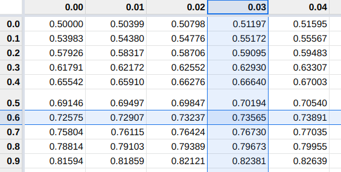
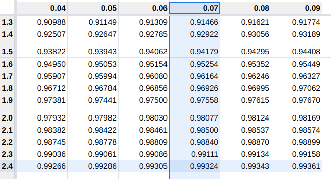

```{r setupnorm, include=FALSE}

source("intro.R")
```

## La VC Normale

### Obiettivo

L'obiettivo è trovare una variabile casuale che ci consenta di probabilizzare fenomeni simmetrici espressi in forma di misure:
  Temperatura di un locale, utile netto giornaliero di un negozio, errore commesso nel misurare una distanza, ecc.
Sono tutti fenomeni che si esprimono con numeri decimali a volte con una precisione che può essere indefinitamente aumentata (ad esempio il peso, il tempo, la temperatura, ecc.), che possono assumere anche valori negativi

```{r 07c-Normale-1,echo=F}

n <- 50
set.seed(3)
x <- rnorm(n,110,10)

hist(x,breaks = seq(80,140,by=5),freq = F,xlim = c(110-4*10,110+4*10),main = "Temperature orarie")
points(x,rep(0,n),pch=4,col=ared)
curve(dnorm(x,110,10),add=T,col=4,lwd=2)
```


### Storia


La distribuzione _Normale_ fu proposta da Gauss (1809) nell'ambito della teoria degli errori, ed
è stata attribuita anche a Laplace (1812), che ne definì le proprietà principali in anticipo rispetto alla trattazione più completa fatta da Gauss.

Nata in ambito  fisico, la distribuzione è detta _distribuzione degli errori accidentali_ in quanto la distribuzione degli errori commessi nel misurare ripetutamente una stessa grandezza, è molto bene approssimata da questa VC.
\[\text{Misura osservata}=\text{Misura vera}+\text{Errore di misura}\]
e dunque
\[\text{Errore di misura}=\text{Misura osservata}-\text{Misura vera}\]

L'errore di misura è, in tantissimo casi, simmetrico rispetto allo zero: 
\[P(\text{Errore di misura}>+\epsilon)=P(\text{Errore di misura}<-\epsilon), \forall \epsilon\geq 0\]
(la probabilità di sovrastimare la misura di una quantità maggiore $\epsilon$ è uguale alla probabilità di sottostimarla di una minore quantità $\epsilon$)
\[\lim_{\epsilon\to\infty}P(|\text{Errore di misura}|> \epsilon)=0\]

### Il modello

La VC _Normale_, $X\sim N(\mu,\sigma^2)$ è una distribuzione _continua_ con supporto
con supporto
\[S_X=[-\infty,+\infty]=\mathbb{R}\]
Dipende da due parametri $\mu$ e $\sigma^2$. Lo spazio dei parametri è
\[\Theta=\{(-\infty<\mu<+\infty)\cap(\sigma^2>0)\}=\mathbb{R}\times\mathbb{R}^+\]
Con densità di probabilità (non richiesta all'esame)
\[f(x)=\frac 1 {\sqrt{2\pi\sigma^2}}e^{-\frac 1 2 \left(\frac{x-\mu}{\sigma}\right)^2}, \qquad \text{Attenzione, in questo caso $\pi=3.1415...$ è la costante trigonometrica}\]
Descrizione:

  - ha forma _campanulare_;
  - è simmetrica rispetto al parametro $\mu$;
  - ha due punti di flesso in $\mu\pm\sigma$;

Con valore atteso e varianza:
\[E(X)=\mu, \qquad V(X)=\sigma^2\]


__Esempi__

```{r 07c-Normale-2,echo=F}
fig.def(titolo = F)
```

```{r 07c-Normale-3,echo=F}

m1 <- 3.2
s1 <- sqrt(.5)
m2 <- -4.1
s2 <- sqrt(2)
aaxx <- round(c(m2,0,m1),1)
curve(dnorm,-10,8,n = 501,ylim = c(0,.6),axes=F,ylab = expression(f(x)))
curve(dnorm(x,m1 ,s1),-10,8,n = 501,add=T,col=ared)
curve(dnorm(x,m2,s2),-10,8,n = 501,add=T,col=4)
axis(1,at=aaxx)
segments(aaxx,0,aaxx,dnorm(aaxx,c(m2,0,m1),c(s2,1,s1)),col=c(4,1,2),lty=2)
legend(-9,.55,legend = c(
  expression(mu == -4.1 ~~ sigma^2 == 2),
  expression(mu == ~ ~ 0 ~ ~~ sigma^2 == 1),
  expression(mu == ~ ~ 3.2 ~~ sigma^2 == 0.5)
  ),
  text.col = c(4,1,2)
  )
axis(2)
```


Esempio $X\sim N(5,2.25)$, posizione dei flessi

```{r 07c-Normale-4,echo=F}

ss <- 2.25
s  <- sqrt(ss)
curve(dnorm(x,5,s),5-3*s,5+3*s,axes = F,ylab=expression(f(x)))
axis(1,c(5-s,5,5+s),labels = c(expression(5-sqrt(2.25)==3.5),5,expression(5+sqrt(2.25)==6.5)))
axis(2)
segments(c(5-s,5,5+s),0,  c(5-s,5,5+s),dnorm(c(5-s,5,5+s),5,s),lty=2)
```


### Proprietà della Normale

La normale gode di molte proprietà interessanti, tutte le combinazioni lineari di
una normale sono normali e anche la combinazione lineare di normali indipendenti 
è normale. Più formalmente

::: {.proposition name="Proprietà della Normale"}
Le principali proprietà dell normale sono

1. Sia $X\sim N(\mu,\sigma^2)$, posto
\[Y=a+bX,\qquad\text{$a$ e $b$ due numeri reali qualunque}\]
allora
\[Y\sim N(a+b\mu,b^2\sigma^2)\]
2. Siano $X_1, X_2,...,X_n$, $n$ VC indipendenti, tali che
\[X_i\sim N(\mu_i,\sigma_i^2)\]
posto
\[Y=a_1X_1+...+a_nX_n\]
dove $a_1,...,a_n$ sono $n$ numeri reali qualunque, allora
\[Y\sim N(a_1\mu_1+...+a_n\mu_n,a_1^2\sigma_1^2+...a_n^2\sigma_n^2)\]
:::

Il punto 1. ci dice che ogni normale è legata ad un'altra, infatti se $X\sim N(\mu_X,\sigma_X^2)$ e $Y\sim N(\mu_Y,\sigma_Y^2)$, allora
\[
\mu_Y+\frac{\sigma_Y}{\sigma_X}\cdot (X-\mu_X)\sim N(\mu_Y,\sigma_Y^2)
\]

Il punto 2. ci dice che la combinazione lineare di normali indipendenti è normale,
con media e varianza che si combinano secondo le regole di media e varianza.

__Casi speciali per $n=2$ __

Se $X_1\sim N(\mu_1,\sigma^2_1)$ e $X_2\sim N(\mu_2,\sigma^2_2)$ allora:
\[X_1+X_2\sim N(\mu_1+\mu_2,\sigma^2_1+\sigma^2_2)\]

::: {.att data-latex=""}
**Attenzione**
\[X_1-X_2\sim N(\mu_1-\mu_2,\sigma^2_1\color{red}+\color{black}\sigma^2_2)\]
:::

:::: {.example}
Sia $X_1\sim N(2.1,3.4)$ e $X_2\sim N(5.2,2.7)$, allora
\begin{eqnarray*}
  X_1 + X_2 &\sim& N(2.1+5.2=7.3,\quad 3.4+2.7=6.1)\\
  X_1 - X_2 &\sim& N(2.1-5.2=-3.1,\quad 3.4+2.7=6.1)
\end{eqnarray*}
::::

**Spiegazione**

Dalla proprietà 2. osserviamo che, se $X_1\sim N(\mu_1,\sigma_1^2)$ e $X_2\sim N(\mu_2,\sigma_2^2)$
posto
\[Y=X_1-X_2\]
allora
\[Y = (+1)X_1+(-1)X_2\]

$a_1= +1$, $a_2= -1$ e dunque
\begin{eqnarray*}
  Y &\sim& N((+1)\mu_1+(-1)\mu_2,(+1)^2\sigma_1^2+(-1)^2\sigma_2^2)\\
    &\sim& N(\mu_1-\mu_2,\sigma_1^2+\sigma_2^2)
\end{eqnarray*}

Nella differenza di due normali le medie si **sottraggono** le varianze si **sommano**.

### La normale standard

Si definisce la _Normale Standard_ la normale con parametri $\mu=0$ e $\sigma^2=1$. Viene indicata con la lettera $Z$, $Z\sim N(0,1)$.

Dalla proprietà 1. si osserva che se $X\sim N(\mu,\sigma^2)$, posto
\[Z=\frac {X-\mu}\sigma= -\frac\mu\sigma+\frac 1 \sigma X\]
allora
\[E(Z) = -\frac\mu\sigma+\frac 1 \sigma E(X)= -\frac\mu\sigma+\frac \mu \sigma =0\]
e
\[V(Z)=\left(\frac 1 \sigma \right)^2V(X)=\frac {\sigma^2 }{\sigma^2}=1\]

Sia $Z\sim N(0,1)$, siano $\mu$ e $\sigma^2>0$ due numeri qualunque, posto
\[X=\mu+\sigma Z\]
allora
\[X\sim N(\mu,\sigma^2)\]

Quindi tutte le normali sono legate tra di loro, in particolare sono tutte legate alla Normale Standard.

La normale standard ha densità di probabilità chiama $\phi$ (da non richiesta all'esame)
\[
\phi(z)=\frac 1 {\sqrt{2\pi}}e^{-\frac 1 2 z^2}
\]

È una funzione simmetrica intorno a zero e dunque:
\[\phi(-z)=\phi(z)\]


```{r 07c-Normale-5,echo=F}

curve(dnorm,-4,4,axes = F,ylab=expression(varphi(z)), xlab=expression(z))
axis(1)
axis(2)

fig.def(height = 3.5)

```


```{r 07c-Normale-6,echo=F}


par(mfrow=c(2,2),cex=cex*.8)

curve(dnorm,-4,4,axes = F,ylab=expression(varphi(z)), xlab=expression(z))
draw_dist(dist = dnorm,-1,1,col=ablue)
axis(1,at=c(-1,0,1))
axis(2)
title(expression(P(paste(-1 < Z)  <= +1))) 
text(0,0.1,round(pnorm(1)-pnorm(-1),4),cex=cex*1.5)


curve(dnorm,-4,4,axes = F,ylab=expression(varphi(z)), xlab=expression(z))
draw_dist(dist = dnorm,-2,2,col=ablue)
axis(1,at=c(-2,0,2))
axis(2)
title(expression(P(paste(-2 < Z)  <= +2))) 
text(0,0.1,round(pnorm(2)-pnorm(-2),4),cex=cex*1.5)


curve(dnorm,-4,4,axes = F,ylab=expression(varphi(z)), xlab=expression(z))
draw_dist(dist = dnorm,-3,3,col=ablue)
axis(1,at=c(-3,0,3))
axis(2)
title(expression(P(paste(-3 < Z)  <= +3))) 
text(0,0.1,round(pnorm(3)-pnorm(-3),4),cex=cex*1.5)


curve(dnorm,-4,4,axes = F,ylab=expression(varphi(z)), xlab=expression(z))
draw_dist(dist = dnorm,-4,4,col=ablue)
axis(1,at=c(-4,0,4))
axis(2)
title(expression(P(paste(-4 < Z)  <= +4))) 
text(0,0.1,round(pnorm(4)-pnorm(-4),4),cex=cex*1.5)

```

### La Funzione di Ripartizione della Normale Standard


Si definisce $\Phi$ la funzione di ripartizione della normale standard, $Z\sim N(0,1)$
\[\Phi(z)=P(Z\leq z)=\int_{-\infty}^z\phi(t)dt\]

Rappresenta la probabilità che la variabile $Z$ assuma un valore minore o uguale a $z$

```{r 07c-Normale-31}
fig.def()
```

```{r 07c-Normale-7,echo=F}

par(mfrow=c(1,2),cex=cex)
curve(pnorm,-4,4,axes = F,ylab=expression(Phi(z)),lwd=2)
axis(1,c(-4,qnorm(.25),0,qnorm(.75),4),round(c(-4,qnorm(.25),0,qnorm(.75),4),2),las=2)
axis(2,(0:4)/4,las=2)
segments(qnorm(c(.25,0.5,.75)),0,qnorm(c(.25,0.5,.75)),c(.25,0.5,.75),lty=2)
segments(qnorm(c(.25,0.5,.75)),c(.25,0.5,.75),-5,c(.25,0.5,.75),lty=2)
abline(1,0,lty=3)
abline(0,0,lty=3)

curve(dnorm,-4,4,axes = F,ylab=expression(varphi(z)), xlab=expression(z))
curve(dnorm,-4,qnorm(.25),1001,type='h',add=T,col=darken(ablue,.3))
curve(dnorm,qnorm(.25),0,1001,type='h',add=T,col=darken(ablue,.2))
curve(dnorm,0,qnorm(.75),1001,type='h',add=T,col=darken(ablue,.1))
curve(dnorm,qnorm(.75),4,1001,type='h',add=T,col=darken(ablue,0))
# curve(dnorm,-4,qnorm(.25),1001,type='h',add=T,col='grey60')
# curve(dnorm,qnorm(.25),0,1001,type='h',add=T,col='grey70')
# curve(dnorm,0,qnorm(.75),1001,type='h',add=T,col='grey80')
# curve(dnorm,qnorm(.75),4,1001,type='h',add=T,col='grey90')
axis(1,c(-4,qnorm(.25),0,qnorm(.75),4),round(c(-4,qnorm(.25),0,qnorm(.75),4),2),las=3)
axis(2)
text(c(-1.25,-.3,.3,1.25),0.1,expression(frac(1,4)),cex=cex*2)
par(cex=cex)
par(cex=cex)
```

Osserviamo che

\begin{eqnarray*}
  \Phi(0) &=&  \frac 1 2 \\
  \Phi(z) &=& 1- \Phi(-z)
\end{eqnarray*}


```{r 07c-Normale-8,echo=F}
par(mfrow=c(1,2),cex=cex*.95)
z <- 1.1
curve(pnorm,-4,4,axes = F,ylab=expression(Phi(z)),xlab=expression(z))
axis(1,c(-4,z,0,4),c(-4,"z",0,4))
axis(2,c(0,pnorm(z),1),c(0,expression(Phi(z)),1),las=2)
segments(z,0,z,pnorm(z),lty=2)
segments(-4,pnorm(z),z,pnorm(z),lty=2)
title("La Funzione di Ripartizione della Normale Standard")
curve(dnorm,-4,4,axes = F,ylab=expression(varphi(z)),xlab=expression(z))
draw_dist(dist = dnorm,-4,z,col=ablue)
axis(1,c(-4,z,0,4),c(-4,"z",0,4))
axis(2)
text((-4+z)/2,0.05,expression(Phi(z)==P(Z<z)),cex=cex*1.5,pos=4)
```


```{r 07c-Normale-32}
fig.def(2.5,15)
```

```{r 07c-Normale-33}

par(mfrow=c(1,2),cex=cex)
z <- -2
Z <- c(-1.5,-1,0,2,3.5)
for(z in Z)
  {
  curve(pnorm,-4,4,axes = F,ylab=expression(Phi(z)),xlab=expression(z))
  axis(1,round(c(-4,z,0,4),2))
  axis(2,round(c(pnorm(z),1),4),las=2)
  segments(z,0,z,pnorm(z),lty=2)
  segments(-4,pnorm(z),z,pnorm(z),lty=2)
  title(paste("La Funzione di Ripartizione della Normale Standard Phi(-2)=",round(pnorm(-2),4)))
  curve(dnorm,-4,4,axes = F,ylab=expression(varphi(z)),xlab=expression(z))
  draw_dist(dist = dnorm,-4,z,col=ablue)
  
  axis(1,c(-4,z,0,4))
  axis(2)
  text((-4+z)/2,0.05,round(pnorm(z),4),cex=cex*2)
}
par(cex=cex)

fig.def(3.3)
```

<!-- $\Phi(z)=1-\Phi(-z)$ -->

```{r 07c-Normale-9,echo=F}

par(mfrow=c(2,2),cex=cex*.8)
z <- 1.5
curve(pnorm,-4,4,axes = F,ylab=expression(Phi(z)),xlab=expression(z))
axis(1,c(-4,-z,0,z,4),labels = c(-4,expression(-z),0,expression(+z),2))
axis(2,(c(pnorm(-z),pnorm(z))),labels = c(expression(Phi(-z)),expression(Phi(+z))),las=2)
segments(z,0,z,pnorm(z),lty=2)
segments(-4,pnorm(z),z,pnorm(z),lty=2)

segments(-z,0,-z,pnorm(-z),lty=2)
segments(-4,pnorm(-z),-z,pnorm(-z),lty=2)


curve(dnorm,-4,4,axes = F,ylab=expression(varphi(z)),xlab=expression(z))
draw_dist(dist = dnorm,z,4,col=ablue)

text(0,.1,expression(Phi(z)))
text(z+1,.1,expression(1-Phi(z)))
axis(1,c(-4,z,0,4),labels = c(-4,expression(z),0,4))
axis(2)


curve(dnorm,-4,4,axes = F,ylab=expression(varphi(z)),xlab=expression(z))
draw_dist(dist = dnorm,-4,-z,col=ablue)

axis(1,c(-4,-z,0,4),labels = c(-4,expression(-z),0,4))
axis(2)

text(0,.1,expression(1-Phi(-z)))
text(-(z+1),.1,expression(Phi(-z)))


par(cex=cex)
```


Esempio $z=-1.5$, $\Phi(-1.5)=1-\Phi(+1.5)=`r pnorm(-1.5)`$

```{r 07c-Normale-10,echo=F}
par(mfrow=c(2,2),cex=cex*.8)
z <- 1.5
curve(pnorm,-4,4,axes = F,ylab=expression(Phi(z)),xlab=expression(z))
axis(1,round(c(-4,-z,0,z,4),2))
axis(2,round(c(pnorm(-z),pnorm(z)),4),las=2)
segments(z,0,z,pnorm(z),lty=2)
segments(-4,pnorm(z),z,pnorm(z),lty=2)

segments(-z,0,-z,pnorm(-z),lty=2)
segments(-4,pnorm(-z),-z,pnorm(-z),lty=2)


curve(dnorm,-4,4,axes = F,ylab=expression(varphi(z)),xlab=expression(z))
draw_dist(dist = dnorm,z,4,col=ablue)

text(0,.1,paste(round(pnorm(z),4)))
text(z+1,.1,round(1-pnorm(z),4))
axis(1,c(-4,z,0,4))
axis(2)


curve(dnorm,-4,4,axes = F,ylab=expression(varphi(z)),xlab=expression(z))
draw_dist(dist = dnorm,-4,-z,col=ablue)

axis(1,c(-4,-z,0,4))
axis(2)

text(0,.1,paste(round(pnorm(z),4)))
text(-(z+1),.1,round(1-pnorm(z),4))


par(cex=cex)
```

Esempio $z=+1.5$, $\Phi(+1.5)=1-\Phi(-1.5)=`r pnorm(+1.5)`$

```{r 07c-Normale-11,echo=F}


par(mfrow=c(2,2),cex=cex*.8)
z <- -1.5
curve(pnorm,-4,4,axes = F,ylab=expression(Phi(z)),xlab=expression(z))
axis(1,round(c(-4,-z,0,z,4),2))
axis(2,round(c(pnorm(-z),pnorm(z)),4),las=2)
segments(z,0,z,pnorm(z),lty=2)
segments(-4,pnorm(z),z,pnorm(z),lty=2)

segments(-z,0,-z,pnorm(-z),lty=2)
segments(-4,pnorm(-z),-z,pnorm(-z),lty=2)


curve(dnorm,-4,4,axes = F,ylab=expression(varphi(z)),xlab=expression(z))
draw_dist(dist = dnorm,z,4,col=ablue)

text(0,.1,paste(round(pnorm(-z),4)))
text((z-1),.1,round(pnorm(z),4))
axis(1,c(-4,z,0,4))
axis(2)


curve(dnorm,-4,4,axes = F,ylab=expression(varphi(z)),xlab=expression(z))
draw_dist(dist = dnorm,-4,-z,col=ablue)

axis(1,c(-4,-z,0,4))
axis(2)

text(0,.1,paste(round(pnorm(-z),4)))
text(-z+1,.1,round(pnorm(z),4))


par(cex=cex)
```


### La tavole Statistiche della $Z$


La VC normale standard $Z\sim N(0,1)$ è tabulata nelle tavole statistiche. 
La tabulazione calcola $\Phi(z)$ per $z=0.00, 0.01,0.02,...,4.08,4.09$ 
I valori negativi non sono tabulati ma si ricavano dalle proprietà di simmetria della normale. 
Le tavole si presentano come una matrice dimensione $40\times 10$ 
Le righe rappresentano gli interi e i decimi di $z$, le colonne i centesimi

Esempi: \[\Phi(0)=\frac 1 2 = 0.5\]

```{r 07c-Normale-34}
xx <- seq(0,.09,by=0.01)
XX <- seq(0,4,by=0.1)
continua <- rep("...",times=length(xx))
tab <- format(outer(XX,xx,function(x,y)pnorm(x+y)))
dimnames(tab)[[1]] <- format(XX)
dimnames(tab)[[2]] <- format(xx)
kable(rbind(tab[1:5,],continua),row.names = T,booktabs = T, escape = F,linesep = "", digits = 4)%>%
  column_spec(2,color = ared,border_left = T,border_right = T)%>%
  row_spec(1,color = ared,hline_after = T)

fig.def(height = 2.5,titolo = F)
```

```{r 07c-Normale-12,echo=F}
z <- 0
par(cex=cex*.8)
curve(dnorm,-4,4,axes = F,ylab=expression(varphi(z)),xlab=expression(z))
draw_dist(dist = dnorm,-4,z,col=ablue)
text(-.5,.1,paste(round(pnorm(z),4)),cex=2)

axis(1,c(-4,z,0,4))
axis(2)
```

Esempi $\Phi(0.63)=`r pnorm(.63)`$

```{r 07c-Normale-35}
xx <- seq(0,.09,by=0.01)
XX <- seq(0,4,by=0.1)
continua <- rep("...",times=length(xx))
tab <- format(outer(XX,xx,function(x,y)pnorm(x+y)))
dimnames(tab)[[1]] <- format(XX)
dimnames(tab)[[2]] <- format(xx)
kable(rbind(tab[1:8,],continua),row.names = T,booktabs = T, escape = F,linesep = "", digits = 4)%>%
  column_spec(5,color = ared,border_left = T,border_right = T)%>%
  row_spec(7,color = ared,hline_after = T)%>%
  row_spec(6,hline_after = T)
```

<!-- ```{r 07c-Normale-36} -->
<!--  -->
<!-- ``` -->


```{r 07c-Normale-13,echo=F}


z <- 0.63

curve(dnorm,-4,4,axes = F,ylab=expression(varphi(z)),xlab=expression(z))
draw_dist(dist = dnorm,-4,z,col=ablue)
text(-.5,.1,paste(round(pnorm(z),4)),cex=2)

axis(1,c(-4,z,4))
axis(2)
```

Esempi $\Phi(2.47)=`r pnorm(2.47)`$

```{r 07c-Normale-14,echo=F}


xx <- seq(0,.09,by=0.01)
XX <- seq(0,4,by=0.1)
dimnames(tab)[[1]] <- format(XX)
dimnames(tab)[[2]] <- format(xx)
kable(rbind(continua,tab[22:28,],continua),row.names = T,booktabs = T, escape = F,linesep = "", digits = 4)%>%
  column_spec(9,color = ared,border_left = T,border_right = T)%>%
  row_spec(5,color = ared,hline_after = T)%>%
  row_spec(4,hline_after = T)
```


<!-- ```{r } -->
<!--  -->
<!-- ``` -->


```{r 07c-Normale-15,echo=F}
z <- 2.47

curve(dnorm,-4,4,axes = F,ylab=expression(varphi(z)),xlab=expression(z))
draw_dist(dist = dnorm,-4,z,col=ablue)
text(-.5,.1,paste(round(pnorm(z),4)),cex=2)

axis(1,c(-4,z,4))
axis(2)
```

#### Uso delle tavole se $z<0$


Siccome
\[\Phi(-z)=1-\Phi(z)\]

allora
\[\Phi(z)=\begin{cases}
\text{se }z\geq 0, \qquad \Phi(z),\text{ da leggere direttamente dalle tavole}\\
\text{se } z < 0, \qquad 1-\Phi(+|z|)
\end{cases}\]

:::: {.example}
Calcolare $P(Z\leq 1.12)$: $1.12\geq 0$ e quindi dalle tavole 
\[P(Z\leq 1.12)=\Phi(1.12)=`r pnorm(1.12)`\]
::::

:::: {.example}
Calcolare $P(Z\leq -1.12)$: $-1.12< 0$ e quindi 
\[P(Z\leq -1.12)=\Phi(-1.12)=1-\Phi(+1.12)=`r 1-pnorm(1.12)`\]
::::

#### Calcolo di $P(Z>z)$


Ricordiamo che per definizione

\[\Phi(z)=P(Z\leq z)\]


Siccome il complementare di $\{Z\leq z\}$ è $\{Z> z\}$, dalle proprietà della probabilità abbiamo

\[P(Z>z)=1-P(Z\leq z)=1-\Phi(z)\]

```{r 07c-Normale-16,echo=F}
z <- 1.5


```


:::: {.example}
calcolare la probabilità che $Z$ si maggiore di `r z` 

\[P(Z > `r z`) = 1-\Phi(`r z`)=1-`r pnorm(z)`=`r 1-pnorm(z)`\]

```{r 07c-Normale-17,echo=F}

curve(dnorm,-4,4,axes = F,ylab=expression(varphi(z)),xlab=expression(z))
draw_dist(dist = dnorm,z,4,col=ablue)
text(z+.7,.1,paste(round(1-pnorm(z),4)),cex=2)

axis(1,c(-4,0,z,4))
axis(2)
```


```{r 07c-Normale-18,echo=F}
z <- -1.5
```
::::

:::: {.example}
Calcolare la probabilità che $Z$ si maggiore di `r z` 

\[P(Z > `r z`) = 1-\Phi(`r z`)=1-(1-\Phi(+`r -z`))=\Phi(+`r -z`)=`r pnorm(-z)`\]

```{r 07c-Normale-19,echo=F}

curve(dnorm,-4,4,axes = F,ylab=expression(varphi(z)),xlab=expression(z))
draw_dist(dist = dnorm,z,4,col=ablue)
text(z+.7,.1,paste(round(1-pnorm(z),4)),cex=2)

axis(1,c(-4,0,z,4))
axis(2)
```
::::

#### Calcolo della probabilità di intervalli

```{r 07c-Normale-20,echo=F}
z1 <- 0.25; z2 <- 2.1
```


Obiettivo: calcolare la probabilità che $Z$ si avveri nell'intervallo $(z_1,z_2]$.
Dalle proprietà della funzione di ripartizione abbiamo
\[P(z_1<Z\leq z_2) = \Phi(z_2)-\Phi(z_1)\]

:::: {.example}
Calcolare la probabilità che $Z$ si avveri tra `r z1` e `r z2`
\[P(`r z1`< Z \leq `r z2`) = \Phi(`r z2`)-\Phi(`r z1`)=`r pnorm(z2)`-`r pnorm(z1)`=`r pnorm(z2)-pnorm(z1)`\]

```{r 07c-Normale-21,echo=F}

curve(dnorm,-4,4,axes = F,ylab=expression(varphi(z)),xlab=expression(z))
draw_dist(dist = dnorm,z1,z2,col=ablue)
text((z1+z2)/2,.1,paste(round(pnorm(z2)-pnorm(z1),4)),cex=2)

axis(1,c(-4,z1,z2,4))
axis(2)
```

```{r 07c-Normale-22,echo=F}
z1 <- -1.22; z2 <- 0.78
```
::::

:::: {.example}
Calcolare la probabilità che $Z$ si avveri tra `r z1` e `r z2`
\begin{eqnarray*}
P(`r z1`< Z \leq `r z2`) &=& \Phi(`r z2`)-\Phi(`r z1`) \\
                         &=& \Phi(`r z2`)-(1-\Phi(+`r -z1`)) \\
                         &=& `r pnorm(z2)`-(1-`r pnorm(-z1)`)\\
                         &=& `r pnorm(z2)-pnorm(z1)`
\end{eqnarray*}

```{r 07c-Normale-23,echo=F}

curve(dnorm,-4,4,axes = F,ylab=expression(varphi(z)),xlab=expression(z))
draw_dist(dist = dnorm,z1,z2,col=ablue)
text((z1+z2)/2,.1,paste(round(pnorm(z2)-pnorm(z1),4)),cex=2)

axis(1,c(-4,z1,z2,4))
axis(2)
```

```{r 07c-Normale-24,echo=F}
z1 <- -2.8; z2 <- -0.12
fig.def()
```
::::

:::: {.example}
Calcolare la probabilità che $Z$ si avveri tra `r z1` e `r z2`
\begin{eqnarray*}
P(`r z1`< Z \leq `r z2`) &=& \Phi(`r z2`)-\Phi(`r z1`) \\
                         &=& (1-\Phi(+`r -z2`))-(1-\Phi(+`r -z1`)) \\
                         &=& \Phi(+`r -z1`)-\Phi(+`r -z2`)\\
                         &=& `r pnorm(z2)-pnorm(z1)`
\end{eqnarray*}

```{r 07c-Normale-25,echo=F}
par(mfrow=c(1,2),cex=cex*.8)
curve(dnorm,-4,4,axes = F,ylab=expression(varphi(z)),xlab=expression(z))
draw_dist(dist = dnorm,z1,z2,col=ablue)
text((z1+z2)/2,.01,paste(round(pnorm(z2)-pnorm(z1),4)),cex=1)

axis(1,c(-4,z1,z2,4))
axis(2)
curve(dnorm,-4,4,axes = F,ylab=expression(varphi(z)),xlab=expression(z))
draw_dist(dist = dnorm,-z2,-z1,col=ablue)
text(-(z1+z2)/2,.01,paste(round(pnorm(z2)-pnorm(z1),4)),cex=1)

axis(1,c(-4,-z1,-z2,4))
axis(2)
par(cex=cex)


```
::::


#### Calcolo su una normale qualunque $X\sim N(\mu,\sigma^2)$


Sia data $X\sim N(\mu,\sigma^2)$, obiettivo calcolare
\[P(x_1<X\leq x_2)\]
dove $x_1$ e $x_2$ sono due numeri reali qualunque.

Ricordiamo che
\[Z=\frac {X-\mu}\sigma,\qquad Z\sim N(0,1)\]

E dunque
\begin{eqnarray*}
P(x_1<X\leq x_2) &=& P\left( \frac {x_1 - \mu}\sigma < \frac {X - \mu}\sigma \leq \frac {x_2 - \mu}\sigma\right) \\
                  &=& P(z_1<Z\leq z_2)  
\end{eqnarray*}
dove $z_1=\frac {x_1 - \mu}\sigma$ e $z_2=\frac {x_2 - \mu}\sigma$

:::: {.example}

Sia $X\sim N(10,4)$, calcolare la probabilità che $7<X\leq 11$
\begin{eqnarray*}
P(7<X\leq 11) &=& P\left( \frac {7 - 10}{\sqrt{4}} < \frac {X - \mu}\sigma \leq \frac {11 - 10}{\sqrt{4}}\right)  \\
              &=& P\left( `r (7 - 10)/sqrt(4)` < Z \leq `r (11 - 10)/sqrt(4)`\right) \\
              &=& \Phi(`r (11 - 10)/sqrt(4)`)-\Phi(`r (7 - 10)/sqrt(4)`)\\
              &=& \Phi(`r (11 - 10)/sqrt(4)`)-(1-\Phi(`r -(7 - 10)/sqrt(4)`))\\
              &=& `r pnorm((11 - 10)/sqrt(4))`-(1-`r pnorm(-(7 - 10)/sqrt(4))`)\\
              &=& `r pnorm((11 - 10)/sqrt(4))-1+pnorm(-(7 - 10)/sqrt(4))`
\end{eqnarray*}

```{r 07c-Normale-37}
fig.def()
```

```{r 07c-Normale-26,echo=F}
mm <- 10
ss <-  2
x1 <- 7
x2 <- 11
par(mfrow=c(1,2),cex=cex*.8)
curve(dnorm(x,mm,ss),mm-4*ss,mm+4*ss,axes = F,ylab=expression(f(x)),xlab=expression(x))

draw_dist(dist = function(x)dnorm(x,mm,ss),x1,x2,col=ablue)
text((x1+x2)/2,0.02,paste(round(pnorm(x2,mm,ss)-pnorm(x1,mm,ss),4)),cex=1)

axis(1,c(mm-4*ss,x1,x2,mm+4*ss))
axis(2)
title(expression(X %~% N(mu,sigma^2)))
####
z1 <- (x1-mm)/ss
z2 <- (x2-mm)/ss
curve(dnorm,-4,4,axes = F,ylab=expression(varphi(z)),xlab=expression(z))
title(expression(Z %~% N(0,1)))
draw_dist(dist = dnorm,z1,z2,col=ablue)
text((z1+z2)/2,.04,paste(round(pnorm(z2)-pnorm(z1),4)),cex=1)

axis(1,c(-4,z1,z2,4))
axis(2)
par(cex=cex)

```

::::

Questa applicazione esemplifica l'uso delle tavole e risolve ogni tipo intervallo: [Normale](https://patrizio-frederic.shinyapps.io/normale/)

__Osservazione__


Abbiamo detto che per definizione la Funzione di Ripartizione di una VC $X$ è:
\[F(x)=P(X\leq x)\]

Nelle funzioni di ripartizione di VC _continue_, e quindi anche per la normale, accade che
\[P(X\leq x)\geq 0\]

ma
\[P(X=x)=0\]

e quindi, se $X$ è VC continua
\[P(X\leq x)=P(X<x)\]

e analogamente
\[P(X\geq x)=P(X>x)\]

Se $X$ è VC continua
\[P(x_1<X\leq x_2)=P(x_1\leq X \leq x_2)=P(x_1\leq X < x_2)=P(x_1<X<x_2)\]

#### Il problema inverso


Obbiettivo: data $Z\sim N(0,1)$, sia $0<\alpha<1$ un numero fissato, si cerca qual valore $z_\alpha$ tale che:
\[P(Z > z_\alpha)=\alpha\]

```{r 07c-Normale-27,echo=F}
par(mfrow=c(1,2),cex=cex*.8)
z <- 1
curve(pnorm,-4,4,axes = F,ylab=expression(Phi(z)),xlab=expression(z))
axis(1,c(-4,z,0,4),c(-4,expression(z[alpha],0,4)))
axis(2,c(0,pnorm(z),1),c(0,expression(1-alpha),1),las=2)
segments(z,0,z,pnorm(z),lty=2)
segments(-4,pnorm(z),z,pnorm(z),lty=2)

curve(dnorm,-4,4,axes = F,ylab=expression(varphi(z)),xlab=expression(z))
draw_dist(dist = dnorm,z,4,col=ablue)
text(-1,.01,expression(1-alpha))
text(2,.01,expression(alpha))

axis(1,c(-4,z,0,4),c(-4,expression(z[alpha]),0,4))
axis(2)

par(cex=cex)
```

:::: {.example}
Per $\alpha$ qualunque. 
Sia $\alpha=0.15$ cerchiamo quel valore $z_{0.15}$ tale che
\[P(Z>z_{0.15})=0.15\]

Dalla regola del complemento otteniamo
\[P(Z\leq z_{0.15})=1-0.15=0.85\]

Cerchiamo nelle tavole della normale quale valore di $z$ si avvicina di più a 0.85


```{r 07c-Normale-28,echo=F}


xx <- seq(0,.09,by=0.01)
XX <- seq(0,4,by=0.1)
dimnames(tab)[[1]] <- format(XX)
dimnames(tab)[[2]] <- format(xx)
kable(rbind(continua,tab[8:18,],continua),row.names = T,booktabs = T, escape = F,linesep = "", digits = 4)%>%
  column_spec(6,color = ared,border_left = T,border_right = T)%>%
  row_spec(5,color = ared,hline_after = T)%>%
  row_spec(4,hline_after = T)
```

e dunque $z_{0.15}\approx 1.04$

```{r 07c-Normale-29,echo=F}


par(mfrow=c(1,2),cex=cex*.8)
z <- 1.04
curve(pnorm,-4,4,axes = F,ylab=expression(Phi(z)),xlab=expression(z))
axis(1,c(-4,z,4))
axis(2,c(0,round(pnorm(z),2),1),las=2)
segments(z,0,z,pnorm(z),lty=2)
segments(-4,pnorm(z),z,pnorm(z),lty=2)

curve(dnorm,-4,4,axes = F,ylab=expression(varphi(z)),xlab=expression(z))
draw_dist(dist = dnorm,z,4,col=ablue)
text(-1,.01,0.85)
text(2,.01,0.15)

axis(1,c(-4,z,4))
axis(2)

par(cex=cex)
```
::::

#### Alcuni valori speciali di $\alpha$


Alcuni valori di $\alpha$ sono di particolare interesse per le future applicazioni questi valori sono
\[0.5,	0.25,	0.1,	0.05,	0.025,	0.01,	0.005,	0.001,	0.0005\]

Per tali valori le tavole della normale vengono arricchite con una tabella supplementare

```{r alpha}
options(digits = 4)
nam <- c("\\alpha","z_\\alpha","\\Phi(z_\\alpha)=1-\\alpha")
alp <- c(0.5,0.1,0.05,0.025,0.01,0.005,0.001,0.0005)
zap <- format(qnorm(1-alp),digits = 5)
pap <- 1-alp

r1 <- paste(nam[1],paste(alp,collapse = " & ",sep="& "),sep=" & ")
r2 <- paste(nam[2],paste(zap,collapse = " & ",sep="& "),sep=" & ")
r3 <- paste(nam[3],paste(pap,collapse = " & ",sep="& "),sep=" & ")
# prt <- cbind(nam,format(rbind(alp,zap,pap),nsmall = 3))
# paste(prt,collapse = "& ")
#include_graphics("img/img4.png",dpi=200)

#length(alp)
```

\[\begin{array}{lrrrrrrrr}
\hline
`r r1` \\
`r r2` \\
`r r3` \\
\hline
\end{array}\]

```{r 07c-Normale-30,echo=F}
par(mfrow=c(1,2),cex=cex*.8)
z <- qnorm(.90)
curve(pnorm,-4,4,axes = F,ylab=expression(Phi(z)),xlab=expression(z))
axis(1,c(-4,z,4),c(-4,expression(z[alpha]),4))
axis(2,c(0,round(pnorm(z),2),1),c(0,expression(1-alpha),1),las=2)
segments(z,0,z,pnorm(z),lty=2)
segments(-4,pnorm(z),z,pnorm(z),lty=2)

curve(dnorm,-4,4,axes = F,ylab=expression(varphi(z)),xlab=expression(z))
draw_dist(dist = dnorm,z,4,col=ablue)
text(-1,.01,expression(1-alpha))
text(2,.01,expression(alpha))

axis(1,c(-4,z,4),c(-4,expression(z[alpha]),4))
axis(2)

par(cex=cex)
```


:::: {.example}
Se $\alpha=0.1$ allora $z_{0.1}=1.2816$
\[P(Z>1.2816)=0.1,\qquad P(Z\leq 1.2816)=0.9\]
Se $\alpha=0.025$ allora $z_{0.025}=1.96$
\[P(Z>1.96)=0.025,\qquad P(Z\leq 1.96)=0.975\]
::::

\clearpage

### In Sintesi

:::: {.info2 data-latex=""}
Se $X$ è distribuita come una Normale di parametri $\mu$ e $\sigma^2$, allora

\begin{align*}
\text{Notazione} & & X&\sim N(\mu,\sigma^2) \\
\text{Supporto} & & S_X &=(\infty,+\infty)\equiv\mathbb{R} \\
\text{Funzione di probabilità} & & f(x)&=\frac{1}{\sqrt{2\pi\sigma^2}}e^{-\frac 12 \left(\frac{x-\mu}{\sigma}\right)^2}\\
\text{Spazio dei paramteri} & & \mu&\in(-\infty,+\infty)\equiv\mathbb{R}\\
                            & & \sigma^2&\in(0,+\infty)\equiv\mathbb{R}^+\\
                            & & (\mu,\sigma^2)&\in\mathbb{R}\times\mathbb{R}^+\\
\text{Valore Atteso} & & E(X)&=\mu\\
\text{Varianza} & & V(X)&=\sigma^2\\
\end{align*}

**Proprietà:** 

1. Sia $X\sim N(\mu,\sigma^2)$, posto
\[Y=a+bX,\qquad\text{$a$ e $b$ due numeri reali qualunque}\]
allora
\[Y\sim N(a+b\mu,b^2\sigma^2)\]
2. Siano $X_1, X_2,...,X_n$, $n$ VC indipendenti, tali che
\[X_i\sim N(\mu_i,\sigma_i^2)\]
posto
\[Y=a_1X_1+...+a_nX_n\]
dove $a_1,...,a_n$ sono $n$ numeri reali qualunque, allora
\[Y\sim N(a_1\mu_1+...+a_n\mu_n,a_1^2\sigma_1^2+...+a_n^2\sigma_n^2)\]
::::

\clearpage
