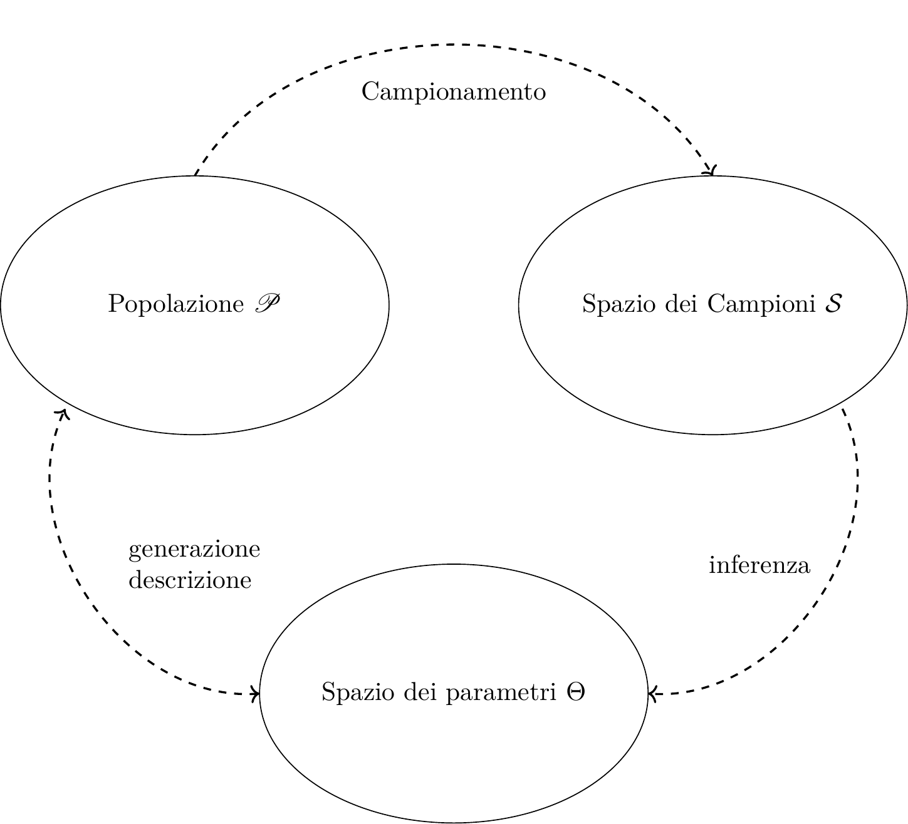

---
editor_options:
  chunk_output_type: console
output: pdf_document
---

```{r setupstim, include=FALSE}
source("intro.R")

```

# Elementi di Teoria della Stima

Il problema della **stima** nasce quando si vuole assegnare un valore numerico a una quantità incognita, chiamata **parametro**, a partire da un insieme limitato di osservazioni. In statistica, questa operazione si fonda sull'idea che i dati provengano da un **meccanismo aleatorio** e che il parametro rappresenti una proprietà stabile della popolazione o del modello da cui i dati sono stati generati.

Nel nostro contesto, un parametro può essere, ad esempio, la media \(\mu\), la varianza \(\sigma^2\), una proporzione \(\pi\), un tasso \(\lambda\), o più in generale un elemento \(\theta\) di uno spazio dei parametri \(\Theta\). La stima si basa sull'uso di un **campione**, ossia un insieme di dati osservati, che contiene informazione parziale sulla popolazione o sul modello.


## Campionamento

Un campione casuale è un certo numero di $n$ di osservazioni prese a caso dalla popolazione $\mathscr{P}$. Nel quadro dell'inferenza statistica, il **campionamento** è il processo attraverso cui si seleziona un sottoinsieme di unità da una popolazione \(\mathscr{P}\), al fine di trarne informazioni utili. Il tipo di inferenza che si può condurre dipende in larga parte dal modo in cui è stato ottenuto il campione.

### Campioni casuali


Nel nostro percorso considereremo due situazioni fondamentali:

- Il **campionamento con reinserimento** (o con restituzione), dove ogni osservazione è estratta in modo indipendente dalla popolazione o dal modello.
- Il **campionamento senza reinserimento**, dove le osservazioni non sono indipendenti e provengono da una popolazione finita di dimensione \( N \), da cui vengono estratti \( n \) elementi senza ripetizioni.

Nel primo caso, $X_1, ..., X_n$ sono **IID** (indipendenti e identicamente distribuite) e rappresentano il caso classico di inferenza da popolazioni infinite o da modelli. Nel secondo, si ha una struttura di **dipendenza debole** tra le unità campionarie, e l'inferenza deve tener conto della dimensione della popolazione e della frazione di campionamento \( n/N \).

### Lessico

Un campione in essere (prima di essere osservato) è una sequenza di VC
\[X_1,...,X_n\]

un campione osservato è un insieme di numeri
\[\mathbf{x}=(x_1,...,x_n)\]

Lo _Spazio dei Campioni_ $\mathcal{S}$ è il supporto della VC multipla $X_1,...,X_n$
è l'insieme di tutti i possibili campioni di ampiezza $n$: $(x_1,...,x_n)$ che possiamo osservare.


### Esempio al finito

Si dispone di un'urna contente 4 bussolotti
\[\{0,1,3,7\}\]

```{r 11-Stima-0,results="asis"}
xp <- c(0,1,3,7)

stat_(xp,semp = T)
```


Se estraiamo $n=2$ volte Senza Reinserimento, lo spazio dei campioni è di dimensione $\#\mathcal{S}=4\times 3$ ed è descritto in tabella (\@ref(tab:csr)).

```{r 11-Stima-1,results="asis"}
xp <- c(0,1,3,7)

camp <- combn(xp,2)

Coppia_sr <- function(x,y) ifelse(x==y,"-",paste0("(",x,",",y,")"))
# two_way(xp,xp,c(1,1,1,1),c(1,1,1,1),Coppia_sr,EV = F)
# togliere dal commento solo per generare la tabella qui sotto 


# intestazioni di colonna
header <- c(" ", "$0$ ; $\\color{blue}{1/3}$", "$1$ ; $\\color{blue}{1/3}$", 
            "$3$ ; $\\color{blue}{1/3}$", "$7$ ; $\\color{blue}{1/3}$")

# righe
mat <- matrix(c(
  "$0$ ; $\\color{blue}{1/4}$", "-", "$(0,1)$ ; $\\color{red}{1/12}$", "$(0,3)$ ; $\\color{red}{1/12}$", "$(0,7)$ ; $\\color{red}{1/12}$",
  "$1$ ; $\\color{blue}{1/4}$", "$(1,0)$ ; $\\color{red}{1/12}$", "-", "$(1,3)$ ; $\\color{red}{1/12}$", "$(1,7)$ ; $\\color{red}{1/12}$",
  "$3$ ; $\\color{blue}{1/4}$", "$(3,0)$ ; $\\color{red}{1/12}$", "$(3,1)$ ; $\\color{red}{1/12}$", "-", "$(3,7)$ ; $\\color{red}{1/12}$",
  "$7$ ; $\\color{blue}{1/4}$", "$(7,0)$ ; $\\color{red}{1/12}$", "$(7,1)$ ; $\\color{red}{1/12}$", "$(7,3)$ ; $\\color{red}{1/12}$", "-"
), ncol = 5, byrow = TRUE)

colnames(mat) <- header

kbl(mat, escape = FALSE, caption = "Campioni SR $n=2$",label = "csr") |>
  kable_styling(full_width = FALSE, position = "center")

```

Se invece estraiamo CR, lo spazio dei campioni è di dimensione $\#\mathcal{S}=4^2=16$ ed è descritto in tabella (\@ref(tab:ccr)).

```{r 11-Stima-2,results="asis"}
xp <- c(0,1,3,7)

Coppia_cr <- function(x,y) paste0("(",x,",",y,")")
# two_way(xp,xp,c(1,1,1,1),c(1,1,1,1),Coppia_cr,EV = F)
# togliere dal commento solo per generare la tabella qui sotto 


# intestazioni
header <- c(" ", 
            "$0$ ; $\\color{blue}{1/4}$", 
            "$1$ ; $\\color{blue}{1/4}$", 
            "$3$ ; $\\color{blue}{1/4}$", 
            "$7$ ; $\\color{blue}{1/4}$")

# matrice dei valori
mat <- matrix(c(
  "$0$ ; $\\color{blue}{1/4}$", "$(0,0)$ ; $\\color{red}{1/16}$", "$(0,1)$ ; $\\color{red}{1/16}$", "$(0,3)$ ; $\\color{red}{1/16}$", "$(0,7)$ ; $\\color{red}{1/16}$",
  "$1$ ; $\\color{blue}{1/4}$", "$(1,0)$ ; $\\color{red}{1/16}$", "$(1,1)$ ; $\\color{red}{1/16}$", "$(1,3)$ ; $\\color{red}{1/16}$", "$(1,7)$ ; $\\color{red}{1/16}$",
  "$3$ ; $\\color{blue}{1/4}$", "$(3,0)$ ; $\\color{red}{1/16}$", "$(3,1)$ ; $\\color{red}{1/16}$", "$(3,3)$ ; $\\color{red}{1/16}$", "$(3,7)$ ; $\\color{red}{1/16}$",
  "$7$ ; $\\color{blue}{1/4}$", "$(7,0)$ ; $\\color{red}{1/16}$", "$(7,1)$ ; $\\color{red}{1/16}$", "$(7,3)$ ; $\\color{red}{1/16}$", "$(7,7)$ ; $\\color{red}{1/16}$"
), ncol = 5, byrow = TRUE)

colnames(mat) <- header

kbl(mat, escape = FALSE, caption = "Campionamento CR $n=2$",label="ccr") |>
  kable_styling(full_width = FALSE, position = "center")

```


## Il Modello Statistico

Un **modello statistico** descrive formalmente il processo che ha generato i dati osservati. È composto da due elementi principali:

1. un **modello probabilistico**, che specifica la distribuzione delle osservazioni in funzione di uno o più parametri incogniti;
2. un **piano di campionamento**, che determina le modalità con cui le osservazioni sono state ottenute dalla popolazione di riferimento.

In queste pagine assumeremo sempre che le osservazioni \( X_1, ..., X_n \) siano **indipendenti e identicamente distribuite** (IID), ossia ottenute tramite **campionamento casuale semplice con reinserimento**. Questo tipo di campionamento è coerente con l'ipotesi che ogni unità del campione sia stata estratta in modo indipendente, e che tutte le unità della popolazione abbiano la stessa probabilità di essere selezionate.

Nel nostro contesto, il modello probabilistico scriveremo con $X_1,..,X_n$, $n$ VC IID, replicazioni della stessa variabile $X\sim\mathscr{L}(\theta)$, $\theta\in\Theta$ 
\[
X_i \sim \mathscr{L}(\theta),\forall i=1,...,n \qquad \theta \in \Theta,
\]
dove \( \mathscr{L}(\theta) \) è una famiglia di distribuzioni parametrica e \( \theta \) è il parametro (o vettore di parametri) che descrive la popolazione e $\Theta$ lo spazio in cui $\theta$ è definito.

Useremo le lettere greche per i parametri (incogniti) della popolazione e lettere latine per le osservazioni. 


### Esempi

- \( X_i \sim \text{Ber}(\pi) \), con \( \pi \in [0,1] \): modello per variabili dicotomiche, adatto per rappresentare esiti binari (successo/insuccesso). In questo caso $\theta\equiv\pi$ e $\Theta\equiv [0,1]$.
- \( X_i \sim \text{Pois}(\lambda) \), con \( \lambda \in \mathbb{R}^+ \): modello per conteggi, adatto a descrivere eventi rari su un intervallo fissato. In questo caso $\theta\equiv\lambda$ e $\Theta\equiv \mathbb{R}^+$.
- \( X_i \sim N(\mu, \sigma^2) \), con \( \mu \in \mathbb{R}, \sigma^2 \in \mathbb{R}^+ \): modello per variabili continue, con distribuzione simmetrica e forma a campana. In questo caso $\theta\equiv(\mu,\sigma^2)$ e $\Theta\equiv \mathbb{R}\times\mathbb{R}^+$.
- \( X_i \sim \mathscr{L}(\theta) \): notazione generica per una famiglia distribuzionale qualsiasi, dove \( \theta \in \Theta \) rappresenta i parametri che vogliamo stimare.

Nel _paradigma classico_ la probabilità si assegna alle $X_i$, in quanto risultato di un sorteggio casuale
\[P(X_1,...,X_n;\theta)\]

Ma non è consentito trattare con lo strumento della probabilità l'incertezza sul parametro $\theta$ che governa la popolazione. Perché $\theta$ è incognito ma non è il frutto di una selezione casuale.

Nel _paradigma Bayesiano_ l'incertezza sul parametro viene trattata con gli stessi strumenti dell'incertezza sui dati, dando vita ad un teoria coerente e molto utile per alcune applicazioni particolari.

### Scopo del modello

L'obiettivo dell'inferenza statistica è trarre conclusioni sul parametro \(\theta\), sulla base del campione osservato \( \mathbf{x} = (x_1, ..., x_n) \). Lo stesso campione può essere interpretato in modo diverso a seconda del modello adottato: per questo, esplicitare il modello è sempre il primo passo di un'analisi statistica.
Perfetto, possiamo riformulare e ampliare il paragrafo sul campionamento, tenendo conto della necessità di collegarlo bene al discorso sull'inferenza e sul modello statistico. Ti propongo una bozza con tono sobrio e coerente con il resto del libro:

## Gli stimatori

_Stimare_, in statistica, significa scegliere un punto (stima puntuale) o una regione (stima intervallare) dello spazio dei parametri $\Theta$ alla luce dei dati $x_1,...,x_n$.

:::{.info data-latex=""}
:::{.definiton}
Uno **stimatore** puntuale (point estimator) è una statistica $\hat\theta$ che trasforma il campione $X_1,...,X_n$ in un punto dello spazio dei parametri:
\[\hat\theta:\mathcal{S}\to\Theta\]
:::
:::

```{r fig-inferenza1, fig.cap="Schema concettuale dell'inferenza statistica", out.width="90%"}

```

Il campione $X_1,...,X_n$ casuale viene trasformato attraverso $\hat\theta$ in un punto specifico di $\Theta$
\[\hat\theta(X_1,...,X_n)=\hat\theta\in\Theta\]

Uno **stimatore** è una variabile casuale in quanto funzione di valori casuali.

```{r fig-inferenza2, fig.cap="Ogni campione è un punto nello spazio dei campioni, ad ogni campione corrisponde una stima nello spazio dei parametri", out.width="90%"}
knitr::include_graphics("img/inferenza2-2.png")
```

:::{.example}
Da una popolazione che ha $E(X_i)=\mu$ incognita, potremmo proporre di _stimare_ $\mu$ con la media dei dati che _otterremo_:
\[\hat\mu(X_1,...,X_n)=\frac 1 n \sum_{i=1}^n X_i=\bar X=\hat \mu\]
:::

:::{.example} 
Da una popolazione di Poisson che ha $X_i\sim\text{Poiss}(\lambda)$, $\lambda$ incognita, potremmo proporre di _stimare_ $\lambda$ con la mediana dei dati che _otterremo_:
\[\hat\lambda(X_1,...,X_n)=X_{0,5}=\hat\lambda\]
:::

### Stimatori e Stime

:::{.nota data-latex=""}
- Uno **Stimatore**: $\hat\theta=\hat\theta(X_1,...,X_n)$ è funzione di $X_1,...,X_n$ è una **VC**
- Una **Stima**: $\hat\theta_\text{obs}=\hat\theta(x_1,...,x_n)$ è funzione di $x_1,...,x_n$ e dunque è un **numero**
:::

:::{.example}
Lanciamo una moneta e non sappiamo se è bilanciata, cioè $\pi$, la probabilità di ottenere testa, è incognita, potremmo proporre di _stimare_ $\pi$ con la proporzione dei dati e _otterremo_:
$$
\hat \pi(X_1,...,X_n)=\frac {S_n} n =\hat\pi
$$

Estraiamo $n=5$ individui dalla popolazione $x_1=0$, $x_2=1$, $x_3=0$, $x_4=1$, $x_5=1$,  

Per ottenere $\hat\mu$ la stima di $\mu$ applichiamo $\hat\theta$ ai dati e otteniamo
$$
\hat\pi_\text{obs}=\hat\pi(0,1,0,1,1) = \frac 3 5=0.6
$$
:::

:::{.example}
Da una popolazione che ha $E(X_i)=\mu$ incognita, potremmo proporre di _stimare_ $\mu$ con la media dei dati che _otterremo_:
\[\hat \mu(X_1,...,X_n)=\frac 1 n \sum_{i=1}^n X_i=\hat \mu\]

Estraiamo $n=5$ individui dalla popolazione $x_1=2.1$, $x_2=2.4$, $x_3=3.2$, $x_4=1.7$, $x_5=3.0$,  
```{r 11-Stima-7}
xs <- c(2.1,2.4,3.2,7.1,3.0)
```

Per ottenere $\hat\mu$ la stima di $\mu$ applichiamo $\hat\theta$ ai dati e otteniamo
$$
\hat\mu_\text{obs}=\hat\mu(2.1,2.4,3.2,7.1,3.0) = \frac 1 5\sum_{i=1}^5x_i=\frac 1 5 `r sum(xs)`=`r mean(xs)`
$$
:::

:::{.example} 
Da una popolazione di Poisson che ha $X_i\sim\text{Poiss}(\lambda)$, $\lambda$ incognita, potremmo proporre di _stimare_ $\lambda$ con la mediana dei dati che _otterremo_:
\[\hat\lambda(X_1,...,X_n)=X_{0,5}=\hat\lambda\]


Osserviamo $n=7$ valori (già riordinati)<br/> 
$x_{(1)}=0$, $x_{(2)}=0$, $x_{(3)}=2$, $x_{(4)}=2$, $x_{(5)}=3$, $x_{(6)}=4$, $x_{(7)}=7$,    


Per ottenere $\hat\lambda$ la stima di $\lambda$ applichiamo $\hat\theta$ ai dati e otteniamo
$$
\hat\lambda(x_1,...,x_7) = x_{0.5}=x_{(4)}=2
$$
:::

### Come scegliere uno stimatore


La definizione non offre un criterio per la scelta. 
Gli stimatori vengono costruiti per avere la miglior _precisione possibile_.
La precisione non si può valutare sulla singola _stima_ ma studiando, 
prima di osservare i dati, le proprietà probabilistiche dello _stimatore_.

Le proprietà auspicabili per uno stimatore sono di due tipi

- Esatte (per $n$ finito)
- Asintotiche (per $n$ che diverge)

### Proprietà Auspicabili di uno stimatore (per $n$ finito)

Uno stimatore si dice _corretto_ (_unbiased_) se in media cade sul parametro vero.

:::{.info data-latex=""}
:::{.definition name="Correttezza di uno stimatore"}
Siano $X_1,...,X_n$, $n$ VC, IID, replicazioni della stessa $X\sim\mathscr{L}(\theta)$, sia $\hat\theta$ uno stimatore per $\theta$.
Lo stimatore $\hat\theta$ si dice **corretto** se
$$
E(\hat\theta(X_1,...,X_n))=E(\hat\theta)=\theta
$$
:::
:::

La misura dell'errore di stima è data dalla distanza quadratica media delle stime dal valore vero.

:::{.info data-latex=""}
:::{.definition name="Mean Squared Error di uno stimatore"}
Si definisce **Errore Quadratico Medio** (_Mean Squared Error_) la quantità
\[MSE(\hat\theta)=E((\hat\theta-\theta)^2)=V(\hat\theta)+B^2(\hat\theta)\]
dove
\[B(\hat\theta)=|E(\hat\theta)-\theta|\]
:::
:::

Se lo stimatore è corretto allora il $MSE$ coincide con la varianza dello stimatore.

:::{.nota}
se $\hat\theta$ è corretto allora
\[MSE(\hat\theta)=V(\hat\theta)\]
:::

L'efficienza è una quantità teorica che dipende da quantità incognite, ma il suo calcolo teorico può essere utilizzato per confrontare diversi stimatori.

:::{.info data-latex=""}
:::{.definition name="Efficienza di uno stimatore"}
Siano $\hat\theta_1$ e $\hat\theta_2$ due stimatori per $\theta$, si dice che $\hat\theta_1$ è **più efficiente** di $\hat\theta_2$ se e solo se
\[MSE(\hat\theta_1)<MSE(\hat\theta_2)\]
:::
:::

:::{.nota data-latex=""}
Se $\hat\theta_1$ e $\hat\theta_2$ sono entrambi corretti, allora, $\hat\theta_1$ è **più efficiente** di $\hat\theta_2$ se e solo se
\[V(\hat\theta_1)<V(\hat\theta_2)\]

L'**errore** di uno stimatore è l'_inverso_ della sua **precisione**.
:::

### Media aritmetica e varianza campionaria caso IID

Siano $X_1,...,X_n$, $n$ VC, IID, replicazioni della stessa $X$ tale che $E(X)=\mu$ e $V(X)=\sigma^2$, sia $\hat\theta\equiv\hat \mu$ uno stimatore per $\mu$
\[
\hat \mu=\bar X=\frac 1 n \sum_{i=1}^n X_i
\]


Dai risultati che già conosciamo sappiamo che
\[
E(\hat \mu)=\mu
\]
e dunque $\hat \mu$ è sempre uno stimatore corretto per $\mu$.
Essendo $\hat \mu$ corretto per $\mu$ allora
\[MSE(\hat \mu)=V(\hat \mu)=\frac{\sigma^2}n\]

Si consideri la varianza campionaria:
\[
\hat\sigma^2=\frac 1 n \sum_{i=1}^n(X_i-\hat \mu)^2
\]

Si può dimostrare che

:::{.info data-latex=""}
\[
E(\hat \sigma^2)=\frac {n-1}n \sigma^2<\sigma^2
\]
:::

### Media aritmetica campionamento SR (popolazioni finite)

Siano $X_1,...,X_n$, $n$ VC, osservazioni estratte SR da una popolazione $X$ di $N$ individui, tale che $E(X)=\mu$ e $V(X)=\sigma^2$, sia $\hat\theta\equiv\hat \mu$ uno stimatore per $\mu$
\[
\hat \mu=\frac 1 n \sum_{i=1}^n X_i
\]
Allora
\[
E(\hat \mu)=\mu
\]
e dunque $\hat \mu$ è sempre uno stimatore corretto per $\mu$.
Essendo $\hat \mu$ corretto per $\mu$ allora
\[MSE(\hat \mu)=V(\hat \mu)\]

Per calcolare $V(\hat \mu)$ dobbiamo tenere conto della _frazione di campionamento_ $n/N$

:::{.info data-latex=""}
\[
MSE(\hat \mu)=\frac{N-n}{N-1}\frac{\sigma^2} n
\]
:::

dove $\frac{N-n}{N-1}$ è chiamato _coefficiente di correzione per popolazioni finite_.
Osserviamo che più alto è $n$ più il coefficiente tende ad 1.
Se $n = N$ il coefficiente diventa zero il campione è diventato l'intera popolazione  e 
l'incertezza sulla media è zero.

### Esempio al finito

Riprendiamo il nostro esempio al finito con una popolazione di $N=4$
\[\{0,1,3,7\}\]

```{r 11-Stima-01,results="asis"}
xp <- c(0,1,3,7)

stat_(xp,semp = T)
```


Se estraiamo $n=2$ volte Senza Reinserimento, lo spazio dei campioni è di dimensione $\#\mathcal{S}=4\times 3$ ed è descritto in tabella (\@ref(tab:csr)). Qui scegliamo

$$
\hat\mu = \frac{1}{2}(X_1+X_2)
$$

In tabella (\@ref(tab:csr-media)) la distribuzione della VC media aritmetica campionaria.

```{r 11-Stima-71,results="asis"}
xp <- c(0, 1, 3, 7)
#stat_(apply(combn(xp,2),2,mean),semp = T)
x_mean <- apply(combn(xp,2),2,mean)

# intestazioni di colonna
header <- c(" ", 
            "$0$ ; $\\color{blue}{1/3}$", 
            "$1$ ; $\\color{blue}{1/3}$", 
            "$3$ ; $\\color{blue}{1/3}$", 
            "$7$ ; $\\color{blue}{1/3}$")

# funzione per costruire la cella: "-" sulla diagonale, altrimenti media
Cella_sr_media <- function(x, y) {
  if (x == y) {
    return("-")
  } else {
    media <- (x + y) / 2
    return(paste0("$", media, "$ ; $\\color{red}{1/12}$"))
  }
}

# costruzione della matrice
righe <- lapply(xp, function(r) {
  c(paste0("$", r, "$ ; $\\color{blue}{1/4}$"), sapply(xp, function(c) Cella_sr_media(r, c)))
})

mat <- do.call(rbind, righe)
colnames(mat) <- header

# generazione tabella
kbl(mat, escape = FALSE, caption = "Valori medi dei campioni SR senza reinserimento di due elementi", label = "csr-media") |>
  kable_styling(full_width = FALSE, position = "center")
```

Ricaviamo la distribuzione di $\hat\mu$

$$
\begin{array}{r|rrrrrr}
\hat\mu& 0.5 & 1.5 & 2 & 3.5 & 4 & 5 \\
\hline
P(\hat\mu) & \frac{2}{12} & \frac{2}{12} & \frac{2}{12} & \frac{2}{12} & \frac{2}{12} & \frac{2}{12} \\
\end{array}
$$

il suo valore atteso

$$
E(\hat\mu) = \frac{2}{12} \cdot (0.5 + 1.5 + 2 + 3.5 + 4 + 5) = \frac{16.5}{6} = 2.75 = \mu
$$

lo stimatore è corretto. Ricaviamo il suo MSE

\begin{eqnarray*}
MSE(\hat\mu) &=& V(\hat\mu) + B^2(\hat\mu) \\
             &=& V(\hat\mu) \qquad \text{in virtù della correttezza} \\
             &=& \left(  0.5  ^2\frac { 1 }{ 6 }+ 1.5  ^2\frac { 1 }{ 6 }+ 2  ^2\frac { 1 }{ 6 }+ \right.\\
             & & \left. + 3.5  ^2\frac { 1 }{ 6 }+ 4  ^2\frac { 1 }{ 6 }+ 5  ^2\frac { 1 }{ 6 } \right)-( 2.75 )^2\\
             &=& `r s2c(x_mean)`\\
             &=& \frac{4-2}{4-1}\frac{`r p(s2c(xp))`}{2}\\
             &=& \frac{N-n}{N-1}\frac{\sigma^2} n
\end{eqnarray*}


Se estraiamo $n=2$ volte **con reinserimento**, lo spazio dei campioni è di dimensione $\#\mathcal{S} = 4 \times 4$ ed è descritto in tabella (\@ref(tab:ccr)). Anche qui scegliamo:

$$
\hat\mu = \frac{1}{2}(X_1 + X_2)
$$

In tabella qui sotto è riportata la distribuzione della variabile casuale media aritmetica campionaria.

$$
\begin{array}{ r|rrrrrrrr }
& 0 ;&\color{blue}{ \frac{ 1 } { 4 }} & 1 ;&\color{blue}{ \frac{ 1 } { 4 }} & 3 ;&\color{blue}{ \frac{ 1 } { 4 }} & 7 ;&\color{blue}{ \frac{ 1 } { 4 }} \\ 
\hline 
0 ;\color{blue}{ 1 / 4 }& 0;&\color{red}{\frac{1}{16}}& 0.5;&\color{red}{\frac{1}{16}}& 1.5;&\color{red}{\frac{1}{16}}& 3.5;&\color{red}{\frac{1}{16}}\\ 
1 ;\color{blue}{ 1 / 4 }& 0.5;&\color{red}{\frac{1}{16}}& 1;&\color{red}{\frac{1}{16}}& 2;&\color{red}{\frac{1}{16}}& 4;&\color{red}{\frac{1}{16}}\\ 
3 ;\color{blue}{ 1 / 4 }& 1.5;&\color{red}{\frac{1}{16}}& 2;&\color{red}{\frac{1}{16}}& 3;&\color{red}{\frac{1}{16}}& 5;&\color{red}{\frac{1}{16}}\\ 
7 ;\color{blue}{ 1 / 4 }& 3.5;&\color{red}{\frac{1}{16}}& 4;&\color{red}{\frac{1}{16}}& 5;&\color{red}{\frac{1}{16}}& 7;&\color{red}{\frac{1}{16}}\\ 
\end{array}
$$

E ricaviamo la distribuzione di, $\hat\mu$ 

$$
     \begin{array}{ r|rrrrrrrrrr }
 \hat\mu  & 0& 0.5& 1& 1.5& 2& 3& 3.5& 4& 5& 7 \\ 
 \hline 
 P( \hat\mu ) & \frac{1}{16}& \frac{2}{16}& \frac{1}{16}& \frac{2}{16}& \frac{2}{16}& \frac{1}{16}& \frac{2}{16}& \frac{2}{16}& \frac{2}{16}& \frac{1}{16} \\ 
 \end{array}
$$

Calcoliamo valore atteso e MSE.


\begin{eqnarray*}  
  E(\hat\mu) &=& \sum_{\hat\mu}\hat\mu P(\hat\mu)\\ 
 &=&  0  \frac { 1 }{ 16 }+ 0.5  \frac { 2 }{ 16 }+ 1  \frac { 1 }{ 16 }+ 1.5  \frac { 2 }{ 16 }+ 2  \frac { 2 }{ 16 }+ \\
 & & +3  \frac { 1 }{ 16 }+ 3.5  \frac { 2 }{ 16 }+ 4  \frac { 2 }{ 16 }+ 5  \frac { 2 }{ 16 }+ 7  \frac { 1 }{ 16 } \\ 
            &=& 2.75 = \mu \qquad\text{lo stimatore è corretto} \\ 
 MSE(\hat\mu) &=& V(\hat\mu) + B^2(\hat\mu)\\ 
              &=& V(\hat\mu)\\
 &=&\left(  0  ^2\frac { 1 }{ 16 }+ 0.5  ^2\frac { 2 }{ 16 }+ 1  ^2\frac { 1 }{ 16 }+ 1.5  ^2\frac { 2 }{ 16 }+ 2  ^2\frac { 2 }{ 16 }+\right.\\
 &+& \left.  3  ^2\frac { 1 }{ 16 }+ 3.5  ^2\frac { 2 }{ 16 }+ 4  ^2\frac { 2 }{ 16 }+ 5  ^2\frac { 2 }{ 16 }+ 7  ^2\frac { 1 }{ 16 } \right)-( 2.75 )^2\\ 
            &=& 3.59375 \\
            &=& \frac{`r s2c(xp)`}{2}\\
            &=& \frac{\sigma^2}{n}
\end{eqnarray*}

Consideriamo la stima della varianza
$$
\hat\sigma^2=\frac 12\left((X_1-\hat\mu)^2+(X_2-\hat\mu)^2\right)
$$

```{r}
x_var <- apply(expand.grid(xp,xp),1,s2c)
var_2 <- function(x,y) .5*(x^2+y^2)-((x+y)/2)^2
# outer(xp,xp,var_2)
# two_way(xp,xp,xp*0+1,xp*0+1,op = var_2)

```


$$
\begin{array}{ r|rrrrrrrr }
& 0 ;&\color{blue}{ \frac{ 1 } { 4 }} & 1 ;&\color{blue}{ \frac{ 1 } { 4 }} & 3 ;&\color{blue}{ \frac{ 1 } { 4 }} & 7 ;&\color{blue}{ \frac{ 1 } { 4 }} \\ 
\hline 
0 ;\color{blue}{ 1 / 4 }& 0;&\color{red}{\frac{1}{16}}& 0.25;&\color{red}{\frac{1}{16}}& 2.25;&\color{red}{\frac{1}{16}}& 12.25;&\color{red}{\frac{1}{16}}\\ 
1 ;\color{blue}{ 1 / 4 }& 0.25;&\color{red}{\frac{1}{16}}& 0;&\color{red}{\frac{1}{16}}& 1;&\color{red}{\frac{1}{16}}& 9;&\color{red}{\frac{1}{16}}\\ 
3 ;\color{blue}{ 1 / 4 }& 2.25;&\color{red}{\frac{1}{16}}& 1;&\color{red}{\frac{1}{16}}& 0;&\color{red}{\frac{1}{16}}& 4;&\color{red}{\frac{1}{16}}\\ 
7 ;\color{blue}{ 1 / 4 }& 12.25;&\color{red}{\frac{1}{16}}& 9;&\color{red}{\frac{1}{16}}& 4;&\color{red}{\frac{1}{16}}& 0;&\color{red}{\frac{1}{16}}\\ 
\end{array}
$$

\normalsize E ricaviamo la distribuzione di, $\hat\sigma^2$ 

$$
\begin{array}{ r|rrrrrrr }
 \hat\sigma^2  & 0& 0.25& 1& 2.25& 4& 9& 12.25 \\ 
 \hline 
 P( \hat\sigma^2 ) & \frac{4}{16}& \frac{2}{16}& \frac{2}{16}& \frac{2}{16}& \frac{2}{16}& \frac{2}{16}& \frac{2}{16} \\ 
 \end{array}
$$

e osserviamo che

\begin{eqnarray*} E(\hat\sigma^2) &=& \sum_{\hat\sigma^2}\hat\sigma^2 P(\hat\sigma^2)\\ 
 &=&  0  \frac { 4 }{ 16 }+ 0.25  \frac { 2 }{ 16 }+ 1  \frac { 2 }{ 16 }+ 2.25  \frac { 2 }{ 16 }+ \\
 &+&  4  \frac { 2 }{ 16 }+ 9  \frac { 2 }{ 16 }+ 12.25  \frac { 2 }{ 16 } \\ 
 &=& 3.59375 \\
 &=& \frac{1}{2}`r s2c(xp)`\\
 &=& \frac{n-1}{n}\sigma^2
\end{eqnarray*}


### Distribuzione delle statistiche

```{r 11-Stima-5, echo=FALSE, results='asis'}

#curve(dgamma(x,9,.9),0,25)
set.seed(1)
xpop <- rgamma(10000,9,.9)
mu <- mean(xpop)
s2 <- vvv(xpop)
```


Supponiamo di estrarre campioni di ampiezza $n$ CR da una popolazione con media $\mu$ e varianza $\sigma^2$.
Osservo tre diversi stimatori per $\mu$: $\hat\mu_1$, $\hat\mu_2$ e $\hat\mu_3$

```{r 11-Stima-6, echo=FALSE, results='asis'}

#curve(dgamma(x,9,.9),0,25)
xpop <- rgamma(10000,9,.9)
n <- 5
mu <- mean(xpop)
s2 <- vvv(xpop)
se <- sqrt(s2/n)

camp <- sapply(1:20, function(x)sample(xpop,n,T))
h1 <- apply(camp, 2, mean)
h2 <- h1+rnorm(20,0,1)
h3 <- h2+rnorm(20,0,2)
```

Se si ripetesse l'estrazione un grande numero di volte potremmo vedere i tre stimatori nel grafico qui di seguito.
Lo stimatore in con la distribuzione in blu è il più efficiente dei tre: la probabilità che si avveri lontano dal vero parametro è minore che per gli altri due.
Mentre lo stimatore in con la distribuzione in verde è il meno efficiente dei tre: la probabilità che si avveri lontano dal vero parametro è maggiore che per gli altri due.


```{r 11-Stima-8}
par(mfrow=c(1,1),cex=cex)
curve(dnorm(x,mu,se),mu-4*se,mu+4*se,xlab="x",ylab="",axes=F,col=4)
axis(1,c(mu-4*se,mu,mu+4*se),c("",expression(mu),""))
axis(2)
points(h1[1:20],rep(0,times=20),pch=4,col=4)
points(h2[1:20],rep(0,times=20),pch=2,col=ared)
points(h3[1:20],rep(0,times=20),pch=5,col=3)
curve(dnorm(x,mu,se+.5),col=ared,add=T)
curve(dnorm(x,mu,se+1),col=3,add=T)
segments(mu,0,mu,dnorm(mu,mu,se),lty=2)

```


### Proprietà Auspicabili di uno stimatore (per $n\to\infty$)


Siano $X_1,...,X_n$, $n$ VC, IID, replicazioni della stessa $X\sim\mathscr{L}(\theta)$, sia $\hat\theta$ uno stimatore per $\theta$.

:::{.info data-latex=""}
:::{.definition name="Correttezza Asintotica"}
Lo stimatore $\hat\theta$ si dice **asintoticamente corretto** se
\[\lim_{n\to\infty}E(\hat\theta(X_1,...,X_n))=E(\hat\theta)=\theta\]
:::
:::
   
:::{.example}
  \[\lim_{n\to\infty}E(\hat\sigma^2)=\lim_{n\to\infty}\frac{n-1}n\sigma^2=\sigma^2\]
:::

:::{.info data-latex=""}
:::{.definition name="Correttezza Asintotica"}
Lo stimatore $\hat\theta$ si dice **consistente** (in media quadratica) se e solo se
\[\lim_{n\to\infty}MSE(\hat\theta(X_1,...,X_n))=\lim_{n\to\infty}MSE(\hat\theta)=0\]

Essendo
\[MSE(\hat\theta)=V(\hat\theta)+B^2(\hat\theta)\]
allora
\[\lim_{n\to\infty} MSE(\hat\theta)=0, \text{ se e solo se} \lim_{n\to\infty} V(\hat\theta)=0 \text{ e } \lim_{n\to\infty} B^2(\hat\theta)=0\]
:::
:::

:::{.example name="Consistenza"}
Siano $X_1,...,X_n$, $n$ VC, IID, replicazioni della stessa VC $X$ con $E(X)=\mu$ e $V(X)=\sigma^2$
Usiamo $\hat \mu$ per stimare $\mu$:
\[\hat \mu=\frac 1 n \sum_{i=1}^n X_i=\frac {S_n}n\]

Siccome $\hat \mu$ è stimatore corretto per $\mu$:
\[E(\hat \mu)=E\left(\frac{X_1+...+X_n}{n}\right)=\frac 1 n(E(X_1)+...+E(X_n))=\frac 1 n (\mu+...+\mu)=\mu\]


Allora
\[MSE(\hat \mu)=V(\hat \mu)=\frac {\sigma^2}n\]


Al divergere di $n$
\[\lim_{n\to \infty}MSE(\hat \mu)=\lim_{n\to\infty}\frac{\sigma^2}n=0\]

Lo stimatore $\hat \mu$ per $\mu$ è stimatore **corretto** e **consistente**.
:::

## La $SD$ e lo $SE$

:::{.info data-latex=""}
La _standard deviation_ (SD) $\sigma$, rappresenta la dispersione degli individui dalla media, è un indicatore di *variabilità* della *popolazione*, per esempio in una popolazione finita di $N$ individui:
\[\sigma=\sqrt{\sigma^2}=\sqrt{\frac 1 N\sum_{i=1}^N(x_i-\mu)^2},\]
la _deviazione standard_ $\sigma$ è la radice della varianza della popolazione $\sigma^2$.

Lo _standard error_ $SE(\hat\theta)$ di uno stimatore $\hat\theta$ per $\theta$ è un indicatore della *variabilità* dello stimatore nello *spazio dei parametri*
\[SE(\hat\theta)=\sqrt{V(\hat\theta)}\]
Lo _standard error_ $SE(\hat\theta)$ di uno stimatore $\hat\theta$ per $\theta$ è la radice della varianza della VC $\hat\theta$.

La _standard deviation stimata_ $\sigma$, rappresenta la dispersione degli individui _del campione_ dalla media _del campione_, è un indicatore di *variabilità* del *campione*:
\[\hat\sigma=\sqrt{\hat\sigma^2}=\sqrt{\frac 1 n\sum_{i=1}^n(x_i-\hat\mu)^2}\]
La _deviazione standard stimata_ $\hat\sigma$ è la radice della varianza del campione $\hat\sigma^2$.
:::

:::{.example}
Lo standard error dello stimatore media aritmetica campionaria $\hat\mu$ per $\mu$
\[SE(\hat \mu)=\sqrt\frac{\sigma^2} n=\frac\sigma {\sqrt{n}}\]

L'errore che si commette nello stimare una media dipende da due fattori

  - la _standard deviation_ $\sigma$ che indica la variabilità degli individui tra di loro
  - $1/\sqrt n$ che è l'inverso dell'ampiezza del campione

Se $\sigma$ è incognito viene stimato da (come vedremo nel paragrafo (\@ref(vnorm)))
\[S=\sqrt{S^2}=\sqrt{\frac{n}{n-1}\hat\sigma^2}\]

Ottenendo
\[\widehat{SE(\hat\mu)}=\frac S {\sqrt n}\]
:::
