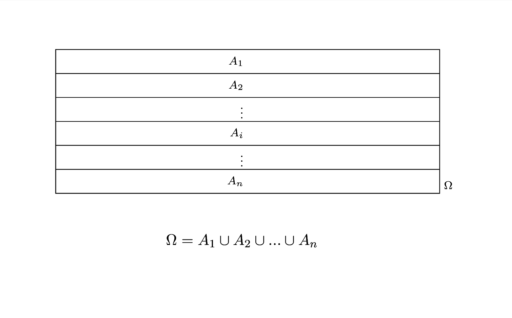
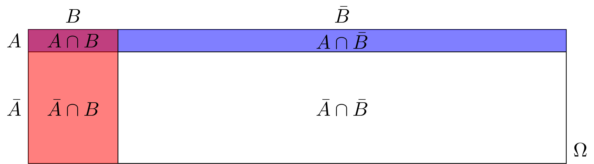
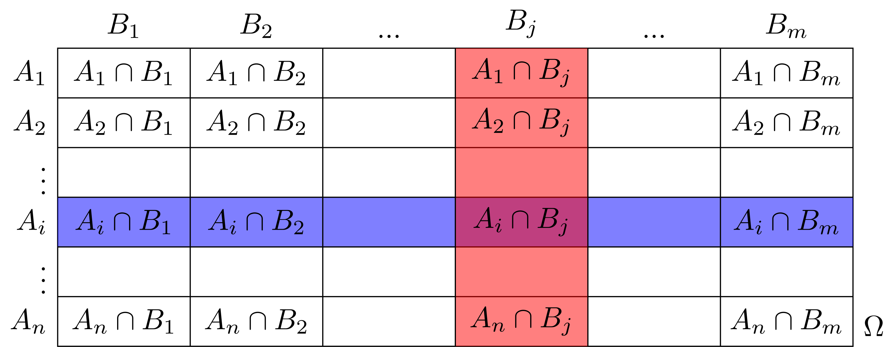
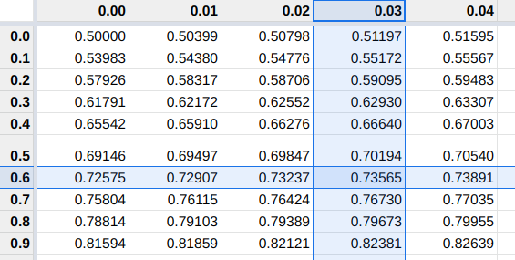
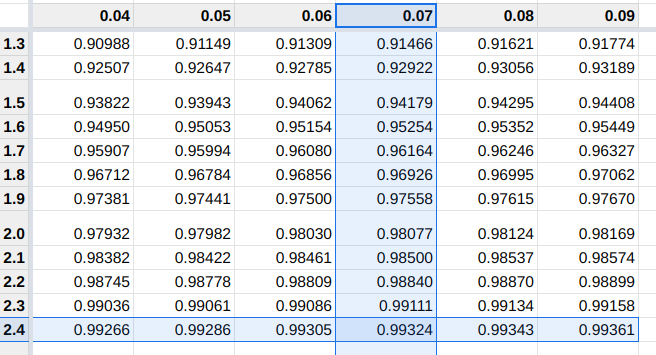
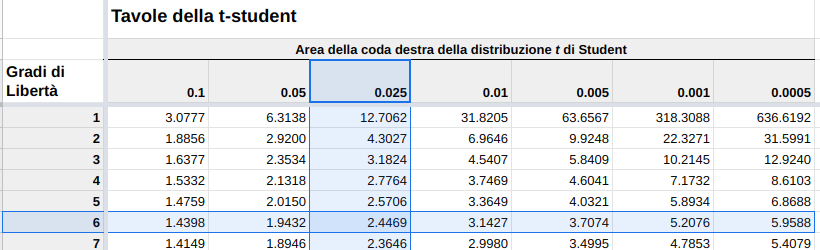

--- 
title: "Appunti di Statistica"
subtitle: "CLEAM AA 24/25"
author: "Patrizio Frederic"
date: "Aggiornato al 14-01-2025"
documentclass: book
site: bookdown::bookdown_site
biblio-style: apalike
link-citations: yes
description: "Appunti sparsi"
# bookdown::epub_book:
#   pandoc_args: "--mathml"
geometry: "left=2.5cm, right=2.5cm, top=3.5cm, bottom=3.5cm, showframe=false, showcrop=true"
fontsize: 11pt
output:
   bookdown::pdf_book:
     keep_tex: true
     highlight: default
     fig_caption: true
     # fig_width: 4
     # fig_height: 3
   bookdown::gitbook:
     fig_caption: true
     # fig_width: 12
     # fig_height: 8
#documentclass: book
editor_options: 
  chunk_output_type: console
---


<!--chapter:end:index.Rmd-->


# Avvertenza {-}

\large 

Questo lavoro è un work in progress, questa non è la versione definitiva, sconsiglio di stampare tutto. 

\normalsize


Appunti di Statistica © 2025 di Patrizio Frederic è distribuito
sotto licenza CC BY-NC-ND 4.0
https://creativecommons.org/licenses/by-nc-nd/4.0/

You are free to:
Share — copy and redistribute the material in any medium or format
The licensor cannot revoke these freedoms as long as you follow the license terms.
Under the following terms:
Attribution — You must give appropriate credit, provide a link to the license, and indicate if changes were made. You may do so in any reasonable manner, but not in any way that suggests the licensor endorses you or your use.

NonCommercial — You may not use the material for commercial purposes.

NoDerivatives — If you remix, transform, or build upon the material, you may not distribute the modified material.

No additional restrictions — You may not apply legal terms or technological measures that legally restrict others from doing anything the license permits.


# Introduzione {-}

Durante il lock down della prima ondata, nel marzo del 2020, ho iniziato a trascrivere
i miei appunti, raccolti negli ultimi 17 anni, in diapositive. Questa è una rielaborazione
di quelle diapositive a cui è stato aggiunto parte dell'eserciziario realizzato con Michele Lalla. 
L'esposizione degli argomenti ricalca il corso di Statistica che con Michele Lalla abbiamo 
progettato per i corsi di CLEF e CLEA nel periodo che va dal 2008 al 2019, al quale ho 
portato alcune modifiche di forma e qualche aggiunta.

<!-- Scrivono Agresti, e Franklin, (2007), nel loro celebre libro: -->

<!-- >"Statistics is the art and science of designing studies and analyzing the data that those studies produce. Its ultimate goal is translating data into knowledge and understanding of the world around us. In short, **statistics is the art and science of learning from data**". -->

<!-- > La statistica è l'arte e la scienza di pianificare la raccolta e l'analisi dei dati che tali ricerche producono. Il suo fine è di trasformare i dati in conoscenza e comprensione del mondo circostante. In sintesi: **La statistica è l'arte e la scienza di imparare dai dati**. -->

<!-- > *Agresti, A., and Franklin, C. (2007), Statistics: the Art and Science of Learning from Data, Upper Saddle River, Pearson Prentice Hall.* -->

<!-- La statistica è dunque quelle disciplina che si occupa della progettazione, raccolta, analisi, sintesi, reportistica, e molto altro di collezioni di dati. -->
<!-- In latino *datum* significa un fatto, quindi i *dati* sono collezioni di fatti. I dati sono osservazioni e misure di un fenomeno reale. Per esempio il numero di ricoverati a marzo del 2023 al reparto di pneumologia dell'ospedale di Baggiovara è un dato, i numeri dei ricoveri di ogni mese del 2023 sono i _dati dei ricoveri mensili_. Se ad ogni ricovero aggiungiamo il numero di notti di permanenza, avremo dati più complessi. La retribuzione di un operaio della provincia di modena è un dato, l'insieme delle retribuzioni di tutti operai della provincia sono _i dati sulle retribuzioni_, se alla retribuzione aggiungiamo il settore industriale avremo dati più ricchi di informazione. Il prezzo di un titolo in borsa alle 11 del 12 giugno 2024 è un singolo dato, la serie dei prezzi di quel titolo dal primo gennaio del 2024 è _la serie storica_ di quel titoli (dati osservati nel tempo), mentre i prezzi di tutti gli altri titoli di borsa al 12 giugno 2024 rappresentano _i dati_ della borsa in quel giorno, se da ultimo collezioniamo tutti i prezzi di tutti i titoli dal primo gennaio del 2023 fino ad oggi otterremo _i dati_ della borsa dal 01/01/2023. -->


Questo manoscritto è diviso in tre parti, la prima dedicata alla statistica descrittiva nella quale 
vengono date le nozioni di base di descrizione di una popolazione, le sue rappresentazioni grafiche,
la media e la variabilità. Nella seconda parte verranno date le nozioni di base di teoria e calcolo delle probabilità.
Dal concetto di evento fino alle principali variabili casuali, il teorema del limite centrale e la distribuzione
delle principali statistiche campionarie. Nella terza e ultima parte verranno sviluppati 
i principi di base di inferenza classica, dalla stima puntuale alla stima intervallare, la teoria dei test, 
il modello di regressione lineare e il test del chi-quadro.

Questo materiale, che non è ancora un libro, è da considerarsi il canovaccio d'appunti sul quale 
costruisco le mie lezioni.  Non è da ritenersi alternativo alle lezioni in aula o ad un libro di testo. 
È ancora incompleto e disseminato di errori e imprecisioni.

Un ringraziamento speciale va alle mie donne e a Michele Lalla, amico, collega e maestro.

Bologna, il 14-01-2025.

<!--chapter:end:00-intro.Rmd-->

---
output:
  pdf_document: default
  html_document: default
editor_options: 
  chunk_output_type: console
  markdown: 
    wrap: sentence
---


\part{Statistica Descrittiva}

# I Fenomeni Collettivi

Scrivono Agresti, e Franklin, (2007), nel loro celebre libro:

>"Statistics is the art and science of designing studies and analyzing the data that those studies produce. Its ultimate goal is translating data into knowledge and understanding of the world around us. In short, **statistics is the art and science of learning from data**".

> La statistica è l'arte e la scienza di pianificare la raccolta e l'analisi dei dati che tali ricerche producono. Il suo fine è di trasformare i dati in conoscenza e comprensione del mondo circostante. In sintesi: **La statistica è l'arte e la scienza di imparare dai dati**.

> *Agresti, A., and Franklin, C. (2007), Statistics: the Art and Science of Learning from Data, Upper Saddle River, Pearson Prentice Hall.*

La **Statistica Descrittiva** si occupa di analizzare in modo meramente descrittivo, senza tentare di spiegare quale meccanismo
li abbia generati. Di quello si occupa la Statistica Inferenziale nella terza parte del libro.

Definiremo dapprima cosa sono i dati, quindi \@ref(dati), come si classificano \@ref(var-stat) e come si raccolgono \@ref(riv). 

## I Dati {#dati}

In latino *datum* significa un fatto, quindi i *dati* sono collezioni di fatti.
La Statistica ha come oggetto di studio i dati dalla loro definizione fino alla sintesi della conclusioni. 
Ovvero la statistica si occupa di definire i dati di interesse, di organizzarne la raccolta, di elaborarli e di sintetizzare le conclusioni.

I dati vengono raccolti su individui (__unità statistiche__), che sono accomunate per alcuni aspetti e presentano _variabilità_ su altri, creando così un *fenomeno collettivo*.
La Statistica è dunque la scienza che studia i dati che definiscono i fenomeni collettivi e che presentano forme di variabilità.
La Statistica individua: concetti, metodi, e strumenti per la loro analisi.

Esempi di fenomeni collettivi che presentano variabilità:

-   Reddito,
-   Titolo di studio,
-   Durata ricerca di occupazione,
-   Preferenze di un consumatore,
-   Durata di una malattia,
-   Durata di una apparecchiatura

Il fenomeno è definito da concetti: caratteri o variabili (sinonimi).
l'unita statistica è l'elemento su cui si osservano i caratteri oggetto di studio.
una popolazione statistica o collettivo statistico e un insieme di unita statistiche omogenee rispetto a una o più caratteristiche o caratteri.

__Esempio.__ Variabile = genere (M, F)

-   Unità statistica = il singolo individuo in quest'aula
-   Popolazione = gli studenti di quest'aula.

__Esempio.__ Variabile = stato (difettoso, non difettoso)

-   Unità = pezzo prodotto
-   Popolazione = tutti i pezzi prodotti da settembre 2019

__Esempio.__ Variabile = numero giorni di degenza

-   Unità = individuo ricoverato
-   Popolazione = tutti i ricoverati dell'ospedale XXX dal 2012 al 2020

__Esempio.__ Variabile = kg di produzione

-   Unità = ettaro coltivato con la varietà X
-   Popolazione = tutti i possibili ettari coltivati con la varietà X

## Variabili Statistiche {#var-stat}

Ogni variabile statistica è caratterizzata dal numero e dal tipo di **modalità** che questa può assumere.

**Esempi.**

-   Variabile genere: due sole possibili modalità {M, F}
-   Variabile colore dei capelli: {Biondo, Castano, Rosso}
-   Variabile titolo di studio: {Elementari, Medie, Superiori, Laurea, Post Laurea}
-   Variabile numero di interventi: {0, 1, 2, 3, ...}

Le variabili possono essere **Qualitative** o **Quantitative**.

- Le variabili **qualitative**: 
    - possono essere *sconnesse* (o con scala nominale): le modalità possono essere solo uguali o diverse (né ordinate e né ordinabili). Ad esempio il genere, il tipo di titolo di studio, lo stato civile, la regione di provenienza, ecc-
    - Oppure *ordinate* (o con scala ordinale): le modalità sono ordinabili. Come per esempio: il titolo di studio, il livello di qualifica, le preferenze, ecc.
- Le variabili **quantitative** possono essere:
    - **Discrete**: le modalità possono avere una corrispondenza biunivoca con un sottoinsieme dei numeri interi.
*Esempio*: numero di figli, eta , voto di laurea.
    - **Continue**: le modalità possono avere una corrispondenza biunivoca con un sottoinsieme dei numeri reali.
*Esempio*: reddito, consumo, risparmio, altezza.
    - **Trasferibili**: se l'unità statistica può cedere tutto o parte del carattere posseduto a un'altra in modo sensato.

## Popolazioni Statistiche

La **Popolazione Statistica** è l'insieme di tutte le unità che rispondono alla definizione.
Una popolazione si dice 

- **Finita** se si conosce il numero esatto delle sue unità 
- **Infinita** se non si conosce il numero delle sue unità

*Esempi di popolazione finita:* 

- Gli aventi diritto al voto 
- Le imprese iscritte alla camera di commercio di Modena

*Esempi di popolazione infinita:* 

- I consumatori della marca X 
- Le aziende che hanno un gestionale con più di 5 anni

## Le rilevazioni Statistiche {#riv}

Si distinguono in due tipologie:

- **Sperimentali** utilizzate, in contesti scientifici, come Fisica, Medicina, Chimica e prevedono
  -   Ipotesi di lavoro
  -   Possibilità di controllo
- **Osservazionali** come le indagini di mercato, i sondaggi, ecc.
nei quali non si ha possibilità di controllo.

L'obiettivo principale di un'indagine statistica è la **conoscenza di una popolazione obiettivo** o di riferimento ($\mathscr{P}$) intesa come insieme di unità elementari su cui si manifesta il fenomeno oggetto di studio.
L'indagine è svolta quasi sempre su un campione, che è un sottoinsieme di $\mathscr{P}$, diversamente si avrebbe il **censimento**.

Per estrarre un campione occorre la **lista** di $\mathscr{P}$.
La lista è l'elenco degli elementi appartenenti a $\mathscr{P}$ e rappresenta lo strumento principale per la scelta delle unità statistiche campionarie.

-   **Censimento**: è una indagine completa perché esamina tutte le unità statistiche che compongono la popolazione oggetto di studio, $\mathscr{P}$.
-   **Campionamento**: è una indagine parziale perché esamina solo un sottoinsieme, detto "campione", della popolazione oggetto di studio, $\mathscr{P}$.

### Fasi dell'indagine

-   definizione degli obiettivi,
-   definizione delle unità e delle variabili da rilevare,
-   scelta del periodo di riferimento.
-   individuazione della popolazione e della lista delle unità statistiche.
-   piano di campionamento
-   raccolta dei dati,
  -   scelta della tecnica di rilevazione,
  -   formulazione del questionario e pretest,
  -   rilevazione sul campo.
-   registrazione dei dati:
-   controllo e correzione.
-   elaborazione e analisi dei dati.

| $\phantom{a}$                   | Cens     | Camp              |
|---------------------------------|----------|-------------------|
| Accuratezza delle Stime         | Pro      | Contro            |
| su livelli territoriali piccoli | perfetta | alto rischio      |
|                                 |          | di non campionare |
| Esaustività                     | Pro      | Contro            |
|                                 | sì       | no                |
| Costi                           | Contro   | Pro               |
|                                 | Alti     | Contenuti         |
| Tempi di elaborazione           | Contro   | Pro               |
|                                 | Alti     | Contenuti         |
| Qualità dei dati                | Contro   | Pro               |
|                                 | Bassa    | Alta              |
| Quantità dei variabili          | Contro   | Pro               |
|                                 | Bassa    | Alta              |

## La matrice dei dati

La matrice dei dati è una tabella che consente di raccogliere in modo efficiente molti tipi diversi di dati.


\begin{tabular}{lllllll}
\toprule
$i$ & Età & Sesso & Stato Civile & Titolo di Studio & Reddito x 1000€ & Num. di Filgi\\
\midrule
1 & 41 & M & Non sposato & Laurea & 10.23 & 2\\
2 & 20 & F & Non sposato & Superiori & 10.47 & 0\\
3 & 54 & F & Sposato & Elementari & 10.12 & 1\\
$\vdots$ & $\vdots$ & $\vdots$ & $\vdots$ & $\vdots$ & $\vdots$ & $\vdots$\\
$n$ & 27 & F & Non sposato & Laurea & 10.07 & 0\\
\bottomrule
\end{tabular}

Sulle RIGHE le UNITÀ STATISTICHE: si leggono le determinazioni dei caratteri oggetto di studio associati a una specifica unità statistica.
Sulle COLONNE i CARATTERI: si leggono le modalità delle unità statistiche associate a uno specifico carattere.

\clearpage

## Riepilogo sulle Variabili

:::: {.info data-latex=""}
-   **Qualitativa**, la variabile è espressa attraverso etichette qualitative
    -   *Qualitative sconnesse*: le caratteristiche che la VS può assumere hanno un ordinamento soggettivo;
        -   genere,
        -   stato civile,
        -   settore di occupazione,
        -   generi musicali.
    -   *Qualitative ordinate*: le caratteristiche che la VS può assumere hanno un ordinamento oggettivo
        -   titolo di studio,
        -   preferenze,
        -   giudizi.
-   **Quantitativa**, la variabile è espressa attraverso una scala numerica.
    -   *Quantitative Discrete*: le caratteristiche che la VS può assumere sono in numero finito al più numerabile $\rightarrow$ corrispondenza con i numeri interi;
        -   numero di incidenti,
        -   voto di laurea.
    -   *Quantitative Continue*: le caratteristiche che la VS può assumere sono in numero infinito non numerabile.
        -   misure di lunghezza, capienza e peso,
        -   temperature,
        -   reddito.
::::

<!--chapter:end:01-dati.Rmd-->

---
output: html_document
editor_options: 
  chunk_output_type: console
---


# Variabili Statistiche e Distribuzioni di Frequenza

La statistica si fonda sulla necessità di comprendere e descrivere fenomeni complessi in modo sistematico e universale. Per farlo, è indispensabile adottare un linguaggio rigoroso che consenta di astrarre dai dettagli specifici e lavorare direttamente sulle relazioni tra i dati. La formalizzazione non è un vezzo, ma una necessità: permette di trattare insiemi di dati di qualunque dimensione o complessità senza cambiare le regole del ragionamento.

Il linguaggio formale che utilizzeremo in questo libro è pensato per garantire una sintesi efficace e una generalizzazione immediata. Una manciata di osservazioni e un archivio di miliardi di righe possono essere analizzati con gli stessi strumenti e le stesse regole. Questa uniformità concettuale è ciò che rende il pensiero statistico potente: non ci si perde nei dettagli numerici, ma si lavora direttamente sulle proprietà e sulle trasformazioni delle strutture che i dati rappresentano.

Adottare una notazione rigorosa consente inoltre di comunicare con chiarezza e precisione. Ogni simbolo, ogni operatore ha un significato ben definito che elimina ambiguità e rende possibile il ragionamento collaborativo, indipendentemente dal contesto applicativo. La formalizzazione non è solo un linguaggio per il calcolo, ma uno strumento per pensare, per astrarre e per collegare il particolare all'universale.

Lavorare in questo modo significa concentrarsi sui concetti fondamentali, svincolandosi dalla necessità di riferirsi continuamente alla numerosità dei dati o alla loro specifica natura. È così che il linguaggio statistico diventa non solo un mezzo per analizzare, ma anche per costruire modelli e sviluppare inferenze che si applicano a fenomeni ben oltre i dati osservati.

In statistica, la scelta dei simboli gode di una flessibilità maggiore rispetto ad altre discipline come la fisica, dove molte notazioni sono rigidamente standardizzate. Questa libertà riflette la natura più applicativa e interdisciplinare della statistica, che si adatta a contesti diversi e a una grande varietà di fenomeni. Tuttavia, nel tempo, si è consolidata una notazione comune, grazie alla diffusione di libri di testo e alla pratica accademica, che offre un riferimento condiviso pur lasciando margini per piccole personalizzazioni.

In fisica, al contrario, cambiare i simboli può portare a confusione o addirittura compromettere la comprensione. Ad esempio, la costante gravitazionale universale \( G \) e la velocità della luce nel vuoto \( c \) sono simboli universalmente riconosciuti. Rinominare \( G \) con un altro simbolo, come \( k \), o \( c \) con \( v \), rischierebbe di generare fraintendimenti, poiché quei simboli sono già associati ad altri concetti fondamentali, come la costante elastica e la velocità generica di un corpo.

In statistica, invece, sebbene esistano convenzioni consolidate – come indicare una variabile casuale con una lettera maiuscola (\( X \)) e un’osservazione specifica con una minuscola (\( x_i \)) – la comunità accetta varianti ragionevoli, purché siano chiaramente definite. In questo libro, useremo una notazione che rispetta gli standard più diffusi, integrandola con piccole personalizzazioni pensate per migliorare la chiarezza e la leggibilità, senza mai perdere il rigore. Questo approccio garantisce che il linguaggio sia al tempo stesso accessibile e conforme alle convenzioni accademiche, facilitando il collegamento con altri testi e contesti di studio.

## Variabili Statistiche

Una _Variabile Statistica_ (VS) è una qualunque caratteristica osservabile sugli individui (unità statistiche) della popolazione di riferimento, che _varia_ da individuo ad individuo.


### Notazione di Base
- $\mathbf{x}=(x_1,x_2,...,x_i,...,x_n)$, etichette simboliche per i dati, il primo dato osservato, il secondo ecc.
- $i$, indice che conta le osservazioni nell'ordine in cui sono state osservate
  - $i\in\{1,2,...,n\}$
  - il primo, il secondo, ... l'$i$-esimo, ... l'$n$-esimo (l'ultimo)
- $n$, numerosità assoluta: il numero totale di individui osservati.
- $S_X=\{\mathrm{x}_1,...,\mathrm{x}_j,...,\mathrm{x}_K\}$, l'insieme di tutte le modalità possibili che la variabile statistica è suscettibile di assumere.
- $j$, indice che conta le modalità: prima, seconda, ..., $j$-esima,..., la $K$-esima.
- $K$, numero di modalità.

:::: {.example #vg name="Variabile: genere"}
$\phantom{.}$

- $\mathbf{x}=(x_1 = M, x_2 =F, x_3 =M, x_4=F,x_5=F,x_6=F)$
- $n=6$
- $S_X=\{\mathrm{x}_1 = F,\mathrm{x}_2 = M\}$
- $K=2$
::::

:::: {.example name="Variabile: titolo di studio"}
$\phantom{.}$

- $\mathbf{x}=(x_1 = E, x_2 =M, x_3 =L, x_4=S,x_5=S,x_6=S,
x_7=L,x_8=M,x_9=L,x_{10}=S)$
- $n=10$
- $S_X=\{\mathrm{x}_1 = E,\mathrm{x}_2 = M, \mathrm{x}_3=S,\mathrm{x}_4=L\}$
- $K=4$
::::

:::: {.example name="Variabile: Numero di interventi di manutenzione giornalieri"}
$\phantom{.}$
 
- $\mathbf{x}=(x_1 = 0, x_2 =1, x_3 =0, x_4=2,x_5=1,x_6=1,
x_7=0,x_8=1,x_9=3,x_{10}=1)$
- $n=10$
- $S_X=\{\mathrm{x}_1 = 0,\mathrm{x}_2 = 1,\mathrm{x}_3=2,\mathrm{x}_4=3,...\}$
- $K=+\infty$
::::

### Ordinamento e conteggio

Se l'ordine di osservazione non è influente ai fini della conoscenza del fenomeno
i dati possono essere permutati (mescolati) a piacimento, la sequenza:

$$(x_{(1)},x_{(2)},...,x_{(i)},...,x_{(n)}),$$ 

indica i dati riordinati, dal più piccolo, al più grande. Se i dati sono numerici
l'ordinamento è univoco, se i dati sono categoriali l'ordinamento è arbitrario.

:::: {.example name="Continua"}
Continuiamo l'esempio della variabile genere discussa
nell'esempio \@ref(exm:vg)

- $\mathbf{x}=(x_1 = M, x_2 =F, x_3 =M, x_4=F,x_5=F,x_6=F)$
- $S_X=\{\mathrm{x}_1 = F,\mathrm{x}_2 = M\}$
- $x_{(1)}=F,x_{(2)}=F,x_{(3)}=F,x_{(4)}=F,x_{(5)}=M,x_{(6)}=M$
::::

:::: {.example name="Continua: codifica 0, 1"}
$\phantom{.}$

- Variabile: genere {M -> 0,F-> 1}
- $\mathbf{x}=(x_1 = 0, x_2 =1, x_3 =0, x_4=1,x_5=1,x_6=1)$
- $S_X=\{\mathrm{x}_1 = 0,\mathrm{x}_2 = 1\}$
- $x_{(1)}=0,x_{(2)}=0,x_{(3)}=1,x_{(4)}=1,x_{(5)}=1,x_{(6)}=1$
- **nota**: nella codifica 0, 1 ha senso sommare i dati:
\[x_1+x_2+x_3+x_4+x_6=4,~~\text{Numero di femmine}\]
::::

:::: {.example name="Continua: Variabile titolo di studio"}
$\phantom{.}$

- $\mathbf{x}=(x_1 = E, x_2 =M, x_3 =L, x_4=S,x_5=S,x_6=S,
x_7=L,x_8=M,x_9=L,x_{10}=S)$
- $S_X=\{\mathrm{x}_1 = E,\mathrm{x}_2 = M, x_3=S, x_4=L\}$
- $x_{(1)}=E,x_{(2)}=M,x_{(3)}=M,x_{(4)}=S,x_{(5)}=S,x_{(6)}=S,x_{(7)}=S,x_{(8)}=L,x_{(9)}=L,
x_{(10)}=L$

::::

:::: {.example name="Continua: Codifica Numerica"}
$\phantom{.}$

- Variabile: titolo di studio {E -> 1, M -> 2, S -> 3, L -> 4}
- $\mathbf{x}=(x_1 = 1, x_2 = 2, x_3 = 4, x_4= 3,x_5=3,x_6=3,
x_7=4,x_8=2,x_9=4,x_{10}=3)$
- $S_X=\{\mathrm{x}_1 = 1,\mathrm{x}_2 = 2, x_3=3, x_4=4\}$
- $x_{(1)}=1,x_{(2)}=2,x_{(3)}=2,x_{(4)}=3,x_{(5)}=3,x_{(6)}=3,x_{(7)}=3,x_{(8)}=4,x_{(9)}=4,
x_{(10)}=4$
- ha senso sommare i dati?

La codifica numerica corretta sarebbe più complessa

\begin{table}[H]
\centering
\begin{tabular}{lrrrrrrrrrrr}
\toprule
  & $x_1$ & $x_2$ & $x_3$ & $x_4$ & $x_5$ & $x_6$ & $x_7$ & $x_8$ & $x_9$ & $x_{10}$ & $Tot$\\
\midrule
E & 1 & 0 & 0 & 0 & 0 & 0 & 0 & 0 & 0 & 0 & 1\\
M & 0 & 1 & 0 & 0 & 0 & 0 & 0 & 1 & 0 & 0 & 2\\
S & 0 & 0 & 0 & 1 & 1 & 1 & 0 & 0 & 0 & 1 & 4\\
L & 0 & 0 & 1 & 0 & 0 & 0 & 1 & 0 & 1 & 0 & 3\\
\bottomrule
\end{tabular}
\end{table}

I totali di colonna hanno senso e indicano il numero di individui che ha un determinato titolo 
di studio.

Questa codifica è sovra abbondante infatti come per maschio e femmina possiamo contare
solo un colonna di presenza 1 (è femmina) e assenza 0 (non è femmina e quindi maschio), per una variabile a 4 modalità
possiamo contare solo 3, ad esempio

- 0,0,0 elementari
- 1,0,0 medie
- 0,1,0 superiori
- 0,0,1 università

\begin{table}[H]
\centering
\begin{tabular}{lrrrrrrrrrrr}
\toprule
  & $x_1$ & $x_2$ & $x_3$ & $x_4$ & $x_5$ & $x_6$ & $x_7$ & $x_8$ & $x_9$ & $x_{10}$ & $Tot$\\
\midrule
M & 0 & 1 & 0 & 0 & 0 & 0 & 0 & 1 & 0 & 0 & 2\\
S & 0 & 0 & 0 & 1 & 1 & 1 & 0 & 0 & 0 & 1 & 4\\
L & 0 & 0 & 1 & 0 & 0 & 0 & 1 & 0 & 1 & 0 & 3\\
\bottomrule
\end{tabular}
\end{table}

Per sapere il numero persone che ha al massimo le elementari basta fare 10 (numero totale di individui)
 meno 2 (medie) più 4 (superiori) più 3 (laureati):
 
 \[
 10-(2+4+3)=1~~~\text{con le elemntari}
 \]

::::

:::: {.example name="Continua: Numero di interventi di manutenzione giornalieri"}
$\phantom{.}$

- $\mathbf{x}=(x_1 = 0, x_2 =1, x_3 =0, x_4=2,x_5=1,x_6=1,
x_7=0,x_8=1,x_9=3,x_{10}=1)$
- $S_X=\{\mathrm{x}_1 = 0,\mathrm{x}_2 = 1,\mathrm{x}_3=2,\mathrm{x}_4=3,...\}$
- $x_{(1)}=0,x_{(2)}=0,x_{(3)}=0,x_{(4)}=1,x_{(5)}=1,x_{(6)}=1,x_{(7)}=1,x_{(8)}=1,x_{(9)}=2,
x_{(10)}=3$
- ha senso sommare i dati?
- cosa rappresenta la somma dei dati?
::::

:::: {.example name="Ore uomo dedicate a interventi di manutenzione"}
$\phantom{.}$

Supponiamo di aver collezionato il numero di ore uomo (e frazioni di ora) dedicate
ad ogni intervento di manutenzione L'unità statistica sarà l'intervento, $i=1$ il primo, $i=2$, il secondo, ecc. e assumerà un valore decimale $x_3=3.5$ significa che la terza manutenzione ha impiegato un addetto per 3 ore e mezza.

- $\mathbf{x}=(x_1 = 0.4, x_2 =2.7, x_3 =3.5, x_4=1.4,x_5=4.3,x_6=4.6,
x_7=0.2,x_8=1.9,x_9=3.4,x_{10}=0.1)$
- $S_X=\{\mathrm{x}_1 = 0.0,\mathrm{x}_2 = 0.1,\mathrm{x}_3=0.2,\mathrm{x}_4=0.3,...\}$
- $x_{(1)}=0.1, x_{(2)}=0.2, x_{(3)}=0.4, x_{(4)}=1.4, x_{(5)}=1.9, x_{(6)}=2.7, x_{(7)}=3.4, x_{(8)}=3.5, x_{(9)}=4.3, x_{(10)}=4.6$
- ha senso sommare i dati?
- cosa rappresenta la somma dei dati?
::::

### Le unità di misura

In statistica, ogni dato è sempre espresso in una specifica unità di misura, che conferisce significato al valore numerico registrato. Le unità di misura variano in base alla natura dei dati e al fenomeno osservato, e possono includere:

1. **Conteggi**: I dati che rappresentano quantità possono essere espressi in unità di conteggio, come unità singole, decine, centinaia, migliaia, ecc. Ad esempio, se registriamo il numero di visitatori in un parco in un anno, può essere più comodo esprimere 12.000 visitatori come "12 migliaia" (12 x 1000), facilitando la lettura. Analogamente, 1.200 prodotti venduti potrebbero essere espressi come "1,2 migliaia" per rendere i confronti immediati tra dati di grandezza diversa.

2. **Misure metriche**: Le grandezze fisiche come la lunghezza, la massa, la capacità e la temperatura sono espresse in unità metriche, come metri, chilogrammi, e litri. Ad esempio, per confrontare il peso di vari articoli, un dato in grammi potrebbe risultare scomodo se molto elevato; per articoli pesanti, come $12~000$ grammi, potrebbe essere più leggibile esprimere il dato in chilogrammi come 12 kg, dove 1 kg = $1~000$ grammi. Questo cambio di unità mantiene invariato il rapporto tra le osservazioni, facilitando la comprensione e l'analisi.

3. **Misure derivate o di rapporto**: Alcune unità di misura rappresentano rapporti tra grandezze, come chilometri all'ora (km/h) per la velocità, o litri per 100 chilometri (L/100 km) per il consumo di carburante. Ad esempio, se un'auto consuma 7 litri ogni 100 km, esprimere il consumo in questa unità (7 L/100 km) è più immediato e rappresentativo di un valore medio, rispetto all'uso di litri per singolo chilometro (0.07 L/km), che potrebbe risultare poco intuitivo.

4. **Misure di risultati e punteggi**: In statistica, si usano spesso trasformazioni che combinano più misure per produrre un indicatore con una scala di misura propria, utile per confrontare sinteticamente informazioni complesse. Consideriamo la seguente formula generale:
\[
x_i = f(a_{i1}, a_{i2}, a_{i3}, \dots)
\]
dove \( a_{ij} \) rappresenta le varie misure o statistiche che contribuiscono al calcolo del valore \( x_i \), cioè l'indicatore della i-esima osservazione.
Per esempio, immaginiamo di voler calcolare un **punteggio di idoneità** per i candidati a un lavoro, basato su tre misure diverse:

    - \( a_{i1} \): esperienza in anni,
    - \( a_{i2} \): punteggio di un test tecnico (da 0 a 100),
    - \( a_{i3} \): valutazione del colloquio (da 0 a 5).
  
Per produrre un indicatore che misuri l'idoneità complessiva su una scala uniforme, potremmo usare una formula come:
      \[
      x_i = 0.5 \cdot a_{i1} + 0.3 \cdot a_{i2} + 2 \cdot a_{i3}
      \]
      Questa formula pondera ciascuna misura per dare maggiore peso all'esperienza (0.5) e al colloquio (2) rispetto al test tecnico (0.3). Per il quinto candidato ($i=5$) con 5 anni di esperienza, un punteggio di 80 al test e una valutazione di 4 al colloquio, il punteggio di idoneità risulterebbe:
      \[
      x_5 = 0.5 \cdot 5 + 0.3 \cdot 80 + 2 \cdot 4 = 2.5 + 24 + 8 = 34.5
      \]
      In questo caso, il punteggio di idoneità \( x_i \) è su una scala propria, definita dalle scelte di peso e dalle unità combinate, e consente di confrontare i candidati in modo sintetico, anche se ogni componente ha un'unità di misura diversa.
      

### Trasformazioni lineari

In matematica e statistica, una trasformazione lineare è un’operazione che modifica i dati mantenendo invariati i rapporti tra le osservazioni. La forma generale di una trasformazione lineare è:

\[
y_i = a + b x_i
\]

dove:

  - \( x_i \) rappresenta la **misura i-esima** del dato originale.
  - \( a \) rappresenta uno **spostamento dell'origine** (traslazione), che posiziona i dati su un nuovo punto di partenza, spostando l'intero grafico verso l'alto o verso il basso.
  - \( b \) è il **fattore di scala**, che ridimensiona i valori, influenzando la pendenza della retta. Un fattore maggiore di 1 espande i valori, mentre uno tra 0 e 1 li contrae.

Geometricamente, il termine \( a \) trasla il grafico lungo l'asse verticale senza modificare le distanze relative tra i punti, mentre \( b \) varia la pendenza, allargando o comprimendo i dati rispetto all'origine.

#### Cambiamento di scala come trasformazione lineare

Un cambiamento di scala è una trasformazione lineare applicata a ogni misura i-esima del dato, che permette di adattare l'unità di misura senza alterare i rapporti tra le osservazioni. Vediamo alcuni esempi pratici.

:::: {.example name="Dati spese"}

Supponiamo di avere i dati su diverse spese in euro e di volerli esprimere in migliaia di euro per facilitare la lettura. La trasformazione è:

\[
y_i = \frac{1}{1000} \cdot x_i
\]

Dove \( x_i \) è il valore in euro della misura i-esima e \( y_i \) è il valore corrispondente in migliaia di euro. Per chiarire questo concetto, prendiamo \( i=4 \) con \( x_4 = 12~000 \):

\[
y_4 = \frac{1}{1000} \cdot 12~000 = 12
\]

Quindi, invece di esprimere la quarta misura come $12~000$ euro, la rappresentiamo come 12 _migliaia_ di euro, semplificando la gestione e la comparabilità dei dati.
:::: 

:::: {.example name="Conversione temperature"}

Anche la conversione da gradi Celsius (\( C \)) a gradi Fahrenheit (\( F \)) segue una trasformazione lineare, espressa come:

\[
F_i = 32 + \frac{9}{5} \cdot C_i
\]

Qui, il termine 32 rappresenta uno **spostamento dell'origine**, poiché 0 °C corrisponde a 32 °F, mentre il fattore \( \frac{9}{5} \) espande i valori per adattarsi alla scala Fahrenheit. Ad esempio, se \( i=2 \) e \( C_2 = 25 \):

\[
F_2 = 32 + \frac{9}{5} \cdot 25 = 32 + 45 = 77
\]

Questa trasformazione mantiene la proporzionalità tra le temperature, adattando la scala e le unità di misura.
::::

Le trasformazioni lineari \( y = a + bx \) mantengono le distanze relative tra i dati poiché ogni differenza tra due valori \( x_i \) e \( x_j \) viene amplificata o ridotta di un fattore costante \( b \). In altre parole, per ogni coppia di dati \( x_i, x_j \) vale la relazione:

\[
y_i - y_j = b (x_i - x_j)
\]

Quindi, la proporzionalità tra le differenze dei valori originali si conserva, preservando l'ordine e la struttura relativa dei dati.

In termini più intuitivi immaginate di avere 5 punti distribuiti su una retta, rappresentati da valori numerici come coordinate lungo un asse \( x \). Se si cambia l'unità di misura (ad esempio passando da metri a centimetri) o se si decide di nascondere i numeri, la loro disposizione relativa sulla retta rimane la stessa agli occhi di chi osserva: le distanze tra i punti e l'ordine dei punti non cambiano.

Questo accade perché una trasformazione lineare del tipo \( y = a + bx \) modifica solo la scala e la posizione dell'intero sistema, ma non altera le proporzioni tra le distanze dei punti. È come osservare un disegno su un foglio: se ingrandisci o rimpicciolisci il foglio, le figure disegnate mantengono le stesse relazioni interne tra di loro.

All'occhio, quindi, i punti "restano uguali" perché la trasformazione lineare agisce uniformemente su tutti i punti, preservando le loro distanze relative e l'allineamento lungo la retta.

#### Rappresentazione grafica delle trasformazioni lineari


Come abbiamo visto una trasformazione lineare è data 
$$
y_i= a+ b\cdot x_i, \forall i =1,...,n
$$

**caso 1: $a=0$, $b<1$**

I dati si contraggono, lo zero resta invariato
Per esempio: supponiamo di avere osservato ($x_1=0, x_2=4, x_3=6, x_4=10, x_5=16$), e fissato $b=1/2$
$$
y_i= \frac{1}{2} \cdot x_i, \forall i = 1,...,5
$$
allora ($x_1=0, x_2=2, x_3=3, x_4=5, x_5=8$). Geometricamente

\begin{center}\includegraphics{Appunti_di_Statistica_2025_files/figure-latex/tranf-lin-gr1-1} \end{center}

Osserviamo che i dati si restringono, i dati originari vanno da $0$ a $16$, quelli trasformati da $0$ a $8$. Notiamo che lo zero resta invariato.


**caso 2: $a= 0$, $b>1$**

I dati si espandono, lo zero resta invariato.
Per esempio: supponiamo di avere osservato ($x_1=0, x_2=4, x_3=6, x_4=10, x_5=16$), e fissato $b=2$
$$
y_i= 2\cdot x_i, \forall i = 1,...,5
$$
allora ($x_1=0, x_2=8, x_3=12, x_4=20, x_5=32$). Geometricamente

\begin{center}\includegraphics{Appunti_di_Statistica_2025_files/figure-latex/tranf-lin-gr2-1} \end{center}


Osserviamo che i dati si espandono, i dati originari vanno da $0$ a $16$, quelli trasformati da $0$ a $32$. Notiamo che lo zero resta invariato.


**caso 3: $a\ne 0$, $b=0$**


Le distanze tra i dati restano invariate, lo zero cambia.
Per esempio: supponiamo di avere osservato ($x_1=0, x_2=4, x_3=6, x_4=10, x_5=16$), e fissato $a=+1$
$$
y_i= 1 + x_i, \forall i = 1,...,5
$$
allora ($x_1=1, x_2=5, x_3=7, x_4=11, x_5=17$). Geometricamente

\begin{center}\includegraphics{Appunti_di_Statistica_2025_files/figure-latex/tranf-lin-gr3-1} \end{center}


Osserviamo che i dati sono stati traslati a destra di uno, i dati originari vanno da $0$ a $16$, quelli trasformati da $1$ a $17$. Notiamo che lo zero è cambiato nella nuova scala.

**caso 4: $a\ne 0$, $b\ne 0$**


Le distanze tra i dati restano invariate, lo zero cambia.
Per esempio: supponiamo di avere osservato ($x_1=0, x_2=4, x_3=6, x_4=10, x_5=16$), e fissato $a=+1$ e $b=1/2$
$$
y_i= 3 + \frac 12 \cdot x_i, \forall i = 1,...,5
$$
allora ($x_1=3, x_2=5, x_3=6, x_4=8, x_5=11$). Geometricamente

\begin{center}\includegraphics{Appunti_di_Statistica_2025_files/figure-latex/tranf-lin-gr4-1} \end{center}

Osserviamo che i dati sono stati traslati a destra di uno, i dati originari vanno da $0$ a $16$, quelli trasformati da $3$ a $11$. Notiamo che lo zero è cambiato nella nuova scala.

#### Scelta dei coefficienti

A volte i coefficienti $a$ e $b$ vengono usati per modificare a piacimento il massimo e il minimo dei dati,
per trasformare, ad esempio, punteggi in centesimi in punteggi in trentesimi.

Se i dati originari esistono nell'intervallo $[x_{\min},x_{\max}]$, ovvero tutti i dati $x_{\min}\le x_i\le x_{\max}$
e vogliamo trasformarli in dati $y_i$ tali che $y_{\min}\le y_i\le y_{\max}$, dove $y_{\min}$ e $y_{\max}$ sono fissati arbitrariamente. Se imponiamo

$$
\begin{cases}
y_{\text{min}} = a + b \cdot x_{\text{min}} \\
y_{\text{max}} = a + b \cdot x_{\text{max}}
\end{cases}
$$

Avremo:
$$
b = \frac{y_{\text{max}} - y_{\text{min}}}{x_{\text{max}} - x_{\text{min}}}
$$

e quindi:
\[
a = y_{\text{min}} - \frac{y_{\text{max}} - y_{\text{min}}}{x_{\text{max}} - x_{\text{min}}} \cdot x_{\text{min}}
\]
 in definitiva
$$
y = \left( y_{\text{min}} - \frac{y_{\text{max}} - y_{\text{min}}}{x_{\text{max}} - x_{\text{min}}} \cdot x_{\text{min}} \right) + \frac{y_{\text{max}} - y_{\text{min}}}{x_{\text{max}} - x_{\text{min}}} \cdot x
$$

:::: {.example name="Conversione punteggi tra 0 e 50"}

Supponiamo di aver somministrato un questionario con 25 domande, che assegnano punteggio $0$ se la risposta è sbagliata,
$+1$ se la risposta è parzialmente corretta e $+2$ se la risposta è corretta. Sia $x_i$ la somma dei punteggi dello studente etichettato con $i$, che potrà:

1. sbagliarle tutte $x_i=0\cdot 25 =0$
2. rispondere correttamente a tutte $x_i=2\cdot 25 =50$.

Il punteggio originario varia in una scala tra $0$ e $50$.

Per trasformare il punteggio in trentesimi faremo
$$
y_i = \left(0 - \left(\frac{30-0}{50-0}\right)\cdot 0\right)+\left(\frac{30-0}{50-0}\right) x_i=\frac 35x_i
$$

Il nuovo punteggio varrà quindi

1. se tutte le domande sono sbagliate $x_i = 0 \rightarrow y_i = 0$
2. se tutte le domande sono corrette  $x_i = 50 \rightarrow y_i = 30$

Il punteggio trasformato varia tra 0 e 30. Se per esempio lo studente 3 ha ottenuto il punteggio $x_3=43$ avrà un voto in trentesimi pari a
$$
y_3=\frac{30}{50}\cdot43=25.8
$$

::::

:::: {.example name="Conversione punteggi tra -25 e 25"}

Supponiamo di aver somministrato un questionario con 15 domande, che assegnano punteggio $-1$ se la risposta è sbagliata,
$0$ se la risposta non è data e $+1$ se la risposta è corretta

Sia $x_i$ la somma dei punteggi dello studente etichettato con $i$, che potrà:

1. sbagliarle tutte $x_i=-1\cdot 25 =-25$
2. rispondere correttamente a tutte $x_i=1\cdot 25 =25$

Per trasformare il punteggio in trentesimi faremo
$$
y_i = \left(0 - \left(\frac{30-0}{50-0}\right)\cdot (-25)\right)+\left(\frac{30-0}{50-0}\right) x_i=15+\frac 35x_i
$$

Il nuovo punteggio varrà

1. se tutte le domande sono sbagliate $x_i = -25 \rightarrow y_i = 15+3/5\cdot(-25)=0$
2. se tutte le domande sono corrette  $x_i = +25 \rightarrow y_i = 15+3/5\cdot(+25)=30$

Il punteggio trasformato varia tra 0 e 30. Se per esempio lo studente 3 ha ottenuto il punteggio $x_3=21$ avrà un voto in trentesimi pari a
$$
y_3=15+\frac{3}{5}\cdot43=27.6
$$

::::


## Distribuzione di Frequenza

La frequenza indica quanto una modalità insiste sul collettivo. Le frequenze si dividono in:

:::: {.info data-latex=""}
::: {.definition name="Frequenze Assolute"}
Si definiscono le $n_j$ le __frequenze assolute__: il numero di individui che presentano la modalità $j$. 
:::
::::

:::: {.info data-latex=""}
::: {.definition name="Frequenze Relative"}
Si definiscono le $f_j=n_j/n$ le __frequenze relative__: la proporzione di individui che presentano la modalità $j$. 
:::
::::

:::: {.info data-latex=""}
::: {.definition name="Frequenze Percentuali"}
Si definiscono le $f_{\% j}=f_j\times 100$ le __frequenze percentuali__: la percentuale di individui che presentano la modalità $j$. 
:::
::::

:::: {.info data-latex=""}
::: {.proposition}
Le proprietà della frequenze assolute($n_{j}$) sono:

-  $0\leq n_{j} \leq n, \forall j=1,...,K$,
-  $\sum_{j=1}^{K} n_{j} = n$.

:::
::::

:::: {.info data-latex=""}
::: {.proposition}
Le proprietà della frequenze relative ($f_{j}$) sono:

-  $0\leq f_{j} \leq 1, \forall j=1,...,K$,
-  $\sum_{j=1}^{K} f_{j} = 1$.

:::
::::

:::: {.info data-latex=""}
::: {.proposition}
Le proprietà della frequenze percentuali ($f_{\% j}$) sono:

-  $0\leq f_{\%,\, j} \leq 100, \forall j=1,...,K$,
-  $\sum_{j=1}^{K} f_{\%,\, j} = 100$.
:::
::::

:::: {.info data-latex=""}
::: {.definition name="Distribuzione di Frequenza"}

Una **distribuzione di frequenza** è una tabella a cui vengono associate le modalità e le frequenze
:::
::::

:::: {.example name="Continua: Variabile: genere"}

$$x_{(1)}=F,x_{(2)}=F,x_{(3)}=F,x_{(4)}=F,x_{(5)}=M,x_{(6)}=M$$

<!-- $X$          | $n_j$   | $f_j$     | $f_{\% j}$ (\#tab:sesso) -->
<!-- -------------|---------|-----------|------------- -->
<!-- F            |  4      |  4/6=0.67 | 67% -->
<!-- M            |  2      |  3/6=0.33 | 33% -->
<!-- **Tot**      | **6**   |    **1**  | **100%** -->
<!-- Tabella: \@ref(tab:sesso) distribuzione di frequenza del genere in un collettivo di $n=6$ individui. -->


\begin{table}[!h]
\centering
\begin{tabular}{lrrr}
\toprule
$X$ & $n_j$ & $f_j$ & $f_{\% j}$\\
\midrule
F & $4$ & $4/6=0.67$ & $67\%$\\
M & $2$ & $2/6=0.33$ & $33\%$\\
\midrule
\textbf{Tot} & \textbf{$6$} & \textbf{$1.00$} & \textbf{$100\%$}\\
\midrule
\bottomrule
\end{tabular}
\end{table}
::::

:::: {.example name="Continua: Variabile titolo di studio"}
$\phantom{.}$

$x_{(1)}=E,x_{(2)}=M,x_{(3)}=M,x_{(4)}=S,x_{(5)}=S,x_{(6)}=S,x_{(7)}=S,x_{(8)}=L,x_{(9)}=L,
x_{(10)}=L$

\begin{table}[!h]
\centering
\begin{tabular}{lrrr}
\toprule
$X$ & $n_j$ & $f_j$ & $f_{\% j}$\\
\midrule
E & $2$ & $2/20=0.1$ & $10\%$\\
M & $4$ & $4/20=0.2$ & $20\%$\\
S & $8$ & $8/20=0.4$ & $40\%$\\
L & $6$ & $6/20=0.3$ & $30\%$\\
\midrule
\textbf{Tot} & \textbf{$20$} & \textbf{$1.0$} & \textbf{$100\%$}\\
\midrule
\bottomrule
\end{tabular}
\end{table}
::::

### Dati quantitativi continui

Se i dati sono quantitativi continui il numero delle modalità è spesso di
gran lunga superiore al numero dei dati e non sempre è possibile fissare un limite superiore 
in anticipo all'osservazione dei dati. Se per esempio volessi misurare il 
reddito di una persona in centesimi, otterrei:

:::: {.example name="Variabile: Reddito mensile lordo in migliaia di euro"}
$\phantom{x}$

- unità di rilevazione: famiglie del comune A a febbraio 2021
- $n=45$
- $S_X=\{0.00,0.01,0.02,...,100.00,100.01,...,2000.00,...,10~000,...\}$

Qui di seguito i dati nell'ordine in cui sono stati raccolti è sono mostrati sopra, mentre
i dati riordinati sono mostrati sotto:

<!-- ::: {.center data-latex=""} -->

\vspace{10pt}
<!-- \fontsize{6}{4}\selectfont -->
\scriptsize
\[\begin{array}{crcrcrcrcr}
\hline 
x_{1}= &  2.13 & x_{10}= &  3.08 & x_{19}= &  4.73 & x_{28}= &  7.31 & x_{37}= & 14.54 \\ 
x_{2}= &  0.74 & x_{11}= &  4.32 & x_{20}= &  4.36 & x_{29}= &  6.65 & x_{38}= & 10.52 \\ 
x_{3}= &  1.17 & x_{12}= &  4.76 & x_{21}= &  3.27 & x_{30}= &  8.17 & x_{39}= & 17.59 \\ 
x_{4}= &  0.27 & x_{13}= &  4.78 & x_{22}= &  4.09 & x_{31}= &  7.12 & x_{40}= & 10.84 \\ 
x_{5}= &  2.89 & x_{14}= &  4.13 & x_{23}= &  4.36 & x_{32}= &  7.03 & x_{41}= & 16.04 \\ 
x_{6}= &  0.03 & x_{15}= &  4.19 & x_{24}= &  4.06 & x_{33}= &  9.59 & x_{42}= & 12.30 \\ 
x_{7}= &  1.72 & x_{16}= &  3.73 & x_{25}= &  3.17 & x_{34}= &  9.04 & x_{43}= & 19.67 \\ 
x_{8}= &  2.29 & x_{17}= &  3.71 & x_{26}= &  8.10 & x_{35}= &  7.70 & x_{44}= & 16.05 \\ 
x_{9}= &  2.62 & x_{18}= &  4.18 & x_{27}= &  5.16 & x_{36}= & 11.07 & x_{45}= & 16.40 \\ 
\hline 
x_{(1)}= &  0.03 & x_{(10)}= &  3.08 & x_{(19)}= &  4.19 & x_{(28)}= &  7.03 & x_{(37)}= & 10.84 \\ 
x_{(2)}= &  0.27 & x_{(11)}= &  3.17 & x_{(20)}= &  4.32 & x_{(29)}= &  7.12 & x_{(38)}= & 11.07 \\ 
x_{(3)}= &  0.74 & x_{(12)}= &  3.27 & x_{(21)}= &  4.36 & x_{(30)}= &  7.31 & x_{(39)}= & 12.30 \\ 
x_{(4)}= &  1.17 & x_{(13)}= &  3.71 & x_{(22)}= &  4.36 & x_{(31)}= &  7.70 & x_{(40)}= & 14.54 \\ 
x_{(5)}= &  1.72 & x_{(14)}= &  3.73 & x_{(23)}= &  4.73 & x_{(32)}= &  8.10 & x_{(41)}= & 16.04 \\ 
x_{(6)}= &  2.13 & x_{(15)}= &  4.06 & x_{(24)}= &  4.76 & x_{(33)}= &  8.17 & x_{(42)}= & 16.05 \\ 
x_{(7)}= &  2.29 & x_{(16)}= &  4.09 & x_{(25)}= &  4.78 & x_{(34)}= &  9.04 & x_{(43)}= & 16.40 \\ 
x_{(8)}= &  2.62 & x_{(17)}= &  4.13 & x_{(26)}= &  5.16 & x_{(35)}= &  9.59 & x_{(44)}= & 17.59 \\ 
x_{(9)}= &  2.89 & x_{(18)}= &  4.18 & x_{(27)}= &  6.65 & x_{(36)}= & 10.52 & x_{(45)}= & 19.67 \\ 
\hline 
\end{array}\]

\normalsize
<!-- ::: -->

Come si osserva aver rimesso in ordine i dati non ci aiuta a capire la distribuzione del fenomeno.
::::

### Raggruppamenti in Classi

L'idea è quella di raggruppare i dati in **intervalli contigui** e procedere alla
rappresentazione in distribuzione di frequenza. 
In tabella \@ref(tab:classi) vediamo a sinistra troppe poche classi, al centro troppe, 
mentre a destra vediamo che il numero delle classi e la loro ampiezza variabile rende più leggibile la distribuzione dei dati.

\begin{table}
\caption{(\#tab:classi)A sinistra abbiamo troppe poche classi, si perde troppa variabilità. Al centro sono state scelte troppe classi, non si coglie la distribuzone. A destra infine le classi sono state scelte ad hoc per rappresentare al meglio i dati cercando un compromesso tra sintesi e ricchezza dei dati.}

\centering
\begin{tabular}[t]{rrr}
\toprule
$[\text{x}_j,$ & $\text{x}_{j+1})$ & $f_{j\%}$\\
\midrule
0 & 5 & 55.56\\
5 & 20 & 44.44\\
 &  & 100.00\\
\bottomrule
\end{tabular}
\centering
\begin{tabular}[t]{rrr}
\toprule
$[\text{x}_j,$ & $\text{x}_{j+1})$ & $f_{j\%}$\\
\midrule
0.0 & 2.5 & 15.56\\
2.5 & 5.0 & 40.00\\
5.0 & 7.5 & 11.11\\
7.5 & 10.0 & 11.11\\
10.0 & 12.5 & 8.89\\
12.5 & 15.0 & 2.22\\
15.0 & 17.5 & 6.67\\
17.5 & 20.0 & 4.44\\
 &  & 100.00\\
\bottomrule
\end{tabular}
\centering
\begin{tabular}[t]{rrr}
\toprule
$[\text{x}_j,$ & $\text{x}_{j+1})$ & $f_{j\%}$\\
\midrule
0 & 3 & 20.00\\
3 & 5 & 35.56\\
5 & 10 & 22.22\\
10 & 20 & 22.22\\
 &  & 100.00\\
\bottomrule
\end{tabular}
\end{table}


### Frequenze Cumulate

Si definisce frequenza cumulata $F$ la seguente quantità:

- $F_1 = f_1$
- $F_2= f_1+f_2=F_1+f_2$
- $F_3= f_1+f_2+f_3=F_2+f_3$
- ...
- $F_j= f_1+f_2+...+f_j=F_{j-1}+f_j$
- ...
- $F_K= f_1+f_2+...+f_K=1$

ovvero $F_j=f_1+...+f_j$ _cumula_ tutte le frequenze dalla 1 alla $j$.

:::: {.example name="Continua: Variabile titolo di studio"}
$\phantom{.}$

:::  {.center data-latex=""}
\begin{table}[H]
\centering
\begin{tabular}[t]{lrrr}
\toprule
  & $n_j$ & $f_j$ & $F_j$\\
\midrule
E & 1 & 0.1 & 0.1\\
M & 2 & 0.2 & 0.3\\
S & 4 & 0.4 & 0.7\\
U & 3 & 0.3 & 1.0\\
\bottomrule
\end{tabular}
\end{table}
::: 

E si legge: $F_1=0.1$ ci dice che il 10% del collettivo in esame ha come massimo titolo ha non più delle elementari. $F_1=0.3$ ci dice che il 30% del collettivo ha come massimo titolo ha non più delle medie. $F_4=0.7$ ci dice che il 30% del collettivo ha come massimo titolo ha non più delle superiori e $F_5=1$ che il 100% del collettivo ha, al massimo, la laurea.
::::


:::: {.example name="Continua: Reddito"}
$\phantom{.}$

:::  {.center data-latex=""}
\begin{table}[H]
\centering
\begin{tabular}[t]{rrrr}
\toprule
$[\text{x}_j,$ & $\text{x}_{j+1})$ & $f_j$ & $F_j$\\
\midrule
0 & 3 & 0.20 & 0.20\\
3 & 5 & 0.36 & 0.56\\
5 & 10 & 0.22 & 0.78\\
10 & 20 & 0.22 & 1.00\\
 &  & 1.00 & \\
\bottomrule
\end{tabular}
\end{table}
:::  

E si legge: $F_1=0.21$ ci dice che il 20% del collettivo in esame guadagna al massimo 3 (mila euro); alternativamente leggiamo che il 20% del collettivo **non** guadagna più di 3 (mila euro). $F_2=0.56$ ci dice che il 56% del collettivo guadagna al massimo 5. $F_2=0.56$ ci dice che il 56% del collettivo guadagna al massimo 5 (mila euro); il 56% non guadagna più di 5 (mila euro).  $F_3=0.78$ ci dice che il 78% del collettivo guadagna 10 (mila euro); il 78% non guadagna più di 10 (mila euro). E infine il 100% del collettivo guadagna al massimo 20  (mila euro).
::::

## Istogramma di Densità

È grafico che rappresenta rettangoli contigui la cui area è la frequenza e la base è l'intervallo di raggruppamento. Usiamo il simbolo $b_j$ per denotare l'ampiezza della base del rettangolo, l'altezza dei rettangoli viene chiamata _densità_

:::: {.info data-latex=""}
  \[h_j = Const.\times \frac {f_j} {b_j}\]
::::

Se $Const.=1$ si ottiene _l'istogramma di densità relativa_, la somma delle aree dei rettangoli è 1. Se $Const.=n$ si ottiene _l'istogramma di densità assoluta_, la somma delle aree dei rettangoli è $n$. Se $Const.=100$ si ottiene _l'istogramma di densità percentuale_, la somma delle aree dei rettangoli  è 100. Per comodità tutti gli esempi si riferiscono all'istogramma di densità percentuale.

\tiny
\begin{table}[!h]
\centering
\caption{(\#tab:conti)Come ricavare le quantità necessarie per calcolare l'istogramma di densità percentuale}
\centering
\begin{tabular}[t]{llllll}
\toprule
$[\text{x}_j$, & $\text{x}_{j+1})$ & $n_j$ & $f_j=\frac{n_j}{n}$ & $b_j=\text{x}_{j+1}-\text{x}_{j}$ & $h_j=100\times\frac{f_j}{b_j}$ \\
\midrule
$[\text{x}_1=0$, & $\text{x}_{2}=3)$ & $n_1=9$ & $f_1=\frac {n_1} n =\frac 9{45}=0.20$ & $b_1=3-0=3$ & $h_1=100\times\frac{0.20}{3}=6.67$\\
$[\text{x}_2=3$, & $\text{x}_{3}=5)$ & $n_2=16$ & $f_2=\frac {n_2} n =\frac {16}{45}=0.36$ & $b_2=5-3=2$ & $h_2=100\times\frac{0.36}{2}=17.78$\\
$[\text{x}_3=5$, & $\text{x}_{4}=10)$ & $n_3=10$ & $f_3=\frac {n_3} n =\frac {10}{45}=0.22$ & $b_3=10-5=5$ & $h_3=100\times\frac{0.22}{5}=4.44$\\
$[\text{x}_4=10$ & $\text{x}_{5}=20)$ & $n_4=10$ & $f_4=\frac {n_4} n =\frac {10}{45}=0.22$ & $b_4=20-10=10$ & $h_4=100\times\frac{0.22}{10}=2.22$\\
\bottomrule
\end{tabular}
\end{table}
\normalsize

:::: {.example }

La tabella \@ref(tab:conti) mostra passo, passo lo sviluppo del calcolo. La figura \@ref(fig:hist) la corrispondente rappresentazione grafica.

\begin{figure}[H]

\includegraphics{Appunti_di_Statistica_2025_files/figure-latex/hist-1} \hfill{}

\caption{Rappresentazione grafica dell'istogramma di densità percentuale, l'area di ogni rettangolo corrisponde alla frequenza percentuale della classe, rappresentata sull'asse delle ascisse}(\#fig:hist)
\end{figure}
::::

## La Funzione di Ripartizione

Se i dati sono quantitativi continui raggruppati in classi, la Funzione di Ripartizione
della VS $X$ è la funzione che misura l'area dell'istogramma di densità (le aree sommano ad 1)
dal più piccolo dei dati $x_{(0)}$ fino ad un $x$ qualunque.
Se nel caso dell'esempio precedente scegliessimo $x=7.2$, graficamente vedremmo la figura \@ref(fig:FdR).
Notiamo innanzitutto che:

\begin{eqnarray*}
   F(\text{x}_1)&=&  0\\
   F(\text{x}_2) &=& F_1\\
   F(\text{x}_3) &=& F_2\\
   \vdots~~~ && \vdots\\
   F(\text{x}_j) &=& F_{j-1}\\   
   \vdots~~~ && \vdots\\
   F(\text{x}_{K+1}) &=& 1   
\end{eqnarray*}

\begin{figure}[H]

{\centering \includegraphics{Appunti_di_Statistica_2025_files/figure-latex/FdR-1} 

}

\caption{Rappresentazione grafica della Funzione di Ripartizione di $X$ valutata nel punto $7.2$, $F(7.2)$ è l'area da 0 a 7.2 dell'istogramma.}(\#fig:FdR)
\end{figure}

Nel nostro caso $F(7.2)$ è la comma delle frequenze fino a 5 più l'area del rettangolo di base $(7.2-5)$ e altezza $h_3=4.4444/100$, ovvero
\begin{eqnarray*}
   F(7.2) &=& f_1+f_2+\frac{(7.2-5)}{100}\times4.4444 \\
   &=& F_2 +2.5\times0.0444\\
   &=& 0.6533
\end{eqnarray*}
Se per esempio ci interessasse sapere, in modo approssimato, che percentuale e quanti 
individui che guadagno meno di 7.2 (mila euro) al mese, basta moltiplicare
$F(7.2)$ per 100 e per $n$, rispettivamente.
\begin{eqnarray*}
   \%(X<7.2) &=& 100\times F(7.2) \\
   &=& 65.3333\% \\
   \#(X<7.2) &=& 45\times F(7.2) \\
   &=& 29.4 
\end{eqnarray*}
Dove $\%(X<7.2)$ significa la _percentuale_ approssimata di dati minori di 7.2 e
dove $\#(X<7.2)$ significa il _numero_ approssimato di dati minori di 7.2.

Se per esempio sono interessato alla percentuale (o al numero) di dati compresi tra
2.4 e 7.2 osservo che
\begin{eqnarray*}
   \%(2.4<X<7.2) &=& 100\times (F(7.2)-F(2.4)) \\
   F(2.4) &=& \frac{2.4-0}{100}\times6.6667 \\
   &=&0.16\\
   \%(2.4<X<7.2) &=& 100\times (0.6533-0.16) \\
   &=& 49.3333. 
\end{eqnarray*}
Infatti calcolare l'area tra 2.4 e 7.2 equivale a calcolare l'area
fino a 7.2, l'area fino a 2.4 e sottrarle.

Più in generale la funzione di ripartizione cumula l'area dal più piccolo degli $\text{x}$ fino al
più grande.

\begin{eqnarray*}
   F(x) &=& 0 \quad \text{per ogni } x\le \text{x}_1\\
   F(x) &=& F(\text{x}_{j^*-1}) + \frac{x-\text{x}_{j^*}}{100}h_{j^*}\\
   F(x) &=& 1 \quad \text{per ogni } x\ge \text{x}_{K+1}\\
\end{eqnarray*}

dove $j^*$ è la classe che contiene $x$.
Se la volessimo rappresentare graficamente, nel nostro esempio sarebbe così:


\begin{center}\includegraphics{Appunti_di_Statistica_2025_files/figure-latex/plot FdR-1} \end{center}


## L'inversa della Funzione di Ripartizione

La funzione di ripartizione è una funziona che crescente che vale zero quando
$x$ è il più piccolo dei dati e vale uno quando $x$ è il più grande dei dati.
\[
F:S_X\to [0,1]
\]
Definiamo $Q=F^{-1}$ la funzione inversa:
\[
Q:[0,1]\to S_X
\]
ed è tale che
\[
Q(p)=x_p:F(x_p)=p, 0\le p\le 1
\]


## Indicatori Sintetici di Centralità e di Variabilità

Un indicatore è un numero che sintetizza una caratteristica del fenomeno collettivo.
Esempi di indicatori sono: il massimo del fenomeno, il minimo del fenomeno, la media del fenomeno,
la modalità più ricorrente, ecc.

Gli **indicatori di centralità** sintetizzano l'intero fenomeno in un numero. Indicatori di che osserveremo  centralità sono:

- La **media aritmetica** (variabili quantitative) nella sezione \@ref(media)
- La **mediana** (variabili quantitative e variabili qualitative ordinate) nella sezione \@ref(mediana)
- La **moda** (ogni tipo di variabile) nella sezione \@ref(moda)

La media aritmetica è una _media analitica_ perché dipende dal valore che la variabile assume sulle unità. 
Mediana e Moda sono invece _medie lasche_ perché dipendono dall'ordinamento dei dati.

Gli **indicatori di variabilità** misurano lo scostamento del fenomeno oggetto di studio dall'indicatore di centralità. Vedremo:

- La **varianza** \@ref(var) e la **standard deviation** nella sezione \@ref(sd)
- Lo **scarto interquartile** nella sezione \@ref(sqi)


## Riepilogo

:::: {.info2 data-latex=""}
\vspace{10pt}\scriptsize
:::  {.center data-latex=""}

\begin{tabular}{>{}l>{}ll>{}ll>{}ll}
\toprule
Estremo inf & Estremo sup & freq. ass. & freq. relativa & freq. cum. & ampiezza & densità\\
\midrule
\cellcolor{white}{$[\text{x}_1,$} & \cellcolor{white}{$\text{x}_2)$} & $n_1$ & \cellcolor{white}{$f_1=\frac{n_1}{n}$} & $F_1=f_1$ & \cellcolor{white}{$b_1=\text{x}_2-\text{x}_1$} & $h_1=100\times \frac{ h_1}{b_1}$\\
\cellcolor{white}{$[\text{x}_2,$} & \cellcolor{white}{$\text{x}_3)$} & $n_2$ & \cellcolor{white}{$f_2=\frac{n_2}n$} & $F_2=F_1+f_2$ & \cellcolor{white}{$b_2=\text{x}_3-\text{x}_2$} & $h_2=100\times \frac{ f_2}{b_2}$\\
\cellcolor{white}{$...$} & \cellcolor{white}{$...$} & $...$ & \cellcolor{white}{$...$} & $...$ & \cellcolor{white}{$...$} & \vphantom{1} $...$\\
\cellcolor{white}{$[\text{x}_j,$} & \cellcolor{white}{$\text{x}_{j+1})$} & $n_j$ & \cellcolor{white}{$f_j=\frac{n_j}n$} & $F_j=F_{j-1}+f_j$ & \cellcolor{white}{$b_j=\text{x}_{j+1}-\text{x}_j$} & $h_j=100\times \frac{ f_j}{b_j}$\\
\cellcolor{white}{$...$} & \cellcolor{white}{$...$} & $...$ & \cellcolor{white}{$...$} & $...$ & \cellcolor{white}{$...$} & $...$\\
\cellcolor{white}{$[\text{x}_K,$} & \cellcolor{white}{$\text{x}_{K+1})$} & $n_K$ & \cellcolor{white}{$f_K=\frac{n_K}n$} & $F_K=F_{K-1}+f_K$ & \cellcolor{white}{$b_K=\text{x}_{K+1}-\text{x}_K$} & $f_K=100\times \frac{ f_K}{b_K}$\\
\bottomrule
\end{tabular}
:::  
::::
\normalsize

<!--chapter:end:02-distr-freq.Rmd-->

---
editor_options: 
  chunk_output_type: console
---


# Media Aritmetica, Varianza e Standard Deviation 

 

## Media Aritmetica {#media}

La media tra due numeri $x_1$ e $x_2$ il punto centrale


\[\bar x = \frac{x_1+x_2}{2}\]

__Esempio.__ Posto $x_1=2$, $x_2=5$, allora
\[\bar x =\frac{2+5}{2}=3.5\]

:::  {.center data-latex=""}


\begin{center}\includegraphics{Appunti_di_Statistica_2025_files/figure-latex/03-media-varianza-2,-1} \end{center}
:::

:::: {.info data-latex=""}

:::: {.definition name="Media Aritmetica"}
Consideriamo la serie dei dati $\mathbf{x}=(x_1,...,x_i,...,x_n)$, si definisce la media aritmetica:
\[
\bar x =\frac 1 n \sum_{i=1}^nx_i 
\]
::::

::::

Ovvero la media tra $n$ numeri $x_1, x_2,...,x_n$ è definita da

\[\bar x = \frac{x_1+x_2+...+x_n}{n}\]

siccome la somma dei dati, rappresenta il totale ($Tot$) del fenomeno nel collettivo

\[Tot=x_1+x_2+...+x_n=\sum_{i=1}^nx_i \]

allora la media aritmetica

\[\bar x=\frac {Tot}n=\frac 1 n \sum_{i=1}^nx_i \]

rappresenta la quantità _ipotetica_ che ogni individuo possiederebbe se il totale fosse equi-ripartito.

### La Media Aritmetica come Baricentro dell'Istogramma

La media aritmetica tiene in equilibrio l'istogramma di densità come se si trattase di un sistema fisico. Se per esempio consideriamo 3 diverse serie di dati
\begin{eqnarray*}
  \mathbf{x}_1 &=&  (x_1 =1,x_2=2,x_3=2,x_4=3)\\
  \mathbf{x}_2 &=&  (x_1 =1,x_2=2,x_3=2,x_4=5)\\
  \mathbf{x}_3 &=&  (x_1 =1,x_2=2,x_3=2,x_4=7)
\end{eqnarray*}

E osserviamo che

\begin{eqnarray*}
  \bar x_1 &=&  \frac{1+2+2+3}{4}=2\\
  \bar x_2 &=&\frac{1+2+2+5}{4}=2.5\\
  \bar x_3 &=&\frac{1+2+2+7}{4}=3
\end{eqnarray*}

Ovvero spostando l'ultimo dato verso valori maggiori spingiamo la media su valori maggiori.
Graficamente osserviamo come la medie tenga in equilibrio l'istogramma nella figura \@ref(fig:medh).


\begin{figure}[H]

{\centering \includegraphics{Appunti_di_Statistica_2025_files/figure-latex/medh-1} 

}

\caption{La media artimetica tiene in equiibrio l'istogramma di densità, più ci sono dati estremi molto grandi più la media sale per mantenere l'equilibrio col totale.}(\#fig:medh)
\end{figure}

Allo stesso modo se osserviamo:

\begin{eqnarray*}
  \mathbf{x}_4 &=&  (x_1 =-1,x_2=2,x_3=2,x_4=3)\\
  \mathbf{x}_5 &=&  (x_1 =-3,x_2=2,x_3=2,x_4=3),
\end{eqnarray*}

allora

\begin{eqnarray*}
  \bar x_1 &=&  \frac{1+2+2+3}{4}=2\\
  \bar x_4 &=&\frac{-1+2+2+3}{4}=1.5\\
  \bar x_5 &=&\frac{-3+2+2+3}{4}=1
\end{eqnarray*}

Ovvero spostando il primo dato verso valori minori spingiamo la media su valori minori.
Graficamente osserviamo come la media tenga in equilibrio l'istogramma nella figura \@ref(fig:medh2).


\begin{figure}[H]

{\centering \includegraphics{Appunti_di_Statistica_2025_files/figure-latex/medh2-1} 

}

\caption{Analogamente se spostiamo un dato verso sinistra la media si sposta a sinistra anch'essa}(\#fig:medh2)
\end{figure}


### Calcolo per Distribuzioni di Frequenza

Se i dati sono raccolti in distribuzione di frequenza

\begin{tabular}[t]{llllllll}
\toprule
Modalità & $\mathrm{x}_1$ & $\mathrm{x}_2$ & $\ldots$ & $\mathrm{x}_j$ & $\ldots$ & $\mathrm{x}_K$ & \\
Frequenze & $n_1$ & $n_2$ & $\ldots$ & $n_j$ & $\ldots$ & $n_K$ & $n$\\
\bottomrule
\end{tabular}

:::: {.info data-latex=""}
:::: {.definition name="Media Artimetica per Dati Raccolti in Classi"}
\[
\bar x =\frac 1 n \sum_{j=1}^K\mathrm{x}_j n_j 
\]
::::
::::


:::: {.example}
Osserviamo i seguenti dati:
$x_{1}=3.4$;  $x_{2}=3.4$;  $x_{3}=2.7$;  $x_{4}=3.4$;  $x_{5}=2.7$;  $x_{6}=3.4$;  $x_{7}=2.7$;  $x_{8}=5.1$;  $x_{9}=5.1$;  $x_{10}=2.7$; 

La media 

\begin{eqnarray*}
\bar x &=&\frac 1 n \sum_{i=1}^nx_i \\
   &=& \frac{x_{1}+x_{2}+x_{3}+x_{4}+x_{5}+x_{6}+x_{7}+x_{8}+x_{9}+x_{10}} {10} \\
         &=& \frac{3.4+3.4+2.7+3.4+2.7+3.4+2.7+5.1+5.1+2.7}  {10} \\
         &=& \frac{34.6}  {10}\\
         &=& 3.46
\end{eqnarray*}


Riordiniamo i dati:
$x_{(1)}=2.7$;  $x_{(2)}=2.7$;  $x_{(3)}=2.7$;  $x_{(4)}=2.7$;  $x_{(5)}=3.4$;  $x_{(1)}=3.4$;  $x_{(2)}=3.4$;  $x_{(3)}=3.4$;  $x_{(4)}=5.1$;  $x_{(5)}=5.1$; 


E raccogliamo in distribuzione di frequenza:

\begin{tabular}{llll|>{}l}
\toprule
modalita & $\mathrm{x}_1=2.7$ & $\mathrm{x}_2=3.4$ & $\mathrm{x}_3=5.1$ & \\
frequenze & 4 & 4 & 2 & 10\\
\bottomrule
\end{tabular}

la media:

\begin{eqnarray*}
  \bar x &=&\frac 1 n \sum_{j=1}^K\mathrm{x}_j n_j \\
  &=& \frac{\mathrm{x}_1 n_1+\mathrm{x}_2 n_2+\mathrm{x}_3 n_3} n \\
         &=& \frac{2.7\times 4+3.4\times 4+5.1\times 2} {10} \\
         &=& \frac{34.6} {10} \\
         &=& 3.46
\end{eqnarray*}
::::

### Proprietà della Media Aritmetica

:::: {.info data-latex=""}
:::: {.proposition name="della media aritmetica"}
Le principale proprietà della media aritmetica sono:

0. Internalità: $x_{\min} = x_{(1)} \le \bar{x} \le x_{(n)} = x_{\max}$

1. Invarianza della somma: \[n\bar x=\sum_{i=1}^n x_i\]

2. Somma degli scarti dalla media nulla: $\sum_{i=1}^{n} (x_{i} - \bar{x}) = 0$

3. Minimizza la somma degli scarti al quadrato:
\[
\sum_{i=1}^{n} (x_{i} - \bar{x})^{2} < \sum_{i=1}^{n} (x_{i} -
d)^{2} \quad \forall d \ne \bar{x}
\]

4. Invarianza per trasformazioni lineari: se $y_i=a+bx_i$ allora $\bar{y} = a + b \bar{x}$

5. Associatività. Sia una popolazione, $\mathscr{P}$, formata da $K$
gruppi con medie e numerosità: ($\bar{x}_{1};\ n_{1}$),
($\bar{x}_{2};\ n_{2}$), $\ldots$, ($\bar{x}_{K};\ n_{K}$). Allora,
la media totale $\bar{x}_{T}$ di $\mathscr{P}=$ è data da

\[
  \bar{x}_{T}
= \frac{\mbox{Tot}{ \{\mathscr{P}}_1\} +  \cdots +
        \mbox{Tot}{ \{\mathscr{P}}_K\}} {n_{1} + \cdots + n_{K}}
= \frac{n_{1}\ \bar{x}_{1} + \cdots + n_{K}\ \bar{x}_{K}}
       {n_{1} + \cdots + n_{K}}
\]
::::
::::

:::: {.proof} 
Qui di seguito le dimostrazioni

0. La proprietà di internalità deriva dal fatto che la somma dei dati è maggiore della
somma di $n$ volte del più piccolo dei dati $\sum_{i=1}^n x_i>\sum_{i=1}^n x_{(1)}$. Mentre 
$\sum_{i=1}^n x_i<\sum_{i=1}^n x_{(n)}$ la somma dei dati è maggiore della
somma di $n$ volte del più grande dei dati.

1. La proprietà di invarianza della somma la otteniamo direttamente dalla definizione di media aritmetica.
\begin{eqnarray*}
  \bar x &=&  \frac 1n\sum_{i=1}^nx_i\\
  n\bar x&=&\sum_{i=1}^nx_i.
\end{eqnarray*}

2. Somma degli scarti dalla media nulla.
Osserviamo che
\begin{eqnarray*}
  \sum_{i=1}^n(x_i-\bar x) &=&  \sum_{i=1}^n x_i-\sum_{i=1}^n\bar x\\
  &=& n\bar x -n\bar x\\
  &=&0.
\end{eqnarray*}

3. Minimizza la somma degli scarti al quadrato. Se poniamo $g(x)=\sum_{i=1}^{n} (x_{i} - x)^{2}$
osserviamo che
\begin{align*}
  g(x) &= \sum_{i=1}^n(x_i-x)^2 \\
  &=  (x_1- x)^2+...+(x_n- x)^2 && \text{La funzione $g$ è una somma di parabole}\\
  g'(x) &= -2(x_1- x)-...-2(x_n- x) && \text{Dove $g'$ indica la derivata prima di $g$}\\
  &= -2\sum_{i=1}^nx_i -2nx\\
  g'(x) &= 0 && \text{Eguagliamo $g'$ a zero per avere il minimo}\\
   -2\sum_{i=1}^nx_i -2nx&=0\\
   x&=\frac 1n\sum_{i=1}^nx_i.
\end{align*}

4. Invarianza per trasformazioni lineari: 
se $y_i=a+bx_i$ allora 

\begin{eqnarray*}
  \bar y &=& \frac 1n\sum_{i=1}^n y_i \\
  &=&  \frac 1n\sum_{i=1}^n (a+bx_i)\\
  &=& \frac 1n\sum_{i=1}^n a + \frac 1n\sum_{i=1}^n bx\\
  &=& a+b\bar x.
\end{eqnarray*}

5. Associatività. Sia una popolazione, $\mathscr{P}$, formata da $K$
gruppi con medie e numerosità: ($\bar{x}_{1};\ n_{1}$),
($\bar{x}_{2};\ n_{2}$), $\ldots$, ($\bar{x}_{K};\ n_{K}$). Allora,
il totale di tutte le popolazioni è $Tot=n_1\bar x_1+...+n_1\bar x_K$, mentre
il numero totale di individui di tutte e $K$ le popolazioni è $n_T=n_1+...+n_K$
E quindi la media

\[
  \bar{x}_{T}
= \frac{\mbox{Tot}{ \{\mathscr{P}}_1\} +  \cdots +
        \mbox{Tot}{ \{\mathscr{P}}_K\}} {n_{1} + \cdots + n_{K}}
= \frac{n_{1}\ \bar{x}_{1} + \cdots + n_{K}\ \bar{x}_{K}}
       {n_{1} + \cdots + n_{K}}
\]
::::


## La varianza {#var}

La media riduce un complesso di $n$ dati in uno solo. A parità di media
i dati possono essere molto diversi tra di loro. Per esempio le due serie di dati

\begin{eqnarray*}
  \mathbf{x}_1 &=&  (x_1 =2,x_2=2,x_3=2,x_4=2)\\
  \mathbf{x}_2 &=&  (x_1 =1,x_2=2,x_3=2,x_4=3)\\
  \mathbf{x}_3 &=&  (x_1 =0,x_2=0,x_3=0,x_4=8)
\end{eqnarray*}

hanno tutte la stessa media $\bar x_1=\bar x_2 =\bar x_3= 2$, ma nel primo caso tutti possiedono
la media, nel secondo chi poco e chi tanto, nel terzo caso uno possiede il totale e gli altri 3 nulla.

La varianza misura la distanza dei dati dalla media.

:::: {.info data-latex=""}
:::: {.definition name="Varianza"}
Si definisce la varianza la quantità:
\[
\sigma^2=\frac 1 n \sum_{1=1}^n(x_i-\bar x)^2
\]
::::
::::

La varianza misura lo scostamento medio quadratico dei dati dalla media aritmetica;
ovvero è la media del quadrato degli scarti.

Con un po' di algebra si dimostra che

:::: {.info data-latex=""}
:::: {.proposition name="Formula Calcolatoria della Varianza"}
\[
\sigma^2=\frac 1 n \sum_{1=1}^n x_i^2 -\bar x^2
\]
::::
::::

:::: {.proof}
\begin{eqnarray*}
   \sigma^2 &=&  \frac 1 n \sum_{1=1}^n(x_i-\bar x)^2\\
   &=& \frac 1n\sum_{1=1}^n(x_i^2+\bar x^2-2\cdot x_i\cdot \bar x)\\
   &=& \frac 1n\sum_{1=1}^n x_i^2+\frac 1n\sum_{1=1}^n \bar x^2-\frac 1n\sum_{1=1}^n2\cdot x_i\cdot \bar x\\
   &=& \frac 1n\sum_{1=1}^n x_i^2+\frac nn \bar x^2-\frac 2n\bar x \cdot n\cdot \bar x\\
   &=& \frac 1 n \sum_{1=1}^n x_i^2 -\bar x^2
\end{eqnarray*}
::::

Quindi la varianza si può calcolare o come media del quadrato degli scarti dalla media o come media dei quadrati meno il quadrato della media.

:::: {.example}
Posto $x_1=2$, $x_2=2$, $x_3=2$, $x_4=2$ allora
\[\bar x =\frac{2+2+2+2}{4}=2\]

\[
\sigma^2=\frac {(2-2)^2+(2-2)^2+(2-2)^2+(2-2)^2}{4}=0
\]

Tutti gli individui hanno la stessa quantità che è pari alla media, non c'è variabilità, la varianza vale zero.
::::

:::: {.example}
Posto $x_1=1$, $x_2=2$, $x_3=2$, $x_4=3$ allora
\[\bar x =\frac{2+2+2+2}{4}=2\]

\[
\sigma^2=\frac {(1-2)^2+(2-2)^2+(2-2)^2+(3-2)^2}{4}=0.5
\]

Non tutti gli individui hanno la stessa quantità, c'è variabilità, la varianza è diversa da zero.
::::

:::: {.example}
Posto $x_1=0$, $x_2=0$, $x_3=0$, $x_4=8$ allora
\[\bar x =\frac{0+0+0+8}{4}=2\]

\[
\sigma^2=\frac {(0-2)^2+(0-2)^2+(0-2)^2+(8-2)^2}{4}=12
\]

Tutto il totale è posseduto da un solo individuo, c'è massima variabilità.
::::

### Calcolo per Distribuzioni di Frequenza

Se i dati sono raccolti in distribuzione di frequenza


\begin{tabular}[t]{lllllll|>{}l}
\toprule
Modalità & $\mathrm{x}_1$ & $\mathrm{x}_2$ & $\ldots$ & $\mathrm{x}_j$ & $\ldots$ & $\mathrm{x}_K$ & \\
Frequenze & $n_1$ & $n_2$ & $\ldots$ & $n_j$ & $\ldots$ & $n_K$ & $n$\\
\bottomrule
\end{tabular}
la varianza si può calcolare

:::: {.info data-latex=""}
:::: {.proposition name="Varianza per Dati in Distribuzione di Frequenza"}
\[
\sigma^2=\frac 1 n\sum_{j=1}^k(\mathrm{x}_j-\bar x)^2n_j
\]
::::
::::

e di conseguenza, con un po' di algebra otteniamo:

:::: {.info data-latex=""}
:::: {.proposition name="Formula Calcolatoria per la Varianza per Dati in Distribuzione di Frequenza"}
\[
\sigma^2=\frac 1 n\sum_{j=1}^k\mathrm{x}_j^2n_j-\bar x^2
\]
::::
::::


:::: {.example}

$x_{1}=3.4$;  $x_{2}=3.4$;  $x_{3}=2.7$;  $x_{4}=3.4$;  $x_{5}=2.7$;  $x_{6}=3.4$;  $x_{7}=2.7$;  $x_{8}=5.1$;  $x_{9}=5.1$;  $x_{10}=2.7$; 

La media 

\begin{eqnarray*}
\bar x &=&\frac 1 n \sum_{i=1}^nx_i \\
   &=& \frac{x_{1}+x_{2}+x_{3}+x_{4}+x_{5}+x_{6}+x_{7}+x_{8}+x_{9}+x_{10}} {10} \\
         &=& \frac{3.4+3.4+2.7+3.4+2.7+3.4+2.7+5.1+5.1+2.7}  {10} \\
         &=& \frac{34.6}  {10}\\
         &=& 3.46
\end{eqnarray*}


La varianza 

\begin{eqnarray*}
  \sigma^2 &=& \frac 1 n \sum_{1=1}^n(x_i-\bar x)^2\\
   &=& \frac{(x_{1}-\bar x)^2+(x_{2}-\bar x)^2+(x_{3}-\bar x)^2+(x_{4}-\bar x)^2+(x_{5}-\bar x)^2+(x_{6}-\bar x)^2+(x_{7}-\bar x)^2+(x_{8}-\bar x)^2+(x_{9}-\bar x)^2+(x_{10}-\bar x)^2} {10} \\
         &=& \frac{( 3.4 - 3.46 )^2+( 3.4 - 3.46 )^2+( 2.7 - 3.46 )^2+( 3.4 - 3.46 )^2+( 2.7 - 3.46 )^2+( 3.4 - 3.46 )^2+( 2.7 - 3.46 )^2+( 5.1 - 3.46 )^2+( 5.1 - 3.46 )^2+( 2.7 - 3.46 )^2}  {10} \\
         &=& \frac{0.0036+0.0036+0.5776+0.0036+0.5776+0.0036+0.5776+2.6896+2.6896+0.5776}  {10} \\
         &=& \frac{7.704}  {10}\\
         &=& 0.7704
\end{eqnarray*}

Osserviamo che

\begin{eqnarray*}
  \sigma^2 &=& \frac 1 n\sum_{i=1}^nx_i^2-\bar x^2\\
  &=&\frac{1} {10} (x_{1}^2+x_{2}^2+x_{3}^2+x_{4}^2+x_{5}^2+x_{6}^2+x_{7}^2+x_{8}^2+x_{9}^2+x_{10}^2) -\bar x^2 \\
         &=& \frac1 {10}(3.4 ^2+3.4 ^2+2.7 ^2+3.4 ^2+2.7 ^2+3.4 ^2+2.7 ^2+5.1 ^2+5.1 ^2+2.7 ^2)-3.46^2\\
         &=& \frac1 {10}(11.56+11.56+7.29+11.56+7.29+11.56+7.29+26.01+26.01+7.29)-11.9716\\
         &=& 12.742 -11.9716\\
         &=& 0.7704
\end{eqnarray*}


Riordiniamo i dati:
$x_{(1)}=2.7$;  $x_{(2)}=2.7$;  $x_{(3)}=2.7$;  $x_{(4)}=2.7$;  $x_{(5)}=3.4$;  $x_{(6)}=3.4$;  $x_{(7)}=3.4$;  $x_{(8)}=3.4$;  $x_{(9)}=5.1$;  $x_{(10)}=5.1$; 


E raccogliamo in distribuzione di frequenza:

\begin{tabular}{llll|>{}l}
\toprule
modalita & $\mathrm{x}_1=2.7$ & $\mathrm{x}_2=3.4$ & $\mathrm{x}_3=5.1$ & \\
frequenze & 4 & 4 & 2 & 10\\
\bottomrule
\end{tabular}

la media:

\begin{eqnarray*}
  \bar x &=&\frac 1 n \sum_{j=1}^K\mathrm{x}_j n_j \\
  &=& \frac{\mathrm{x}_1 n_1+\mathrm{x}_2 n_2+\mathrm{x}_3 n_3} n \\
         &=& \frac{2.7\times 4+3.4\times 4+5.1\times 2} {10} \\
         &=& \frac{34.6} {10} \\
         &=& 3.46
\end{eqnarray*}

la varianza:

\begin{eqnarray*}
  \sigma^2 &=& \frac 1 n\sum_{j=1}^k(\mathrm{x}_j-\bar x)^2n_j\\
  &=&\frac 1 {10}\left((\mathrm{x}_1 -\bar x)^2n_1+(\mathrm{x}_2-\bar x)^2 n_2+(\mathrm{x}_3-\bar x)^2 n_3\right)  \\
         &=& \frac1 {10}\left((2.7-3.46)^2\times 4+(3.4-3.46)^2\times 4+(5.1-3.46)^2\times 2\right)  \\
         &=& \frac{7.704} {10}\\
         &=& 0.7704
\end{eqnarray*}


o alternativamente

\begin{eqnarray*}
  \sigma^2 &=& \frac 1 n\sum_{j=1}^k\mathrm{x}_j^2n_j-\bar x^2\\
  &=&\frac 1 {10} (\mathrm{x}_1^2n_1+\mathrm{x}_2^2n_2+\mathrm{x}_3^2n_3)-\bar x^2\\
         &=& \frac 1 {10} (2.7^2\times4+3.4^2\times4+5.1^2\times2)-3.46^2\\
         &=& \frac 1 {10}\times 127.42-11.9716\\
         &=& 0.7704
\end{eqnarray*}
::::

:::: {.example}

$x_{1}=3.61$;  $x_{2}=3.32$;  $x_{3}=3.16$;  $x_{4}=3.74$;  $x_{5}=3.61$;  $x_{6}=3.61$;  $x_{7}=3.61$;  $x_{8}=3.46$;  $x_{9}=3.61$;  $x_{10}=3.61$;  $x_{11}=3.74$;  $x_{12}=3.32$;  $x_{13}=3.74$;  $x_{14}=3.74$;  $x_{15}=3.74$;  $x_{16}=3.46$;  $x_{17}=3.46$;  $x_{18}=3.46$;  $x_{19}=3.87$;  $x_{20}=3.61$;  $x_{21}=3.61$; 

La media:

\begin{eqnarray*}
\bar x &=& \frac 1 n \sum_{i=1}^n x_i \\
       &=& \frac 1 {21} 75.09\\
       &=& 3.5757
\end{eqnarray*}

La varianza 

\begin{eqnarray*}
\sigma^2 &=& \frac 1 n \sum_{i=1}^n x_i^2 - \bar x ^2 \\
       &=& \frac 1 {21} 269.0885 - 3.5757^2\\
       &=& 9.238
\end{eqnarray*}

riordiniamo i dati

$x_{(1)}=3.16$;  $x_{(2)}=3.32$;  $x_{(3)}=3.32$;  $x_{(4)}=3.46$;  $x_{(5)}=3.46$;  $x_{(6)}=3.46$;  $x_{(7)}=3.46$;  $x_{(8)}=3.61$;  $x_{(9)}=3.61$;  $x_{(10)}=3.61$;  $x_{(11)}=3.61$;  $x_{(12)}=3.61$;  $x_{(13)}=3.61$;  $x_{(14)}=3.61$;  $x_{(15)}=3.61$;  $x_{(16)}=3.74$;  $x_{(17)}=3.74$;  $x_{(18)}=3.74$;  $x_{(19)}=3.74$;  $x_{(20)}=3.74$;  $x_{(21)}=3.87$; 

E raccogliamo in distribuzione di frequenza:


\begin{tabular}{lrrrrrr|>{}r}
\toprule
$\mathrm{x}_j$ & $\mathrm{x}_1=3.16$ & $\mathrm{x}_2=3.32$ & $\mathrm{x}_3=3.46$ & $\mathrm{x}_4=3.61$ & $\mathrm{x}_5=3.74$ & $\mathrm{x}_6=3.87$ & Tot\\
$n_j$ & 1 & 2 & 4 & 8 & 5 & 1 & 21\\
$\mathrm{x}_j n_j$ & 10 & 22 & 48 & 104 & 70 & 15 & 269\\
$\mathrm{x}_j^2 n_j$ & 100 & 242 & 576 & 1352 & 980 & 225 & 3475\\
\bottomrule
\end{tabular}

E osserviamo che

\begin{eqnarray*}
\bar x &=& \frac 1 n \sum_{j=1}^k \mathrm{x}_j n_j \\
       &=& \frac 1 {21} 75.09\\
       &=& 3.5757
\end{eqnarray*}

e che

\begin{eqnarray*}
\sigma^2 &=& \frac 1 n \sum_{j=1}^n \mathrm{x}_j^2 n_j - \bar x ^2 \\
       &=& \frac 1 {21} 269.0885 - 3.5757^2\\
       &=& 9.238
\end{eqnarray*}
::::

### Proprietà della Varianza

:::: {.info data-latex=""}
:::: {.proposition name="della varianza $\\sigma^{2}$"}
Le principale proprietà della varianza sono:

1.  $\sigma^{2} \ge 0$.
2.  $\sigma^{2}=0$, se e solo se $X$ è costante.
3.  Se $y_i=a+bx_i$ allora $\sigma^{2}_Y = b^{2} \sigma^{2}_X$.
::::
::::

:::: {.proof} 
Le dimostrazioni qui di seguito.

1. $\sigma^{2} \ge 0$ deriva direttamente dalla definizione, essendo $\sigma^{2}$
la media di scarti al quadrato e quindi di quantità positive, non potrà _mai_ essere negativa.

2. $\sigma^{2}=0$ solo se ogni scarto dalla media è zero e questo può avvenire solo se tutti
i dati sono uguali alla media, ovvero se i dati sono tutti uguali tra di loro e quindi non variano.

3. Se $y_i=a+bx_i$ allora 

\begin{eqnarray*}
\sigma^{2}_Y   &=&  \frac 1n \sum_{i=1}^n(y_i-\bar y)^2\\
&=& \frac 1n \sum_{i=1}^n(a+bx_i-(a+b\bar x))^2\\
&=& b^2\frac 1n \sum_{i=1}^n(x_i-\bar x)^2\\
&=& b^2\sigma_X^2
\end{eqnarray*}
  
::::


## La Standard Deviation {#sd}

La varianza non ha un'unità di misura leggibile, è una media di quadrati degli scarti. E quindi anche l'unità di misura è elevata al quadrato

Si definisce la _standard deviation_ (deviazione standard, scarto quadratico medio), la radice della varianza
\[
\sigma=\sqrt{\sigma^2}
\]

### Proprietà della Standard Deviation

:::: {.info data-latex=""}
:::: {.proposition name="della deviazione standard $\\sigma$"}
Le principale proprietà della deviazione standard sono:

1.  $\sigma\ge 0$.
2.  $\sigma=0$, se e solo se $X$ è costante.
3.  Se $y_i=a+bx_i$ allora allora $\sigma_Y = |b|\sigma_X$

::::
::::

Se la distribuzione della $X$ è abbastanza simmetrica e di forma campanulare, allora

\[
\%(\bar x-2\sigma\le X\le \bar x+2\sigma)\approx 95\%
\]


\begin{figure}[H]

{\centering \includegraphics{Appunti_di_Statistica_2025_files/figure-latex/sd-1} 

}

\caption{Interpretazione della SD}(\#fig:sd)
\end{figure}

la figura La figura \@ref(fig:sd) la corrispondente rappresentazione grafica.

## Esempi

::::{.example}

Si si è chiesta l'età a 37500 uomini e 38100 donne di un determinato collettivo, ed è risultato 
che gli uomini di quel collettivo hanno un'età media di 45 anni e le donne un'età media di 49 anni. La sintesi dei dati qui di seguito:

\begin{table}[H]
\centering
\begin{tabular}{lrr}
\toprule
  & $n_j$ & $\bar x_j$\\
\midrule
Uomini & 37500 & 45\\
Donne & 38100 & 49\\
\bottomrule
\end{tabular}
\end{table}
<!-- \begin{tabbing} -->
<!-- %\begin{normalsize} -->
<!-- \begin{tabular}{l|lrrrcccccccc} -->
<!-- \hline\\ -->
<!--  &Genere  &$n_{j}$  &età media \\ -->
<!-- \hline\\ -->
<!--         &Uomo    &37500    &45 \\ -->
<!--         &Donna   &38100    &49 \\ -->
<!-- \hline -->
<!-- \end{tabular} -->
<!-- \end{tabbing} -->

Calcolare l'età media dell'intero collettivo.

__Soluzione.__ 
L'età media per l'intera popolazione è
\begin{displaymath}
  \bar{x}_{a}
= \frac{37500 \times 45 + 38100 \times 49} {37500 + 38100}
= 47.02 .
\end{displaymath}
::::

:::: {.example}
Uno studente iscritto al secondo anno di un CdL, ha superato 7
esami con un voto medio pari a 26/30. Sostiene un nuovo esame
ottenendo un voto pari a 28/30. Qual è il voto medio dopo
l'ottavo esame?

__Soluzione.__ 
Sia $\bar{x}_{7}=26$ il voto medio dopo i primi 7 esami.
Sia $\bar{x}_{8}$ il voto medio dopo l'8$^{o}$ esame.
\begin{eqnarray*}
    \bar{x}_{7}
&=& \frac{1} {7} \sum_{i=1}^{7} x_{i}  \\
    \bar{x}_{8}
&=& \frac{1} {8} \sum_{i=1}^{8} x_{i}
 =  \frac{1} {8} \left( \sum_{i=1}^{7} x_{i} + x_{8} \right)   \\
&=& \frac{1} {8} \left( 7 \bar{x}_{7} + x_{8} \right)
 =  \frac{7  \times  \bar{x}_{7} + 1  \times  x_{8}} {8} \\
&=& \frac{7 \times  26 + 1  \times  28} {8}
 =  \frac{182 + 28} {8}
 =  26.25  .
\end{eqnarray*}
::::


:::: {.example}
In una contrattazione sindacale, il rappresentante
del governo propone di alzare di un ammontare fisso di 100 euro
lo stipendio degli impiegati statali.

a. Come cambierebbero lo stipendio medio e la varianza se questa misura fosse
intrapresa?

b. Se il governo aumentasse lo stipendio di ciascun
impiegato statale del 5\%, come cambierebbe lo stipendio medio e la varianza?


__Soluzione.__

a. Sia $x$ lo stipendio degli statali. 
 
\begin{eqnarray*}
y_{i}   &=& x_{i} + 100   \\
\bar{y} &=& \bar{x} + 100   .\\
\sigma_Y^2=\sigma_X^2
\end{eqnarray*}
 
Stipendio medio aumenta esattamente di 100\euro, la varianza non cambia.

b.  Aumento percentuale pari al 5\%.
 
\begin{eqnarray*}
y_{i}   &=& x_{i} + \frac{5} {100}\ x_{i} = 1.05\ x_{i}  \\
\bar{y} &=& 1.05 \bar{x}  \\
\sigma_Y^2 &=& (1.05)^2\sigma_X^2
\end{eqnarray*}
 
La MEDIA aumenta del 5\%, la varianza aumenta in modo quadratico.
::::

::::{.example}
La spesa per le vacanze estive (in migliaia di euro) sostenuta
da 12 famiglie di un condominio è stata di:


\begin{tabbing}
\begin{tabular}{cccccccccccc}
\hline\\
0 &0 &2 &2.5 &4 &5.1 &5.8 &6 &7 &12 &15 &21 \\
\hline
\end{tabular}
%\end{tiny}
\end{tabbing}

(a) Determinare la spesa media e la varianza per famiglia.

\begin{eqnarray*}
    \bar{x}
&=& \frac{0 +0 + 2+ 2.5 +4 +5.1 +5.8 +6} {12} + \ldots \\
&+& \frac{7 +12 +15 +21} {12}
 =  \frac{80.4} {12} = 6.7 \mbox{\euro}. \\
 \sigma_X^2 &=& \frac{0^2+0^2+2^2+...+21^2}{12}-(6.7)^2\\
 &=& 36.8517
\end{eqnarray*}

(b) Determinare la spesa media per famiglie con spesa $\ne 0$.

\begin{eqnarray*}
    \bar{x}
&=& \frac{2+ 2.5 +4 +5.1 +5.8 +6 +7 +12 +15 +21} {10} \\
&=& \frac{80.4} {10} = 8.04 \mbox{\euro}.\\
 \sigma_{X}^2 &=& \frac{2^2+...+21^2}{10}-(8.04)^2\\
 &=& 33.4484
\end{eqnarray*}
::::

::::{.example}


Numero di impiegati per anni di servizio di una industria


\begin{tabular}{lrrrrrrrr}
\toprule
$[\text{x}_j,$ & $\text{x}_{j+1})$ & $n_j$ & $f_j$ & $F_j$ & $\bar{\text{x}}_j$ & $\bar{\text{x}}_j^2$ & $\bar{\text{x}}_jn_j$ & $\bar{\text{x}}_j^2 n_j$\\
\midrule
0 & 1 & 7 & 0.0609 & 0.0609 & 0.5 & 0.25 & 3.5 & 1.75\\
1 & 5 & 18 & 0.1565 & 0.2174 & 3.0 & 9.00 & 54.0 & 162.00\\
5 & 10 & 45 & 0.3913 & 0.6087 & 7.5 & 56.25 & 337.5 & 2531.25\\
10 & 20 & 25 & 0.2174 & 0.8261 & 15.0 & 225.00 & 375.0 & 5625.00\\
20 & 30 & 20 & 0.1739 & 1.0000 & 25.0 & 625.00 & 500.0 & 12500.00\\
Totale &  & 115 & 1.0000 &  &  &  & 1270.0 & 20820.00\\
\bottomrule
\end{tabular}


Determinare media, mediana e varianza dell'età di servizio dell'industria. 

\begin{eqnarray*}
    \bar{x}
&=& \frac{0.5 \times 7 + 3.0 \times 18 + \cdots + 20 \times 25}
    {7 + 18 + \cdots + 20}
 =  \frac{1270} {115} = 11.04                       \\
    x_{0.5}
&=& x_{m;\ inf} + \frac{0.5 - F_{m-1}} {F_{m} - F_{m-1}}   (x_{m;\ sup} - x_{m;\ inf})                          \\
&=& 5 + \frac{0.5 - 0.22} {0.61 - 0.22}\ (10 - 5) = 8.59 \\
\sigma_X^2 &=& \frac{1}{115}20820-(11.04)^2\\
&=& 170
\end{eqnarray*}
::::

<!--chapter:end:03-media-varianza.Rmd-->

---
output: html_document
editor_options: 
  chunk_output_type: console
---


# Mediana, Percentili e Moda

## La Mediana {#mediana}

La _Mediana_, _Me_ o $x_{0.5}$, è il valore centrale della serie dei dati riordinati in due: metà dei dati sono minori della mediana e metà dei dati sono maggiori della mediana. 
In simboli: sia $x_{1},...,x_{n}$ la serie dei dati e $x_{(1)},...,x_{(n)}$ i dati riordinati in modo crescente, allora:

:::: {.info data-latex=""}
1. se $n$ è dispari
\[x_{0.5}=x_{\left(\frac{n+1}{2}\right)}\]
2. se $n$ è pari
\[x_{0.5}=\frac 1 2 \left(x_{\left(\frac{n}{2}\right)}+x_{\left(\frac{n}{2}+1\right)}\right)\]
:::: 

:::: {.example}

Sia 
$$(x_1=2.9,x_2=3.5,x_3=1.2,x_4=2.7, x_5=4.2)$$ 
la serie dei dati, la serie dei dati riordinati sarà 
$$(x_{(1)}=1.2, x_{(2)}=2.7, x_{(3)}=2.9, x_{(4)}=3.5,x_{(5)}=4.2),$$ 

$n=5$ è dispari e dunque

\[x_{0.5}=x_{\left(\frac{n+1}{2}\right)}=x_{\left(\frac{5+1}{2}\right)}=x_{\left(3\right)}=2.9\]
::::

:::: {.example}

Sia 
\[(x_1=2.9,x_2=3.5,x_3=1.2,x_4=2.7, x_5=4.2, x_6=4.2)\] 
la serie dei dati, la serie dei dati riordinati sarà 
\[(x_{(1)}=1.2, x_{(2)}=2.7, x_{(3)}=2.9, x_{(4)}=3.5,x_{(5)}=4.2,x_{(6)}=4.2)\] 

$n=6$ è pari e dunque

\[x_{0.5}=\frac 1 2 \left(x_{\left(\frac{n}{2}\right)}+x_{\left(\frac{n}{2}+1\right)}\right)=
\frac 1 2 \left(x_{\left(\frac{6}{2}\right)}+x_{\left(\frac{6}{2}+1\right)}\right)=
\frac 1 2 \left(x_{\left(3\right)}+x_{\left(4\right)}\right)=\frac{2.9+3.5}2=3.2\]
::::

### Dati espressi in distribuzione di frequenza
Se il fenomeno è espresso in una tabella di distribuzione di frequenza, allora la _modalità mediana_ è la prima modalità tale per cui la frequenza cumulata è maggiore di 0.5


:::: {.example}
Fenomeno _Titolo di Studio_, $n=350$, numero di modalità $k=5$.

\begin{table}[H]
\centering
\begin{tabular}{rlrrr}
\toprule
$j$ & $x_{j}$ & $n_j$ & $f_j$ & $F_j$\\
\midrule
1 & Elementare & 35 & 0.10 & 0.10\\
2 & Media inferiore & 105 & 0.30 & 0.40\\
3 & Media Superiore & 147 & 0.42 & 0.82\\
4 & Laurea & 35 & 0.10 & 0.92\\
5 & Post Laurea & 28 & 0.08 & 1.00\\
\bottomrule
\end{tabular}
\end{table}

La modalità mediana è la terza $j=3$, dunque _Media Superiore_, infatti $F_3=0.82>0.50$.
::::

### Dati espressi in classi 

Se il fenomeno è espresso in classi, allora l'_intervallo mediano_ è la primo intervallo tale per cui la frequenza cumulata è maggiore di 0.5.

:::: {.example}


Il reddito di $n=$ 4700 famiglie 
è rappresentato nella seguente tabella di frequenza
\begin{table}[H]
\centering
\begin{tabular}{rrrrrrrr}
\toprule
$j$ & $[\text{x}_j,$ & $\text{x}_{j+1})$ & $n_j$ & $f_j$ & $b_j$ & $h_j$ & $F_j$\\
\midrule
1 & 0 & 10 & 517 & 0.11 & 10 & 1.1 & 0.11\\
2 & 10 & 15 & 1269 & 0.27 & 5 & 5.4 & 0.38\\
3 & 15 & 20 & 1551 & 0.33 & 5 & 6.6 & 0.71\\
4 & 20 & 25 & 987 & 0.21 & 5 & 4.2 & 0.92\\
5 & 25 & 35 & 376 & 0.08 & 10 & 0.8 & 1.00\\
 &  &  & 4700 & 1.00 & 35 &  & \\
\bottomrule
\end{tabular}
\end{table}

La classe mediana è la terza classe $j=3$, ovvero la classe [15,20), in quanto $F_3=0.71>0.50$.
::::

Il _valore approssimato della mediana_ è un valore che si trova all'interno dell'intervallo mediano e si ottiene dalla formula

:::: {.info data-latex=""}
\[x_{0.5}=x_{\inf;m}+\frac{0.5-F_{m-1}}{f_m}\cdot \left(x_{\sup;m}-x_{\inf;m} \right),\]
::::

dove $m$ è l'indicatore della classe mediana, $x_{\inf;m}$ e $x_{\sup;m}$ sono, rispettivamente l'estremo inferiore e quello superiore dell'intervallo che contiene la mediana.

:::: {.example}
Nell'esempio precedente l'intervallo mediano è [15,20) otterremo:

\begin{eqnarray*}
  p &=&  0.5 , \text{essendo }F_{ 3 }= 0.71  > 0.5  \Rightarrow j_{ 0.5 }= 3 \\
  x_{ 0.5 } &=& x_{\text{inf}; 3 } + \frac{ { 0.5 } - F_{ 2 }} {f_{ 3 }} \cdot b_{ 3 } \\
            &=&  15  + \frac {{ 0.5 } -  0.38 } { 0.33 } \cdot  5  \\
            &=&  16.82 
\end{eqnarray*}

::::

:::: {.nota data-latex=""}
La mediana è quel valore che taglia l'istogramma in due parti, entrambe di area pari al 50% dell'area totale


\begin{center}\includegraphics{Appunti_di_Statistica_2025_files/figure-latex/04-mediana-percentili-1,-1} \end{center}


\begin{center}\includegraphics{Appunti_di_Statistica_2025_files/figure-latex/04-mediana-percentili-1,-2} \end{center}

L'area tratteggiata è il 50% dell'area totale.
::::

### Proprietà della Mediana 

:::: {.info}
::: {.proposition name="della Mediana"}
La mediana di una distribuzione, $x_{0.5}$, è quel valore della per
$X$ il quale si ha $F(x_{0.5}) = 0.5$. Le proprietà della mediana
($x_{0.5}$) sono:

1.  $x_{\min} \leq x_{0.5} \leq x_{\max}$,
2.  $\sum_{j=1}^{n} |x_{j} - x_{0.5}|$ è un minimo.
3.  Relazione Media-Mediana:
    - Distribuzione simmetrica $\rightarrow$ $x_{0.5} = \bar{x}$ 
    - Distribuzione con coda lunga a destra $\rightarrow$ $x_{0.5} < \bar{x}$ 
    - Distribuzione con coda lunga a sinistra $\rightarrow$ $x_{0.5} > \bar{x}$ 
:::
::::

## I Percentili

Il $p$-esimo percentile $x_p$, $0\leq p\leq 1$, è qual valore che divide la serie dei dati riordinati in due: il $p\times100\%$ dei dati sono minori di $x_p$ e $(1-p)\times100\%$ dei dati sono maggiori di $x_p$. 
Se per esempio $p=0.30$ allora il trentesimo percentile è quel valore che ha il 30% dei dati inferiore il 70% dei dati superiore.
Il $p$-esimo percentile di una serie di dati è il valore che occupa la posizione $\lfloor {p\times n}\rfloor+1$, dove $\lfloor x\rfloor$ è l'operatore che estrae la parte intera di un numero decimale, ad esempio $\lfloor 3.001\rfloor=\lfloor 3.21\rfloor=\lfloor 3.94\rfloor=3$.

:::: {.example}
Si considerino $n=21$ osservazioni di una variabile categoriale ordinata che assume 7 valori: $-2$, $-1$, $0$, $1$, $2$ (ad esempio una scala del tipo $-2=$_in totale disaccordo_, $-1=$_più in disaccordo che in accordo_, $0=$_né d'accordo, né in disaccordo_, $1=$_più d'accordo che in disaccordo_, $2=$_totalmente d'accordo_). Qui di seguito i dati riordinati:


\begin{tabular}{lrrrrrrrrrrrrrrrrrrrrr}
\toprule
$(i)$ & 1 & 2 & 3 & 4 & 5 & 6 & 7 & 8 & 9 & 10 & 11 & 12 & 13 & 14 & 15 & 16 & 17 & 18 & 19 & 20 & 21\\
$x_i$ & -2 & -1 & -1 & -1 & 0 & 0 & 0 & 0 & 0 & 0 & 0 & 0 & 1 & 1 & 1 & 2 & 2 & 2 & 2 & 2 & 2\\
\bottomrule
\end{tabular}

Il 15-esimo percentile è il dato che occupa la $\lfloor n\times p \rfloor+1 =\lfloor 21\times 0.15\rfloor+1= 3+1=4$, e dunque il 15-esimo percentile è il quarto dato $x_{(4)}=-1$.
È chiaro che la mediana è il 50-esimo percentile. In questo caso $x_{0.5}=x_{\left(\lfloor21\times 0.5\rfloor +1\right)}=x_{(11)}=0$.
::::

### Dati espressi in distribuzione di frequenza

Se il fenomeno è espresso in una tabella di distribuzione di frequenza, allora il $p$-esimo percentile è la prima modalità tale per cui la frequenza cumulata è maggiore di $p$.

:::: {.example}

Fenomeno _Titolo di Studio_, $n=350$, numero di modalità $k=5$.


\begin{tabular}{rlrrr}
\toprule
$j$ & $x_{j}$ & $n_j$ & $f_j$ & $F_j$\\
\midrule
1 & Elementare & 35 & 0.10 & 0.10\\
2 & Media inferiore & 105 & 0.30 & 0.40\\
3 & Media Superiore & 147 & 0.42 & 0.82\\
4 & Laurea & 35 & 0.10 & 0.92\\
5 & Post Laurea & 28 & 0.08 & 1.00\\
\bottomrule
\end{tabular}

Il 90-esimo percentile $x_{0.90}$ è la quarta modalità, $x_{4}=$Laurea.
::::

:::: {.example}
Fenomeno: Numero di volte che si è cercato lavoro negli ultimi 3 mesi, $n=322$

\begin{table}[H]
\centering
\begin{tabular}{|>{}r|lrrr}
\toprule
$j$ & $x_{j}$ & $n_j$ & $f_j$ & $F_j$\\
\midrule
1 & 0 & 20 & 0.0621 & 0.0621\\
2 & 1 & 47 & 0.1460 & 0.2081\\
3 & 2 & 80 & 0.2484 & 0.4565\\
4 & 3 & 64 & 0.1988 & 0.6553\\
5 & 4 & 46 & 0.1429 & 0.7981\\
6 & 5 & 36 & 0.1118 & 0.9099\\
7 & 6 & 16 & 0.0497 & 0.9596\\
8 & 7 & 9 & 0.0280 & 0.9876\\
9 & 8 & 3 & 0.0093 & 0.9969\\
10 & 10 & 1 & 0.0031 & 1.0000\\
\bottomrule
\end{tabular}
\end{table}

Il 25-esimo percentile è la terza modalità in quanto $F_3=0.45>0.25$, $x_{0.25}=x_3=2$. Il 50-esimo percentile, la mediana, è $x_{0.5}=x_4=3$ e il 75-esimo percentile è $x_{0.75}=x_5=4$.
::::

### Dati espressi in classi 

Se il fenomeno è espresso in classi, allora l'_intervallo che contiene il $p$-esimo percentile_ è il primo intervallo tale per cui la frequenza cumulata è maggiore di $p$. Il _valore approssimato del percentile_ è un valore che si trova all'interno dell'intervallo e si ottiene dalla formula

:::: {.info data-latex=""}
\[x_{p}=x_{\inf;j_p}+\frac{p-F_{j_p-1}}{f_{j_p}}\cdot \left(x_{\sup;j_p}-x_{\inf;j_p} \right)\]
::::
dove $j_p$ è l'indicatore della classe che contiene il $p$-esimo percentile, $x_{\inf;j_p}$ e $x_{\sup;j_p}$ sono, rispettivamente, l'estremo inferiore e quello superiore.

:::: {.example}


Il reddito di $n=$ 4700 famiglie 
è rappresentato nella seguente tabella di frequenza
\begin{table}[H]
\centering
\begin{tabular}{rrrrrrrr}
\toprule
$j$ & $[\text{x}_j,$ & $\text{x}_{j+1})$ & $n_j$ & $f_j$ & $b_j$ & $h_j$ & $F_j$\\
\midrule
1 & 0 & 10 & 517 & 0.11 & 10 & 1.1 & 0.11\\
2 & 10 & 15 & 1269 & 0.27 & 5 & 5.4 & 0.38\\
3 & 15 & 20 & 1551 & 0.33 & 5 & 6.6 & 0.71\\
4 & 20 & 25 & 987 & 0.21 & 5 & 4.2 & 0.92\\
5 & 25 & 35 & 376 & 0.08 & 10 & 0.8 & 1.00\\
 &  &  & 4700 & 1.00 & 35 &  & \\
\bottomrule
\end{tabular}
\end{table}

La classe che contiene il $25$-esimo percentile è la seconda classe $j_{0.25}=2$, ovvero la classe (10,15], in quanto $F_2=0.2081>0.25$.

\begin{eqnarray*}
  p &=&  0.25 , \text{essendo }F_{ 2 }= 0.38  > 0.25  \Rightarrow j_{ 0.25 }= 2 \\
  x_{ 0.25 } &=& x_{\text{inf}; 2 } + \frac{ { 0.25 } - F_{ 1 }} {f_{ 2 }} \cdot b_{ 2 } \\
            &=&  10  + \frac {{ 0.25 } -  0.11 } { 0.27 } \cdot  5  \\
            &=&  12.59 
\end{eqnarray*}
::::

:::: {.nota data-latex=""}
Il $p$-esimo percentile $x_p$ è quel valore che taglia l'istogramma in due parti, l'area dell'istogramma alla sinistra di $x_p$ è pari a $p\times 100\%$, mentre l'area la sua destra è $(1-p)\times 100\%$


\begin{center}\includegraphics{Appunti_di_Statistica_2025_files/figure-latex/04-mediana-percentili-9,-1} \end{center}


\begin{center}\includegraphics{Appunti_di_Statistica_2025_files/figure-latex/04-mediana-percentili-9,-2} \end{center}

L'area in blue è il 25% dell'area totale, quella in grigio il 75%.
::::

### I Quartili

Si definiscono **i quartili** della VS $X$, il 25-esimo, il 50.esimo e il 75-esimo percentile di $X$:
\[
(x_{0.25},x_{0.5},x_{0.75})
\]

### Percentili e Funzione di Ripartizione

Se i dati sono quantitativi continui raccolti in classi e $F$ è la funzione di
ripartizione di $X$ allora il percentile è quel valore tale che
\[
F(x_p)=p
\]
ovvero a sinistra di $x_p$ c'è il $p\times 100\%$ dei dati e a destra di $x_p$ 
il rimanente $(1-p)\times 100\%$. Per esempio sappiamo nel caso studiato sopra che
$x_{0.25}=12.593$ e quindi $F(12.593)=0.25$.

Ogni valore di $X$ dal suo minimo al suo massimo è un percentile, per esempio
il valore 15 è il 38-esimo percentile di $X$ ($x_{0.38}=15$), infatti il 38%
dei dati è inferiore a 15:
\[
F(15)=F_{2}=0.38
\]
Mentre la funzione inversa $Q=F^{-1}$ è la funzione che ci permette di calcolare il
percentile di ordine $p$:
\[
Q(p)=x_p.
\]
Per esempio
\[
Q(0.25)=x_{0.25}=12.593
\]

Questa applicazione interattiva aiuta a comprendere meglio la relazione tra istogramma
e funzione di ripartizione: [La Funzione di Ripartizione](https://patrizio-frederic.shinyapps.io/FdR_descrittiva/)


## Lo Scarto Interquartile {#sqi}

Una misura di variabilità è lo scarto interquartile
\[
SI = x_{0.75}-x_{0.25}
\]

## La Moda {#moda}

:::: {.info data-latex=""}
Si definisce la **moda**, $x_{Mo}$ la modalità cui compete frequenza maggiore.
::::

:::: {.example}
Consideriamo la distribuzione del colore dei capelli


\begin{tabular}{lrrrr}
\toprule
$\mathrm{x}_j$ & Cast. & Biondi & Rossi & Tot\\
$n_j$ & 245 & 68 & 13 & 326\\
\bottomrule
\end{tabular}

La modalità modale (la moda) è $x_{Mo}$=Castano.
::::

:::: {.example} 
Titolo di studio:


\begin{tabular}{lrrrrrr}
\toprule
$\mathrm{x}_j$ & Prim. & M. inf. & M. sup. & Univ. & Post univ. & Tot\\
$n_j$ & 10 & 18 & 158 & 62 & 12 & 260\\
\bottomrule
\end{tabular}

La modalità modale (la moda) è $x_{Mo}=$M. sup.
::::

:::: {.example}
$\phantom{2}$


\begin{tabular}{rrrrr}
\toprule
0 & 1 & 2 & 3 & 4\\
\midrule
1 & 11 & 6 & 8 & 5\\
\bottomrule
\end{tabular}

La modalità modale è $\mathrm{x} = 1$ e osserviamo che la media è 2.1613 e la mediana è 2
::::

### La Moda per dati raccolti in classi

:::: {.info data-latex=""}
Se i dati sono sono raccolti in classi, non c'è un valore modale ma una classe modale ed è la **classe cui compete densità maggiore**. 
:::: 

:::: {.example}
$\phantom{2}$

\begin{table}[H]
\centering
\begin{tabular}{rrrrrrrr}
\toprule
$j$ & $[\text{x}_j,$ & $\text{x}_{j+1})$ & $n_j$ & $f_j$ & $b_j$ & $h_j$ & $F_j$\\
\midrule
1 & 0 & 10 & 517 & 0.11 & 10 & 1.1 & 0.11\\
2 & 10 & 15 & 1269 & 0.27 & 5 & 5.4 & 0.38\\
3 & 15 & 20 & 1551 & 0.33 & 5 & 6.6 & 0.71\\
4 & 20 & 25 & 987 & 0.21 & 5 & 4.2 & 0.92\\
5 & 25 & 35 & 376 & 0.08 & 10 & 0.8 & 1.00\\
 &  &  & 4700 & 1.00 & 35 &  & \\
\bottomrule
\end{tabular}
\end{table}

la classe modale è la terza classe, la classe $[15,20)$
::::

## Relazione tra Media, Moda e Mediana

:::: {.info data-latex=""}
Se la VS $X$ ha una sola classe modale, allora valgono le seguenti relazioni:

- Se la distribuzione presenta un'asimmetria negativa (coda lunga a sx) allora
\[\bar x\le  x_{0.5} \le x_{mo}\]
- Se la distribuzione è simmetrica allora
\[x_{mo}\approx x_{0.5}\approx \bar x\]
- Se la distribuzione presenta un'asimmetria positiva (coda lunga a dx) allora
\[x_{mo}\le x_{0.5}\le \bar x\]
::::

La figura \@ref(fig:mmm) ne offre una rappresentazione grafica.

\begin{figure}[H]

{\centering \includegraphics{Appunti_di_Statistica_2025_files/figure-latex/mmm-1} 

}

\caption{Relazione tra media mediana e moda}(\#fig:mmm)
\end{figure}


## Istogramma e Percentili


 

La relazione tra istogramma di densità e percentili è evidente, i percentile di ordine $p$ indica per quale 
valore di $x_p$ l'area dell'istogramma fino misurano l'area dell'istogramma fino ad $x_p$ vale $p$.

Attraverso il seguente esempio osserveremo meglio il legame tra i due concetti.


:::: {.example}
Il reddito di $n=$ 4700 famiglie (dati inventati)
è rappresentato nella tabella di frequenza qui di seguito


\begin{tabular}{rrr}
\toprule
$[\text{x}_j,$ & $\text{x}_{j+1})$ & $f_j$\\
\midrule
0 & 10 & 0.18\\
10 & 20 & 0.30\\
20 & 50 & 0.42\\
50 & 90 & 0.10\\
 &  & 1.00\\
\bottomrule
\end{tabular}

Per prima cosa calcoliamo tutta la tabella: la colonna delle frequenza assolute e cumulate, delle densità, ecc.


\begin{tabular}{rrrrrrrrrrrr}
\toprule
$[\text{x}_j,$ & $\text{x}_{j+1})$ & $n_j$ & $f_j$ & $b_j$ & $h_j$ & $F_j$ & $\bar{\text{x}}_j$ & $\bar{\text{x}}_j^2$ & $\bar{\text{x}}_jn_j$ & $\bar{\text{x}}_j^2 n_j$ & $f_{j\%}$\\
\midrule
0 & 10 & 846 & 0.18 & 10 & 1.80 & 0.18 & 5 & 25 & 4230 & 21150 & 18\\
10 & 20 & 1410 & 0.30 & 10 & 3.00 & 0.48 & 15 & 225 & 21150 & 317250 & 30\\
20 & 50 & 1974 & 0.42 & 30 & 1.40 & 0.90 & 35 & 1225 & 69090 & 2418150 & 42\\
50 & 90 & 470 & 0.10 & 40 & 0.25 & 1.00 & 70 & 4900 & 32900 & 2303000 & 10\\
 &  & 4700 & 1.00 & 90 &  &  &  &  & 127370 & 5059550 & 100\\
\bottomrule
\end{tabular}

Quindi disegniamo l'istogramma di densità percentuale, dove le $h$ sono usate come altezze e le $f_{\%}$ sono le aree dei rettangoli. 


\begin{center}\includegraphics{Appunti_di_Statistica_2025_files/figure-latex/04a-Istogramma-2-1} \end{center}

:::: {.att data-latex=""}
Se al posto delle $h$ usiamo le $f$ disegniamo l'istogramma _sbagliato_, . Notiamo che la classe $[20,50)$
viene sovra rappresentata. Infatti è vero che il 45% delle famiglie si trova in quella classe, ma è anche vero che l'ampiezza della classe molto grande e l'istogramma non rappresenta i dati.


\begin{center}\includegraphics{Appunti_di_Statistica_2025_files/figure-latex/04a-Istogramma-3-1} \end{center}
::::

:::: {.att data-latex=""}
Per disegnare un istogramma di densità in modo corretto si devono rispettare le proporzioni
tra le basi


\begin{center}\includegraphics{Appunti_di_Statistica_2025_files/figure-latex/04a-Istogramma-4-1} \end{center}
::::

Una volta che abbiamo ricostruito tutta la tabella e realizzato il grafico possiamo
rispondere a tante domande sulla distribuzione dei dati, quali, per esempio:

* Individuare la classe modale 

La classe modale è la classe [10,20) non la classe 20-50. Infatti la classe modale è la classe con densità maggiore, non la classe con frequenza maggiore.

* Individuare la classe che contiene la mediana 

La classe mediana è la terza classe [20,50), infatti $F_3=0.90$ è il primo degli $F_j$ che
super $0.50$.

* Calcolare $x_0, x_{0.10}, x_{0.20},..., x_{0.90}, x_1$

\[x_p           = x_{\text{inf};j_p} + \frac {p - F_{j_p - 1}} {f_{j_p}} b_{j_p}\]

\[x_0 = 0, ~~~\text{il più piccol dei dati}\] 

\begin{eqnarray*}
  p &=&  0.1 , \text{essendo }F_{ 1 }= 0.18  > 0.1  \Rightarrow j_{ 0.1 }= 1 \\
  x_{ 0.1 } &=& x_{\text{inf}; 1 } + \frac{ { 0.1 } - F_{ 0 }} {f_{ 1 }} \cdot b_{ 1 } \\
            &=&  0  + \frac {{ 0.1 } -  0 } { 0.18 } \cdot  10  \\
            &=&  5.556 
\end{eqnarray*}

\begin{eqnarray*}
  p &=&  0.2 , \text{essendo }F_{ 2 }= 0.48  > 0.2  \Rightarrow j_{ 0.2 }= 2 \\
  x_{ 0.2 } &=& x_{\text{inf}; 2 } + \frac{ { 0.2 } - F_{ 1 }} {f_{ 2 }} \cdot b_{ 2 } \\
            &=&  10  + \frac {{ 0.2 } -  0.18 } { 0.3 } \cdot  10  \\
            &=&  10.67 
\end{eqnarray*}
\[\vdots\]

\begin{eqnarray*}
  p &=&  0.9 , \text{essendo }F_{ 4 }= 1  > 0.9  \Rightarrow j_{ 0.9 }= 4 \\
  x_{ 0.9 } &=& x_{\text{inf}; 4 } + \frac{ { 0.9 } - F_{ 3 }} {f_{ 4 }} \cdot b_{ 4 } \\
            &=&  50  + \frac {{ 0.9 } -  0.9 } { 0.1 } \cdot  40  \\
            &=&  50 
\end{eqnarray*}
\[x_{1.0} = 90, ~~~\text{il più grande dei dati}\] 

Riassumendo in tabella otteniamo:


\begin{tabular}{lrrrrrrrrrrr}
\toprule
  & $x_{ 0 }$ & $x_{ 0.1 }$ & $x_{ 0.2 }$ & $x_{ 0.3 }$ & $x_{ 0.4 }$ & $x_{ 0.5 }$ & $x_{ 0.6 }$ & $x_{ 0.7 }$ & $x_{ 0.8 }$ & $x_{ 0.9 }$ & $x_{ 1 }$\\
\midrule
Percentili & 0 & 5.556 & 10.67 & 14 & 17.33 & 21.43 & 28.57 & 35.71 & 42.86 & 50 & 90\\
\bottomrule
\end{tabular}

* mettere a grafico i punti (0,$x_0$), (0.10,$x_{0.10}$),...,(1,$x_{1}$)) e ($x_0$,0), ($x_{0.10}$,0.10),...,($x_{1}$,1))


\begin{center}\includegraphics{Appunti_di_Statistica_2025_files/figure-latex/decili-g1-1} \end{center}


\begin{center}\includegraphics{Appunti_di_Statistica_2025_files/figure-latex/decili-g10-1} \end{center}

* calcolare la percentuale di individui con reddito inferiore a 50

90% è la percentuale di individui con reddito minore di 50


* calcolare la percentuale di individui con reddito superiore a 20

  - 48% è la percentuale di individui con reddito minore di 20 
  - 52% è la percentuale di individui con reddito maggiore di 20

* calcolare la percentuale approssimata di individui con reddito inferiore a 14

Per calcolare $\%(X<14)$ abbiamo diversi modi, anzi tutto notiamo che la percentuale di $dat2$ minori di 
14 è, approssimativamente, l'area dell'istogramma da zero a 14. E quindi, direttamente:

\begin{eqnarray*}
   \%(X<14) &=&  f_1\times 100+(14-10)\times h_2\\
   &=& 0.18\times 100 + 4\times 3\\
   &=& 30\%
\end{eqnarray*}

In modo del tutto analogo con la funzione di ripartizione $F$
  
\begin{eqnarray*}
   \%(X<14) &=&  100\times F(14)\\
   &=& 100\times(f_1+(14-10)\times h_2/100)\\
   &=& 100\times(0.18 + 4\times 3/100)\\
   &=& 30\%
\end{eqnarray*}

Ma anche notando che $x_{0.30}=14$, significa che $F(x_{0.30})=0.30$ e
$\%(X<14)=100\times F(x_{0.30})=30\%$.

* Calcolare la percentuale approssimata di individui con reddito superiore a 28.57

Notiamo che  $x_{0.60}$ = 28.57 e quindi $F(x_{0.60})=0.60$, quindi
$\%(X<28.57)=0.60\times 100=60\%$ e quindi $\%(X>28.57)=40\%$

* Calcolare la percentuale approssimata di individui con reddito inferiore a 35

Si tratta di calcolare l'area in blu:


\begin{center}\includegraphics{Appunti_di_Statistica_2025_files/figure-latex/decili-g2-1} \end{center}

e osservare che la sua area misura 69. Infatti l'area 
è data dalla somma di 
\begin{eqnarray*}
\%(X\leq 35) &=& f_1\times 100+f_2\times 100+(35-20)\times h_3 \\
&=& 18+30+15\times 1.4\\
&=& 69
\end{eqnarray*}   
              
              
* calcolare la percentuale approssimata di individui con reddito superiore a 16

Si tratta di calcolare l'area in blu:


\begin{center}\includegraphics{Appunti_di_Statistica_2025_files/figure-latex/decili-g3-1} \end{center}

e osservare che la sua area misura 64.
Infatti l'area si può vedere o direttamente calcolandola da 16 a 100 oppure si 
può valutarla come complemento:
              \[\%(X>16)=100\%-\%(X\leq 16)\]
e quindi:
              \[\%(X\leq 16)=f_1\times 100+(16-10)\times h_2=36\] 
Quindi $\%(X>16)=100-36=64$
              

* Individuare la media approssimata, la varianza approssimata, e i quartili approssimati

La media:
\[\bar x = \frac 1 n \sum_j x_{jc} n_j = \frac 1{4700}127370=27.1 \]

La varianza:
\[Var(X)=\frac {\sum_j x_{jc}^2 n_j }{n}-\bar x^2=\frac 1{4700}5059550-(27.1)^2=342.09\]

$\bar x=$ 27.1, $Var=$ 342.09, $(x_{0.25},x_{0.50},x_{0.75})=$ (12.3333, 21.4286, 39.2857)

* Calcolare la percentuale di dati compresi tra il 25-esimo e il 75-esimo percentile


\begin{center}\includegraphics{Appunti_di_Statistica_2025_files/figure-latex/decili-g4-1} \end{center}

* calcolare $x_{0.025}$ e $x_{0.975}$ 

i valori sono $(x_{0.025}, x_{0.975})=$(1.3889, 80)


* Rappresentare graficamente e calcolare la percentuale di famiglie con reddito: 
  + compreso tra 1.3889 e 80
  + compreso tra 0 e 1.3889 
  + compreso tra 1.3889 e 21.4286
  + compreso tra 21.4286 e 80
  + compreso tra 80 e 100
  + minore di 1.3889 o maggiore di 80
::::


<!-- :::: {.example name="Temperature (C°)"} -->

<!-- ```{r setup2, include=FALSE} -->
<!-- n <- 1000 -->

<!-- brk <- seq(-3.75,3.75,by=1.5) -->
<!-- k <- length(brk) -->

<!-- f    <- pnorm(brk[-1],0,1)-pnorm(brk[-k],0,1) -->
<!-- f    <- round(f/sum(f),3) -->
<!-- f    <- round(f/sum(f),3) -->

<!-- h    <- f/diff(brk)*100 -->


<!-- X <- data.frame(xinf=brk[-6],xsup = brk[-1],nj = f*n,fj = f,Fj = cumsum(f),bj = diff(brk),hj = h) -->
<!-- dat2$xc <- .5*(dat2$xinf+dat2$xsup) -->
<!-- dat2$xn <- dat2$xc*dat2$nj -->
<!-- dat2$x2 <- dat2$xc^2*dat2$nj -->

<!-- Y <- X -->
<!-- names(Y) <- c("$x_{j}$","$x_{j+1}$","$n_j$","$f_j$","$F_j$","$b_j$","$h_j$","$x_{jc}$","$x_{jc} n_j$","$x_{jc}^2 n_j$") -->
<!-- ``` -->

<!-- La temperatura in una cella frigorifera è stata monitorata per 1000 -->
<!-- giorni. I dati sono stati riassunti nella seguente distribuzione -->

<!-- ```{r , echo=FALSE, results="asis"} -->
<!-- kable(Y[,c(1,2,4)],booktabs = T, escape = F,linesep = "", digits = 4) -->
<!-- ``` -->

<!-- * Disegnare l'istogramma _sbagliato_ -->

<!-- ```{r 04a-Istogramma-8, echo=FALSE} -->
<!-- plot(c(brk[1],brk),c(0,dat2$fj,0),type="s",axes = FALSE,xlab="Temperature (C°)",ylab="fj",main = "istogramma sbagliato") -->
<!-- segments(dat2$xsup,0,dat2$xsup,dat2$fj,lty=2) -->
<!-- axis(side = 1,at = brk,labels = brk) -->
<!-- axis(2,at=round(dat2$fj,4)) -->
<!-- ``` -->

<!-- * Disegnare l'istogramma corretto -->

<!-- ```{r 04a-Istogramma-9, echo=FALSE} -->
<!-- plot(c(brk[1],brk),c(0,dat2$hj,0),type="s",axes = FALSE,xlab="Temperature (C°)",ylab="hj",main = "istogramma corretto") -->
<!-- segments(dat2$xsup,0,dat2$xsup,dat2$hj,lty=2) -->
<!-- axis(side = 1,at = brk,labels = brk) -->
<!-- axis(2,at=round(dat2$hj,4)) -->
<!-- ``` -->

<!-- * Perché i due istogrammi hanno la stessa leggibilità in questo caso? -->

<!-- * Calcolare le frequenza assolute e cumulate, le densità, ecc. -->

<!-- ```{r , echo=FALSE, results="asis"} -->

<!-- kable(Y,booktabs = T, escape = F,linesep = "", digits = 4) -->
<!-- ``` -->

<!-- * Individuare la classe modale -->
<!-- * Individuare la media senza fare i calcoli -->
<!-- * Individuare la mediana senza fare i calcoli -->

<!-- * Calcolare $x_0, x_{0.10}, x_{0.20},..., x_{0.90}, x_1$ -->

<!-- ```{r , echo=FALSE, results="asis"} -->

<!-- dec <- paste("$x_{",(0:10)/10,"}$") -->
<!-- ddd <- matrix(nrow = 1,ncol = length(dec)) -->
<!-- ddd[1,] <- c(round(Q.int((0:9)/10),4),max(brk)) -->
<!-- colnames(ddd) <- dec -->
<!-- #ddd <- data.frame(percentili = c(round(Q.int((0:9)/10),4),max(brk))) -->
<!-- rownames(ddd)<-"Percentili" -->
<!-- kable((ddd),booktabs = T, escape = F,linesep = "", digits = 4) -->
<!-- ``` -->

<!-- * mettere a grafico i punti (0,$x_0$), (0.10,$x_{0.10}$),...,(1,$x_{1}$)) e ($x_0$,0), ($x_{0.10}$,0.10),...,($x_{1}$,1)) -->

<!-- ```{r , echo=FALSE, results="asis"} -->

<!-- dec <- paste("$x_{",(0:10)/10,"}$") -->
<!-- ddd <- (percentili = c(round(Q.int((0:9)/10),4),max(brk))) -->
<!-- plot((0:10)/10,ddd,type="p",pch=16,xlab = "p",ylab = "p-esimo percentile",axes = F) -->
<!-- axis(1,(0:10)/10) -->
<!-- axis(2) -->
<!-- ``` -->

<!-- ```{r , echo=FALSE, results="asis"} -->
<!-- plot(ddd,(0:10)/10,type="p",ylab = "p",pch=16,xlab = "p-esimo percentile",axes = F) -->
<!-- axis(1,brk) -->
<!-- axis(2,round(c(0,dat2$Fj),4)) -->
<!-- segments(dat2$xinf,c(0,dat2$Fj[-(k-1)]),dat2$xsup,dat2$Fj,col=ared,lwd=2) -->
<!-- segments(dat2$xsup,0,dat2$xsup,dat2$Fj,col="grey",lwd=1,lty=2) -->
<!-- segments(-4,dat2$Fj,dat2$xsup,dat2$Fj,col="grey",lwd=1,lty=2) -->
<!-- segments(-4,.6,Q.int(.6),.6,col=4,lwd=1,lty=2) -->
<!-- segments(Q.int(.6),.6,Q.int(.6),0,col=4,lwd=1,lty=2) -->
<!-- axis(2,.6) -->
<!-- ``` -->

<!-- * calcolare la percentuale approssimata di giorni con temperatura inferiore -1 -->

<!-- %(giorni con $T < -1$) = 0% -->

<!-- * Conversione in Fahrenheit -->

<!-- \[ -->
<!-- T_F= 32 + 1.8 \cdot T_C  -->
<!-- \] -->

<!-- ```{r , echo=FALSE, results="asis"} -->

<!-- YF <- Y -->
<!-- YF[,1:2]<-Y[,1:2]*1.8+32 -->
<!-- YF$`$b_j$`<-YF$`$x_{j+1}$`-YF$`$x_{j}$` -->
<!-- YF$`$h_j$`<- Y$`$f_j$`/YF$`$b_j$`*100 -->
<!-- YF$`$x_{jc}$` <- YF$`$x_{j}$`+YF$`$b_j$`/2 -->

<!-- plot(c(YF[c(1,1:5),1],YF[5,2]),c(0,YF$`$h_j$`,0),type="s",axes = FALSE,xlab="Temperature (F°)",ylab="hj",main = "Gradi F°") -->
<!-- segments(YF$`$x_{j}$`,0,YF$`$x_{j}$`,YF$`$h_j$`,lty=2) -->
<!-- axis(side = 1,at = c(YF$`$x_{j}$`,YF$`$x_{j+1}$`[5])) -->
<!-- axis(2,at=round(YF$`$h_j$`,4)) -->

<!-- ``` -->

<!-- ```{r , echo=FALSE, results="asis"} -->

<!-- kable(YF[,1:7],booktabs = T, escape = F,linesep = "", digits = 4) -->


<!-- ``` -->
<!-- :::: -->

<!--chapter:end:04-mediana-percentili.Rmd-->

---
output: html_document
editor_options: 
  chunk_output_type: console
  markdown: 
    wrap: 72
---

\part{Probabilità}


# Cenni di Teoria della probabilità


## Concetti di base 

La definizione più moderna che possiamo dare è che

> *La probabilità è una misura dell'incertezza*

che un osservatore *razionale* esprime sull'accadibilità di un evento.

Questa definizione consente di ampliare i campi di applicazione della
teoria della probabilità oltre il mero calcolo dei giochi d'azzardo. Ma
per arrivare a questa definizione molto ampia, matematici, scienziati e
filosofi discutono di caso, caos, disordine, frequenza, probabilità,
possibilità, verosimiglianza, ecc. da diversi secoli. La storia della
filosofia e del calcolo della probabilità è affascinate e complessa ed
esula dagli obiettivi di questi appunti. Rimando ai più curiosi il libro
di Costantini e Geymonat:

> D. Costantini e L. Geymonat, Filosofia della probabilità, Feltrinelli,
> Milano 1982.

### Eventi

Prima di definire cos'è la misura di _probabilità_ dobbiamo definire a cosa
si applichi. La probabilità, nell'accezione che daremo, è un numero compreso 
tra 0 ed 1 che gradua quanto è credibile l'accadibilità di un fatto (un _evento_).

Un evento $E$ è un *fatto* (potenzialmente verificabile), espresso nel
linguaggio comune, che non sappiamo se è vero o se è falso:

-   uscirà 6 dal lancio di un dado (perfetto).
-   uscirà testa dal lancio di una moneta non regolare.
-   Domani pioverà.
-   l'indice Dow Jones tra un'ora quoterà 35 000.

Dicendo che il *fatto* deve essere *potenzialmente verificabile*
escludiamo tutti quegli eventi che sono fuori dalla portata dei nostri
sensi. Ovvero speculare sull'esistenza di Dio o della vita dopo la morte
o di scenari ipotetici nel passato non è compito della probabilità.

### Algebra degli eventi

Usiamo gli operatori dell'insiemistica per combinare gli eventi tra di
loro, trasformando le operazioni sintattiche del linguaggio comune in
unioni ed intersezioni di eventi.

::: {.info data-latex=""}
:::: {.definition name="Unione tra Eventi"}
Siano $A$ e $B$ due eventi, l'espressione $$
A\cup B
$$ è vera se **almeno uno dei due** è vero.
::::
:::


\begin{center}\includegraphics[width=41.67in,height=0.2\textheight,]{img/unione} \end{center}

::: {.example}
\begin{eqnarray*}
    A&=&  \text{Domani pioverà}\\
    B&=&  \text{Domani ci sarà traffico}
\end{eqnarray*} 
$$
A\cup B\qquad\text{sarà vera se domani pioverà }\textbf{o}\text{ ci sarà traffico }\textbf{o}\text{ ci sarà pioggia e traffico.}
$$
:::


::: {.info data-latex=""}
::: {.definition name="Intersezione tra Eventi"}
Siano $A$ e $B$ due eventi, l'espressione 
$$
A\cap B\qquad\text{è vera se è vero $A$ }\textbf{e}\text{  è vero $B$.}
$$
:::
:::


\begin{center}\includegraphics[width=41.67in,height=0.2\textheight,]{img/intersezione} \end{center}


::: {.example}
\begin{eqnarray*}
    A&=&  \text{Domani pioverà}\\
    B&=&  \text{Domani ci sarà traffico}
\end{eqnarray*} 
$$
A\cap B\qquad\text{sarà vera se domani pioverà }\textbf{e}\text{ ci sarà traffico.}
$$
:::

::: {.info data-latex=""}
::: {.definition name="Evento Complementare"}
Sia $A$ un evento, si definisce $\bar A$ l'evento complementare di $A$
:::
:::


\begin{center}\includegraphics[width=41.67in,height=0.2\textheight,]{img/complementare} \end{center}


::: {.example}
\begin{eqnarray*}
    A&=&  \text{Domani pioverà}\\
    \bar A&=&  \text{Domani }\textbf{non}\text{ pioverà}
\end{eqnarray*}
:::

\[
\text{domani}\textbf{ non}\text{ pioverà}
\]

::: {.info data-latex=""}
::: {.definition name="Evento Certo"}
Sia $A$ un evento, si definisce l'evento certo $\Omega$ l'evento:
\begin{eqnarray*}
\Omega &=& A\cup\bar A
\end{eqnarray*}
:::
:::

::: {.example}

\begin{eqnarray*}
    A&=&  \text{Domani pioverà}\\
    \bar A&=&  \text{Domani }\textbf{non}\text{ pioverà}\\
    \Omega &=& \text{Domani o pioverà o non pioverà}
\end{eqnarray*}

:::

::: {.info data-latex=""}
::: {.definition name="Evento Impossibile"}
Sia $A$ un evento, si definisce l'evento certo $\emptyset$ l'evento:
\begin{eqnarray*}
\emptyset &=& A\cap\bar A
\end{eqnarray*}
:::
:::

::: {.example}

\begin{eqnarray*}
    A&=&  \text{Domani pioverà}\\
    \bar A&=&  \text{Domani }\textbf{non}\text{ pioverà}\\
    \emptyset &=& \text{Domani pioverà \bf e non pioverà}
\end{eqnarray*}

:::

### Operazioni su insieme

::: {.nota data-latex=""}
Gli operatori Unione $\cup$ e Intersezione $\cap$ si comportano sugli
insiemi come somme $+$ e moltiplicazione $\times$ si comportano sui
numeri. In particolare 
\begin{align*}
  A\cup B &=  B\cup A ,&&\text{prorietà commutativa}\\
  A\cap B &=  B\cap A ,&&\text{prorietà commutativa}\\
  (A\cup B)\cup C &=   A\cup (B\cup C),       &&\text{prorietà associativa}\\
  (A\cap B)\cap C &=   A\cap (B\cap C),       &&\text{prorietà associativa}\\
  (A\cup B)\cap C &=  (A\cap C)\cup(B\cap C), &&\text{prorietà distributiva}\\
  A\cup B\cap C   &=   A\cup (B\cap C),       &&\text{l'intersezione ha priorità sull'unione...}\\ 
  (A\cup B)\cap C &\ne A\cup (B\cap C),       &&\text{a meno di opportune parentesi}
\end{align*}
:::

### La probabilità è una funzione

La probabilità assegna ad ogni evento il grado di credibilità 
$$
P(A)
$$ 
indica la probabilità che l'evento $A$ sia vero. In particolare 
$$
P(A)=P(\Omega)=1
$$ 
se $A$ è un evento **certo** 
$$
P(A)=P(\emptyset)=0
$$ 

se $A$ è un evento **impossibile** e in generale 

$$
0\le P(A)\le 1
$$

### Definizioni di probabilità

-   approccio classico (Laplace)
-   approccio frequentista
-   approccio soggettivista

::: {.info data-latex=""}
::: {.definition name="Approccio Classico (Laplace)"}
la probabilità è il rapporto tra il numero dei casi favorevoli e il
numero dei casi possibili, posto che gli eventi siano tutti
equiprobabili.

$$
P(A)=\frac{\#(\text{casi favorevoli ad $A$} )}{\#(\text{casi totali} )}
$$
:::
:::

::: {.example}
Un'urna contiene 5 sfere Rosse, 3 sfere Blu e 2 Nere. La probabilità
dell'evento 
$$
R =\text{Estraggo una Rossa}
$$ 
è data da 
$$
P(R)=\frac{5}{5+3+2}=0.5
$$
:::

::: {.info data-latex=""}
::: {.definition name="Approccio Frequentista"}
**Postulato empirico del caso.**

In un gruppo di prove ripetute più volte *nelle stesse condizioni*,
ciascuno degli eventi possibili si presenta con una frequenza relativa
che tende alla probabilità all'aumentare del numero di prove; ossia

$$
P(A)=\frac{n_A}{n}+\epsilon_n
\quad\mbox{dove}\quad \epsilon_{n}\to 0 \quad\mbox{per}\quad n\to\infty .
$$
:::
:::

::: {.example}
Viene lanciata 200 vole una moneta (che non sappiamo se è bilanciata
oppure no), Si è osservato che 136 su 200 lanci sono TESTA La
probabilità dell'evento $$
T =\text{“Esce Testa''}
$$ è data da 
$$
P(T)\approx\frac{136}{200}=0.68
$$

Viene lanciata 2000 vole una moneta (che non sappiamo se è bilanciata
oppure no), Si è osservato che 1360 su 2000 lanci sono TESTA La
probabilità dell'evento 
$$
T =\text{“Esce Testa''}
$$ 
è data da 
$$
P(T)\approx\frac{1360}{2000}=0.68
$$

Ma saremo più *sicuri* che avendo lanciato solo 200 volte.
:::

::: {.definition name="Approccio Soggettivista"}
<!-- In questo approccio la probabilità è la rappresentazione formale dell'ignoranza -->

<!-- sulla previsione.  -->

L'approccio soggettivista alla probabilità, sviluppato da Bruno de
Finetti, si differenzia dagli approcci classico e frequentista. Secondo
de Finetti, la probabilità non è una proprietà intrinseca degli eventi,
ma rappresenta il grado di credenza o fiducia che un individuo assegna
all'accadimento di un certo evento. In questo contesto, la probabilità è
personale e varia da soggetto a soggetto, riflettendo l'informazione,
l'esperienza e il giudizio personale.

La probabilità soggettiva si esprime attraverso le scommesse. Per
esempio, dire che un evento ha probabilità del 60% equivale a dire che
si è disposti a scommettere con un rapporto di 3:2 in favore
dell'evento, sia come scommettitore che come allibratore. 
Questa visione mette in luce come le probabilità siano
strettamente legate alle decisioni e alle aspettative personali, e come
possano essere aggiornate in base a nuove informazioni (teoria
Bayesiana). 

L'approccio soggettivistico è particolarmente utile in situazioni dove i
dati sono limitati o dove è difficile definire una frequenza a lungo
termine, come nelle previsioni meteorologiche o nelle valutazioni di
rischio in ambiti finanziari o assicurativi.
:::

## Teoria di Kolmogorov

La teoria di Kolmogorov è una teoria matematica, estremamente
formalizzata, che non si preoccupa di assegnare le probabilità agli
eventi ma alle regole formali per assegnarla senza cadere in
contraddizioni. La teoria muove da 3 assiomi che andremo ad elencare tra
poco, di estremo *buon senso* e muove per definizioni e teoremi verso
strumenti di grande aiuto nella soluzione di problemi concreti.

::: definition
Sia $\Omega$ l'evento certo, Si definisce uno spazio probabilizzato
$\{\Omega,\mathscr{A},P\}$, dove $\mathscr{A}$ è un'algebra costruita su
$\Omega$ e $P$ è una misura di probabilità.
:::

### Algebra degli Eventi

L'algebra degli eventi è una particolare collezione di sottoinsiemi di
$\Omega$ che siamo interessati a probabilizzare. È uno spazio astratto
che etichetta tutte le i possibili eventi che possiamo costruire a
partire da alcuni eventi di partenza. Un'algebra degli eventi viene
solitamente indicata con una lettera calligrafica corsiva. In queste
pagine useremo il carattere tipografico $\mathscr{A}$.

$\mathscr{A}$: un insieme di sotto insiemi di $\Omega$, che contiene
l'insieme vuoto, tutto $\Omega$ ed è chiuso rispetto alle unioni e alle
intersezioni e al passaggio al complementare: se $A\in\mathscr{A}$ e
$B\in\mathscr{A}$ allora


\begin{eqnarray*}
  A\cup B &\in& \mathscr{A}\\
  A\cap B &\in& \mathscr{A}\\
  \bar A &\in& \mathscr{A}
  \end{eqnarray*}


::: {.example}
Per illustrare l'idea di un'algebra degli eventi con un esempio finito, consideriamo un insieme $\Omega$ che rappresenta lo spazio campionario di un semplice lancio di due monete. $\Omega$ è dato da tutte le possibili combinazioni dei risultati di due lanci di moneta: $\Omega = {\text{(T, T)}, \text{(T, C)}, \text{(C, T)}, \text{(C, C)}}$.

Certo, consideriamo ora il lancio di due monete. In questo caso, lo spazio campionario $\Omega$ è dato da tutte le possibili combinazioni dei risultati di due lanci di moneta: $\Omega = \{\text{(T, T)}, \text{(T, C)}, \text{(C, T)}, \text{(C, C)}\}$.

Costruiamo un'algebra degli eventi $\mathscr{A}$ per questo esperimento. Questa algebra potrebbe includere i seguenti sottoinsiemi di $\Omega$:

1. L'insieme vuoto $\emptyset$, che rappresenta l'evento impossibile.
2. L'intero insieme $\Omega$, che rappresenta l'evento certo.
3. Singoli elementi come $\{\text{(T, T)}\}$, $\{\text{(T, C)}\}$, $\{\text{(C, T)}\}$, $\{\text{(C, C)}\}$, che rappresentano gli eventi di ottenere specifiche combinazioni.
4. Combinazioni di questi eventi, come $\{\text{(T, T)}, \text{(T, C)}\}$, che rappresenta l'evento in cui la prima moneta mostra T, indipendentemente dal risultato della seconda moneta.

Questi sottoinsiemi rispettano le proprietà di un'algebra degli eventi:

- Contengono l'insieme vuoto e l'intero insieme $\Omega$.
- Sono chiusi rispetto alle operazioni di unione, intersezione e passaggio al complementare. Ad esempio:
   - Unione: $\{\text{(T, T)}\} \cup \{\text{(C, C)}\} = \{\text{(T, T)}, \text{(C, C)}\} \in \mathscr{A}$.
   - Intersezione: $\{\text{(T, T)}, \text{(T, C)}\} \cap \{\text{(T, T)}, \text{(C, T)}\} = \{\text{(T, T)}\} \in \mathscr{A}$.
   - Complementare: $\overline{\{\text{(T, T)}\}} = \{\text{(T, C)}, \text{(C, T)}, \text{(C, C)}\} \in \mathscr{A}$.

In questo modo, l'algebra degli eventi $\mathscr{A}$ cattura tutte le possibili combinazioni di eventi che possono verificarsi nel contesto di due lanci di moneta.

In definitiva

\begin{eqnarray*}
\mathscr{A}   &=&  \{\emptyset, \\
              && \text{(T, T)}, \text{(T, C)}, \text{(C, T)}, \text{(C, C)} \\
              && \{\text{(T, T)}\cup \text{(T, C)}\}, \{\text{(T, T)}\cup \text{(C, T)}\} , \{\text{(T, T)}\cup \text{(C, C)}\},\\
              && \{\text{(T, C)}\cup \text{(C, T)}\}, \{\text{(T, C)}\cup \text{(C, C)}\} , \{\text{(C, T)}\cup \text{(C, C)}\},\\
              && \{\text{(T, T)}\cup \text{(T, C)}\cup\text{(C,T)}\}, \{\text{(T, T)}\cup \text{(T, C)}\cup \text{(C, C)}\},\\
              && \{\text{(T, T)}\cup \text{(C, T)}\cup\text{(C,C)}\}, \{\text{(T, C)}\cup \text{(C, T)}\cup \text{(C, C)}\},\\
              && \Omega\}
\end{eqnarray*}
  


:::

### Assiomi di Kolmogorov

::: {.info data-latex=""}
La probabilità $P$ è una funzione che trasforma ogni evento $A$ di
$\mathscr{A}$ in un numero reale
$$P:\mathscr{A}\to\mathbb{R},~~\forall A\in\mathscr{A}$$

Tale che

$~~~~i.\phantom{i}\phantom{i}~$ $P(A)\ge 0,~\forall A\in\mathscr{A}$

$~~~~ii.\phantom{i}~$ $P(\Omega)=1$

$~~~~iii.~$
$\forall A,B\in\mathscr{A}:A\cap B=\emptyset, P(A\cup B)=P(A)+P(B)$
:::

La forza della teoria consiste nel ricavare tutti i risultati partendo
da questi 3 assiomi.

### Proprietà di $P$

Dagli assiomi precedenti possiamo ricavare diverse proprietà
interessanti di $P$ che non sono scritte in modo esplicito negli assiomi
ma si ricavano per dimostrazione.

::: {.info data-latex=""}
::: {.proposition name="Proprietà Principali di $P$"}
Tra le tante enunciamo le più immediate ed utili:

1.  $0\le P(A) \le 1,~\forall A\in\mathscr{A}$

2.  $P(\emptyset)=0$

3.  $P(A)=1-P(\bar A)$

4.  $P(A\cap B)=P(A)-P(A\cap \bar B)$

5.  $P(A\cup B)=P(A)+P(B)-P(A\cap B)$
:::
:::

::: {.proof}
Nell'ordine

1.  Dall'assioma *i* sappiamo che $$P(A)>0$$ e dall'assioma *ii* che
    $$P(\Omega)=1$$ Siccome $$A\cup\bar A=\Omega$$ in virtù dell'assioma
    *iii* otteniamo \begin{eqnarray*}
    P(A\cup\bar A)&=&  P(\Omega)\\
    P(A)+P(\bar A)&=& 1\\
    P(A)&\le& 1
    \end{eqnarray*}

2.  Siccome il complementare di $\Omega$ è l'insieme vuoto $$
    \bar\Omega=\emptyset
    $$ dalla 1. sappiamo che la probabilità è compresa tra zero ed 1 e
    quindi \begin{eqnarray*}
    P(\Omega\cup\emptyset)&=&  P(\Omega)\\
    P(\Omega)+P(\emptyset)&=& 1\\
    P(\emptyset)= 0
    \end{eqnarray*}

3.  Siccome $$A\cup\bar A=\Omega$$ in virtù dell'assioma *iii* otteniamo
    \begin{eqnarray*}
    P(A\cup\bar A)&=&  P(\Omega)\\
    P(A)+P(\bar A)&=& 1\\
    P(A)&=& 1-P(\bar A)
    \end{eqnarray*}

4.  Osserviamo che $$A=(A\cap B)\cup(A\cap\bar B)$$ e quindi
    \begin{eqnarray*}
    P(A)&=&  P((A\cap B)\cup(A\cap\bar B))\\
    P(A)&=&  P(A\cap B)+P(A\cap\bar B)\\
    P(A\cap B)&=& P(\bar A)-P(A\cap\bar B)\\
    P(A\cap\bar B)&=& P(\bar A)-P(A\cap B)   
    \end{eqnarray*}

5.  Notiamo che $$A\cup B=(A\cap\bar B)\cup(B\cap\bar A)\cup(A\cap B)$$
    cioè $A\cup B$ si può riscrivere come l'unione di tre eventi
    disgiunti $(A\cap\bar B)$, $(B\cap\bar A)$ e $\cup(A\cap B)$. e
    quindi \begin{eqnarray*}
    P(A\cup B)&=&P((A\cap\bar B)\cup(B\cap\bar A)\cup(A\cap B))\\
    P(A\cup B)&=&P(A\cap\bar B)+P(B\cap\bar A)+P(A\cap B)\\
    P(A\cup B)&=&P(A)-P(A\cap B)+P(B)-P(B\cap A)+P(A\cap B)\\
    P(A\cup B)&=&P(A)+P(B)-P(B\cap A)
    \end{eqnarray*} in figura \@ref(fig:demorgan) una rappresentazione
    grafica.
:::

<!-- ```{r demorgan,fig.cap="Regola di De Morgan per due insiemi: la probabilità dell'unione è la somma della probilità di tre eventi disgiunti",echo=FALSE} -->
<!-- par(mar=c(0,0,0,0)+.1) -->
<!-- plot(c(0,10),c(0,10),axes = F,xlab="",ylab="",type="n",asp=.6) -->
<!-- rect(0,2,10,9) -->
<!-- text(9,8,expression(Omega),cex=2) -->
<!-- ellisse(3,5,2.8,2.1,col = ared,density=30,lwd=.1) -->
<!-- ellisse(7,5,2.8,2.1,col = iblue,density=30,angle=-45,lwd=.1) -->
<!-- text(2,5,expression(paste(A,intersect(bar(B)))),cex=1) -->
<!-- text(5,5,expression(paste(A,intersect(B))),cex=1) -->
<!-- text(8,5,expression(paste(B,intersect(bar(A)))),cex=1) -->
<!-- ``` -->

<!-- ```{r demorgan,fig.cap="Regola di De Morgan per due insiemi: la probabilità dell'unione è la somma della probilità di tre eventi disgiunti",echo=FALSE,out.height=200}  -->
<!-- grafico("img/output_page_2") -->
<!-- ``` -->

\begin{figure}[H]

{\centering \includegraphics[width=41.67in,height=0.2\textheight,]{img/demorgan} 

}

\caption{Regola di De Morgan per due insiemi: la probabilità dell'unione è la somma della probilità di tre eventi disgiunti}(\#fig:demorgan)
\end{figure}

::: {.info data-latex=""}
:::: {.definition name="Eventi Incompatibili"}
$A$ e $B$ si dicono **incompatibili** se e solo se
$$A\cap B = \emptyset$$ in figura \@ref(fig:incomp) una rappresentazione
grafica.  
::::
:::

\begin{figure}[H]

{\centering \includegraphics[width=41.67in,height=0.2\textheight,]{img/disgiunto} 

}

\caption{Due eventi si dicono incompatibili se sono disgiunti}(\#fig:incomp)
\end{figure}

<!-- ```{r incomp,fig.cap="Regola di De Morgan per due insiemi: la probabilità dell'unione è la somma della probaiblità di tre eventi disgiunti",echo=FALSE,out.height=200} -->
<!-- grafico("img/output_page_4") -->
<!-- ``` -->

::: {.example}
Un'urna ha 8 palline bianche numerate da 1 a 8 e 5 palline nere numerate
da 5 a 9. L'evento $$A=\text{esce un numero inferiore a 4},$$ e l'evento
$$B=\text{esce una pallina nera},$$ Sono chiaramente incompatibili.
:::

## Probabilità Condizionata

La probabilità di un evento $A$ condizionata ad un evento $B$ risponde
alla domanda

> *Se* $B$ fosse vero, con quale probabilità sarebbe vero $A$?

::: {.info data-latex=""}
::: {#pcond .definition name="Probabilità Condizionata"}
Si definisce probabilità di $A$ condizionata a $B$ (probabilità di $A$
dato $B$) la quantità 
$$
P(A|B)=\frac{P(A\cap B)}{P(B)}
$$
:::
:::

::: {.example}
Un'urna ha 8 palline bianche numerate da 1 a 8 e 5 palline nere numerate
da 5 a 9. Si considerino l'evento
$$A=\text{esce un numero maggiore o uguale a 6},$$ e l'evento
$$B=\text{esce una pallina nera}.$$

Ovviamente \begin{eqnarray*}
   P(A)&=&  \frac{7}{13}=0.5385\\
   P(B)&=&  \frac{5}{13}=0.3846\\
   P(A\cap B)&=&  \frac{4}{13}=0.3077
\end{eqnarray*} e infine \begin{eqnarray*}
   P(A|B)&=&  \frac{P(A\cap B)}{P(B)}\\
   &=&  \frac{\frac{4}{13}}{\frac{5}{13}}=0.8\\
   P(B|A)&=&  \frac{P(A\cap B)}{P(A)}\\
   &=&  \frac{\frac{4}{13}}{\frac{7}{13}}=0.5714
\end{eqnarray*}
:::

La probabilità condizionata ci consente di esprimere la probabilità
dell'intersezione come prodotto di probabilità condizionate. Infatti in
alcune circostanze è più facile ricavare una probabilità condizionata
invece della probabilità dell'intersezione. La *Chain Rule* è il modo di
esprimere probabilità dell'intersezione come prodotto di condizionate.

Versione a coppie $$P(A\cap B)=P(A)P(B|A)=P(B)P(A|B)$$

la dimostrazione deriva direttamente dalla definizione \@ref(def:pcond).

Versione a triple $$P(A\cap B\cap C)=P(A)P(B|A)P(C|A\cap B)$$

Per mostrare la versione a triple basta analizzare prima l'intersezione
di due eventi $A$ e $B\cap C$, ovvero


\begin{eqnarray*}
   P(A\cap B\cap C)&=&  P(A\cap (B\cap C))\\
   &=&  P(A)P(B\cap C|A)\\
   &=&  P(A)P(B|A)P(C|A\cap B)
\end{eqnarray*}

Versione generale
$$P(A_1\cap A_2\cap A_3 \cap...\cap A_n)=P(A_1)P(A_2|A_1)P(A_3|_1\cap A_2)...P(A_{n}|A_1\cap A_2\cap ...\cap A_{n-1})$$

Per mostrare la versione generale basta iterare il ragionamento in
triplette.

### Indipendenza tra Eventi

L'**indipendenza** è un concetto estremamente importante in probabilità.
Se due eventi $A$ e $B$ sono *indipendenti* significa che l'accadere o
meno dell'uno non altera in alcun modo la probabilità dell'altro.

::: {.info data-latex=""}
::: {.definition name="Indipendenza tra Eventi"}
Due eventi $A$ e $B$ si dicono **indipendenti** se e solo se
\begin{eqnarray*}
P(A|B)&=&P(A)\\
P(B|A)&=&P(B)
\end{eqnarray*}
:::
:::

e quindi, se $A$ e $B$ sono indipendenti 
$$
P(A\cap B)=P(A)P(B)
$$ 
Infatti 
$$
P(A\cap B)=P(A)P(B|A)=P(A)P(B)
$$

### Indipendenza e Incompatibilità

Se $A$ e $B$ sono **incompatibili** allora **non** sono
**indipendenti**, vice versa se $A$ e $B$ sono **indipendenti** allora
**non** sono **incompatibili**:

::: {.att data-latex=""}
-   Se $A\ne \emptyset$ e $B\ne \emptyset$ sono incompatibili, allora
    $P(A\cap B)=0\ne P(A)P(B)$
-   Se $A$ e $B$ sono indipendenti, allora $P(A\cap B)=P(A)P(B)\ne 0$
:::

### Partizioni di $\Omega$

Un *partizione* di $\Omega$ è una collezione di due o più eventi
disgiunti che uniti insieme restituiscono $\Omega$. Se $A$ è un evento e
$\bar A$ è il suo complementare è immediato che la coppia $\{A,\bar A\}$
è una *partizione* in quanto $A\cup\bar A=\Omega$. In questo caso
parleremo di *bipartizione*.

::: {.definition name="Bipartizione"}
Sia $A$ è un evento e $\bar A$ è il suo complementare, allora la coppia
$\{A,\bar A\}$ è una *bipartizione* di $\Omega$.
:::


\begin{center}\includegraphics[width=41.67in,height=0.2\textheight,]{img/bipartizione} \end{center}

<!-- {out.width="50%"} -->

Più in generale definiamo una *partizione finita*:

::: {.definition name="Partizione finita"}
Sia $\{A_1,...,A_n\}$, $n<+\infty$ una collezione di eventi di $\Omega$
tali che

1.  $A_i\cap A_j=\emptyset, ~\forall i\ne j$
2.  $\bigcup_{i=1}^n A_i=\Omega$

Allora $\{A_1,...,A_n\}$ è detta una *partizione* (finita) di $\Omega$
:::


\begin{center}\includegraphics[width=41.67in,height=0.2\textheight,]{img/npart} \end{center}

<!-- {out.width="50%"} -->

### Teorema delle probabilità totali

Il teorema dell probabilità totali permette di esprime la probabilità un
evento come somma della probabilità delle intersezioni che lo
compongono.

::: {.info data-latex=""}
::: {.theorem name="Probabilità Totali versione a coppie"}
Siano $A$ e $B$ due eventi diversi dal vuoto, allora \begin{eqnarray*}
P(B)&=&P(A)P(B|A)+P(\bar A)P(B|\bar A)
\end{eqnarray*}
:::
:::


\begin{center}\includegraphics[width=41.67in,height=0.2\textheight,]{img/2x2} \end{center}

<!--  -->

::: {.proof}
Si parte considerando l'identità insiemistica 
$$
B = (A\cap B) \cup (\bar A \cap B)
$$ 
e quindi 
\begin{eqnarray*}
  P(B)&=&P(A\cap B)+P(\bar A\cap B)\\
  &=& P(A)P(B|A)+P(\bar A)P(B|\bar A), \qquad \text{per la chain rule}
\end{eqnarray*}
:::

::: {.example}
Quando piove Giulio arriva in ritardo con probabilità 0.18, mentre se
non piove arriva in ritardo con probabilità 0.01. Le previsioni del
tempo dicono che domani pioverà con probabilità 0.85. Calcolare la
probabilità che Giulio, domani, arrivi in ritardo.

**Soluzione.** Sia $B=\text{“Domani Giulio arriverà in ritardo''}$ e sia
$A=\text{“Domani pioverà''}$. Sappiamo dalle previsioni che $P(A)=0.85$,
mentre $P(\bar A)=1-0.85=0.15$. Inoltre sappiamo che $P(B|A)=0.18$
mentre $P(B|\bar A)=0.01$ Inoltre osserviamo che $B$ si può dividere
nell'intersezione in due insiemi disgiunti: piove *ed* arriva in ritardo
*oppure* non piove *ed* arriva in ritardo, in simboli

$$
B = (A\cap B) \cup (\bar A \cap B)
$$

Dal teorema dell probabilità totali

\begin{eqnarray*}
P(B)&=&P(A)P(B|A)+P(\bar A)P(B|\bar A)\\
&=& 0.85\times 0.18 + 0.15\times 0.01\\
&=& 0.1545
\end{eqnarray*}
:::

Il teorema può essere esteoso alla versione a triple: Siano $\{A_1,A_2,A_3\}$ e $\{B_1,B_2,B_3\}$ due partizioni di $\Omega$:
$A_1\cap A_2=\emptyset, ~A_1\cap A_3=\emptyset,~A_2\cap A_3=\emptyset$ e
$\Omega=B_1\cup B_2\cup B_3$, e $B_1\cap B_2=\emptyset, ~B_1\cap B_3=\emptyset,~B_2\cap B_3=\emptyset$ e $\Omega=B_1\cup B_2\cup B_3$. Allora


\begin{eqnarray*}
P(B_1)&=&P(A_1)P(B_1|A_1)+P(A_2)P(B_1| A_2)+(A_3)P(B_1| A_3)\\
P(B_2)&=&P(A_1)P(B_2|A_1)+P(A_2)P(B_2| A_2)+(A_3)P(B_2| A_3)\\
P(B_3)&=&P(A_1)P(B_3|A_1)+P(A_2)P(B_3| A_2)+(A_3)P(B_3| A_3)\\
\end{eqnarray*}

::: {.info data-latex=""}
::: {.theorem name="Probabilità Totali versione Generale"}
Siano $\{A_1,...,A_n\}$ e $\{B_1,...,B_m\}$ due partizioni di $\Omega$, ovvero
$A_i\cap A_j=\emptyset, ~\forall i\ne j$ e $\Omega=\bigcup_{i=1}^n A_i$ e 
$B_i\cap B_j=\emptyset, ~\forall i\ne j$ e $\Omega=\bigcup_{i=1}^n B_i$
Allora 

$$
P(B_j)=\sum_{i=1}^nP(A_i)P(B_j|A_i),\qquad j=1,...,m
$$
:::
:::


\begin{center}\includegraphics[width=41.67in,height=0.2\textheight,]{img/nxm} \end{center}

<!--  -->

::: {.proof}
Si parte considerando l'identità insiemistica

$$
B_j = (A_1\cap B_j) \cup ( A_2 \cap B_j) \cup ... \cup ( A_n \cap B_j)
$$

e quindi


\begin{eqnarray*}
P(B_j)&=&P(A_1\cap B_j)+P( A_2\cap B_j)+...+P( A_n\cap B_j)\\
&=& P(A_1)P(B_j|A_1)+P(A_2)P(B_j|A_2)+...+P(A_n)P(B_j|A_n), \qquad \text{per la chian rule}\\
&=& \sum_{i=1}^nP(A_i)P(B_j|A_i)
\end{eqnarray*}

:::

::: {.example}
Un'urna contiene 10 palline: due etichettate con $A$, tre etichettate
con $B$ e le rimanenti cinque etichettate con $C$. Se si estrae la
pallina $A$ si estrae da l'urna $\mathcal{A}$ che contiene 3 palline
vincenti e una perdente, se si estrae la pallina $B$ si estrae da l'urna
$\mathcal{B}$ che contiene due palline vincenti e una perdente e se si
estrae la pallina $C$ si estrae da l'urna $\mathcal{C}$ che contiene 1
pallina vincente e due perdenti. Qual è la probabilità di vincere?

**Soluzione.** Anzitutto notiamo che

\begin{eqnarray*}
P(A)&=&\frac 2{10}\\
P(B)&=&\frac 3{10}\\
P(C)&=&\frac 5{10}
\end{eqnarray*} Sia $V=\text{“Vincere''}$, dai dati abbiamo che


\begin{eqnarray*}
P(V)&=&P(A)P(V|A)+P(B)P(V| B)+(C)P(V| C)\\
&=& \frac 2{10} \times \frac 34 + \frac 3{10} \times \frac 23 + \frac 5{10} \times \frac 13\\
&=& 0.5167
\end{eqnarray*}

:::

### Il Teorema di Bayes

Il teorema di Bayes è un risultato probabilitistico che consente di
esprimere le probabilità condizionate ed è utilizzato come base per
quella che è nota come teoria statistica bayesiana, di cui non entreremo
nel dettaglio.

::: {.info data-latex=""}
::: {.theorem name="Teorema di Bayes versione a coppie."}
Si considerino due eventi $A$ e $B$ di cui sono note $P(A)$, $P(B|A)$ e
$P(B|\bar A)$, allora

$$
P(A|B)=\frac{P(A)P(B|A)}{P(A)P(B|A)+P(\bar A)P(B|\bar A)}
$$
:::
:::

::: {.proof}

\begin{align*}
P(A|B)&=\frac{P(A\cap B)}{P(B)}, &&\text{per definizione}\\
&= \frac{P(A)P(B|A)}{P(B)},&& \text{per la chain rule}\\
&= \frac{P(A)P(B|A)}{P(A)P(B|A)+P(\bar A)P(B|\bar A)},&& \text{per il teorema delle prob. tot.}
\end{align*}

:::

::: {.example}
Quando piove Giulio arriva in ritardo con probabilità 0.18, mentre se
non piove arriva in ritardo con probabilità 0.01. Le previsioni del
tempo dicono che domani pioverà con probabilità 0.85. Se il giorno dopo
Giulio entrasse in ritardo con qual probabilità avrebbe piovuto?

**Soluzione.** Sia $B=\text{“Domani Giulio arriverà in ritardo''}$ e sia
$A=\text{“Domani pioverà''}$. Sappiamo dalle previsioni che $P(A)=0.85$,
mentre $P(\bar A)=1-0.85=0.15$. Inoltre sappiamo che $P(B|A)=0.18$
mentre $P(B|\bar A)=0.01$ Inoltre osserviamo che $B$ si può dividere
nell'intersezione in due insiemi disgiunti: piove *ed* arriva in ritardo
*oppure* non piove *ed* arriva in ritardo, in simboli

$$
B = (A\cap B) \cup (\bar A \cap B)
$$

Dal teorema dell probabilità totali


\begin{eqnarray*}
P(B)&=&P(A)P(B|A)+P(\bar A)P(B|\bar A)\\
&=& 0.85\times 0.18 + 0.15\times 0.01\\
&=& 0.1545
\end{eqnarray*}

Dal teorema di Bayes


\begin{eqnarray*}
P(B|A)&=&\frac{P(A)P(B|A)}{P(A)P(B|A)+P(\bar A)P(B|\bar A)}\\
&=& \frac{0.85\times 0.18}{0.85\times 0.18 + 0.15\times 0.01}\\
&=& 0.9903
\end{eqnarray*}

:::

::: {.info data-latex=""}
::: {.theorem name="Teorema di Bayes versione Generale"}
Siano $\{A_1,...,A_n\}$ e $\{B_1,...,B_n\}$ due partizioni di $\Omega$,
di cui sono note $P(A_i), \forall i$ e $P(B_j|A_i), \forall i,j$, allora
$$
P(A_i|B_j)=\frac{P(A_i)P(B_j|A_i)} {\sum_{i=1}^nP(A_i)P(B|A_i)}
$$
:::
:::

::: {.example}
Un'urna contiene 10 palline: due etichettate con $A$, tre etichettate
con $B$ e le rimanenti cinque etichettate con $C$. Se si estrae la
pallina $A$ si estrae da l'urna $\mathcal{A}$ che contiene 3 palline
vincenti e una perdente, se si estrae la pallina $B$ si estrae da l'urna
$\mathcal{B}$ che contiene due palline vincenti e una perdente e se si
estrae la pallina $C$ si estrae da l'urna $\mathcal{C}$ che contiene 1
pallina vincente e due perdenti. Giulio ha appena giocato e ha vinto,
qual è la probabilità che sia uscita una pallina etichettata con $C$?

**Soluzione.** Anzitutto notiamo che

\begin{eqnarray*}
P(A)&=&\frac 2{10}\\
P(B)&=&\frac 3{10}\\
P(C)&=&\frac 5{10}
\end{eqnarray*} Sia $V=\text{“Vincere''}$, dai dati abbiamo che

\begin{eqnarray*}
P(V)&=&P(A)P(V|A)+P(B)P(V| B)+(C)P(V| C)\\
&=& \frac 2{10} \times \frac 34 + \frac 3{10} \times \frac 23 + \frac 5{10} \times \frac 13\\
&=& 0.5167
\end{eqnarray*} In virtù del teorema di Bayes


\begin{eqnarray*}
P(C|V)&=&\frac{P(C)P(V| C)}{P(A)P(V|A)+P(B)P(V| B)+P(C)P(V| C)}\\
&=& \frac{\frac 5{10} \times \frac 13}{\frac 2{10} \times \frac 34 + \frac 3{10} \times \frac 23 + \frac 5{10} \times \frac 13}\\
&=& 0.3226
\end{eqnarray*}

:::

\clearpage

## Specchietto finale utile per gli esercizi elementari

::: {.info2 data-latex=""}
<div style="font-size:0.8em;">
\begin{align*}
0&\le P(A) \le 1,~\forall A\in\mathscr{A} &&\text{la probabilità è compresa tra 0 e 1.} \\ 
 P(\Omega)&=1 &&\text{la prob. dell'evento certo è 1,} \\ 
P(\emptyset)&=0 &&\text{la prob. dell'insieme vuoto è zero.} \\ 
P(A)&=1-P(\bar A) &&\text{regola del complementare} \\ 
P(A\cup B)&=P(A)+P(B)-P(A\cap B) &&\text{regola della somma (de Morgan)} \\ 
P(A\cup B)&=P(A)+P(B) &&\textbf{se e solo se A e B sono incompatibili:} \\ 
& &&\text{terzo assima di Kolmogorov} \\ 
P(A\cap B)&=P(A)P(B|A)=P(B)P(A|B) &&\text{regola del prodotto (chain rule)} \\ 
P(A\cap B)&=P(A)P(B) &&\text{se e solo se A e B sono indipendenti} \\ 
P(B)&=P(A)P(B|A)+P(\bar A)P(B|\bar A) &&\text{Teorema delle probabilità totali} 
\end{align*}
</div>
:::

\normalsize

<!-- $\phantom{-}$ -->

<!--chapter:end:05-Probabilita.Rmd-->

---
output: html_document
editor_options: 
  chunk_output_type: console
---


# Variabili Casuali

## Definizione formale di una VC discreta

Si consideri un partizione finita o al più numerabile dell'evento certo: 

$$
\{E_1,...,E_k\},~E_i\cap E_j,~\forall i\ne j, ~E_1\cup...\cup E_k=\Omega
$$

Una VC $X$ è una funzione che mappa la partizione sulla retta reale $$X:\Omega\to\mathbb{R}$$. $$X(E_j)=x_j,~\text{ad ogni evento $E_j$ viene assegnato un numero}$$

Si definisce $S_X$ il **supporto** della VC $X$, ed è l'insieme dei valori che la VC è suscettibile di assumere.

Resta definita la **funzione di probabilità** di $X$ che è data da: 

$$
f(x)=P(X=x)=P(E_j:X(E_j)=x)
$$


*Una variabile casuale* $X$ è un numero che ancora non sappiamo quanto varrà, potrà assumere uno qualunque dei valori $x$ del supporto $S_X$ e lo assumerà con una data probabilità $f(x)=P(X=x)$.

:::: {.example}
Consideriamo il lancio di due monete identiche, la partizione associata è

- $E_1=\{T,T\}$, la prima e la seconda moneta mostrano Testa.
- $E_2=\{T,C\}$, la prima moneta mostra Testa e la seconda Croce.
- $E_3=\{C,T\}$, la prima moneta mostra Croce e la seconda Testa.
- $E_4=\{C,C\}$, la prima e la seconda moneta mostrano Croce.

Si considerino le tre variabili nella tabella qui sotto

 $j$ | $E_j$   |  $X(E_j)$ | $Y(E_j)$ | $W(E_j)$ 
 ----|---------|-----------|----------|----------
 1   |$E_1=\{T,T\}$ | $X(E_1)=2$ | $Y(E_1)=0$ | $W(E_1)=1$ 
 2   |$E_2=\{T,C\}$ | $X(E_2)=1$ | $Y(E_2)=1$ | $W(E_2)=0$ 
 3   |$E_3=\{C,T\}$ | $X(E_3)=1$ | $Y(E_3)=1$ | $W(E_3)=0$ 
 4   |$E_4=\{C,C\}$ | $X(E_4)=0$ | $Y(E_4)=2$ | $W(E_4)=1$ 

$X$ conta il numero di Teste (0, 1 o 2), $Y$ conta il numero di Croci (0, 1 o 2),
$W$ vale uno se i due lanci sono identici e vale zero altrimenti.

Se la moneta è perfetta ($P(T)=P(C)=0.5$) allora:

\begin{eqnarray*} 
P(E_1) &=& P(\{C,C\}) \\ 
    &=& P(C)P(C), \qquad \text{in virtù dell'indipendenza}\\
    &=& \frac 12 \cdot \frac 12  = \frac 14 \\
P(E_2)  &=& P(\{T,C\})\\
    &=& P(T)P(C), \qquad \text{in virtù dell'indipendenza}\\
    &=& \frac 12 \cdot \frac 12  = \frac 14 \\
P(E_3)  &=& P(\{C,T\})\\
    &=& P(C)P(T), \qquad \text{in virtù dell'indipendenza}\\
    &=& \frac 12 \cdot \frac 12  = \frac 14 \\
P(E_4)  &=& P(\{T,T\})\\
    &=& P(T)P(T), \qquad \text{in virtù dell'indipendenza}\\
    &=& \frac 12 \cdot \frac 12  = \frac 14 
\end{eqnarray*}

e quindi:

\begin{eqnarray*} 
P(X=0) &=& P(E_1) \\ 
    &=&\frac 14\\
P(X=1) &=& P(E_2\cup E_3)\\
    &=& P(E_2)+P(E_3)\\
    &=& \frac 14+\frac 14 = \frac 24\\
P(X=2) &=& P(E_4) \\ 
    &=&\frac 14.
\end{eqnarray*}
::::

### Descrizione di una VC

Un $X$ VC ho molte analogie con una VS, $X$ ha un _supporto_
ovvero l'insieme dei valori che $X$ può assumere, una funzione d probabilità
che produce numeri compresi tra zero e uno che sommano ad uno (come le frequenze relative),
la Funzione di Ripartizione che, anziché cumulare le frequenze, cumula le probabilità,
il Valore Atteso che è l'analogo della media e la Varianza che è l'analogo della varianza
descrittiva. In sintesi

:::: {.nota data-latex=""}
Una VC discreta è **identificata** in maniera univoca da

- Il suo supporto $S_X$.
- La sua funzione di probabilità $f(x)$ o la su funzione di ripartizione $F$.
- Il suo valore atteso $E(X)$.
- La sua varianza $V(X).$
::::


:::: {.info data-latex=""}
:::: {.definition name="Supporto"} 
Sia $X$ una VC, si definisce $S_X$ il supporto di $X$, l'insieme di tutti i possibili valori che $X$ è suscettibile di assumere.
::::
::::

:::: {.example}
Lancio una moneta due volte e definisco $X$ la VC che _conta il numero di volte che osservo Testa in due lanci_. La VC $X$
potrà assumete solo 3 valori: 0 (zero volte Testa in due lanci), 1 (una volta Testa in due lanci), e 2 (2 volte Testa in due lanci). E quindi
\[
S_X=\{0,1,2\}
\]
::::

:::: {.info data-latex=""}
:::: {.definition name="Funzione di Probabilità"} 
Sia $X$ una VC con supporto $S_X$, si definisce $f$ la funzione di probabilità: 
è la probabilità che la VC $X$ assuma esattamente il valore $x$
\[
f(x)=P(X=x), ~x\in S_X
\]
::::
::::

:::: {.example}
Si consideri un'urna che contiene 4 palline: $$E_1=\fbox{1},E_2=\fbox{2},E_3=\fbox{2},E_4=\fbox{3}$$ Sia $X$ la VC che rappresenta il numero sulla pallina: 

\begin{eqnarray*}
X(E_1) &=& 1\\
X(E_2) &=& 2\\
X(E_3) &=& 2\\
X(E_4) &=& 3
\end{eqnarray*} 

ha come supporto: $$S_X = \{1,2,3\}$$ e come funzione di probabilità: 
\begin{eqnarray*}
f(1)&=&P(X=1)=P(E_1)=\frac 1 4\\
f(2)&=&P(X=2)=P(E_2\cup E_3)=\frac 1 4+\frac 1 4=\frac 2 4\\
f(3)&=&P(X=3)=P(E_3)=\frac 1 4
\end{eqnarray*} 
::::

La funzione di probabilità $f$ si comporta come le frequenze relative, 
la $f$ è compresa tra zero e uno, per ogni $x$ e 
la somma della $f$ calcolata su ogni $x$ dà uno.

:::: {.info data-latex=""}
:::: {.proposition name="Funzione di probabilità"} 
Sia $X$ una VC con supporto $S_X$ e funzione di probabilità $f$, allora

- $0\le f(x)\le1,\forall x\in S_X$
- $\sum_{x\in S_X} f(x) = 1.$
::::
::::

La Funzione di Ripartizione $F$ di una VC $X$ cumula tutta la probabilità fino ad $x$:

:::: {.info data-latex=""}
:::: {.definition name="Funzione di Ripartizione di una VC"}
$$
F(x)=P(X\le x)=\sum_{x^*\le x} f(x^*)
$$
::::
::::

:::: {.example name="Continua"} 
Continuando l'esempio precedente:
\begin{eqnarray*}
F(x)&=&P(X\le x)\\
    &=&\begin{cases}
    0, &x<1\\
    \frac 1 4, &1\le x<2\\
    \frac 3 4 &2\le x< 3\\
    \frac 4 4 & x\ge 3
    \end{cases}
\end{eqnarray*}
::::

La funzione di ripartizione gode di diverse proprietà. Una, in particolare sarà utilissima
per il calcolo delle probabilità della VC continua che vedremo più avanti.

:::: {.info data-latex=""}
:::: {.proposition name="Funzione di Ripartizione"} 
 La funzione di ripartizione $F$ di una VC $X$ è, per definizione:
 \[F(x)=P(X\leq x)\]
$F$ gode delle seguenti proprietà:

1.  Non decrescente, ossia $x_{1}<x_{2} \Rightarrow F(x_{1}) \le F(x_{2})$
2. $\lim_{x\to -\infty} F(x) = 0$, \qquad $\lim_{x\to\infty} F(x) = 1$.
3. Continua a destra, ossia $\lim_{x\to x_{0}^{+}} F(x) = F(x_{0})$.
4. $P(a < X \le b) = F(b) - F(a)$.
::::
::::

La funzione di ripartizione di una VC si comporta la funzione di ripartizione di
una VS. 
Altre caratteristiche si possono calcolare, come i **percentili** di ordine $p$:
*Il percentile* $x_p$ è quel valore che divide la distribuzione di $X$ in due: 
$P(X\le x_p)=p,~~~P(X>x_p)=1-p$


:::: {.info data-latex=""}
:::: {.definition name="Percentie di una VC"}
Sia $X$ una VC con support $S_X$ e con Fuzione di Ripartizione $F$, si definisce il $p$-esimo percentile di $X$, il vaolre $x_p$, tale che:
$$
x_p:F(x_p)=p
$$
::::
:::: 

La distribuzione può essere rappresentata graficamente con un istogramma di densità.
Esattamente come per la VC quantitative discrete una VC può essere rappresentata 
in intervalli di ampiezza uno costruiti intorno ai dati del supporto.
Nel nostro esempio di prima:


\begin{center}\includegraphics{Appunti_di_Statistica_2025_files/figure-latex/06-Variabili-Casuali-1,-1} \end{center}

Analogamente possiamo costruire la funzione di ripartizione cumulando le probabilità.
Nell'esempio di sopra otterremmo:


\begin{center}\includegraphics{Appunti_di_Statistica_2025_files/figure-latex/06-Variabili-Casuali-2,-1} \end{center}

### Operazioni tra VC

Le VC sono numeri che non sappiamo in anticipo che valore assumeranno. Ma siccome 
diventeranno numeri li potremo sommare, sottrarre, moltiplicare, ecc. sia con numeri
costanti che con altre VC.

:::: {.example}
Sia $X$ la VC con supporto $S_X=\{-1,0,+1\}$ e con funzione di probabilità
\begin{eqnarray*}
   f(-1)&=&  \frac 15\\
   f(0)&=&\frac 35\\
   f(+1)&=&\frac 15
\end{eqnarray*}
  e sia $Y$ la VC con supporto $S_Y=\{0,+1\}$ e con funzione di probabilità
\begin{eqnarray*}
   f(0)&=&\frac 12\\
   f(+1)&=&\frac 12
\end{eqnarray*}

Se poniamo
\[
S=X+Y
\]
$S$ è la VC che rappresenta la somma di due VC: casuale è $X$, casuale è $Y$, casuale sarà la 
somma tra $X$ ed $Y$.

\normalsize  

\[\arraycolsep=10pt\def\arraystretch{1}\begin{array}{ r|rrrrrr }
& -1 ;&\color{blue}{ \sfrac{ 1 } { 5 }} & 0 ;&\color{blue}{ \sfrac{ 3 } { 5 }} & 1 ;&\color{blue}{ \sfrac{ 1 } { 5 }} \\ 
\hline 
0 ;\color{blue}{ 1 / 2 }& -1;&\color{red}{\sfrac{1}{10}}& 0;&\color{red}{\sfrac{3}{10}}& 1;&\color{red}{\sfrac{1}{10}}\\ 
1 ;\color{blue}{ 1 / 2 }& 0;&\color{red}{\sfrac{1}{10}}& 1;&\color{red}{\sfrac{3}{10}}& 2;&\color{red}{\sfrac{1}{10}}\\ 
\end{array}
 \]

\normalsize E ricaviamo la distribuzione di, S 

\normalsize  

\[
     \begin{array}{ r|rrrr }
 S  & -1& 0& 1& 2 \\ 
 \hline 
 P( S ) & \sfrac{1}{10}& \sfrac{4}{10}& \sfrac{4}{10}& \sfrac{1}{10} \\ 
 \end{array}
 \]
::::

## Valore Atteso, e Varianza di una VC

Il **valore atteso** di una VC $X$ è l'analogo della media aritmetica di una VC,
le modalità di $X$ vengono pesate con le probabilità invece che con le frequenze.

:::: {.info data-latex=""}
:::: {.definition name="Valore Atteso di una VC discreta"} 
Si definisce $E(X)$ il valore atteso della VC $X$ con supporto $S_X$ e funzione di probabilita $f$:
$$
E(X)=\sum_{x\in S_x}xf(x)
$$
::::
::::


:::: {.att data-latex=""}
Il valore atteso di una VC è un numero.
::::

La **varianza** di una VC è del tutto analoga alla varianza di una VS.

:::: {.info data-latex=""}
::::{.definition name="Varianza di una VC discreta"}
Si definisce $V(X)$ la varianza della VC $X$ con supporto $S_X$ e funzione di probabilita $f$:
\begin{eqnarray*} 
V(X)&=&E\left(\big(X-E(X)\big)^2\right)\\ 
    &=&\sum_{x\in S_x}(x-E(X))^2f(x),\qquad\text{oppure equivalentemente}\\
    &=& E(X^2)-E^2(X)\\
    &=&\sum_{x\in S_X}x^2f(x)-E^2(X). 
\end{eqnarray*}
::::
::::

così come la sua standard deviation.

:::: {.info data-latex=""}
:::: {.definition name="Standard Deviation di una VC discreta"}
Si definisce $SD(X)$ la Standard Deviation della VC $X$ con supporto $S_X$ e funzione di probabilita $f$,
la radice della sua varianza
\begin{eqnarray*} 
SD(X)&=&\sqrt{V(X)}
\end{eqnarray*}
::::
::::

:::: {.example name="Continua"}
Continuiamo l'esempio precedente e otteniamo, il valore atteso: 
$$
E(X)=1\cdot\frac 1 4 +2\cdot\frac 2 4+3\cdot\frac 1 4=2
$$ 
e la varianza di $X$
$$
V(X)=1^2\cdot\frac 1 4 +2^2\cdot\frac 2 4+3^2\cdot\frac 1 4 - 2^2= 0.5
$$
::::

Le proprietà di valore atteso e varianza di una VC sono del tutto analoghe alle rispettive di una VS.

:::: {.info data-latex=""}
:::: {.proposition name="Proprietà del Valore Atteso di una VC"}
Le proprietà del valore atteso, $E(X)$ sono:

1. $x_{\min} \leq E(X) \leq x_{\max}, \quad x_{\min},\ x_{\max}\in S_{X}$,
2. $E\Big(X - E(X)\Big) = 0$,
3. $E\Big(X - E(X)\Big)^{2} < E(X - d)^{2} \quad\forall\ d \ne E(X)$,
4.  $E(a + b X) = a + b\ E(X)$.
5. $E(aX+bY)=aE(X)+bE(Y)$
::::
::::


Esiste anche l'analogo della proprietà di associatività per il valore atteso, ma richiede
alcuni risultati che esulano dallo scopo di questi appunti e non verrà riportata.


Anche per la varianza di una VC valgono le stesse proprietà della varianza di una VS. In particolare

:::: {.info data-latex=""}
:::: {.proposition name="Proprietà della Varianza di una VC"}
Le proprietà della Varianza, $V(X)$ sono:

1.  $V(X)\geq 0$,
2.  $V(X)=0$ se e solo se $P(X=x)=1$
3.  $$V(a+bX)=b^2V(X)$$
4.  Se $X$ e $Y$ sono **indipendenti**, allora 
$$V(aX+bY)=V(aX-bY)=a^2V(X)+b^2V(Y), \forall~a,b\in\mathbb{R}$$
::::
::::

Notiamo che nel caso di una VC $X$ la sua varianza vale zero se e solo se la VC
assume un solo valore con probabilità uno. Quindi una VC che non varia, ovvero una costante.

:::: {.att data-latex=""}
Se $a=1$ e $b=1$ allora $$V(X+Y)=V(X-Y)=V(X)+V(Y)$$
le varianze non si sottraggono mai.
:::

:::: {.info data-latex=""}
:::: {.proposition name="Proprietà della SD di una VC"}
Le proprietà della Standard Deviation di $X$, $SD(X)$ sono:

1.  $SD(X)\geq 0$,
2.  $SD(X)=0$ se e solo se $P(X=x)=1$
3.  $$SD(a+bX)=|b|V(X)$$
4.  Se $X$ e $Y$ sono **indipendenti**, allora $$SD(aX+bY)=SD(aX-bY)=\sqrt{a^2V(X)+b^2V(Y)}, \forall~a,b\in\mathbb{R}$$
::::
::::

:::: {.att data-latex=""}
Se $a=1$ e $b=1$ allora $$SD(X+Y)=SD(X-Y)=\sqrt{V(X)+V(Y)}$$
la SD di una somma non si esprime come la comma delle SD degli addendi.
::::

## Indipendenza tra VC

In generale due VC $X$ e $Y$ si dicono indipendenti se e solo se: $$P(X\in A\cap Y\in B)=P(X\in A)\cdot P(Y\in B),~~\forall A \subset S_X,\forall B \subset S_Y$$ Per le VC discrete la relazione di indipendenza si può scrivere: $$P(X=x\cap Y=y)=P(X=x)\cdot P(Y=y),~~~\forall x \in S_X,\forall y \in S_Y$$

## VC condizionate (complementi)

La probabilità condizionata di $X$ dato $Y$ si scrive $$
P(X\in A|Y\in B)=\frac{P(X\in A\cap Y\in B)}{P(Y\in B)}
$$ Se $X$ e $Y$ sono discrete si può scrivere 
\begin{eqnarray*} 
f(x|y) &=& P(X=x|Y=y)\\
       &=&\frac{P(X=x\cap Y=y)}{P(Y=y)}
\end{eqnarray*} 
e si legge: *la probabilità che* $X$ assuma il valore $x$ dato che $Y$ ha assunto il valore $y$ è $f(x|y)$.

### Valore atteso e varianza condizionata (complementi)

Sia $X$ una VC discreta con supporto $S_X$. Si definisce il valore atteso di $X$ condizionato ad $Y=y$, la quantità $$
E(X|Y=y)=\sum_{x\in S_X}xf(x|y)
$$ Si definisce varianza di $X$ condizionato ad $Y=y$, la quantità 

$$
V(X|Y=y)=\sum_{x\in S_X}(x-E(X|Y=y))^2f(x|y)
$$


### Esempio di indipendenza tra VC

Sia $Y$ una VC con supporto $S_Y=\{-1,+1\}$ e con funzione di probabilità \begin{eqnarray*}
f_Y(-1) &=& \frac 1 2\\
f_Y(+1) &=& \frac 1 2
\end{eqnarray*} 
la Y al piede della f serve a non confondere la funzione di probabilità della Y con quella della X. 
Se $X$ ed $Y$ sono **indipendenti** allora: \begin{eqnarray*}
P(X=x\cap Y=y) &=& f(x,y)\\
               &=& f_X(x)f_Y(y)
\end{eqnarray*}


| $\phantom{.}$       | $f_X(1)=\frac 1 4$      | $f_X(2)=\frac 2 4$      | $f_X(3)=\frac 1 4$      |
|---------------------|-------------------------|-------------------------|-------------------------|
| $f_Y(-1)=\frac 1 2$ | $f(1,-1)=0.125$ | $f(2,-1)=0.25$ | $f(3,-1)=0.125$ |
| $f_Y(+1)=\frac 1 2$ | $f(1,+1)=0.125$ | $f(2,+1)=0.25$ | $f(3,+1)=0.125$ |

\clearpage

## Specchietto finale per le VC discrete

\scriptsize
\vspace{10pt}
:::: {.info2 data-latex=""}
<div style="font-size:0.75em;">
\begin{align*}
 S_X& & & \text{il supporto della VC $X$:} \\ 
 & & & \text{l'insieme di tutti i possibili valori che la VC può assumere. } \\ 
  &      & & \text{Se $X$ è una VD discreta il suo supporto ha:} \\ 
S_X&=\{x_1,...,x_k\} & & \text{un numero finito, } \\ 
S_X&=\{x_1,x_2,x_3,...\} & &  \text{o al più numerabile di elementi.} \\ 
 f(x)&=P(X=x),~x\in S_X & & \text{$f$ è la funzione di probabilità,} \\ 
 & & & \text{indica la probabilità che la VC $X$ assuma esattamente il valore $x$.} \\ 
E(a+bX)&=a+bE(X) & & \text{linearità} \\ 
 E(aX+bY)&=aE(X)+bE(Y) & &  \\ 
 V(X)&=E\left(\big(X-E(X)\big)^2\right) & & \text{Varianza della VC $X$} \\ 
&=\sum_{x\in S_X}x^2f(x)-E^2(X)  & &  \\ 
V(a+bX)&=b^2V(X) & &  \\ 
SD(X)&=\sqrt{V(X)} & & \text{Standard Deviation della VC $X$} \\ 
SD(a+bX)&=|b| SD(X) & &  \\ 
\text{Indipendenza tra VC}& & &  \\ 
P(X\in A\cap Y\in B)&=P(X\in A)\cdot P(Y\in B) & & \forall A \subset S_X,\forall B \subset S_Y \\ 
P(X=x\cap Y=y)&=P(X=x)\cdot P(Y=y) & & \forall x \in S_X,\forall y \in S_Y \\ 
V(aX+bY)&=a^2V(X)+b^2V(Y) & & \text{se e solo se $X$ e $Y$ sono indipendenti} \\ 
SD(aX+bY)&=\sqrt{a^2V(X)+b^2V(Y)} & & \text{se e solo se $X$ e $Y$ sono indipendenti. } \\ 
& & & \text{n.b. la SD di una somma non  } \\ 
& & & \text{si può esprimere con la somma delle SD.}  
\end{align*}
</div>
::::

\normalsize

## Le VC continue

Le VC che hanno un supporto più che numerabile, $S_X\subseteq\mathbb{R}$,
cioè un sottoinsieme della retta reale o la retta reale stessa vengono chiamate
VC continue. Siccome un intervallo di numeri reali contiene una quantità più che numerabile
di punti è impossibile probabilizzare tutti i punti dell'intervallo. Invece di probabilizzare 
i singoli numeri vengono probabilizzati gli intervalli.

Concettualmente si definiscono immaginando di mandare la precisione di una misura 
all'infinito. Ogni misura è un conteggio, una lunghezza si può misurare in _quanti_ metri, 
o in _quanti centimetri_ centimetri, o in _quanti millimetri_, ecc.

L'idea è di dividere il supporto in classi e costruire un istogramma di densità
tale che l'area sottesa ad una classe si la probabilità della classe stessa.
Se per esempio dividiamo l'intervallo in 11 intervalli, otteniamo, graficamente


\begin{center}\includegraphics{Appunti_di_Statistica_2025_files/figure-latex/06-Variabili-Casuali-8-1} \end{center}

La relativa Funzione di Ripartizione $F$ sarà


\begin{center}\includegraphics{Appunti_di_Statistica_2025_files/figure-latex/06-Variabili-Casuali-9-1} \end{center}

Mandare $dx$ a zero significa farlo diventare progressivamente sempre più piccolo


\begin{center}\includegraphics{Appunti_di_Statistica_2025_files/figure-latex/06-Variabili-Casuali-10-1} \end{center}

La relativa Funzione di Ripartizione $F$ sarà


\begin{center}\includegraphics{Appunti_di_Statistica_2025_files/figure-latex/06-Variabili-Casuali-11-1} \end{center}

Una  VC continua $X$ è caratterizzata dal supporto $S_X\subseteq\mathbb{R}$ e dalla 
funzione di densità $f$ la cui area sottostante a $S_X$ è uguale ad 1.
\[\int_{-\infty}^{+\infty}f(x)dx=1\]


\begin{center}\includegraphics{Appunti_di_Statistica_2025_files/figure-latex/06-Variabili-Casuali-12-1} \end{center}

La relativa Funzione di Ripartizione $F$ sarà


\begin{center}\includegraphics{Appunti_di_Statistica_2025_files/figure-latex/06-Variabili-Casuali-13-1} \end{center}

La probabilità di un intervallo qualunque $(a,b)$ è l'area sottesa ad $f$

\[P(a<X<b)=\int_{a}^{b}f(x)dx=F(b)-F(a)\]


\begin{center}\includegraphics{Appunti_di_Statistica_2025_files/figure-latex/06-Variabili-Casuali-14-1} \end{center}


\begin{center}\includegraphics{Appunti_di_Statistica_2025_files/figure-latex/06-Variabili-Casuali-14-2} \end{center}

Questa applicazione esemplifica il passaggio dal discreto al continuo e il concetto di _modello_:
[VC continue](https://patrizio-frederic.shinyapps.io/discreto-continuo/).


### Valore Atesso e Varianza di una VC continua

Se $X$ è una VC con supporto $S_X=(x_{\min},x_{\max})$, con $-\infty \le x_{\min} < x_{\max} \le +\infty$, allora si definisce
\[
E(X)=\int_{x_{\min}}^{x_{\max}} x f(x)dx
\]
e
\[
V(X)=\int_{x_{\min}}^{x_{\max}} (x-E(X))^2 f(x)dx
\]

### La VC uniforme

La VC uniforme è utile per prendere confidenza con le VC continue ed è definita
ne seguente modo: $S_X=[0,1]$ e
$$
f(x)= 
\begin{cases}
  1,~~\text{se $0\le x \leq 1$}\\
  0,~~\text{altrimenti}
\end{cases}
$$
Si tratta di una funziona a gradino che vale uno nell'intervallo [0,1] e zero altrove.


\begin{center}\includegraphics{Appunti_di_Statistica_2025_files/figure-latex/06-unif1-1} \end{center}

La sua funzione di ripartizione è
$$
F(x) = P(X\leq x) = \int_{-\infty}^{x} f(t)dt
$$
Usiamo la lettera $t$ invece della $x$ perché la $x$ è usata per definire $F$
essendo $f(x)=0$ per ogni $x<0$ allora $\int_{-\infty}^x f(t)dt=\int_0^x f(t)dt$ e dunque

$$
F(x)=\begin{cases}
0,~~\text{se $x<0$}\\
x,~~\text{se $0\leq x \leq 1$}\\
1,~~\text{se $x>1$}\\
\end{cases}
$$


\begin{center}\includegraphics{Appunti_di_Statistica_2025_files/figure-latex/06-unif2-1} \end{center}

Ovvero la probabilità che $X\leq x$ è l'area tra zero ed $x$ della funzione a gradino.
Per esempio
$$
F(0.3)=P(X\leq 0.3) =(\text{base = 0.3})\times(\text{altezza = 1})=0.3
$$


\begin{center}\includegraphics{Appunti_di_Statistica_2025_files/figure-latex/06-unif3-1} \end{center}

Il valore atteso è

\begin{eqnarray*}
E(X) &=& \int_{-\infty}^{+\infty} xf(x)dx\\
&=& \int_{0}^{1} xdx\qquad\text{poiché $f$ vale 1 in [0,1] e 0 altrove}\\
&=& \left[\frac{x^2}2 \right]_0^1\\
&=& \frac {1^2}2 - \frac {0^2}2 \\
&=& \frac 12
\end{eqnarray*}


La varianza


\begin{eqnarray*}
V(X) &=& E(X^2)-E^2(X)\\
E(X^2) &=& \int_{-\infty}^{+\infty} x^2f(x)dx\\
  &=& \int_{0}^{1} x^2dx\qquad\text{poiché $f$ vale 1 in [0,1] e 0 altrove}\\
  &=& \left[\frac{x^3}3 \right]_0^1\\
  &=& \frac {1^3}3 - \frac {0^2}3 \\
  &=& \frac 13 \\
V(X) &=& \frac 13-\left(\frac 12\right)^2\\
  &=&  \frac 13-\frac 14\\
  &=& \frac{4-3}{12}\\
  &=& \frac 1{12}
\end{eqnarray*}


## Operazioni sulle VC

Le VC sono numeri che non sappiamo in anticipo che valore avranno, quindi siamo autorizzati
a fare operazioni. Sia $X$ una VC con supporto $S_X$ e funzione di probabilità $f$. Se
$g:\mathbb{R}\to\mathbb{R}$, posto
$$
 Y = g(X)
$$
Allora $Y$ è una VC.

:::: {.example}
Sia $X$ una VC con supporto $\{-1,0,1\}$ r con funzione di probabilità
$$
f(x)= \begin{cases}
\frac 14,~~\text{se $x=-1$}\\
\frac 24,~~\text{se $x=\phantom-0$}\\
\frac 14,~~\text{se $x=+1$}\\
\end{cases}
$$
posto
$$
Y=g(X)= 2 + 3X
$$
allora
$$
S_Y = \{-1, 2, 5\}
$$
ovvero se $x=-1$, $y=2+3\times(-1)=-1$, se $x=0$, $y=2+3\times0=2$, se $x=1$, $y=2+3\times1=5$ e quindi


$$
f_Y(y)= \begin{cases}
\frac 14,~~\text{se $y=-1$}\\
\frac 24,~~\text{se $x=+2$}\\
\frac 14,~~\text{se $x=+5$}\\
\end{cases}
$$
::::

:::: {.example}
Sia $X$ una VC con supporto $\{-1,0,1\}$ r con funzione di probabilità
$$
f(x)= \begin{cases}
\frac 14,~~\text{se $x=-1$}\\
\frac 24,~~\text{se $x=\phantom-0$}\\
\frac 14,~~\text{se $x=+1$}\\
\end{cases}
$$
posto
$$
Y=g(X)= X^2
$$
allora
$$
S_Y = \{0,1\}
$$
ovvero se $x=-1$, $y=(-1)^2=1$, se $x=0$, $y=0^2=0$, se $x=1$, $y=1^2=1$ e quindi
$$
P(Y=0) = P(X=0) = \frac 24 = \frac 12\\
P(Y=1) = P(X=-1 \cup X = 1) = P(X=-1) + P(X = 1) = \frac 14+\frac14=\frac12
$$

$$
f_Y(y)= \begin{cases}
\frac 12,~~\text{se $y=0$}\\
\frac 12,~~\text{se $y=1$}\\
\end{cases}
$$
::::

:::: {.example}
Sia $X$ una VC con supporto $\{-1,0,1\}$ r con funzione di probabilità
$$
f(x)= \begin{cases}
\frac 14,~~\text{se $x=-1$}\\
\frac 24,~~\text{se $x=\phantom-0$}\\
\frac 14,~~\text{se $x=+1$}\\
\end{cases}
$$
posto
$$
Y=g(X)= X^2
$$
allora
$$
S_Y = \{0,1\}
$$
ovvero se $x=-1$, $y=(-1)^2=1$, se $x=0$, $y=0^2=0$, se $x=1$, $y=1^2=1$ e quindi
$$
P(Y=0) = P(X=0) = \frac 24 = \frac 12\\
P(Y=1) = P(X=-1 \cup X = 1) = P(X=-1) + P(X = 1) = \frac 14+\frac14=\frac12
$$

$$
f_Y(y)= \begin{cases}
\frac 12,~~\text{se $y=0$}\\
\frac 12,~~\text{se $y=1$}\\
\end{cases}
$$
::::

:::: {.example}
Sia $X$ un VC continua con supporto $S_X=[0,1]$ e funzione di densità $f(x)$. Posto
$$
Y=0.5+1.5\cdot X
$$
allora
$$
S_Y=[0.5,2]
$$
infatti se $X=0$ allora $Y=0.5+1.5\cdot 0=0.5$, mentre se $X=1$ allora $Y=0.5+1.5\cdot 1=2$.

\begin{center}\includegraphics{Appunti_di_Statistica_2025_files/figure-latex/06-beta-1} \end{center}
::::

<!--chapter:end:06-Variabili-Casuali.Rmd-->

---
output: html_document
editor_options: 
  chunk_output_type: console
---


# Variabili Casuali di particolare interesse

<!-- Le VC sono i mattoncini elementari su cui statistici e probabilisti -->
<!-- costruiscono un _modello statistico_. Alcune VC rivestono sono  -->
<!-- particolarmente adatte per descrivere ampie classi di problemi statistici e probabilistici.  -->
<!-- Queste VC sono di particolare interesse e vengono nominate con un nome convenzionale. -->
<!-- Si tratta di modelli probabilistici che sono completamente noti a meno di un _numero finito_ di parametri  -->
<!-- numerici da fissare. -->

<!-- Se $X$ è una VC nominata dalla sigla convenzionale $\mathscr{L}$ che dipende dal parametro $\theta$ che può variare in $\Theta$ e scriveremo: -->
<!-- \[ -->
<!-- X\sim\mathscr{L}(\theta) -->
<!-- \] -->
<!-- che si legge: -->

<!-- > _$X$ è distribuita come una VC $\mathscr{L}$ di parametro $\theta$_ -->

<!-- L'insieme $\Theta$ è chiamato lo _spazio dei parametri_ ed è l'insieme numerico -->
<!-- per cui $\theta$ ha senso probabilistico. -->

Le variabili casuali rappresentano i mattoncini fondamentali con cui si costruiscono i modelli probabilistici e statistici. Alcune variabili casuali, in particolare, emergono come strumenti privilegiati per descrivere classi molto ampie di problemi. La loro importanza deriva dalla semplicità e generalità con cui riescono a rappresentare fenomeni complessi, rendendole elementi centrali in numerose applicazioni.

Queste variabili casuali, che chiamiamo **di particolare interesse**, sono caratterizzate da una distribuzione nota e convenzionalmente identificata da un nome. Esse non sono semplicemente funzioni generiche, ma rappresentano **modelli probabilistici** completamente definiti, a eccezione di un **numero finito di parametri** che devono essere specificati. Questi parametri controllano aspetti fondamentali della distribuzione, come il centro, la dispersione o la forma.

Per rappresentare formalmente questa idea, adottiamo la seguente notazione: se \( X \) è una variabile casuale con distribuzione identificata dalla sigla \(\mathscr{L}\) e parametrizzata da un vettore di parametri \(\theta\), scriviamo:

\[
X \sim \mathscr{L}(\theta)
\]

Questa espressione si legge:

> _$X$ è distribuita come una variabile casuale di tipo \(\mathscr{L}\) con parametro \(\theta\)_.

La scelta del simbolo \(\theta\) è intenzionalmente astratta. In questo libro, useremo \(\theta\) esclusivamente per rappresentare un **parametro generico** o un vettore di parametri. Nessun modello specifico che vedremo avrà mai un parametro chiamato \(\theta\): i parametri dei modelli saranno sempre identificati da simboli più specifici, come \(\mu, \sigma^2, \lambda\), che rifletteranno il significato del parametro nel contesto della distribuzione. Questa scelta è importante per mantenere il rigore formale e per distinguere il livello generale della teoria da quello specifico delle applicazioni.

In ogni caso, l'insieme dei valori possibili per \(\theta\), chiamato **spazio dei parametri** e indicato con \(\Theta\), definisce il dominio di validità della distribuzione. È l'insieme dei valori per cui la distribuzione ha senso probabilistico. 

Questa notazione, benché astratta, è fondamentale per costruire un linguaggio che sia universale, sintetico e adattabile a contesti diversi. Essa ci permette di comunicare non solo che \( X \) segue una certa distribuzione, ma anche di precisare come i parametri controllano il comportamento della distribuzione stessa. Sarà utile sia nel contesto probabilistico, dove i parametri sono spesso fissati a priori, sia in quello statistico, dove i parametri devono essere stimati dai dati osservati.


## La VC di Bernoulli

La VC di Bernoulli codifica ogni bipartizione di $\Omega$ nei numeri zero e uno. 
Sia $A$ un evento qualunque la VC di Bernoulli assegna $X=1$ se $A$ è vero e $X=0$ se $A$ è falso.
Se per esempio estraggo a caso uno studente da un'aula codifico con 1 il fatto che sia maschio e con 0 che
sia femmina. La VC $X$ ha come supporto

$S_X=\{0,1\}$

Definiamo con $\pi$ la probabilità che $X=1$ e dunque
\[\begin{cases} X=1, &\text{con probabilità }  \pi\\
X=0, &\text{con probabilità }  1-\pi
\end{cases}\]

La precedente può essere scritta in modo più compatto
\[
f(x)=P(X=x)=\pi^x(1-\pi)^{1-x}, ~~~x\in\{0,1\}
\]

infatti

\begin{eqnarray*}
f(1) &=& P(X=1) = \pi^1(1-\pi)^{1-1}=\pi \\
f(0) &=& P(X=0) = \pi^0(1-\pi)^{1-0}=1-\pi 
\end{eqnarray*}

Diremo che $X$ è distribuita come una Bernoulli di parametro $\pi$ e si scrive $X\sim\text{Ber}(\pi)$.
Lo spazio dei parametri in questo caso è $\pi\in[0,1]$, cioè $\pi$ essendo un probabilità non può
essere scelto più piccolo di zero o più grande di uno.

__Esempio.__ 
Un lancio di una moneta perfetta è descritto da una Bernoulli di paramento $\pi=\frac 1 2$

__Esempio.__ 
L'estrazione da un'urna che contiene 1 sfera vincente e 9 perdenti è descritto da una Bernoulli $\pi=\frac 1 {10}$

### Valore Atteso e Varianza

Se $X\sim\text{Ber}(\pi)$, allora

\begin{eqnarray*}
E(X) &=& \sum_{x\in S_X} xf(x)\\
 &=& 1\cdot\pi+0\cdot(1-\pi)\\
 &=& \pi
\end{eqnarray*}

\begin{eqnarray*}
V(X) &=& \sum_{x\in S_X} (x-E(X))^2f(x)\\
 &=& (1-\pi)^2\cdot\pi+(0-\pi)^2\cdot(1-\pi)\\
 &=& (1-\pi)^2\cdot\pi+\pi^2\cdot(1-\pi)\\
 &=& \pi((1-\pi)^2+\pi(1-\pi))\\
 &=& \pi(1-\pi)(1-\pi+\pi)\\
 &=& \pi(1-\pi)
\end{eqnarray*}

### In Sintesi

:::: {.info data-latex=""}
Se $X$ è distribuita come una Bernoulli di parametro $\pi$, allora
\begin{align*}
\text{Notazione} & & X&\sim\text{\rm Ber}(\pi)\\
\text{Supporto} & & S_X &=\{0,1\}\\
\text{Funzione di probabilità} & & f(x)&=\pi^x(1-\pi)^{1-x}\\
\text{Spazio dei parametri} & & \pi&\in[0,1]\\
\text{Valore Atteso} & & E(X)&=\pi\\
\text{Varianza} & & V(X)&=\pi(1-\pi)
\end{align*}
::::

## La VC Binomiale

La VC Binomiale consente di calcolare la probabilità di avere un certo numero di successi
in un certo numero di prove indipendenti le une dalle altre.
Se per esempio lanciamo una moneta perfetta 15 volte potremmo chiederci con quale probabilità
otterremmo 8 volte testa su 15 lanci.

### La VC Binomiale attraverso un esempio

Si consideri un'urna che contiene 1 bussolotto rosso e 2 bianchi, estraiamo 5 volte
con reintroduzione, vogliamo calcolare la probabilità di avere 3 bianchi (e quindi 2 rossi),
su 5 estrazioni.
\[
E =\text{3 bianchi su 5 estrazioni}
\]
Chi sono gli eventi che realizzano $E$?

\begin{eqnarray*}
E =\{E_1 &=&(B_1\cap B_2\cap B_3\cap R_4\cap R_5)\cup\\
E_2 &=&(B_1\cap B_2\cap R_3\cap B_4\cap R_5)\cup\\
E_3 &=&(B_1\cap R_2\cap B_3\cap B_4\cap R_5)\cup\\
...\}
\end{eqnarray*}

Osserviamo che ogni estrazione dall'urna è descritta da una Bernoulli $X_1,...,X_{5}$, ovvero
che la VC che conta 1 se esce Bianco e 0 se esce Rosso è:
\[
X_i\sim\text{Ber}(\pi=2/3),~~~ i=1,...,5
\]
Le 5 Bernoulli che rappresentano le 5 estrazioni dall'urna sono tutte tra di loro **Indipendenti**
e **Identicamente Distribuite**, sono **IID**.

Osserviamo pure che l'evento $E$ è vero se e solo se $X=X_1,...,X_{5}=3$.
E dunque la probabilità dell'evento $E_1$ sarà
 
\begin{eqnarray*}
P(E_1)&=&P(X_1=1\cap  X_2=1\cap  X_3=1\cap  X_4 =0\cap  X_5=0)\\
      &=&P(X_1=1)P(X_2=1)P(X_3=1)P(X_4=0)P(X_5=0),~~~\text{in virtù della indipendenza}\\
      &=&\frac2 3\cdot\frac2 3\cdot\frac2 3\cdot \frac 1 3 \cdot \frac 1 3\\
      &=&\left(\frac 2 3\right)^3\left(\frac 1 3\right)^2\\
      &=& 0.0329
\end{eqnarray*}

Notiamo che $1+1+1+0+0=3$. 
E dunque la probabilità dell'evento $E_2$ sarà

\begin{eqnarray*}
P(E_2)&=&P(X_1=1\cap  X_2=1\cap  X_3=0\cap  X_4 =1\cap  X_5=0)\\
      &=&P(X_1=1)P(X_2=1)P(X_3=0)P(X_4=1)P(X_5=0),~~~\text{in virtù della indipendenza}\\
      &=&\frac2 3\cdot\frac2 3\cdot\frac1 3\cdot \frac 2 3 \cdot \frac 1 3\\
      &=&\left(\frac 2 3\right)^3\left(\frac 1 3\right)^2\\
      &=& 0.0329
\end{eqnarray*}

Anche stavolta notiamo che $1+1+0+1+0=3$. E dunque la probabilità dell'evento $E_3$ sarà

\begin{eqnarray*}
P(E_3)&=&P(X_1=1\cap  X_2=0\cap  X_3=1\cap  X_4 =1\cap  X_5=0)\\
      &=&P(X_1=1)P(X_2=0)P(X_3=1)P(X_4=1)P(X_5=0),~~~\text{in virtù della indipendenza}\\
      &=&\frac2 3\cdot\frac1 3\cdot\frac2 3\cdot \frac 2 3 \cdot \frac 1 3\\
      &=&\left(\frac 2 3\right)^3\left(\frac 1 3\right)^2\\
      &=& 0.0329
\end{eqnarray*}


Tutti gli eventi $E_i$ hanno la stessa probabilità e dunque
\[
P(E_i)=\left(\frac 2 3\right)^3\left(\frac 1 3\right)^2 = 0.0329
\]

E dunque

\begin{eqnarray*}
P(E)&=&P(E_1\cup E_2\cup E_3\cup...)\\
      &=&P(E_1)+P(E_2)+P(E_3)+...,~~~\text{per via della incompatibilità}\\
      &=&\left(\frac 2 3\right)^3\left(\frac 1 3\right)^2+\left(\frac 2 3\right)^3\left(\frac 1 3\right)^2+\left(\frac 2 3\right)^3\left(\frac 1 3\right)^2+~...\\
      &=& \#\{\text{di modi in cui posso disporre 3B su 5}\}\cdot0.0329
\end{eqnarray*}

In quanti modi posso disporre 3 successi nelle 5 prove?


\begin{tabular}{lr}
\toprule
sequenze & conteggio\\
\midrule
1,1,1,0,0 & 1\\
1,1,0,1,0 & 2\\
1,1,0,0,1 & 3\\
1,0,1,1,0 & 4\\
1,0,1,0,1 & 5\\
1,0,0,1,1 & 6\\
0,1,1,1,0 & 7\\
0,1,1,0,1 & 8\\
0,1,0,1,1 & 9\\
0,0,1,1,1 & 10\\
\bottomrule
\end{tabular}

In 10 modi diversi, per cui:
\[
P(E)=10\cdot0.0329=0.3292
\]
Il _Coefficiente Binomiale_ calcola il numero di possibili combinazioni senza doverle scrivere tutte (in quanti modi posso riempire n scatole numerate con k palline indistinguibili).


Nel nostro caso:
\[\binom{5}{ 3}=\frac{5!}{3!(5-3)!}=\frac{5\cdot 4 \cdot 3\cdot 2\cdot 1}{(3\cdot 2\cdot 1)(2\cdot 1)}=10\]


### Il modello 

Siano $X_1,...,X_n$ $n$ VC IID, tutte di Bernoulli
\[
X_i\sim\text{Ber}(\pi), ~~\pi\in{[0,1]}
\]
Sia 
\[
X=X_1+...+X_n
\]
allora $X$ è chiamata VC **Binomiale** 
\[X\sim\text{Binom}(n;\pi)
\]
è la VC che conta _il numero di successi in $n$ prove_ indipendenti e identicamente distribuite di Bernoulli, ogni prova ha probabilità $\pi$ di avere _successo_.


Il supporto di $X$ è
\[S_X=\{0,1,2,...,n\}\]

Lo spazio dei parametri è
\[0\leq\pi\leq 1 \rightarrow \pi\in[0,1]\]

La funzione di probabilità di $X$ è 
\[f(x)=P(X=x)=\binom{n}{ x}\pi^x(1-\pi)^{n-x} \]

Il valore atteso e la varianza sono, rispettivamente
\[E(X)=n\pi\qquad V(X)=n\pi(1-\pi)\]

__Esempi ($n=1$ e $n=5$)__


\begin{center}\includegraphics{Appunti_di_Statistica_2025_files/figure-latex/07a-Binomiale-1,-1} \end{center}


\begin{center}\includegraphics{Appunti_di_Statistica_2025_files/figure-latex/07a-Binomiale-2,-1} \end{center}

__Esempi ($n=10$ e $n=50$)__


\begin{center}\includegraphics{Appunti_di_Statistica_2025_files/figure-latex/07a-Binomiale-3,-1} \end{center}


\begin{center}\includegraphics{Appunti_di_Statistica_2025_files/figure-latex/07a-Binomiale-4,-1} \end{center}


### Dimostrazione del Valore atteso e della Varianza

se $X\sim\text{Binom}(n;\pi)$ allora è la somma di $n$ prove di Bernoulli IID
$X_i\sim\text{Ber}(\pi)$:
\[X=X_1+...+X_n\]
e sappiamo che 
\[E(X_i)=\pi,\qquad V(X_i)=\pi(1-\pi),~\forall i=1,...,n\]
quindi

\begin{eqnarray*}
E(X) &=& E(X_1+...+X_n)\\
     &=& E(X_1)+...+E(X_n)\\
     &=& \pi +...+\pi\\
     &=& n\pi \\
V(X) &=& V(X_1+...+X_n)\\
&=& V(X_1)+...+V(X_n),~~\text{in virtù dell'indipendenza}\\
     &=& \pi(1-\pi) +...+\pi(1-\pi)\\
     &=& n\pi(1-\pi) 
\end{eqnarray*}


### Esempio


Si lancia un dado a sei facce non truccato $n=5$ volte, si vince se si ottiene un punteggio strettamente maggiore di 4.

1. Calcolare la probabilità non vincere nessuna volta in $n=5$ tentativi.

__Soluzione.__ 
La variabile casuale che conta il numero di vittorie in $n=5$ lanci è la Binomiale, la probabilità di vittoria nel singolo lancio si calcola facilmente:
\[\pi=P(\text{Dado}> 4)=P( \text{Dado}= 5\cup \text{Dado}= 6)=\frac 1 6 +\frac 1 6 =\frac 1 3\]

La probabilità di non vincere in nessuno degli $n$ tentativi equivale a calcolare la probabilità che $X$ sia uguale a zero

\[P(X=0)=\binom{n}{ x}\pi^x(1-\pi)^{n-x}=\binom{5}{3}\frac 1 3^0\left(1-\frac 1 3\right)^{5-0}=1\cdot\left({\frac 2 3}\right)^5=0.0412\]


2. Calcolare la probabilità vincere _al massimo_ due volte in $n=5$ tentativi.

__Soluzione.__ 
La probabilità di vincere al massimo due volte su $n$ tentativi equivale a calcolare la probabilità che $X$ sia minore o uguale due

\begin{eqnarray*}
P(X\leq 2) &=& P(X=0\cup X=1 \cup X=2)\\
           &=& P(X=0)+P(X=1)+P(X=2)\\
           &=& \binom{5}{ 0}\left(\frac 1 3\right)^0\left(1-\frac 1 3\right)^{5-0}+
               \binom{5}{ 1}\left(\frac 1 3\right)^1\left(1-\frac 1 3\right)^{5-1}+
               \binom{5}{ 2}\left(\frac 1 3\right)^2\left(1-\frac 1 3\right)^{5-2}\\
           &=& 1\cdot\left({\frac 2 3}\right)^5+5\cdot\left({\frac 1 3}\right)^1\left({\frac 2 3}\right)^4
             +10\cdot\left({\frac 1 3}\right)^2\left({\frac 2 3}\right)^3\\
           &=& 0.7901
\end{eqnarray*}

3. Calcolare la probabilità vincere _almeno_ due volte in $n=5$ tentativi.
   
__Soluzione.__
La probabilità di vincere almeno due volte su $n$ tentativi equivale a calcolare la probabilità che $X$ sia maggiore o uguale due

\begin{eqnarray*}
P(X\geq 2) &=& P(X=2 \cup X=3 \cup X=4 \cup X=5)\\
           &=& 1-P(X<2)\\
           &=& 1-(P(X=0)+P(X=1))\\
           &=& 1-\left(1\cdot \left(\frac 1 3\right)^0\left(1-\frac 1 3\right)^{5-0} +5\cdot \left(\frac 1 3\right)^1\left(1-\frac 1 3\right)^{5-1} \right)\\
           &=& 0.5391
\end{eqnarray*}

### Proprietà

::: {.proposition name="Variabile Casuale Binomiale"}
Sia $X\sim\text{\rm Binom}(n;\pi)$, allora:

1. $E(X)$ e $V(X)$ crescono al crescere di $n$
2. La distribuzione di $X$ è perfettamente simmetrica se $\pi=0.5$
3. La distribuzione di $X$ è tende a diventare simmetrica se $n\to\infty$, per ogni valore di $0<\pi<1$
4. **Proprietà riproduttiva:** 
   Siano $X_1,X_2,...,X_m$ $m$ VC indipendenti, ognuna $X\sim\text{\rm Binom}(n_i,\pi), i =1,...,m$, allora
\[X_1+...+X_m\sim\text{\rm Binom}(n_1+...+n_m;\pi)\]
:::

:::: {.nota}
Si osservi che una Binomiale per $n=1$ e $\pi$ equivale ad una Bernoulli di 
parametro $\pi$

\[
X\sim\text{Binom}(1,\pi)\sim\text{Ber}(\pi)
\]

e quindi dalla proprietà riproduttiva abbiamo che se $X_1,X_2,...,X_n$ sono $n$ VC indipendenti, ognuna $X\sim\text{Binom}(1,\pi), i =1,...,m$, allora

\[X_1+...+X_m\sim\text{Binom}(n;\pi)\]

Lanciare 5 volte la stessa moneta e contare il numero di teste equivale, dal punto di vista probabilistico, a lanciare 5 monete identiche e contare il numero di teste.
::::

\clearpage

### In Sintesi

:::: {.info2 data-latex=""}
Se $X$ è distribuita come una Binomiale di parametro $\pi$, allora

\begin{align*}
\text{Notazione} & & X&\sim\text{Binom}(n,\pi) \\
\text{Supporto} & & S_X &=\{0,1,2,...,n\} \\
\text{Funzione di probabilità} & & f(x)&=\binom{n}{x}\pi^x(1-\pi)^{n-x}\\
\text{Spazio dei parametri} & & \pi&\in[0,1], n\in\{0,1,2,3,...\}\\
\text{Valore Atteso} & & E(X)&=n\pi\\
\text{Varianza} & & V(X)&=n\pi(1-\pi)\\
\end{align*}

**Proprietà riproduttiva:** 
Siano $X_1,X_2,...,X_m$ $m$ VC indipendenti, ognuna $X\sim\text{Binom}(n_i,\pi), i =1,...,m$, allora

\[X_1+...+X_m\sim\text{Binom}(n_1+...+n_m;\pi)\]

::::


\newpage

## La VC di Poisson


### Obiettivo

Trovare una variabile casuale che ci consenta di probabilizzare particolari fenomeni espressi in forma di conteggi:

  - Numero di telefonate in arrivo ad un centralino di emergenza in un'ora
  - Numero di interventi richiesti in assistenza in 24h
  - Numero di automobili in fila ad un semaforo in orario di punta
  - Numero di volte che si è cercato lavoro negli ultimi tre mesi

Sono tutti fenomeni che hanno un supporto indefinito, perché il fenomeno potrebbe essere zero, oppure uno, oppure due, oppure... e non è possibile fissare manualmente infiniti valore di probabilità.

### Storia

La distribuzione _Poisson_ fu introdotta da Siméon-Denis Poisson nel 1838 nel suo articolo "Recherches sur la probabilité des jugements en matière criminelle et en matière civile". Tra le tante applicazioni venne utilizzata per studiare la variabile casuale $X$ _numero di morti per calcio di cavallo_. Evento raro, ma possibile nel IX secolo.
Se il numero $n$ di calci da cavallo fossero stati pochi, la distribuzione sarebbe binomiale, $X\sim \text{Binom}(n;\pi)$, dove $\pi$ è la probabilità di morire avendo preso un calcio.
 Pur essendo $\pi$ un numero molto basso, nel 1800 $n$ invece è un numero molto elevato

### Il modello

Poisson assume che il valore atteso di $X$ sia $E(X)=n\cdot\pi=\lambda$, dove $\lambda$ è un _numero fissato_. 
Si deduce facilmente che
\[\pi=\frac\lambda n\]

La distribuzione di $X$ diventa allora
\begin{eqnarray*}
  P(X=x) &=& \binom{n}{x}\pi^x(1-\pi)^{n-x}\\
         &=& \binom{n}{x}\left(\frac\lambda n\right)^x\left(1-\frac\lambda n\right)^{n-x}\\
         &=& \frac{n!}{x!(n-x)!}\left(\frac\lambda n\right)^x\left(1-\frac\lambda n\right)^{n-x}\\
         &=& \frac{\lambda^x}{x!}\frac{n!}{(n-x)! n^x}\left(1-\frac\lambda n\right)^{n-x}
\end{eqnarray*}

Infine si calcola il limite per $n\to\infty$. 
Anzitutto analizziamo il supporto
\[S_X=\{0,1,...,n\}\]
Se $n\to\infty$ il supporto di $X$ diventa
\[S_X=\{0,1,...,+\infty\}=\mathbb{N}\]
Osserviamo la funzione di probabilità:
\[\lim_{n\to\infty}\frac{\lambda^x}{x!}\frac{n!}{(n-x)! n^x}\left(1-\frac\lambda n\right)^{n-x} =\frac{\lambda^x}{x!}e^{-\lambda}\]

In quanto
\begin{eqnarray*}
  \lim_{n\to\infty}\frac{n!}{(n-x)! n^x} &=& 1\\
  \lim_{n\to\infty}\left(1-\frac\lambda n\right)^{n-x}    &=& e^{-\lambda},\qquad \text{si tratta di un limite notevole}
\end{eqnarray*}

La variabile di Poisson $X\sim \text{Pois}(\lambda)$ è quella variabile che ha supporto tutti i numeri naturali
\[S_X=\mathbb{N}\]

con funzione di probabilità
\[f(x)=P(X=x)=\frac{\lambda^x}{x!}e^{-\lambda}\]

lo spazio dei parametri è
\[\lambda>0 \rightarrow \Theta=(0,+\infty)=\mathbb{R}^+\]

Il valore atteso e la varianza sono
\[E(X)=\lambda,\qquad V(X)=\lambda\]

__Alcuni esempi per $\lambda\le 2$__


\begin{center}\includegraphics{Appunti_di_Statistica_2025_files/figure-latex/07b-Poisson-1,-1} \end{center}


\begin{center}\includegraphics{Appunti_di_Statistica_2025_files/figure-latex/07b-Poisson-2,-1} \end{center}


__Alcuni esempi per $\lambda\geq 5$__


\begin{center}\includegraphics{Appunti_di_Statistica_2025_files/figure-latex/07b-Poisson-3,-1} \end{center}


\begin{center}\includegraphics{Appunti_di_Statistica_2025_files/figure-latex/07b-Poisson-4,-1} \end{center}


### Dimostrazione del Valore atteso e della Varianza della Poisson

Ricordiamo che la Poisson è il limite di una binomiale, il valore atteso della binomiale $n\pi$, al limite si ottiene
\[E(X)=\lim_{n\to\infty} n\pi=\lim_{n\to\infty} n\frac\lambda n=\lambda\]
la varianza della binomiale è $n\pi(1-\pi)$, al limite
\[V(X)=\lim_{n\to\infty}n\pi(1-\pi)=\lim_{n\to\infty}n\frac\lambda n\left(1-\frac\lambda n\right)=\lambda\]


### Esempio

Sia $X$ il numero di persone in fila alla cassa 1 di in un supermercato in orario di punta, si _assume_ che $X$ sia _ben modellata_ da una Poisson di parametro $\lambda=3.5$, e si scrive $X\sim\text{Pois}(3.5)$. 

1. Calcolare la probabilità che _nessuno_ sia in fila

__Soluzione.__
\[P(X=0)=\frac{\lambda^x}{x!}e^{-\lambda}=\frac{3.5^0}{0!}e^{-3.5}=0.0302\]

2. Calcolare la probabilità di avere _al massimo_ 2 persone in fila

__Soluzione.__
\begin{eqnarray*}
P(X\leq 2) &=& P(X=0\cup X=1 \cup X=2)\\
           &=& P(X=0)+P(X=1)+P(X=2)\\
           &=& \frac{3.5^0}{0!}e^{-3.5}+\frac{3.5^1}{1!}e^{-3.5}+\frac{3.5^2}{2!}e^{-3.5}\\
           &=& 0.0302 + 0.1057 + 0.185 = 0.3208
\end{eqnarray*}

3. Calcolare la probabilità di avere _almeno_ 2 persone in fila

__Soluzione.__
\begin{eqnarray*}
P(X\geq 2) &=& P(X=2\cup X=3 \cup X=4 \cup ...)\\
           &=& 1 - P(X<2)\\
           &=& 1-(P(X=0)+P(X=1))\\
           &=& 1-(0.0302 + 0.1057) = 0.8641
\end{eqnarray*}

4. Calcolare la probabilità che il numero di persone in fila sia _compreso_ tra 2 e 4, estremi inclusi

__Soluzione.__
\begin{eqnarray*}
P(2\leq X\leq 4) &=& P(X=2\cup X=3 \cup X=4 )\\
           &=& 0.185 + 0.2158+ 0.1888= 0.1359
\end{eqnarray*}

### Proprietà della Poisson

::: {.proposition name="Variabile Casuale di Poisson"}
$\phantom{.}$
  
1. Siano $X_1, X_2,...,X_n$, $n$ VC indipendenti, tali che
\[X_i\sim\text{Pois}(\lambda_i)\]
allora 
\[X_1+X_2+...+X_n\sim\text{Pois}(\lambda_1+\lambda_2+...+\lambda_n)\]

2. Sia $X\sim\text{Binom}(n;\pi)$, se $n$ cresce ($n\uparrow$) e $\pi$ decresce ($\pi\downarrow$) e il loro prodotto rimane fisso in
\[n\pi=\lambda>0\]
allora $\lim_{n\to\infty}X\sim \text{Pois}(\lambda)$.
:::

### In Sintesi

:::: {.info2 data-latex=""}
Se $X$ è distribuita come una Poisson di parametro $\lambda$, allora

\begin{align*}
\text{Notazione} & & X&\sim\mbox{Pois}(\lambda) \\
\text{Supporto} & & S_X &=\{0,1,2,...\}\equiv\mathbb{N} \\
\text{Funzione di probabilità} & & f(x)&=\frac{\lambda^x}{x!}e^{-\lambda}\\
\text{Spazio dei paramteri} & & \lambda&\in[0,+\infty)\equiv\mathbb{R}^+\\
\text{Valore Atteso} & & E(X)&=\lambda\\
\text{Varianza} & & V(X)&=\lambda\\
\end{align*}

**Proprietà riproduttiva:** 
Siano $X_1, X_2,...,X_n$, $n$ VC indipendenti, tali che
\[X_i\sim\text{Pois}(\lambda_i)\]
allora 
\[X_1+X_2+...+X_n\sim\text{Pois}(\lambda_1+\lambda_2+...+\lambda_n)\]
::::


## La VC Normale

### Obiettivo

L'obiettivo è trovare una variabile casuale che ci consenta di probabilizzare fenomeni simmetrici espressi in forma di misure:
  Temperatura di un locale, utile netto giornaliero di un negozio, errore commesso nel misurare una distanza, ecc.
Sono tutti fenomeni che si esprimono con numeri decimali a volte con una precisione che può essere indefinitamente aumentata (ad esempio il peso, il tempo, la temperatura, ecc.), che possono assumere anche valori negativi


\begin{center}\includegraphics{Appunti_di_Statistica_2025_files/figure-latex/07c-Normale-1,-1} \end{center}


### Storia


La distribuzione _Normale_ fu proposta da Gauss (1809) nell'ambito della teoria degli errori, ed
è stata attribuita anche a Laplace (1812), che ne definì le proprietà principali in anticipo rispetto alla trattazione più completa fatta da Gauss.

Nata in ambito  fisico, la distribuzione è detta _distribuzione degli errori accidentali_ in quanto la distribuzione degli errori commessi nel misurare ripetutamente una stessa grandezza, è molto bene approssimata da questa VC.
\[\text{Misura osservata}=\text{Misura vera}+\text{Errore di misura}\]
e dunque
\[\text{Errore di misura}=\text{Misura osservata}-\text{Misura vera}\]

L'errore di misura è, in tantissimo casi, simmetrico rispetto allo zero: 
\[P(\text{Errore di misura}>+\epsilon)=P(\text{Errore di misura}<-\epsilon), \forall \epsilon\geq 0\]
(la probabilità di sovrastimare la misura di una quantità maggiore $\epsilon$ è uguale alla probabilità di sottostimarla di una minore quantità $\epsilon$)
\[\lim_{\epsilon\to\infty}P(|\text{Errore di misura}|> \epsilon)=0\]

### Il modello

La VC _Normale_, $X\sim N(\mu,\sigma^2)$ è una distribuzione _continua_ con supporto
con supporto
\[S_X=[-\infty,+\infty]=\mathbb{R}\]
Dipende da due parametri $\mu$ e $\sigma^2$. Lo spazio dei parametri è
\[\Theta=\{(-\infty<\mu<+\infty)\cap(\sigma^2>0)\}=\mathbb{R}\times\mathbb{R}^+\]
Con densità di probabilità (non richiesta all'esame)
\[f(x)=\frac 1 {\sqrt{2\pi\sigma^2}}e^{-\frac 1 2 \left(\frac{x-\mu}{\sigma}\right)^2}, \qquad \text{Attenzione, in questo caso $\pi=3.1415...$ è la costante trigonometrica}\]
Descrizione:

  - ha forma _campanulare_;
  - è simmetrica rispetto al parametro $\mu$;
  - ha due punti di flesso in $\mu\pm\sigma$;

Con valore atteso e varianza:
\[E(X)=\mu, \qquad V(X)=\sigma^2\]


__Esempi__


\begin{center}\includegraphics{Appunti_di_Statistica_2025_files/figure-latex/07c-Normale-3,-1} \end{center}


Esempio $X\sim N(5,2.25)$, posizione dei flessi


\begin{center}\includegraphics{Appunti_di_Statistica_2025_files/figure-latex/07c-Normale-4,-1} \end{center}


### Proprietà della Normale

La normale gode di molte proprietà interessanti, tutte le combinazioni lineari di
una normale sono normali e anche la combinazione lineare di normali indipendenti 
è normale. Più formalmente

::: {.proposition name="Proprietà della Normale"}
Le principali proprietà dell normale sono

1. Sia $X\sim N(\mu,\sigma^2)$, posto
\[Y=a+bX,\qquad\text{$a$ e $b$ due numeri reali qualunque}\]
allora
\[Y\sim N(a+b\mu,b^2\sigma^2)\]
2. Siano $X_1, X_2,...,X_n$, $n$ VC indipendenti, tali che
\[X_i\sim N(\mu_i,\sigma_i^2)\]
posto
\[Y=a_1X_1+...+a_nX_n\]
dove $a_1,...,a_n$ sono $n$ numeri reali qualunque, allora
\[Y\sim N(a_1\mu_1+...+a_n\mu_n,a_1^2\sigma_1^2+...a_n^2\sigma_n^2)\]
:::

Il punto 1. ci dice che ogni normale è legata ad un'altra, infatti se $X\sim N(\mu_X,\sigma_X^2)$ e $Y\sim N(\mu_Y,\sigma_Y^2)$, allora
\[
\mu_Y+\frac{\sigma_Y}{\sigma_X}\cdot (X-\mu_X)\sim N(\mu_Y,\sigma_Y^2)
\]

Il punto 2. ci dice che la combinazione lineare di normali indipendenti è normale,
con media e varianza che si combinano secondo le regole di media e varianza.

__Casi speciali per $n=2$ __

Se $X_1\sim N(\mu_1,\sigma^2_1)$ e $X_2\sim N(\mu_2,\sigma^2_2)$ allora:
\[X_1+X_2\sim N(\mu_1+\mu_2,\sigma^2_1+\sigma^2_2)\]

::: {.att data-latex=""}
**Attenzione**
\[X_1-X_2\sim N(\mu_1-\mu_2,\sigma^2_1\color{red}+\color{black}\sigma^2_2)\]
:::

:::: {.example}
Sia $X_1\sim N(2.1,3.4)$ e $X_2\sim N(5.2,2.7)$, allora
\begin{eqnarray*}
  X_1 + X_2 &\sim& N(2.1+5.2=7.3,\quad 3.4+2.7=6.1)\\
  X_1 - X_2 &\sim& N(2.1-5.2=-3.1,\quad 3.4+2.7=6.1)
\end{eqnarray*}
::::

**Spiegazione**

Dalla proprietà 2. osserviamo che, se $X_1\sim N(\mu_1,\sigma_1^2)$ e $X_2\sim N(\mu_2,\sigma_2^2)$
posto
\[Y=X_1-X_2\]
allora
\[Y = (+1)X_1+(-1)X_2\]

$a_1= +1$, $a_2= -1$ e dunque
\begin{eqnarray*}
  Y &\sim& N((+1)\mu_1+(-1)\mu_2,(+1)^2\sigma_1^2+(-1)^2\sigma_2^2)\\
    &\sim& N(\mu_1-\mu_2,\sigma_1^2+\sigma_2^2)
\end{eqnarray*}

Nella differenza di due normali le medie si **sottraggono** le varianze si **sommano**.

### La normale standard

Si definisce la _Normale Standard_ la normale con parametri $\mu=0$ e $\sigma^2=1$. Viene indicata con la lettera $Z$, $Z\sim N(0,1)$.

Dalla proprietà 1. si osserva che se $X\sim N(\mu,\sigma^2)$, posto
\[Z=\frac {X-\mu}\sigma= -\frac\mu\sigma+\frac 1 \sigma X\]
allora
\[E(Z) = -\frac\mu\sigma+\frac 1 \sigma E(X)= -\frac\mu\sigma+\frac \mu \sigma =0\]
e
\[V(Z)=\left(\frac 1 \sigma \right)^2V(X)=\frac {\sigma^2 }{\sigma^2}=1\]

Sia $Z\sim N(0,1)$, siano $\mu$ e $\sigma^2>0$ due numeri qualunque, posto
\[X=\mu+\sigma Z\]
allora
\[X\sim N(\mu,\sigma^2)\]

Quindi tutte le normali sono legate tra di loro, in particolare sono tutte legate alla Normale Standard.

La normale standard ha densità di probabilità chiama $\phi$ (da non richiesta all'esame)
\[
\phi(z)=\frac 1 {\sqrt{2\pi}}e^{-\frac 1 2 z^2}
\]

È una funzione simmetrica intorno a zero e dunque:
\[\phi(-z)=\phi(z)\]


\begin{center}\includegraphics{Appunti_di_Statistica_2025_files/figure-latex/07c-Normale-5,-1} \end{center}


\begin{center}\includegraphics{Appunti_di_Statistica_2025_files/figure-latex/07c-Normale-6,-1} \end{center}

### La Funzione di Ripartizione della Normale Standard


Si definisce $\Phi$ la funzione di ripartizione della normale standard, $Z\sim N(0,1)$
\[\Phi(z)=P(Z\leq z)=\int_{-\infty}^z\phi(t)dt\]

Rappresenta la probabilità che la variabile $Z$ assuma un valore minore o uguale a $z$


\begin{center}\includegraphics{Appunti_di_Statistica_2025_files/figure-latex/07c-Normale-7,-1} \end{center}

Osserviamo che

\begin{eqnarray*}
  \Phi(0) &=&  \frac 1 2 \\
  \Phi(z) &=& 1- \Phi(-z)
\end{eqnarray*}


\begin{center}\includegraphics{Appunti_di_Statistica_2025_files/figure-latex/07c-Normale-8,-1} \end{center}


\begin{center}\includegraphics{Appunti_di_Statistica_2025_files/figure-latex/07c-Normale-33-1} \end{center}


\begin{center}\includegraphics{Appunti_di_Statistica_2025_files/figure-latex/07c-Normale-33-2} \end{center}


\begin{center}\includegraphics{Appunti_di_Statistica_2025_files/figure-latex/07c-Normale-33-3} \end{center}


\begin{center}\includegraphics{Appunti_di_Statistica_2025_files/figure-latex/07c-Normale-33-4} \end{center}


\begin{center}\includegraphics{Appunti_di_Statistica_2025_files/figure-latex/07c-Normale-33-5} \end{center}

<!-- $\Phi(z)=1-\Phi(-z)$ -->


\begin{center}\includegraphics{Appunti_di_Statistica_2025_files/figure-latex/07c-Normale-9,-1} \end{center}


Esempio $z=-1.5$, $\Phi(-1.5)=1-\Phi(+1.5)=0.0668$


\begin{center}\includegraphics{Appunti_di_Statistica_2025_files/figure-latex/07c-Normale-10,-1} \end{center}

Esempio $z=+1.5$, $\Phi(+1.5)=1-\Phi(-1.5)=0.9332$


\begin{center}\includegraphics{Appunti_di_Statistica_2025_files/figure-latex/07c-Normale-11,-1} \end{center}


### La tavole Statistiche della $Z$


La VC normale standard $Z\sim N(0,1)$ è tabulata nelle tavole statistiche. 
La tabulazione calcola $\Phi(z)$ per $z=0.00, 0.01,0.02,...,4.08,4.09$ 
I valori negativi non sono tabulati ma si ricavano dalle proprietà di simmetria della normale. 
Le tavole si presentano come una matrice dimensione $40\times 10$ 
Le righe rappresentano gli interi e i decimi di $z$, le colonne i centesimi

Esempi: \[\Phi(0)=\frac 1 2 = 0.5\]


\begin{tabular}{l|>{}l|lllllllll}
\toprule
  & 0.00 & 0.01 & 0.02 & 0.03 & 0.04 & 0.05 & 0.06 & 0.07 & 0.08 & 0.09\\
\midrule
\textcolor[HTML]{AB292E}{0.0} & \textcolor[HTML]{AB292E}{0.5000} & \textcolor[HTML]{AB292E}{0.5040} & \textcolor[HTML]{AB292E}{0.5080} & \textcolor[HTML]{AB292E}{0.5120} & \textcolor[HTML]{AB292E}{0.5160} & \textcolor[HTML]{AB292E}{0.5199} & \textcolor[HTML]{AB292E}{0.5239} & \textcolor[HTML]{AB292E}{0.5279} & \textcolor[HTML]{AB292E}{0.5319} & \textcolor[HTML]{AB292E}{0.5359}\\
\midrule
0.1 & \textcolor[HTML]{AB292E}{0.5398} & 0.5438 & 0.5478 & 0.5517 & 0.5557 & 0.5596 & 0.5636 & 0.5675 & 0.5714 & 0.5753\\
0.2 & \textcolor[HTML]{AB292E}{0.5793} & 0.5832 & 0.5871 & 0.5910 & 0.5948 & 0.5987 & 0.6026 & 0.6064 & 0.6103 & 0.6141\\
0.3 & \textcolor[HTML]{AB292E}{0.6179} & 0.6217 & 0.6255 & 0.6293 & 0.6331 & 0.6368 & 0.6406 & 0.6443 & 0.6480 & 0.6517\\
0.4 & \textcolor[HTML]{AB292E}{0.6554} & 0.6591 & 0.6628 & 0.6664 & 0.6700 & 0.6736 & 0.6772 & 0.6808 & 0.6844 & 0.6879\\
continua & \textcolor[HTML]{AB292E}{...} & ... & ... & ... & ... & ... & ... & ... & ... & ...\\
\bottomrule
\end{tabular}


\begin{center}\includegraphics{Appunti_di_Statistica_2025_files/figure-latex/07c-Normale-12,-1} \end{center}

Esempi $\Phi(0.63)=0.7357$


\begin{tabular}{llll|>{}l|llllll}
\toprule
  & 0.00 & 0.01 & 0.02 & 0.03 & 0.04 & 0.05 & 0.06 & 0.07 & 0.08 & 0.09\\
\midrule
0.0 & 0.5000 & 0.5040 & 0.5080 & \textcolor[HTML]{AB292E}{0.5120} & 0.5160 & 0.5199 & 0.5239 & 0.5279 & 0.5319 & 0.5359\\
0.1 & 0.5398 & 0.5438 & 0.5478 & \textcolor[HTML]{AB292E}{0.5517} & 0.5557 & 0.5596 & 0.5636 & 0.5675 & 0.5714 & 0.5753\\
0.2 & 0.5793 & 0.5832 & 0.5871 & \textcolor[HTML]{AB292E}{0.5910} & 0.5948 & 0.5987 & 0.6026 & 0.6064 & 0.6103 & 0.6141\\
0.3 & 0.6179 & 0.6217 & 0.6255 & \textcolor[HTML]{AB292E}{0.6293} & 0.6331 & 0.6368 & 0.6406 & 0.6443 & 0.6480 & 0.6517\\
0.4 & 0.6554 & 0.6591 & 0.6628 & \textcolor[HTML]{AB292E}{0.6664} & 0.6700 & 0.6736 & 0.6772 & 0.6808 & 0.6844 & 0.6879\\
0.5 & 0.6915 & 0.6950 & 0.6985 & \textcolor[HTML]{AB292E}{0.7019} & 0.7054 & 0.7088 & 0.7123 & 0.7157 & 0.7190 & 0.7224\\
\midrule
\textcolor[HTML]{AB292E}{0.6} & \textcolor[HTML]{AB292E}{0.7257} & \textcolor[HTML]{AB292E}{0.7291} & \textcolor[HTML]{AB292E}{0.7324} & \textcolor[HTML]{AB292E}{0.7357} & \textcolor[HTML]{AB292E}{0.7389} & \textcolor[HTML]{AB292E}{0.7422} & \textcolor[HTML]{AB292E}{0.7454} & \textcolor[HTML]{AB292E}{0.7486} & \textcolor[HTML]{AB292E}{0.7517} & \textcolor[HTML]{AB292E}{0.7549}\\
\midrule
0.7 & 0.7580 & 0.7611 & 0.7642 & \textcolor[HTML]{AB292E}{0.7673} & 0.7704 & 0.7734 & 0.7764 & 0.7794 & 0.7823 & 0.7852\\
continua & ... & ... & ... & \textcolor[HTML]{AB292E}{...} & ... & ... & ... & ... & ... & ...\\
\bottomrule
\end{tabular}

<!-- ```{r 07c-Normale-36} -->
<!--  -->
<!-- ``` -->


\begin{center}\includegraphics{Appunti_di_Statistica_2025_files/figure-latex/07c-Normale-13,-1} \end{center}

Esempi $\Phi(2.47)=0.9932$


\begin{tabular}{llllllll|>{}l|ll}
\toprule
  & 0.00 & 0.01 & 0.02 & 0.03 & 0.04 & 0.05 & 0.06 & 0.07 & 0.08 & 0.09\\
\midrule
continua & ... & ... & ... & ... & ... & ... & ... & \textcolor[HTML]{AB292E}{...} & ... & \vphantom{1} ...\\
2.1 & 0.9821 & 0.9826 & 0.9830 & 0.9834 & 0.9838 & 0.9842 & 0.9846 & \textcolor[HTML]{AB292E}{0.9850} & 0.9854 & 0.9857\\
2.2 & 0.9861 & 0.9864 & 0.9868 & 0.9871 & 0.9875 & 0.9878 & 0.9881 & \textcolor[HTML]{AB292E}{0.9884} & 0.9887 & 0.9890\\
2.3 & 0.9893 & 0.9896 & 0.9898 & 0.9901 & 0.9904 & 0.9906 & 0.9909 & \textcolor[HTML]{AB292E}{0.9911} & 0.9913 & 0.9916\\
\midrule
\textcolor[HTML]{AB292E}{2.4} & \textcolor[HTML]{AB292E}{0.9918} & \textcolor[HTML]{AB292E}{0.9920} & \textcolor[HTML]{AB292E}{0.9922} & \textcolor[HTML]{AB292E}{0.9925} & \textcolor[HTML]{AB292E}{0.9927} & \textcolor[HTML]{AB292E}{0.9929} & \textcolor[HTML]{AB292E}{0.9931} & \textcolor[HTML]{AB292E}{0.9932} & \textcolor[HTML]{AB292E}{0.9934} & \textcolor[HTML]{AB292E}{0.9936}\\
\midrule
2.5 & 0.9938 & 0.9940 & 0.9941 & 0.9943 & 0.9945 & 0.9946 & 0.9948 & \textcolor[HTML]{AB292E}{0.9949} & 0.9951 & 0.9952\\
2.6 & 0.9953 & 0.9955 & 0.9956 & 0.9957 & 0.9959 & 0.9960 & 0.9961 & \textcolor[HTML]{AB292E}{0.9962} & 0.9963 & 0.9964\\
2.7 & 0.9965 & 0.9966 & 0.9967 & 0.9968 & 0.9969 & 0.9970 & 0.9971 & \textcolor[HTML]{AB292E}{0.9972} & 0.9973 & 0.9974\\
continua & ... & ... & ... & ... & ... & ... & ... & \textcolor[HTML]{AB292E}{...} & ... & ...\\
\bottomrule
\end{tabular}


<!-- ```{r } -->
<!--  -->
<!-- ``` -->


\begin{center}\includegraphics{Appunti_di_Statistica_2025_files/figure-latex/07c-Normale-15,-1} \end{center}

#### Uso delle tavole se $z<0$


Siccome
\[\Phi(-z)=1-\Phi(z)\]

allora
\[\Phi(z)=\begin{cases}
\text{se }z\geq 0, \qquad \Phi(z),\text{ da leggere direttamente dalle tavole}\\
\text{se } z < 0, \qquad 1-\Phi(+|z|)
\end{cases}\]

:::: {.example}
Calcolare $P(Z\leq 1.12)$: $1.12\geq 0$ e quindi dalle tavole 
\[P(Z\leq 1.12)=\Phi(1.12)=0.8686\]
::::

:::: {.example}
Calcolare $P(Z\leq -1.12)$: $-1.12< 0$ e quindi 
\[P(Z\leq -1.12)=\Phi(-1.12)=1-\Phi(+1.12)=0.1314\]
::::

#### Calcolo di $P(Z>z)$


Ricordiamo che per definizione

\[\Phi(z)=P(Z\leq z)\]


Siccome il complementare di $\{Z\leq z\}$ è $\{Z> z\}$, dalle proprietà della probabilità abbiamo

\[P(Z>z)=1-P(Z\leq z)=1-\Phi(z)\]


:::: {.example}
calcolare la probabilità che $Z$ si maggiore di 1.5 

\[P(Z > 1.5) = 1-\Phi(1.5)=1-0.9332=0.0668\]


\begin{center}\includegraphics{Appunti_di_Statistica_2025_files/figure-latex/07c-Normale-17,-1} \end{center}


::::

:::: {.example}
Calcolare la probabilità che $Z$ si maggiore di -1.5 

\[P(Z > -1.5) = 1-\Phi(-1.5)=1-(1-\Phi(+1.5))=\Phi(+1.5)=0.9332\]


\begin{center}\includegraphics{Appunti_di_Statistica_2025_files/figure-latex/07c-Normale-19,-1} \end{center}
::::

#### Calcolo della probabilità di intervalli


Obiettivo: calcolare la probabilità che $Z$ si avveri nell'intervallo $(z_1,z_2]$.
Dalle proprietà della funzione di ripartizione abbiamo
\[P(z_1<Z\leq z_2) = \Phi(z_2)-\Phi(z_1)\]

:::: {.example}
Calcolare la probabilità che $Z$ si avveri tra 0.25 e 2.1
\[P(0.25< Z \leq 2.1) = \Phi(2.1)-\Phi(0.25)=0.9821-0.5987=0.3834\]


\begin{center}\includegraphics{Appunti_di_Statistica_2025_files/figure-latex/07c-Normale-21,-1} \end{center}


::::

:::: {.example}
Calcolare la probabilità che $Z$ si avveri tra -1.22 e 0.78
\begin{eqnarray*}
P(-1.22< Z \leq 0.78) &=& \Phi(0.78)-\Phi(-1.22) \\
                         &=& \Phi(0.78)-(1-\Phi(+1.22)) \\
                         &=& 0.7823-(1-0.8888)\\
                         &=& 0.6711
\end{eqnarray*}


\begin{center}\includegraphics{Appunti_di_Statistica_2025_files/figure-latex/07c-Normale-23,-1} \end{center}


::::

:::: {.example}
Calcolare la probabilità che $Z$ si avveri tra -2.8 e -0.12
\begin{eqnarray*}
P(-2.8< Z \leq -0.12) &=& \Phi(-0.12)-\Phi(-2.8) \\
                         &=& (1-\Phi(+0.12))-(1-\Phi(+2.8)) \\
                         &=& \Phi(+2.8)-\Phi(+0.12)\\
                         &=& 0.4497
\end{eqnarray*}


\begin{center}\includegraphics{Appunti_di_Statistica_2025_files/figure-latex/07c-Normale-25,-1} \end{center}
::::


#### Calcolo su una normale qualunque $X\sim N(\mu,\sigma^2)$


Sia data $X\sim N(\mu,\sigma^2)$, obiettivo calcolare
\[P(x_1<X\leq x_2)\]
dove $x_1$ e $x_2$ sono due numeri reali qualunque.

Ricordiamo che
\[Z=\frac {X-\mu}\sigma,\qquad Z\sim N(0,1)\]

E dunque
\begin{eqnarray*}
P(x_1<X\leq x_2) &=& P\left( \frac {x_1 - \mu}\sigma < \frac {X - \mu}\sigma \leq \frac {x_2 - \mu}\sigma\right) \\
                  &=& P(z_1<Z\leq z_2)  
\end{eqnarray*}
dove $z_1=\frac {x_1 - \mu}\sigma$ e $z_2=\frac {x_2 - \mu}\sigma$

:::: {.example}

Sia $X\sim N(10,4)$, calcolare la probabilità che $7<X\leq 11$
\begin{eqnarray*}
P(7<X\leq 11) &=& P\left( \frac {7 - 10}{\sqrt{4}} < \frac {X - \mu}\sigma \leq \frac {11 - 10}{\sqrt{4}}\right)  \\
              &=& P\left( -1.5 < Z \leq 0.5\right) \\
              &=& \Phi(0.5)-\Phi(-1.5)\\
              &=& \Phi(0.5)-(1-\Phi(1.5))\\
              &=& 0.6915-(1-0.9332)\\
              &=& 0.6247
\end{eqnarray*}


\begin{center}\includegraphics{Appunti_di_Statistica_2025_files/figure-latex/07c-Normale-26,-1} \end{center}

::::

Questa applicazione esemplifica l'uso delle tavole e risolve ogni tipo intervallo: [Normale](https://patrizio-frederic.shinyapps.io/normale/)

__Osservazione__


Abbiamo detto che per definizione la Funzione di Ripartizione di una VC $X$ è:
\[F(x)=P(X\leq x)\]

Nelle funzioni di ripartizione di VC _continue_, e quindi anche per la normale, accade che
\[P(X\leq x)\geq 0\]

ma
\[P(X=x)=0\]

e quindi, se $X$ è VC continua
\[P(X\leq x)=P(X<x)\]

e analogamente
\[P(X\geq x)=P(X>x)\]

Se $X$ è VC continua
\[P(x_1<X\leq x_2)=P(x_1\leq X \leq x_2)=P(x_1\leq X < x_2)=P(x_1<X<x_2)\]

#### Il problema inverso


Obbiettivo: data $Z\sim N(0,1)$, sia $0<\alpha<1$ un numero fissato, si cerca qual valore $z_\alpha$ tale che:
\[P(Z > z_\alpha)=\alpha\]


\begin{center}\includegraphics{Appunti_di_Statistica_2025_files/figure-latex/07c-Normale-27,-1} \end{center}

:::: {.example}
Per $\alpha$ qualunque. 
Sia $\alpha=0.15$ cerchiamo quel valore $z_{0.15}$ tale che
\[P(Z>z_{0.15})=0.15\]

Dalla regola del complemento otteniamo
\[P(Z\leq z_{0.15})=1-0.15=0.85\]

Cerchiamo nelle tavole della normale quale valore di $z$ si avvicina di più a 0.85


\begin{tabular}{lllll|>{}l|lllll}
\toprule
  & 0.00 & 0.01 & 0.02 & 0.03 & 0.04 & 0.05 & 0.06 & 0.07 & 0.08 & 0.09\\
\midrule
continua & ... & ... & ... & ... & \textcolor[HTML]{AB292E}{...} & ... & ... & ... & ... & \vphantom{1} ...\\
0.7 & 0.7580 & 0.7611 & 0.7642 & 0.7673 & \textcolor[HTML]{AB292E}{0.7704} & 0.7734 & 0.7764 & 0.7794 & 0.7823 & 0.7852\\
0.8 & 0.7881 & 0.7910 & 0.7939 & 0.7967 & \textcolor[HTML]{AB292E}{0.7995} & 0.8023 & 0.8051 & 0.8078 & 0.8106 & 0.8133\\
0.9 & 0.8159 & 0.8186 & 0.8212 & 0.8238 & \textcolor[HTML]{AB292E}{0.8264} & 0.8289 & 0.8315 & 0.8340 & 0.8365 & 0.8389\\
\midrule
\textcolor[HTML]{AB292E}{1.0} & \textcolor[HTML]{AB292E}{0.8413} & \textcolor[HTML]{AB292E}{0.8438} & \textcolor[HTML]{AB292E}{0.8461} & \textcolor[HTML]{AB292E}{0.8485} & \textcolor[HTML]{AB292E}{0.8508} & \textcolor[HTML]{AB292E}{0.8531} & \textcolor[HTML]{AB292E}{0.8554} & \textcolor[HTML]{AB292E}{0.8577} & \textcolor[HTML]{AB292E}{0.8599} & \textcolor[HTML]{AB292E}{0.8621}\\
\midrule
1.1 & 0.8643 & 0.8665 & 0.8686 & 0.8708 & \textcolor[HTML]{AB292E}{0.8729} & 0.8749 & 0.8770 & 0.8790 & 0.8810 & 0.8830\\
1.2 & 0.8849 & 0.8869 & 0.8888 & 0.8907 & \textcolor[HTML]{AB292E}{0.8925} & 0.8944 & 0.8962 & 0.8980 & 0.8997 & 0.9015\\
1.3 & 0.9032 & 0.9049 & 0.9066 & 0.9082 & \textcolor[HTML]{AB292E}{0.9099} & 0.9115 & 0.9131 & 0.9147 & 0.9162 & 0.9177\\
1.4 & 0.9192 & 0.9207 & 0.9222 & 0.9236 & \textcolor[HTML]{AB292E}{0.9251} & 0.9265 & 0.9279 & 0.9292 & 0.9306 & 0.9319\\
1.5 & 0.9332 & 0.9345 & 0.9357 & 0.9370 & \textcolor[HTML]{AB292E}{0.9382} & 0.9394 & 0.9406 & 0.9418 & 0.9429 & 0.9441\\
1.6 & 0.9452 & 0.9463 & 0.9474 & 0.9484 & \textcolor[HTML]{AB292E}{0.9495} & 0.9505 & 0.9515 & 0.9525 & 0.9535 & 0.9545\\
1.7 & 0.9554 & 0.9564 & 0.9573 & 0.9582 & \textcolor[HTML]{AB292E}{0.9591} & 0.9599 & 0.9608 & 0.9616 & 0.9625 & 0.9633\\
continua & ... & ... & ... & ... & \textcolor[HTML]{AB292E}{...} & ... & ... & ... & ... & ...\\
\bottomrule
\end{tabular}

e dunque $z_{0.15}\approx 1.04$


\begin{center}\includegraphics{Appunti_di_Statistica_2025_files/figure-latex/07c-Normale-29,-1} \end{center}
::::

#### Alcuni valori speciali di $\alpha$


Alcuni valori di $\alpha$ sono di particolare interesse per le future applicazioni questi valori sono
\[0.5,	0.25,	0.1,	0.05,	0.025,	0.01,	0.005,	0.001,	0.0005\]

Per tali valori le tavole della normale vengono arricchite con una tabella supplementare


\[\begin{array}{lrrrrrrrr}
\hline
\alpha & 0.5 & 0.1 & 0.05 & 0.025 & 0.01 & 0.005 & 0.001 & 0.0005 \\
z_\alpha & 0.0000 & 1.2816 & 1.6449 & 1.9600 & 2.3263 & 2.5758 & 3.0902 & 3.2905 \\
\Phi(z_\alpha)=1-\alpha & 0.5 & 0.9 & 0.95 & 0.975 & 0.99 & 0.995 & 0.999 & 0.9995 \\
\hline
\end{array}\]


\begin{center}\includegraphics{Appunti_di_Statistica_2025_files/figure-latex/07c-Normale-30,-1} \end{center}


:::: {.example}
Se $\alpha=0.1$ allora $z_{0.1}=1.2816$
\[P(Z>1.2816)=0.1,\qquad P(Z\leq 1.2816)=0.9\]
Se $\alpha=0.025$ allora $z_{0.025}=1.96$
\[P(Z>1.96)=0.025,\qquad P(Z\leq 1.96)=0.975\]
::::

\clearpage

### In Sintesi

:::: {.info2 data-latex=""}
Se $X$ è distribuita come una Normale di parametri $\mu$ e $\sigma^2$, allora

\begin{align*}
\text{Notazione} & & X&\sim N(\mu,\sigma^2) \\
\text{Supporto} & & S_X &=(\infty,+\infty)\equiv\mathbb{R} \\
\text{Funzione di probabilità} & & f(x)&=\frac{1}{\sqrt{2\pi\sigma^2}}e^{-\frac 12 \left(\frac{x-\mu}{\sigma}\right)^2}\\
\text{Spazio dei paramteri} & & \mu&\in(-\infty,+\infty)\equiv\mathbb{R}\\
                            & & \sigma^2&\in(0,+\infty)\equiv\mathbb{R}^+\\
                            & & (\mu,\sigma^2)&\in\mathbb{R}\times\mathbb{R}^+\\
\text{Valore Atteso} & & E(X)&=\mu\\
\text{Varianza} & & V(X)&=\sigma^2\\
\end{align*}

**Proprietà:** 

1. Sia $X\sim N(\mu,\sigma^2)$, posto
\[Y=a+bX,\qquad\text{$a$ e $b$ due numeri reali qualunque}\]
allora
\[Y\sim N(a+b\mu,b^2\sigma^2)\]
2. Siano $X_1, X_2,...,X_n$, $n$ VC indipendenti, tali che
\[X_i\sim N(\mu_i,\sigma_i^2)\]
posto
\[Y=a_1X_1+...+a_nX_n\]
dove $a_1,...,a_n$ sono $n$ numeri reali qualunque, allora
\[Y\sim N(a_1\mu_1+...+a_n\mu_n,a_1^2\sigma_1^2+...+a_n^2\sigma_n^2)\]
::::

\clearpage


###  Esempio

Siano $X\sim N(1.5,0.25)$ e sia $Y\sim N(0.5,0.09)$, $X$ e $Y$ **indipendenti**. Si considerino i seguenti insiemi: $A=\{X>0.9\}$, $B=\{0.5<X<1.8\}$, $C=\{0.4<Y< 1.2 \}$


\begin{center}\includegraphics{Appunti_di_Statistica_2025_files/figure-latex/07d-Esercizi-Normale-14-1} \end{center}

1. Calcolare $P(B)$.


\begin{eqnarray*}
   P( 0.5 < X \leq  1.8 ) &=& P\left( \frac { 0.5  -  1.5 }{\sqrt{ 0.25 }} < \frac { X  -  \mu_X }{ \sigma_X } \leq \frac { 1.8  -  1.5 }{\sqrt{ 0.25 }}\right)  \\
              &=& P\left(  -2  < Z \leq  0.6 \right) \\
              &=& \Phi( 0.6 )-\Phi( -2 )\\
              &=&  \Phi( 0.6 )-(1-\Phi( 2 )) \\ &=&  0.7257 -(1- 0.9772 ) \\ 
              &=&  0.7029 
   \end{eqnarray*}
   

2. Calcolare di  $P(A)$.


\begin{eqnarray*}
      P( X   >   0.9 ) 
        &=& P\left(  \frac { X  -  \mu_X }{ \sigma_X }  >  \frac { 0.9  -  1.5 }{\sqrt{ 0.25 }} \right)  \\
                 &=& P\left(  Z   >   -1.2 \right) \\    &=& 1-P(Z< -1.2 )\\ 
                 &=&  1-(1-\Phi( 1.2 )) \\ &=&  0.8849 
      \end{eqnarray*}

alternativamente possiamo osservare che 
\[A=\{X>0.9\}=\{0.9< X\leq +\infty \}\]

\begin{eqnarray*}
   P( 0.9 < X \leq  +\infty ) &=& P\left( \frac { 0.9  -  1.5 }{\sqrt{ 0.25 }} < \frac { X  -  \mu_X }{ \sigma_X } \leq \frac { +\infty  -  1.5 }{\sqrt{ 0.25 }}\right)  \\
              &=& P\left(  -1.2  < Z \leq  +\infty \right) \\
              &=& \Phi( +\infty )-\Phi( -1.2 )\\
              &=&  \Phi( +\infty )-(1-\Phi( 1.2 )) \\ &=&  1 -(1- 0.8849 ) \\ 
              &=&  0.8849 
   \end{eqnarray*}
   

3. Calcolare $P(C)$.

\begin{eqnarray*}
   P( 0.4 < Y \leq  1.2 ) &=& P\left( \frac { 0.4  -  0.5 }{\sqrt{ 0.09 }} < \frac { Y  -  \mu_Y }{ \sigma_Y } \leq \frac { 1.2  -  0.5 }{\sqrt{ 0.09 }}\right)  \\
              &=& P\left(  -0.33  < Z \leq  2.33 \right) \\
              &=& \Phi( 2.33 )-\Phi( -0.33 )\\
              &=&  \Phi( 2.33 )-(1-\Phi( 0.33 )) \\ &=&  0.9901 -(1- 0.6293 ) \\ 
              &=&  0.6194 
   \end{eqnarray*}
   

4. Individuare l'insieme $A\cap B$.

Osserviamo che
  \[A\cap B=\{X>0.9\}\cap\{0.5<X<1.8\}= \{0.9<X<1.8\} \]
   e quindi $A\cap B$ è un **intervallo** sulla retta di supporto di $X$


\begin{center}\includegraphics{Appunti_di_Statistica_2025_files/figure-latex/07d-Esercizi-Normale-5,-1} \end{center}

5. Calcolare  $P(A\cap B)$.

\begin{eqnarray*}
   P( 0.9 < X \leq  1.8 ) &=& P\left( \frac { 0.9  -  1.5 }{\sqrt{ 0.25 }} < \frac { X  -  \mu_X }{ \sigma_X } \leq \frac { 1.8  -  1.5 }{\sqrt{ 0.25 }}\right)  \\
              &=& P\left(  -1.2  < Z \leq  0.6 \right) \\
              &=& \Phi( 0.6 )-\Phi( -1.2 )\\
              &=&  \Phi( 0.6 )-(1-\Phi( 1.2 )) \\ &=&  0.7257 -(1- 0.8849 ) \\ 
              &=&  0.6106 
   \end{eqnarray*}
   

Osservare che $0.6107=P(A\cap B)\neq P(A)P(B)=0.6221$, il motivo è che $A$ e $B$ **non sono eventi indipendenti**, perché sono due insiemi della stessa variabile $X$.


6. Individuare l'insieme  $B\cap C$.

Quando invece osserviamo $B\cap C$ vediamo che
\[B\cap C=\{0.5<X<1.8\}\cap\{0.4<Y< 1.2\}= \{0.5<X<1.8\}\times\{0.4<Y< 1.2\} \]
e dunque $B\cap C$ è un **rettangolo** sul piano $(X,Y)$


\begin{center}\includegraphics{Appunti_di_Statistica_2025_files/figure-latex/07d-Esercizi-Normale-7,-1} \end{center}

7. Calcolare $P(B\cap C)$. 

Anzitutto osserviamo che la coppia di VC $(X,Y)$ vive sul piano e la densità di probabilità
è una superficie
\[f(x,y)=f(x)f(y)\]
dove $f(x,y)$ e la densità della normale doppia in $(x,y)$ $f(x)$ è la densità di $X$ e $f(y)$ è la densità di $Y$.

Dal punto di vista grafico:


\begin{center}\includegraphics{Appunti_di_Statistica_2025_files/figure-latex/07d-Esercizi-Normale-17-1} \end{center}


Calcolare $P(B\cap C)$ equivale a calcolare il **volume** sotteso della densità doppia al rettangolo $B\cap C$:


\begin{center}\includegraphics{Appunti_di_Statistica_2025_files/figure-latex/07d-Esercizi-Normale-18-1} \end{center}

Operativamente basta moltiplicare le due probabilità:
\[P(\{x_1<X<x_2\}\cap\{y_1<Y<y_2\})=P(\{x_1<X<x_2\})P(\{y_1<Y<y_2\}),\qquad \text{in virtù dell'indipendenza}\]
E dunque:
\[P(B\cap C)=P(B)P(C)=0.703\times0.6207=0.4364\]

8. Calcolare di  $P(A\cup B)$. 

Iniziamo osservando che
\[A\cup B=\{X>0.9\}\cup\{0.5<X<1.8\}=\{X > 0.5\}\]
e dunque


\begin{eqnarray*}
      P( X   >   0.5 ) 
        &=& P\left(  \frac { X  -  \mu_X }{ \sigma_X }  >  \frac { 0.5  -  1.5 }{\sqrt{ 0.25 }} \right)  \\
                 &=& P\left(  Z   >   -2 \right) \\    &=& 1-P(Z< -2 )\\ 
                 &=&  1-(1-\Phi( 2 )) \\ &=&  0.9772 
      \end{eqnarray*}


9. Calcolare $P(B\cup C)$. 

Iniziamo osservando che
\[B\cup C=\{0.5<X<1.8\}\cup\{0.4<Y<1.2\}\]
e dunque, dalla regola della somma otteniamo:
\[P(B\cup C)=P(B)+P(C)-P(B\cap C)=0.703+0.6207-0.4364=0.8874\]

10. Calcolare   $P(A|B)$. 

Dalla definizione di probabilità condizionata otteniamo:
\[P(A|B)=\frac{P(A\cap B)}{P(B)}\]
e dunque:
\[P(A|B)=\frac{0.6107}{0.703}=0.8687\]

11. Calcolare $P(B|C)$.

\[P(B|C)=\frac{P(B\cap C)}{P(C)}=\frac{P(B)P(C)}{P(C)}=P(B)=0.703\]
Osservazione: $X$ e $Y$ sono **indipendenti** e quindi $B$ e $C$ sono a loro volta eventi indipendenti: la probabilità che $B$ sia _vero_ non cambia se $C$ è _vero_ o se $C$ è _falso_.

12. Sia $W=X+Y$, calcolare la probabilità che $W<1$.

Dalle proprietà della normale otteniamo che $W\sim N(1.5+0.5,0.25+0.09)$ e dunque


\begin{eqnarray*}
      P( W   <   1 ) 
        &=& P\left(  \frac { W  -  \mu_W }{ \sigma_W }  <  \frac { 1  -  2 }{\sqrt{ 0.34 }} \right)  \\
                 &=& P\left(  Z   <   -1.71 \right) \\    
                 &=&  1-\Phi( 1.71 ) \\ &=&  0.0436 
      \end{eqnarray*}


13. Sia $V=X-Y$, calcolare la probabilità che $V<1.2$.

Dalle proprietà della normale otteniamo che $V\sim N(1.5-0.5,0.25+0.09)$ e dunque


\begin{eqnarray*}
      P( V   <   1.2 ) 
        &=& P\left(  \frac { V  -  \mu_V }{ \sigma_V }  <  \frac { 1.2  -  1 }{\sqrt{ 0.34 }} \right)  \\
                 &=& P\left(  Z   <   0.34 \right) \\    
                 &=&  \Phi( 0.34 ) \\ &=&  0.6331 
      \end{eqnarray*}


14.  Sia $V=X-Y$, posto $A=\{V>0\}$ e $B=\{V<1.2\}$. Calcolare $P(A|B)$

L'evento $A$ è vero se $V>0$ e l'evento $B$ è vero se $V<1.2$. Chiedersi quanto vale
$P(A|B)$ equivale a chiedersi "è stato estratto un numero casuale $V$, non so quanto vale
ma so che è minore di $1.2$, con quale probabilità è maggiore di zero?"

Dalla definizione di probabilità condizionata
\begin{eqnarray*}
   P(A|B)&=&\frac{P(A\cap B)}{P(B)}\\
   &=&\frac{P(\{V>0\}\cap \{V<1.2\})}{P(V<1.2)}\\
   &=&\frac{P(0<V<1.2)}{P(V<1.2)}
\end{eqnarray*}
  
\begin{eqnarray*}
   P( 0 < V \leq  1.2 ) &=& P\left( \frac { 0  -  1 }{\sqrt{ 0.34 }} < \frac { V  -  \mu_V }{ \sigma^2_V } \leq \frac { 1.2  -  1 }{\sqrt{ 0.34 }}\right)  \\
              &=& P\left(  -1.71  < Z \leq  0.34 \right) \\
              &=& \Phi( 0.34 )-\Phi( -1.71 )\\
              &=&  \Phi( 0.34 )-(1-\Phi( 1.71 )) \\ &=&  0.6331 -(1- 0.9564 ) \\ 
              &=&  0.5895 
   \end{eqnarray*}
   

E quindi

\begin{eqnarray*}
   P(A|B)&=&\frac{P(A\cap B)}{P(B)}\\
   &=&\frac{P(0<V<1.2)}{P(V<1.2)}\\
   &=&\frac{0.5894}{0.6331}\\
   &=&0.9311
\end{eqnarray*}


14.  Sia $V=X-Y$, posto $A=\{V>0\}$ e $B=\{V<1.2\}$. Calcolare $P(B|A)$

\begin{eqnarray*}
   P(A|B)&=&\frac{P(A\cap B)}{P(A)}\\
   &=&\frac{P(\{V>0\}\cap \{V<1.2\})}{P(V>0)}\\
   &=&\frac{P(0<V<1.2)}{P(V>0)}
\end{eqnarray*}

dobbiamo solo calcolare $P(V>0)$

\begin{eqnarray*}
      P( V   >   0 ) 
        &=& P\left(  \frac { V  -  \mu_V }{ \sigma^2 }  >  \frac { 0  -  1 }{\sqrt{ 0.34 }} \right)  \\
                 &=& P\left(  Z   >   -1.71 \right) \\    &=& 1-P(Z< -1.71 )\\ 
                 &=&  1-(1-\Phi( 1.71 )) \\ &=&  0.9564 
      \end{eqnarray*}

E quindi

\begin{eqnarray*}
   P(B|A)&=&\frac{P(A\cap B)}{P(A)}\\
   &=&\frac{0.5894}{0.9564}\\
   &=&0.6163
\end{eqnarray*}

<!--chapter:end:07-vc-importanti.Rmd-->

---
output: html_document
editor_options: 
  chunk_output_type: console
  markdown: 
    wrap: 72
---


# Il Teorema del Limite Centrale

## Successioni di VC

Una successione di variabili casuali è espressa da un numero infinito di
variabili casuali $\{X_1,X_2,...,X_n,...\}$.

::: example
Sia \begin{eqnarray*}
  X_1 &\sim& N\left(0,1\right)\\
  X_2 &\sim& N\left(0,\frac 12\right)\\
  X_3 &\sim& N\left(0,\frac 13\right)\\  
  ...\\
  X_n &\sim& N\left(0,\frac 1n\right)\\
  ...
\end{eqnarray*}
:::

::: example
Sia \begin{eqnarray*}
  X_1 &\sim& \text{Binom}\left(1,\pi\right)\\
  X_2 &\sim& \text{Binom}\left(2,\pi\right)\\
  ...\\
  X_n &\sim& \text{Binom}\left(n,\pi\right)\\
  ...
\end{eqnarray*}
:::

Siamo interessati a sapere se la successione converge ad una VC $X$. Ma
essendo VC e non numeri il concetto di convergenza è più complesso.
Esistono diversi tipi di convergenza e non entreremo nella trattazione
sistematica del tema. Mostreremo solo le convergenze che ci interessano
per sviluppare il resto della teoria.

::: {.definition name="Convergenza in Distribuzione"}
Si dice che la successione $\{X_1,X_2,...,X_n,...\}$ converge in
distribuzione alla VC X se e solo se
$$\lim_{n\to\infty}F_n(x)=F(x),~\forall x\in S_X$$ dove $F_n$ e $F$
rappresentano la funzione di ripartizione di $X_n$ e di $X$,
rispettivamente. E si scrive $$X_n\operatorname*{\rightarrow}_{d} X$$
:::

::: {.definition name="Convergenza in Probabilità"}
Si dice che la successione $\{X_1,X_2,...,X_n,...\}$ converge in
probabilità alla VC X se e solo se
$$\lim_{n\to\infty}P(|X_n-X|<\varepsilon)=1$$e si scrive
$$X_n\operatorname*{\rightarrow}_{P} X$$
:::

::: {.definition name="Convergenza in Media Quadratica"}
Si dice che la successione $\{X_1,X_2,...,X_n,...\}$ converge in media
quadratica alla VC X se e solo se
$$\lim_{n\to\infty}E\big((X_n-X)^2\big)=0$$e si scrive
$$X_n\operatorname*{\rightarrow}_{L^2} X$$
:::

## Somme e Medie di VC

Siano $X_1,...,X_n$ $n$ VC IID, tali che $E(X_i)=\mu$ e
$V(X_i)=\sigma^2$. Chiamiamo $S_n$ la somma delle $X_i$
$$S_n =X_1+...+X_n=\sum_{i=1}^nX_i$$ Dalle proprietà del valore atteso e
della varianza otteniamo \begin{eqnarray*}
   E(S_n) &=&  E(X_1+...+X_n)\\
   &=& E(X_1)+...+E(X_n)\\
   &=& \mu+...+\mu\\
   &=& n\mu\\
   V(S_n) &=&  V(X_1+...+X_n)\\
   &=& V(X_1)+...+V(X_n)\\
   &=& \sigma^2+...+\sigma^2\\
   &=& n\sigma^2
\end{eqnarray*}

Chiamiamo $\bar X$ la media delle $X_i$
$$\bar X= \frac{S_n}n =\frac{X_1+...+X_n}n=\frac 1n\sum_{i=1}^nX_i$$
Dalle proprietà del valore atteso e della varianza otteniamo
\begin{eqnarray*}
   E(\bar X) &=&  E\left(\frac{S_n}{n}\right)\\
   &=& \frac 1n E(S_n)\\
   &=& \mu\\
   V\left(\bar X\right) &=&  V\left(\frac{S_n}{n}\right)\\
   &=& \frac 1{n^2}V(S_n)\\
   &=& \frac {\sigma^2}n 
\end{eqnarray*}

::: {.att data-latex=""}
Le VC $X_1,...,X_n$ sono VC qualunque non necessariamente normali, il
fatto che chiamiamo $E(X_i)=\mu$ e $V(X_i)=\sigma^2$ è solo una
convenzione e non deve fare pensare ai parametri della normale.
:::

::: {.theorem name="Legge dei Grandi Numeri"}
Siano $X_1,...,X_n$ $n$ VC IID, tali che $E(X_i)=\mu$ e
$V(X_i)=\sigma^2$. Posto
$$\bar X= \frac{S_n}n =\frac{X_1+...+X_n}n=\frac 1n\sum_{i=1}^nX_i$$
allora $\bar X$ converge in media quadratica alla VC $X$ che assume il
valore $\mu$ con probabilità 1.
:::

::: proof
Dalla definizione di convergenza in media quadratica, dobbiamo studiare
il limite $$\lim_{n\to\infty}E\big((\bar X-X)^2\big)$$ Siccome $X$ è
tale che $P(X=\mu)=1$ allora
$$\lim_{n\to\infty}E\big((\bar X-\mu)^2\big)$$ ma essendo
$E\big((\bar X-\mu)^2\big)=V(\bar X)=\sigma^2/n$ otteniamo
$$\lim_{n\to\infty}\frac {\sigma^2}n=0$$
:::

Quindi la media di VC converge alla media dell'urna se il numero di VC
aumenta all'infinito. Ma mentre converge al punto della media, cosa
succede? A questa domanda rispondono i teoremi centrali del limite.

## Teoremi del Limite Centrale

I *Teoremi del Limite Centrale* (TLC), central limit theorems, sono una
famiglia di teoremi sul limite delle somme di VC. Occupano un posto
centrale nella teoria della probabilità e dell'inferenza statistica.
Esistono molti enunciati a seconda delle ipotesi di partenza. In questo
corso mostriamo il teorema più noto e lo decliniamo in tre casi
particolari.

I TLC riguardano la convergenza in distribuzione di una successione di
somme di una VC. La potenza del teorema è che, non importa quale sia la
distribuzione di partenza delle $X_i$, la loro somma, per $n$ abbastanza
grande, è approssimabile con una distribuzione normale. Enunciamo qui
tre diversi teoremi che in realtà sono tre diverse declinazioni dello
stesso. Iniziamo dal primo e più famoso.

::: {.info data-latex=""}
::: {.theorem name="TLC per la Somma"}
Siano $X_1....,X_n$, $n$ Variabili Casuali (VC) Indipendenti e
Identicamente Distribuite (IID), tali che $E(X_i)=\mu$,
$V(X_i)=\sigma^2$, $\forall i=1....,n$. Posto $$S_n=X_1+...+X_n,$$
allora $$S_n\operatorname*{\sim}_{a} N\left(n\mu,n\sigma^2\right)$$
:::
:::

Il TLC per la somma asserisce che la somma di VC IID, se il numero di
addendi è sufficientemente grande, si può approssimare con una normale
semplificando notevolmente il calcolo.

Siccome una media non è altro che una somma diviso $n$, valore atteso e
varianza le abbiamo già ricavate, otteniamo

::: {.info data-latex=""}
::: {.theorem name="TLC per la Media"}
Siano $X_1....,X_n$, $n$ Variabili Casuali (VC) Indipendenti e
Identicamente Distribuite (IID), tali che $E(X_i)=\mu$,
$V(X_i)=\sigma^2$, $\forall i=1....,n$. Posto
$$\bar X =\frac {S_n} n = \frac{X_1+...+X_n}n,$$ allora
$$\bar X\operatorname*{\sim}_{a} N\left(\mu,\frac{\sigma^2}n\right)$$
:::
:::

Il TLC per la media asserisce che la media di VC IID, se il numero di
elementi che la contengono è sufficientemente grande, si può
approssimare con una normale semplificando notevolmente il calcolo. La
varianza di questa normale $\sigma^2/n$ va a zero per $n$ che diverge, e
ci riporta alla legge dei grandi numeri.

Se consideriamo le $X_i$ tutte Bernoulli di parametro $\pi$ sappiamo che
$E(X_i)=\pi$ e $V(X_i)=\pi(1-\pi)$. Dedichiamo alla media di Bernoulli
un simbolo speciale che sarà più chiaro più avanti.
$$\hat \pi=\frac{X_1+...+X_n}{n}$$ sostituendo valore atteso e varianza
nel TLC della media otteniamo:

::: {.info data-latex=""}
::: {.theorem name="TLC per la Proporzione"}
Siano $X_1....,X_n$, $n$ Variabili Casuali (VC) Indipendenti e
Identicamente Distribuite (IID), tali che $X_i\sim\text{\rm Ber}(\pi)$,
$\forall i=1....,n$. Posto
$$\hat\pi =\frac {S_n} n = \frac{X_1+...+X_n}n,$$ allora
$$\hat\pi\operatorname*{\sim}_{a} N\left(\pi,\frac{\pi(1-\pi)}n\right)$$
:::
:::

Il TLC per la proporzione è sempre il TLC per la media ma per VC di
Bernoulli. Ci dice che la proporzione osservata su un campione di $n$ VC
di Bernoulli è normale con media $\pi$ e varianza che va a zero con $n$
che diverge.

::: {.nota data-latex=""}
La notazione $\operatorname*{\sim}_{a}$ non è una notazione standard ma
è diventata una prassi con i miei studenti per semplificare la notazione
completa che sarebbe più elaborata. Per esempio nel caso del TLC della
somma anziché scrivere $$
S_n\operatorname*{\sim}_{a} N(n\mu,n\sigma^2)
$$ avremmo dovuto scrivere $$
S_n\operatorname*{\rightarrow}_{d} X,~~~~ X\sim N(n\mu,n\sigma^2)
$$ che complica troppo la trattazione.
:::

### Esempio Somma

Siano $X_1, X_2,...,X_n$ $n$ VC IID con supporto $S_X=\{-1,0,+1\}$ e con
funzione di probabilità $$
\begin{cases}
P(X=-1)&=\frac 13\\
P(X=\phantom{-}0)&=\frac 13\\
P(X=+1)&=\frac 13
\end{cases}
$$ Consideriamo $$
S_2=X_1+X_2
$$ il supporto di $S_2$ sarà $$S_{S_2}=\{-2,-1,0,+1,+2 \} $$ $S_2=-2$ se
sia $X_1=-1$ e $X_2=-1$, $S_2=-1$ se sia $X_1+X_2=-1$ ecc. mettiamo in
tabella

\normalsize  

\[\arraycolsep=10pt\def\arraystretch{1}\begin{array}{ r|rrrrrr }
& -1 ;&\color{blue}{ \sfrac{ 1 } { 3 }} & 0 ;&\color{blue}{ \sfrac{ 1 } { 3 }} & 1 ;&\color{blue}{ \sfrac{ 1 } { 3 }} \\ 
\hline 
-1 ;\color{blue}{ 1 / 3 }& -2;&\color{red}{\sfrac{1}{9}}& -1;&\color{red}{\sfrac{1}{9}}& 0;&\color{red}{\sfrac{1}{9}}\\ 
0 ;\color{blue}{ 1 / 3 }& -1;&\color{red}{\sfrac{1}{9}}& 0;&\color{red}{\sfrac{1}{9}}& 1;&\color{red}{\sfrac{1}{9}}\\ 
1 ;\color{blue}{ 1 / 3 }& 0;&\color{red}{\sfrac{1}{9}}& 1;&\color{red}{\sfrac{1}{9}}& 2;&\color{red}{\sfrac{1}{9}}\\ 
\end{array}
 \]

\normalsize E ricaviamo la distribuzione di, S_2 

\normalsize  

\[
     \begin{array}{ r|rrrrr }
 S_2  & -2& -1& 0& 1& 2 \\ 
 \hline 
 P( S_2 ) & \sfrac{1}{9}& \sfrac{2}{9}& \sfrac{3}{9}& \sfrac{2}{9}& \sfrac{1}{9} \\ 
 \end{array}
 \]


Se siamo interessati ad $S_3$ 
$$
S_3=X_1+X_2+X_3=S_2+X_3
$$ 

lavoriamo come prima facendo la somma tra $S_2$ e $X_1$

\normalsize  

\[\arraycolsep=10pt\def\arraystretch{1}\begin{array}{ r|rrrrrr }
& -1 ;&\color{blue}{ \sfrac{ 1 } { 3 }} & 0 ;&\color{blue}{ \sfrac{ 1 } { 3 }} & 1 ;&\color{blue}{ \sfrac{ 1 } { 3 }} \\ 
\hline 
-2 ;\color{blue}{ 1 / 9 }& -3;&\color{red}{\sfrac{1}{27}}& -2;&\color{red}{\sfrac{1}{27}}& -1;&\color{red}{\sfrac{1}{27}}\\ 
-1 ;\color{blue}{ 2 / 9 }& -2;&\color{red}{\sfrac{2}{27}}& -1;&\color{red}{\sfrac{2}{27}}& 0;&\color{red}{\sfrac{2}{27}}\\ 
0 ;\color{blue}{ 3 / 9 }& -1;&\color{red}{\sfrac{3}{27}}& 0;&\color{red}{\sfrac{3}{27}}& 1;&\color{red}{\sfrac{3}{27}}\\ 
1 ;\color{blue}{ 2 / 9 }& 0;&\color{red}{\sfrac{2}{27}}& 1;&\color{red}{\sfrac{2}{27}}& 2;&\color{red}{\sfrac{2}{27}}\\ 
2 ;\color{blue}{ 1 / 9 }& 1;&\color{red}{\sfrac{1}{27}}& 2;&\color{red}{\sfrac{1}{27}}& 3;&\color{red}{\sfrac{1}{27}}\\ 
\end{array}
 \]

\normalsize E ricaviamo la distribuzione di, S_3 

\normalsize  

\[
     \begin{array}{ r|rrrrrrr }
 S_3  & -3& -2& -1& 0& 1& 2& 3 \\ 
 \hline 
 P( S_3 ) & \sfrac{1}{27}& \sfrac{3}{27}& \sfrac{6}{27}& \sfrac{7}{27}& \sfrac{6}{27}& \sfrac{3}{27}& \sfrac{1}{27} \\ 
 \end{array}
 \]


Iteriamo il ragionamento per $S_4$ 

$$
S_4=S_3+X_4
$$

\normalsize  

\[\arraycolsep=10pt\def\arraystretch{1}\begin{array}{ r|rrrrrr }
& -1 ;&\color{blue}{ \sfrac{ 1 } { 3 }} & 0 ;&\color{blue}{ \sfrac{ 1 } { 3 }} & 1 ;&\color{blue}{ \sfrac{ 1 } { 3 }} \\ 
\hline 
-3 ;\color{blue}{ 1 / 27 }& -4;&\color{red}{\sfrac{1}{81}}& -3;&\color{red}{\sfrac{1}{81}}& -2;&\color{red}{\sfrac{1}{81}}\\ 
-2 ;\color{blue}{ 3 / 27 }& -3;&\color{red}{\sfrac{3}{81}}& -2;&\color{red}{\sfrac{3}{81}}& -1;&\color{red}{\sfrac{3}{81}}\\ 
-1 ;\color{blue}{ 6 / 27 }& -2;&\color{red}{\sfrac{6}{81}}& -1;&\color{red}{\sfrac{6}{81}}& 0;&\color{red}{\sfrac{6}{81}}\\ 
0 ;\color{blue}{ 7 / 27 }& -1;&\color{red}{\sfrac{7}{81}}& 0;&\color{red}{\sfrac{7}{81}}& 1;&\color{red}{\sfrac{7}{81}}\\ 
1 ;\color{blue}{ 6 / 27 }& 0;&\color{red}{\sfrac{6}{81}}& 1;&\color{red}{\sfrac{6}{81}}& 2;&\color{red}{\sfrac{6}{81}}\\ 
2 ;\color{blue}{ 3 / 27 }& 1;&\color{red}{\sfrac{3}{81}}& 2;&\color{red}{\sfrac{3}{81}}& 3;&\color{red}{\sfrac{3}{81}}\\ 
3 ;\color{blue}{ 1 / 27 }& 2;&\color{red}{\sfrac{1}{81}}& 3;&\color{red}{\sfrac{1}{81}}& 4;&\color{red}{\sfrac{1}{81}}\\ 
\end{array}
 \]

\normalsize E ricaviamo la distribuzione di, S_4 

\normalsize  

\[
     \begin{array}{ r|rrrrrrrrr }
 S_4  & -4& -3& -2& -1& 0& 1& 2& 3& 4 \\ 
 \hline 
 P( S_4 ) & \sfrac{1}{81}& \sfrac{4}{81}& \sfrac{10}{81}& \sfrac{16}{81}& \sfrac{19}{81}& \sfrac{16}{81}& \sfrac{10}{81}& \sfrac{4}{81}& \sfrac{1}{81} \\ 
 \end{array}
 \]

Osserviamo i grafici per $n=1,...,4$


\begin{center}\includegraphics{Appunti_di_Statistica_2025_files/figure-latex/08-tlc-7-1} \end{center}


\begin{center}\includegraphics{Appunti_di_Statistica_2025_files/figure-latex/08-tlc-8-1} \end{center}

Calcolare $S_n$ se $n$ è un numero elevato è difficoltoso. Il TLC ci
viene incontro. Possiamo calcolare valore atteso e varianza della VC
della VC che ha generato il sistema.

```{=tex}
\begin{eqnarray*}
  E(X) &=&  -1 \frac 13+0\frac 13+1 \frac 13=0\\
  V(X) &=&  (-1)^2\frac 13 +0^2\frac 13+1^2\frac 13-0^2=\frac 23
\end{eqnarray*}
```
e quindi in virtù del TLC per la somma $$
S_n\operatorname*{\sim}_a N(n\cdot 0, n\cdot 2/3)
$$ Se per esempio $n=50$ $$
S_{50}\operatorname*{\sim}_a N(0,50\cdot 2/3)
$$ e quindi se volessi calcolare la probabilità che $S_{50}<3$ useremmo
la distribuzione normale


\begin{eqnarray*}
      P( S_n   <   3 ) 
        &=& P\left(  \frac { S_n  -  \mu }{ V(S_n) }  <  \frac { 3  -  0 }{\sqrt{ 33.33 }} \right)  \\
                 &=& P\left(  Z   <   0.52 \right) \\    
                 &=&  \Phi( 0.52 ) \\ &=&  0.6985 
      \end{eqnarray*}

### Roulette


**Il gioco.** Una giocata dalla roulette equivale ad estrarre da un'urna
che contiene 37 bussolotti numerati da 0 a 36.


\begin{center}\includegraphics[width=7.11in,]{img/tavolo-roulette} \end{center}

Si può puntare su diverse combinazioni: pari o dispari, rosso o nero, da
1 a 18 o da 19 a 36,... e altre combinazioni. Se puntiamo 1€, per
esempio, su Rosso la vincita/perdita sarà: $$
\begin{cases}
+1€, &\text{se esce Rosso}\\
-1€, &\text{se non esce Rosso}
\end{cases}
$$ Giocheremo, sempre puntando un euro alla volta, per $n$ volte. La VC
$R_i$ che descrive l'evento Rosso o non Rosso, nella giocata $i$, è una
Bernoulli di parametro $$
\pi=\frac{18}{37}=0.4865
$$ Sia la VC $X_i$ che descrive la vincita/perdita $$X_i=-1+2R_i$$ Se
$R_i=1$ allora $X_i=-1+2\times 1=+1$, mentre se $R_i=0$ allora
$X_i=-1+2\times 0=-1$ La VC
$R_i\sim\text{Ber}(\pi=0.4865)$ e quindi
\begin{eqnarray*}
E(R_i) &=& 0.4865\\
V(R_i) &=& 0.4865\times(1-0.4865)
\end{eqnarray*} E quindi \begin{eqnarray*}
E(X_i) &=& -1+2\times 0.4865\\
&=&-0.02703\\
V(X_i) &=& 2^2\times 0.4865\times(1-0.4865)\\
&=& 0.9993
\end{eqnarray*} Le $X_i$ sono tutte tra di loro Indipendenti e
Identicamente Distribuite (IID). Se quindi giochiamo $n$ volte la VC che
conta il numero di euro vinti/persi è $$
S_n = X_1+...+X_n
$$ Riscrivendo in termini di $R_i$ \begin{eqnarray*}
S_n &=& -1 + 2R_1 -1 + 2R_2 +...+(-1)+2R_n\\
    &=& -n + 2(R_1+...+R_n)\\
    &=& -n + 2R
\end{eqnarray*}
$R=R_1+...+R_n\sim \text{Bin}(n;\pi=0.4865)$
Se per esempio gioco due ($n=2$) volte $$
S_2 = X_1+X_2
$$ il supporto di $S_2$ è l'insieme $\{-2,0,+2\}$. \begin{eqnarray*}
P(S_2=-2)&=&P(R_1+R_2=0)= \binom{2}{0}0.4865^0(1-0.4865)^2=0.2637\\
P(S_2=0)&=&P(R_1+R_2=1)= \binom{2}{1}0.4865^1(1-0.4865)^1=0.4996\\
P(S_2=+2)&=&P(R_1+R_2=2)= \binom{2}{0}0.4865^2(1-0.4865)^0=0.2367
\end{eqnarray*}


Se per esempio gioco tre ($n=3$) volte $$
S_2 = X_1+X_2+X_3=S_2+X_3
$$ il supporto di $S_3$ è l'insieme $\{-3,-1,+1,+3\}$. \begin{eqnarray*}
P(S_3=-3)&=&P(R_1+R_2+R_3=0)= \binom{3}{0}0.4865^0(1-0.4865)^3=0.1354\\
P(S_3=-1)&=&P(R_1+R_2+R_3=1)= \binom{3}{1}0.4865^1(1-0.4865)^2=0.3849\\
P(S_3=+1)&=&P(R_1+R_2+R_3=2)= \binom{3}{2}0.4865^2(1-0.4865)^1=0.3646\\
P(S_3=+3)&=&P(R_1+R_2+R_3=3)= \binom{3}{3}0.4865^3(1-0.4865)^0=0.1151
\end{eqnarray*}

<!-- ```{r 08-tlc-12} -->
<!-- n <- 3 -->
<!-- plot(c(-n-.6,n+.6),c(0,.5),type="n",axes=F,xlab="x",ylab="f(x)") -->
<!-- rect(-n+2*(0:n)-.5,0,-n+2*(0:n)+.5,dbinom(0:n,n,pn)) -->
<!-- axis(1,-n+2*(0:n)) -->
<!-- axis(2) -->
<!-- ``` -->

Se per esempio gioco tre ($n=10$) volte 
$$
S_{10} = S_9+X_{10}
$$

Se per esempio gioco tre ($n=100$) volte 
$$
S_{100} = S_{99}+X_{100}
$$ 
La probabilità di non perdere è data da. 

\begin{eqnarray*}
P(S_{100}>0)&=& P(-100+2R>0)\\
 &=& P(R>100/2)\\
&=&P(R>50)\\
&=&P(R=51)+P(R=52)+...+P(R=100)\\
&=&\binom{100}{51}0.4865^{51}(1-0.4865)^{49}+\binom{100}{52}0.4865^{52}(1-0.4865)^{48}+...\\
&+& \binom{100}{100}0.4865^{100}(1-0.4865)^{0}\\
&=& 0.3553
\end{eqnarray*}


\begin{center}\includegraphics{Appunti_di_Statistica_2025_files/figure-latex/08-tlc-13-1} \end{center}


\begin{center}\includegraphics{Appunti_di_Statistica_2025_files/figure-latex/08-tlc-14-1} \end{center}

**Approssimazione normale** 

\begin{eqnarray*}
\mu &=& E(X_i)\\
&=& -1+2\times 0.4865\\
&=&-0.02703\\
\sigma^2 &=& V(X_i) \\
&=& 2^2\times 0.4865\times(1-0.4865)\\
&=& 0.9993
\end{eqnarray*}


 posto 
$$
S_n = X_1+...+X_n
$$ 
e dunque

\begin{eqnarray*}
E(S_n) &=& E(X_1+...+X_n)\\
       &=& E(X_1)+...+E(X_n)\\
       &=& \mu+...+\mu\\
       &=& n\mu\\
       &=& -2.7027\\
V(S_n) &=& V(X_1+...+X_n)\\
       &=& V(X_1)+...+V(X_n)\\
       &=&\sigma^2+...+\sigma^2\\
       &=& n\sigma^2\\
       &=& n\times 0.9993
\end{eqnarray*}

Per $n=100$

\begin{eqnarray*}
E(S_n) &=& 100\times (-0.02703)\\
       &=& -2.7027\\
V(S_n) &=& 100\times 0.9993\\
       &=& 99.927
\end{eqnarray*}

In virtù del teorema del limite centrale

\begin{eqnarray*}
S_{100}&&\operatorname*{\sim}_{a} N(100\times(-0.02703),100\times0.9993)\\
&& \operatorname*{\sim}_{a}  N(-2.7027,99.927)
\end{eqnarray*}

E quindi

\begin{eqnarray*}
      P( S_n   >   0 ) 
        &=& P\left(  \frac { S_n  -  E(S_n) }{ \sqrt{V(S_n)} }  >  \frac { 0  -  ( -2.7027 ) }{\sqrt{ 99.93 }} \right)  \\
                 &=& P\left(  Z   >   0.27 \right) \\    &=& 1-P(Z< 0.27 )\\ 
                 &=&  1-\Phi( 0.27 ) \\ &=&  0.3936 
      \end{eqnarray*}


\begin{center}\includegraphics{Appunti_di_Statistica_2025_files/figure-latex/08-tlc-15-1} \end{center}

::: {.nota data-latex=""}
I due valori di probabilità esatta 0.3553 e quello approssimato
0.3934 sono diversi nella seconda cifra decimale. Questo è dovuto al
fatto che la normale calcola anche parte dell'istogramma della binomiale
in zero. Per ovviare e migliorare l'approssimazione basta spostare sulla
fine del rettangolo dello zero il calcolo della normale. Senza entrare
nel dettaglio si ricava che il rettangolo finisce per $S_n=1$ e dunque

\begin{eqnarray*}
      P( S_n   >   1 ) 
        &=& P\left(  \frac { S_n  -  E(S_n) }{ \sqrt{V(S_n)} }  >  \frac { 1  -  ( -2.7027 ) }{\sqrt{ 99.93 }} \right)  \\
                 &=& P\left(  Z   >   0.37 \right) \\    &=& 1-P(Z< 0.37 )\\ 
                 &=&  1-\Phi( 0.37 ) \\ &=&  0.3557 
      \end{eqnarray*}

:::


<!--chapter:end:08-tlc.Rmd-->

---
output: html_document
editor_options: 
  chunk_output_type: console
---


# Statistiche campionarie

## Risultati preliminari

Consideriamo $n$ variabili casuali, $X_1,...,X_n$, IID, con valore atteso e varianza, rispettivamente, $\mu$ e $\sigma^2$. Sono dati che stiamo per osservare e quindi sono casuali.


:::: {.info data-latex=""}
::: {.definition}
Una **statistica campionaria**, $S$, è una funzione dei dati $X_1,...,X_n$
\[S(X_1,...,X_n)=s\in\mathbb{R}\]
:::
::::

Come funzione di VC $S=S(X_1,...,X_n)$ è una VC. Ad esempio la _media_ dei dati è una statistica, il _25-esimo percentile_ è una statistica,
la _mediana_ dei dati, la _varianza_, ecc.
Ci possiamo porre alcune domande, per esmepio:

- come si distribuisce una media campionaria di valori casuali?
\[\hat \mu=\bar X \operatorname*{\sim}_a N\left(\mu,\frac{\sigma^2}n\right)\]
dove, $E(\hat\mu)=\mu$, $V(\hat\mu)=\frac{\sigma^2}n$
- Come si distribuisce la varianza campionaria di valori casuali?
\[\hat\sigma^2=\frac 1 n \sum_{i=1}^n (X_i-\hat \mu)^2 \sim ?\]

<!-- - Come si distribuisce la _standardizzazione_ di $\bar X$ dati rispetto a $\mu$? -->
<!-- \[\frac{\hat \mu-\mu}{{\hat\sigma}/{\sqrt{n-1}}}\sim ? \] -->

## La distribuzione Chi-quadro $\chi^2$

:::: {.info data-latex=""}
::: {.definition}
Siano $Z_1,...,Z_n$, $n$ VC, IID, $Z_i\sim N(0,1)$, posto,
\[Y=Z_1^2+...+Z_n^2, \qquad \text{allora} \qquad Y\sim \chi^2_n\]
La distribuzione della somma del quadrato di $n$ normali standard è distribuita come un chi-quadro con $n$ _gradi di libertà_
:::
::::

::: {.info data-latex=""}
La VC ha come supporto tutta la retta reale positiva:
\[S_Y=\{y>0\}=\mathbb{R}^+\]
Lo spazio dei parametri non ha interesse statistico
\[n\in\mathbb{Z}^+\]
:::

Funzione di probabilista o densità:
\[
f(x)=\dfrac {x^{{\frac {n}{2}}-1}e^{-{\frac {x}{2}}}}{2^{\frac {n}{2}}\Gamma \left({\frac {n}{2}}\right)}
\]
dove
\[
\Gamma(t)=\int_0^{+\infty}x^{t-1}e^{-x}dx
\]

::: {.info data-latex=""}

  - per $n = 1$ ha una forma iperbolica;
  - per $n>2$ e a forma campanulare con un'asimmetria positiva (coda lunga a dx);
  - in virtù del TLC se $n$ diverge allora $Y\stackrel{\sim}{a}N(n,2n)$.
\[E(Y)=n,\qquad V(Y)=2n\]
:::

In figura \@ref(fig:chi-quadro1) e \@ref(fig:chi-quadro1) la forma della densità al variare di $n$.

\begin{figure}[H]

{\centering \includegraphics{Appunti_di_Statistica_2025_files/figure-latex/chi-quadro1-1} 

}

\caption{La densità della VC Chi-quadro per diversi valori di $n$}(\#fig:chi-quadro1)
\end{figure}
\begin{figure}[H]

{\centering \includegraphics{Appunti_di_Statistica_2025_files/figure-latex/chi-quadro2-1} 

}

\caption{La densità della VC Chi-quadro per diversi valori di $n$}(\#fig:chi-quadro2)
\end{figure}


### Le tavole del $\chi^2$

Non c'è una sola distribuzione $\chi^2$ ma tante quante sono i possibili gradi di libertà.
Per comodità editoriale vengono mostrati solo alcuni valori delle code, per alcuni gradi di libertà.
Offrono il percentile della $\chi^2$ per diversi gradi di libertà e diversi valori di 
$\alpha$, ovvero
\[P(\chi^2_n>\chi^2_{n;\alpha})=\alpha\]
per alcuni valori di $n$ e di $\alpha$.
Le tavole si presentano in forma tabellare dove ogni riga è indicizzata dal grado di libertà e ogni colonna dal valore di probabilità $\alpha$.


\begin{center}\includegraphics{Appunti_di_Statistica_2025_files/figure-latex/09-Statistiche-Campionarie_3-1} \end{center}

\begin{center}\includegraphics{Appunti_di_Statistica_2025_files/figure-latex/09-Statistiche-Campionarie_4-1} \end{center}

\begin{table}
\centering
\caption{(\#tab:chi1)Prime 8 righe delle tavole del $\chi^2$ (1/2)}
\centering
\fontsize{7}{9}\selectfont
\begin{tabular}[t]{rrrrrrrr}
\toprule
GdL & $\alpha=$ 0.99950 & $\alpha=$ 0.99900 & $\alpha=$ 0.99500 & $\alpha=$ 0.99000 & $\alpha=$ 0.97500 & $\alpha=$ 0.95000 & $\alpha=$ 0.90000\\
\midrule
1 & 0.00000 & 0.00000 & 0.00004 & 0.00016 & 0.00098 & 0.00393 & 0.01579\\
2 & 0.00100 & 0.00200 & 0.01003 & 0.02010 & 0.05064 & 0.10259 & 0.21072\\
3 & 0.01528 & 0.02430 & 0.07172 & 0.11483 & 0.21580 & 0.35185 & 0.58437\\
4 & 0.06392 & 0.09080 & 0.20699 & 0.29711 & 0.48442 & 0.71072 & 1.06362\\
5 & 0.15814 & 0.21021 & 0.41174 & 0.55430 & 0.83121 & 1.14548 & 1.61031\\
6 & 0.29941 & 0.38107 & 0.67573 & 0.87209 & 1.23734 & 1.63538 & 2.20413\\
7 & 0.48487 & 0.59849 & 0.98926 & 1.23904 & 1.68987 & 2.16735 & 2.83311\\
8 & 0.71038 & 0.85710 & 1.34441 & 1.64650 & 2.17973 & 2.73264 & 3.48954\\
\bottomrule
\end{tabular}
\end{table}


\begin{table}
\centering
\caption{(\#tab:chi2)Prime 8 righe delle tavole $\chi^2$ (2/2)}
\centering
\fontsize{7}{9}\selectfont
\begin{tabular}[t]{rrrrrrrr}
\toprule
GdL & $\alpha=$ 0.10000 & $\alpha=$ 0.05000 & $\alpha=$ 0.02500 & $\alpha=$ 0.01000 & $\alpha=$ 0.00500 & $\alpha=$ 0.00100 & $\alpha=$ 0.00050\\
\midrule
1 & 2.70554 & 3.84146 & 5.02389 & 6.63490 & 7.87944 & 10.82757 & 12.11567\\
2 & 4.60517 & 5.99146 & 7.37776 & 9.21034 & 10.59663 & 13.81551 & 15.20180\\
3 & 6.25139 & 7.81473 & 9.34840 & 11.34487 & 12.83816 & 16.26624 & 17.73000\\
4 & 7.77944 & 9.48773 & 11.14329 & 13.27670 & 14.86026 & 18.46683 & 19.99735\\
5 & 9.23636 & 11.07050 & 12.83250 & 15.08627 & 16.74960 & 20.51501 & 22.10533\\
6 & 10.64464 & 12.59159 & 14.44938 & 16.81189 & 18.54758 & 22.45774 & 24.10280\\
7 & 12.01704 & 14.06714 & 16.01276 & 18.47531 & 20.27774 & 24.32189 & 26.01777\\
8 & 13.36157 & 15.50731 & 17.53455 & 20.09024 & 21.95495 & 26.12448 & 27.86805\\
\bottomrule
\end{tabular}
\end{table}


Quindi per esempio se sono interessato a sapere quale valore del $\chi_3^2$ lascia alla sua destra 
lo 0.05 dell'area dovrò cercare sulla terza riga in corrispondenza della colonna 0.05
e quindi
\[
\chi_{3;0.05}^2=7.8147
\]

## La distribuzione $t$-di Student

:::: {.info data-latex=""}
::: {.definition}
Siano $Z\sim N(0,1)$ e $Y\sim\chi^2_n$, $Z$ e $Y$ indipendenti, posto,
\[T=\frac Z{\sqrt{Y/n}} \qquad \text{allora} \qquad T\sim t_n\]
Il rapporto tra una normale standard e un la radice di un chi-quadro diviso per i suoi gradi di libertà è distribuito come una $t$-Student con $n$ _gradi di libertà_
:::
::::

:::: {.info data-latex=""}
La VC ha come supporto tutta la retta reale:
\[S_T=\mathbb{R}\]
Lo spazio dei parametri non ha interesse statistico
\[n\in\mathbb{Z}^+\]

Funzione di probabilista o densità.

  - è a forma campanulare
  - è simmetrica rispetto a zero
  - all'aumentare di $n$ le code si abbassano
  - Se $n\to\infty$, allora $t_n\to N(0,1)$

\[E(Y)=0,\qquad V(Y)=\frac{n}{n-2}\]
::::

In figura \@ref(fig:t-student1) e \@ref(fig:t-student2) il confronto tra la $t$-di Student e la normale standard, per diversi valori di $n$.

\begin{figure}[H]

{\centering \includegraphics{Appunti_di_Statistica_2025_files/figure-latex/t-student1-1} 

}

\caption{confronto tra la $t$-di student e la normale standard, per diversi valori di $n$}(\#fig:t-student1)
\end{figure}

\begin{figure}[H]

{\centering \includegraphics{Appunti_di_Statistica_2025_files/figure-latex/t-student2-1} 

}

\caption{confronto tra la $t$-di student e la normale standard, per diversi valori di $n$}(\#fig:t-student2)
\end{figure}

### Le tavole della $t$

Non c'è una sola distribuzione $t$ ma tante quante sono i possibili gradi di libertà.
Per comodità editoriale vengono mostrati solo alcuni valori delle code, per alcuni gradi di libertà.
Sulle tavole leggiamo:
\[
P(T>t_{n;\alpha})=\alpha
\]
per alcuni valori di $n$ e di $\alpha$.
Le tavole si presentano in forma tabellare dove ogni riga è indicizzata dal grado di libertà e ogni colonna dal valore di probabilità $\alpha$.
Per conoscere quale valore $t_{6;0.025}$ della $t_6$ con 6 gradi di libertà, tale che
\[
P(T>t_{6;0.025})=0.025
\]

\begin{table}
\centering
\caption{(\#tab:09-Statistiche-Campionarie-5) $\alpha=0.025$, con 6 gradi di libertà}
\centering
\fontsize{7}{9}\selectfont
\begin{tabular}[t]{rrr|>{}r|rrrr}
\toprule
GdL & $\alpha=0.1$ & $\alpha=0.05$ & $\alpha=0.025$ & $\alpha=0.01$ & $\alpha=0.005$ & $\alpha=0.001$ & $\alpha=0.0005$\\
\midrule
1 & 3.0777 & 6.3138 & \textcolor[HTML]{AB292E}{12.7062} & 31.8205 & 63.6567 & 318.3088 & 636.6192\\
2 & 1.8856 & 2.9200 & \textcolor[HTML]{AB292E}{4.3027} & 6.9646 & 9.9248 & 22.3271 & 31.5991\\
3 & 1.6377 & 2.3534 & \textcolor[HTML]{AB292E}{3.1824} & 4.5407 & 5.8409 & 10.2145 & 12.9240\\
4 & 1.5332 & 2.1318 & \textcolor[HTML]{AB292E}{2.7764} & 3.7469 & 4.6041 & 7.1732 & 8.6103\\
5 & 1.4759 & 2.0150 & \textcolor[HTML]{AB292E}{2.5706} & 3.3649 & 4.0321 & 5.8934 & 6.8688\\
\midrule
\textcolor[HTML]{AB292E}{6} & \textcolor[HTML]{AB292E}{1.4398} & \textcolor[HTML]{AB292E}{1.9432} & \textcolor[HTML]{AB292E}{2.4469} & \textcolor[HTML]{AB292E}{3.1427} & \textcolor[HTML]{AB292E}{3.7074} & \textcolor[HTML]{AB292E}{5.2076} & \textcolor[HTML]{AB292E}{5.9588}\\
\midrule
7 & 1.4149 & 1.8946 & \textcolor[HTML]{AB292E}{2.3646} & 2.9980 & 3.4995 & 4.7853 & 5.4079\\
8 & 1.3968 & 1.8595 & \textcolor[HTML]{AB292E}{2.3060} & 2.8965 & 3.3554 & 4.5008 & 5.0413\\
9 & 1.3830 & 1.8331 & \textcolor[HTML]{AB292E}{2.2622} & 2.8214 & 3.2498 & 4.2968 & 4.7809\\
10 & 1.3722 & 1.8125 & \textcolor[HTML]{AB292E}{2.2281} & 2.7638 & 3.1693 & 4.1437 & 4.5869\\
... & ... & ... & \textcolor[HTML]{AB292E}{...} & ... & ... & ... & ...\\
\bottomrule
\end{tabular}
\end{table}

<!--  -->

Dunque $t_{6;0.025}=2.44691$


\begin{center}\includegraphics{Appunti_di_Statistica_2025_files/figure-latex/09-Statistiche-Campionarie_1-1} \end{center}

Per conoscere quale valore $t_{15;0.005}$ della $t_{15}$ con 15 gradi di libertà, tale che
\[P(T>t_{15;0.005})=0.005\]

Dunque $t_{15;0.005}=2.94671$

\begin{table}
\centering
\caption{(\#tab:09-Statistiche-Campionarie-6)$\alpha=0.005$, con 15 gradi di libertà}
\centering
\fontsize{7}{9}\selectfont
\begin{tabular}[t]{rrrrr|>{}r|rr}
\toprule
GdL & $\alpha=0.1$ & $\alpha=0.05$ & $\alpha=0.025$ & $\alpha=0.01$ & $\alpha=0.005$ & $\alpha=0.001$ & $\alpha=0.0005$\\
\midrule
... & ... & ... & ... & ... & \textcolor[HTML]{AB292E}{...} & ... & \vphantom{1} ...\\
13 & 1.3502 & 1.7709 & 2.1604 & 2.6503 & \textcolor[HTML]{AB292E}{3.0123} & 3.8520 & 4.2208\\
14 & 1.3450 & 1.7613 & 2.1448 & 2.6245 & \textcolor[HTML]{AB292E}{2.9768} & 3.7874 & 4.1405\\
\midrule
\textcolor[HTML]{AB292E}{15} & \textcolor[HTML]{AB292E}{1.3406} & \textcolor[HTML]{AB292E}{1.7531} & \textcolor[HTML]{AB292E}{2.1314} & \textcolor[HTML]{AB292E}{2.6025} & \textcolor[HTML]{AB292E}{2.9467} & \textcolor[HTML]{AB292E}{3.7328} & \textcolor[HTML]{AB292E}{4.0728}\\
\midrule
16 & 1.3368 & 1.7459 & 2.1199 & 2.5835 & \textcolor[HTML]{AB292E}{2.9208} & 3.6862 & 4.0150\\
17 & 1.3334 & 1.7396 & 2.1098 & 2.5669 & \textcolor[HTML]{AB292E}{2.8982} & 3.6458 & 3.9651\\
... & ... & ... & ... & ... & \textcolor[HTML]{AB292E}{...} & ... & ...\\
\bottomrule
\end{tabular}
\end{table}


\begin{center}\includegraphics{Appunti_di_Statistica_2025_files/figure-latex/09-Statistiche-Campionarie_2,-1} \end{center}

Per conoscere quale valore $t_{49;0.0005}$ della $t_{49}$ con 49 gradi di libertà, tale che
\[P(T>t_{49;0.001})=0.001\]

\begin{table}
\centering
\caption{(\#tab:09-Statistiche-Campionarie-7)$\alpha=0.0005$, con 49 gradi di libertà}
\centering
\fontsize{7}{9}\selectfont
\begin{tabular}[t]{rrrrrr|>{}r|r}
\toprule
GdL & $\alpha=0.1$ & $\alpha=0.05$ & $\alpha=0.025$ & $\alpha=0.01$ & $\alpha=0.005$ & $\alpha=0.001$ & $\alpha=0.0005$\\
\midrule
... & ... & ... & ... & ... & ... & \textcolor[HTML]{AB292E}{...} & \vphantom{1} ...\\
46 & 1.3002 & 1.6787 & 2.0129 & 2.4102 & 2.6870 & \textcolor[HTML]{AB292E}{3.2771} & 3.5150\\
47 & 1.2998 & 1.6779 & 2.0117 & 2.4083 & 2.6846 & \textcolor[HTML]{AB292E}{3.2729} & 3.5099\\
48 & 1.2994 & 1.6772 & 2.0106 & 2.4066 & 2.6822 & \textcolor[HTML]{AB292E}{3.2689} & 3.5051\\
\midrule
\textcolor[HTML]{AB292E}{49} & \textcolor[HTML]{AB292E}{1.2991} & \textcolor[HTML]{AB292E}{1.6766} & \textcolor[HTML]{AB292E}{2.0096} & \textcolor[HTML]{AB292E}{2.4049} & \textcolor[HTML]{AB292E}{2.6800} & \textcolor[HTML]{AB292E}{3.2651} & \textcolor[HTML]{AB292E}{3.5004}\\
\midrule
50 & 1.2987 & 1.6759 & 2.0086 & 2.4033 & 2.6778 & \textcolor[HTML]{AB292E}{3.2614} & 3.4960\\
... & ... & ... & ... & ... & ... & \textcolor[HTML]{AB292E}{...} & ...\\
\bottomrule
\end{tabular}
\end{table}

Dunque $t_{49;0.001}=3.2651$


:::: {.nota data-latex=""}
L'ultima riga della $t$, per un numero infinito di GdL, coincide con la tabella aggiuntiva della $Z$. Infatti
\scriptsize\vspace{10 pt}

::: {.center data-latex=""}
\begin{table}[H]
\centering\centering
\fontsize{12}{14}\selectfont
\begin{tabular}{llllllll}
\toprule
GdL & $\alpha=0.1$ & $\alpha=0.05$ & $\alpha=0.025$ & $\alpha=0.01$ & $\alpha=0.005$ & $\alpha=0.001$ & $\alpha=0.0005$\\
\midrule
80 & 1.2922 & 1.6641 & 1.9901 & 2.3739 & 2.6387 & 3.1953 & 3.4163\\
90 & 1.2910 & 1.6620 & 1.9867 & 2.3685 & 2.6316 & 3.1833 & 3.4019\\
100 & 1.2901 & 1.6602 & 1.9840 & 2.3642 & 2.6259 & 3.1737 & 3.3905\\
\textcolor[HTML]{AB292E}{$\infty$} & \textcolor[HTML]{AB292E}{1.2816} & \textcolor[HTML]{AB292E}{1.6449} & \textcolor[HTML]{AB292E}{1.9600} & \textcolor[HTML]{AB292E}{2.3263} & \textcolor[HTML]{AB292E}{2.5758} & \textcolor[HTML]{AB292E}{3.0902} & \textcolor[HTML]{AB292E}{3.2905}\\
\bottomrule
\end{tabular}
\end{table}
:::
\vspace{10 pt}
\normalsize
La tabella dei percentili della normale è
\scriptsize

\[\begin{array}{lrrrrrrr}
\hline
\alpha & 0.1 & 0.05 & 0.025 & 0.01 & 0.005 & 0.001 & 0.0005 \\ 
z_\alpha & \color{red}{ 1.2816} &\color{red}{1.6449} &\color{red}{1.9600} &\color{red}{2.3263} &\color{red}{2.5758} &\color{red}{3.0902} &\color{red}{3.2905 } \\ 
\Phi(z_\alpha)=1-\alpha & 0.9 & 0.95 & 0.975 & 0.99 & 0.995 & 0.999 & 0.9995 \\
\hline
\end{array}\]

::::

\normalsize
## La distribuzione di $\hat\sigma^2$

Siano $X_1,...,X_n$, $n$ VC IID, replicazioni della stessa $X\sim N(\mu,\sigma^2)$.
La si definisce la varianza campionaria

\[\hat\sigma^2=\frac 1 n \sum_{i=1}^n(X_i-\hat \mu)^2, \qquad \hat \mu=\bar X=\frac 1 n \sum_{i=1}^nX_i\]

allora

\[ \hat\sigma^2\sim\frac{\sigma^2}n\chi^2_{n-1}.\]

Osserviamo:

\begin{eqnarray*}
E(\hat\sigma^2) &=& \frac {\sigma^2}n E(\chi^2_{n-1})\\
                &=& \frac{n-1}n \sigma^2
\end{eqnarray*}

## La distribuzione della statistica standardizzata

Siano $X_1,...,X_n$, $n$ VC, IID, $X_i\sim N(\mu,\sigma^2)$. Si definisce _standardizzazione_ di $\bar X$ dati rispetto a $\mu$:
\[T=\frac{\hat \mu-\mu}{{\hat\sigma}/{\sqrt{n-1}}}\]
Allora
\[T\sim t_{n-1}. \]

<!--chapter:end:09-Statistiche-Campionarie.Rmd-->

---
output: html_document
editor_options: 
  chunk_output_type: console
---
\part{Inferenza}


# Inferenza: concetti introduttivi

<!-- Inferire è un termine che trova le sue radici nella filosofia e si estende in numerosi ambiti del sapere. Nella sua essenza, inferire significa trarre una conclusione a partire da premesse date, ma il modo in cui questo processo viene attuato varia in base al contesto. Sebbene l'inferenza abbia applicazioni in diversi campi, quando si parla comunemente di "inferenza", ci si riferisce spesso all'inferenza nel contesto statistico. -->

<!-- In statistica, inferire si traduce nell'arte di estrarre conclusioni significative e informazioni da dati e campioni, un processo cruciale nella ricerca e nell'analisi dei dati. La Treccani definisce l'atto di inferire come: -->

<!-- 2a Trarre, partendo da una determinata premessa o dalla constatazione di un fatto, una conseguenza, un giudizio, una conclusione. -->

<!-- Questa definizione si adatta perfettamente al contesto statistico, dove l'attenzione è focalizzata sull'interpretazione e sulle implicazioni dei dati raccolti. -->

Dalla Treccani si definisce l'atto di inferire come: 

> Trarre, partendo da una determinata premessa o dalla constatazione di un fatto, una conseguenza, un giudizio, una conclusione.

Inferire è un atto fondamentale non solo del pensiero umano, ma anche della vita stessa. Gran parte delle specie evolute possiede un istinto innato per trarre conclusioni a partire dall'osservazione dell'ambiente circostante. Che si tratti di un animale che associa il rumore di un predatore al pericolo o di una pianta che risponde agli stimoli luminosi per orientare la crescita, l'inferenza è una strategia essenziale per adattarsi e sopravvivere.

L'uomo, tuttavia, si distingue per un aspetto cruciale: la capacità di prendere coscienza di questo processo, di formalizzarlo e di costruirci sopra un linguaggio. La riflessione sull'inferenza, il tentativo di comprendere e replicare consapevolmente ciò che molte specie fanno istintivamente, ha dato origine a discipline come la logica, la matematica e, infine, la statistica. Studiando l'inferenza, l'uomo è riuscito a trasformare un'abilità naturale in un processo razionale, formale e comunicabile, che non solo migliora la comprensione del mondo, ma rende possibile la condivisione e la riproduzione di quel sapere.

Esistono diverse modalità di inferenza, che riflettono modi distinti di trarre conclusioni: **deduttiva**, **induttiva diretta** e **induttiva inversa**.

L'inferenza deduttiva, tipica della logica formale, parte da premesse certe per arrivare a conclusioni necessarie. È il tipo di ragionamento che governa la matematica: dati alcuni assunti iniziali, le conclusioni sono logicamente inevitabili e già contenute nelle premesse. Questo tipo di inferenza è deterministico e privo di incertezze.

L'inferenza induttiva diretta, invece, opera nel campo della probabilità. Partendo da un modello noto o da una distribuzione che descrive un fenomeno, permette di calcolare la probabilità di osservare determinati esiti. È il caso di un'urna dalla composizione nota: possiamo determinare con precisione la probabilità che un'estrazione casuale produca un certo risultato. Qui il ragionamento è incerto, ma il modello è dato a priori e costituisce la base delle conclusioni.

L'inferenza induttiva inversa, oggi conosciuta come **inferenza statistica**, ribalta questa prospettiva. Non ci si chiede quali osservazioni aspettarsi da un modello noto, ma quale modello, quali parametri o quali proprietà della popolazione possano spiegare i dati osservati. È il problema dell'urna dalla composizione incognita: data una serie di estrazioni, come possiamo inferire la composizione complessiva? Questo tipo di inferenza è intrinsecamente probabilistico e dipende fortemente dal contesto e dalle ipotesi di partenza.

Ciò che rende l'inferenza statistica così straordinaria è proprio la sua capacità di trasformare osservazioni parziali, influenzate dal caso, in una comprensione più ampia e generalizzabile. Ma ciò che la rende possibile è il linguaggio formale che l'uomo ha costruito per descriverla. Questo linguaggio non solo rende espliciti i passaggi impliciti del ragionamento, ma permette di comunicare e replicare i risultati, superando i limiti del contesto individuale.

In definitiva, l'inferenza statistica è l'espressione più raffinata di una capacità condivisa con molte specie, ma che l'uomo ha elevato a strumento consapevole e rigoroso. Essa rappresenta un ponte tra l'istinto naturale e la razionalità formale, dimostrando come un processo profondamente radicato nella biologia possa essere trasformato in un metodo universale per comprendere il mondo.

Per comprendere la differenza tra inferenza induttiva diretta e inversa, consideriamo il classico esempio di un'urna contenente bussolotti di due colori: rosso e blu.


## Inferenza da popolazioni finite

Le popolazioni finite rappresentano il contesto più vicino all'intuizione comune. Si tratta di insiemi chiusi e completamente enumerabili di unità, come le persone registrate in un censimento o gli studenti iscritti a un corso. In questi casi, ogni elemento della popolazione può essere associato a una lista e il campione rappresenta una frazione precisa della popolazione. Questo contesto è tipico delle **statistiche ufficiali**, come quelle prodotte dall'ISTAT.

Esempi concreti di domande a cui risponde l'inferenza da popolazioni finite includono:

- **Censimenti**: Quanti cittadini vivono in Italia? Qual è il numero medio di componenti per nucleo familiare? Quanti studenti frequentano le scuole secondarie?
- **Indagini campionarie**: Qual è il reddito medio delle famiglie italiane? Quale percentuale di famiglie ha accesso a Internet?
- **Sondaggi elettorali**: Qual è la proporzione degli elettori intenzionati a votare per un certo partito politico?

Queste analisi si basano su campioni estratti da una popolazione nota, che è completamente enumerata. Per esempio, nel caso di un'indagine ISTAT sul reddito medio, la popolazione di riferimento è il database delle famiglie italiane registrate. Il campione estratto può essere usato per stimare parametri come la media o la mediana del reddito, con metodi che tengono conto della numerosità finita della popolazione.


## Inferenza da popolazioni infinite

Quando la popolazione non è enumerabile o è concettualmente infinita, entriamo nel campo delle popolazioni infinite. Questo contesto è comune nelle applicazioni scientifiche, dove le osservazioni rappresentano un campione di una popolazione teoricamente infinita. Esempi tipici includono:

- **Processi fisici e naturali**: Qual è la probabilità che il livello di un fiume superi una certa soglia durante la stagione delle piogge? Qual è la concentrazione media di un inquinante nell'aria in una data area?
- **Processi industriali**: Qual è la proporzione di prodotti difettosi in una linea di produzione? Quanto dura mediamente un componente prima di rompersi?
- **Eventi ripetibili**: Qual è la probabilità di ottenere testa lanciando una moneta? Qual è la frequenza con cui un cliente accede a un servizio online?

In questi contesti, la popolazione non è un insieme fisicamente limitato, ma una rappresentazione teorica. Ad esempio, nel caso di una moneta, ogni lancio è considerato indipendente dagli altri, e la popolazione è rappresentata dalla distribuzione probabilistica dei possibili esiti.

## Inferenza distribution-free e da modello

Un'ulteriore distinzione riguarda il tipo di informazione disponibile sulla distribuzione dei dati:

- Nell'inferenza **distribution-free**, ci si limita a inferire proprietà aggregate come la media o la varianza, senza assumere nulla sulla forma della distribuzione.
- Nell'inferenza **da modello**, si ipotizza una distribuzione nota (ad esempio normale, binomiale o Poisson), a meno di alcuni parametri incogniti. Questo approccio permette non solo di stimare i parametri, ma anche di rispondere a domande più complesse.

Esempi concreti di domande per questi contesti includono:

- **Distribution-free**: Qual è la mediana del reddito? Qual è la varianza del tempo impiegato dai pendolari per raggiungere il lavoro?
- **Da modello**: Qual è la probabilità che un semaforo abbia più di 10 auto in fila a mezzogiorno, sapendo che il numero di auto segue una distribuzione di Poisson? Qual è la probabilità che il livello dell'acqua in un fiume superi 150 cm, assumendo che sia distribuito normalmente?

Nel caso di un modello, l'aggiunta di un'ipotesi probabilistica consente di rispondere non solo su parametri come media e varianza, ma sull'intera distribuzione del fenomeno.

## Sintesi dei contesti

Questa classificazione dei contesti di inferenza aiuta a chiarire il tipo di domande che lo statistico può affrontare. Mentre l'inferenza da popolazioni finite si concentra su contesti pratici e limitati, tipici delle statistiche ufficiali, l'inferenza da popolazioni infinite e da modelli probabilistici consente di affrontare problemi più astratti e complessi, con applicazioni che spaziano dalla scienza alla finanza.


### 1. Binomiale da urna con dimensione nota e estrazione senza reinserimento (popolazioni finite)
Immaginiamo un'urna contenente \(N = 100\) bussolotti, di cui \(60\) rossi e \(40\) blu. Supponiamo di estrarre \(n = 10\) bussolotti **senza reinserimento**. Ogni estrazione dipende da quelle precedenti, perché il numero di bussolotti rimasti nell'urna cambia a ogni passo. 

In questo caso, il numero di bussolotti rossi osservati segue una distribuzione ipergeometrica, ma per grandi \(N\) e piccoli \(n\), può essere ben approssimata da una **binomiale** con probabilità di successo \(\pi = 0.6\). Questo modello è tipico delle **popolazioni finite**, dove il campionamento avviene da un insieme noto e completamente enumerabile. L'inferenza potrebbe riguardare proporzioni (\(\pi\)) o altre caratteristiche della composizione dell'urna.

### 2. Binomiale da urna con dimensione incognita (popolazioni infinite)
Passiamo ora a un caso più astratto: un'urna di dimensione incognita che contiene bussolotti rossi e blu in proporzione \(\pi\). Supponiamo di estrarre \(n = 10\) bussolotti **con reinserimento**, cioè ogni estrazione è indipendente dalle altre e non altera la composizione dell'urna.

In questo contesto, trattiamo l'urna come una popolazione teoricamente infinita, in cui ogni estrazione è un evento Bernoulliano con probabilità di successo \(\pi\). Il numero di bussolotti rossi osservati segue una distribuzione binomiale con parametri \(n\) e \(\pi\). Questo modello è tipico delle **popolazioni infinite**, dove l'inferenza si concentra su proporzioni e probabilità, senza fare riferimento a una numerosità finita.

### 3. Urna con palline numerate, in numero finito, con distribuzione incognita (popolazioni finite, inferenza distribution free)
Immaginiamo un'urna contenente \(N = 100\) palline numerate con valori sconosciuti, ad esempio: \(x_1, x_2, \dots, x_{100}\). Estraiamo \(n = 10\) palline **senza reinserimento**, registrandone i valori numerici.

Qui non facciamo alcuna ipotesi sulla distribuzione dei numeri nell'urna, ma possiamo comunque fare inferenza su alcune proprietà aggregate della popolazione, come la media \(\mu\), la mediana o la varianza \(\sigma^2\). Questo tipo di analisi è detto **distribution free**, perché non assume alcuna forma specifica per la distribuzione sottostante. È tipico delle **popolazioni finite**, dove l'obiettivo è spesso stimare parametri descrittivi senza vincoli modellistici.

### 4. Urna con infinite palline numerate negli interi, con distribuzione Poisson, legata a \(\lambda\) (popolazioni infinite, inferenza da modello)
Immaginiamo un'urna teorica contenente un numero infinito di palline numerate con valori interi \(0, 1, 2, \dots\). La probabilità di estrarre una pallina con un dato numero \(k\) segue una distribuzione di Poisson con parametro \(\lambda\), che rappresenta la media (e varianza) del processo.

Questo modello è usato per descrivere fenomeni come il numero di eventi in un intervallo di tempo o spazio. Supponiamo di osservare \(n = 10\) estrazioni indipendenti: possiamo fare inferenza sul parametro \(\lambda\), che caratterizza completamente la distribuzione. Qui entriamo nel campo delle **popolazioni infinite**, dove l'inferenza si basa su un modello probabilistico noto.

### 5. Urna con infinite palline nel reale, con distribuzione normale, legata a \(\mu, \sigma^2\) (popolazioni infinite, inferenza da modello)
Infine, consideriamo un'urna teorica contenente un numero infinito di palline, ciascuna numerata con un valore reale. La probabilità di estrarre una pallina con un dato valore segue una distribuzione normale \(N(\mu, \sigma^2)\), dove \(\mu\) è la media e \(\sigma^2\) la varianza.

In questo caso, ogni estrazione è un'osservazione continua indipendente dalla precedente. Supponiamo di osservare \(n = 30\) estrazioni: l'obiettivo è fare inferenza su \(\mu\) e \(\sigma^2\), i parametri che caratterizzano la distribuzione. Questo modello, legato alle **popolazioni infinite**, è fondamentale in molte applicazioni statistiche, perché permette di fare inferenze non solo sui parametri, ma anche su eventi futuri.

Questi esempi mostrano come il modello dell'urna possa essere generalizzato, passando da popolazioni finite e concrete a contesti astratti e teorici, mantenendo un filo conduttore nell'inferenza che si desidera effettuare. Che ne pensi?

Nel proseguire, ci concentreremo sull'inferenza da popolazioni infinite e da modelli probabilistici, che sono centrali per lo studio dell'economia e della scienza dei dati. Tuttavia, l'approccio sarà sempre lo stesso: estrarre il massimo di informazioni dai dati osservati, bilanciando rigore e comprensibilità.

<!-- **Inferenza induttiva diretta** -->

<!-- Immaginiamo che l'urna contenga una proporzione nota di bussolotti rossi e blu: il 60% sono rossi (\(\pi = 0.6\)) e il 40% blu (\(1 - \pi = 0.4\)). Supponiamo di estrarre 5 bussolotti a caso con reinserimento, cioè ogni estrazione è indipendente dalle altre. Possiamo calcolare la probabilità di ottenere un certo numero di bussolotti rossi su 5 estrazioni. Ad esempio: -->

<!-- > Qual è la probabilità di ottenere esattamente 3 bussolotti rossi? -->

<!-- Sappiamo che le estrazioni seguono una **distribuzione binomiale** con \(n = 5\) e \(\pi = 0.6\). La probabilità di osservare \(k = 3\) rossi è data da: -->

<!-- \[ -->
<!-- P(X = 3) = \binom{5}{3} \pi^3 (1-\pi)^2 = \frac{5!}{3!(5-3)!} (0.6)^3 (0.4)^2 -->
<!-- \] -->

<!-- Calcolando, otteniamo: -->

<!-- \[ -->
<!-- P(X = 3) = 10 \cdot (0.6)^3 \cdot (0.4)^2 = 10 \cdot 0.216 \cdot 0.16 = 0.3456 -->
<!-- \] -->

<!-- Quindi, la probabilità di ottenere esattamente 3 bussolotti rossi è \(P(X = 3) = 0.3456\). Questo è un esempio di **inferenza induttiva diretta**: partendo da un modello noto (la composizione dell'urna), possiamo calcolare la probabilità di osservare un dato risultato. -->

<!-- **Inferenza induttiva inversa** -->

<!-- Consideriamo ora il caso inverso: supponiamo di non conoscere la composizione dell'urna, ma di sapere che ogni estrazione segue una distribuzione Bernoulli identica e indipendente. Dopo 5 estrazioni, osserviamo il seguente risultato: -->

<!-- \[ -->
<!-- \text{Rosso, Rosso, Blu, Rosso, Blu} -->
<!-- \] -->

<!-- In totale, abbiamo 3 bussolotti rossi su 5 estrazioni. Ora la domanda è: -->

<!-- > Qual è la proporzione di bussolotti rossi nell'urna (\(\pi\))? -->

<!-- Questo è un esempio di **inferenza induttiva inversa**, o inferenza statistica. Non conosciamo il parametro \(\pi\) (la proporzione di rossi), ma possiamo stimarlo dai dati. Una prima stima naturale è la **frequenza relativa osservata**: -->

<!-- \[ -->
<!-- \hat{\pi} = \frac{\text{numero di rossi osservati}}{\text{numero totale di estrazioni}} = \frac{3}{5} = 0.6 -->
<!-- \] -->

<!-- Questa stima suggerisce che la proporzione di bussolotti rossi nell'urna potrebbe essere circa il 60%. Tuttavia, questa è solo una stima basata sul campione osservato e non possiamo essere certi che il parametro vero \(\pi\) sia esattamente \(0.6\). -->

<!-- **Confronto tra i due approcci** -->

<!-- La differenza tra i due tipi di inferenza è fondamentale: -->

<!-- - **Induttiva diretta**: partiamo da un modello noto (\(\pi = 0.6\)) per calcolare la probabilità di osservare un certo risultato (\(X = 3\)). -->
<!-- - **Induttiva inversa**: partiamo da un risultato osservato (\(X = 3\)) per stimare il parametro \(\pi\) che descrive la composizione dell'urna. -->

<!-- Il primo approccio si basa su un modello già definito, mentre il secondo utilizza i dati per costruire o verificare il modello stesso. Questo secondo approccio, che è il cuore dell'inferenza statistica, ci consente di trarre conclusioni sulla popolazione a partire da campioni finiti. -->

<!-- ## Inferenza deduttiva, induttiva diretta e indiretta -->

<!-- La matematica è un processo di _inferenza deduttiva_: partendo da premesse accettate come vere, giunge a conclusioni logicamente inderogabili e univoche, con ogni conclusione già implicita nelle premesse. -->

<!-- Se disponiamo di un'urna con composizione **nota**, _calcolare la probabilità_ di una certa composizione di  -->
<!-- bussolotti è un processo di _inferenza induttiva diretta_.  In questo caso, pur non potendo predire con certezza l'esito di un singolo evento, possiamo valutare le probabilità relative a vari esiti. -->

<!-- Con un'urna dalla composizione **incognita** e un insieme di dati estratti da essa, entriamo nel campo dell'**inferenza induttiva inversa** meglio nota come **inferenza statistica**. Qui, il nostro obiettivo è speculare sulla composizione totale dell'urna utilizzando le informazioni ottenute da una parte limitata di essa (il **campione**). -->

<!-- ## Inferenza da Popolazioni finite, infinite, da modello e distribution free -->

<!-- Se si conosce il numero di unità di cui è composta la popolazione ed è possibile scegliere il campione da una lista che consenta di sorteggiare il numero della lista, allora parliamo di inferenza da **popolazioni finite**. -->

<!-- Se non si conosce il numero di unità di cui è composta la popolazione, allora parliamo di inferenza da **popolazioni infinite**. -->

<!-- Se siamo interessati solo ad alcuni aspetti statistici della distribuzione della popolazione, come la sua media, la sua varianza, la mediana, ecc. allora si parla di __distribution free__. -->

<!-- Se abbiamo un'ipotesi sulla distribuzione dei dati e possiamo adottare un __modello__ noto, a meno dei suoi parametri, allora parliamo di __inferenza da modello__. -->

<!-- ::: example -->
<!-- Il reddito medio annuo degli italiani ha una _distribuzione incognita_ $X_i\sim\mathcal{L}$, con -->
<!-- valore atteso $E(X_i)=\mu$ e $V(X_i)=\sigma^2$. Estraiamo _senza reinserimento_ $n=100$ italiani a caso e osserviamo -->
<!-- \[\bar x=25\text{mila €},\qquad \hat\sigma=5\text{mila €}\] -->

<!--   - è come estrarre $n=100$ bussolotti da un'urna che contiene un numero **noto** di bussolotti ognuno numerato col reddito del singolo italiano. -->
<!--   - Cosa possiamo dire su $\mu$ e $\sigma^2$? -->
<!--   - **Inferenza da Popolazioni Finite**: conosco il numero di individui di cui è composta la popolazione $N$, posseggo la lista degli individui e campiono direttamente dalla lista. Sono interessato solo a $\mu$, $\sigma^2$ (_distribution free_) -->

<!-- ::: -->

<!-- ::: example -->
<!-- Una moneta che **non** sappiamo se è bilanciata, dunque $X_i\sim\text{Ber}(\pi)$, dove $\pi$ è incognito: la lanciamo 10 volte e otteniamo -->
<!-- \[T,T,T,C,C,T,T,T,C,T\] -->

<!--   - è come aver estratto $n=10$ bussolotti da un'urna che contiene una quantità **incognita** di bussolotti $T$ e $C$ -->
<!--   - Cosa possiamo dire su $\pi$? -->
<!--   - **Inferenza da Popolazioni Infinite**: la popolazione dei lanci è chiaramente infinita, non ha senso parlare di lista. Le ripetizioni sono chiaramente IID, il modello Bernoulli è obbligato. -->

<!-- ::: -->

<!-- ::: example -->

<!-- Il numero di automobili in fila alle 12 di un giorno lavorativo ad un dato semaforo è distribuito come una Poisson di parametro $\lambda$ **incognito**, osserviamo le auto in fila per 10 giorni feriali alle ore 12 e otteniamo -->
<!-- \[5,10,3,6,6,7,4,7,9,3\] -->

<!--   - è come aver estratto $n=10$ bussolotti da un'urna che contiene una quantità **incognita** di bussolotti numerati con numeri interi -->
<!--   - Cosa possiamo dire su $\lambda$? -->
<!--   - **Inferenza da modello su Popolazioni Infinite**: la popolazione dei giorni feriali è infinita, non ha senso parlare di lista, aggiungiamo un'informazione: _sappiamo che il modello è Poisson_ -->

<!-- ::: -->

<!-- ::: example -->

<!-- Il livello dell'acqua $X$ di un fiume, il giorno $i$, è descritto bene da una normale di $X_i\sim N(\mu,\sigma^2)$. -->
<!-- I parametri $\mu$ e $\sigma^2$ sono incogniti. Dopo $n=30$ giorni di osservazione abbiamo osservato -->
<!-- \[\hat\mu=122\text{cm},\qquad \hat\sigma=11.3\text{cm}\] -->

<!-- - Cosa possiamo dire su -->
<!-- \[P(X_{n+1}>150)=?\] -->
<!-- - **Inferenza da modello su Popolazioni Infinite**: la popolazione delle possibili misure del livello dell'acqua è infinita, non ha senso parlare di lista, aggiungiamo un'informazione: _sappiamo che il modello è Normale_, siamo interessati non solo ai parametri ma all'intera distribuzione. -->

<!-- ::: -->


## Statistica Classica

In questo libro adotteremo il paradigma della **statistica classica**, un approccio che si fonda sull'idea che i dati osservati siano manifestazioni imperfette di una realtà ideale descritta da modelli probabilistici. Pur essendo un sostenitore della prospettiva bayesiana, mi concentrerò su questo approccio tradizionale per il suo valore didattico e per la sua centralità in molti contesti applicativi.

Alla base della statistica classica vi è un'assunzione fondamentale: i parametri di un modello, come \(\mu\), \(\sigma^2\) o \(\lambda\), **esistono** in un senso ideale. Questi parametri non sono osservabili, ma rappresentano la struttura profonda e immutabile della popolazione. Ogni osservazione \(x_i\) e ogni statistica campionaria, come \(\bar{x}\) o \(s^2\), non sono altro che **ombre** di questa verità ideale, un'emanazione del parametro inosservabile \(\theta\). 

La distinzione tra ciò che è ideale e ciò che è osservabile richiama direttamente la metafora platonica della caverna. I parametri, rappresentati da lettere greche, abitano l'**iperuranio**, il regno delle verità perfette e immutabili. In questo regno, esiste una media ideale, una varianza ideale, una probabilità ideale. I dati osservati e le statistiche campionarie, invece, sono come le **ombre proiettate sulle pareti della caverna**: imperfette, corrotte dalla variabilità del campionamento, ma comunque legate a quella verità profonda che tentiamo di comprendere.

Ad esempio:

- Una singola osservazione \(x_i\) è un'ombra della struttura imposta dal parametro \(\theta\), ma la sua forma concreta è influenzata dalla variabilità intrinseca del processo probabilistico.
- La media campionaria \(\bar{x}\) è un'approssimazione imperfetta della media ideale \(\mu\), che abita l'iperuranio.
- La frequenza relativa osservata \(m/n\) riflette solo parzialmente la probabilità ideale \(\pi\) in una distribuzione Bernoulli.

Questo approccio funziona perfettamente come un **gioco mentale rigoroso**, a condizione che le assunzioni del modello siano rispettate. In particolare:

1. Le forme distributive delle variabili casuali devono essere corrette. Se assumiamo che una variabile segua una distribuzione normale, tale ipotesi deve essere giustificata dai dati o dal contesto.
2. I legami di dipendenza o indipendenza tra le osservazioni devono essere realistici. Ad esempio, l'assunzione che i dati siano indipendenti e identicamente distribuiti (IID) è cruciale in molti modelli, ma deve essere verificata.

Queste assunzioni creano il legame tra il mondo ideale e quello osservato. Senza di esse, la connessione tra le ombre (\(x_i\) e le statistiche campionarie) e la verità (\(\theta\)) si spezza, e le inferenze statistiche rischiano di essere prive di fondamento.

Ecco una revisione della chiosa, che sottolinea il carattere filosofico e potenzialmente contestabile di questa impostazione, in relazione alle radici empiriste della statistica:

L'idea che \(\theta\) esista in un regno ideale, come verità perfetta e inosservabile, riflette una visione filosofica di derivazione platonica, che può sembrare in contrasto con le radici empiriste su cui si fonda la statistica moderna. La disciplina, infatti, nasce dalla necessità di descrivere e comprendere il mondo reale attraverso dati osservabili, più vicina all'approccio britannico della conoscenza basata sull'esperienza.

Questa apparente tensione tra la ricerca della verità ideale e l'attenzione ai dati concreti non è priva di contraddizioni. La statistica classica si sviluppa su una sottile linea di compromesso: accetta l'esistenza di parametri teorici per costruire modelli potenti e rigorosi, ma dipende integralmente dalle osservazioni empiriche per avvicinarsi a quelle verità astratte. È un modello mentale che funziona all'interno delle sue assunzioni, ma che rimane soggetto a critica e revisione, specialmente quando queste assunzioni vengono meno.

Nel nostro percorso, accetteremo questo approccio come base metodologica, riconoscendo che esso rappresenta un sistema coerente, anche se non l'unica via possibile per fare inferenza. L'idea di parametri perfetti che governano i dati può essere vista come un artificio concettuale, utile per l'analisi e la modellazione, ma non necessariamente una descrizione della realtà ultima. In questo senso, la statistica classica non è solo uno strumento matematico, ma anche un prodotto di una specifica eredità filosofica, che merita di essere compresa e, quando necessario, interrogata. 

<!--chapter:end:10-Inferenza.Rmd-->

---
editor_options:
  chunk_output_type: console
output: pdf_document
---


# Elementi di Teoria della Stima

Stimare, in statistica, significa scegliere un valore o un insieme dei parametri di popolazione
alla luce di un campione. 

## Campionamento


Un campione casuale è un certo numero di $n$ di osservazioni prese a caso dalla popolazione $\mathscr{P}$


Un campione casuale è la migliore garanzia che abbiamo affinché la scelta dell'unità da rilevare non sia guidata da criteri che possano alterare i risultati.


Alcune informazioni possono essere usate per suddividere la Popolazione di partenza in sottogruppi prima di estrarre campioni. La _Teoria Dei Campioni_ è quella disciplina della statistica che studia come costruire un campione che sia, al tempo stesso sufficientemente piccolo e sufficientemente rappresentativo.


In questo corso guarderemo una sola forma di campionamento declinata in due modi

  - Campionamento Casuale Semplice Senza reintroduzione (equivalente delle estrazioni SR)
  - Campionamento Casuale Semplice Con reintroduzione (equivalente delle estrazioni CR)

### Lessico

Un campione in essere (prima di essere osservato) è una sequenza di VC
\[X_1,...,X_n\]

un campione osservato è un insieme di numeri
\[\mathbf{x}=(x_1,...,x_n)\]

Lo _Spazio dei Campioni_ $\mathcal{S}$ è il supporto della VC multipla $X_1,...,X_n$
è l'insieme di tutti i possibili campioni di ampiezza $n$: $(x_1,...,x_n)$ che possiamo osservare.

### Esempio al finito


Si dispone di un'urna contente 4 bussolotti
\[\{0,1,3,7\}\]

Se estraiamo SR, lo spazio dei campioni è di dimensione $\#\mathcal{S}=4(\times 6)$ ed è descritto in tabella (\@ref(tab:csr)).
Anziché tutti i 24 possibili campioni la tabella mostra solo i 4 campioni riordinati, perché il campione (0,1,3), ai nostri fini
è identico al campione (3,1,0) e al campione (0,3,1), ecc.

\begin{table}

\caption{(\#tab:csr)I 4 campioni riordinati nell'ipotesi di CCS SR}
\centering
\begin{tabular}[t]{>{}l|>{}r|>{}r|>{}r|r}
\toprule
  & C. 1 & C. 2 & C. 3 & C. 4\\
\midrule
$x_{(1)}$ & 0 & 0 & 0 & 1\\
$x_{(2)}$ & 1 & 1 & 3 & 3\\
$x_{(3)}$ & 3 & 7 & 7 & 7\\
\bottomrule
\end{tabular}
\end{table}

Se invece estraiamo CR, lo spazio dei campioni è di dimensione $\#\mathcal{S}=64$ ed è descritto in tabella (\@ref(tab:ccr)).

\begin{table}
\centering
\caption{(\#tab:ccr)I 64 campioni riordinati estratti senza reinserimento.}
\centering
\fontsize{8}{10}\selectfont
\begin{tabular}[t]{llllll}
\toprule
  & $x_{(1)}$ & $x_{(2)}$ & $x_{(3)}$ & $\#$ c. & $P(C.)$\\
\midrule
C. 1 & 0 & 0 & 0 & 1 & 0.01562\\
C. 2 & 1 & 0 & 0 & 3 & 0.04688\\
C. 3 & 3 & 0 & 0 & 3 & 0.04688\\
C. 4 & 7 & 0 & 0 & 1 & 0.01562\\
C. 5 & 1 & 1 & 0 & 3 & 0.04688\\
\addlinespace
C. 6 & 3 & 1 & 0 & 6 & 0.09375\\
C. 7 & 7 & 1 & 0 & 3 & 0.04688\\
C. 8 & 3 & 3 & 0 & 3 & 0.04688\\
C. 9 & 7 & 3 & 0 & 3 & 0.04688\\
C. 10 & 7 & 7 & 0 & 1 & 0.01562\\
\addlinespace
C. 11 & 1 & 1 & 1 & 3 & 0.04688\\
C. 12 & 3 & 1 & 1 & 6 & 0.09375\\
C. 13 & 7 & 1 & 1 & 3 & 0.04688\\
C. 14 & 3 & 3 & 1 & 6 & 0.09375\\
C. 15 & 7 & 3 & 1 & 6 & 0.09375\\
\addlinespace
C. 16 & 7 & 7 & 1 & 3 & 0.04688\\
C. 17 & 3 & 3 & 3 & 3 & 0.04688\\
C. 18 & 7 & 3 & 3 & 3 & 0.04688\\
C. 19 & 7 & 7 & 3 & 3 & 0.04688\\
C. 20 & 7 & 7 & 7 & 1 & 0.01562\\
\bottomrule
\end{tabular}
\end{table}


### Lessico


Siano $X_1,..,X_n$ $n$ VC IID, replicazioni della stessa variabile $X\sim\mathscr{L}(\theta)$, $\theta\in\Theta$


Lettere greche per i parametri (incogniti) della popolazione e lettere latine per le osservazioni. 


 - Bernoulli: $X_1,...,X_n$ VC IID, $X_i\sim \text{Ber}(\pi)$, $\theta\equiv\pi$, $\Theta\equiv[0,1]$.
 - Poisson: $X_1,...,X_n$ VC IID, $X_i\sim \text{Pois}(\lambda)$, $\theta\equiv\lambda$, $\Theta\equiv\mathbb{R}^+$
 - Normale: $X_1,...,X_n$ VC IID, $X_i\sim N(\mu,\sigma^2)$, $\theta\equiv(\mu,\sigma^2)$, $\Theta\equiv\mathbb{R}\times\mathbb{R}^+$
 - Generico: $X_1,..,X_n$ $n$ VC IID, replicazioni della stessa variabile $X\sim\mathscr{L}(\theta)$, $\theta\in\Theta$


Nel _paradigma classico_ la probabilità si assegna alle $X_i$, in quanto risultato di un sorteggio casuale
\[P(X_1,...,X_n;\theta)\]


Ma non è consentito trattare con lo strumento della probabilità l'incertezza sul parametro $\theta$ che governa la popolazione. Perché $\theta$ è incognito ma non è il frutto di una selezione casuale.


Nel _paradigma Bayesiano_ l'incertezza sul parametro viene trattata con gli stessi strumenti dell'incertezza sui dati, dando vita ad un teoria coerente e molto utile per alcune applicazioni particolari.

## Gli stimatori

_Stimare_, in statistica, significa scegliere un punto (stima puntuale) o una regione (stima intervallare) dello spazio dei parametri $\Theta$ alla luce dei dati $x_1,...,x_n$.

:::: {.info data-latex=""}
::: {.definiton}
Uno **stimatore** puntuale (point estimator) è una statistica $h$ che trasforma il campione $X_1,...,X_n$ in un punto dello spazio dei parametri:
\[h:\mathcal{S}\to\Theta\]
:::
::::

Il campione $X_1,...,X_n$ casuale viene trasformato attraverso $h$ in un punto specifico di $\Theta$
\[h(X_1,...,X_n)=\hat\theta\in\Theta\]

Uno **stimatore** è una variabile casuale in quanto funzione di valori casuali.

:::: {.example}
Da una popolazione che ha $E(X_i)=\mu$ incognita, potremmo proporre di _stimare_ $\mu$ con la media dei dati che _otterremo_:
\[h(X_1,...,X_n)=\frac 1 n \sum_{i=1}^n X_i=\bar X=\hat \mu\]
::::

:::: {.example} 
Da una popolazione di Poisson che ha $X_i\sim\text{Poiss}(\lambda)$, $\lambda$ incognita, potremmo proporre di _stimare_ $\lambda$ con la mediana dei dati che _otterremo_:
\[h(X_1,...,X_n)=X_{0,5}=\hat\lambda\]
::::

### Stimatori e Stime

::: {.nota data-latex=""}
- Uno **Stimatore**: $h(X_1,...,X_n)$ è funzione di $X_1,...,X_n$ è una **VC**
- Una **Stima**: $h(x_1,...,x_n)$ è funzione di $x_1,...,x_n$ e dunque è un **numero**
:::

:::: {.example}
Da una popolazione che ha $E(X_i)=\mu$ incognita, potremmo proporre di _stimare_ $\mu$ con la media dei dati che _otterremo_:
\[h(X_1,...,X_n)=\frac 1 n \sum_{i=1}^n X_i=\hat \mu\]

Estraiamo $n=5$ individui dalla popolazione $x_1=2.1$, $x_2=2.4$, $x_3=3.2$, $x_4=1.7$, $x_5=3.0$,  


Per ottenere $\hat\mu$ la stima di $\mu$ applichiamo $h$ ai dati e otteniamo
\[\hat\mu = \frac 1 5\sum_{i=1}^5x_i=\frac 1 5 17.8=3.56\]
::::

:::: {.example} 
Da una popolazione di Poisson che ha $X_i\sim\text{Poiss}(\lambda)$, $\lambda$ incognita, potremmo proporre di _stimare_ $\lambda$ con la mediana dei dati che _otterremo_:
\[h(X_1,...,X_n)=X_{0,5}=\hat\lambda\]


Osserviamo $n=5$ valori (già riordinati)<br/> 
$x_{(1)}=0$, $x_{(2)}=0$, $x_{(3)}=2$, $x_{(4)}=2$, $x_{(5)}=3$, $x_{(6)}=4$, $x_{(7)}=7$,    


Per ottenere $\hat\lambda$ la stima di $\lambda$ applichiamo $h$ ai dati e otteniamo
\[\hat\lambda = x_{0.5}=x_{(4)}=2\]
::::

### Come scegliere uno stimatore


La definizione non offre un criterio per la scelta. 
Gli stimatori vengono costruiti per avere la miglior _precisione possibile_.
La precisione non si può valutare sulla singola _stima_ ma studiando, 
prima di osservare i dati, le proprietà probabilistiche dello _stimatore_.

Le proprietà auspicabili per uno stimatore sono di due tipi

- Esatte (per $n$ finito)
- Asintotiche (per $n$ che diverge)

### Proprietà Auspicabili di uno stimatore (per $n$ finito)


:::: {.info data-latex=""}
::: {.definition name="Correttezza di uno stimatore"}
Siano $X_1,...,X_n$, $n$ VC, IID, replicazioni della stessa $X\sim\mathscr{L}(\theta)$, sia $h$ uno stimatore per $\theta$.
Lo stimatore $h$ si dice **corretto** se
\[E(h(X_1,...,X_n))=E(h)=\theta\]
:::
::::

:::: {.info data-latex=""}
::: {.definition name="Mean Squared Error di uno stimatore"}
Si definisce **Errore Quadratico Medio** (_Mean Squared Error_) la quantità
\[MSE(h)=E((h-\theta)^2)=V(h)+B^2(h)\]
dove
\[B(h)=|E(h)-\theta|\]
:::
::::

:::: {.nota}
se $h$ è corretto allora
\[MSE(h)=V(h)\]
::::

:::: {.info data-latex=""}
::: {.definition name="Efficienza di uno stimatore"}
Siano $h_1$ e $h_2$ due stimatori per $\theta$, si dice che $h_1$ è **più efficiente** di $h_2$ se e solo se
\[MSE(h_1)<MSE(h_2)\]
:::
::::

:::: {.nota data-latex=""}
Se $h_1$ e $h_2$ sono entrambi corretti, allora, $h_1$ è **più efficiente** di $h_2$ se e solo se
\[V(h_1)<V(h_2)\]

L'**errore** di uno stimatore è l'_inverso_ della sua **precisione**.
::::

### Media aritmetica e varianza campionaria caso IID

Siano $X_1,...,X_n$, $n$ VC, IID, replicazioni della stessa $X$ tale che $E(X)=\mu$ e $V(X)=\sigma^2$, sia $h\equiv\hat \mu$ uno stimatore per $\mu$
\[
\hat \mu=\bar X=\frac 1 n \sum_{i=1}^n X_i
\]


Dai risultati che già conosciamo sappiamo che
\[
E(\hat \mu)=\mu
\]
e dunque $\hat \mu$ è sempre uno stimatore corretto per $\mu$.
Essendo $\hat \mu$ corretto per $\mu$ allora
\[MSE(\hat \mu)=V(\hat \mu)=\frac{\sigma^2}n\]

Si consideri la varianza campionaria:
\[
\hat\sigma^2=\frac 1 n \sum_{i=1}^n(X_i-\hat \mu)^2
\]

Si può dimostrare che

:::: {.info data-latex=""}
\[
E(\hat \sigma^2)=\frac {n-1}n \sigma^2<\sigma^2
\]
::::

### Media aritmetica campionamento SR (popolazioni finite)

Siano $X_1,...,X_n$, $n$ VC, osservazioni estratte SR da una popolazione $X$ di $N$ individui, tale che $E(X)=\mu$ e $V(X)=\sigma^2$, sia $h\equiv\hat \mu$ uno stimatore per $\mu$
\[
\hat \mu=\frac 1 n \sum_{i=1}^n X_i
\]
Allora
\[
E(\hat \mu)=\mu
\]
e dunque $\hat \mu$ è sempre uno stimatore corretto per $\mu$.
Essendo $\hat \mu$ corretto per $\mu$ allora
\[MSE(\hat \mu)=V(\hat \mu)\]

Per calcolare $V(\hat \mu)$ dobbiamo tenere conto della _frazione di campionamento_ $n/N$

:::: {.info data-latex=""}
\[
MSE(\hat \mu)=\frac{N-n}{N-1}\frac{\sigma^2} n
\]
::::

dove $\frac{N-n}{N-1}$ è chiamato _coefficiente di correzione per popolazioni finite_.
Osserviamo che più alto è $n$ più il coefficiente tende ad 1.
Se $n = N$ il coefficiente diventa zero il campione è diventato l'intera popolazione  e 
l'incertezza sulla media è zero.
  
### Esempi

:::: {.example name="Popolazione finita, estrazioni SR (Stima)"}


Si dispone di un'urna contente 4 bussolotti
\[\{0,1,3,7\}\]

È immediato calcolare
\[\mu=2.75, \qquad \sigma^2=7.1875 \]

Proponiamo due stime diverse di $\mu$
\begin{eqnarray*}
h_1 &=& \frac 1 3 \sum_{i=1}^3 x_i\\
h_2 &=& x_{0.5}
\end{eqnarray*}

Se estraiamo SR, $\#\mathcal{S}=4(\times 6)$, lo spazio dei campioni è

\begin{table}[!h]
\centering
\caption{(\#tab:stima-sr)Media e mediana dei campioni}
\centering
\fontsize{8}{10}\selectfont
\begin{tabular}[t]{>{}l|>{}r|>{}r|>{}r|r}
\toprule
  & C. 1 & C. 2 & C. 3 & C. 4\\
\midrule
$x_{(1)}$ & 0.000 & 0.000 & 0.000 & 1.000\\
$x_{(2)}$ & 1.000 & 1.000 & 3.000 & 3.000\\
$x_{(3)}$ & 3.000 & 7.000 & 7.000 & 7.000\\
\textcolor[HTML]{012D50}{$h_1$} & \textcolor[HTML]{012D50}{1.333} & \textcolor[HTML]{012D50}{2.667} & \textcolor[HTML]{012D50}{3.333} & \textcolor[HTML]{012D50}{3.667}\\
\midrule
\textcolor[HTML]{012D50}{$h_2$} & \textcolor[HTML]{012D50}{1.000} & \textcolor[HTML]{012D50}{1.000} & \textcolor[HTML]{012D50}{3.000} & \textcolor[HTML]{012D50}{3.000}\\
\midrule
\bottomrule
\end{tabular}
\end{table}


In tabella \@ref(tab:stima-sr) la $h_1$ e $h_2$ associati ad ogni campione. Avremo che
Otteniamo:
\[E(h_1)=\frac 1{4}(1.3333+2.6667+3.3333+3.6667)=2.75=\mu\]
$h_1$ è **corretto** 
mentre
\[E(h_2)=\frac 1{4}(1+1+3+3)=2\neq\mu\]
non lo è.
::::


:::: {.example name="Popolazione finita, estrazioni SR (Efficienza)"}
Ricordiamo che l'**Errore Quadratico Medio** (_Mean Squared Error_) per $\mu$ è
\[MSE(h)=E((h-\mu)^2)=V(h)+B^2(h)\]
dove
\[B(h)=|E(h)-\mu|\]

Osserviamo la precisione di $h_1$:
\[MSE(h_1)=\frac 1{4}\left((1.3333-2.75)^2+(2.6667-2.75)^2+(3.3333-2.75)^2+(3.6667-2.75)^2\right)=0.7986\]

Osserviamo la precisione di $h_2$:
\[MSE(h_2)=\frac 1{4}((1-2.75)^2+(1-2.75)^2+(3-2.75)^2+(3-2.75)^2)=1.5625\]

E quindi essendo $MSE(h_1)=0.7986<1.5625=MSE(h_2)$, e dunque $h_1$ è _più efficiente_ di $h_2$.
 
:::: {.nota data-latex=""}
\[V(h_1)=V(\hat \mu)=\frac{N-n}{N-1}\frac{\sigma^2}{n}=\frac{4-3}{4-1}\frac{7.1875}{3}\]
::::
::::

:::: {.example name="Popolazione finita, estrazioni SR (Stima della Varianza)"}
Proponiamo la varianza campionaria $\hat\sigma^2$ per stimare $\sigma^2=7.1875$
\[\hat\sigma^2=\frac 1 3\sum_{i=1}^3(x_i-\hat \mu)^2\]


\begin{table}[!h]
\centering
\caption{(\#tab:var-sr)Varianza dei campioni SR di ampiezza $n=3$}
\centering
\fontsize{8}{10}\selectfont
\begin{tabular}[t]{>{}l|>{}r|>{}r|>{}r|r}
\toprule
  & C. 1 & C. 2 & C. 3 & C. 4\\
\midrule
$x_{(1)}$ & 0.000 & 0.000 & 0.000 & 1.000\\
$x_{(2)}$ & 1.000 & 1.000 & 3.000 & 3.000\\
$x_{(3)}$ & 3.000 & 7.000 & 7.000 & 7.000\\
\textcolor[HTML]{012D50}{$\hat\sigma^2$} & \textcolor[HTML]{012D50}{1.556} & \textcolor[HTML]{012D50}{9.556} & \textcolor[HTML]{012D50}{8.222} & \textcolor[HTML]{012D50}{6.222}\\
\midrule
\bottomrule
\end{tabular}
\end{table}


In tabella \@ref(tab:var-sr) la varianza associata ad ogni campione. Avremo che
\[E(\hat\sigma^2)=\frac 1 4 (1.5556+9.5556+8.2222+6.2222)=6.3889\]

:::: {.nota data-latex=""}
$E(\hat\sigma^2)=6.3889<7.1875=\sigma^2$, $\hat\sigma^2$ è distorto e, in media, sottostima la vera $\sigma^2$
::::
::::

:::: {.example name="Popolazione finita, estrazioni CR (Stima)"}
Se estraiamo CR, $\#\mathcal{S}=64$ lo spazio dei campioni è
\begin{table}[!h]
\centering
\caption{(\#tab:stima-cr)Media e dediana dei campioni e probabilità associate}
\centering
\fontsize{8}{10}\selectfont
\begin{tabular}[t]{llrrr}
\toprule
  & Camp. & $P(C.)$ & $h_1$ & $h_2$\\
\midrule
C. 1 & 0,0,0 & 0.0156 & 0.0000 & 0\\
C. 2 & 0,0,1 & 0.0469 & 0.3333 & 0\\
C. 3 & 0,0,3 & 0.0469 & 1.0000 & 0\\
C. 4 & 0,0,7 & 0.0469 & 2.3333 & 0\\
C. 5 & 0,1,1 & 0.0469 & 0.6667 & 1\\
\addlinespace
C. 6 & 0,1,3 & 0.0938 & 1.3333 & 1\\
C. 7 & 0,1,7 & 0.0938 & 2.6667 & 1\\
C. 8 & 0,3,3 & 0.0469 & 2.0000 & 3\\
C. 9 & 0,3,7 & 0.0938 & 3.3333 & 3\\
C. 10 & 0,7,7 & 0.0469 & 4.6667 & 7\\
\addlinespace
C. 11 & 1,1,1 & 0.0156 & 1.0000 & 1\\
C. 12 & 1,1,3 & 0.0469 & 1.6667 & 1\\
C. 13 & 1,1,7 & 0.0469 & 3.0000 & 1\\
C. 14 & 1,3,3 & 0.0469 & 2.3333 & 3\\
C. 15 & 1,3,7 & 0.0938 & 3.6667 & 3\\
\addlinespace
C. 16 & 1,7,7 & 0.0469 & 5.0000 & 7\\
C. 17 & 3,3,3 & 0.0156 & 3.0000 & 3\\
C. 18 & 3,3,7 & 0.0469 & 4.3333 & 3\\
C. 19 & 3,7,7 & 0.0469 & 5.6667 & 7\\
C. 20 & 7,7,7 & 0.0156 & 7.0000 & 7\\
\bottomrule
\end{tabular}
\end{table}

:::: {.att data-latex=""}
**Attenzione** i campioni qui non hanno tutti la stessa probabilità, in tabella \@ref(tab:stima-cr) i campioni, le loro probabilità e le corrispettive varianze. Otterremo:
\[E(h)=h_\text{Camp. 1}P(\text{Camp. 1})+...+h_\text{Camp. 20}P(\text{Camp. 20})\]

E dunque:
\begin{eqnarray*}
  E(h_1)  &=& 0\times0.0156+0.3333\times0.0469+...+7\times0.0156 = 2.75=\mu\\
  E(h_2)  &=& 0\times0.0156+0\times0.0469+...+7\times0.0156 = 2.4688\neq\mu
\end{eqnarray*}
::::

Anche nel CCS CR $h_1$ è corretto per $\mu$ e $h_2$ **non** è corretto per $\mu$
::::

:::: {.example name="Popolazione finita, estrazioni CR (Efficienza)"}
Mentre l'errore
\[MSE(h)=(h_\text{Camp. 1}-\mu)^2P(\text{Camp. 1})+...+(h_\text{Camp. 20}-\mu)^2P(\text{Camp. 20})\]


E dunque
\begin{eqnarray*}
  MSE(h_1) &=& (0-2.75)^2\times0.0156+(0.3333-2.75)^2\times0.0469+...+
    (7-2.75)^2\times0.0156=2.3958\\
  MSE(h_2) &=& (0-2.75)^2\times0.0156+(0-2.75)^2\times0.0469+...+
    (7-2.75)^2\times0.0156=5.0781
\end{eqnarray*}


Anche in questo caso, l'errore medio quadratico di $h_1$ è minore di quello di $h_2$, e quindi $h_1$ è più efficiente di $h_2$ ovvero più _preciso_.

:::: {.nota data-latex=""}
come definito dalla teoria abbiamo
\[MSE(h_1)=MSE(\hat \mu)=V(\hat \mu)=\frac{\sigma^2}n=\frac{7.1875}{3}=2.3958\]
::::
::::

:::: {.example name="Popolazione finita, estrazioni CR (Efficienza)"}

Proponiamo la varianza campionaria $\hat\sigma^2$ per stimare $\sigma^2=7.1875$
\[\hat\sigma^2=\frac 1 3\sum_{i=1}^3(x_i-\hat \mu)^2\]


\begin{table}
\centering
\caption{(\#tab:11-Stima-4,)Varianza dei campioni estratti CR di ampiezza $n=3$}
\centering
\fontsize{8}{10}\selectfont
\begin{tabular}[t]{llrr}
\toprule
  & Camp. & $P(C.)$ & $\hat\sigma^2$\\
\midrule
C. 1 & 0,0,0 & 0.0156 & 0.0000\\
C. 2 & 0,0,1 & 0.0469 & 0.2222\\
C. 3 & 0,0,3 & 0.0469 & 2.0000\\
C. 4 & 0,0,7 & 0.0469 & 10.8889\\
C. 5 & 0,1,1 & 0.0469 & 0.2222\\
\addlinespace
C. 6 & 0,1,3 & 0.0938 & 1.5556\\
C. 7 & 0,1,7 & 0.0938 & 9.5556\\
C. 8 & 0,3,3 & 0.0469 & 2.0000\\
C. 9 & 0,3,7 & 0.0938 & 8.2222\\
C. 10 & 0,7,7 & 0.0469 & 10.8889\\
\addlinespace
C. 11 & 1,1,1 & 0.0156 & 0.0000\\
C. 12 & 1,1,3 & 0.0469 & 0.8889\\
C. 13 & 1,1,7 & 0.0469 & 8.0000\\
C. 14 & 1,3,3 & 0.0469 & 0.8889\\
C. 15 & 1,3,7 & 0.0938 & 6.2222\\
\addlinespace
C. 16 & 1,7,7 & 0.0469 & 8.0000\\
C. 17 & 3,3,3 & 0.0156 & 0.0000\\
C. 18 & 3,3,7 & 0.0469 & 3.5556\\
C. 19 & 3,7,7 & 0.0469 & 3.5556\\
C. 20 & 7,7,7 & 0.0156 & 0.0000\\
\bottomrule
\end{tabular}
\end{table}

E quindi
\[
  E(\hat\sigma^2)  = 0\times0.0156+0.2222\times0.0469+...+0\times0.0156 = 4.7917<
  7.1875=\sigma^2
\]


Osserviamo che
\[
E(\hat\sigma^2)=\frac{n-1}n\sigma^2=\frac{2}{3}7.1875
\]

:::: 

### Distribuzione delle statistiche


Estraggo campioni di ampiezza $n=5$ da una popolazione di $N=10000$ individui con media $\mu=10.0184$ e varianza $\sigma^2=11.2599$.
Osservo tre diversi stimatori per $\mu$: $h_1$, $h_2$ e $h_3$


Se ripetessi l'estrazione un grande numero di volte potre vedere i tre stimatori nel grafico qui di seguito.
Lo stimatore in con la distribuzione in blu è il più efficiente dei tre: la probabilità che si avveri lontano dal vero parametro è minore che per gli altri due.
Mentre lo stimatore in con la distribuzione in verde è il meno efficiente dei tre: la probabilità che si avveri lontano dal vero parametro è ,aggiore che per gli altri due.


\begin{center}\includegraphics{Appunti_di_Statistica_2025_files/figure-latex/11-Stima-8-1} \end{center}


### Proprietà Auspicabili di uno stimatore (per $n\to\infty$)


Siano $X_1,...,X_n$, $n$ VC, IID, replicazioni della stessa $X\sim\mathscr{L}(\theta)$, sia $h$ uno stimatore per $\theta$

:::: {.info data-latex=""}
::: {.definition name="Correttezza Asintotica"}
Lo stimatore $h$ si dice **asintoticamente corretto** se
\[\lim_{n\to\infty}E(h(X_1,...,X_n))=E(h)=\theta\]
:::
::::
   
:::: {.example}
  \[\lim_{n\to\infty}E(\hat\sigma^2)=\lim_{n\to\infty}\frac{n-1}n\sigma^2=\sigma^2\]
::::

:::: {.info data-latex=""}
::: {.definition name="Correttezza Asintotica"}
Lo stimatore $h$ si dice **consistente** (in media quadratica) se e solo se
\[\lim_{n\to\infty}MSE(h(X_1,...,X_n))=\lim_{n\to\infty}MSE(h)=0\]

Essendo
\[MSE(h)=V(h)+B^2(h)\]
allora
\[\lim_{n\to\infty} MSE(h)=0, \text{ se e solo se} \lim_{n\to\infty} V(h)=0 \text{ e } \lim_{n\to\infty} B^2(h)=0\]
:::
::::

:::: {.example name="Consistenza"}
Siano $X_1,...,X_n$, $n$ VC, IID, replicazioni della stessa VC $X$ con $E(X)=\mu$ e $V(X)=\sigma^2$
Usiamo $\hat \mu$ per stimare $\mu$:
\[\hat \mu=\frac 1 n \sum_{i=1}^n X_i=\frac {S_n}n\]

Siccome $\hat \mu$ è stimatore corretto per $\mu$:
\[E(\hat \mu)=E\left(\frac{X_1+...+X_n}{n}\right)=\frac 1 n(E(X_1)+...+E(X_n))=\frac 1 n (\mu+...+\mu)=\mu\]


Allora
\[MSE(\hat \mu)=V(\hat \mu)=\frac {\sigma^2}n\]


Al divergere di $n$
\[\lim_{n\to \infty}MSE(\hat \mu)=\lim_{n\to\infty}\frac{\sigma^2}n=0\]

Lo stimatore $\hat \mu$ per $\mu$ è stimatore **corretto** e **consistente**.
::::

## La $SD$ e lo $SE$

:::: {.info data-latex=""}
La _standard deviation_ (SD) $\sigma$, rappresenta la dispersione degli individui dalla media, è un indicatore di *variabilità* della *popolazione*, per esempio in una popolazione finita di $N$ individui:
\[\sigma=\sqrt{\sigma^2}=\sqrt{\frac 1 N\sum_{i=1}^N(x_i-\mu)^2},\]
la _deviazione standard_ $\sigma$ è la radice della varianza della popolazione $\sigma^2$.

Lo _standard error_ $SE(h)$ di uno stimatore $h$ per $\theta$ è un indicatore della *variabilità* dello stimatore nello *spazio dei parametri*
\[SE(h)=\sqrt{V(h)}\]
Lo _standard error_ $SE(h)$ di uno stimatore $h$ per $\theta$ è la radice della varianza della VC $h$.

La _standard deviation stimata_ $\sigma$, rappresenta la dispersione degli individui _del campione_ dalla media _del campione_, è un indicatore di *variabilità* del *campione*:
\[\hat\sigma=\sqrt{\hat\sigma^2}=\sqrt{\frac 1 n\sum_{i=1}^n(x_i-\hat\mu)^2}\]
La _deviazione standard stimata_ $\hat\sigma$ è la radice della varianza del campione $\hat\sigma^2$.
::::

:::: {.example}
Lo standard error dello stimatore media aritmetica campionaria $\hat\mu$ per $\mu$
\[SE(\hat \mu)=\sqrt\frac{\sigma^2} n=\frac\sigma {\sqrt{n}}\]

L'errore che si commette nello stimare una media dipende da due fattori

  - la _standard deviation_ $\sigma$ che indica la variabilità degli individui tra di loro
  - $1/\sqrt n$ che è l'inverso dell'ampiezza del campione

Se $\sigma$ è incognito viene stimato da (come vedremo nel paragrafo (\@ref(vnorm)))
\[S=\sqrt{S^2}=\sqrt{\frac{n}{n-1}\hat\sigma^2}\]

Ottenendo
\[\widehat{SE(\hat\mu)}=\frac S {\sqrt n}\]
::::

<!--chapter:end:11-Stima.Rmd-->

---
editor_options: 
  chunk_output_type: console
---


# Teoria della Verosimiglianza


## Il Modello Statistico

Un modello statistico è l'insieme di un modello probabilistico $X_i\sim\mathscr{L}(\theta)$
e di un piano di campionamento dalla popolazione $\mathscr{P}$. 
In queste pagine considereremo come unico piano di campionamento il campionamento casuale semplice **con** reintroduzione, ovvero assumeremo sempre le ipotesi IID. 
Per esempio sono un modello statistico:

  - Le $X_1,...,X_n$ sono IID, replicazioni di $X\sim\text{Ber}(\pi)$, $\pi\in[0,1]$ .
  - Le $X_1,...,X_n$ sono IID, replicazioni di $X\sim\text{Pois}(\lambda)$, $\lambda\in\mathbb{R}^+$.
  - Le $X_1,...,X_n$ sono IID, replicazioni di $X\sim N(\mu,\sigma^2)$, $(\mu,\sigma^2)\in\mathbb{R}\times\mathbb{R}^+$.
  - Le $X_1,...,X_n$ sono IID, replicazioni di $X\sim \mathscr{L}(\theta)$, $\theta\in\Theta$-

### Esiste lo stimatore più efficiente?

Dipende dalle informazioni che abbiamo sulla Popolazione $\mathscr{P}$
In contesti _distribution free_ e ipotesi IID, senza alcuna ulteriore conoscenza della popolazione, non esistono procedure che possano essere dimostrate _ottimali_, il ricercatore valuta da caso a caso, previa un'attenta analisi descrittiva preliminare.
In ipotesi _distribution free_ l'intera distribuzione della variabile $X$ è incognita.
Se spostiamo l'attenzione all'_inferenza da modello_ ipotizziamo di conoscere la forma della distribuzione di probabilità delle $X$ a meno dei suoi parametri.

Sotto alcune condizioni di regolarità gli stimatori più efficienti sono gli stimatori di Massima Verosimiglianza.
Lo stimatore di massima verosimiglianza parte dell'assunto che tutta l'informazione che un campione 
porge nella comprensione della popolazione risieda in una misura chiamata _Verosimiglianza_.

## La Verosimiglianza

La _Verosimiglianza_ è una misura di incertezza __non__ sul risultato di un 
esperimento casuale, ma sui meccanismi che generano una sequenza casuale.
Nella teoria della verosimiglianza si può parlare di probabilità solo per il campione,
ma non per i meccanismi che lo hanno generato. Una volta osservati i dati la conoscenza
di questi meccanismi diventa più o meno _verosimile_ agli occhi del ricercatore alla
luce dell'osservazione.

Nella teoria della verosimiglianza, dunque, si usano due termini diversi: _probabilità_ 
per indicare la misura dell'incertezza sui risultati dell'estrazione del campione e 
_verosimiglianza_ per indicare la misura di incertezza sui meccanismi che hanno prodotto il
campione.

La _teoria della verosimiglianza_ presuppone la totale ignoranza del ricercatore 
che esplora un sistema casuale di cui sta cercando di comprendere i parametri. 

Se per esempio voglio conoscere la probabilità $\pi$ di una moneta truccata di 
porgere Testa, la teoria della verosimiglianza presuppone che per me, 
prima di osservare il campione, tutti i possibili valori di $\pi$ siano 
equamente verosimili, compresi quelli più estremi.

Questa totale ignoranza non è sempre giustificata e per allargare la teoria della
verosimiglianza rimando il lettore su testi di statistica Bayesiana che sfruttano 
il teorema di Bayes per costruire una misura alternativa (più ampia) della 
verosimiglianza, basata solo sul concetto allargato di probabilità.

> Donovan, T. M., and Mickey, R. M. (2019). Bayesian Statistics for Beginners: A Step-by-Step Approach. Oxford: Oxford University Press.

La _funzione di verosimiglianza_ è la una funzione di probabilità dei dati, 
fissata sul campione osservato, in cui la variabile è il parametro. La verosimiglianza è
indicata con la lettera $L$ (_Likelihood_) e si scrive

::: {.info data-latex=""}
\[
L(\theta;\text{Dati})\propto P(\text{Dati};\theta)
\]
:::

e si legge che la _verosimiglianza_  $L$ di $\theta$ è proporzionale $\propto$ alla
probabilità di osservare i dati osservati nell'ipotesi che $\theta$ sia vera.
Il simbolo proporzionale $\propto$ significa che:
\[
L(\theta;\text{Dati})=Const.\cdot P(\text{Dati};\theta)
\]
dove $Const.$ è una constante qualunque che non dipende da $\theta$.
Il valore di $L(\theta;\text{Dati})$ per un $\theta$ fissato, non ha alcune significato 
se non è confrontato con altri valori. Infatti $L(\theta;\text{Dati})$ **non** è una
probabilità, ma se
\[
L(\theta_1;\text{Dati})> L(\theta_2;\text{Dati})
\]
Significa che l'ipotesi che sia stato $\theta=\theta_1$ il valore del parametro del 
modello che ha generato i dati è più verosimile dell'ipotesi che sia 
stato $\theta=\theta_2$.

### La Verosimiglianza attraverso un esempio

Supponiamo di avere un'urna che ha solo $N=10$ bussolotti alcuni bianchi $B$ e i rimanenti non bianchi $\overline{B}=N-B$, ma non conosciamo $B$.
Il numero di bianchi $B$ potrà essere $0, 1,...,10$.
La VC $X$ che registra l'evento bianco o nero di una estrazione è chiaramente Bernoulli $X\sim\text{Ber}(\pi)$ di parametro:
\[\pi=\frac B {10}\]
$\pi$ è la proporzione di bussolotti bianchi nell'urna.
In questo specifico esempio:
\[\pi\in\left\{\frac 0{10}=0.0,\frac{1}{10}=0.1,...,\frac 9 {10}=0.9,\frac{10}{10}=1.0\right\}\]
Lo spazio dei parametri ha dimensione 11.
Uno stimatore ha il compito di scegliere uno di questi 11 valori.

Estraiamo $n=5$ bussolotti CR (IID) e otteniamo
\[x_1=0,x_2=1,x_3=1,x_4=0,x_5=1\]


Se conoscessi $\pi$ attraverso il calcolo delle probabilità saprei calcolare la 
probabilità della sequenza (ordinata) 0,1,1,0,1 proveniente da 5 esperimenti di 
Bernoulli IID

\begin{multline*}
P(X_1=0\cap X_2=1 \cap X_3=1 \cap X_4=0\cap X_5=1;\pi) = \\
\begin{array}{ll}
  = &P(X_1=0;\pi)P(X_2=1;\pi)P(X_3=1;\pi)P(X_4=0;\pi)P(X_5=1;\pi)\\
  = &(1-\pi)\pi\pi(1-\pi)\pi\\
  = &\pi^3(1-\pi)^{5-3}
\end{array}
\end{multline*}

La posso calcolare per ogni possibile valore di $\pi\in\{0.0,0.1,...,1.0\}$.

### Se $\pi$ fosse...

A questo punto graduare decidere i valori di $\pi$ tra più e meno _verosimili_
alla luce dei dati $\mathbf{x}=(0,1,1,0,1)$. Questo si fa sostituendo $\pi$ con
i suoi possibili valori e calcolando la _ipotetica_ probabilità.


Se fosse $\pi=$ 0  con quale probabilità avrei osservato la sequenza $0,1,1,0,1$? 
\[ 
0 ^3\cdot(1- 0 )^2= 0  \qquad\text{l'ipotesi $\pi= 0 $ ha verosimiglianza proporzionale a 0 }
\]
Se fosse $\pi=$ 0.1  con quale probabilità avrei osservato la sequenza $0,1,1,0,1$? 
\[ 
0.1 ^3\cdot(1- 0.1 )^2= 0.00081  \qquad\text{l'ipotesi $\pi= 0.1 $ ha verosimiglianza proporzionale a 0.00081 }
\]
Se fosse $\pi=$ 0.2  con quale probabilità avrei osservato la sequenza $0,1,1,0,1$? 
\[ 
0.2 ^3\cdot(1- 0.2 )^2= 0.00512  \qquad\text{l'ipotesi $\pi= 0.2 $ ha verosimiglianza proporzionale a 0.00512 }
\]
Se fosse $\pi=$ 0.3  con quale probabilità avrei osservato la sequenza $0,1,1,0,1$? 
\[ 
0.3 ^3\cdot(1- 0.3 )^2= 0.01323  \qquad\text{l'ipotesi $\pi= 0.3 $ ha verosimiglianza proporzionale a 0.01323 }
\]
Se fosse $\pi=$ 0.4  con quale probabilità avrei osservato la sequenza $0,1,1,0,1$? 
\[ 
0.4 ^3\cdot(1- 0.4 )^2= 0.02304  \qquad\text{l'ipotesi $\pi= 0.4 $ ha verosimiglianza proporzionale a 0.02304 }
\]
Se fosse $\pi=$ 0.5  con quale probabilità avrei osservato la sequenza $0,1,1,0,1$? 
\[ 
0.5 ^3\cdot(1- 0.5 )^2= 0.03125  \qquad\text{l'ipotesi $\pi= 0.5 $ ha verosimiglianza proporzionale a 0.03125 }
\]
Se fosse $\pi=$ 0.6  con quale probabilità avrei osservato la sequenza $0,1,1,0,1$? 
\[ 
0.6 ^3\cdot(1- 0.6 )^2= 0.03456  \qquad\text{l'ipotesi $\pi= 0.6 $ ha verosimiglianza proporzionale a 0.03456 }
\]
Se fosse $\pi=$ 0.7  con quale probabilità avrei osservato la sequenza $0,1,1,0,1$? 
\[ 
0.7 ^3\cdot(1- 0.7 )^2= 0.03087  \qquad\text{l'ipotesi $\pi= 0.7 $ ha verosimiglianza proporzionale a 0.03087 }
\]
Se fosse $\pi=$ 0.8  con quale probabilità avrei osservato la sequenza $0,1,1,0,1$? 
\[ 
0.8 ^3\cdot(1- 0.8 )^2= 0.02048  \qquad\text{l'ipotesi $\pi= 0.8 $ ha verosimiglianza proporzionale a 0.02048 }
\]
Se fosse $\pi=$ 0.9  con quale probabilità avrei osservato la sequenza $0,1,1,0,1$? 
\[ 
0.9 ^3\cdot(1- 0.9 )^2= 0.00729  \qquad\text{l'ipotesi $\pi= 0.9 $ ha verosimiglianza proporzionale a 0.00729 }
\]
Se fosse $\pi=$ 1  con quale probabilità avrei osservato la sequenza $0,1,1,0,1$? 
\[ 
1 ^3\cdot(1- 1 )^2= 0  \qquad\text{l'ipotesi $\pi= 1 $ ha verosimiglianza proporzionale a 0 }
\]

Definiamo la **funzione di verosimiglianza** (Likelihood), la funzione $L$ del parametro incognito $\pi$ alla luce dei dati $X_1=0,X_2=1,X_3=1,X_4=1,X_5=1$ osservati:
\begin{multline*}
  L(\pi;X_1=0,X_2=1,X_3=1,X_4=1,X_5=1) =  \\
  \begin{array}{ll}
     = &L(\pi)\\
     = &K\cdot P(X_1=0\cap X_2=1\cap X_3=1\cap X_4=1\cap X_5=1;\pi) \qquad \text{con $K> 0$}\\
     \propto & P(X_1=0\cap X_2=1\cap X_3=1\cap X_4=1\cap X_5=1;\pi)\\
     \propto & \pi^3(1-\pi)^2
  \end{array}
\end{multline*}
La verosimiglianza gradua quanto un certo valore di $\pi$ è compatibile con i dati
osservati. Per esempio l'ipotesi $\pi=0.5$ è più verosimile dell'ipotesi $\pi=0.4$, alla luce dei dati
$x_1=0,x_2=1,x_3=1,x_4=0,x_5=1$,
\[
L(0.5)=0.0312>L(0.4)=0.023
\]
Se mettiamo $\pi$ in ascissa e $L(\pi)$ in ordinata, otteniamo il grafico della verosimiglianza di $\pi$, alla luce dei dati osservati.


\begin{center}\includegraphics{Appunti_di_Statistica_2025_files/figure-latex/12-Verosimiglianza-4-1} \end{center}

### La verosimiglianza non è una probabilità

Notiamo che
\[\sum_{\pi\in\{0.0,0.1,...,1.0\}}L(\pi) = 0+0.0008+...+0=0.1666\neq 1\]

La possiamo moltiplicare per un numero qualunque


\begin{center}\includegraphics{Appunti_di_Statistica_2025_files/figure-latex/12-Verosimiglianza-5-1} \end{center}

### La stima di massima verosimiglianza

$\hat\pi_{ML}=\hat\pi$ è 
\[\hat\pi\in\{0.0,0.1,0.2,...,1.0\}: L(\hat\pi)>L(\pi),\forall\pi\neq\hat\pi\]

E quindi:
\[\hat\pi=0.6=\frac 3 5\]

Consideriamo $\ell$, il logaritmo di $L$
\[\ell(\pi)=\log L(\pi)\]


\begin{tabular}{lrrrrrrrrrrr}
\toprule
$\pi=$ & 0 & 0.1000 & 0.2000 & 0.3000 & 0.400 & 0.5000 & 0.6000 & 0.7000 & 0.8000 & 0.9000 & 1\\
$L(\pi)$ & 0 & 0.0008 & 0.0051 & 0.0132 & 0.023 & 0.0312 & 0.0346 & 0.0309 & 0.0205 & 0.0073 & 0\\
$\ell(\pi)$ & -Inf & -7.1185 & -5.2746 & -4.3253 & -3.771 & -3.4657 & -3.3651 & -3.4780 & -3.8883 & -4.9213 & -Inf\\
\bottomrule
\end{tabular}


\begin{center}\includegraphics{Appunti_di_Statistica_2025_files/figure-latex/12-Verosimiglianza-7-1} \end{center}


### Esempio IID da popolazione finita (parte due)

Riprendiamo l'esempio di prima: un'urna che ha solo $N=10$ bussolotti alcuni bianchi $B$ altri neri $N$, ma non conosciamo $B$ ed $N$.
Il numero di bianchi $B$ potrà essere $0, 1,...,10$ e 
$\pi$ è la proporzione di bussolotti bianchi nell'urna
\[\pi=\frac B{10}\]

Estraiamo $n=5$ bussolotti CR (IID) e otteniamo 
3 _successi_ (bussolotto bianco) e 2 _insuccessi_ (bussolotto nero).
Non conosciamo l'ordine.
  
$X\sim\text{Binom}(5,\pi)$, il mio campione è un'estrazione dalla binomiale con $n=5$.
Speculiamo su $\pi$


Se conoscessi $\pi$ attraverso il calcolo delle probabilità saprei calcolare la probabilità $P(X)=3$, con $X\sim\text{Binom}(5,\pi)$
\[
P(X=3;\pi) =   \binom{5}{3}\pi^3(1-\pi)^{5-3} =10\cdot \pi^3(1-\pi)^2
\]

Se fosse $\pi=0$ ($B=0$) con quale probabilità avrei osservato la sequenza $X=3$?
\[\binom{5}{3}0^3\cdot(1-0)^2=0\]
  - l'ipotesi $\pi=0$ ha **verosimiglianza** proporzionale a zero

Se fosse $\pi=0.1$ ($B=1$) con quale probabilità avrei osservato la sequenza $X=3$?
\[\binom{5}{3}0.1^3\cdot(1-0.1)^2=0.0081\]
  - l'ipotesi $\pi=0.1$ ha **verosimiglianza** proporzionale a 0.0081

...

Definiamo la funzione di verosimiglianza (Likelihood), la funzione $L$ del parametro incognito $\pi$ alla luce dei dati $x=3$ osservati:
\begin{eqnarray*}
  L(\pi;x=3) &=& L(\pi) \\
            &\propto& P(x=3;\pi)\\
            &=& \binom{5}{3}\pi^3(1-\pi)^2\\
            &\propto& \pi^3(1-\pi)^2
\end{eqnarray*}

La tabella


\begin{tabular}{lrrrrrrrrrrr}
\toprule
$\pi=$ & 0 & 0.1000 & 0.2000 & 0.3000 & 0.400 & 0.5000 & 0.6000 & 0.7000 & 0.8000 & 0.9000 & 1\\
$L(\pi)$ & 0 & 0.0008 & 0.0051 & 0.0132 & 0.023 & 0.0312 & 0.0346 & 0.0309 & 0.0205 & 0.0073 & 0\\
$\log(L(\pi))$ & -Inf & -7.1185 & -5.2746 & -4.3253 & -3.771 & -3.4657 & -3.3651 & -3.4780 & -3.8883 & -4.9213 & -Inf\\
\bottomrule
\end{tabular}

e il grafico


\begin{center}\includegraphics{Appunti_di_Statistica_2025_files/figure-latex/12-Verosimiglianza-9-1} \end{center}


### Abbiamo trovato il vero $\pi$?

Ovviamente $\hat\pi$ non è $\pi$ che non conosceremo mai, $\hat\pi=0.6$ è il valore _più verosimile_ tra tutti i possibili valori di $\pi$, ma non è $\pi$.
Ci possiamo chiedere se, per esempio, l'ipotesi $\pi=0.5$ è _"impossibile"_.
Anche in questo caso la risposta è negativa, $\pi=0.5$ è solo, alla luce dei dati, _meno verosimile_ dell'ipotesi $\pi=0.6$. E possiamo anche calcolare di di quanto:
\[\frac{L(\hat\pi=0.6)}{L(\pi=0.5)}=\frac{0.3456}{0.3125}=1.1059\]

Alla luce dei dati (3 successi su 5 estrazioni) il valore $\hat\pi=0.6$ è il $10.592\%$ _più verosimile_ di $\pi=0.5$.
\[
  (1.1059-1)\times 100 \%= 10.592\%
\]


### Muoviamo anche $S_n$


\begin{center}\includegraphics{Appunti_di_Statistica_2025_files/figure-latex/unnamed-chunk-7-1} \end{center}

In sintesi, lo spazio $X\times\Theta$ è l'incrocio tra tutti i possibili $\pi$ e tutti i possibili $s_n$, ne esce una matrice con 10 righe e 10 colonne dove le righe rappresentano $s_n$ e le colonne $\pi$.


\begin{tabular}{lrrrrrr}
\toprule
  & $s_{5}=0$ & $s_{5}=1$ & $s_{5}=2$ & $s_{5}=3$ & $s_{5}=4$ & $s_{5}=5$\\
\midrule
$\pi=0$ & 1.0000 & 0.0000 & 0.0000 & 0.0000 & 0.0000 & 0.0000\\
$\pi=0.1$ & 0.5905 & 0.3280 & 0.0729 & 0.0081 & 0.0005 & 0.0000\\
$\pi=0.2$ & 0.3277 & 0.4096 & 0.2048 & 0.0512 & 0.0064 & 0.0003\\
$\pi=0.3$ & 0.1681 & 0.3601 & 0.3087 & 0.1323 & 0.0284 & 0.0024\\
$\pi=0.4$ & 0.0778 & 0.2592 & 0.3456 & 0.2304 & 0.0768 & 0.0102\\
$\pi=0.5$ & 0.0312 & 0.1562 & 0.3125 & 0.3125 & 0.1562 & 0.0312\\
$\pi=0.6$ & 0.0102 & 0.0768 & 0.2304 & 0.3456 & 0.2592 & 0.0778\\
$\pi=0.7$ & 0.0024 & 0.0284 & 0.1323 & 0.3087 & 0.3601 & 0.1681\\
$\pi=0.8$ & 0.0003 & 0.0064 & 0.0512 & 0.2048 & 0.4096 & 0.3277\\
$\pi=0.9$ & 0.0000 & 0.0004 & 0.0081 & 0.0729 & 0.3280 & 0.5905\\
$\pi=1$ & 0.0000 & 0.0000 & 0.0000 & 0.0000 & 0.0000 & 1.0000\\
\bottomrule
\end{tabular}

questa tabella, letta per righe ci indica la probabilità, letta per colonne ci indica la _verosimiglianza_.

## La Funzione di Verosimiglianza 

:::: {.info data-latex=""}
::: {.definition name="Funzione di Verosimiglianza"}
Siano $x_1,...,x_n$ $n$ osservazioni di $X\sim \mathscr{L}(\theta)$, $\theta\in\Theta$, si definisce la verosimiglianza $L$ di $\theta$ la funzione:
\[L(\theta;x_1,...,x_n)=L(\theta)\propto P(X_1=x_1,...,X_n=x_n;\theta)\]
:::
::::

La funzione di verosimiglianza è una funzione in $\theta$ (la variabile) per 
$x_1,...,x_n$ fissi. Indica quanto un particolare valore di $\theta$ è supportato dai dati.
Più alta è la verosimiglianza più i valori di $\theta$ che la rendono alta sono supportati dall'evidenza campionaria.
Se $x_1,..,x_n$ sono osservazioni $IID$ otteniamo
\begin{eqnarray*}
L(\theta) &\propto& P(X_1=x_1;\theta)\cdot...\cdot P(X_n=x_n;\theta) \\
          &\propto& f(x_1;\theta)\cdot...\cdot f(x_n;\theta)\\
          &\propto& \prod_{i=1}^n f(x_i;\theta)
\end{eqnarray*}

:::: {.info data-latex=""}
::: {.definition name="Log Verosimiglianza"}
Si definisce la log-verosimiglianza $\ell$:
\begin{eqnarray*}
\ell(\theta) &=& \log L(\theta) \\
             &=& \log \prod_{i=1}^n f(x_i;\theta)\\
             &=& \sum_{i=1}^n \log f(x_i;\theta)
\end{eqnarray*}
:::
::::

## La Stimatore di massima Verosimiglianza 


:::: {.info data-latex=""}
::: {.definition name="Stimatore du Massima Verosimiglianza"}
Lo stimatore di *massima verosimiglianza* per $\theta$ è
\begin{eqnarray*}
\hat\theta &=& \operatorname*{\text{argmax}}_{\theta\in\Theta} L(\theta)\\
           &=& \operatorname*{\text{argmax}}_{\theta\in\Theta} \ell(\theta)
\end{eqnarray*}

\[\hat\theta:L(\hat\theta)>L(\theta), \forall\theta\neq\hat\theta, \qquad\ell(\hat\theta)>\ell(\theta), \forall\theta\neq\hat\theta\]
:::
::::

## Il Principio di Verosimiglianza

Secondo la teoria della verosimiglianza, dato un modello statistico 
tutta l'informazione che un campione 
$\mathbf{x}=(x_1,...,x_n)$ porge a $\theta$ è contenuta nella sua funzione di
verosimiglianza.

## Verosimiglianza e Statistiche Sufficienti

da scrivere

## Caso Bernoulli urna infinita.

Se l'urna è infinita $N\to\infty$, allora $\pi\in[0,1]$. 
Le variabili $X_1,...,X_n$ tutte replicazioni IID di $X\sim \text{Ber}(\pi)$, si realizzano in $x_1,...,x_n$.

__Esempio.__ $n=5$, $x_1=0,x_2=1,x_3=1,x_4=0,x_5=1$, 
La probabilità della singola estrazione è
\[P(X_i=x_i;\pi)=f(x_i;\pi)=\pi^{x_i}(1-\pi)^{1-x_i}\]

La verosimiglianza è
\begin{eqnarray*}
L(\pi)     &\propto& \prod_{i=1}^n f(x_i;\pi)\\
           &=& \prod_{i=1}^n \pi^{x_i}(1-\pi)^{1-x_i}\\
           &=& \pi^{x_1}(1-\pi)^{1-x_1} \pi^{x_2}(1-\pi)^{1-x_2} ... \pi^{x_n}(1-\pi)^{1-x_n}\\
           &=& \pi^{x_1}\pi^{x_2}...\pi^{x_n}\quad (1-\pi)^{1-x_1}(1-\pi)^{1-x_2}...(1-\pi)^{1-x_n}\\
           &=& \pi^{x_1+x_2+...+x_n}(1-\pi)^{1-x_1+1-x_2+...+1-x_n}\\
           &=& \pi^{\sum_{i=1}^n x_i}(1-\pi)^{n-\sum_{i=1}^n x_i}\\
           &=& \pi^{s_n}(1-\pi)^{n-s_n}, \qquad s_n=\sum_{i=1}^n x_i
\end{eqnarray*}

La statistica $s_n$ contiene **tutta** l'informazione del campione $x_1,...,x_n$.
La log-verosimiglianza è
\begin{eqnarray*}
\ell(\pi)  &=& \log L(\pi)\\
           &=& \log \pi^{s_n}(1-\pi)^{n-s_n}\\
           &=& \log \pi^{s_n} + \log (1-\pi)^{n-s_n}\\
           &=& s_n \log \pi + (n-s_n) \log (1-\pi)
\end{eqnarray*}

Per derivare il $\pi$ che rende massima la verosimiglianza si deve derivare la funzione $\ell$ ed uguagliare a zero la derivata prima:
\[\ell'(\pi)= \frac{s_n}{\pi}+(-1)\frac{n-s_n}{1-\pi}=\frac{s_n}{\pi}-\frac{n-s_n}{1-\pi}\]

$\hat\pi$ è dunque quel valore tale che
\[\ell'(\hat\pi)=0\]

Eguagliamo a zero la derivata prima della log verosimiglianza:
\begin{eqnarray*}
\ell'(\pi)  &=& 0 \\
\frac{s_n}{\pi}-\frac{n-s_n}{1-\pi}          &=& 0 \\
\frac{s_n(1-\pi)-(n-s_n)\pi}{\pi(1-\pi)}     &=& 0\qquad \text{il denominatore è ininfluente} \\
s_n - s_n \pi - n \pi + s_n \pi              &=& 0 \\
s_n- n \pi                                   &=& 0\\
n\pi                                         &=& s_n \\
\hat\pi                                      &=& \frac{s_n}n\\
                                             &=& \frac{\sum_{i=1}^n x_i}n
\end{eqnarray*}

Se $n=5$, $s_5=3$ allora:
\[\hat\pi=\frac{3}{5}=0.6\]

$L(\pi;s_5=3)$, $\ell(\pi;s_5=3)$.


\begin{center}\includegraphics{Appunti_di_Statistica_2025_files/figure-latex/12-Verosimiglianza-12-1} \end{center}

### Calcolo delle proprietà di $\hat\pi$

Dunque

:::: {.info data-latex=""}
Siano $X_1,...X_n$ $n$ VC IID, tali che $X_i\sim\text{Ber}(\pi)$ lo stimatore
di massima verosimiglianza per $\pi$ è
\[\hat \pi=\frac 1n \sum_{i=1}^nX_i\]
::::

Il _vero_ valore di $\pi$ è incognito ma sappiamo che:

:::: {.info data-latex=""}
$\hat\pi$ è corretto per $\pi$, infatti
\[E(\hat\pi)=E\left(\frac{1}n\sum_{i=1}^n X_i\right)=\frac{1}n\sum_{i=1}^nE(X_i)=\frac{\pi+...+\pi}{n}=\frac n n\pi=\pi\]

E quindi
\[MSE(\hat\pi)=V(\hat\pi)=\frac{\pi(1-\pi)}{n}\]
che è ancora funzione di $\pi$.
::::

:::: {.info data-latex=""}
Lo stimatore $\hat\pi$ per $\pi$ è _consistente_, infatti
\[\lim_{n\to +\infty}MSE(\hat\pi)=\lim_{n\to +\infty}\frac{\pi(1-\pi)}{n}=0\]

$\hat\pi$ è _corretto_ e _consistente_ per $\pi$.
::::

Osserviamo che:

:::: {.info data-latex=""}
\[SE(\hat\pi)=\sqrt{\frac{\pi(1-\pi)}{n}}\]
::::

È un risultato teorico che dipende dal _vero_ $\pi$, che non conosciamo.

:::: {.info data-latex=""}
L'errore di stima si stima sostituendo a $\pi$ la sua stima $\hat\pi$
\[\widehat{SE(\hat\pi)}=\sqrt{\frac{\hat\pi(1-\hat\pi)}{n}}\]
::::

Se $\hat\pi=0.6$ e $n=5$
\[\widehat{SE(\hat\pi)}=\sqrt{\frac{0.6(1-0.6)}{5}}=0.2191\]

:::: {.nota data-latex=""}
Lo Standard Error è l'ordine di grandezza dell'errore commesso.
::::

### Se $n$ aumenta e $\hat\pi=0.6$

Se $n=10$ e $s_{10}=6$, allora anche in questo caso
\[\hat\pi=\frac 6{10}=0.6\]

ma
\[\widehat{SE(\hat\pi)}=\sqrt{\frac{0.6(1-0.6)}{10}}=0.1549.\]

Se $n=20$ e $s_{10}=12$, allora anche in questo caso
\[\hat\pi=\frac {12}{20}=0.6\]

e
\[\widehat{SE(\hat\pi)}=\sqrt{\frac{0.6(1-0.6)}{20}}=0.1095.\]

Se $n=100$ e $s_{100}=60$, allora anche in questo caso
\[\hat\pi=\frac {60}{100}=0.6\]

e
\[\widehat{SE(\hat\pi)}=\sqrt{\frac{0.6(1-0.6)}{100}}=0.049.\]

Se $n=1000$ e $s_{10}=600$, allora anche in questo caso
\[\hat\pi=\frac {600}{1~000}=0.6\]

e
\[\widehat{SE(\hat\pi)}=\sqrt{\frac{0.6(1-0.6)}{1000}}=0.0155.\]


Osserviamo nel grafico $L(\pi;s_n=0.6\cdot n)$ e $\ell(\pi;s_n=0.6\cdot n)$ per $n=5,10,20,100,1~000$


\begin{center}\includegraphics{Appunti_di_Statistica_2025_files/figure-latex/12-Verosimiglianza-13-1} \end{center}

### L'ipotesi $\pi=0.5$


Se $n=5$, $s_n=3$ il valore $\hat\pi=0.6$ è il $10.592\%$ _più verosimile_ di $\pi=0.5$.
\[\frac{L(0.6;s_5=3)}{L(0.5;s_5=3)}=\frac{0.6^{3}(1-0.6)^{2}}{0.5^{3}(1-0.5)^{2}}=1.1059\]


Se $n=10$, $s_n=6$ il valore $\hat\pi=0.6$ è il $22.3059\%$ _più verosimile_ di $\pi=0.5$.
\[\frac{L(0.6;s_5=3)}{L(0.5;s_5=3)}=\frac{0.6^{6}(1-0.6)^{4}}{0.5^{6}(1-0.5)^{4}}=1.2231\]


Se $n=20$, $s_n=12$ il valore $\hat\pi=0.6$ è il $49.5873\%$ _più verosimile_ di $\pi=0.5$.
\[\frac{L(0.6;s_5=3)}{L(0.5;s_5=3)}=\frac{0.6^{12}(1-0.6)^{8}}{0.5^{12}(1-0.5)^{8}}=1.4959\]


Se $n=100$, $s_n=60$ il valore $\hat\pi=0.6$ è il $648.9869\%$ _più verosimile_ di $\pi=0.5$.
\[\frac{L(0.6;s_5=3)}{L(0.5;s_5=3)}=\frac{0.6^{60}(1-0.6)^{40}}{0.5^{60}(1-0.5)^{40}}=7.4899\]


Se $n=1000$, $s_n=600$ il valore $\hat\pi=0.6$ è il $55557465413.0872\%$ _più verosimile_ di $\pi=0.5$.
\[\frac{L(0.6;s_5=3)}{L(0.5;s_5=3)}=\frac{0.6^{600}(1-0.6)^{400}}{0.5^{600}(1-0.5)^{400}}=555574655.1309\]

## Il modello Poisson

Siano $X_1,...,X_n$ $n$ VC IID, replicazioni della stessa $X\sim\text{Pois}(\lambda)$, e dunque con funzione di probabilità:
\[f(x_i;\lambda)=\frac{\lambda^{x_i}}{x_i!}e^{-\lambda}\]

La verosimiglianza per $\lambda$ è
\begin{eqnarray*}
  L(\lambda) &=& \prod_{i=1}^n\frac{\lambda^{x_i}}{x_i!}e^{-\lambda}\\
             &=& \frac{\lambda^{x_1}}{x_1!}e^{-\lambda}\cdot \frac{\lambda^{x_2}}{x_2!}e^{-\lambda}\cdot ...\cdot \frac{\lambda^{x_n}}{x_n!}e^{-\lambda}\\
             &=& \frac{1}{x_1!x_2!...x_n!} ~ \lambda^{x_1}\lambda^{x_2}...\lambda^{x_n} ~ e^{-\lambda}e^{-\lambda}...e^{-\lambda}\\
             &=& \frac{1}{\prod_{i=1}^n x_i!} \lambda^{x_1+...+x_n} e^{-\lambda-...-\lambda}\\
             &\propto& \lambda^{\sum_{i=1}^n x_i} e^{-n\lambda}\\
             &\propto& \lambda^{s_n} e^{-n\lambda},\qquad s_n=\sum_{i=1}^n x_i
\end{eqnarray*}

Tutta l'**informazione** sulla Poisson è contenuta nella statistica $s_n$.


### La log-verosimiglianza della Poisson

Essendo
\[L(\lambda)\propto \lambda^{s_n} e^{-n\lambda}\]

Allora
\begin{eqnarray*}
          \ell(\lambda)   &=& \log \lambda^{s_n} e^{-n\lambda} \\
                          &=& \log \lambda^{s_n} + \log e^{-n\lambda} \\
                          &=& s_n\log\lambda - n\lambda,\qquad \text{in quanto } \log e^a = a
\end{eqnarray*}

### La stima di massima verosimiglianza della Poisson

Essendo
\[\ell(\lambda)=s_n\log\lambda - n\lambda\]

Allora
\[
          \ell'(\lambda) = \frac {s_n}\lambda-n
\]

E dunque
\begin{eqnarray*}
  \ell'(\lambda)            &=& 0\\
  \frac {s_n}\lambda-n      &=& 0\\
  \frac {s_n}\lambda        &=& n\\
  n\lambda                  &=& s_n\\
  \hat\lambda               &=& \frac{s_n}n\\
  \hat\lambda               &=& \frac{1}n\sum_{i=1}^n x_i
\end{eqnarray*}

### Proprietà dello stimatore di massima verosimiglianza della Poisson $\hat\lambda$

Dunque

:::: {.info data-latex=""}
Siano $X_1,...X_n$ $n$ VC IID, tali che $X_i\sim\text{Pois}(\lambda)$ lo stimatore
di massima verosimiglianza per $\pi$ è
\[\hat \lambda=\frac 1n \sum_{i=1}^nX_i\]
::::

:::: {.info data-latex=""}
Correttezza:
\[
  E(\hat\lambda) =  E\left(\frac{1}n\sum_{i=1}^n X_i\right) = \frac 1 n \sum_{i=1}^n E(X_i) = \frac 1 n \sum_{i=1}^n \lambda = \lambda
\]
::::

:::: {.info data-latex=""}
Mean Squared Error:
\[
  MSE(\hat\lambda) = V(\hat\lambda)
                   = V\left(\frac 1 n \sum_{i=1}^n X_i\right)
                 = \frac 1 {n^2} \sum_{i=1}^n V(X_i)
                 = \frac n {n^2} \lambda
                 = \frac {\lambda}n
\]
::::

:::: {.info data-latex=""}
Consistenza:
\[
  \lim_{n\to+\infty} MSE(\hat\lambda) = \lim_{n\to+\infty} \frac {\lambda}n = 0
\]
::::

:::: {.info data-latex=""}
Standard Error
\[SE(\hat\lambda)=\sqrt{\frac {\lambda}n}\]

Standard Error stimato
\[\widehat{SE(\hat\lambda)}=\sqrt{\frac {\hat\lambda}n}\]
::::

### Esempio $n=5$


Il numero di clienti del negozio $A$ è distribuito come una Poisson di parametro $\lambda$ incognito. Dopo $n=5$ giorni di osservazione si sono osservati i seguenti ingressi $(3, 4, 5, 8, 3)$.
La stima $\hat\lambda$ di  $\lambda$ è
\[\hat\lambda=\frac 1 523=4.6\]

Lo Standard Error stimato
\[\widehat{SE(\hat\lambda)}=\sqrt{\frac {4.6}5}=0.9592\]


\begin{center}\includegraphics{Appunti_di_Statistica_2025_files/figure-latex/12-Verosimiglianza-20-1} \end{center}

### Esempio $n=50$


Il numero di clienti del negozio $A$ è distribuito come una Poisson di parametro $\lambda$ incognito. Dopo $n=50$ giorni di osservazione si è osservata una media di ingressi pari a ingressi $(4.6)$.
La stima $\hat\lambda$ di  $\lambda$ è
\[\hat\lambda=4.6\]

Lo Standard Error stimato
\[\widehat{SE(\hat\lambda)}=\sqrt{\frac {4.6} {50}}=0.3033\]


\begin{center}\includegraphics{Appunti_di_Statistica_2025_files/figure-latex/12-Verosimiglianza-22-1} \end{center}


## Il modello Normale

Siano $X_1,...,X_n$ $n$ VC IID, replicazioni della stessa $X\sim N(\mu,\sigma^2)$, e dunque con funzione di probabilità:
\[f(x_i;\mu,\sigma^2)\]

:::: {.info data-latex=""}
La verosimiglianza per $(\mu,\sigma^2)$ è
\begin{eqnarray*}
  L(\lambda) &=& \prod_{i=1}^n f(x_i;\mu,\sigma^2)
\end{eqnarray*}
::::

La log-verosimiglianza della Normale

Allora
\begin{eqnarray*}
          \ell(\mu,\sigma^2)   &=& \log \prod_{i=1}^n f(x_i;\mu,\sigma^2)\\
                               &=& \sum_{i=1}^n \log  f(x_i;\mu,\sigma^2)
\end{eqnarray*}


### Verosimiglianza e log-verosimiglianza della Normale


\begin{center}\includegraphics{Appunti_di_Statistica_2025_files/figure-latex/12-Verosimiglianza-24-1} \end{center}

### Le stime di massima verosimiglianza della Normale

Per ottenere $\hat\mu$ e $\hat\sigma^2$ bisogna eguagliare a zero il sistema di 
equazioni di derivate di $\ell(\mu,\sigma^2)$ rispetto a $\mu$ e $\sigma^2$
\[
\begin{cases}
  \frac{d\ell(\mu,\sigma^2)}{d\mu}=0\\
  \frac{d\ell(\mu,\sigma^2)}{d\sigma^2}=0
\end{cases}
\]

:::: {.info data-latex=""}
::: {.proposition}
\begin{eqnarray*}
  \hat\mu            &=& \frac 1 n \sum_{i=1}^n x_i\\
  \hat\sigma^2       &=& \frac 1 n \sum_{i=1}^n(x_i-\hat\mu)^2\\
                     &=& \frac 1 n \sum_{i=1}^n x_i^2 -\hat\mu^2
\end{eqnarray*}
:::
::::

Tutta l'**informazione** del campione è contenuta nelle statistiche $\sum_{i=1}^n x_i$ 
e $\sum_{i=1}^n x_i^2$.

::: {.proof}
\begin{eqnarray*}
  L(\mu,\sigma^2;\,\mathbf{x}) &=&  \prod_{i=1}^n \frac{1}{\sqrt{2\pi\sigma^2}}e^
  {-\frac 12\left(\frac{(x_i-\mu)^2}{\sigma^2}\right)}\\
  &=&\left(\frac{1}{\sqrt{2\pi\sigma^2}}\right)^n 
  e^{-\frac 1{2\sigma^2}((x_1-\mu)^2+(x_2-\mu)^2+...+(x_n-\mu)^2)}\\
  &\propto& \sigma^{-2n}\exp\left\{-\frac 1{2\sigma^2}\sum_{i=1}^n(x_i-\mu)^2\right\}\\
\end{eqnarray*}
\begin{eqnarray*}  
  \ell(\mu,\sigma^2) &=& \log L(\mu,\sigma^2;\,\mathbf{x})\\
  &=& \log \sigma^{-2n}\exp\left\{-\frac 1{2\sigma^2}\sum_{i=1}^n(x_i-\mu)^2\right\}\\
  &=& -n \log \sigma^2-\frac 1{2\sigma^2}\sum_{i=1}^n(x_i-\mu)^2\\
\end{eqnarray*}
\begin{eqnarray*}  
  \frac{d\ell(\mu,\sigma^2)}{d\mu} &=& +\frac 2{2\sigma^2}\sum_{i=1}^n(x_i-\mu)\\
  \frac{d\ell(\mu,\sigma^2)}{d\sigma^2} &=& -\frac n{\sigma^2}+\frac 1{(\sigma^2)^2}\sum_{i=1}^n(x_i-\mu)^2\\
  &=& \frac{-n\sigma^2+\sum_{i=1}^n(x_i-\mu)}{(\sigma^2)^2}\\
  \frac{d\ell(\mu,\sigma^2)}{d\mu} &=& 0 \Rightarrow \hat\mu=\frac 1n \sum_{i=1}^nx_i\\
  \frac{d\ell(\mu,\sigma^2)}{d\sigma^2} &=& 0 \Rightarrow \hat\sigma^2=\frac 1 n \sum_{i=1}^n(x_i-\hat\mu)^2
\end{eqnarray*}
:::

### Proprietà di $\hat\mu$

:::: {.info data-latex=""}
Correttezza per $\mu$:
\[
  E(\hat\mu) =  E\left(\frac{1}n\sum_{i=1}^n X_i\right) = \frac 1 n \sum_{i=1}^n E(X_i) = \frac 1 n \sum_{i=1}^n \mu = \mu
\]
::::

:::: {.info data-latex=""}
Mean Squared Error per $\mu$:
\[
  MSE(\hat\mu) = V(\hat\mu)
                   = V\left(\frac 1 n \sum_{i=1}^n X_i\right)
                 = \frac 1 {n^2} \sum_{i=1}^n V(X_i)
                 = \frac n {n^2} \sigma^2
                 = \frac {\sigma^2}n
\]
::::

:::: {.info data-latex=""}
Consistenza per $\mu$:
\[
  \lim_{n\to+\infty} MSE(\hat\mu) = \lim_{n\to+\infty} \frac {\sigma^2}n = 0
\]

E lo Standard Error:
\[SE(\hat\mu)=\sqrt{\frac {\sigma^2}n}\]
::::

Standard Error stimato tra poco verrà ricavato \@ref(ssem).

### Proprietà di $\hat\sigma^2$ {#vnorm}

:::: {.info data-latex=""}
Correttezza per $\hat\sigma^2$:
\[
  E(\hat\sigma^2) =  \frac {n-1}{n}\sigma^2
\]
$\hat\sigma^2$ non è stimatore corretto per $\sigma^2$.
::::

:::: {.info data-latex=""}
Correzione di $\hat\sigma^2$
\[
  S^2=\frac{n}{n-1}\hat\sigma^2=\frac{n}{n-1}\frac{1}n\sum_{i=1}^n(X_i-\hat\mu)^2=\frac{1}{n-1}\sum_{i=1}^n(X_i-\hat\mu)^2
\]
::::

Osserviamo che
\[
  E(S^2)=E\left(\frac{n}{n-1}\hat\sigma^2\right)=\frac{n}{n-1}E\left(\hat\sigma^2\right)= \frac{n}{n-1}\frac {n-1}{n}\sigma^2=\sigma^2
\]

$S^2$ è stimatore corretto per $\sigma^2$.

### Lo $SE$ di $\hat\mu$ {#ssem}

:::: {.info data-latex=""}
Standard Error
\[SE(\hat\mu)=\sqrt{\frac {\sigma^2}n}\]

Standard Error stimato.
\[\widehat{SE(\hat\mu)}=\sqrt{\frac {S^2}n}=\sqrt{\frac {\hat\sigma^2}{n-1}}\]
::::

In quanto
\[\frac {S^2}{n}=\frac 1 nS^2=\frac 1 n \frac{n}{n-1}\hat\sigma^2=\frac{\hat\sigma^2}{n-1}\]


### Esempio $n=10$

Il fatturato mensile del negozio $A$ è distribuito come una Normale di parametri $\mu$ e $\sigma^2$ incogniti. Dopo $n=10$ mesi di osservazione si sono osservati i seguenti fatturati $\small (x_{1}=2.103, x_{2}=3.185, x_{3}=4.588, x_{4}=1.87, x_{5}=2.92, x_{6}=3.132, x_{7}=3.708, x_{8}=2.76, x_{9}=4.984, x_{10}=2.861)$.
La stima $\hat\mu$ di  $\mu$ è
\[\hat\mu=\frac 1 {10}32.1115=3.2112\]

La varianza campionaria $\hat\sigma^2$
\[\hat\sigma^2=\frac 1 n \sum_{i=1}^n(x_i-\hat\mu)^2=\frac 1 n \sum_{i=1}^n x_i^2-\hat\mu^2=\frac{111.8468}{10}-3.2112^2=0.8732\]

$S^2$ la stima corretta di $\sigma^2$
\[S^2=\frac{n}{n-1}\hat\sigma^2=\frac{10}{9}0.8732=0.9702\]

Lo $SE$ stimato di $\hat\mu$ 
\[\widehat{SE(\hat\mu)} = 
  \sqrt{\frac{0.9702}{10}} =
  0.3115\]


### Esempio $n=100$


L'ammontare delle transazioni finanziarie compiute al minuto dal server $A$ è distribuito come una Normale di parametri $\mu$ e $\sigma^2$ incogniti. Dopo $n=100$ ore di osservazione si sono osservati $\bar x=3.2112$, $\hat\sigma=0.9344$ .
La stima $\hat\mu$ di  $\mu$ è
\[\hat\mu=3.2112\]

La varianza campionaria $\hat\sigma^2$
\[\hat\sigma^2=0.9344^2=0.8732\]

$S^2$ la stima corretta di $\sigma^2$
\[S^2=\frac{n}{n-1}\hat\sigma^2=\frac{100}{99}0.8732=0.882\]

Lo $SE$ stimato di $\hat\mu$ 
\[\widehat{SE(\hat\mu)} = 
  \sqrt{\frac{0.882}{100}} =
  0.0939\]


### Perché $n-1$

Per calcolare la varianza campionaria dobbiamo prima calcolare la media dei dati.
Per calcolare la media bisogna sommare i dati, per esempio se $n=3$: 
$x_1=7$, $x_2=8$ e $x_3=11$
\[x_1+x_2+x_3 = 26\]

Ma $x_1=7$, $x_2=8$ e $x_3=11$ non sono l'unica tripla di $x$ che somma a 26, ma
$n-1=2$ valori possono essere scelti liberamente (es $x_1=5$ e $x_2=15$):
Il terzo **è vincolato**:
\[x_3=26-x_1-x_2\]

Fissata la somma il sistema _ha perso un grado di libertà_.


## Proprietà degli stimatori di massima verosimiglianza

:::: {.info data-latex=""}
::: {.proposition name="Stimatori di massima verosimgilianza"}
Siano $X_1,...,X_n$ $n$ VC IID, replicazioni di $X\sim \mathscr{L}(\theta)$ e sia $\hat\theta$ lo stimatore di massima verosimiglianza per per $\theta$, allora

1. $\hat\theta$ non è sempre stimatore corretto ma è sempre corretto asintoticamente:
\[E(\hat\theta)\xrightarrow{n\to\infty}\theta\]
  

2. $\hat\theta$ non è sempre stimatore a _massima efficienza_ ma lo è sempre asintoticamente:
\[V(\hat\theta)\xrightarrow{n\to\infty}I^{-1}(\theta)\]
dove $I(\theta)$ è l'infromazione di Fisher.   
  
3. $\hat\theta$ è asintoticamente distribuito normalmente
\[\hat\theta\operatorname*{\sim}_a N(\theta,I^{-1}(\theta))\]
  

4. Lo stimatore di massima verosimiglianza è invariante alle trasformazioni monotone invertibili $g$:
  
  \[ \text{se } \psi=g(\theta), \text{ allora } \hat\psi = g(\hat\psi)\]
:::
::::

  1. La proprietà uno riguarda la correttezza. Non sempre gli SMV sono corretti
  ma lo sono sempre asintoticamente. Esempio: lo stimatore $\hat\sigma^2$ di $\sigma^2$ non è corretto solo asintoticamente
  \[E(\hat\sigma^2)=\frac{n-1}{n}\sigma^2\xrightarrow{n\to\infty}\sigma^2\]
  2. La proprietà due riguarda l'efficienza dello stimatore: non sempre lo
  SMV è il più efficiente per piccoli campioni, ma se il campione diventa grande, lo
  SMV è lo stimatore che raggiunge la varianza minima. La varianza minima è chiamata Informazione di Fisher ed è indicata con $I^{-1}(\theta)$:
\[
  I(\theta)=-E\left(\ell''(\theta)\right)
\]
dove $\ell''(\theta)$ è la derivata seconda della log verosimiglianza calcolata in $\theta$.

  - $I(\theta)$ è la curvatura media della log verosimiglianza intorno al punto $\theta$.
  - $I^{-1}(\theta)$ è un risultato teorico ed un limite sotto al quale nessuno stimatore può scendere.
  - Se esiste lo stimatore più efficiente allora è quello di _massima verosimiglianza_.
  - Esempio: $\hat\pi$, $\hat\lambda$ e $\hat\mu$ sono stimatori a efficienza massima.

\begin{eqnarray*}
   I^{-1}(\pi) &=&  \frac{\pi(1-\pi)}{n}\\
   I^{-1}(\lambda) &=&  \frac{\lambda}{n}\\
   I^{-1}(\mu) &=&  \frac{\sigma^2}{n}
\end{eqnarray*}

  3. La proprietà tre ci garantisce che, per $n$ sufficientemente alto, sappiamo 
  la distribuzione degli SMV
  
  - Esempio: lo stimatore $\hat\pi$ di $\pi$, dal TLC
  \[\hat\pi\operatorname*{\sim}_a N\left(\pi,\frac{\pi(1-\pi)}{n}\right)\]
  - Esempio: lo stimatore $\hat\lambda$ di $\lambda$, dal TLC
  \[\hat\lambda\operatorname*{\sim}_a N\left(\lambda,\frac{\lambda}{n}\right)\]
  
  4. La proprietà 4 garantisce che trasformazioni invertibili dei parametri non 
  richiedono di ricalcolare la SMV.
  
  - Esempio: $\sigma=\sqrt{\sigma^2}$ e dunque $\hat\sigma=\sqrt{\hat\sigma^2}$


<!--chapter:end:12-Verosimiglianza.Rmd-->

---
editor_options: 
  chunk_output_type: console
---


# Stima Intervallare


## Obiettivo

Oltre alla stima di un punto specifico $\hat\theta$ dello spazio dei parametri potremmo essere interessati a trovare _regioni più verosimili_.

L'obiettivo è di stimare un intervallo nel quale pensiamo _verosimilmente_ si collochi il vero $\theta$ alla luce dei dati.

Nel gergo dei sondaggisti viene chiamata forbice.

La teoria della verosimiglianza offre tutti gli strumenti per la derivazione coerente di intervalli per una classe molto ampia di modelli di probabilità. La trattazione sistematica attraverso la verosimiglianza esula dagli scopi di questo corso.


## Il Contesto Probabilistico


Siano $X_1,...X_5$, $n=5$ VC IID, $X_i\sim N(\mu=2.5,\sigma^2=2.25)$

Dalle proprietà della normale
\[\frac 1 n \sum_{i=1}^n X_i=\bar X=\hat\mu\sim N\left(\mu,\frac{\sigma^2}{n}\right), \qquad\text{ovvero }\hat \mu\sim N\left(\mu,SE^2(\hat \mu)\right) \]


In questo caso
\begin{eqnarray*}
\hat \mu &\sim& N\left(2.5,\frac{2.25}{5}\right)\\
       &\sim& N\left(2.5,\left(\frac{1.5}{\sqrt{5}}\right)^2\right)\\
       &\sim& N\left(2.5,0.6708^2\right)
\end{eqnarray*}

La densità di probabilità di $\hat \mu$.


\begin{center}\includegraphics{Appunti_di_Statistica_2025_files/figure-latex/13-stima-intervallare-3-1} \end{center}

### Un intervallo per $\hat \mu$

Domanda: qual è quel valore $x^*>0$ tale che
\[P(\mu-x^*<\hat \mu<\mu+x^*)=0.95~~?\]


\begin{center}\includegraphics{Appunti_di_Statistica_2025_files/figure-latex/13-stima-intervallare-4-1} \end{center}

qual è quel numero $x^*$ tale che
\[P(\hat \mu>\mu+x^*)=0.025,\qquad P(\hat \mu < \mu - x^*)=0.025 ~~?\]

Trasferiamo il problema sulla normale standard

Se $Z\sim N(0,1)$

Qual è quel numero $z^*$ tale che
\[P(Z>z^*)=0.025 ~~?\]

Dall'ultima riga delle tavole osserviamo che $z^*=1.96$, infatti
\[P(Z>1.96)=1- \Phi(1.96)=1-0.975=0.025 \]

E dunque
\[P(-19.6<Z<+1.96)=0.95\]

Ci serviamo delle tavole della Z per $\hat \mu$, ricordiamo che  $\hat \mu\sim N(\mu,SE^2(\hat \mu))$, allora
\[Z=\frac{\hat \mu-\mu}{SE(\hat \mu)}\sim N(0,1)\]

e quindi
\begin{eqnarray*}
  P(-1.96<Z<+1.96) &=& 0.95 \\
  P\left(-1.96<\frac{\hat \mu -\mu}{SE(\hat \mu)}< +1.96\right) &=& 0.95 \\
  P\left(-1.96~SE(\hat \mu)<\hat \mu -\mu< +1.96~SE(\hat \mu)\right) &=& 0.95 \\  
  P\left(\mu-1.96~SE(\hat \mu)<\mu+\hat \mu -\mu< \mu+1.96~SE(\hat \mu)\right) &=& 0.95 \\    
  P(\mu-1.96~SE(\hat \mu)<\hat \mu<\mu+1.96~SE(\hat \mu)) &=& 0.95
\end{eqnarray*}

Numericamente
\begin{eqnarray*}
  P\left(2.5-1.96~\frac{1.5}{\sqrt{5}}<\hat \mu < 2.5+1.96~\frac{1.5}{\sqrt{5}}\right) &=& 0.95 \\
  P\left(2.5-1.96\times0.6708<\hat \mu < 2.5+1.96\times0.6708\right) &=& 0.95 \\
  P(1.1852 < \hat \mu < 3.8148) &=& 0.95 
\end{eqnarray*}

### $n$ e $\sigma^2$ rimangono fissi, cambiamo $\mu$

Se $n=5$ e $\sigma^2=2.25$, ma per esempio $\mu= 1.2$ allora
\begin{eqnarray*}
  P(\mu-1.96~SE(\hat \mu)<\hat \mu<\mu+1.96~SE(\hat \mu)) &=& 0.95\\
  P\left(\mu-1.96~\frac{\sigma}{\sqrt n}<\hat \mu < \mu+1.96~\frac{\sigma}{\sqrt n}\right) &=& 0.95 \\
  P\left(1.2-1.96~\frac{1.5}{\sqrt{5}}<\hat \mu < 1.2+1.96~\frac{1.5}{\sqrt{5}}\right) &=& 0.95 \\
  P\left(1.2-1.96\times0.6708<\hat \mu < 1.2+1.96\times0.6708\right) &=& 0.95 \\
  P(-0.1148 < \hat \mu < 2.5148) &=& 0.95 
\end{eqnarray*}


Se $n=5$ e $\sigma^2=2.25$, ma per esempio $\mu= 3.4$ allora
\begin{eqnarray*}
  P\left(3.4-1.96~\frac{1.5}{\sqrt{5}}<\hat \mu < 3.4+1.96~\frac{1.5}{\sqrt{5}}\right) &=& 0.95 \\
  P\left(3.4-1.96\times0.6708<\hat \mu < 3.4+1.96\times0.6708\right) &=& 0.95 \\
  P(2.0852 < \hat \mu < 4.7148) &=& 0.95 
\end{eqnarray*}


Se $n=5$ e $\sigma^2=2.25$, ma per esempio $\mu= 0.6$ allora
\begin{eqnarray*}
  P\left(0.6-1.96\times0.6708<\hat \mu < 0.6+1.96\times0.6708\right) &=& 0.95 \\
  P(-0.7148 < \hat \mu < 1.9148) &=& 095 
\end{eqnarray*}


Rimangono fissi $n$ e $\sigma^2$ , cambiamo $\mu$


\begin{center}\includegraphics{Appunti_di_Statistica_2025_files/figure-latex/13-stima-intervallare-9-1} \end{center}


### $n$ e $\sigma^2$ rimangono fissi e noti, $\mu$ incognita $\hat \mu=2.6$


\begin{center}\includegraphics{Appunti_di_Statistica_2025_files/figure-latex/13-stima-intervallare-10-1} \end{center}


Algebricamente, osserviamo
\begin{eqnarray*}
  P(-1.96<Z<+1.96) &=& 0.95 \\
  P\left(-1.96<\frac{\hat \mu -\mu}{SE(\hat \mu)}< +1.96\right) &=& 0.95 \\
  P\left(- 1.96~SE(\hat \mu)<\hat \mu-\mu<+1.96~SE(\hat \mu)\right) &=& 0.95\\
  P\left( - 1.96~\frac\sigma{\sqrt n}<\hat \mu-\mu<\mu+1.96~\frac\sigma{\sqrt n}\right) &=& 0.95\\
  P\left(-\hat \mu - 1.96~\frac\sigma{\sqrt n}< -\hat \mu+\hat \mu-\mu<-\hat \mu+1.96~\frac\sigma{\sqrt n}\right) &=& 0.95 \qquad\text{sottraggo $\hat \mu$}\\
  P\left(-\hat \mu- 1.96~\frac\sigma{\sqrt n}<-\mu<-\hat \mu+1.96~\frac\sigma{\sqrt n}\right) &=& 0.95\\
  \left(+\hat \mu+ 1.96~\frac\sigma{\sqrt n}>+\mu>+\hat \mu-1.96~\frac\sigma{\sqrt n}\right) &=& 0.95\qquad\text{cambio segno e verso}\\
  P\left(\hat \mu- 1.96~\frac\sigma{\sqrt n}<\mu<\hat \mu+1.96~\frac\sigma{\sqrt n}\right) &=& 0.95\\
\end{eqnarray*}


## Intervalli casuali

::: {.att data-latex=""}
\[  P\left(\hat \mu- 1.96~\frac\sigma{\sqrt n}<\mu<\hat \mu+1.96~\frac\sigma{\sqrt n}\right) = 0.95\]
**non** è la probabilità che $\mu$ si trovi tra $\hat \mu- 1.96~\frac\sigma{\sqrt n}$ e $\hat \mu+ 1.96~\frac\sigma{\sqrt n}$,

\[  P\left(\hat \mu- 1.96~\frac\sigma{\sqrt n}<\mu<\hat \mu+1.96~\frac\sigma{\sqrt n}\right) = 0.95\]
è la probabilità che **l'intervallo casuale** $\left[\hat \mu- 1.96~\frac\sigma{\sqrt n},\hat \mu+ 1.96~\frac\sigma{\sqrt n}\right]$  cada su $\mu$.
:::

Se quindi $\hat \mu = 2.6$ l'intervallo
\begin{eqnarray*}
 \left[\hat \mu- 1.96~\frac\sigma{\sqrt n},\hat \mu+ 1.96~\frac\sigma{\sqrt n}\right] &=& 
\left[2.6- 1.96~\frac{1.5}{\sqrt 5},\hat \mu+ 1.96~\frac{1.5}{\sqrt 5}\right]\\
 &=& \left[1.2852,3.9148\right]
\end{eqnarray*}

 L'intervallo $\left[1.2852,3.9148\right]$ è una realizzazione dell'intervallo casuale $\left[\hat \mu- 1.96~\frac\sigma{\sqrt n},\hat \mu+ 1.96~\frac\sigma{\sqrt n}\right]$.


## Intervallo di confidenza per $\mu$ al 95%, $n=5$ e $\sigma^2=2.25$.

Se $\hat \mu = 2.6$ l'intervallo
\begin{eqnarray*}
 \left[\hat \mu- 1.96~\frac\sigma{\sqrt n},\hat \mu+ 1.96~\frac\sigma{\sqrt n}\right] &=& 
\left[2.6- 1.96~\frac{1.5}{\sqrt 5},\hat \mu+ 1.96~\frac{1.5}{\sqrt 5}\right]\\
 &=& \left[1.2852,3.9148\right]\\
\end{eqnarray*}
è chiamato *intervallo di confidenza* per $\mu$ al 95%.

::: {.nota data-latex=""}
Infelice traduzione di _Confidence Interval_,

  - _to be confident that the real parameter is in $\left[1.2852,3.9148\right]$, with a confidence level of 95%_.
  - _Siamo fiduciosi che il vero parametro si trovi in $\left[1.2852,3.9148\right]$, con un livello di fiducia del 95%_
:::

L'intervallo è costruito con una metodologia che 95 volte su 100 produce intervalli che coprono il vero $\mu$.
Il long run:


\begin{center}\includegraphics{Appunti_di_Statistica_2025_files/figure-latex/13-stima-intervallare-12-1} \end{center}


## Stimatori e intervalli di confidenza

Se $\theta$ è il parametro da stimare uno stimatore puntuale $h$ è una VC
\[h(X_1,...,X_n)=h=\hat\theta\]

Siano $L_1(X_1,...,X_n)=L_1$ e $L_2(X_1,...,X_n)=L_2$ due statistiche tali che 
  $L_1\leq L_2$ per ogni campione $X_1,...,X_n$.
L'intervallo
$$[L_1,L_2]$$
è un *intervallo casuale*.

:::: {.info data-latex=""}
::: {.definition}
Un  __intervallo di confidenza__ per $\theta$ al livello $(1-\alpha)\times 100\%$ è costruito su quella coppia di statistiche $L_1$ e $L_2$ tali che
\[P(L_1<\theta<L_2)=1-\alpha\]
:::
::::


Un  _intervallo di confidenza_ per $\theta$ al livello $(1-\alpha)\times 100\%$ è l'intervallo $[L_1,L_2]$ calcolato sui dati del campione.

## Massima Verosimiglianza e intervalli di confidenza

Se $\hat\theta$ è lo stimatore di massima verosimiglianza per $\theta$, se $n$ è sufficientemente alto
\[\hat\theta\operatorname*{\sim}_a N(\theta,\widehat{SE^2(\hat\theta)}\equiv I^{-1}(\theta))\]


L'_intervallo di confidenza_ per $\theta$ al livello $(1-\alpha)\times 100\%$ è ricavato da: 
\[P(\hat\theta-z_{\alpha/2}\widehat{SE(\hat\theta)}<\theta<\hat\theta+z_{\alpha/2}\widehat{SE(\hat\theta)})=1-\alpha\]

Un  _intervallo di confidenza_ per $\theta$ al livello $(1-\alpha)\times 100\%$ è l'intervallo $[\hat\theta-z_{\alpha/2}\widehat{SE(\hat\theta)},\hat\theta+z_{\alpha/2}\widehat{SE(\hat\theta)}]$ calcolato sui dati del campione.


## Intervalli di Confidenza per $\mu$ al livello $(1-\alpha)\times 100$, $\sigma^2$ nota

Sia $0<\alpha<1$, osserviamo che
\begin{eqnarray*}
  P(-z_{\alpha/2}<Z<+z_{\alpha/2}) &=& 1-\alpha \\
  P\left(-z_{\alpha/2}<\frac{\hat \mu -\mu}{SE(\hat \mu)}< +z_{\alpha/2}\right) &=& 1-\alpha \\
  P\left(\hat \mu- z_{\alpha/2}~\frac\sigma{\sqrt n}<\mu<\hat \mu+z_{\alpha/2}~\frac\sigma{\sqrt n}\right) &=& 1-\alpha
\end{eqnarray*}

:::: {.info data-latex=""}
::: {.definition name="Intervallo di Confidenza per $\mu$ ($\sigma^2$ nota)"}
Si definisce L'IdC al livello $(1-\alpha)\times100\%$ per $\mu$ con $\sigma^2$ nota, l'intervallo
\[IdC:~~\left[\hat \mu- z_{\alpha/2}~\frac\sigma{\sqrt n},\hat \mu+ z_{\alpha/2}~\frac\sigma{\sqrt n}\right]\]
:::
::::

Dove $z_{\alpha/2}$ è quel valore tale che $P(Z>z_{\alpha/2})=\alpha/2$

\[  P\left(\hat \mu- z_{\alpha/2}~\frac\sigma{\sqrt n}<\mu<\hat \mu+z_{\alpha/2}~\frac\sigma{\sqrt n}\right) = 1-\alpha\]
è la probabilità che **l'intervallo casuale**
$\left[\hat \mu- z_{\alpha/2}~\frac\sigma{\sqrt n},\hat \mu+ z_{\alpha/2}~\frac\sigma{\sqrt n}\right]$
cada su $\mu$.

Il valore $0<\alpha<1$, può essere qualunque ma solitamente si usa

  - $\alpha=0.05$: intervalli al $(1-0.05)\times 100\%=0.95\times 100\%=95\%$
  - $\alpha=0.01$: intervalli al $(1-0.01)\times 100\%=0.99\times 100\%=99\%$
  - Gli intervalli per $\alpha=0.1$ e $\alpha=0.001$, intervalli al $90\%$ e al $99.9\%$ meno usati.


dalle tavole abbiamo<div/>
| $\alpha$        | $\alpha/2$            | $z_{\alpha/2}$                    |                       |           |
|:----------------|:----------------------|:----------------------------------|:----------------------|-----------|
|  $\alpha=0.1$   | con $\alpha/2=0.05$   | e quindi $z_{\alpha/2}=z_{0.05}$  | $=1.6449$   | Raro      |
|  $\alpha=0.05$  | con $\alpha/2=0.025$  | e quindi $z_{\alpha/2}=z_{0.025}$ | $=1.96$  | Freq.     |
|  $\alpha=0.01$  | con $\alpha/2=0.005$  | e quindi $z_{\alpha/2}=z_{0.005}$ | $=2.5758$  | Freq.     |
|  $\alpha=0.001$ | con $\alpha/2=0.0005$ | e quindi $z_{\alpha/2}=z_{0.005}$ | $=3.2905$ | Raro      |


:::: {.example}
Intervallo al 99\%, $\hat \mu=2.6$, $n=5$, $\sigma^2=2.25$.
L'intervallo al 99% implica un $\alpha=0.01$, infatti
\[1-\alpha=0.99\]

E dunque
\[\alpha/2=0.005\]

Dalle tavole
\[z_{\alpha/2}=z_{0.005}=2.5758\]

Se quindi $\hat \mu = 2.6$ l'intervallo
\begin{eqnarray*}
 \left[\hat \mu- 2.5758~\frac\sigma{\sqrt n},\hat \mu+ 2.5758~\frac\sigma{\sqrt n}\right] &=&
\left[2.6- 2.5758~\frac{1.5}{\sqrt 5},2.6+ 2.5758~\frac{1.5}{\sqrt 5}\right]\\
 &=& \left[0.8721,4.3279\right]
\end{eqnarray*}

È l'intervallo di confidenza per $\mu$ al $99\%$
::::


:::: {.example }
Intervallo al $99\%$, $\hat \mu=2.6$, $n=5$, $\sigma^2=2.25$. L'intervallo al 90% implica un $\alpha=0.1$, infatti
\[1-\alpha=0.90\]

E dunque
\[\alpha/2=0.05\]

Dalle tavole
\[z_{\alpha/2}=z_{0.05}=1.6449\]

Se quindi $\hat \mu = 2.6$ l'intervallo
\begin{eqnarray*}
 \left[\hat \mu- 1.6449~\frac\sigma{\sqrt n},\hat \mu+ 1.6449~\frac\sigma{\sqrt n}\right] &=&
\left[2.6- 1.6449~\frac{1.5}{\sqrt 5},2.6+ 1.6449~\frac{1.5}{\sqrt 5}\right]\\
 &=& \left[1.4966,3.7034\right]
\end{eqnarray*}

È l'intervallo di confidenza per $\mu$ al $90\%$.
::::

Osserviamo graficamente gli intervalli di confidenza per $\mu$ con $\hat \mu=2.6$, $n=5$ e $\sigma^2=2.25$, al 90%, 95%, 99% e 99.9%.


\begin{center}\includegraphics{Appunti_di_Statistica_2025_files/figure-latex/13-stima-intervallare-1,-1} \end{center}


\begin{tabular}{lrrrr}
\toprule
  & $\alpha=0.1$ & $\alpha=0.05$ & $\alpha=0.01$ & $\alpha=0.001$\\
\midrule
$\hat \mu - z_{\alpha/2}SE(\hat \mu)$ & 1.497 & 1.285 & 0.8721 & 0.3926\\
$\hat \mu + z_{\alpha/2}SE(\hat \mu)$ & 3.703 & 3.915 & 4.3279 & 4.8074\\
Ampiezza & 2.207 & 2.630 & 3.4558 & 4.4147\\
\bottomrule
\end{tabular}


:::: {.example}


Un venditore di bustine di tè assicura che ogni bustina ha un
peso medio pari a 20g con una SD pari a 1.5g.
L'acquirente esegue 6 misure di controllo e ottiene i seguenti
risultati: 19; 20; 20.5; 21; 18.5; 15.
La media di questi numeri è $\hat\mu = 19$ e $\widehat{\sigma}=1.979$.
Determinare un IdC al livello di $(1-\alpha)=0.99$ per $\mu$.

\begin{eqnarray*}
& & \left[\hat\mu -z_{\alpha/2} \frac{\sigma} {\sqrt{n}};
          \hat\mu +z_{\alpha/2} \frac{\sigma} {\sqrt{n}} \right] \\
&=& \left[ 19 -2.576 \frac{1.5} {\sqrt{6}}; 19 +2.576 \frac{1.5} {\sqrt{6}} \right] \\
&=& \left[ 19 - 1.5775; 19 + 1.5775 \right]        \\
&=& \left[ 17.4225;\quad 20.5775 \right]
\end{eqnarray*}

Notare la modalità di indicare la SD della $\cal{P}$ e dei dati.
Vi sono due informazioni su $\sigma$ e bisogna scegliere quella giusta.
::::


## Intervalli di Confidenza per $\mu$ al livello $(1-\alpha)\times 100$, $\sigma^2$ incognita

Se $\sigma^2$ è incognito va stimato dai dati

Consideriamo lo stimatore $S^2$ di $\sigma^2$
\[S^2=\frac {1}{n-1}\sum_{i=1}^n (X_i-\hat \mu)^2=\frac {n}{n-1}\frac 1 n\sum_{i=1}^n (X_i-\hat \mu)^2=\frac n {n-1}\hat\sigma^2\]

Ricordiamo che
\[\widehat{SE(\hat\mu)}=\sqrt{\frac {S^2}n}=\frac S {\sqrt n}\]

Ricordiamo infine che
\[T=\frac{\hat \mu-\mu}{\widehat{SE(\hat\mu)}}\sim t_{n-1}\]

Ovvero
\[T=\frac{\hat \mu-\mu}{S/\sqrt n}\sim t_{n-1}\]


### $\sigma$ nota e $\sigma$ incognita

Se $\sigma$ è nota
\[Z=\frac{\hat \mu-\mu}{\sigma/\sqrt n}\sim N(0,1)\]

Se $\sigma$ è incognita
\[T=\frac{\hat \mu-\mu}{S/\sqrt n}\sim t_{n-1}\]


Sia $0<\alpha<1$, osserviamo che
\begin{eqnarray*}
  P(-t_{n-1;\alpha/2}<T<+t_{n-1;\alpha/2}) &=& 1-\alpha \\
  P\left(-t_{n-1;\alpha/2}<\frac{\hat \mu -\mu}{\widehat{SE(\hat \mu)}}< +t_{n-1;\alpha/2}\right) &=& 1-\alpha \\
  P\left(\hat \mu- t_{n-1;\alpha/2}~\frac S{\sqrt n}<\mu<\hat \mu+t_{n-1;\alpha/2}~\frac S{\sqrt n}\right) &=& 1-\alpha
\end{eqnarray*}

Dove $t_{n-1;\alpha/2}$ è quel valore tale che $P(T>t_{n-1;\alpha/2})=\alpha/2,\qquad T\sim t_{n-1}$

:::: {.info data-latex=""}
::: {.definition name="Intervallo di Confidenza per $\mu$ ($\sigma^2$ incognita)"}
Si definisce L'IdC al livello $(1-\alpha)\times100\%$ per $\mu$ con $\sigma^2$ incognita, l'intervallo
\[IdC:~~\left[\hat \mu- t_{n-1;\alpha/2}~\frac S{\sqrt n},\hat \mu+ t_{n-1;\alpha/2}~\frac S{\sqrt n}\right]\]
:::
::::

\[  P\left(\hat \mu- t_{n-1;\alpha/2}~\frac S{\sqrt n}<\mu<\hat \mu+t_{n-1;\alpha/2}~\frac S{\sqrt n}\right) = 1-\alpha\]
è la probabilità che **l'intervallo casuale** $\left[\hat \mu- t_{n-1;\alpha/2}~\frac S{\sqrt n},\hat \mu+ t_{n-1;\alpha/2}~\frac S{\sqrt n}\right]$  cada su $\mu$.


:::: {.example}
Un venditore di bustine di tè assicura che ogni bustina ha un
peso medio pari a 20g.
L'acquirente esegue 6 misure di controllo e ottiene i seguenti
risultati: 19; 20; 20.5; 21; 18.5; 15.
La media di questi numeri è $\hat\mu = 19$ e $\widehat{\sigma}=1.979$.
Determinare un IdC al livello di $(1-\alpha)=0.99$ per $\mu$.

\[\alpha=0.01\qquad \alpha/2=0.005,\qquad t_{6-1;0.005}=4.0321\]


\begin{eqnarray*}
& & S = \sqrt{\frac{n} {n-1}} \widehat{\sigma}
      =  \sqrt{\frac{6} {6-1}} 1.979 = 2.1679                        \\
& & \left[\hat\mu -t_{(n-1); \alpha/2} \frac{S} {\sqrt{n}};
          \hat\mu +t_{(n-1); \alpha/2} \frac{S} {\sqrt{n}} \right] \\
&=& \left[ 19 -4.0321 \frac{2.1679} {\sqrt{6}};  19 +4.0321 \frac{2.1679} {\sqrt{6}} \right]               \\
&=& \left[ 19 - 3.5687;~ 19 + 3.5687 \right]                          \\
&=& \left[ 15.4313; 22.5687 \right]
\end{eqnarray*}

Si noti che la mancanza di informazioni sulla varianza rende più
incerto il risultato; infatti, la lunghezza dell'IdC aumenta.
::::

:::: {.example}
Si sono rilevati i tempi dedicati a ciascun cliente da un impiegato
di banca in 49 casi e si è ottenuta una media $\bar{x}=3.5$ minuti
con una SD pari a 0.5 minuti.
Determinare un IdC al livello di $(1-\alpha)=0.95$ per $\mu$.

\[\alpha=0.05\qquad \alpha/2=0.025.\qquad t_{49-1;0.025}=2.0106\]

\begin{eqnarray*}
& & s = \sqrt{\frac{n} {n-1}} \widehat{\sigma}
      =  \sqrt{\frac{49} {49-1}} 0.5 = 0.505                         \\
& & \left[\bar{X} -t_{(n-1);  \alpha/2} \frac{S} {\sqrt{n}};
          \bar{X} +t_{(n-1);  \alpha/2} \frac{S} {\sqrt{n}} \right] \\
&=& \left[ 3.5 -2.0106 \frac{0.505} {\sqrt{49}};
           3.5 +2.0106 \frac{0.505} {\sqrt{49}} \right]              \\
&=& \left[ 3.5 - 0.145; 3.5 + 0.145 \right]                          \\
&=& \left[ 3.355; 3.645 \right]
\end{eqnarray*}

Si noti che per $n>120$ si può approssimare con una normale.
::::


## IDC per la proporzione

$X_{1}, \ldots, X_{n}$ VC IID, tutte $\text{Ber}(\pi)$. Per il TLC
\[\bar{X} = \hat\pi \operatorname*{\sim}_a
    N\left( \pi;\, \frac{\pi (1-\pi)} {n} \right) \Rightarrow \hat\pi \operatorname*{\sim}_a N\left( \pi; SE^2(\hat\pi)\right)\]

E quindi
\[Z = \frac{\hat\pi - \pi} {SE(\hat\pi)} \operatorname*{\sim}_a N(0,1) \Rightarrow P\left(-z_{\alpha/2} < \frac{\hat\pi - \pi} {SE(\hat\pi)}   < z_{\alpha/2} \right) = 1-\alpha
    \]


Infine
\begin{eqnarray*}
P\left(\hat\pi -z_{\alpha/2} {SE(\hat\pi)} < \pi
          <\hat\pi +z_{\alpha/2} {SE(\hat\pi)} \right) &=& 1-\alpha \\
P\left(\hat\pi -z_{\alpha/2} \sqrt{\frac{\pi(1-\pi)}{n}} < \pi
          <\hat\pi +z_{\alpha/2} \sqrt{\frac{\pi(1-\pi)}{n}} \right) &=& 1-\alpha
\end{eqnarray*}

l'IdC DIPENDE da $\pi$ NON NOTA.
Per il TLC e $n$ sufficientemente grande si può sostituire
a $\pi$ dell'IdC la sua stima $\hat\pi$.
\[\widehat{SE(\hat\pi)}=\sqrt\frac{\hat\pi(1-\hat\pi)}{n}\]

Condizioni per l'approssimazione
\[n\, \pi \ge 5 \quad\text{e}\quad  n\, (1-\pi) \ge 5\]

e quindi l'IdC al livello $(1-\alpha)\times 100$ per $\hat\pi$ è:

:::: {.info data-latex=""}
::: {.definition name="Intervallo di Confidenza per $\pi$"}
Si definisce L'IdC al livello $(1-\alpha)\times100\%$ per $\pi$ l'intervallo
\[\left[\,\hat\pi-z_{\alpha/2}\sqrt\frac{\hat\pi(1-\hat\pi)}{n};\hat\pi+z_{\alpha/2}\sqrt\frac{\hat\pi(1-\hat\pi)}{n}\,\right]\]
:::
::::


:::: {.example}
Una indagine sulle intenzioni di voto degli italiani per lo schieramento $A$ ha mostrato
che 240 su 500 lo voterebbero. Determinare un IdC al livello di $(1-\alpha)=0.99$ per $\pi$.
\[\alpha=0.01,\qquad \alpha/2=0.005,\qquad z_{0.005}=2.5758\]

\begin{eqnarray*}
& & \hat\pi = \frac{\mbox{favorevoli}} {n}
                = \frac{240} {500} = 0.48                            \\
& & \left[\hat\pi -z_{\alpha/2}
          \sqrt{\frac{\hat\pi (1-\hat\pi)} {n}};
          \hat\pi +z_{\alpha/2}
          \sqrt{\frac{\hat\pi (1-\hat\pi)} {n}} \right]     \\
&=& \left[  0.48 -2.576 \sqrt{\frac{0.48 (1-0.48)} {500}}; 0.48 +2.576 \sqrt{\frac{0.48 (1-0.48)} {500}} \right]  \\
&=& \left[ 0.48 - 0.0576; 0.48 + 0.0576\right]                     \\
&=& \left[ 0.4224; 0.5376 \right]
\end{eqnarray*}
::::

:::: {.example}
Una indagine sulle intenzioni di voto degli italiani per lo schieramento $A$ ha mostrato
che 2400 su 5000 lo voterebbero. Determinare un IdC al livello di $(1-\alpha)=0.99$ per $\pi$.

\begin{eqnarray*}
& & \hat\pi = \frac{\mbox{favorevoli}} {n}
                = \frac{2400} {5000} = 0.48                            \\
& & \left[\hat\pi -z_{\alpha/2}
          \sqrt{\frac{\hat\pi (1-\hat\pi)} {n}};
          \hat\pi +z_{\alpha/2}
          \sqrt{\frac{\hat\pi (1-\hat\pi)} {n}} \right]     \\
&=& \left[  0.48 -2.576 \sqrt{\frac{0.48 (1-0.48)} {5000}}; 0.48 +2.576 \sqrt{\frac{0.48 (1-0.48)} {5000}} \right]  \\
&=& \left[ 0.48 - 0.0182; 0.48 + 0.0182\right]                     \\
&=& \left[ 0.4618; 0.4982 \right]
\end{eqnarray*}
::::

### IdC per $\pi$ per $\alpha$ ed $n$ fissati

Se fissiamo $\alpha$ ed $n$, per esempio $\alpha=0.05$ ed $n=50$, possiamo variare $S_n\in\{0,...,n\}$ e quindi $\hat\pi\in{0/n,1/n,...,n/n}$. Per ogni valore di $\hat\pi$ calcoliamo l'IdC al livello $(1-\alpha)$ e rappresentiamo graficamente


\begin{center}\includegraphics{Appunti_di_Statistica_2025_files/figure-latex/13-stima-intervallare-18-1} \end{center}

## Specchietto Finale per gli IdC

::: {.info2 data-latex=""}

- Si definisce L'IdC al livello $(1-\alpha)\times100\%$ per $\mu$ con $\sigma^2$ nota, l'intervallo
\[IdC:~~\left[\hat \mu- z_{\alpha/2}~\frac\sigma{\sqrt n},\hat \mu+ z_{\alpha/2}~\frac\sigma{\sqrt n}\right]\]
- Si definisce L'IdC al livello $(1-\alpha)\times100\%$ per $\mu$ con $\sigma^2$ incognita, l'intervallo
\[IdC:~~\left[\hat \mu- t_{n-1;\alpha/2}~\frac S{\sqrt n},\hat \mu+ t_{n-1;\alpha/2}~\frac S{\sqrt n}\right]\]
- Si definisce L'IdC al livello $(1-\alpha)\times100\%$ per $\pi$ l'intervallo
\[\left[\,\hat\pi-z_{\alpha/2}\sqrt\frac{\hat\pi(1-\hat\pi)}{n};\hat\pi+z_{\alpha/2}\sqrt\frac{\hat\pi(1-\hat\pi)}{n}\,\right]\]
:::

<!--chapter:end:13-stima-intervallare.Rmd-->

---
output: html_document
editor_options: 
  chunk_output_type: console
---


# Teoria dei test

## Le Ipotesi

Siano $X_1,...,X_n$ $n$ VC, replicazioni di $X\sim\mathscr{L}(\theta)$

Un _Test Statistico_ è la scelta tra due ipotesi diverse su $\theta$ alla luce dei dati che osserveremo:
\[\begin{cases}
H_0:\theta\in\Theta_0, \qquad \Theta_0\subset\Theta\\
H_1:\theta\in\Theta_1, \qquad \Theta_1\subset\Theta\\
\end{cases}
\]

  - Se $\Theta_0=\{\theta_0\}$ è un solo punto si dice che $H_0$ è un'ipotesi **semplice**, altrimenti è **composta**
  - Se $\Theta_1=\{\theta_1\}$ è un solo punto si dice che $H_1$ è un'ipotesi **semplice**, altrimenti è **composta**  


### Esempi di ipotesi

Esempio: siamo indecisi se l'urna da cui stiamo per estrarre le palline abbia l'80% di palline vincenti oppure il 40%:
\[\begin{cases}
H_0:\pi=0.8, \\
H_1:\pi=0.4
\end{cases}
\]

In questo caso, $H_0$ è un'ipotesi semplice (specifica solo un punto) e un'ipotesi $H_1$ è semplice 
serve solo per comprendere la teoria. i primi esempi saranno svolti con due ipotesi
semplici.

Esempio: siamo indecisi se il reddito medio degli italiani, di cui stiamo per estrarre un campione, sia uguale a 18 mila € annui oppure minore di 18 mila € annui:
\[\begin{cases}
H_0:\mu=18, \\
H_1:\mu< 18
\end{cases}
\]

In questo caso, $H_0$ è un'ipotesi semplice (specifica solo un punto) e $H_1$ è composta 
(specifica un'intera regione di $\Theta$) è il caso più interessante nella pratica
ed  è il caso che svilupperemo maggiormente.

Esempio: siamo indecisi se la SD del reddito degli italiani sia maggiore o minore di 2 mila € annui:
\[\begin{cases}
H_0:\sigma\geq 2, \\
H_1:\sigma<2
\end{cases}
\]

In questo caso, $H_0$ è un'ipotesi composta e $H_1$ è composta è un caso meno interessante 
e non svilupperemo

## La Decisione

Preparare un test statistico significa dividere lo spazio dei campioni in due
\[\mathcal{S}=\mathcal{S}_0\cup\mathcal{S}_1,\qquad \mathcal{S}_0\cap\mathcal{S}_1=\emptyset
\]

Il test è una **decisione**: se il campione proverrà da $\mathcal{S}_0$ il test deciderà per $H_0$, se il campione proverrà da $\mathcal{S}_1$ il test deciderà per $H_1$.

Ogni decisione ha delle conseguenze

  - Se $H_0$ è vera ma il campione cade in $\mathcal{S}_1$ sceglierò $H_1$ erroneamente
  - Se $H_1$ è vera ma il campione cade in $\mathcal{S}_0$ sceglierò $H_0$ erroneamente

## La tavola della verità


La _tavola della verità_ è una tabella simbolica in cui sulle righe viene scritto il _vero stato di natura_ cioè, se $H_0$ è vera o falsa. Per colonna viene scritta la decisione, cioè
se scelgo di tenere $H_0$ o di rifiutarla in favore di $H_1$.

:::: {.info data-latex=""}
::: {.center data-latex=""}

\begin{tabular}{>{}cc>{\centering\arraybackslash}p{10em}>{\centering\arraybackslash}p{10em}}
\toprule
\multicolumn{1}{c}{ } & \multicolumn{1}{c}{} & \multicolumn{2}{c}{Decisione} \\
\cmidrule(l{3pt}r{3pt}){3-4}
 &  & decido $H_0$ & decido $H_1$\\
\midrule
 & $H_0$ & Corretta & Errore I tipo\\
\cmidrule{2-4}
\multirow{-2}{*}{\centering\arraybackslash \textbf{stato di natura}} & $H_1$ & Errore II tipo & Corretta\\
\bottomrule
\end{tabular}
:::
::::

Dunque:

:::: {.info data-latex=""}
::: {.definition name="Errori di primo e secondo tipo"}

Si definiscono

- L'**errore di primo tipo** è l'errore che si commette scegliendo $H_1$ quando è vera $H_0$.
- L'**errore di secondo tipo** è l'errore che si commette scegliendo $H_0$ quando è vera $H_1$.

:::
::::

Dunque ad ogni decisione corrisponde un possibile errore. 
Per valutare un test si devono calcolare le probabilità di errore

::: {.center data-latex=""}

\begin{tabular}{>{}cc>{\centering\arraybackslash}p{10em}>{\centering\arraybackslash}p{10em}}
\toprule
\multicolumn{1}{c}{ } & \multicolumn{1}{c}{} & \multicolumn{2}{c}{Decisione} \\
\cmidrule(l{3pt}r{3pt}){3-4}
 &  & decido $H_0$ & decido $H_1$\\
\midrule
 & $H_0$ & $1-\alpha$ & $\alpha$\\
\cmidrule{2-4}
\multirow{-2}{*}{\centering\arraybackslash \textbf{stato di natura}} & $H_1$ & $\beta$ & $1-\beta$\\
\bottomrule
\end{tabular}
:::

Dove

:::: {.info data-latex=""}
::: {.definition name="Probabilità degli Errori di primo e secondo tipo"}

\[\alpha=P(\text{Errore I tipo})=P(\text{Decidere $H_1$};H_0)=P(X_1,...,X_n\in\mathcal{S}_1;H_0)\]

\[\beta=P(\text{Errore II tipo})=P(\text{Decidere $H_0$};H_1)=P(X_1,...,X_n\in\mathcal{S}_0;H_1)\]

$\alpha$ è il livello di **significatività** del test, $\alpha$ è la probabilità di scegliere $H_1$ quando invece è vera $H_0$. 
$\beta$ è la probabilità di scegliere $H_0$ quando invece è vera $H_1$. 

:::
::::

Infine

:::: {.info data-latex=""}
::: {.definition name="Potenza di un Test"}
\[1-\beta =P(\text{Decidere $H_1$}; H_1)=P(X_1,...,X_n\in\mathcal{S}_1;H_1)\]
$1-\beta$ è la **potenza del test**, $1-\beta$ è la probabilità di scegliere $H_1$ quando $H_1$ è vera.
:::
::::


<!-- ## Esempio: COVID-19 e Tamponi -->

<!-- - Il test della coltura attraverso il _tampone_ **non** è un _test certo_ -->
<!-- \begin{align} -->
<!-- P(\text{Falso Positivo}) =& P(\text{Tampone Positivo} ;& \text{Individuo non è infetto})&=0.02 = \alpha \\ -->
<!-- P(\text{Falso Negativo}) =& P(\text{Tampone Negativo} ;& \text{Individuo è infetto})&=0.30 = \beta \\ -->
<!-- \end{align} -->

<!-- - La tavola della verità -->
<!-- ```{r 14-test-intro-3,, results='asis'} -->
<!-- alpha <- .02 -->
<!-- bbeta <- .3 -->
<!-- t.ver <- data.frame(s.n.="stato di natura",pi=c("Non Infetto","Infetto"),matrix(c(1-alpha,bbeta,alpha,1-bbeta),2)) -->
<!-- kable(t.ver,row.names = F,col.names = c("","","Negativo","Positivo"),align = 'c') %>% -->
<!-- kable_styling(booktabs = T, escape = F,linesep = "", digits = 4) %>% -->
<!--   column_spec(1, bold = T) %>% -->
<!--   column_spec(3:4, width = "10em") %>% -->
<!--   collapse_rows(columns = 1, valign = "middle") %>% -->
<!--    add_header_above(c(" ", "","Tampone" = 2)) -->
<!-- ``` -->

<!-- - Gli **errori del primo tipo** sono i **Falsi Positivi**,  -->

<!-- - Gli **errori del secondo tipo** sono i **Falsi Negativi**,  -->

<!-- - La **significatività** del test è -->
<!-- \[\alpha=0.02\Rightarrow 2\%\] -->

<!-- - La **potenza** del test è -->
<!-- \[1-\beta=0.70\Rightarrow 70\%\] -->

<!-- - Il test del _tampone_ non è un test statistico, non possiamo agire sulla scelta di $\alpha$ né di $\beta$. -->


:::: {.example name="Spam e Filtri email"}
Il Un filtro delle email che separa lo _spam_ dal _non spam_ **non** è una _procedura certa_
\begin{align*}
P(\text{Falso Positivo}) =& P(\text{filtrata spam} ; \text{non è spam})= \alpha \\
P(\text{Falso Negativo}) =& P(\text{filtrata non spam} ; \text{è spam})= \beta \\
\end{align*}

La tavola della verità

::: {.center data-latex=""}

\begin{tabular}{>{}cc>{\centering\arraybackslash}p{10em}>{\centering\arraybackslash}p{10em}}
\toprule
\multicolumn{1}{c}{ } & \multicolumn{1}{c}{} & \multicolumn{2}{c}{Filtro} \\
\cmidrule(l{3pt}r{3pt}){3-4}
 &  & Non Spam & Spam\\
\midrule
 & Non Spam & $1-\alpha$ & $\alpha$\\
\cmidrule{2-4}
\multirow{-2}{*}{\centering\arraybackslash \textbf{stato di natura}} & Spam & $\beta$ & $1-\beta$\\
\bottomrule
\end{tabular}
:::

Obiettivo: costruire il filtro in modo tale che
$\alpha$ sia fissato ad un valore arbitrariamente piccolo
$1-\beta$ sia la più alta possibile, per $\alpha$ fissato
::::


## Esempio: Scegliere tra due ipotesi semplici


Esempio: siamo indecisi se l'urna da cui stiamo per estrarre le palline abbia l'80% di palline vincenti oppure il 40%:
\[\begin{cases}
H_0:\pi=0.8, \\
H_1:\pi=0.4
\end{cases}
\]

Decidiamo di estrarre 10  palline CR (IID), $X_1,...,X_{10}$ per decidere tra $H_0$ e $H_1$.
Prima di estrarre le palline possiamo calcolare la probabilità di tutti i possibili campioni _sotto ipotesi $H_0$_ e _sotto ipotesi $H_1$_. La somma
\[S_{10}=X_1+...+X_{10}\]
descrive tutti i possibili campioni Bernoulli IID di ampiezza $n=10$, $S_{10}\sim\text{Binom}(\pi)$ e quindi
\[\mathcal{S}=\{0,~1,~2,...,10\}\]
e
\[P(S_{10}=s;\pi)=\binom{10}{s}\pi^s(1-\pi)^{n-s},\qquad \pi\in\{0.8,0.4\}\]

Possiamo quindi calcolare

\scriptsize
\begin{table}
\centering\begingroup\fontsize{10}{12}\selectfont

\begin{tabular}{llllllllllll}
\toprule
$S_n$ & 0 & 1 & 2 & 3 & 4 & 5 & 6 & 7 & 8 & 9 & 10\\
$P(S_n;\pi=0.8)$ & 0.0000 & 0.0000 & 0.0001 & 0.0008 & 0.0055 & 0.0264 & 0.0881 & 0.2013 & 0.3020 & 0.2684 & 0.1074\\
$P(S_n;\pi=0.4)$ & 0.0060 & 0.0403 & 0.1209 & 0.2150 & 0.2508 & 0.2007 & 0.1115 & 0.0425 & 0.0106 & 0.0016 & 0.0001\\
\bottomrule
\end{tabular}
\endgroup{}
\end{table}
\normalsize

### Tre diversi Test a confronto

Sia dato il sistema di ipotesi:
\[\begin{cases}
H_0:\pi=0.8, \\
H_1:\pi=0.4
\end{cases}
\]

Un test è una divisione dello spazio dei campioni, e nel modello Bernoulli IID i campioni di ampiezza $n=10$ sono riassunti dalla loro somma $S_{10}$

__Decisione A__ Se $S_{10}/10\geq 0.8\Rightarrow S_{10}\geq 8$ allora scelgo $H_0$; se $S_{10}/10 <   0.8\Rightarrow S_{10}<    8$ allora scelgo $H_1$
  

\begin{center}\includegraphics{Appunti_di_Statistica_2025_files/figure-latex/14-test-intro-16-1} \end{center}

__Decisione B__ Se $S_{10}/10\geq 0.6\Rightarrow S_{10}\geq 6$ allora scelgo $H_0$; se $S_{10}/10 <   0.6\Rightarrow S_{10}<    6$ allora scelgo $H_1$
  

\begin{center}\includegraphics{Appunti_di_Statistica_2025_files/figure-latex/14-test-intro-17-1} \end{center}
  
__Decisione C__ Se $0.2\leq S_{10}/10\leq 0.8\Rightarrow 2\leq S_{10}\leq 8$ allora scelgo $H_0$; se $S_{10}/10 <   0.2$ oppure $S_{10}>0.8$, $\Rightarrow S_{10}<  2$ oppure $S_{10}>8$ allora scelgo $H_1$
  

\begin{center}\includegraphics{Appunti_di_Statistica_2025_files/figure-latex/14-test-intro-18-1} \end{center}

### Gli errori della decisione A

Siccome sappiamo calcolare la distribuzione di $S_{10}$ sotto $H_0$ e sotto $H_1$:

\scriptsize
\begin{table}
\centering\begingroup\fontsize{10}{12}\selectfont

\begin{tabular}{l>{}l>{}l>{}l>{}l>{}l>{}l>{}l>{}l>{}l>{}l>{}l}
\toprule
$S_n$ & \textcolor[HTML]{AB292E}{0} & \textcolor[HTML]{AB292E}{1} & \textcolor[HTML]{AB292E}{2} & \textcolor[HTML]{AB292E}{3} & \textcolor[HTML]{AB292E}{4} & \textcolor[HTML]{AB292E}{5} & \textcolor[HTML]{AB292E}{6} & \textcolor[HTML]{AB292E}{7} & \textcolor[HTML]{012D50}{8} & \textcolor[HTML]{012D50}{9} & \textcolor[HTML]{012D50}{10}\\
$P(S_n;\pi=0.8)$ & \textcolor[HTML]{AB292E}{0.0000} & \textcolor[HTML]{AB292E}{0.0000} & \textcolor[HTML]{AB292E}{0.0001} & \textcolor[HTML]{AB292E}{0.0008} & \textcolor[HTML]{AB292E}{0.0055} & \textcolor[HTML]{AB292E}{0.0264} & \textcolor[HTML]{AB292E}{0.0881} & \textcolor[HTML]{AB292E}{0.2013} & \textcolor[HTML]{012D50}{0.3020} & \textcolor[HTML]{012D50}{0.2684} & \textcolor[HTML]{012D50}{0.1074}\\
$P(S_n;\pi=0.4)$ & \textcolor[HTML]{AB292E}{0.0060} & \textcolor[HTML]{AB292E}{0.0403} & \textcolor[HTML]{AB292E}{0.1209} & \textcolor[HTML]{AB292E}{0.2150} & \textcolor[HTML]{AB292E}{0.2508} & \textcolor[HTML]{AB292E}{0.2007} & \textcolor[HTML]{AB292E}{0.1115} & \textcolor[HTML]{AB292E}{0.0425} & \textcolor[HTML]{012D50}{0.0106} & \textcolor[HTML]{012D50}{0.0016} & \textcolor[HTML]{012D50}{0.0001}\\
\bottomrule
\end{tabular}
\endgroup{}
\end{table}
\normalsize


Decisione A: $\mathcal{S}_0=\{S_{10}\geq 8\}$ e $\mathcal{S}_1=\{S_{10}< 8\}$

\begin{eqnarray*}
  \alpha &=& P(\mathcal{S}_{1};H_0)=P(S_{10}=0~\cup S_{10}=1~\cup...\cup~ S_{10}=7)\\
  &=&0+0+0+0.001+0.006+0.026+0.088+0.201=0.3222\\
  \beta &=& P(\mathcal{S}_{0};H_1)=P(S_{10}=8~\cup S_{10}=9~\cup~ S_{10}=10)\\
  &=&0.011+0.002+0=0.0123
\end{eqnarray*}
  
La significatività del test A è $\alpha=0.3222$.
La potenza del test A è $1-\beta=0.9877$

::: {.center data-latex=""}

\begin{tabular}{>{}ll>{\raggedleft\arraybackslash}p{10em}>{\raggedleft\arraybackslash}p{10em}}
\toprule
\multicolumn{1}{c}{ } & \multicolumn{1}{c}{} & \multicolumn{2}{c}{Decisione A} \\
\cmidrule(l{3pt}r{3pt}){3-4}
 &  & $H_0$ & $H_1$\\
\midrule
 & $\pi=0.8$ & 0.6778 & 0.3222\\
\cmidrule{2-4}
\multirow{-2}{*}{\raggedright\arraybackslash \textbf{stato di natura}} & $\pi=0.4$ & 0.0123 & 0.9877\\
\bottomrule
\end{tabular}
:::

### Gli errori della decisione B

Siccome sappiamo calcolare la distribuzione di $S_{10}$ sotto $H_0$ e sotto $H_1$:
\scriptsize
\begin{table}
\centering\begingroup\fontsize{10}{12}\selectfont

\begin{tabular}{l>{}l>{}l>{}l>{}l>{}l>{}l>{}l>{}l>{}l>{}l>{}l}
\toprule
$S_n$ & \textcolor[HTML]{AB292E}{0} & \textcolor[HTML]{AB292E}{1} & \textcolor[HTML]{AB292E}{2} & \textcolor[HTML]{AB292E}{3} & \textcolor[HTML]{AB292E}{4} & \textcolor[HTML]{AB292E}{5} & \textcolor[HTML]{012D50}{6} & \textcolor[HTML]{012D50}{7} & \textcolor[HTML]{012D50}{8} & \textcolor[HTML]{012D50}{9} & \textcolor[HTML]{012D50}{10}\\
$P(S_n;\pi=0.8)$ & \textcolor[HTML]{AB292E}{0.0000} & \textcolor[HTML]{AB292E}{0.0000} & \textcolor[HTML]{AB292E}{0.0001} & \textcolor[HTML]{AB292E}{0.0008} & \textcolor[HTML]{AB292E}{0.0055} & \textcolor[HTML]{AB292E}{0.0264} & \textcolor[HTML]{012D50}{0.0881} & \textcolor[HTML]{012D50}{0.2013} & \textcolor[HTML]{012D50}{0.3020} & \textcolor[HTML]{012D50}{0.2684} & \textcolor[HTML]{012D50}{0.1074}\\
$P(S_n;\pi=0.4)$ & \textcolor[HTML]{AB292E}{0.0060} & \textcolor[HTML]{AB292E}{0.0403} & \textcolor[HTML]{AB292E}{0.1209} & \textcolor[HTML]{AB292E}{0.2150} & \textcolor[HTML]{AB292E}{0.2508} & \textcolor[HTML]{AB292E}{0.2007} & \textcolor[HTML]{012D50}{0.1115} & \textcolor[HTML]{012D50}{0.0425} & \textcolor[HTML]{012D50}{0.0106} & \textcolor[HTML]{012D50}{0.0016} & \textcolor[HTML]{012D50}{0.0001}\\
\bottomrule
\end{tabular}
\endgroup{}
\end{table}
\normalsize


Decisione B: $\mathcal{S}_0=\{S_{10}\geq 6\}$ e $\mathcal{S}_1=\{S_{10}< 6\}$
\begin{eqnarray*}
\alpha  &=&P(\mathcal{S}_{1};H_0)=P(S_{10}=0~\cup S_{10}=1~\cup...\cup~ S_{10}=5)\\
        &=&0+0+0+0.001+0.006+0.026=0.0328\\
\beta   &=& P(\mathcal{S}_{0};H_1)=P(S_{10}=7~\cup ...\cup~ S_{10}=10)\\
        &=& 0.111+0.042+0.011+0.002+0=0.1662
\end{eqnarray*}

La significatività del test B è $\alpha=0.0328$.
La potenza del test B è $1-\beta=0.8338$

::: {.center data-latex=""}

\begin{tabular}{>{}ll>{\raggedleft\arraybackslash}p{10em}>{\raggedleft\arraybackslash}p{10em}}
\toprule
\multicolumn{1}{c}{ } & \multicolumn{1}{c}{} & \multicolumn{2}{c}{Decisione B} \\
\cmidrule(l{3pt}r{3pt}){3-4}
 &  & $H_0$ & $H_1$\\
\midrule
 & $\pi=0.8$ & 0.9672 & 0.0328\\
\cmidrule{2-4}
\multirow{-2}{*}{\raggedright\arraybackslash \textbf{stato di natura}} & $\pi=0.4$ & 0.1662 & 0.8338\\
\bottomrule
\end{tabular}
:::


### Gli errori della decisione C

Siccome sappiamo calcolare la distribuzione di $S_{10}$ sotto $H_0$ e sotto $H_1$:

\scriptsize
\begin{table}
\centering\begingroup\fontsize{10}{12}\selectfont

\begin{tabular}{l>{}l>{}l>{}l>{}l>{}l>{}l>{}l>{}l>{}l>{}l>{}l}
\toprule
$S_n$ & \textcolor[HTML]{AB292E}{0} & \textcolor[HTML]{AB292E}{1} & \textcolor[HTML]{012D50}{2} & \textcolor[HTML]{012D50}{3} & \textcolor[HTML]{012D50}{4} & \textcolor[HTML]{012D50}{5} & \textcolor[HTML]{012D50}{6} & \textcolor[HTML]{012D50}{7} & \textcolor[HTML]{012D50}{8} & \textcolor[HTML]{AB292E}{9} & \textcolor[HTML]{AB292E}{10}\\
$P(S_n;\pi=0.8)$ & \textcolor[HTML]{AB292E}{0.0000} & \textcolor[HTML]{AB292E}{0.0000} & \textcolor[HTML]{012D50}{0.0001} & \textcolor[HTML]{012D50}{0.0008} & \textcolor[HTML]{012D50}{0.0055} & \textcolor[HTML]{012D50}{0.0264} & \textcolor[HTML]{012D50}{0.0881} & \textcolor[HTML]{012D50}{0.2013} & \textcolor[HTML]{012D50}{0.3020} & \textcolor[HTML]{AB292E}{0.2684} & \textcolor[HTML]{AB292E}{0.1074}\\
$P(S_n;\pi=0.4)$ & \textcolor[HTML]{AB292E}{0.0060} & \textcolor[HTML]{AB292E}{0.0403} & \textcolor[HTML]{012D50}{0.1209} & \textcolor[HTML]{012D50}{0.2150} & \textcolor[HTML]{012D50}{0.2508} & \textcolor[HTML]{012D50}{0.2007} & \textcolor[HTML]{012D50}{0.1115} & \textcolor[HTML]{012D50}{0.0425} & \textcolor[HTML]{012D50}{0.0106} & \textcolor[HTML]{AB292E}{0.0016} & \textcolor[HTML]{AB292E}{0.0001}\\
\bottomrule
\end{tabular}
\endgroup{}
\end{table}
\normalsize

Decisione C: $\mathcal{S}_0=\{2\leq S_{10}\leq 8\}$ e $\mathcal{S}_1=\{S_{10}< 2\}\cup\{S_{10}>8\}$
\begin{eqnarray*}
\small\alpha &=&P(\mathcal{S}_{1};H_0)=P(S_{10}= 0~\cup S_{10}=1~\cup~ S_{10}=9~\cup S_{10}=10)\\
                    &=&0+0+0.268+0.107=0.3758\\
 \beta       &=& P(\mathcal{S}_{0};H_1)=P(S_{10}=2~\cup ...\cup~ S_{10}=8)\\
             &=&0.121+0.215+0.251+0.201+0.111+0.042+0.011=0.952
\end{eqnarray*}

La significatività del test C è $\alpha=0.3758$,
la potenza del test C è $1-\beta=0.048$

::: {.center data-latex=""}

\begin{tabular}{>{}ll>{\raggedleft\arraybackslash}p{10em}>{\raggedleft\arraybackslash}p{10em}}
\toprule
\multicolumn{1}{c}{ } & \multicolumn{1}{c}{} & \multicolumn{2}{c}{Decisione C} \\
\cmidrule(l{3pt}r{3pt}){3-4}
 &  & $H_0$ & $H_1$\\
\midrule
 & $\pi=0.8$ & 0.6242 & 0.3758\\
\cmidrule{2-4}
\multirow{-2}{*}{\raggedright\arraybackslash \textbf{stato di natura}} & $\pi=0.4$ & 0.9520 & 0.0480\\
\bottomrule
\end{tabular}
:::

### Confronto

::: {.center data-latex=""}

\begin{tabular}{>{}ll>{\raggedleft\arraybackslash}p{10em}>{\raggedleft\arraybackslash}p{10em}}
\toprule
\multicolumn{1}{c}{ } & \multicolumn{1}{c}{} & \multicolumn{2}{c}{Decisione A} \\
\cmidrule(l{3pt}r{3pt}){3-4}
 &  & $H_0$ & $H_1$\\
\midrule
 & $\pi=0.8$ & 0.6778 & 0.3222\\
\cmidrule{2-4}
\multirow{-2}{*}{\raggedright\arraybackslash \textbf{stato di natura}} & $\pi=0.4$ & 0.0123 & 0.9877\\
\bottomrule
\end{tabular}
:::

::: {.center data-latex=""}

\begin{tabular}{>{}ll>{\raggedleft\arraybackslash}p{10em}>{\raggedleft\arraybackslash}p{10em}}
\toprule
\multicolumn{1}{c}{ } & \multicolumn{1}{c}{} & \multicolumn{2}{c}{Decisione B} \\
\cmidrule(l{3pt}r{3pt}){3-4}
 &  & $H_0$ & $H_1$\\
\midrule
 & $\pi=0.8$ & 0.9672 & 0.0328\\
\cmidrule{2-4}
\multirow{-2}{*}{\raggedright\arraybackslash \textbf{stato di natura}} & $\pi=0.4$ & 0.1662 & 0.8338\\
\bottomrule
\end{tabular}
:::

::: {.center data-latex=""}

\begin{tabular}{>{}ll>{\raggedleft\arraybackslash}p{10em}>{\raggedleft\arraybackslash}p{10em}}
\toprule
\multicolumn{1}{c}{ } & \multicolumn{1}{c}{} & \multicolumn{2}{c}{Decisione C} \\
\cmidrule(l{3pt}r{3pt}){3-4}
 &  & $H_0$ & $H_1$\\
\midrule
 & $\pi=0.8$ & 0.6242 & 0.3758\\
\cmidrule{2-4}
\multirow{-2}{*}{\raggedright\arraybackslash \textbf{stato di natura}} & $\pi=0.4$ & 0.9520 & 0.0480\\
\bottomrule
\end{tabular}
:::

## Ipotesi Nulla e Ipotesi Alternativa

Nell'approccio _decisionista_ la statistica è di aiuto al decision manager: la decisione tra $H_0$ e $H_1$ deve tenero conto dei _costi_ che una decisione sbagliata comporta e pesare i _costi_ con la probabilità di sbagliare per ottenere una valutazione di _rischio_. Interessante approccio ma non verrà seguito in questo corso.

Nell'approccio _falsificazionista_ (<https://it.wikipedia.org/wiki/Principio_di_falsificabilit%C3%A0>), la statistica è di aiuto alla conoscenza del mondo esterno e delle sue _leggi_. Seguiremo questo approccio.
In molte discipline $H_0$ viene chiamata **Ipotesi Nulla** e ha una particolare interpretazione:
$H_0$ è lo stato di conoscenza pregresso. 
Rappresenta l'ipotesi che i dati non abbiano aggiunto niente di diverso da ciò che già conoscevamo.
Sotto $H_0$ asserisce che la **differenza** tra l'evidenza del campione e l'ipotesi nulla è solo **dovuta al caso**.
$H_1$ è chiamata **ipotesi alternativa**, sotto $H_1$ la **differenza** tra l'evidenza dei dati e $H_0$ **non è dovuta al caso** ma ad un _fattore sistematico_.
La maggior parte delle volte l'obiettivo della ricerca si conclude positivamente se $H_0$ viene rifiutata, e dunque i dati presentati nella ricerca hanno aggiunto _conoscenza_.


## Rifiutare o non rifiutare $H_0$

Quando si prepara test, spesso, si vuole mostrare che i dati campionari smentiscono alcune ipotesi pregresse. 
$H_0$ viene abbandonata (**rifiutata**,**confutata**) solo se c'è una forte evidenza campionaria contro

  - Se $H_0$ **non** viene rifiutata allora la differenza tra i dati e l'ipotesi nulla è considerata non significativa
  - Se $H_0$ viene rifiutata allora la differenza tra i dati e l'ipotesi è considerata significativa

Rifiutare $H_0$ **non** significa accettare $H_1$, ma sostituire una ipotesi pregressa $H_0$ con una nuova supportata dai dati, $H_1$. $H_1$ diventa la nuova $H_0$ e sarà considerata lo stato di conoscenza fino a quando non si troveranno nuovi dati che la **confutano**.
Per preservare $H_0$ scegliamo una probabilità di significatività bassa
  \[\alpha=\{0.05,~0.01,~0.005,~0.001\}\]

  - $\alpha=0.05$ produce un test al 5%
  - $\alpha=0.01$ produce un test all'1%
  - ecc.

L'obiettivo è trovare, tra tutte i test a livello $\alpha$ fissato, quello con potenza più alta. 
Non sempre il test più potente esiste. 
Non tratteremo il problema del test più potente in maniera sistematica.

## Test per $\mu$: due ipotesi semplici, $\sigma^2$ nota


Stiamo per estrarre $n=10$ VC IID, $X_1,...,X_{10}$ da una normale $X\sim N(\mu,\sigma^2)$, di cui conosciamo $\sigma^2=3.5^2$.
Per esempio siamo indecisi tra:
\[\begin{cases}
H_0:\mu=\mu_0=21 \\
H_1:\mu=\mu_1=24
\end{cases}
\]

Siccome $S_{10}=X_1+...+X_{10}$ racchiude tutta l'informazione sulla media $\mu$ che possiamo estrarre da un campione di normali IID con varianza nota, possiamo ragionare su $\hat\mu=S_{10}/10$ invece che su tutto lo spazio dei campioni $\mathcal{S}$.
\[\hat\mu=\frac 1 n \sum_{i=1}^n X_i\sim N\left(\mu,\frac{\sigma^2}{n}=1.1068^2\right)\]

  - Sotto $H_0$
  \[\hat\mu\sim N(21,1.1068^2)\]
  - Sotto $H_1$
  \[\hat\mu\sim N(24,1.1068^2)\]


### Test per $\mu$: scegliere il punto critico

Una decisione consiste nello scegliere il punto critico sullo spazio delle medie:


\begin{center}\includegraphics{Appunti_di_Statistica_2025_files/figure-latex/14-test-intro-20-1} \end{center}

Potremmo prendere, per esempio, come punto critico $\bar x=23$: se la media dei dati
è minore di 23 sceglierò $H_0$ altrimenti sceglierò $H_1$.

### Probabilità di errore di primo e di secondo tipo

Fissato il punto critico, per esempio 23, osserviamo

\begin{eqnarray*}
  \alpha &=&  P(\text{Errore I Tipo})\\
  &=& P(\text{Scegliere $H_1$ quando è vera $H_0$})\\
  &=& P(\bar X>23;H_0)\qquad\text{sotto ipotesi $H_0$: $\mu=21$}\\
  &=& 1-P(\bar X \le 23;H_0)\\
  &=& 1-P\left(\frac{\bar X-\mu_0}{\sigma/\sqrt{n}}\le \frac{23-21}{3.5/\sqrt{10}}\right)\\
  &=& 1-\Phi(1.807)\\
  &=& 0.0354\\
  \beta &=&  P(\text{Errore II Tipo})\\
  &=& P(\text{Scegliere $H_0$ quando è vera $H_1$})\\
  &=& P(\bar X<23;H_1)\qquad\text{sotto ipotesi $H_1$: $\mu=24$}\\
  &=& P(\bar X \le 23;H_1)\\
  &=& P\left(\frac{\bar X-\mu_1}{\sigma/\sqrt{n}}\le \frac{23-24}{3.5/\sqrt{10}}\right)\\
  &=& \Phi(-0.9035)\\
  &=& 0.1831
\end{eqnarray*}

Graficamente osserviamo.  


\begin{center}\includegraphics{Appunti_di_Statistica_2025_files/figure-latex/14-test-intro-21-1} \end{center}

### Test per $\alpha$ fissato, $\alpha=0.05$

Scegliere il punto critico in questo modo è molto arbitrario e si preferisce scegliere $\alpha$.
Il valore della probabilità di primo tipo viene scelto basso preservare $H_0$ e rifiutarla solo 
se l'evidenza campionaria è molto a favore di $H_1$. 
Fissiamo un valore di $\alpha$ abbastanza piccolo, per esempio, $\alpha=0.05$.
Trovare il __punto critico__ per $\alpha$ fissato significa risolvere il seguente problema inverso
\[P(\hat\mu>\text{Punto Critico};H_0)=0.05\]

Sotto $H_0$
\[\frac{\hat\mu-\mu_0}{\sigma/\sqrt n}=\frac{\hat\mu-21}{3.5/\sqrt{10}}=\frac{\hat\mu-21}{1.1068}\sim N(0,1)\]

Problema inverso lo trasferiamo su $Z$,  per esempio, e trovo il punto critico
\begin{eqnarray*}
P(Z>z_{0.05}) &=& 0.05 \\
z_{0.05} &=& 1.6449 \qquad \text{letto dalle tavole}\\
P(Z>1.6449) &=& 0.05 \\
P\left(\frac{\hat\mu-21}{1.1068}>1.6449\right)&=&0.05\\
P\left(\hat\mu>21+1.6449\cdot1.1068\right)&=&0.05\\
P\left(\hat\mu>22.8205\right)&=&0.05\\
\text{Punto Critico} &=& \mu_0+z_{0.05}\frac{\sigma}{\sqrt{n}} \\
                     &=& 22.8205
\end{eqnarray*}


### La regola di decisione, $\alpha=0.05$

- Se risulterà $\hat\mu\leq 22.8205$ allora decideremo di **non rifiutare** $H_0$
- Se risulterà $\hat\mu>22.8205$ allora decideremo di **rifiutare** $H_0$

La **significatività** di questo test è al 5%:
\[\alpha=0.05=P(\hat\mu>22.8205;H_0)\]

Per calcolare $\beta$ dobbiamo calcolare
\begin{eqnarray*}
  \beta &=& P(\hat\mu<22.8205;H_1) \\
  &=&      P\left(\frac{\hat\mu-\mu_1}{\sigma/\sqrt n}<\frac{22.8205-24}{1.1068}\right)\\
      &=& P\left(Z<1.6449+\frac{21-24}{1.1068}\right)\\
  &=&P(Z<-1.0657)\\
  &=&\Phi(-1.0657)\\
  &=&0.1433
\end{eqnarray*}

La **potenza** del test è 85.6714%
\[1-\beta=0.8567\]

### Test per $\alpha$ fissato, $\alpha=0.01$


Fissiamo un valore di $\alpha$ abbastanza piccolo, per esempio, $\alpha=0.01$. 
Trovare il punto critico per $\alpha$ fissato significa risolvere il seguente problema inverso
\[P(\hat\mu>\text{Punto Critico};H_0)=0.01\]

Sotto $H_0$
\[\frac{\hat\mu-\mu_0}{\sigma/\sqrt n}=\frac{\hat\mu-21}{3.5/\sqrt{10}}=\frac{\hat\mu-21}{1.1068}\sim N(0,1)\]

Problema inverso lo trasferiamo su $Z$,  per esempio, e trovo il punto critico
\begin{eqnarray*}
P(Z>z_{0.01}) &=& 0.01 \\
z_{0.01} &=& 2.3263 \qquad \text{letto dalle tavole}\\
P(Z>2.3263) &=& 0.01 \\
P\left(\frac{\hat\mu-21}{1.1068}>2.3263\right)&=&0.01\\
P\left(\hat\mu>21+2.3263\cdot1.1068\right)&=&0.01\\
\text{Punto Critico} &=& \mu_0+z_{0.01}\frac{\sigma}{\sqrt{n}} \\
                     &=& 23.5748
\end{eqnarray*}

### La regola di decisione, $\alpha=0.01$

- Se risulterà $\hat\mu\leq 23.5748$ allora decideremo di **non rifiutare** $H_0$.
- Se risulterà $\hat\mu>23.5748$ allora decideremo di **rifiutare** $H_0$.

La significatività di questo test è all'1%:
\[\alpha=0.01=P(\hat\mu>23.5748;H_0)\]

Per calcolare $\beta$ dobbiamo calcolare
\begin{eqnarray*}
  \beta &=& P(\hat\mu<23.5748;H_1) \\
  &=&      P\left(\frac{\hat\mu-\mu_1}{\sigma/\sqrt n}<\frac{23.5748-24}{1.1068}\right)\\
      &=& P\left(Z<2.3263+\frac{21-24}{1.1068}\right)\\
  &=&P(Z<-0.3842)\\
  &=&\Phi(-0.3842)\\
  &=&0.3504
\end{eqnarray*}

La **potenza** del test è 64.9576%
\[1-\beta=0.6496\]

## $H_0$ semplice e $H_1$ composta

Nella pratica più comune, se $\theta$ è il parametro da testare,
analizzeremo i tre seguenti sistemi di ipotesi

Unilaterale destra $$\begin{cases}
H_0:\theta=\theta_0\\
H_1:\theta>\theta_0
\end{cases}$$

Unilaterale sinistra $$\begin{cases}
H_0:\theta=\theta_0\\
H_1:\theta<\theta_0
\end{cases}$$

Bilaterale $$\begin{cases}
H_0:\theta=\theta_0\\
H_1:\theta\neq \theta_0
\end{cases}$$

## La Statistica Test

La **Statistica Test** è una statistica (una funzione dei dati) che
agevola il processo decisionale. 
Consente di non dover trovare il punto critico nello spazio di
$\mathcal{S}$. 
Calcolata sul campione osservato consente di decidere immediatamente se
il campione porta più evidenza ad $H_0$ oppure ad $H_1$. 

::: {.nota data-latex=""}
Se $\hat\theta$ è stimatore per $\theta$, con errore di stima
$SE(\hat\theta)$, una pratica comune è la statistica test
$$T=\frac{\hat\theta-\theta_0}{SE(\hat\theta)}$$ 
come misura di allontanamento da $H_0$ 

  - se $\hat\theta=\theta_0$, allora $T=0$ 
  - se $\hat\theta>\theta_0$, allora $T>0$ 
  - se $\hat\theta<\theta_0$, allora $T<0$

Se l'errore di stima $SE(\hat\theta)$ è grande, allora piccole
differenze tra $\hat\theta$ e $\theta_0$ **non comportano** a grandi
variazioni di $T$ intorno a zero.

Se l'errore di stima $SE(\hat\theta)$ è piccolo, allora piccole
differenze tra $\hat\theta$ e $\theta_0$ **comportano** grandi
variazioni di $T$ intorno a zero.

Trovare il punto critico sullo spazio di $\mathcal{S}$ equivale a
trovalo su $T$.
:::

<!--chapter:end:14-test-intro.Rmd-->

---
output: html_document
editor_options: 
  chunk_output_type: console
---


# Test per una media e una proporzione

In questo capitolo svilupperemo il test per una media. Essendo la
proporzione una particolare media su elementi 0 e 1 la costruzione verrà
in automatico. In tutti i casi considereremo un solo campione
$x_1,...,x_n$ proveniente da una popolazione che ha media
$E(X_i)=\mu, \forall i$ e $V(X_i)=\sigma^2, \forall i$.

Il sistema di ipotesi porrà sempre $H_0:\mu=\mu_0$ e si leggerà: la vera
media che ha generato i dati è $\mu_0$, il fatto che la media dei dati
sia $\bar x\ne\mu_0$ è dovuto all'effetto del campionamento e la
differenza tra $\bar x$ e $\mu_0$ **non è significativa**. L'ipotesi
alternativa $H_1$, che sarà unilaterale o bilaterale, si legge al
contrario: la differenza tra la media osservata e la media prescritta da
$H_0$ **è significativa** e il campione proviene da una popolazione che
non ha media $\mu_0$.

Alla luce dei dati decideremo se scegliere di rifiutare $H_0$ o se non
rifiutarla. Costruiremo anche una misura di *vicinanza* empirica ad
$H_1$, il $p_{\text{value}}$, che ci consentirà di capire quanto
l'evidenza empirica dei dati supporti supporti una delle due ipotesi.

## Test sulla media, $\sigma^2$ noto
### Test sulla media, ipotesi unilaterale destra, $\sigma^2$ noto

Siano $X_1,...X_n$, $n$ VC, IID: $X_i\sim N(\mu,\sigma^2)$ con
$\sigma^2$ noto. Consideriamo il seguente sistema di ipotesi

$$\begin{cases}
H_0:\mu=\mu_0\\
H_1:\mu>\mu_0
\end{cases}$$

Dalle proprietà della normale

$$\hat\mu=\bar X=\frac 1 n\sum_{i=1}^nX_i\sim N\left(\mu,\frac{\sigma^2} {n}\right)$$

E quindi

$$Z=\frac{\hat\mu-\mu}{\sigma/\sqrt n}\sim N(0,1)$$

Sotto $H_0: \mu=\mu_0$ la statistica

$$Z=\frac{\hat\mu-\mu_0}{\sigma/\sqrt n}\sim N(0,1)$$

$Z$ osservata sul campione misura l'evidenza contro $H_0$, tanto più è
alto il valore di $Z$ tanto più $H_0$ è inverosimile.

::: {.info data-latex=""}
**Decisione sul campione.** Si decide un livello $\alpha$ e si ricava
$z_\alpha$, si estrae un campione. Lo stimatore $\hat\mu$ si realizza
nella media osservata del campione $\bar x$

$$z_{\text{obs}}=\frac{\bar x -\mu_0}{\sigma/\sqrt n}$$

-   Se $z_{\text{obs}}<z_\alpha$ $H_0$ **non viene rifiutata** al
    livello di significatività $\alpha\times100\%$
-   Se $z_{\text{obs}}>z_\alpha$ $H_0$ **viene rifiutata** al livello di
    significatività $\alpha\times100\%$


\begin{center}\includegraphics{Appunti_di_Statistica_2025_files/figure-latex/15-test-mu-pi-14-1} \end{center}
:::

### Test sulla media, $\sigma^2$ noto, vari livelli di $\alpha$

Se $\alpha=0.05$ allora
$$\text{Punto Critico}=z_{0.05},\qquad P(Z>z_{0.05})=0.05$$
$z_{0.05}=1.6449$

Se $\alpha=0.01$ allora
$$\text{Punto Critico}=z_{0.01},\qquad P(Z>z_{0.01})=0.01$$
$z_{0.01}=2.3263$


\begin{center}\includegraphics{Appunti_di_Statistica_2025_files/figure-latex/15-test-mu-pi-15-1} \end{center}

::: {.example}
In un laboratorio, vi sono cavie con peso medio uguale a 30g e una DS
pari a 5g. Uno studente seleziona 25 cavie e ottiene un peso medio
uguale a 32g con una $\hat\sigma$ pari a 7g. La selezione è casuale o il
valore ottenuto della media è troppo alto, a un LdS del 5%?

**Test $Z$ per una media, variazna nota**

 \(\fbox{A}\) FORMULAZIONE DELLE IPOTESI 


   $$\begin{cases}
   H_0: \mu = \mu_0=30 \\
   H_1: \mu > \mu_0=30 
   \end{cases}$$


 \(\fbox{B}\) SCELTA E CALCOLO STATISTICA-TEST, \(Z\)

 \(\sigma^{2}\) di \(\cal{P}\) è nota: \(\Rightarrow\) z-Test.

 \begin{eqnarray*}
   \frac{\hat\mu - \mu_{0}} {\sigma/\sqrt{n}}&\sim&N(0,1)\\
   z_{\text{obs}}
   &=& \frac{ ( 32 -  30 )} { 5 /\sqrt{ 25 }}
   =   2 \, .
   \end{eqnarray*}


\(\fbox{C}\) CONCLUSIONE 

La siginficatitività è $\alpha=0.05$, dalle tavole osserviamo $z_{0.05}=1.6449$.

Essendo $z_\text{obs}=2>z_{0.05}=1.6449$ allora **rifiuto** $H_0$ al 5%.


\begin{center}\includegraphics{Appunti_di_Statistica_2025_files/figure-latex/15-test-mu-pi-1,-1} \end{center}
:::

::: {.example}
In un laboratorio, vi sono cavie con peso medio uguale a 30g e una DS
pari a 5g. Uno studente seleziona 25 cavie e ottiene un peso medio
uguale a 32g con una $\hat\sigma$ pari a 7g. La selezione è casuale o il
valore ottenuto della media è troppo alto, a un LdS del 1%?

**Test $Z$ per una media, variazna nota**

 \(\fbox{A}\) FORMULAZIONE DELLE IPOTESI 


   $$\begin{cases}
   H_0: \mu = \mu_0=30g \\
   H_1: \mu > \mu_0=30g 
   \end{cases}$$


 \(\fbox{B}\) SCELTA E CALCOLO STATISTICA-TEST, \(Z\)

 \(\sigma^{2}\) di \(\cal{P}\) è nota: \(\Rightarrow\) z-Test.

 \begin{eqnarray*}
   \frac{\hat\mu - \mu_{0}} {\sigma/\sqrt{n}}&\sim&N(0,1)\\
   z_{\text{obs}}
   &=& \frac{ ( 32 -  30 )} { 5 /\sqrt{ 25 }}
   =   2 \, .
   \end{eqnarray*}


\(\fbox{C}\) CONCLUSIONE 

La siginficatitività è $\alpha=0.01$, dalle tavole osserviamo $z_{0.01}=2.3263$.

Essendo $z_\text{obs}=2<z_{0.01}=2.3263$ allora **non** rifiuto $H_0$ al 1%.


\begin{center}\includegraphics{Appunti_di_Statistica_2025_files/figure-latex/15-test-mu-pi-2,-1} \end{center}
:::

### La probabilità di significatività osservata il $p_\text{value}$

Il $p_\text{value}$ risponde a questa domanda: *Se nell'esempio
precedente usassimo* $z_{\text{obs}}$ *come punto critico quale sarebbe
la probabilità di significatività?*

::: {.info data-latex=""}
::: {.definition name="$p_\\text{value}$ caso unilaterale destro"}
$$p_\text{value}=P(Z>z_{\text{obs}};H_0)$$
:::
:::


\begin{center}\includegraphics{Appunti_di_Statistica_2025_files/figure-latex/15-test-mu-pi-16-1} \end{center}

```{=tex}
\begin{eqnarray*}
p_{\text{value}}&=& P(Z>2) \\
                &=& 1-P(Z<2)\\
                &=& 1-\Phi(2)\\
                &=& 1-0.9772\\
                &=& 0.0228
\end{eqnarray*}
```

### Lettura del $p_\text{value}$

La probabilità di significatività osservata $p_\text{value}$ ci dice la
probabilità, *se fosse vera* $H_0$ di trovare un campione ancora più in
favore di $H_1$ di quello che ho trovato. In altre parole ci dice, *se
fosse vera* $H_0$, quanto sarebbe improbabile il nostro campione.

::: {.nota data-latex=""}
Tanto più basso è il $p_\text{value}$ tanto più forte è l'evidenza dei
dati contro $H_0$:

-   Se $p_\text{value}>0.1$ $\rightarrow$ il test **non** è significativo 
-   Se $0.05< p_\text{value}\le 0.1\rightarrow$ il test è _marginalmente_ significativo $\fbox{.}$
-   Se $0.05< p_\text{value}\le 0.01\rightarrow$ il test è significativo 
$\rightarrow$ significativo al 5% $\fbox{*}$
-   Se $0.001< p_\text{value}\le 0.01\rightarrow$ il test è _molto_ significativo $\rightarrow$ significativo all'1% $\fbox{**}$
-   Se $p_\text{value}\le 0.001\rightarrow$ il test è _estremamente_ significativo $\rightarrow$ significativo sotto all'1‰ $\fbox{***}$
:::

### Test sulla media, ipotesi unilaterale sinistra, $\sigma^2$ noto

Siano $X_1,...X_n$ $n$ VC, IID: $X_i\sim N(\mu,\sigma^2)$ con $\sigma^2$
noto.

Consideriamo il seguente sistema di ipotesi $$\begin{cases}
H_0:\mu=\mu_0\\
H_1:\mu<\mu_0
\end{cases}$$

Dalle proprietà della normale
$$\hat\mu=\bar X=\frac 1 n\sum_{i=1}^nX_i\sim N\left(\mu,\frac{\sigma^2} {n}\right)$$

E quindi $$Z=\frac{\hat\mu-\mu}{\sigma/\sqrt n}\sim N(0,1)$$

Sotto $H_0$ la statistica
$$Z=\frac{\hat\mu-\mu_0}{\sigma/\sqrt n}\sim N(0,1)$$

$Z$ osservata sul campione misura l'evidenza contro $H_0$, tanto più è
basso il valore di $Z$ tanto più $H_0$ è inverosimile

::: {.info data-latex=""}
**Decisione sul campione.** Si decide un livello $\alpha$ e si ricava
$z_\alpha$, si estrae un campione. Lo stimatore $\hat\mu$ si realizza
nella media osservata del campione $\bar x$

$$z_{\text{obs}}=\frac{\bar x -\mu_0}{\sigma/\sqrt n}$$

-   Se $z_{\text{obs}}>-z_\alpha$ $H_0$ **non viene rifiutata** al
    livello di significatività $\alpha\times100\%$
-   Se $z_{\text{obs}}<-z_\alpha$ $H_0$ **viene rifiutata** al livello
    di significatività $\alpha\times100\%$


\begin{center}\includegraphics{Appunti_di_Statistica_2025_files/figure-latex/15-test-mu-pi-17-1} \end{center}
:::

::: {.example}
La durata, in ore, della resistenza di un transistor alle alte
temperature sia $X \,\sim\, N(\mu,\, \sigma^{2})$ e, in base
all'esperienza, sia $\mu_{0}=6$ ore e $\sigma_{0}=0.5$ ore. Si apportano
modifiche alla composizione dei materiali per fare diminuire la durata
della resistenza alla temperatura. Si eseguono 16 osservazioni, dalle
quali si ottiene una durata media $\bar{x}=5.7$ e uno deviazione
standard $s=0.6$. Verificare l'ipotesi, al LdS dell'1%, che la
resistenza sia rimasta invariata contro l'alternativa che sia diminuita.

**Test $Z$ per una media, variazna nota**

 \(\fbox{A}\) FORMULAZIONE DELLE IPOTESI 


   $$\begin{cases}
   H_0: \mu = \mu_0=6h \\
   H_1: \mu < \mu_0=6h 
   \end{cases}$$


 \(\fbox{B}\) SCELTA E CALCOLO STATISTICA-TEST, \(Z\)

 \(\sigma^{2}\) di \(\cal{P}\) è nota: \(\Rightarrow\) z-Test.

 \begin{eqnarray*}
   \frac{\hat\mu - \mu_{0}} {\sigma/\sqrt{n}}&\sim&N(0,1)\\
   z_{\text{obs}}
   &=& \frac{ ( 5.7 -  6 )} { 0.5 /\sqrt{ 16 }}
   =   -2.4 \, .
   \end{eqnarray*}


\(\fbox{C}\) CONCLUSIONE 

La siginficatitività è $\alpha=0.01$, dalle tavole osserviamo $z_{0.01}=-2.3263$.

Essendo $z_\text{obs}=-2.4<z_{0.01}=-2.3263$ allora **rifiuto** $H_0$ al 1%.


\begin{center}\includegraphics{Appunti_di_Statistica_2025_files/figure-latex/15-test-mu-pi-3,-1} \end{center}
:::

#### La probabilità di significatività osservata il $p_\text{value}$

::: {.definition name="$p_\\text{value}$ caso unilaterale sinistro"}
Nel caso di ipotesi unilaterale sinistra abbiamo
$$p_\text{value}=P(Z<z_{\text{obs}};H_0)$$
:::


\begin{center}\includegraphics{Appunti_di_Statistica_2025_files/figure-latex/15-test-mu-pi-18-1} \end{center}

\begin{eqnarray*}
p_{\text{value}}&=& P(Z<-2.4) \\
                &=& \Phi(-2.4)\\
                &=& 1-\Phi(2.4)\\
                &=& 1-0.9918\\
                &=& 0.0082
\end{eqnarray*}

### Test sulla media, ipotesi bilaterale, $\sigma^2$ noto

Siano $X_1,...X_n$ $n$ VC, IID: $X_i\sim N(\mu,\sigma^2)$ con $\sigma^2$
noto. Consideriamo il seguente sistema di ipotesi $$\begin{cases}
H_0:\mu=\mu_0\\
H_1:\mu\neq\mu_0
\end{cases}$$

Sotto $H_0$ la statistica
$$Z=\frac{\hat\mu-\mu_0}{\sigma/\sqrt n}\sim N(0,1)$$

$Z$ osservata sul campione misura l'evidenza contro $H_0$, tanto più è
il valore di $Z$ è **diverso** da zero tanto più $H_0$ è inverosimile

::: {.info data-latex=""}
**Decisione sul campione.** Si decide un livello $\alpha$ e si ricava
$z_{\alpha/2}$, si estrae un campione. Lo stimatore $\hat\mu$ si
realizza nella media osservata del campione $\bar x$
$$z_{\text{obs}}=\frac{\bar x -\mu_0}{\sigma/\sqrt n}$$

-   Se $-z_{\alpha/2}\leq z_{\text{obs}}\leq z_{\alpha/2}$ $H_0$ **non
    viene rifiutata** al livello di significatività $\alpha\times100\%$
-   Se $z_{\text{obs}}<-z_{\alpha/2}$, o $z_{\text{obs}}>+z_{\alpha/2}$
    $H_0$ **viene rifiutata** al livello di significatività
    $\alpha\times100\%$


\begin{center}\includegraphics{Appunti_di_Statistica_2025_files/figure-latex/15-test-mu-pi-19-1} \end{center}
:::

::: {.example}
Un produttore di semiconduttori afferma che la durata media dei suoi chip è di 300 ore con una deviazione standard di 3 ore. Un'azienda decide di testare la qualità dei chip e conduce un esperimento con 16 chip, ottenendo una durata media di 298 ore e una deviazione standard di 4 ore. I risultati di questo test sono coerenti con l'affermazione del produttore i chip tendono a durare in modo diverso dalla durata dichiarata, al 5%?

**Test $Z$ per una media, variazna nota**

 \(\fbox{A}\) FORMULAZIONE DELLE IPOTESI 


   $$\begin{cases}
   H_0: \mu = \mu_0=300~h \\
   H_1: \mu \neq \mu_0=300~h 
   \end{cases}$$


 \(\fbox{B}\) SCELTA E CALCOLO STATISTICA-TEST, \(Z\)

 \(\sigma^{2}\) di \(\cal{P}\) è nota: \(\Rightarrow\) z-Test.

 \begin{eqnarray*}
   \frac{\hat\mu - \mu_{0}} {\sigma/\sqrt{n}}&\sim&N(0,1)\\
   z_{\text{obs}}
   &=& \frac{ ( 298 -  300 )} { 3 /\sqrt{ 16 }}
   =   -2.667 \, .
   \end{eqnarray*}


\(\fbox{C}\) CONCLUSIONE 

La siginficatitività è $\alpha=0.05$, dalle tavole osserviamo $z_{0.025}=1.96$.

Essendo $|z_\text{obs}|=2.6667>z_{0.025}=1.96$ allora **rifiuto** $H_0$ al 5%.


\begin{center}\includegraphics{Appunti_di_Statistica_2025_files/figure-latex/15-test-mu-pi-4,-1} \end{center}


 Il \(p_{\text{value}}\) è 

 $$ p_{\text{value}} = P(|Z|>|-2.67|)=2P(Z>2.67)=0.007661 $$

\[
 0.001 < p_\text{value}= 0.007661 \leq 0.01 
\]
:::

#### La probabilità di significatività osservata il $p_\text{value}$

::: {.info data-latex=""}
::: {.definition name="$p_\\text{value}$ caso bilaterale"}
Nel caso di ipotesi bilaterale abbiamo
$$p_\text{value}=P(|Z|>|z_{\text{obs}}|;H_0)$$
:::
:::


\begin{center}\includegraphics{Appunti_di_Statistica_2025_files/figure-latex/15-test-mu-pi-20-1} \end{center}

```{=tex}
\begin{eqnarray*}
p_{\text{value}}&=& P(|Z|>2.67) \\
                &=& P(Z<-2.67)+P(Z>2.67)\\
                &=& 2\cdot P(Z>2.67)\\
                &=& 2\cdot (1-\Phi(2.67))\\
                &=& 2\cdot 0.0038\\
                &=&  0.0076
\end{eqnarray*}
```


## Significatività non fissata

Le strategie per decidere per $H_0$ invece di $H_1$ cambiano a seconda di cosa
rappresentano realmente le due ipotesi. In controllo di qualità industriale
$H_0$ significa conforme agli standard e $H_1$ non conforme, fissare $\alpha$ e 
di conseguenza $\beta$ è frutto di un bilancio rischi benefici che richiede di
esplicitare i costi che l'azienda paga in base all'errore: quando costa commettere
l'errore di primo tipo? Quanto costa commettere l'errore di secondo tipo?

In altri contesti di ricerca la lontananza dei dati da $H_0$ può essere oggetto 
di dibattito e il $p_\text{value}$ misura esattamente questo. Senza avere fissato
in anticipo $\alpha$ il ricercatore di trova a discutere se il $p_\text{value}$
è sufficientemente piccolo da rigettare l'ipotesi nulla. 
Il prossimo esempio esemplifica l'approccio

::: {.example}
Un'azienda farmaceutica afferma che la concentrazione media di principio attivo 
in una certa medicina è di 50 mg con una deviazione standard di 2 mg. Un 
laboratorio indipendente decide di verificare questa affermazione eseguendo 
25 analisi e ottiene una concentrazione media di 51 mg e una deviazione standard 
di 2.5 mg. I risultati delle analisi sono coerenti con l'affermazione 
dell'azienda o la concentrazione del principio attivo è maggiore dalla quantità 
dichiarata?

**Test $Z$ per una media, variazna nota**

 \(\fbox{A}\) FORMULAZIONE DELLE IPOTESI 


   $$\begin{cases}
   H_0: \mu = \mu_0=50mg \\
   H_1: \mu > \mu_0=50mg 
   \end{cases}$$


 \(\fbox{B}\) SCELTA E CALCOLO STATISTICA-TEST, \(Z\)

 \(\sigma^{2}\) di \(\cal{P}\) è nota: \(\Rightarrow\) z-Test.

 \begin{eqnarray*}
   \frac{\hat\mu - \mu_{0}} {\sigma/\sqrt{n}}&\sim&N(0,1)\\
   z_{\text{obs}}
   &=& \frac{ ( 51 -  50 )} { 2 /\sqrt{ 25 }}
   =   2.5 \, .
   \end{eqnarray*}


\(\fbox{C}\) CONCLUSIONE 


 Il \(p_{\text{value}}\) è 

 $$ p_{\text{value}} = P(Z>2.5)=0.006210 $$

\[
 0.001 < p_\text{value}= 0.006210 \leq 0.01 
\]

\begin{center}\includegraphics{Appunti_di_Statistica_2025_files/figure-latex/15-test-mu-pi-21-1} \end{center}


 **Rifiuto** $H_0$ all'1%, 

 $0.001<p_\text{value}<0.01$, _molto significativo_  $\fbox{**}$.
:::

## Test per $\mu$, $\sigma$ incognita

Se $\sigma^2$ è incognito va stimato dai dati. Consideriamo lo stimatore
$S^2$ di $\sigma^2$
$$S^2=\frac {1}{n-1}\sum_{i=1}^n (X_i-\hat \mu)^2=\frac {n}{n-1}\frac 1 n\sum_{i=1}^n (X_i-\hat \mu)^2=\frac n {n-1}\hat\sigma^2$$

Ricordiamo che
$$\widehat{SE(\hat\mu)}=\sqrt{\frac {S^2}n}=\frac S {\sqrt n}$$

Ricordiamo infine che
$$T=\frac{\hat \mu-\mu}{\widehat{SE(\hat\mu)}}\sim t_{n-1}$$

Ovvero $$T=\frac{\hat \mu-\mu}{S/\sqrt n}\sim t_{n-1}$$

E quindi sotto $H_0$ $$T=\frac{\hat \mu-\mu_0}{S/\sqrt n}\sim t_{n-1}$$
$T$ è la statistica test che misura l'evidenza dei dati contro $H_0$

### Test sulla media, ipotesi unilaterale destra, $\sigma^2$ incognito

Siano $X_1,...X_n$ $n$ VC, IID: $X_i\sim N(\mu,\sigma^2)$ con $\sigma^2$
incognito.

Consideriamo il seguente sistema di ipotesi $$\begin{cases}
H_0:\mu=\mu_0\\
H_1:\mu>\mu_0
\end{cases}$$

Sotto $H_0$ la statistica
$$T=\frac{\hat \mu-\mu_0}{S/\sqrt n}\sim t_{n-1}$$

La $T$ osservata sul campione misura l'evidenza contro $H_0$, tanto più
è alto il valore di $Z$ tanto più $H_0$ è inverosimile

::: {.info data-latex=""}
**Decisione sul campione** Si decide un livello $\alpha$ e si ricava
$t_{n-1;\alpha}$, si estrae un campione. Lo stimatore $\hat\mu$ si
realizza nella media osservata del campione $\bar x$
$$t_{\text{obs}}=\frac{\bar x -\mu_0}{S/\sqrt n}$$

-   Se $t_{\text{obs}}<t_{n-1;\alpha}$ $H_0$ **non viene rifiutata** al
    livello di significatività $\alpha\times100\%$
-   Se $t_{\text{obs}}>t_{n-1;\alpha}$ $H_0$ **viene rifiutata** al
    livello di significatività $\alpha\times100\%$


\begin{center}\includegraphics{Appunti_di_Statistica_2025_files/figure-latex/15-test-mu-pi-22-1} \end{center}
:::

::: {.example}
Un produttore di aspirine afferma che il prodotto lenisce il mal di
testa in 30 minuti. Un campione casuale di 25 persone la usa. Risultato:
$\bar{x}=31.4$m con $\hat{\sigma}= 4.2$m. Verificare l'affermazione del
produttore a un LdS del 5%.

**Test $t$ per una media, varianza incognita**

 \(\fbox{A}\) FORMULAZIONE DELLE IPOTESI 


   $$\begin{cases}
   H_0: \mu = \mu_0=30m \\
   H_1: \mu > \mu_0=30m 
   \end{cases}$$

\begin{eqnarray*}
   S    &=& \sqrt{\frac{n} {n-1}}\ \widehat{\sigma} 
   =  \sqrt{\frac{ 25 } { 25 -1}} \times  4.2  =  4.287 
   \end{eqnarray*}
   \begin{eqnarray*}
   \frac{\hat\mu - \mu_{0}} {S/\,\sqrt{n}}&\sim&t_{n-1}\\
   t_{\text{obs}}
   &=& \frac{ ( 31.4 -  30 )} { 4.287 /\sqrt{ 25 }}
   =   1.633 \, .
   \end{eqnarray*}
   

\(\fbox{C}\) CONCLUSIONE 

La siginficatitività è $\alpha=0.05$, dalle tavole osserviamo $t_{25-1;0.05}=1.7109$.

Essendo $t_\text{obs}=1.633<t_{25-1;0.05}=1.7109$ allora **non** rifiuto $H_0$ al 5%.


\begin{center}\includegraphics{Appunti_di_Statistica_2025_files/figure-latex/15-test-mu-pi-5,-1} \end{center}


 Il \(p_{\text{value}}\) è 

 $$ p_{\text{value}} = P(T_{25-1}>1.63)=0.057761 $$

Attenzione il calcolo del $p_\text{value}$ con la $T$ è puramente illustrativo e non può essere riprodotto senza una calcolatrice statistica adeguata.\[
 0.05 < p_\text{value}= 0.057761 \leq 0.1 
\]

:::

### Test sulla media, ipotesi unilaterale sinistra, $\sigma^2$ incognito

Siano $X_1,...X_n$ $n$ VC, IID: $X_i\sim N(\mu,\sigma^2)$ con $\sigma^2$
incognito. Consideriamo il seguente sistema di ipotesi $$\begin{cases}
H_0:\mu=\mu_0\\
H_1:\mu<\mu_0
\end{cases}$$

Sotto $H_0$ la statistica
$$T=\frac{\hat \mu-\mu_0}{S/\sqrt n}\sim t_{n-1}$$

Lo stimatore $\hat\mu$ si realizza nella media osservata del campione
$\bar x$ $$t_{\text{obs}}=\frac{\bar x -\mu_0}{S/\sqrt n}$$

::: {.info data-latex=""}
**Decisione sul campione** Si decide un livello $\alpha$ e si ricava
$t_{n-1;\alpha}$, si estrae un campione. Lo stimatore $\hat\mu$ si
realizza nella media osservata del campione $\bar x$
$$t_{\text{obs}}=\frac{\bar x -\mu_0}{S/\sqrt n}$$

-   Se $t_{\text{obs}}>-t_{n-1;\alpha}$ $H_0$ **non viene rifiutata** al
    livello di significatività $\alpha\times100\%$
-   Se $t_{\text{obs}}<-t_{n-1;\alpha}$ $H_0$ **viene rifiutata** al
    livello di significatività $\alpha\times100\%$
:::


\begin{center}\includegraphics{Appunti_di_Statistica_2025_files/figure-latex/15-test-mu-pi-23-1} \end{center}

::: {.example}
Un Centro dietetico afferma che con i loro programmi si perdono in media
2kg nella prima settimana. Si selezionano casualmente 25 soggetti, tra
gli iscritti al programma.

Risultato: $\overline{\Delta x}=1.5$kg con $\hat\sigma=1.4$kg.
Verificare l'affermazione del Centro al LdS del 5%.

**Test $t$ per una media, varianza incognita**

 \(\fbox{A}\) FORMULAZIONE DELLE IPOTESI 


   $$\begin{cases}
   H_0: \mu = \mu_0=2kg \\
   H_1: \mu < \mu_0=2kg 
   \end{cases}$$

\begin{eqnarray*}
   S    &=& \sqrt{\frac{n} {n-1}}\ \widehat{\sigma} 
   =  \sqrt{\frac{ 25 } { 25 -1}} \times  1.4  =  1.429 
   \end{eqnarray*}
   \begin{eqnarray*}
   \frac{\hat\mu - \mu_{0}} {S/\,\sqrt{n}}&\sim&t_{n-1}\\
   t_{\text{obs}}
   &=& \frac{ ( 1.5 -  2 )} { 1.429 /\sqrt{ 25 }}
   =   -1.75 \, .
   \end{eqnarray*}
   

\(\fbox{C}\) CONCLUSIONE 

La siginficatitività è $\alpha=0.05$, dalle tavole osserviamo $t_{25-1;0.05}=-1.7109$.

Essendo $t_\text{obs}=-1.7496<t_{25-1;0.05}=-1.7109$ allora **rifiuto** $H_0$ al 5%.


\begin{center}\includegraphics{Appunti_di_Statistica_2025_files/figure-latex/15-test-mu-pi-6,-1} \end{center}


 Il \(p_{\text{value}}\) è 

 $$ p_{\text{value}} = P(T_{25-1}<-1.75)=0.046480 $$

Attenzione il calcolo del $p_\text{value}$ con la $T$ è puramente illustrativo e non può essere riprodotto senza una calcolatrice statistica adeguata.\[
 0.01 < p_\text{value}= 0.046480 \leq 0.05 
\]
:::

### Test sulla media, ipotesi bilaterale, $\sigma^2$ incognito

Siano $X_1,...X_n$ $n$ VC, IID: $X_i\sim N(\mu,\sigma^2)$ con $\sigma^2$
incognito. Consideriamo il seguente sistema di ipotesi $$\begin{cases}
H_0:\mu=\mu_0\\
H_1:\mu\neq\mu_0
\end{cases}$$

Sotto $H_0$ la statistica
$$T=\frac{\hat \mu-\mu_0}{S/\sqrt n}\sim t_{n-1}$$

::: {.info data-latex=""}
**Decisione sul campione.** Si decide un livello $\alpha$ e si ricava
$t_{n-1;\alpha}$, si estrae un campione. Lo stimatore $\hat\mu$ si
realizza nella media osservata del campione $\bar x$
$$t_{\text{obs}}=\frac{\bar x -\mu_0}{S/\sqrt n}$$

-   Se $-t_{n-1;\alpha/2}<t_{\text{obs}}<t_{n-1;\alpha/2}$ $H_0$ **non
    viene rifiutata** al livello di significatività $\alpha\times100\%$
-   Se $t_{\text{obs}}>t_{n-1;\alpha/2}$ o
    $t_{\text{obs}}<-t_{n-1;\alpha/2}$ $H_0$ **viene rifiutata** al
    livello di significatività $\alpha\times100\%$


\begin{center}\includegraphics{Appunti_di_Statistica_2025_files/figure-latex/15-test-mu-pi-24-1} \end{center}
:::

::: {.example}
Eseguite 17 misure di resistenza su 17 campioni di filo. Risultato: la
media è 7.5N (Newton) con $\hat\sigma=$ 1.2N.

Il filo è stato ottenuto con un nuovo procedimento, ma non si conoscono
i possibili effetti sulla resistenza. Verificare, a un LdS del 5%,
l'ipotesi che la resistenza media sia uguale al filo standard, che è
6.8N, contro l'alternativa che sia diverso.

**Test $t$ per una media, varianza incognita**

 \(\fbox{A}\) FORMULAZIONE DELLE IPOTESI 


   $$\begin{cases}
   H_0: \mu = \mu_0=6.8N \\
   H_1: \mu \neq \mu_0=6.8N 
   \end{cases}$$

\begin{eqnarray*}
   S    &=& \sqrt{\frac{n} {n-1}}\ \widehat{\sigma} 
   =  \sqrt{\frac{ 17 } { 17 -1}} \times  1.2  =  1.237 
   \end{eqnarray*}
   \begin{eqnarray*}
   \frac{\hat\mu - \mu_{0}} {S/\,\sqrt{n}}&\sim&t_{n-1}\\
   t_{\text{obs}}
   &=& \frac{ ( 7.5 -  6.8 )} { 1.237 /\sqrt{ 17 }}
   =   2.333 \, .
   \end{eqnarray*}
   

\(\fbox{C}\) CONCLUSIONE 

La siginficatitività è $\alpha=0.05$, dalle tavole osserviamo $t_{17-1;0.025}=2.1199$.

Essendo $|t_\text{obs}|=2.3333>t_{17-1;0.025}=2.1199$ allora **rifiuto** $H_0$ al 5%.


\begin{center}\includegraphics{Appunti_di_Statistica_2025_files/figure-latex/15-test-mu-pi-7,-1} \end{center}


 Il \(p_{\text{value}}\) è 

 $$ p_{\text{value}} = P(|T_{17-1}|>|2.33|)=2P(T_{17-1}>2.33)=0.033005 $$

Attenzione il calcolo del $p_\text{value}$ con la $T$ è puramente illustrativo e non può essere riprodotto senza una calcolatrice statistica adeguata.\[
 0.01 < p_\text{value}= 0.033005 \leq 0.05 
\]
:::


### Significatività non fissata

Come per lo $z$-test se la significatività non è fissata potremmo interpretare il solo
$p_\text{value}$, ma il $p_\text{value}$ per la distribuzione $t$ non è calcolabile 
senza un'opportuna funzione che manca nelle gran parte delle calcolatrici scientifiche.

Se non si dispone di un software adeguato si possono usare le tavole statistiche 
e ricavare le soglie critiche per diversi $\alpha$. Una strategia comune è fissare

$$
  \alpha=\{1/10,1/20,1/100,1/1000\}=\{0.1,0.05,0.01,0.001\},
$$

ricavare dalle tavole i rispettivi $t_{n-1,\alpha}$ ($t_{n-1,\alpha/2}$, se il 
test è bilaterale) e vedere dove cade il $t_\text{obs}$

::: {.example}
Un'azienda farmaceutica afferma che la concentrazione media di principio attivo 
in una certa medicina è di 50 mg. Un laboratorio indipendente decide di 
verificare questa affermazione eseguendo 25 analisi e ottiene una concentrazione 
media di 51 mg e una deviazione standard di 2.5 mg. 
I risultati delle analisi sono coerenti con l'affermazione dell'azienda o la 
concentrazione del principio attivo tende a differire dalla quantità dichiarata?

**Test $t$ per una media, varianza incognita**

 \(\fbox{A}\) FORMULAZIONE DELLE IPOTESI 


   $$\begin{cases}
   H_0: \mu = \mu_0=50\% \\
   H_1: \mu \neq \mu_0=50\% 
   \end{cases}$$

\begin{eqnarray*}
   S    &=& \sqrt{\frac{n} {n-1}}\ \widehat{\sigma} 
   =  \sqrt{\frac{ 25 } { 25 -1}} \times  2.5  =  2.552 
   \end{eqnarray*}
   \begin{eqnarray*}
   \frac{\hat\mu - \mu_{0}} {S/\,\sqrt{n}}&\sim&t_{n-1}\\
   t_{\text{obs}}
   &=& \frac{ ( 51 -  50 )} { 2.552 /\sqrt{ 25 }}
   =   1.96 \, .
   \end{eqnarray*}
   

\(\fbox{C}\) CONCLUSIONE 

Siccome \(H_1\) è bilaterale, considereremo \(\alpha/2\), 
                anziché \(\alpha\)

 $\alpha=0.1, 0.05, 0.01, 0.001$ e quindi $\alpha/2=0.05, 0.025, 0.005, 0.0005$

 I valori critici sono

$t_{25-1;0.05}=1.7109$; $t_{25-1;0.025}=2.0639$; $t_{25-1;0.005}=2.7969$; $t_{25-1;0.0005}=3.7454$

Siccome $1.7109<|t_\text{obs}|=1.9596<2.0639$, indecisione sul rifiuto di $H_0$ al 10%, 

 $0.05<p_\text{value}<0.1$, _marginalmente significativo_ $\fbox{.}$.


\begin{center}\includegraphics{Appunti_di_Statistica_2025_files/figure-latex/15-test-mu-pi-8,-1} \end{center}


 Il \(p_{\text{value}}\) è 

 $$ p_{\text{value}} = P(|T_{25-1}|>|1.96|)=2P(T_{25-1}>1.96)=0.061756 $$

Attenzione il calcolo del $p_\text{value}$ con la $T$ è puramente illustrativo e non può essere riprodotto senza una calcolatrice statistica adeguata.\[
 0.05 < p_\text{value}= 0.061756 \leq 0.1 
\]
:::

## Massima verosimiglianza e test

Se $\hat\theta$ è stimatore di massima verosimiglianza per $\theta$
allora, per $n$ sufficientemente grande
$$\hat\theta\sim N(\theta, SE^2(\hat\theta))$$

Sotto ipotesi $H_0$ $$\hat\theta\sim N(\theta_0, SE^2(\hat\theta))$$

La statistica test
$$Z=\frac{\hat\theta-\theta_0}{SE(\hat\theta)}\sim N(0,1)$$

Esempio: se $\sigma$ è incognita, la statistica test per $\mu$ è:
$$T=\frac{\hat\mu-\mu_0}{S/\sqrt n}\sim t_{n-1}$$

Se $n$ diverge $$t_{n-1}\to N(0,1)$$

Se $n>100$ il $t$-test diventa lo $z$-test.

## Test per $\pi$

::: {.info data-latex=""}
Siano $X_1,...,X_n$ $n$ VC IID, replicazioni di $X\sim\text{Ber}(\pi)$.
Lo stimatore di massima verosimiglianza
$$\hat\pi=\frac 1 n \sum_{i=1}^n X_i\operatorname*{\sim}_a N\left(\pi,\frac{\pi(1-\pi)}{n}\right)$$

Sotto $H_0$, $\pi=\pi_0$
$$\hat\pi\operatorname*{\sim}_a N\left(\pi_0,\frac{\pi_0(1-\pi_0)}{n}\right)$$

E quindi
$$\frac{\hat\pi-\pi_0}{\sqrt{\pi_0(1-\pi_0)/n}}\operatorname*{\sim}_a N(0,1)$$

La statistica osservata è
$$z_{\text{obs}}=\frac{\hat\pi_{\text{obs}}-\pi_0}{\sqrt{\pi_0(1-\pi_0)/n}}$$

A seconda di $H_1$ decideremo con le solite regole
:::

::: {.example}
Lanciamo $n=50$ un moneta di cui non siamo sicuri se è truccata oppure
no. Osserviamo 30 successi su 50 lanci. Verificare l'ipotesi che la moneta sia 
bilanciata ($\pi=0.5$), contro l'alternativa che sia maggiore.

Lo stimatore di massima verosimiglianza è
$$\hat\pi=\frac 1 n \sum_{i=1}^n X_i$$

**Test $Z$ per una proporzione**

La stima
   $$\hat\pi=\frac { 30 } { 50 }= 0.6  $$

 \(\fbox{A}\) FORMULAZIONE DELLE IPOTESI 


   $$\begin{cases}
   H_0: \pi = \pi_0=0.5 \\
   H_1: \pi > \pi_0=0.5 
   \end{cases}$$


 \(\fbox{B}\) SCELTA E CALCOLO STATISTICA-TEST, \(Z\)
        Test Binomiale per \(n\) grande: \(\Rightarrow\) z-Test.


   \begin{eqnarray*}
   \frac{\hat\pi - \pi_{0}} {\sqrt {\pi_0(1-\pi_0)/\,n}}&\sim&N(0,1)\\
   z_{\text{obs}}
   &=& \frac{ ( 0.6 -  0.5 )} {\sqrt{ 0.5 (1- 0.5 )/ 50 }}
   =   1.414 \,.
   \end{eqnarray*}

\(\fbox{C}\) CONCLUSIONE 


 Il \(p_{\text{value}}\) è 

 $$ p_{\text{value}} = P(Z>1.41)=0.078650 $$

\[
 0.05 < p_\text{value}= 0.078650 \leq 0.1 
\]

\begin{center}\includegraphics{Appunti_di_Statistica_2025_files/figure-latex/15-test-mu-pi-9,-1} \end{center}


 Indecisione sul rifiuto di $H_0$ al 10%, 

 $0.05<p_\text{value}<0.1$, _marginalmente significativo_ $\fbox{.}$.
:::

::: {.example}
Lanciamo $n=100$ un moneta di cui non siamo sicuri se è truccata oppure
no. Osserviamo 60 successi su 50 lanci. Verificare l'ipotesi che la moneta sia bilanciata ($\pi=0.5$), contro
l'alternativa che sia maggiore.

Lo stimatore di massima verosimiglianza è
$$\hat\pi=\frac 1 n \sum_{i=1}^n X_i$$

**Test $Z$ per una proporzione**

La stima
   $$\hat\pi=\frac { 60 } { 100 }= 0.6  $$

 \(\fbox{A}\) FORMULAZIONE DELLE IPOTESI 


   $$\begin{cases}
   H_0: \pi = \pi_0=0.5 \\
   H_1: \pi > \pi_0=0.5 
   \end{cases}$$


 \(\fbox{B}\) SCELTA E CALCOLO STATISTICA-TEST, \(Z\)
        Test Binomiale per \(n\) grande: \(\Rightarrow\) z-Test.


   \begin{eqnarray*}
   \frac{\hat\pi - \pi_{0}} {\sqrt {\pi_0(1-\pi_0)/\,n}}&\sim&N(0,1)\\
   z_{\text{obs}}
   &=& \frac{ ( 0.6 -  0.5 )} {\sqrt{ 0.5 (1- 0.5 )/ 100 }}
   =   2 \,.
   \end{eqnarray*}

\(\fbox{C}\) CONCLUSIONE 


 Il \(p_{\text{value}}\) è 

 $$ p_{\text{value}} = P(Z>2)=0.022750 $$

\[
 0.01 < p_\text{value}= 0.022750 \leq 0.05 
\]

\begin{center}\includegraphics{Appunti_di_Statistica_2025_files/figure-latex/15-test-mu-pi-10,-1} \end{center}


 **Rifiuto** $H_0$ al 5%, 

 $0.01<p_\text{value}<0.05$, _significativo_   $\fbox{*}$.
:::

::: {.example}
Lanciamo $n=1000$ un moneta di cui non siamo sicuri se è truccata oppure
no. Osserviamo 600 successi su 50 lanci. Verificare l'ipotesi che la moneta sia bilanciata ($\pi=0.5$), contro
l'alternativa che sia maggiore.

Lo stimatore di massima verosimiglianza è
$$\hat\pi=\frac 1 n \sum_{i=1}^n X_i$$

**Test $Z$ per una proporzione**

La stima
   $$\hat\pi=\frac { 600 } { 1000 }= 0.6  $$

 \(\fbox{A}\) FORMULAZIONE DELLE IPOTESI 


   $$\begin{cases}
   H_0: \pi = \pi_0=0.5 \\
   H_1: \pi > \pi_0=0.5 
   \end{cases}$$


 \(\fbox{B}\) SCELTA E CALCOLO STATISTICA-TEST, \(Z\)
        Test Binomiale per \(n\) grande: \(\Rightarrow\) z-Test.


   \begin{eqnarray*}
   \frac{\hat\pi - \pi_{0}} {\sqrt {\pi_0(1-\pi_0)/\,n}}&\sim&N(0,1)\\
   z_{\text{obs}}
   &=& \frac{ ( 0.6 -  0.5 )} {\sqrt{ 0.5 (1- 0.5 )/ 1000 }}
   =   6.325 \,.
   \end{eqnarray*}

\(\fbox{C}\) CONCLUSIONE 


 Il \(p_{\text{value}}\) è 

 $$ p_{\text{value}} = P(Z>6.32)=1e-10 $$

\[
 0 < p_\text{value}= 1e-10 \leq 0.001 
\]

\begin{center}\includegraphics{Appunti_di_Statistica_2025_files/figure-latex/15-test-mu-pi-11,-1} \end{center}


 **Rifiuto** $H_0$ sotto all'1‰,

 $p_\text{value}<0.001$,  _estremamente significativo_ $\fbox{***}$.
:::

::: {.example}
In una indagine su 100 imprese, si ha che 30 imprese decentrano la
lavorazione tipo A. Il censimento precedente aveva rilevato una
proporzione di decentramento, $\pi = 0.4$. Verificare l'ipotesi 
che il valore osservato sia dovuto al caso, contro
l'alternativa che vi sia stata una diminuzione della proporzione di
decentramento.

**Test $Z$ per una proporzione**

La stima
   $$\hat\pi=\frac { 30 } { 100 }= 0.3  $$

 \(\fbox{A}\) FORMULAZIONE DELLE IPOTESI 


   $$\begin{cases}
   H_0: \pi = \pi_0=0.4 \\
   H_1: \pi < \pi_0=0.4 
   \end{cases}$$


 \(\fbox{B}\) SCELTA E CALCOLO STATISTICA-TEST, \(Z\)
        Test Binomiale per \(n\) grande: \(\Rightarrow\) z-Test.


   \begin{eqnarray*}
   \frac{\hat\pi - \pi_{0}} {\sqrt {\pi_0(1-\pi_0)/\,n}}&\sim&N(0,1)\\
   z_{\text{obs}}
   &=& \frac{ ( 0.3 -  0.4 )} {\sqrt{ 0.4 (1- 0.4 )/ 100 }}
   =   -2.041 \,.
   \end{eqnarray*}

\(\fbox{C}\) CONCLUSIONE 


 Il \(p_{\text{value}}\) è 

 $$ p_{\text{value}} = P(Z<-2.04)=0.020613 $$

\[
 0.01 < p_\text{value}= 0.020613 \leq 0.05 
\]

\begin{center}\includegraphics{Appunti_di_Statistica_2025_files/figure-latex/15-test-mu-pi-12,-1} \end{center}


 **Rifiuto** $H_0$ al 5%, 

 $0.01<p_\text{value}<0.05$, _significativo_   $\fbox{*}$.
:::

::: {.example}
Una città è composta da 50000 soggetti. Si estrae un campione casuale di
100 soggetti e si trova che 20 soggetti possiedono una connessione a
banda ultra-larga. La proporzione posseduta a livello nazionale è pari
al 25%. Verificare che nella città la
percentuale sia diversa (in più o in meno).

**Test $Z$ per una proporzione**

La stima
   $$\hat\pi=\frac { 20 } { 100 }= 0.2  $$

 \(\fbox{A}\) FORMULAZIONE DELLE IPOTESI 


   $$\begin{cases}
   H_0: \pi = \pi_0=0.25 \\
   H_1: \pi \neq \pi_0=0.25 
   \end{cases}$$


 \(\fbox{B}\) SCELTA E CALCOLO STATISTICA-TEST, \(Z\)
        Test Binomiale per \(n\) grande: \(\Rightarrow\) z-Test.


   \begin{eqnarray*}
   \frac{\hat\pi - \pi_{0}} {\sqrt {\pi_0(1-\pi_0)/\,n}}&\sim&N(0,1)\\
   z_{\text{obs}}
   &=& \frac{ ( 0.2 -  0.25 )} {\sqrt{ 0.25 (1- 0.25 )/ 100 }}
   =   -1.155 \,.
   \end{eqnarray*}

\(\fbox{C}\) CONCLUSIONE 


 Il \(p_{\text{value}}\) è 

 $$ p_{\text{value}} = P(|Z|>|-1.15|)=2P(Z>1.15)=0.248213 $$

\[
 0.1 < p_\text{value}= 0.248213 \leq 1 
\]

\begin{center}\includegraphics{Appunti_di_Statistica_2025_files/figure-latex/15-test-mu-pi-13,-1} \end{center}


 **Non** rifiuto $H_0$ a **nessun** 
                             livello di significatività, 

 $p_\text{value}>0.1$, 
                             _non significativo_
:::

\clearpage

## Specchietto Finale per i Test ad un Campione

::: {.info2 data-latex=""}
<div style="font-size:0.75em;">
\small
\begin{align*}
\hline 
H_0:\mu&=\mu_0 &&\text{$\sigma^2$} &\text{Dist.}   & && \text{Statistica Test} &&   \text{Zona Rifiuto} &&p_\text{value}\\
\hline\\
H_1:\mu&>\mu_0 & \text{Noto} &&  Z && z_\text{obs}&=\frac{\hat \mu-\mu_0}{\sigma/\sqrt{n}} & z_\text{obs}&>z_\alpha & p_\text{value}&= P(Z>z_\text{obs})\\
H_1:\mu&<\mu_0 & \text{Noto} &&  Z && z_\text{obs}&=\frac{\hat \mu-\mu_0}{\sigma/\sqrt{n}} & z_\text{obs}&<-z_\alpha& p_\text{value}&= P(Z<z_\text{obs})\\
H_1:\mu&\ne\mu_0 & \text{Noto} &&  Z && z_\text{obs}&=\frac{\hat \mu-\mu_0}{\sigma/\sqrt{n}} & |z_\text{obs}|&>|z_{\alpha/2}| & p_\text{value}&= 2P(Z>|z_\text{obs}|)\\
H_1:\mu&>\mu_0 & \text{Incognito} &&  t_{n-1} && z_\text{obs}&=\frac{\hat \mu-\mu_0}{S/\sqrt{n}} & t_\text{obs}&>t_{n-1;~\alpha}& p_\text{value}&= P(T>t_\text{obs})\\
H_1:\mu&<\mu_0 & \text{Incognito} &&  t_{n-1} && z_\text{obs}&=\frac{\hat \mu-\mu_0}{S/\sqrt{n}} & t_\text{obs}&<-t_{n-1;~\alpha}& p_\text{value}&= P(T<t_\text{obs})\\
H_1:\mu&\ne\mu_0 & \text{Incognito} &&  t_{n-1} && z_\text{obs}&=\frac{\hat \mu-\mu_0}{S/\sqrt{n}} & |t_\text{obs}|&>|t_{n-1;~\alpha/2}|& p_\text{value}&= 2P(T>|t_\text{obs}|)\\
\hline
H_0:\pi&=\pi_0 && &\text{Dist.}   && &\text{Statistica Test} &&   \text{Zona Rifiuto} &&p_\text{value}\\
\hline\\
H_1:\pi&>\pi_0 &  &&  Z && z_\text{obs}&=\frac{\hat \pi-\pi_0}{\sqrt{\pi(/1-\pi)}/\sqrt{n}} & z_\text{obs}&>z_\alpha& p_\text{value}&= P(Z>z_\text{obs})\\
H_1:\pi&<\pi_0 &  &&  Z && z_\text{obs}&=\frac{\hat \pi-\pi_0}{\sqrt{\pi(/1-\pi)}/\sqrt{n}} & z_\text{obs}&<-z_\alpha& p_\text{value}&= P(Z<z_\text{obs})\\
H_1:\pi&\ne\pi_0 &  &&  Z && z_\text{obs}&=\frac{\hat \pi-\pi_0}{\sqrt{\pi(/1-\pi)}/\sqrt{n}} & |z_\text{obs}|&>|z_{\alpha/2}| & p_\text{value}&= 2P(Z>|z_\text{obs}|)\\
\hline
\end{align*}
</div>
:::
\normalsize

<!--chapter:end:15-test-mu-pi.Rmd-->

---
output: html_document
editor_options: 
  chunk_output_type: console
---


# Confronto tra due Popolazioni

 Abbiamo trattato un gruppo di 15 pazienti con un placebo e un secondo gruppo di 10 pazienti con il farmaco A, il numero medio di giorni dei pazienti trattati con il placebo è di 10.4 giorni, con una sd di 2.3 giorni; il numero medio di giorni dei pazienti trattati con il farmaco è di 9.6 giorni, con una sd di 1.9 giorni.
  - La differenza tra 10.4 e 9.6 è **significativa**?
  - Il farmaco davvero diminuisce il numero medio di giorni oppure la differenza è colpa del caso?

 In un'indagine sul reddito estraiamo un campione di 56 individui dalla città $A$ e un secondo campione di 67 individui dalla città $B$.
Il reddito medio del campione estratto da $A$ è $\bar x_A=15.1$mila euro lordi annui, con una sd $\hat\sigma_A=3.1$mila euro; Il reddito medio del campione estratto da $B$ è $\bar x_A=18.6$mila euro lordi annui, con una sd $\hat\sigma_A=5.7$mila euro; 
  - Le due città hanno lo stesso reddito medio e la differenza nei campioni è dovuta ala caso oppure i due campioni provengono da due città con reddito medio diverso?
  
 Facciamo un sondaggio di opinione sul gradimento di un personaggio _X_ in due provincie, A e B. Nella provincia A 35 persone su 130 intervistate gradisce il personaggio _X_, nella provincia B 54 su 150 persone intervistate gradisce il personaggio _X_.
  - la differenza tra i due campioni è significativa?
  - nella provincia A e in quella B la proporzione di gradimento è la stessa e la differenza nei campioni è dovuta al caso oppure no?


## Test per due medie 

### il contesto probabilistico

 Siano $X_{1,A},X_{2,A},...,X_{n_A,A}$ $n_A$ VC IID replicazioni di $X_A\sim N(\mu_A,\sigma_A^2)$ e siano $X_{1,B},X_{2,B},...,X_{n_B,B}$ $n_B$ VC IID replicazioni di $X_B\sim N(\mu_B,\sigma_B^2)$

 $X_{1,A},X_{2,A},...,X_{n_A,A}$ è un campione di ampiezza $n_A$ dalla popolazione $\mathscr{P}_A$ e $X_{1,B},X_{2,B},...,X_{n_B,B}$ è un campione di ampiezza $n_B$ dalla popolazione $\mathscr{P}_B$

 Ci possiamo chiedere se:
\[\begin{cases}
H_0:\mu_A=\mu_B\\
H_1:\mu_A>\mu_B
\end{cases}\]
_Test Unilaterale_

 Oppure se
\[\begin{cases}
H_0:\mu_A=\mu_B\\
H_1:\mu_A\neq\mu_B
\end{cases}\]
_Test Bilaterale_

 Perché solo due possibili $H_1$? Perché l'ipotesi
\[\begin{cases}
H_0:\mu_A=\mu_B\\
H_1:\mu_A<\mu_B
\end{cases}\]
equivale a
\[\begin{cases}
H_0:\mu_B=\mu_A\\
H_1:\mu_B>\mu_A
\end{cases}\]


### Derivazione della statistica test

 Se $X_{1,A},X_{2,A},...,X_{n_A,A}$ $n_A$ VC IID replicazioni di $X_A\sim N(\mu_A,\sigma_A^2)$ e siano $X_{1,B},X_{2,B},...,X_{n_B,B}$ $n_B$ VC IID replicazioni di $X_B\sim N(\mu_B,\sigma_B^2)$, allora
\[\hat\mu_A\sim N\left(\mu_A,\frac {\sigma_A^2}{n_A}\right)\qquad\text{e}\qquad\hat\mu_B\sim N\left(\mu_B,\frac {\sigma_B^2}{n_B}\right)\]

 E dunque, dalle proprietà delle normali
\[\hat\mu_A - \hat\mu_B\sim N\left(\mu_A-\mu_B,\frac{\sigma^2_A}{n_A}+\frac{\sigma^2_B}{n_B}\right)\]

 E quindi
\[\frac{(\hat\mu_A - \hat\mu_B)-(\mu_A-\mu_B)}{\sqrt{\frac{\sigma^2_A}{n_A}+\frac{\sigma^2_B}{n_B}}}\sim N(0,1)\]

 Sotto $H_0:\mu_A=\mu_B$
\[Z=\frac{\hat\mu_A - \hat\mu_B}{\sqrt{\frac{\sigma^2_A}{n_A}+\frac{\sigma^2_B}{n_B}}}\sim N(0,1)\]

 Ma $\sigma_A$ e $\sigma_B$ sono incogniti

### Stima di $\sigma_A$ e $\sigma_B$

 Dipende dalle ipotesi che abbiamo sulle due popolazioni:

 Ipotesi 1: omogeneità: si ipotizza che in popolazione $\sigma_A^2=\sigma_B^2=\sigma^2$, e dunque sia il campione proveniente da A che quello proveniente da B contribuiscono a stimare la varianza comune di popolazione $\sigma^2$. 

 Ipotesi 2: eterogeneità: si ipotizza che in popolazione $\sigma_A^2\neq\sigma_B^2$

 In teoria per scegliere tra l'ipotesi di omogeneità e quella di eterogeneità dovremmo fare un test
\[\begin{cases}
H_0:\sigma^2_A=\sigma^2_B\\
H_1:\sigma^2_A\neq\sigma^2_B
\end{cases}\]
il cui sviluppo esula dagli scopi del corso.

 In tutti gli esercizi che faremo l'ipotesi verrà **assunta** nel problema.


### Ipotesi 1: omogeneità

 Sotto ipotesi di omogeneità, entrambi i campioni contribuiscono alla stima della stima comune di $\sigma^2$, lo stimatore congiunto ( _pooled_ ) è
\[S^2_p=\frac{n_A\hat\sigma_A^2+n_B\hat\sigma_B^2}{n_A+n_B-2}\]

 E quindi sotto $H_0$
\[T=\frac{\hat\mu_A-\hat\mu_B}{\sqrt{\frac{S_p^2}{n_A}+\frac{S_p^2}{n_B}}}\sim t_{n_A+n_B-2}\]

 La statistica osservata
\[t_{\text{obs}}=\frac{\bar x_A-\bar x_B}{\sqrt{\frac{S_p^2}{n_A}+\frac{S_p^2}{n_B}}}\]

 Andrà letta nella direzione di $H_1$, sulle tavole della $t$ con $n_A+n_B-2$ gradi di libertà.


### Ipotesi 2: eterogeneità

 Sotto ipotesi di eterogeneità, costruiamo gli stimatori corretti per $\sigma^2_A$ e $\sigma^2_B$
\[S^2_A=\frac{n_A}{n_A-1}\hat\sigma_A^2\qquad S^2_B=\frac{n_B}{n_B-1}\hat\sigma_B^2\]

 E quindi sotto $H_0$
\[T=\frac{\hat\mu_A-\hat\mu_B}{\sqrt{\frac{S_A^2}{n_A}+\frac{S_B^2}{n_B}}}\sim t_{n_A+n_B-2}\]

 La statistica osservata
\[t_{\text{obs}}=\frac{\bar x_A-\bar x_B}{\sqrt{\frac{S_A^2}{n_A}+\frac{S_B^2}{n_B}}}\]

 Andrà letta nella direzione di $H_1$, sulle tavole della $t$ con $n_A+n_B-2$ gradi di libertà.


### Esempio 

 Si sperimentano due diete: $A$ e $B$. Per la dieta $A$ si
selezionano a caso 15 soggetti. Dopo due settima-
ne, si osserva una diminuzione di peso: $\bar x_A$ = 6kg con
$\hat\sigma_A=$ 1.2kg. Per la dieta $B$ si selezionano a caso 18
soggetti. Dopo due settimane, si osserva una diminuzione di peso: 
$\bar x_B$ = 5kg con $\hat\sigma_B=$ 1.8kg. Nell'ipotesi
di varianze **eterogenee**, verificare, se le due diete 
sono equivalenti contro l'alternativa che la dieta $A$ sia più efficace 
(maggiore) della dieta $B$.

**Test $t$ per due medie, (eterogeneità)**

 \(\fbox{A}\) FORMULAZIONE DELLE IPOTESI 


   $$\begin{cases}
   H_0: \mu_\text{A} = \mu_\text{B} \\
   H_1: \mu_\text{A} > \mu_\text{B} 
   \end{cases}$$


  \(\fbox{B}\) SCELTA E CALCOLO STATISTICA-TEST, \(T\)
$$
     S^2_\text{ $A$ }=\frac{n_\text{ $A$ }}{n_\text{ $A$ }-1}\hat\sigma^2_\text{ $A$ }=\frac{ 15 }{ 15 -1} 1.2 ^2= 1.543  \qquad
     S^2_\text{ $B$ }=\frac{n_\text{ $B$ }}{n_\text{ $B$ }-1}\hat\sigma^2_\text{ $B$ }=\frac{ 18 }{ 18 -1} 1.8 ^2= 3.431 
   $$

 \begin{eqnarray*}
   \frac{\hat\mu_\text{ $A$ } - \hat\mu_\text{ $B$ }}
   {\sqrt{\frac {S^2_\text{ $A$ }}{n_\text{ $A$ }}+\frac {S^2_\text{ $B$ }}{n_\text{ $B$ }}}}&\sim&t_{n_\text{ $A$ }+n_\text{ $B$ }-2}\\
   t_{\text{obs}}
   &=& \frac{ ( 6 -  5 )} {\sqrt{\frac{ 1.543 }{ 15 }+\frac{ 3.431 }{ 18 }}}
   =   1.846 \, .
   \end{eqnarray*}


   

\(\fbox{C}\) CONCLUSIONE 

Consideriamo $\alpha=0.1, 0.05, 0.01, 0.001$ 


 I valori critici sono

$t_{33-2;0.1}=1.3095$; $t_{33-2;0.05}=1.6955$; $t_{33-2;0.01}=2.4528$; $t_{33-2;0.001}=3.3749$

Siccome $1.6955<t_\text{obs}=1.846<2.4528$, quindi **rifiuto** $H_0$ al 5%, 

 $0.01<p_\text{value}<0.05$, _significativo_   $\fbox{*}$.


\begin{center}\includegraphics{Appunti_di_Statistica_2025_files/figure-latex/16-test-2C-1,-1} \end{center}


 Il \(p_{\text{value}}\) è 

 $$ p_{\text{value}} = P(T_{33-2}>1.85)=0.037229 $$

Attenzione il calcolo del $p_\text{value}$ con la $T$ è puramente illustrativo e non può essere riprodotto senza una calcolatrice statistica adeguata.\[
 0.01 < p_\text{value}= 0.037229 \leq 0.05 
\]

### Esempio 

La direzione vuole verificare se l'ammontare delle vendite di due
supermercati, $A$ e $B$, sia la stessa. Un campione di 18 giorni per
il supermercato $A$ fornisce una vendita media giornaliera pari a
$\bar x_A=$ 55 mila euro, con $\hat\sigma_A=$ 2.9 mila euro. Un campione di 24
giorni per il supermercato $B$ fornisce $\bar x_B=$ 57 mila euro, con 
 $\hat\sigma_A=$ 3.1 mila euro. 
 
Sotto assunto di **omogeneità**  delle varianze
verificare l'ipotesi che la vendita media del supermercato $A$ sia uguale a quella del supermercato $B$, contro l'alternativa sia diversa.

**Test $T$ per due medie, (omogeneità)**

 \(\fbox{A}\) FORMULAZIONE DELLE IPOTESI 


   $$\begin{cases}
   H_0: \mu_\text{$A$} = \mu_\text{$B$} \\
   H_1: \mu_\text{$A$} \neq \mu_\text{$B$} 
   \end{cases}$$

\(\fbox{B}\) SCELTA E CALCOLO STATISTICA-TEST, \(T\)

  L'ipotesi è di omogeneità e quindi calcoliamo:$$
   S_p^2=\frac{n_\text{ $A$ }\hat\sigma^2_\text{ $A$ }+n_\text{ $B$ }\hat\sigma^2_\text{ $B$ }}{n_\text{ $A$ }+n_\text{ $B$ }-2} =
   \frac{ 18 \cdot 2.9 ^2+ 24 \cdot 3.1 ^2}{ 18 + 24 -2}= 9.551 
  $$


\begin{eqnarray*}
  \frac{\hat\mu_\text{ $A$ } - \hat\mu_\text{ $B$ }}
  {\sqrt{\frac {S^2_p}{n_\text{ $A$ }}+\frac {S^2_p}{n_\text{ $B$ }}}}&\sim&t_{n_\text{ $A$ }+n_\text{ $B$ }-2}\\
  t_{\text{obs}}
  &=& \frac{ ( 55 -  57 )} {\sqrt{\frac{ 8.905 }{ 18 }+\frac{ 10.03 }{ 24 }}}
  =   -2.076 \, .
  \end{eqnarray*}


  

\(\fbox{C}\) CONCLUSIONE 

Siccome \(H_1\) è bilaterale, considereremo \(\alpha/2\), 
                anziché \(\alpha\)

 $\alpha=0.1, 0.05, 0.01, 0.001$ e quindi $\alpha/2=0.05, 0.025, 0.005, 0.0005$

 I valori critici sono

$t_{42-2;0.05}=1.6839$; $t_{42-2;0.025}=2.0211$; $t_{42-2;0.005}=2.7045$; $t_{42-2;0.0005}=3.551$

Siccome $2.0211<|t_\text{obs}|=2.0756<2.7045$, quindi **rifiuto** $H_0$ al 5%, 

 $0.01<p_\text{value}<0.05$, _significativo_   $\fbox{*}$.


\begin{center}\includegraphics{Appunti_di_Statistica_2025_files/figure-latex/16-test-2C-2,-1} \end{center}


 Il \(p_{\text{value}}\) è 

 $$ p_{\text{value}} = P(|T_{42-2}|>|-2.08|)=2P(T_{42-2}>2.08)=0.044408 $$

Attenzione il calcolo del $p_\text{value}$ con la $T$ è puramente illustrativo e non può essere riprodotto senza una calcolatrice statistica adeguata.\[
 0.01 < p_\text{value}= 0.044408 \leq 0.05 
\]


## Test per due proporzioni 

### Il contesto probabilistico

 Siano $X_{1,A},X_{2,A},...,X_{n_A,A}$ $n_A$ VC IID replicazioni di $X_A\sim \text{Ber}(\pi_A)$ e siano $X_{1,B},X_{2,B},...,X_{n_B,B}$ $n_B$ VC IID replicazioni di $X_B\sim \text{Ber}(\pi_B)$

 $X_{1,A},X_{2,A},...,X_{n_A,A}$ è un campione di ampiezza $n_A$ dalla popolazione $\mathscr{P}_A$ e $X_{1,B},X_{2,B},...,X_{n_B,B}$ è un campione di ampiezza $n_B$ dalla popolazione $\mathscr{P}_B$

 Ci possiamo chiedere se:
\[\begin{cases}
H_0:\pi_A=\pi_B\\
H_1:\pi_A>\pi_B
\end{cases}\]
_Test Unilaterale_

 Oppure se
\[\begin{cases}
H_0:\pi_A=\pi_B\\
H_1:\pi_A\neq\pi_B
\end{cases}\]
_Test Bilaterale_


### Derivazione della statistica test

 Se $X_{1,A},X_{2,A},...,X_{n_A,A}$ $n_A$ VC IID replicazioni di $X_A\sim \text{Ber}(\pi_A)$ e siano $X_{1,B},X_{2,B},...,X_{n_B,B}$ $n_B$ VC IID replicazioni di $X_B\sim \text{Ber}(\pi_B)$,
allora
\[\hat\pi_A\operatorname*{\sim}_a N\left(\pi_A,\frac {\pi_A(1-\pi_A)}{n_A}\right)\qquad\text{e}\qquad\hat\pi_B\operatorname*{\sim}_a N\left(\pi_B,\frac {\pi_B(1-\pi_B)}{n_B}\right)\]

 E dunque, dalle proprietà delle normali
\[\hat\pi_A - \hat\pi_B\operatorname*{\sim}_a N\left(\pi_A-\pi_B,\frac{\pi_A(1-\pi_A)}{n_A}+\frac{\pi_B(1-\pi_B)}{n_B}\right)\]

 E quindi
\[\frac{(\hat\pi_A - \hat\pi_B)-(\pi_A-\pi_B)}{\sqrt{\frac{\pi_A(1-\pi_A)}{n_A}+\frac{\pi_B(1-\pi_B)}{n_B}}}\sim N(0,1)\]

 Sotto $H_0:\pi_A=\pi_B=\pi_C$
\[Z=\frac{\hat\pi_A - \hat\pi_B}{\sqrt{\frac{\pi_C(1-\pi_C)}{n_A}+\frac{\pi_C(1-\pi_C)}{n_B}}}\sim N(0,1)\]

 La stima di $\pi_C$ è
\[\hat\pi_C=\frac{\#\{\text{successi nel gruppo A}\}+\#\{\text{successi nel gruppo B}\}}{n_A+n_B}=\frac{n_A\hat\pi_A+n_B\hat\pi_B}{n_A+n_B}\]

 E dunque
\[Z=\frac{\hat\pi_A - \hat\pi_B}{\sqrt{\frac{\hat\pi_C(1-\hat\pi_C)}{n_A}+\frac{\hat\pi_C(1-\hat\pi_C)}{n_B}}}\operatorname*{\sim}_a N(0,1)\]

 La statistica osservata è 
\[z_{\text{obs}}=\frac{\hat\pi_A-\hat\pi_B}{\sqrt{\frac{\hat\pi_C(1-\hat\pi_C)}{n_A}+\frac{\hat\pi_C(1-\hat\pi_C)}{n_B}}}\]
e andrà letta nella direzione di $H_1$ sulle tavole della $Z$.

### Esempio

Tra i abitanti del comune $A$, si intervistano 80 uomini e 100 donne
per capire l'impatto che avrà la legge comunale sul divieto di
fumo nei parchi pubblici. Dalle interviste risulta che 70
uomini e 70 donne si dichiarano a favore di tale legge.
Verificare l'ipotesi che la nuova legge sia 
accolta in modo equivalente da donne e uomini,
contro l'alternativa che le donne si dimostrino meno
propense a accettare tale legge.


**Test $Z$ per due proporzioni**

 \(\fbox{A}\) FORMULAZIONE DELLE IPOTESI 


   $$\begin{cases}
   H_0: \pi_\text{$U$} = \pi_\text{$D$} \\
   H_1: \pi_\text{$U$} > \pi_\text{$D$} 
   \end{cases}$$


\(\fbox{B}\) SCELTA E CALCOLO STATISTICA-TEST, \(Z\)

$$\hat\pi_\text{ $U$ }=\frac{s_\text{ $U$ }}{n_\text{ $U$ }}=\frac{ 70 }{ 80 }= 0.875 \qquad
   \hat\pi_\text{ $D$ }=\frac{s_\text{ $D$ }}{n_\text{ $D$ }}=\frac{ 70 }{ 100 }= 0.7 $$Calcoliamo la proporzione comune sotto \(H_0\)
     $$
     \pi_C=\frac{s_\text{ $U$ }+s_\text{ $D$ }}{n_\text{ $U$ }+n_\text{ $D$ }}=
     \frac{ 140 }{ 180 }= 0.7778 
   $$\begin{eqnarray*}
   \frac{\hat\pi_\text{ $U$ } - \hat\pi_\text{ $D$ }}
   {\sqrt{\frac {\pi_C(1-\pi_C)}{n_\text{ $U$ }}+\frac {\pi_C(1-\pi_C)}{n_\text{ $D$ }}}}&\sim&N(0,1)\\
   z_{\text{obs}}
   &=& \frac{ ( 0.875 -  0.7 )} {\sqrt{\frac{ 0.7778 (1- 0.7778 )}{ 80 }+\frac{ 0.7778 (1- 0.7778 )}{ 100 }}}
   =   2.806 \, .
   \end{eqnarray*}
   

\(\fbox{C}\) CONCLUSIONE 


 Il \(p_{\text{value}}\) è 

 $$ p_{\text{value}} = P(Z>2.81)=0.002506 $$

\[
 0.001 < p_\text{value}= 0.002506 \leq 0.01 
\]

\begin{center}\includegraphics{Appunti_di_Statistica_2025_files/figure-latex/16-test-2C-3,-1} \end{center}


 **Rifiuto** $H_0$ all'1%, 

 $0.001<p_\text{value}<0.01$, _molto significativo_  $\fbox{**}$.


## Specchietto Finale per i Test ad Due Campioni

::: {.info2 data-latex=""}
<div style="font-size:0.9em;">
\begin{align*}
    \text{Test $t$, 2 Campioni} & 
    \text{\qquad Test $t$, 2 Campioni} & 
    \text{Proporzione, 2 Campioni} \\
    \text{Omogeneità} & 
    \text{\qquad Eterogeneità} & 
     \\
    \midrule
    \begin{aligned}
      t_{\text{obs}}&=\frac{\hat\mu_A-\hat\mu_B}{\sqrt{\frac{S_p^2}{n_A}+\frac{S_p^2}{n_B}}}\\
      S^2_p &= \frac{n_A\hat\sigma_A^2+n_B\hat\sigma_B^2}{n_A+n_B-2}\\
      \addlinespace \\
    \end{aligned} &
    \begin{aligned}
      \displaystyle t_{\text{obs}}=\frac{\hat\mu_A-\hat\mu_B}{\sqrt{\frac{S_A^2}{n_A}+\frac{S_B^2}{n_B}}}\\
      \addlinespace \\ \addlinespace \\ 
    \end{aligned} &
    \begin{aligned}
      z_{\text{obs}} &=\frac{\hat\pi_A-\hat\pi_B}{\sqrt{\frac{\hat\pi_C(1-\hat\pi_C)}{n_A}+\frac{\hat\pi_C(1-\hat\pi_C)}{n_B}}}\\
      \hat\pi_C &=\frac{\#\{\text{successi A}\}+\#\{\text{successi B}\}}{n_A+n_B}\\
                &=\frac{n_A\hat\pi_A+n_B\hat\pi_B}{n_A+n_B}
    \end{aligned} \\
    \addlinespace
    \toprule
\end{align*}
</div>
:::

\normalsize

<!--chapter:end:16-test-2C.Rmd-->

---
editor_options: 
  chunk_output_type: console
---


# Regressione Lineare

## Il modello d'errore


Siano $Y_1,...,Y_n$ $n$ VC IID, replicazioni tc $Y_i\sim N(\mu,\sigma_\varepsilon^2)$, dalle proprietà della normale possiamo riscrivere:
\[Y_i=\mu+\varepsilon_i\qquad\varepsilon_i\sim N(0,\sigma_\varepsilon^2)\]


\begin{center}\includegraphics{Appunti_di_Statistica_2025_files/figure-latex/17-regressione-I-6-1} \end{center}


\[Y_i\sim N(\mu,\sigma_\varepsilon^2)~~\text{ è equivalente a dire }~~Y_i=\mu+\varepsilon_i,~~\varepsilon_i\sim N(0,\sigma_\varepsilon^2)\]

### Esempi


::: {.example}
Stiamo studiando la produttività media di un ettaro coltivato ad una certa varietà di riso: 
per prima cosa piantiamo 10 ettari **non** trattati con fertilizzante ($X=0$) con questa varietà e calcoliamo i quintali per ettaro, otteniamo (28.22, 27.46, 28.89, 28.6, 29.64, 28.69, 26.72, 27.79, 29.9, 29.78)

\[Y_i=\mu_{(X=0)}+\varepsilon_i\qquad\varepsilon_i\sim N(0,\sigma_\varepsilon^2)\]


Stimiamo
\[\hat\mu_{(X=0)}=\frac 1 n\sum_{i=1}^n y_i=28.569\]
e
\begin{eqnarray*}
\hat\sigma_\varepsilon^2&=&\frac 1 n\sum_{i=1}^n y_i^2-\hat\mu_{(X=0)}^2\\
&=&\frac 1 {10}(28.22^2+27.46^2+28.89^2 +...+ 29.9^2+29.78^2)-28.569^2\\
&=&0.9881\\
\hat\sigma_\varepsilon &=& 0.994
\end{eqnarray*}

Costruiamo dapprima un intervallo di confidenza sui dati
Correggiamo $\hat\sigma_\varepsilon^2$

\begin{eqnarray*}
S_{(X=0)}^2&=&\frac{n}{n-1}\hat\sigma_{(X=0)}^2\\
&=&\frac{10}{10-1}\cdot0.9881\\
&=&1.0983\\
S_{(X=0)}&=&1.048
\end{eqnarray*}

 L'intervallo di confidenza al 95% per $\mu_{(X=0)}$ è
\[\hat\mu_{(X=0)}\pm t_{n-1;\alpha/2}\frac S{\sqrt n}=28.569\pm 2.2622\frac{1.048}{10}=
(27.8193;29.3187)\]


\begin{center}\includegraphics{Appunti_di_Statistica_2025_files/figure-latex/17-regressione-I-8-1} \end{center}


E quindi potremmo proporre la **previsione**:
quanta produzione ci aspetteremo sul prossimo ettaro che pianteremo con quella varietà di riso?
\begin{eqnarray*}
E(\hat Y_{11})&=&E(\hat\mu_{(X=0)}+\varepsilon_{11})\\
&=&28.569+E(\varepsilon_{11})\\ 
&=&28.569\qquad \text{poiché } 
\varepsilon_{11}\sim N\left(0,\sigma_\varepsilon^2\right)
\end{eqnarray*}

È una _previsione_ corretta?
\[E(\hat Y_{11})=E(\hat\mu+\varepsilon_{11})=E(\hat\mu)+E(\varepsilon_{11})=\mu+0=\mu\]

L'errore di previsione stimato è $S_{(X=0)}=1.048$.
:::

::: {.example}


Supponiamo di aver piantato altri 10 ettari di questa varietà ma su terreni trattati con 1.13 hg ($X=1.13$) 
di concime azotato per ettaro e osserviamo (28.16, 30.38, 27.74, 29.07, 30.71, 28.4, 28.53, 28.36, 28.71, 29.14)
\[Y_i=\mu_{(X=1.13)}+\varepsilon_i\qquad\varepsilon_i\sim N(0,\sigma_\varepsilon^2)\]

Stimiamo
\[\hat\mu_{(X=1.13)}=\frac 1 n\sum_{i=1}^n y_i=28.92\]
e
\begin{eqnarray*}
\hat\sigma_\varepsilon^2&=&\frac 1 n\sum_{i=1}^n y_i^2-\hat\mu_{(X=0)}^2\\
&=&\frac 1 {10}(28.16^2+30.38^2+27.74^2 +...+ 28.71^2+29.14^2)-28.92^2\\
&=&0.8157\\
\hat\sigma_\varepsilon &=& 0.9032
\end{eqnarray*}

Correggiamo $\hat\sigma_\varepsilon^2$

\begin{eqnarray*}
S_{(X=1.13)}^2&=&\frac{n}{n-1}\hat\sigma_{(X=0)}^2\\
&=&\frac{10}{10-1}\cdot0.8157\\
&=&0.9063\\
S_{(X=1.3)}&=&0.952
\end{eqnarray*}

L'intervallo di confidenza al 95% per $\mu_{(X=1.13)}$ è
\[\hat\mu_{(X=1.13)}\pm t_{n-1;\alpha/2}\frac S{\sqrt n}=28.92\pm 2.2622\frac{0.952}{10}=
(28.239;29.601)\]


\begin{center}\includegraphics{Appunti_di_Statistica_2025_files/figure-latex/17-regressione-I-10-1} \end{center}

Se mettiamo a test, otteniamo

**Test $T$ per due medie, (omogeneità)**

 \(\fbox{A}\) FORMULAZIONE DELLE IPOTESI 


   $$\begin{cases}
   H_0: \mu_\text{$(X=1.13)$} = \mu_\text{$(X=0)$} \\
   H_1: \mu_\text{$(X=1.13)$} > \mu_\text{$(X=0)$} 
   \end{cases}$$

\(\fbox{B}\) SCELTA E CALCOLO STATISTICA-TEST, \(T\)

  L'ipotesi è di omogeneità e quindi calcoliamo:$$
   S_p^2=\frac{n_\text{ $(X=1.13)$ }\hat\sigma^2_\text{ $(X=1.13)$ }+n_\text{ $(X=0)$ }\hat\sigma^2_\text{ $(X=0)$ }}{n_\text{ $(X=1.13)$ }+n_\text{ $(X=0)$ }-2} =
   \frac{ 10 \cdot 0.9032 ^2+ 10 \cdot 0.994 ^2}{ 10 + 10 -2}= 1.002 
  $$


\begin{eqnarray*}
  \frac{\hat\mu_\text{ $(X=1.13)$ } - \hat\mu_\text{ $(X=0)$ }}
  {\sqrt{\frac {S^2_p}{n_\text{ $(X=1.13)$ }}+\frac {S^2_p}{n_\text{ $(X=0)$ }}}}&\sim&t_{n_\text{ $(X=1.13)$ }+n_\text{ $(X=0)$ }-2}\\
  t_{\text{obs}}
  &=& \frac{ ( 28.92 -  28.57 )} {\sqrt{\frac{ 0.9064 }{ 10 }+\frac{ 1.098 }{ 10 }}}
  =   0.784 \, .
  \end{eqnarray*}


  

\(\fbox{C}\) CONCLUSIONE 

La siginficatitività è $\alpha=0.05$, dalle tavole osserviamo $t_{20-2;0.05}=1.7341$.

Essendo $t_\text{obs}=0.784<t_{20-2;0.05}=1.7341$ allora **non** rifiuto $H_0$ al 5%.


\begin{center}\includegraphics{Appunti_di_Statistica_2025_files/figure-latex/17-regressione-I-1,-1} \end{center}


 Il \(p_{\text{value}}\) è 

 $$ p_{\text{value}} = P(T_{20-2}>0.78)=0.221609 $$

Attenzione il calcolo del $p_\text{value}$ con la $T$ è puramente illustrativo e non può essere riprodotto senza una calcolatrice statistica adeguata.\[
 0.1 < p_\text{value}= 0.221609 \leq 1 
\]
:::

::: {.example}


Supponiamo di aver piantato altri 10 ettari di questa varietà ma su terreni trattati con 2.84 hg ($X=2.84$) 
di concime azotato per ettaro e osserviamo (29.03, 32.09, 29.56, 29.59, 28.52, 30.24, 30.2, 29.89, 30.41, 30.94)
\[Y_i=\mu_{(X=2.84)}+\varepsilon_i\qquad\varepsilon_i\sim N(0,\sigma_\varepsilon^2)\]

Stimiamo
\[\hat\mu_{(X=2.84)}=\frac 1 n\sum_{i=1}^n y_i=30.047\]
e
\begin{eqnarray*}
\hat\sigma_{(X=2.84)}^2&=&\frac 1 n\sum_{i=1}^n y_i^2-\hat\mu_{(X=2.84)}^2\\
&=&\frac 1 {10}(29.03^2+32.09^2+29.56^2 +...+ 30.41^2+30.94^2)-30.047^2\\
&=&0.9\\
\hat\sigma_{(X=2.84)} &=& 0.9487
\end{eqnarray*}
infine

\begin{eqnarray*}
S_{(X=2.84)}^2&=&\frac{n}{n-1}\hat\sigma_{(X=2.84)}^2\\
&=&\frac{10}{10-1}\cdot0.9\\
&=&1\\
S_{(X=2.84)}&=&1
\end{eqnarray*}


\begin{center}\includegraphics{Appunti_di_Statistica_2025_files/figure-latex/17-regressione-I-12-1} \end{center}

**problema 1:** abbiamo tre stime di $\mu$ e tre stime di $\sigma$ ottenute come se i campioni fossero separati.
Non abbiamo tenuto conto della natura metrica della $X$.


\begin{center}\includegraphics{Appunti_di_Statistica_2025_files/figure-latex/17-regressione-I-13-1} \end{center}


**problema 2:** alla luce di questi dati cosa possiamo dire sulla produzione media se usassimo 1.9 hg di concime per ettaro? 
Potremmo proporre di congiungere le medie con una spezzata


\begin{center}\includegraphics{Appunti_di_Statistica_2025_files/figure-latex/17-regressione-I-14-1} \end{center}
:::

::: {.example}

**problema 3:** Dobbiamo studiare un nuova varietà di riso, ma il budget è inferiore.
osserviamo 10 ettari


\begin{tabular}{lrrrrrrrrrr}
\toprule
$X=$ Fertilizzante & 0.00 & 0.226 & 0.452 & 0.678 & 0.904 & 1.13 & 1.356 & 1.582 & 1.808 & 2.034\\
$Y=$ Raccolto & 26.87 & 27.869 & 27.035 & 29.651 & 28.571 & 27.61 & 29.099 & 29.536 & 29.558 & 28.863\\
\bottomrule
\end{tabular}


\begin{center}\includegraphics{Appunti_di_Statistica_2025_files/figure-latex/17-regressione-I-15-1} \end{center}

La previsione sembra più difficile, 
la suggestione di prima non sembra funzionare


\begin{center}\includegraphics{Appunti_di_Statistica_2025_files/figure-latex/17-regressione-I-2,-1} \end{center}
:::

## Il modello di regressione

Vogliamo modellare la linea delle medie. Ci aspetteremmo una linea che passi tra i punti che 
che sia, per ogni $x$ dato, il valore atteso di $Y$ condizionato a quella $x$.
Cioè abbiamo bisogno di un modello per la media di $Y$ per un dato $X$
\[E(Y_i|X=x_i)=f(x_i)\]

E si legge che $Y$, in media, condizionato ad $X=x$ vale $f(x)$, dove $f$ è una funzione da scegliere.
L'idea di base è che
\[y_i=f(x_i)+\varepsilon_i\]
la $y$ osservata in corrispondenza della $x$ è pari ad $f(x)$ a meno di un errore casuale.
Dove si assume che l'errore abbia media zero
\[E(\varepsilon_i)=0\]

e varianza costante
\[V(\varepsilon_i)=\sigma^2_{\varepsilon}, ~\forall i\]

Qui di seguito un paio di esempi grafici


\begin{center}\includegraphics{Appunti_di_Statistica_2025_files/figure-latex/17-regressione-I-3,-1} \end{center}


<!-- ```{r 17-regressione-I-4,,results='asis'} -->

<!-- plot(x*2.5,y,pch=16,cex=.8,xlab="x",xlim = c(2,4),ylim = c(35,48)) -->
<!-- lines(x*2.5,15*sin(x)+28,col=ared) -->
<!-- points(x*2.5,15*sin(x)+28,col=1,pch=4,cex=.5) -->
<!-- segments(x*2.5,15*sin(x)+28,x*2.5,y,lty=2,col="grey") -->
<!-- ``` -->

## La Regressione Lineare


Tra le tante $f$ limitiamo l'attenzione alle funzioni lineari
\[y_i=\beta_0+\beta_1x_i+\varepsilon_i\]


\begin{center}\includegraphics{Appunti_di_Statistica_2025_files/figure-latex/17-regressione-I-5,-1} \end{center}

### Il modello di regressione lineare semplice

Il modello di regressione (lineare semplice) è
\[y_i=\beta_0+\beta_1x_i+\varepsilon_i,\qquad E(\varepsilon_i)=0,~V(\varepsilon_i)=\sigma^2_{\varepsilon_i}\]


::: {.nota data-latex=""}

Le variabili sono chiamate:

- $y$ dipendente, endogena, risposta, ecc.
- $x$ indipendente, esogena, stimolo, ecc.
- $\varepsilon$ è chiamato, residuo, o errore

I parametri di popolazione sono **3**: $\beta_0$, $\beta_1$ e $\sigma^2_\varepsilon$


- $\beta_0$ è l'intercetta della retta. $\beta_0$ rappresenta la media di $y$ quando $x=0$, non sempre ha significato fenomenico
- $\beta_1$ è il coefficiente angolare. $\beta_1$ rappresenta quanto la media di $y$ aumenta all'aumentare unitario della $x$.
- $\sigma^2_\varepsilon$ è la varianza dell'errore $\varepsilon$. $\sigma^2_\varepsilon$ rappresenta la variabilità dei punti intorno alla retta.


\begin{center}\includegraphics{Appunti_di_Statistica_2025_files/figure-latex/17-regressione-I-17-1} \end{center}

:::


### La Storia del Metodo


https://en.wikipedia.org/wiki/Regression_toward_the_mean 


\begin{center}\includegraphics{Appunti_di_Statistica_2025_files/figure-latex/17-regressione-I-18-1} \end{center}

L'ipotesi di Galton:
\[
y_i = x_i +\varepsilon_i
\]
fu smentita dai dati 
\[
y_i = 97.18+0.45\cdot x_i +\varepsilon_i
\]


### Gli assunti del modello di regressione

::: {.info data-latex=""}
0.  Dati $(x_1,y_1),...,(x_n,y_n)$, $n$ coppie di punti, si assume che
\[y_i=\beta_0+\beta_1x_i+\varepsilon_i\]
1. Il valore atteso dell'errore è nullo
\[E(\varepsilon_i)=0\]
2. Omoschedasticità
\[V(\varepsilon_{i}) = \sigma_\varepsilon^2,\qquad \text{costante }\forall i\]
3. Indipendenza dei residui
\[\varepsilon_i\text{ è indipendente da }\varepsilon_j~~\forall i\neq j\]
4. Indipendenza tra i residui e la $X$
\[X_i\text{ è indipendente da }\varepsilon_i~~\forall i\]
5. _Esogeneità_ della $X$: la distribuzione su $X$ non è oggetto di inferenza
6. Normalità dei residui 
\[\varepsilon_i\sim N(0,\sigma^2_\varepsilon)\]
:::

__Assunto 0__ 
Dati $(x_1,y_1),...,(x_n,y_n)$, $n$ coppie di punti, si assume che
\[y_i=\beta_0+\beta_1x_i+\varepsilon_i\]


Situazioni in cui l'assunto 0 è violato 


\begin{center}\includegraphics{Appunti_di_Statistica_2025_files/figure-latex/17-regressione-I-20-1} \end{center}


\begin{center}\includegraphics{Appunti_di_Statistica_2025_files/figure-latex/17-regressione-I-20-2} \end{center}


__Assunto 1, il valore atteso dell'errore è nullo__

\[E(\varepsilon_i)=0\]

Inverificabile, se per esempio
\[E(\varepsilon_i)=+1,~~\forall i,~ E(Y_i|x_i)=\beta_0+\beta_1x_i+E(\varepsilon_i)=\beta_0+\beta_1x_i+1\]


\begin{center}\includegraphics{Appunti_di_Statistica_2025_files/figure-latex/17-regressione-I-21-1} \end{center}


__Assunti 3. e 6. Omoschedasticità e Indipendenza tra i residui e la $X$__

\[V(\varepsilon_{i}) = \sigma_\varepsilon^2,\qquad \text{costante }\forall i\]
\[X_i\text{ è indipendente da }\varepsilon_i~~\forall i\]

La varianza non cambia con le osservazioni


\begin{center}\includegraphics{Appunti_di_Statistica_2025_files/figure-latex/17-regressione-I-23-1} \end{center}

\begin{center}\includegraphics{Appunti_di_Statistica_2025_files/figure-latex/17-regressione-I-24-1} \end{center}


__4. Indipendenza dei residui__

\[\varepsilon_i\text{ è indipendente da }\varepsilon_j~~\forall i\neq j\]

L'assunto vine tipicamente violato nelle serie temporali


\begin{center}\includegraphics{Appunti_di_Statistica_2025_files/figure-latex/17-regressione-I-26-1} \end{center}

__5. Esogeneità della $X$: la distribuzione su $X$ non è oggetto di inferenza.__
In contesto di sperimentazione la $X$ viene fissata dal ricercatore. 
In un contesto di dati sul campo la $X$ non può essere fissata, ma viene usata 
_come se fosse_ fissata.
L'obiettivo di ricerca rimane la $Y$ e la relazione tra $X$ ed $Y$, **non**
la distribuzione di $X$.

__6. Normalità dei residui__
Gli errori sono normalmente distribuiti
\[\varepsilon_i\sim N\left(0,\sigma_\varepsilon^2\right)\]

Essendo
\[Y_i = \beta_0+\beta_1x_i+\varepsilon_i, ~~\varepsilon_i\sim N\left(0,\sigma_\varepsilon^2\right)\]

allora, dalle proprietà delle normali
\[Y_i\sim  N\left(\beta_0+\beta_1x_i,\sigma_\varepsilon^2\right)\]

$Y_i$ è normale con media $\beta_0+\beta_1x_i$ e varianza $\sigma_\varepsilon^2$


\begin{center}\includegraphics{Appunti_di_Statistica_2025_files/figure-latex/17-regressione-I-28-1} \end{center}

### Il metodo dei minimi quadrati


È un metodo di stima per $\beta_0$ e $\beta_1$, si può dimostrare che, in virtù 
dell'assunto 6. (la normalità dei residui) il metodo dei minimi quadrati produce le
stime di massima verosimiglianza. Svilupperemo la teoria attraverso un esempio su 4 punti.


\begin{tabular}{rrr}
\toprule
$i$ & $x_i$ & $y_i$\\
\midrule
1 & 0 & 2.0\\
2 & 1 & 3.5\\
3 & 2 & 2.5\\
4 & 3 & 4.0\\
\bottomrule
\end{tabular}


\begin{center}\includegraphics{Appunti_di_Statistica_2025_files/figure-latex/17-regressione-I-30-1} \end{center}

### La distanza di una retta dai punti (il metodo dei minimi quadrati)

Si tratta di cercare la retta che rende minima la somma dei quadrati delle distanza 
della retta misurate nella scala di misura della $y$.
Per ogni retta candidata $(\beta_0^*,\beta_1^*)$, costruiamo la previsione
\[\hat y_i^*=\beta_0^*+\beta_1^*x_i\]
e quindi i residui 
\[\hat\varepsilon_i^*=y_i-\hat y_i\]


Il criterio dei **minimi quadrati** è
\[G(\beta_0^*,\beta_1^*)=\sum_{i=1}^n ({\hat\varepsilon_i^*})^{2} =\sum_{i=1}^n(y_i-\hat y_i^*)^2=\sum_{i=1}^n(y_i-(\beta_0^*+\beta_1^*x_i))^2\]


La retta dei minimi quadrati è quella coppia di $\hat\beta_0$ e $\hat\beta_1$ tali che
\[G(\hat\beta_0,\hat\beta_1)<G(\beta_0^*,\beta_1^*),~~\forall(\beta_0^*,\beta_1^*)\neq(\hat\beta_0,\hat\beta_1)\]

Se, per esempio, scegliessimo $\beta_0^*=2.2,~\beta_1^*=0.36$, otterremmo 


\begin{tabular}{rrrrrr}
\toprule
$i$ & $x_i$ & $y_i$ & $\hat y_i^*=\beta_0^*+\beta_1^*x_i$ & $\hat\varepsilon_i^*=y_i-\hat y^*$ & $({\hat\varepsilon_i^*})^2$\\
\midrule
1 & 0 & 2.0 & 2.20 & -0.20 & 0.0400\\
2 & 1 & 3.5 & 2.56 & 0.94 & 0.8836\\
3 & 2 & 2.5 & 2.92 & -0.42 & 0.1764\\
4 & 3 & 4.0 & 3.28 & 0.72 & 0.5184\\
\bottomrule
\end{tabular}


\begin{center}\includegraphics{Appunti_di_Statistica_2025_files/figure-latex/17-regressione-I-32-1} \end{center}


\begin{tabular}{rrrrrr}
\toprule
$i$ & $x_i$ & $y_i$ & $\hat y_i^*=\beta_0^*+\beta_1^*x_i$ & $\hat\varepsilon_i^*=y_i-\hat y^*$ & $({\hat\varepsilon_i^*})^2$\\
\midrule
1 & 0 & 2.0 & 3.20 & -1.20 & 1.4400\\
2 & 1 & 3.5 & 3.05 & 0.45 & 0.2025\\
3 & 2 & 2.5 & 2.90 & -0.40 & 0.1600\\
4 & 3 & 4.0 & 2.75 & 1.25 & 1.5625\\
\bottomrule
\end{tabular}

\[G(2.2,0.36)=3.365\]

Se invece scegliessimo  $\beta_0^*=3.2,~\beta_1^*=-1.5$, otterremmo

\[G(3.2,-1.15)=3.365\]

Siccome
\[G(2.2,0.36)=1.6184<G(3.2,-1.15)=3.365\]
allora diremo che la retta $\beta_0^*=2.2,~\beta_1^*=0.36$ è _più vicina_, nel senso dei minimi quadrati, della retta $\beta_0^*=3.2,~\beta_1^*=-1.5$.

### Soluzioni dei minimi quadrati

La retta dei minimi quadrati è quella coppia di $\hat\beta_0$ e $\hat\beta_1$ tali che
\[G(\hat\beta_0,\hat\beta_1)<G(\beta_0,\beta_1),~~\forall(\beta_0,\beta_1)\neq(\hat\beta_0,\hat\beta_1)\]
ovvero
\begin{eqnarray*}
(\hat\beta_0,\hat\beta_1)=\operatorname*{argmin}_{(\beta_0,\beta_1)\in\mathbb{R}^2}G(\beta_0,\beta_1)
\end{eqnarray*}

:::: {.info data-latex=""}
::: {.proposition name="Stimatori dei Minimi Quadrati"}
Gli stimatori dei minimi quadrati $\hat\beta_0$ e $\hat\beta_1$ sono
\begin{eqnarray*}
\hat\beta_1 &=& \frac{\frac 1 n\sum_{i=1}^n{(x_i-\bar x)(y_i-\bar y)}}{\frac 1 n\sum_{i=1}^n(x_i-\bar x)^2}=\frac{\text{ cov}(x,y)}{\hat\sigma^2_X}\\
\hat\beta_0 &=&\bar y -\hat\beta_1\bar x
\end{eqnarray*}
dove
\[\bar y = \frac 1 n\sum_{i=1}^n y_i,\qquad \bar x=\frac 1 n \sum_{i=1}^n x_i\]
e
\[
\text{ cov}(x,y) = \frac 1 n\sum_{i=1}^n(x_i-\bar x)(y_i-\bar y)
\]
:::
::::

::: {.proof}
\begin{eqnarray*}
  G(\beta_{0}, \beta_{1}) &=& \frac 1n \sum_{i=1}^{n} \left( y_{i} - (\beta_{0} + \beta_{1} x_{i})   \right)^2\\ 
  \frac{\partial G(\beta_{0}, \beta_{1})} {\partial \beta_{0}} 
&=& -\frac{2} {n} \sum_{i=1}^n  \left( y_{i} - (\beta_{0} + \beta_{1} x_{i})
    \right)\\
&=& -\frac{2} n\left(\sum_{i=1}^ny_i-\sum_{i=1}^n\beta_0-\sum_{i=1}^n\beta_1 x_i\right) \\
&=&-\frac{2} n\left(n\bar y-n\beta_0-n\beta_1\bar x\right) \\
&=&-2\left(\bar y-\beta_0-\beta_1\bar x\right) \\
    \frac{\partial G(\beta_{0}, \beta_{1})}  {\partial \beta_{1}}
&=& -\frac{2} {n} \sum_{i=1}^n  x_i\left( y_{i} - (\beta_{0} + \beta_{1} x_{i})
    \right)\\
&=& -\frac{2} {n} \left(\sum_{i=1}^n  x_i y_{i}\right) - \left(\sum_{i=1}^n\beta_{0}x_i\right) 
- \left(\sum_{i=1}^n\beta_{1} x_{i}^2\right)\\
&=& -2 \left(\left(\frac 1n\sum_{i=1}^n  x_i y_{i}\right) - \beta_{0}\bar x
- \beta_{1}\left(\frac 1n\sum_{i=1}^n x^2_{i}\right)\right)\\
\end{eqnarray*}

E otteniamo il __sistema di equazioni normali__

\[
\left\{
\begin{array}{rl} 
 \frac{\partial G(\beta_{0}, \beta_{1})} {\partial \beta_{0}} &= 0  \\
  \frac{\partial G(\beta_{0}, \beta_{1})} {\partial \beta_{1}} &= 0
\end{array}\right.
\]

Dividendo per 2 e cambiando di segno, si ha
\[
\left\{
\begin{array}{rl} 
\left(\bar y-\beta_0-\beta_1\bar x\right)  &= 0\\
\left(\frac 1n\sum_{i=1}^n  x_i y_{i}\right) - \beta_{0}\bar x
- \beta_{1}\left(\frac 1n\sum_{i=1}^n x^2_{i}\right) &= 0
\end{array}\right.
\]
da cui
\[
    \hat\beta_0 = \bar y- \beta_{1} \bar{x}                  
\]

E sostituiamo

\begin{eqnarray*}
\left(\frac 1n\sum_{i=1}^n  x_i y_{i}\right) - (\bar y - \beta_1\bar x)\bar x
- \beta_{1}\left(\frac 1n\sum_{i=1}^n x^2_{i}\right) &=& 0\\
\beta_1\left(\frac 1n\sum_{i=1}^n x^2_{i}-\bar x^2\right) &=&
\frac 1n\sum_{i=1}^n x_i y_{i} - \bar x\cdot\bar y\\
\hat\beta_1 &=& \frac{\frac 1n\sum_{i=1}^n x_i y_{i} - \bar x\cdot\bar y}{\frac 1n\sum_{i=1}^n x^2_{i}-\bar x^2}
\end{eqnarray*}

Siccome 
\begin{eqnarray*}
   \text{ cov}(x,y) &=& \frac 1 n\sum_{i=1}^n(x_i-\bar x)(y_i-\bar y)\\
   &=& \frac 1 n\sum_{i=1}^n(x_i~y_i - y_i~\bar x - x_i~\bar y + \bar x\bar y)\\
   &=& \frac 1 n\sum_{i=1}^n x_i~y_i - \frac {\bar x} n\sum_{i=1}^n y_i - \frac {\bar y} n\sum_{i=1}^nx_i + \frac 1 n\sum_{i=1}^n\bar x\bar y\\
   &=& \frac 1 n\sum_{i=1}^n x_i~y_i-\bar x\bar y-\bar x\bar y+-\bar x\bar y\\
   &=& \frac 1 n\sum_{i=1}^n x_i~y_i-\bar x\bar y
\end{eqnarray*}

Concludendo la prova.
:::

## La covarianza

:::: {.info data-latex=""}
::: {.definition}
La Covarianza $\text{cov}(x,y)$ tra due variabili $x$ e $y$ è una misura della loro _covariazione_
\[\text{cov}(x,y)=\frac 1 n\sum_{i=1}^n{(x_i-\bar x)(y_i-\bar y)}\]
:::
::::

La covarianza è la _media degli scarti incrociati dalla media_
Come per la varianza esiste una formula semplificata:

:::: {.info data-latex=""}
::: {.proposition}
\[\text{cov}(x,y)=\frac 1 n\sum_{i=1}^nx_i~y_i-\bar x\bar y\]
:::
::::

:::: {.nota data-latex=""}
La covarianza è _la media dei prodotti degli scarti dalla media_ può essere riletta come _la media dei prodotti_ meno _il prodotto delle medie_.
::::

### Calcolo della covarianza

Nel caso in esame
\[\bar x=\frac 1 4(0+1+2+3)=\frac{6}{4}=1.5\]
\[\bar y=\frac 1 4(2+3.5+2.5+4)=\frac{12}{4}=3\]


Per la covarianza:
\begin{eqnarray*}
\text{cov}(x,y)&=&\frac 1 4\Big(( 0-1.5 ) ( 2-3 )+( 1-1.5 ) ( 3.5-3 )+( 2-1.5 ) ( 2.5-3 )+( 3-1.5 ) ( 4-3 )\Big)\\
&=& \frac 1 4(0 \times 2+1 \times 3.5+2 \times 2.5+3 \times 4)-1.5\times3\\
&=& \frac 1 4(20.5)-4.5\\
&=& 0.625
\end{eqnarray*}


### Interpretazione della Covarianza

La covarianza non è direttamente leggibile perché ha un'unità di misura mista,
prodotto della unità di misura della $x$ e quella della $y$.

È interessante il segno della covarianza perché indica la pendenza della retta se la covarianza è positiva c'è **concordanza dei segni**, ad $x$ maggiori del loro baricentro ($(x_i-\bar x)>0$) corrispondo, _in media_, $y$ maggiori del loro baricentro $(y_i-\bar y)>0$. Mentre ad $x$ minori del loro baricentro ($(x_i-\bar x)<0$) corrispondo, _in media_, $y$ minori del loro baricentro $(y_i-\bar y)<0$. Se invece la covarianza è negativa c'è  **discordanza dei segni**, cioè ad $x$ maggiori del loro baricentro ($(x_i-\bar x)>0$) corrispondo, _in media_, $y$ minori del loro baricentro $(y_i-\bar y)<0$. Mentre ad $x$ minori del loro baricentro ($(x_i-\bar x)<0$) corrispondo, _in media_, $y$ maggiori del loro baricentro $(y_i-\bar y)>0$. 


\begin{center}\includegraphics{Appunti_di_Statistica_2025_files/figure-latex/17-regressione-I-34-1} \end{center}

\begin{center}\includegraphics{Appunti_di_Statistica_2025_files/figure-latex/17-regressione-I-35-1} \end{center}

### Altre proprietà della covarianza

Simmetria
\[\text{cov}(x,y)=\text{cov}(y,x)\]
la dimostrazione è immediata
\[\text{cov}(x,y)=\frac 1 n\sum_{i=1}^n{(x_i-\bar x)(y_i-\bar y)}=\frac 1 n\sum_{i=1}^n{(y_i-\bar y)(x_i-\bar x)}=\text{cov}(y,x)\]

Caso particolare
\[\text{cov}(x,x)=\frac 1 n\sum_{i=1}^n{(x_i-\bar x)(x_i-\bar x)}=\frac 1 n\sum_{i=1}^n{(x_i-\bar x)^2}=\hat\sigma^2_X\]
la covarianza di una variabile con se stessa è la varianza.
La covarianza estende il concetto di varianza quando le variabili sono due.

### Campo di variazione della covarianza

\[-\hat\sigma_X\hat\sigma_Y\leq\text{cov}(x,y)\leq + \hat\sigma_X\hat\sigma_Y\]


\begin{center}\includegraphics{Appunti_di_Statistica_2025_files/figure-latex/17-regressione-I-36-1} \end{center}


\begin{center}\includegraphics{Appunti_di_Statistica_2025_files/figure-latex/17-regressione-I-37-1} \end{center}


Stimiamo di $\sigma_X$ e $\sigma_Y$


Calcolo di $\hat\sigma_X^2$
\begin{eqnarray*}
\hat\sigma_X^2&=&\frac 1 n\sum_{i=1}^n x_i^2-\hat\mu_X^2\\
&=&\frac 1 {4}(0^2+1^2+2^2+3^2)-1.5^2\\
&=&1.25\\
\hat\sigma_X &=& 1.118
\end{eqnarray*}


Calcolo di $\hat\sigma_X^2$
\begin{eqnarray*}
\hat\sigma_Y^2&=&\frac 1 n\sum_{i=1}^n y_i^2-\hat\mu_Y^2\\
&=&\frac 1 {4}(2^2+3.5^2+2.5^2+4^2)-3^2\\
&=&0.625\\
\hat\sigma_Y &=& 0.7906
\end{eqnarray*}

### Calcolo in colonna


::: {.nota data-latex=""}
Molto più comodamente in colonna

\begin{center}

\begin{tabular}{lrrrrr}
\toprule
$i$ & $x_i$ & $y_i$ & $x_i^2$ & $y_i^2$ & $x_i\cdot y_i$\\
\midrule
1 & 0.0 & 2.0 & 0.0 & 4.000 & 0.000\\
2 & 1.0 & 3.5 & 1.0 & 12.250 & 3.500\\
3 & 2.0 & 2.5 & 4.0 & 6.250 & 5.000\\
4 & 3.0 & 4.0 & 9.0 & 16.000 & 12.000\\
\cellcolor{gray}{\textcolor{white}{\textbf{Totale}}} & \cellcolor{gray}{\textcolor{white}{\textbf{6.0}}} & \cellcolor{gray}{\textcolor{white}{\textbf{12.0}}} & \cellcolor{gray}{\textcolor{white}{\textbf{14.0}}} & \cellcolor{gray}{\textcolor{white}{\textbf{38.500}}} & \cellcolor{gray}{\textcolor{white}{\textbf{20.500}}}\\
Totale/n & 1.5 & 3.0 & 3.5 & 9.625 & 5.125\\
\bottomrule
\end{tabular}
\end{center}
\begin{eqnarray*}
\hat\sigma_X^2&=&\frac 1 n\sum_{i=1}^nx_i^2-\bar x^2=3.5-1.5^2=1.25\\
\hat\sigma_Y^2&=&\frac 1 n\sum_{i=1}^ny_i^2-\bar y^2=9.625-3^2=0.625\\
\text{cov}(x,y)&=&\frac 1 n\sum_{i=1}^nx_i~y_i-\bar x\bar y=5.125-1.5\cdot3=0.625
\end{eqnarray*}
:::

### Calcolo di $\hat\beta_0$ e $\hat\beta_1$

La stima del coefficiente angolare è
\[\hat\beta_1 =\frac{\text{cov}(x,y)}{\hat\sigma_X^2}=\frac{0.625}{1.25}=0.5\]

La stima dell'intercetta è
\[\hat\beta_0=\bar y-\hat\beta_1\bar x=3-0.5\cdot1.5=2.25\]

La retta stimata


\begin{center}\includegraphics{Appunti_di_Statistica_2025_files/figure-latex/17-regressione-I-42-1} \end{center}

## Proprietà della retta dei minimi quadrati


La retta dei minimi quadrati passa per il baricentro di ($x$,$y$) che è ($\bar x$, $\bar y$)
\begin{eqnarray*}
\hat\beta_0+\hat\beta_1\bar x &=&(\bar y-\hat\beta_1\bar x)+\hat\beta_1\bar x\\
       &=& \bar y
\end{eqnarray*}

\begin{center}\includegraphics{Appunti_di_Statistica_2025_files/figure-latex/17-regressione-I-43-1} \end{center}


Le previsioni, sulle $x$ osservate
\[\hat y_i=\hat\beta_0+\hat\beta_1x_i\]

Le stime degli errori
\[\hat\varepsilon_i = y_i-\hat y_i\]

Valgono le seguenti proprietà:

::: {.info data-latex=""}
$$
\begin{aligned}
y_i, & & \text{le $y$ osservate}\\
\hat y_i &= \hat \beta_0+\hat\beta_1x_i,&\text{le $y$ stimate}\\
\hat\varepsilon_i &= y_i-\hat y_i,&\text{gli errori stimati}\\
\bar y &= \frac 1 n\sum_{i=1}^n y_i, &\text{la media degli $y$}\\
\bar y &= \frac 1 n\sum_{i=1}^n \hat y_i, &\text{la media degli $\hat y$ coince con qeulla degli $y$}\\
0 &=\frac 1 n\sum_{i=1}^n\hat\varepsilon_i , &\text{la media degli scarti dalla retta è zero}
\end{aligned}
$$
:::

### Calcolo di $\hat y_i$ e $\hat\varepsilon_i$


\begin{center}\includegraphics{Appunti_di_Statistica_2025_files/figure-latex/17-regressione-I-45-1} \end{center}


\begin{tabular}{lrrrr}
\toprule
$i$ & $x_i$ & $y_i$ & $\hat y_i = 2.25 + 0.5 x_i$ & $\hat \varepsilon_i$\\
\midrule
1 & 0.0 & 2.0 & 2.25 & -0.25\\
2 & 1.0 & 3.5 & 2.75 & 0.75\\
3 & 2.0 & 2.5 & 3.25 & -0.75\\
4 & 3.0 & 4.0 & 3.75 & 0.25\\
\cellcolor{gray}{\textcolor{white}{\textbf{Totale}}} & \cellcolor{gray}{\textcolor{white}{\textbf{6.0}}} & \cellcolor{gray}{\textcolor{white}{\textbf{12.0}}} & \cellcolor{gray}{\textcolor{white}{\textbf{12.00}}} & \cellcolor{gray}{\textcolor{white}{\textbf{0.00}}}\\
Totale/n & 1.5 & 3.0 & 3.00 & 0.00\\
\bottomrule
\end{tabular}


## Il coefficiente di Correlazione

Quanto si adatta bene la retta ai punti?
\begin{alignat*}{4}
-\hat\sigma_X\hat\sigma_Y&\leq~\text{cov}(x,y)&\leq& + \hat\sigma_X\hat\sigma_Y&\\
-\frac{\hat\sigma_X\hat\sigma_Y}{\hat\sigma_X\hat\sigma_Y}&\leq\frac{\text{cov}(x,y)}{\hat\sigma_X\hat\sigma_Y}&\leq& +\frac{\hat\sigma_X\hat\sigma_Y}{\hat\sigma_X\hat\sigma_Y}&\\
-1&\leq ~~~~~~~r &\leq& +1&
\end{alignat*}

::: {.info data-latex=""}
::: {.definition}
Il coefficiente $r$ 
\[r=\frac{\text{cov}(x,y)}{\hat\sigma_X\hat\sigma_Y}\]
è chiamato _coefficiente di correlazione_.
:::
::::

Nel nostro esempio
\[r=\frac{0.625}{1.118\cdot0.7906}=0.7071\]


$r$ misura _l'associazione lineare_ ovvero CRESCE in valore assoluto quando
i punti SI ADDENSANO intorno alla retta.

### Proprietà di $r$

::: {.info data-latex=""}
1. $-1 \le r \le 1$.  Il segno indica la direzione della relazione;
    + $r>0$, al crescere di $X$, _in media_, cresce $Y$;
    + $r<0$, al crescere di $X$, _in media_, decresce $Y$;
    + $r=1$, associazione perfetta diretta;
    + $r=-1$, associazione perfetta indiretta.

2. $r$ è un numero puro, ovvero è privo di unità di misura
3. è simmetrico: $r_{XY} = r_{YX} = r$
4. è invariante per cambiamenti di scala:
\[\text{se }W=a+bY,\text{allora }r_{X,W}=\text{sign}(b) r_{XY},\text{ dove la funzione sign}(b)=
\begin{cases}+1, &\text{se $b>0$}\\
             -1, &\text{se $b<0$}
\end{cases}\]
5. $r$ misura l'associazione lineare:
    + $r$ misura come i punti si addensano intorno alla retta.
    + $f(x)$ **non lineare** $r$ è parzialmente inutile
    + il valore di $r$, da solo, non è in grado di descrivere tutte le possibili relazioni
che si possono realizzare tra due variabili.
6. $r$ è più elevato se i dati sono aggregati in medie o percentuali
:::

**1.** La prima proprietà ci dice che $r$ non può mai essere minore di $-1$ e mai 
maggiore di $+1$ per costruzione

\[-1 \le r \le 1\]


\begin{center}\includegraphics{Appunti_di_Statistica_2025_files/figure-latex/17-regressione-I-47-1} \end{center}


\begin{center}\includegraphics{Appunti_di_Statistica_2025_files/figure-latex/17-regressione-I-48-1} \end{center}


**2.** La seconda proprietà ci dice che $r$ non dipende dalla scala di misura delle variabili
$X$ e $Y$. Mentre la covarianza ha un'unità di misura spuria, prodotto 
dell'unità di misura della $x$ ($u_X$) e della $y$ ($u_Y$), $r$ non
ha unità di misura perché è un rapporto tra la covarianza che porta l'unità di misura della $X$
moltiplicata quella della $Y$ e le standard deviation delle stesse.

\begin{eqnarray*}
\text{cov}(x,y)&=&\frac 1 n\sum_{i=1}^n{(x_i\cdot u_X-\bar x\cdot u_X)(y_i\cdot u_Y-\bar y\cdot u_Y)}\\
  &=&\frac 1 n\sum_{i=1}^n{(x_i-\bar x)u_X(y_i-\bar y)u_Y}\\
  &=&\frac 1 n\sum_{i=1}^n{(x_i-\bar x)(y_i-\bar y)u_X\cdot u_Y}  \\
  &=&\text{cov}(x,y)u_X\cdot u_Y
\end{eqnarray*}

Le standard deviation sono espresse nell'unità di misura delle variabili

\begin{eqnarray*}
\hat\sigma_Y &=& \sqrt{\frac 1 n\sum_{i=1}^n{(y_i\cdot u_Y-\bar y\cdot u_Y)^2}}\\
  &=& \sqrt{\frac 1 n\sum_{i=1}^n{((y_i-\bar y)u_Y)^2}}\\
  &=& \left(\sqrt{\frac 1 n\sum_{i=1}^n{(y_i-\bar y)^2}}\right)u_Y\\
  &=& \hat\sigma_Y u_Y\\
\hat\sigma_X &=& \hat\sigma_X u_X
\end{eqnarray*}

E quindi $r$
\[r=\frac{\text{cov}(x,y)}{\hat\sigma_X\hat\sigma_Y}=\frac{\text{cov}(x,y)u_X\cdot u_Y}{\hat\sigma_X\cdot u_X\hat\sigma_Y\cdot u_Y}=
\frac{\text{cov}(x,y){u_X}\cdot u_Y}{\hat\sigma_X\cdot u_X\hat\sigma_Y\cdot u_Y}\]

**3.** La terza proprietà deriva direttamente dalla simmetria della covarianza:
\[r_{XY}=\frac{\text{cov}(x,y)}{\hat\sigma_X\hat\sigma_Y}=\frac{\text{cov}(y,x)}{\hat\sigma_Y\hat\sigma_X}=r_{YX}\]


**4.** La quarta proprietà ci dice che, essendo un numero puro, $r$, 
non dipende dalle unità di misura di $X$ ed $Y$ e quindi
cambiarla non comporta alterazioni su $r$.

\[\text{se }W=a+bY,\text{allora }r_{X,W}=\text{sign}(b) r_{XY},\text{ dove la funzione sign}(b)=
\begin{cases}+1, &\text{se $b>0$}\\
             -1, &\text{se $b<0$}
\end{cases}\]


\begin{center}\includegraphics{Appunti_di_Statistica_2025_files/figure-latex/17-regressione-I-49-1} \end{center}


\begin{center}\includegraphics{Appunti_di_Statistica_2025_files/figure-latex/17-regressione-I-50-1} \end{center}

**5.** La quinta proprietà dice che $r$ misura l'associazione lineare, ovvero 
Il coefficiente di correlazione $r$ è una misura della distanza dei punti da una retta.

  - $r$ misura come i punti si addensano intorno alla retta.
  - $f(x)$ **non lineare** $r$ è parzialmente inutile
  - il valore di $r$, da solo, non è in grado di descrivere tutte le possibili relazioni
che si possono realizzare tra due variabili.


\begin{center}\includegraphics{Appunti_di_Statistica_2025_files/figure-latex/17-regressione-I-51-1} \end{center}


\begin{center}\includegraphics{Appunti_di_Statistica_2025_files/figure-latex/17-regressione-I-52-1} \end{center}


**6.** Infine $r$ è più elevato se i dati sono aggregati in medie o percentuali. Infatti se aggreghiamo, come nell'esempio qui sotto, i dati di tre paesi nelle loro medie, diminuiamo la variabilità.


\begin{center}\includegraphics{Appunti_di_Statistica_2025_files/figure-latex/17-regressione-I-54-1} \end{center}


L'indice $r$ calcolato su tutti i dati è
\[r = 0.7056\]


L'indice $r$ calcolato sulle tre medie è
\[r_{\text{Medie}} = 0.9893\]

## Scomposizione della varianza

La scomposizione della varianza ci offre un quadro teorico per comprendere
come la variabilità iniziale della variabile di interesse $Y$ sia scomponibile
in due pezzi: la variabilità spiegata dal modello e quella residua (casuale).

Ricordiamo che:
\[\begin{aligned}
y_i &\phantom{=}\text{ dati } &\hat y_i &= \hat \beta_0+\hat\beta_1x_i,& \hat\varepsilon_i &= y_i-\hat y_i\\
\bar y &= \frac 1 n\sum_{i=1}^n y_i,& \bar y &= \frac 1 n\sum_{i=1}^n \hat y_i &
0  &=\frac 1 n\sum_{i=1}^n\hat\varepsilon_i
\end{aligned}\]

::: {.definition name="Varianza Totale, Varianza Spiegata e Varianza Residua"}
La varianza di $y$ (senza osservare $x$) è
\[\hat\sigma_Y^2=\frac{\sum_{i=1}^n(y_i-\bar y)^2}n=\frac{TSS}{n},\qquad\text{$TSS$ Total Sum of Squares}\]

La varianza di $\hat y$ è
\[\hat\sigma_{\hat Y}^2=\frac{\sum_{i=1}^n(\hat y_i-\bar y)^2}n=\frac{ESS}{n},\qquad\text{$ESS$ Explained Sum of Squares}\]

La varianza di $\hat \varepsilon$ è
\[\hat\sigma_{\varepsilon}^2=\frac{\sum_{i=1}^n(\hat \varepsilon_i-0)^2}n=\frac{\sum_{i=1}^n\hat \varepsilon_i^2}n=\frac{RSS}{n},\qquad\text{$RSS$ Residual Sum of Squares}\]
:::

:::: {.info data-latex=""}
::: {.proposition}
Vale la seguente relazione
\[TSS = ESS + RSS\]
:::
::::

La variabilità totale di $y$ (quella osservata senza $x$) e scomponibile nella somma di due parti

:::: {.info data-latex=""}
\[
\left\{\begin{array}{cc}
\text{varibilità di $y$}\\
\text{intorno alla sua media}
\end{array}\right\} =
\left\{\begin{array}{cc}
\text{varibilità della retta}\\
\text{intorno alla media}
\end{array}\right\} +
\left\{\begin{array}{cc}
\text{varibilità delle $y$}\\
\text{intorno alla retta}
\end{array} \right\}
\]
::::

Dividendo ogni membro per $TSS$, si ottiene
\begin{eqnarray*}
 TSS &=& ESS + RSS \\
 \frac{TSS}{TSS} &=& \frac{ESS}{TSS} + \frac{RSS}{TSS}\\
  1 &=& \frac{ESS}{TSS} + \frac{RSS}{TSS}\\
 \frac{RSS}{TSS} &=& 1 - \frac{ESS}{TSS}\\
 \frac{RSS}{TSS} &=& 1- r^2,\quad r^2=\frac{ESS}{TSS}
\end{eqnarray*}


## Il coefficiente di determinazione lineare $R^2$

È un indicatore sintetico che indica la quota di varianza spiegata dal modello. 
Nel caso della regressione lineare semplice

:::: {.info data-latex=""}
::: {.definition name="Indice di Determinazione Lineare"}
Si definisce 
\[R^2=\left(\frac{ESS}{TSS}\right)=r^2=\left(\frac{\text{cov}(x,y)}{\hat\sigma_x\hat\sigma_y}\right)^2\]
l'indice di determinazione lineare ed è, nel contesto della regressione lineare semplice, il quadrato dell'indice di correlazione
\[0\leq R^2\leq 1\]
:::
::::

Se $R^2=1$, allora $r=-1$ oppure $r=+1$, associazione lineare perfetta, 100% della variabilità spiegata, se $R^2=0$, allora $r=0$ associazione lineare nulla, 0% della variabilità spiegata, se $R^2>0.75$, allora considereremo l'associazione lineare _soddisfacente_.

### Interpretazione di $r^2$

La variabilità di $y$ viene scomposta in due, la componente spiegata dalla retta e della residua.
Caso limite uno: la retta spiega tutta la variabilità di $y$:
\[TSS = ESS\Rightarrow RSS=0\Rightarrow r^2=1\]
i punti sono allineati su una retta


\begin{center}\includegraphics{Appunti_di_Statistica_2025_files/figure-latex/17-regressione-I-56-1} \end{center}

Se la retta è in grado di assorbire tutta la variabilità di $y$ significa che tutti 
i punti sono allineati sul di essa.

Caso limite due: la retta **non** spiega nulla della variabilità di $y$
\[TSS = RSS\Rightarrow ESS=0\Rightarrow r^2=0\]
la retta è orizzontale e coincide con $\hat\mu_Y$


\begin{center}\includegraphics{Appunti_di_Statistica_2025_files/figure-latex/17-regressione-I-57-1} \end{center}


Se la retta è parallela all'asse dell $x$ non spiega nulla della variabilità di $y$.

### Scomposizione della varianza sui dati di esempio


\begin{center}\includegraphics{Appunti_di_Statistica_2025_files/figure-latex/17-regressione-I-58-1} \end{center}


\begin{center}\includegraphics{Appunti_di_Statistica_2025_files/figure-latex/17-regressione-I-59-1} \end{center}


\begin{tabular}{lrrr}
\toprule
$i$ & $(y_i-\bar y)^2$ & $(\hat y_i-\bar y)^2$  & $\hat \varepsilon_i^2$\\
\midrule
1 & 1.00 & 0.5625 & 0.0625\\
2 & 0.25 & 0.0625 & 0.5625\\
3 & 0.25 & 0.0625 & 0.5625\\
4 & 1.00 & 0.5625 & 0.0625\\
\cellcolor{gray}{\textcolor{white}{\textbf{Totale}}} & \cellcolor{gray}{\textcolor{white}{\textbf{2.50}}} & \cellcolor{gray}{\textcolor{white}{\textbf{1.2500}}} & \cellcolor{gray}{\textcolor{white}{\textbf{1.2500}}}\\
\bottomrule
\end{tabular}

\begin{eqnarray*}
 TSS &=& ESS + RSS \\
 2.5&=&1.25+1.25\\
 \frac{RSS}{TSS} &=& 1- r^2\\
 \frac{1.25}{2.5} &=& 1- 0.7071^2\\ 
 0.5 &=& 1- 0.5
\end{eqnarray*}

Ovvero la retta di regressione di $y$ dato $x$ spiega il 50% della variabilità totale della y.

__Osservazione.__ Se volessi studiare la relazione tra $X$ e $W$ nella tabella qui sotto:


\begin{tabular}{lrrr}
\toprule
$i$ & $x_i$ & $y_i$ & $w_i$\\
\midrule
1 & 0 & 2.0 & 4.0\\
2 & 1 & 3.5 & 2.0\\
3 & 2 & 2.5 & 2.5\\
4 & 3 & 4.0 & 3.5\\
\cellcolor{gray}{\textcolor{white}{\textbf{Totale}}} & \cellcolor{gray}{\textcolor{white}{\textbf{6}}} & \cellcolor{gray}{\textcolor{white}{\textbf{12.0}}} & \cellcolor{gray}{\textcolor{white}{\textbf{12.0}}}\\
\bottomrule
\end{tabular}

Osservo dapprima Le variabili $y$ e $w$ hanno la stessa media e la stessa varianza, infatti
$\sum_i y_i = \sum_i w_i=12$ e $\sum_i y_i^2=\sum_i w_i^2=38.5$. 
Se osservati rispetto ai soli valori, in ipotesi IID, sono fenomeni indistinguibili.


\begin{center}\includegraphics{Appunti_di_Statistica_2025_files/figure-latex/17-regressione-I-62-1} \end{center}


La varianza di $y$ è dunque
\[\hat\sigma_Y^2=\frac 1 n\sum_i (y_i - \bar y)^2 =\frac 1 n\sum_i y_i^2 - \bar y^2 =9.625 - (3)^2=0.625\]
e quella di $w$
\[\hat\sigma_W^2=\frac 1 n\sum_i (w_i - \bar w)^2 =\frac 1 n\sum_i w_i^2 - \bar w^2 =9.625 - (3)^2=0.625\]

Ma la variabile $X$ non spiega nello stesso modo $Y$ e $W$. Infatti se osserviamo la relazione tra $x$ ed $Y$ e la relazione tra $x$ e $w$ ci accorgiamo che i fenomeni sono diversi.


\begin{center}\includegraphics{Appunti_di_Statistica_2025_files/figure-latex/17-regressione-I-63-1} \end{center}


- La retta $y|x$ assorbe il 50% della variabilità di $y$
- La retta $w|x$ assorbe il 2% della variabilità di $w$

## Stima di $\sigma_\varepsilon^2$

Il parametro $\sigma_\varepsilon^2$ rappresenta la variabilità dei punti intorno alla retta. 
La stima di $\sigma_\varepsilon^2$ deriva dalla scomposizione della varianza
\begin{eqnarray*}
\frac{RSS}{TSS} &=& 1-r^2 \\
RSS &=& TSS(1-r^2)\\
\frac{RSS}{n} &=& \frac{TSS}{n}(1-r^2) \\
\hat\sigma_\varepsilon^2 &=& \hat\sigma_Y^2(1-r^2)
\end{eqnarray*}

In modo analogo alla stima di $\sigma^2$ in un modello normale, $\hat\sigma_\varepsilon^2$ 
**non** è stima corretta di $\sigma_\varepsilon^2$ e si dimostra che
\[E(\hat\sigma_\varepsilon^2)=\frac{n-2}n \sigma_\varepsilon^2\]
si quindi corregge con:
\[S_\varepsilon^2=\frac n{n-2}\hat\sigma_\varepsilon^2\]


## Statistiche Sufficienti del Modello di Reegressione

Se l'ipotesi di normalità dei residui viene ritenuta valida si può dimostrare che le
stime di massima verosimiglianza per $\beta_0$, $\beta_1$ e $\sigma_\varepsilon^2$ coincidono
con quelle dei minimi quadrati $\hat\beta_0$, $\hat\beta_1$ e $\hat\sigma_\varepsilon^2$.
Tutta l'informazione sul modello di regressione lineare semplice è contenuta nelle
seguenti statistiche
\[\sum_{i=1}^n x_i,~~\sum_{i=1}^n y_i,~~\sum_{i=1}^n x_i^2,~~\sum_{i=1}^ny_i^2,~~ \sum_{i=1}^n x_i y_i\]


\begin{tabular}{lrrrrr}
\toprule
$i$ & $x_i$ & $y_i$ & $x_i^2$ & $y_i^2$ & $x_i\cdot y_i$\\
\midrule
1 & 0.0 & 2.0 & 0.0 & 4.000 & 0.000\\
2 & 1.0 & 3.5 & 1.0 & 12.250 & 3.500\\
3 & 2.0 & 2.5 & 4.0 & 6.250 & 5.000\\
4 & 3.0 & 4.0 & 9.0 & 16.000 & 12.000\\
\cellcolor{gray}{\textcolor{white}{\textbf{Totale}}} & \cellcolor{gray}{\textcolor{white}{\textbf{6.0}}} & \cellcolor{gray}{\textcolor{white}{\textbf{12.0}}} & \cellcolor{gray}{\textcolor{white}{\textbf{14.0}}} & \cellcolor{gray}{\textcolor{white}{\textbf{38.500}}} & \cellcolor{gray}{\textcolor{white}{\textbf{20.500}}}\\
Totale/n & 1.5 & 3.0 & 3.5 & 9.625 & 5.125\\
\bottomrule
\end{tabular}


Ricapitolando nel nostro esempio:
\begin{alignat*}{3}
 \bar x & =  \frac 1 n \sum_{i=1}^n x_i  = 1.5 &
\hat\sigma_X^2 & =  \frac 1 n \sum_{i=1}^n x_i^2 - \bar x^2  = 1.25 &\\
 \bar y & =  \frac 1 n \sum_{i=1}^n y_i   = 3 &
\hat\sigma_Y^2 & =  \frac 1 n \sum_{i=1}^n y_i^2 - \bar y^2  = 0.625 &\\
 \text{cov}(x,y) & = \frac 1 n \sum_{i=1}^n x_iy_i -\bar x\bar y  = 0.625 & 
r & = \frac{\text{cov}(x,y)}{\hat\sigma_X \hat\sigma_Y }  = 0.7071 &\\
\hat\beta_1 & = \frac{\text{cov}(x,y)}{\hat\sigma_X^2} = 0.5 & 
\hat\beta_0 & = \bar y  - \hat\beta_1\bar x = 2.25. &\\
\hat\sigma_\varepsilon^2 & = \hat\sigma_Y^2(1-r^2)=0.3125 &
S_\varepsilon^2 & = \frac{n}{n-2}\hat\sigma_\varepsilon^2 = 0.625\\
\hat\sigma_\varepsilon & = \hat\sigma_Y\sqrt{(1-r^2)}=0.559 & \qquad
S_\varepsilon & = \sqrt{\frac{n}{n-2}}\hat\sigma_\varepsilon = 0.7906\\
\end{alignat*}

<!--chapter:end:17-regressione-I.Rmd-->


# Inferenza e Diagnostica sul Modello di Regressione Lineare

## Teorema di Gauss-Markov

:::: {.info data-latex=""}
::: {.theorem name="Gauss-Markov"}
Sotto gli assunti dallo 0 al 5,
gli stimatori dei minimi quadrati sono corretti
\[E(\hat\beta_1)=\beta_1,\qquad E(\hat\beta_0)=\beta_0\]

La loro varianza è:

\begin{eqnarray*}
    V(\hat\beta_{1}) &=& \frac{\sigma_{\varepsilon}^{2}} {n \hat{\sigma}^{2}_{X}} \\
    V(\hat\beta_{0}) &=& \sigma_{\varepsilon}^{2} \left( \frac{1} {n}  +  \frac{\bar{x}^{2}} {n \hat{\sigma}^{2}_{X}} \right)   \\
    \mbox{cov}(\hat\beta_{0}, \hat\beta_{1}) &=& - \sigma_{\varepsilon}^{2} \frac{\bar{x}} {n \hat{\sigma}^{2}_{X}}
 =  - \bar{x} V(\hat\beta_{1})
\end{eqnarray*}

Gli stimatori $\hat\beta_{0}$ e $\hat\beta_{1}$ di $\beta_{0}$ e $\beta_{1}$
sono _BLUE (Best Linear Unbiased Estimators)_.
:::
::::

## La previsione $\hat Y$

Definiamo la previsione di $Y$ per un valore $x$ qualunque
\[\hat Y_{(X=x)}=\hat\beta_0+\hat\beta_1x\]

Se $X=x_i$ allora
\[\hat Y_{(X=x_i)}=\hat Y_i\]

La previsione è _corretta_
\[E\left(\hat Y_{(X=x)}\right)=E(\hat\beta_0+\hat\beta_1x)=E(\hat\beta_0)+E(\hat\beta_1)x=\beta_0+\beta_1x\]

La varianza
\[V(\widehat{Y}_{(X=x)}) = \sigma_{\varepsilon}^{2} \left( \frac{1} {n}  +  \frac{(x - \bar{x})^{2}} {n \hat{\sigma}^{2}_{X}} \right)\]


## Standard Errors e Stima degli SE

Gli Errori Standard (ES) delle stime sono le radici quadrate
delle varianze degli stimatori
\begin{eqnarray*}
SE(\hat\beta_{0})           &=& \sqrt{\hat\beta_{0}}           \\
                            &=& \sqrt{\sigma_{\varepsilon}^{2}\left( \frac{1} {n} +
   \frac{\bar{x}^{2}} {n\hat{\sigma}^{2}_{X}} \right)}\\
SE(\hat\beta_{1})           &=& \sqrt{V(\hat\beta_{1})}           \\
&=&\sqrt{\frac{\sigma_{\varepsilon}^{2}} {n\hat{\sigma}^{2}_{X}} }\\
SE(\widehat{Y}_{(X=x)}) &=& \sqrt{V(\widehat{Y}_{(X=x)})} \\
 &=& \sqrt{\sigma_{\varepsilon}^{2}\left( \frac{1} {n} +
   \frac{(x - \bar{x})^{2}} {n\hat{\sigma}^{2}_{X}} \right)}
\end{eqnarray*}

Ricordando che
\[S_{\epsilon}  = \sqrt{\frac{n} {n-2}}\ \hat{\sigma}_{Y}\sqrt{1 - r^2}\]

Otteniamo le stime campionarie per gli Standard Errors

::: {.info data-latex=""}
\begin{eqnarray*}
\widehat{SE(\hat\beta_{0})} &=& \sqrt{S_{\varepsilon}^{2} \left( \frac{1} {n} +  \frac{\bar{x}^{2}} {n \hat{\sigma}^{2}_{X}} \right)}\\
\widehat{SE(\hat\beta_{1})}           &=& \sqrt{\frac{S_{\varepsilon}^{2}} {n\hat{\sigma}^{2}_{X}} }\\
\widehat{SE(\widehat{Y}_{X=x})}&=& \sqrt{S_{\varepsilon}^{2}\left( \frac{1} {n} +  \frac{(x - \bar{x})^{2}} {n\hat{\sigma}^{2}_{X}} \right)}
\end{eqnarray*}
:::

## Inferenza su $\beta_0$ e $\beta_1$ e su $\hat Y$

Se l'assunto 6. (normalità dei residui)  è rispettato, allora

::: {.info data-latex=""}
\[\hat\beta_1\sim N(\beta_1,V(\hat\beta_1)), ~~\hat\beta_0\sim N(\beta_0,V(\hat\beta_0)), ~~\hat Y_{(X=x)}\sim N\left(\beta_0+\beta_1 x,V(\hat Y_{(X=x)})\right)\]
:::

Fisso $n=10$, $x_1=0.1,x_2=0.2,...,x_{10}=1.0$, $\beta_0=0$, $\beta_1=1$ e $\sigma_\varepsilon^2=0.64$. Simulo 5 volte $n=10$ punti da 
\[Y_i = 0 + 1\cdot x_i + \varepsilon_i,~~\varepsilon_i\sim N(0,0.64)\]


\begin{center}\includegraphics{Appunti_di_Statistica_2025_files/figure-latex/18-regressione-II-4-1} \end{center}

E ripeto le simulazioni ripetute 500 volte:


\begin{center}\includegraphics{Appunti_di_Statistica_2025_files/figure-latex/18-regressione-II-5-1} \end{center}


\begin{center}\includegraphics{Appunti_di_Statistica_2025_files/figure-latex/18-regressione-II-6-1} \end{center}


La varianza di $\hat Y$ è l'_errore di previsione_
\[V(\widehat{Y}_{(X=x)}) = \sigma_{\varepsilon}^{2} \left( \frac{1} {n}  +  \frac{(x - \bar{x})^{2}} {n \hat{\sigma}^{2}_{X}} \right)\]


### Interpolazione e Estrapolazione


::: {.info data-latex=""}
Parliamo di _interpolazione_ dei punti se $\hat Y_{(X=x)}$ è calcolato per
\[\min\{x_i\}\leq x \leq\max\{x_i\}\]

Parliamo di _estrapolazione_ dei punti se $\hat Y_{(X=x)}$ è calcolato per
\[x<\min\{x_i\}~~~\text{oppure}~~~ x >\max\{x_i\}\]
:::

Voglio le vedere le previsioni per $x>1$


\begin{center}\includegraphics{Appunti_di_Statistica_2025_files/figure-latex/18-regressione-II-8-1} \end{center}


### Intervalli di Confidenza per $\beta_0$, $\beta_1$ e $\hat Y$


Si dimostra che
\begin{eqnarray*}
 \frac{\hat\beta_0-\beta_0}{\widehat{SE(\hat\beta_0)}}&\sim&t_{n-2}\\
 \frac{\hat\beta_1-\beta_1}{\widehat{SE(\hat\beta_1)}}&\sim&t_{n-2}\\
 \frac{\hat Y_{(X=x)}-(\beta_0+\beta_1 x)}{\widehat{SE(\hat Y_{(X=x)})}}&\sim&t_{n-2}
\end{eqnarray*}


E dunque gli IdC al livello $(1-\alpha)$ sono dati da
\begin{eqnarray*}
\hat\beta_0 &\pm& t_{n-2;\alpha/2}\widehat{SE(\hat\beta_0)}\\
\hat\beta_1 &\pm& t_{n-2;\alpha/2}\widehat{SE(\hat\beta_1)}\\
\hat Y_{(X=x)} &\pm& t_{n-2;\alpha/2}\widehat{SE(\hat Y_{(X=x)})}
\end{eqnarray*}


### Test per $\beta_0$, e $\beta_1$


Consideriamo i due seguenti sistemi di ipotesi
\[
\begin{cases}
H_0:\beta_0=\beta_{0,H_0}\\H_1:\text{da scegliere $\neq$, $>$ o $<$}
\end{cases}
\qquad
\begin{cases}
H_0:\beta_1=\beta_{1,H_0}\\H_1:\text{da scegliere $\neq$, $>$ o $<$}
\end{cases}
\]


Sapendo che
\[
\widehat{SE(\hat\beta_{0})}           = \sqrt{S_{\varepsilon}^{2}\left( \frac{1} {n} + \frac{\bar{x}^{2}} {n\hat{\sigma}^{2}_{X}} \right)} \qquad \widehat{SE(\hat\beta_{1})}           = \sqrt{\frac{S_{\varepsilon}^{2}} {n\hat{\sigma}^{2}_{X}} }\\
\]


::: {.info data-latex=""}
Sotto $H_0$

\begin{eqnarray*}
 \frac{\hat\beta_0-\beta_{0,H_0}}{\widehat{SE(\hat\beta_0)}} &\sim& t_{n-2} \\
 \frac{\hat\beta_1-\beta_{1,H_0}}{\widehat{SE(\hat\beta_1)}} &\sim& t_{n-2}
\end{eqnarray*}


otteniamo
\begin{eqnarray*}
t_{0,\text{obs}} &=& \frac{\hat\beta_0-\beta_{0,H_0}}{\widehat{SE(\hat\beta_0)}} \\
t_{1,\text{obs}} &=& \frac{\hat\beta_1-\beta_{1,H_0}}{\widehat{SE(\hat\beta_1)}}
\end{eqnarray*}

Che andranno lette nella direzione di $H_1$ con le solite regole
:::

### Esempio sui 4 punti

Tipicamente quando si fa un modello di regressione per prima cosa si testa la significatività dei 
coefficienti:
\[
\begin{cases}
H_0:\beta_0=0\\H_1:\beta_0\neq 0
\end{cases}
\qquad
\begin{cases}
H_0:\beta_1=0\\H_1:\beta_1\neq 0
\end{cases}
\]


Calcolo gli standard errors stimati

\[\begin{aligned}
V(\hat\beta_1)&=\frac{\sigma_\varepsilon^2}{n\sigma_X^2} &\widehat {SE(\hat\beta_1)}&=\sqrt{\frac{S_\varepsilon^2}{n\hat\sigma_X^2}}\\
              &                                          &&=\sqrt{\frac{0.625}{4\times1.25}}\\
              &&&=0.3536\\
V(\hat\beta_0)&=\sigma_\varepsilon^2\left(\frac 1 n +\frac{\bar x^2}{n\sigma_X^2}\right) 
&\widehat {SE(\hat\beta_0)} &= \sqrt{S_\varepsilon^2\left(\frac 1 n +\frac{\bar x^2}{n\sigma_X^2}\right)}\\
                &&           &= \sqrt{0.625\left(\frac 1 {4} +\frac{1.5^2}{4\times 1.25}\right)}\\
                  &&         &= 0.6614
\end{aligned}\]

### Calcolo dei valori osservati e dei valori critici

otteniamo
\begin{eqnarray*}
t_{0,\text{obs}} &=& \frac{\hat\beta_0-0}{\widehat{SE(\hat\beta_0)}}=3.4017\\
t_{1,\text{obs}} &=&  \frac{\hat\beta_1-0}{\widehat{SE(\hat\beta_1)}}=1.4142
\end{eqnarray*}

dalle tavole ricaviamo 
  - $t_{n-2;0.025}=$ 4.3027
  - $t_{n-2;0.005}=$ 9.9248


e osserviamo che, per il coefficiente $\beta_0$:

  - $|t_{0,\text{obs}}|=$ |3.4017| < 4.3027 $=t_{n-2;0.025}$ e quindi non rifiuto $H_0$ al livello di significatività $\alpha=0.05$.
  - $|t_{0,\text{obs}}|=$ |3.4017| < 9.9248 $=t_{n-2;0.005}$ e quindi non rifiuto $H_0$ al livello di significatività $\alpha=0.01$.

per il coefficiente $\beta_1$

  - $|t_{1,\text{obs}}|=$ |1.4142| < 4.3027 $=t_{n-2;0.025}$ e quindi non rifiuto $H_0$ al livello di significatività $\alpha=0.05$.
  - $|t_{1,\text{obs}}|=$ |1.4142| < 9.9248 $=t_{n-2;0.005}$ e quindi non rifiuto $H_0$ al livello di significatività $\alpha=0.01$.


### Se $n=10$

Si supponga che a parità di statistiche $\bar x$, $\bar y$, $\hat\sigma_X$, $\hat\sigma_Y$, e $\text{cov}(X,Y)$, ma per $n=10$, si ottiene:


Calcolo gli standard errors stimati

\[\begin{aligned}
V(\hat\beta_1)&=\frac{\sigma_\varepsilon^2}{n\sigma_X^2} &\widehat {SE(\hat\beta_1)}&=\sqrt{\frac{S_\varepsilon^2}{n\hat\sigma_X^2}}\\
              &                                          &&=\sqrt{\frac{0.3906}{10\times1.25}}\\
              &&&=0.1768\\
V(\hat\beta_0)&=\sigma_\varepsilon^2\left(\frac 1 n +\frac{\bar x^2}{n\sigma_X^2}\right) 
&\widehat {SE(\hat\beta_0)} &= \sqrt{S_\varepsilon^2\left(\frac 1 n +\frac{\bar x^2}{n\sigma_X^2}\right)}\\
                &&           &= \sqrt{0.3906\left(\frac 1 {10} +\frac{1.5^2}{10\times 1.25}\right)}\\
                  &&         &= 0.3307
\end{aligned}\]

Calcolo dei valori osservati e dei valori critici e ottengo

\begin{eqnarray*}
t_{0,\text{obs}} &=& \frac{\hat\beta_0-0}{\widehat{SE(\hat\beta_0)}}=6.8034\\
t_{1,\text{obs}} &=&  \frac{\hat\beta_1-0}{\widehat{SE(\hat\beta_1)}}=2.8284
\end{eqnarray*}

dalle tavole ricaviamo $t_{n-2;0.025}=$ 2.306 e $t_{n-2;0.005}=$ 3.3554


e osserviamo che, per il coefficiente $\beta_0$:

  - $|t_{0,\text{obs}}|=$ |6.8034| > 2.306 $=t_{n-2;0.025}$ e quindi rifiuto $H_0$  al livello di significatività $\alpha=0.05$.
  - $|t_{0,\text{obs}}|=$ |6.8034| > 3.3554 $=t_{n-2;0.005}$ e quindi rifiuto $H_0$  al livello di significatività $\alpha=0.01$.

per il coefficiente $\beta_1$

  - $|t_{1,\text{obs}}|=$ |2.8284| > 2.306 $=t_{n-2;0.025}$ e quindi rifiuto $H_0$  al livello di significatività $\alpha=0.05$.
  - $|t_{1,\text{obs}}|=$ |2.8284| < 3.3554 $=t_{n-2;0.005}$ e quindi non rifiuto $H_0$ al livello di significatività $\alpha=0.01$.

## Il modello di regressione lineare multiplo

Si tratta di un'estensione del modello semplice ma con più variabili indipendenti
\[Y_i=\beta_0+\beta_1X_{i1}+\beta_1X_{i2}+...++\beta_1X_{ik}+\varepsilon_i\]

La nube dei punti non può più essere rappresentata e le soluzioni dei minimi quadrati
tanto meno. 
Il coefficiente di determinazione lineare $R^2$ soffre di grossi limiti all'aumentare del numero
di $x$. 
Per valutare quanto bene il modello si adatta ai dati si devo compiere analisi statistiche ulteriori.

## Analisi dei Residui

Il modello lineare poggia sugli assunti che abbiamo elencato. 
La violazione degli assunti invalida le procedure inferenziali 
La **analisi dei residui** è una serie di procedure diagnostiche per controllare
che gli assunti siano rispettati. 
Le procedure consistono nel produrre statistiche e grafici sui residui osservati
$\hat\varepsilon_i$

### Diagramma dei residui e retta dei residui

Un modo comune per visualizzare i residui consiste nel mettere in ordinata
le $x_i$ e in ascissa i $\hat\varepsilon_i$.
Per costruzione

\[\text{cov}(x,\hat\varepsilon)=0\]

e dunque la **retta dei residui**, che è la retta di regressione tra $x$ e 
$\hat\varepsilon$ è parallela all'asse delle $x$ e coincide con esso. 
Esempio sui 4 punti


\begin{center}\includegraphics{Appunti_di_Statistica_2025_files/figure-latex/18-regressione-II-11-1} \end{center}

essendo $\hat y_i$ combinazioni lineari degli $x_i$ se mettiamo gli $\hat y_i$ in ordinata
e gli $\varepsilon_i$ in ascissa otteniamo lo stesso grafico


\begin{center}\includegraphics{Appunti_di_Statistica_2025_files/figure-latex/18-regressione-II-12-1} \end{center}

### Lettura del Diagramma dei residui

Se tutte le assunzioni sono rispettate i residui devono essere distribuiti
in modo uniforme intorno alla retta dei residui


\begin{center}\includegraphics{Appunti_di_Statistica_2025_files/figure-latex/18-regressione-II-13-1} \end{center}


<!-- ```{r 18-regressione-II-14} -->
<!-- par(mfrow=c(1,2),cex=cex) -->
<!-- plot(x,ml$residuals,pch=16,axes=F,xlab="x",ylab=expression(hat(epsilon)),type="l") -->
<!-- axis(1) -->
<!-- axis(2) -->
<!-- abline(h=0,lty=2) -->
<!-- title("retta dei residui vs x") -->

<!-- plot(cbind(1,x)%*%ml$coefficients,ml$residuals,pch=16,axes=F,xlab=expression(beta[0]+beta[1]~x),ylab=expression(hat(epsilon))) -->
<!-- axis(1) -->
<!-- axis(2) -->
<!-- abline(h=0,lty=2) -->
<!-- title("retta dei residui vs la retta") -->
<!-- par(mfrow=c(1,1),cex=cex) -->

<!-- ``` -->


__Violazione dell'assunto 0 (i punti provengono da una relazione lineare)__


\begin{center}\includegraphics{Appunti_di_Statistica_2025_files/figure-latex/18-regressione-II-15-1} \end{center}


<!-- ```{r 18-regressione-II-16} -->
<!-- par(mfrow=c(1,2),cex=cex) -->
<!-- plot(x,ml$residuals,pch=16,axes=F,xlab="x",ylab=expression(hat(epsilon)),type="l") -->
<!-- axis(1) -->
<!-- axis(2) -->
<!-- abline(h=0,lty=2) -->
<!-- title("retta dei residui vs x") -->

<!-- plot(cbind(1,x)%*%ml$coefficients,ml$residuals,pch=16,axes=F,xlab=expression(beta[0]+beta[1]~x),ylab=expression(hat(epsilon))) -->
<!-- axis(1) -->
<!-- axis(2) -->
<!-- abline(h=0,lty=2) -->
<!-- title("retta dei residui vs la retta") -->
<!-- par(mfrow=c(1,1),cex=cex) -->

<!-- ``` -->

__Violazione degli assunti 2. e 4. (omoschedasticità e indipendenza tra $x$ e $\varepsilon$)__


\begin{center}\includegraphics{Appunti_di_Statistica_2025_files/figure-latex/18-regressione-II-17-1} \end{center}


<!-- ```{r 18-regressione-II-18} -->
<!-- par(mfrow=c(1,2),cex=cex) -->
<!-- plot(x,ml$residuals,pch=16,axes=F,xlab="x",ylab=expression(hat(epsilon)),type="l") -->
<!-- axis(1) -->
<!-- axis(2) -->
<!-- abline(h=0,lty=2) -->
<!-- title("retta dei residui vs x") -->

<!-- plot(cbind(1,x)%*%ml$coefficients,ml$residuals,pch=16,axes=F,xlab=expression(beta[0]+beta[1]~x),ylab=expression(hat(epsilon))) -->
<!-- axis(1) -->
<!-- axis(2) -->
<!-- abline(h=0,lty=2) -->
<!-- title("retta dei residui vs la retta") -->
<!-- par(mfrow=c(1,1),cex=cex) -->

<!-- ``` -->

__Violazione dell'assunto 3. (indipendenza gli $\varepsilon$)__


\begin{center}\includegraphics{Appunti_di_Statistica_2025_files/figure-latex/18-regressione-II-19-1} \end{center}

<!-- ```{r 18-regressione-II-20} -->
<!-- par(mfrow=c(1,2),cex=cex) -->
<!-- plot(x,ml$residuals,pch=16,axes=F,xlab="x",ylab=expression(hat(epsilon)),type="l") -->
<!-- axis(1) -->
<!-- axis(2) -->
<!-- abline(h=0,lty=2) -->
<!-- title("retta dei residui vs x") -->

<!-- plot(cbind(1,x)%*%ml$coefficients,ml$residuals,pch=16,axes=F,xlab=expression(beta[0]+beta[1]~x),ylab=expression(hat(epsilon))) -->
<!-- axis(1) -->
<!-- axis(2) -->
<!-- abline(h=0,lty=2) -->
<!-- title("retta dei residui vs la retta") -->
<!-- par(mfrow=c(1,1),cex=cex) -->

<!-- ``` -->

__Violazioni dell'assunto 6. (normalità dei residui)__

Per diagnosticare se i residui provengono da una normale ci sono diverse tecniche.
Per esempio l'istogramma dei residui: si costruisce l'istogramma di frequenza e lo si compara con la normale.
Se gli assunti sono rispettati ci aspetteremmo una situazione del genere


\begin{center}\includegraphics{Appunti_di_Statistica_2025_files/figure-latex/18-regressione-II-21-1} \end{center}


Esempio di assunto **non** rispettato


\begin{center}\includegraphics{Appunti_di_Statistica_2025_files/figure-latex/18-regressione-II-22-1} \end{center}

### Normal QQ plot

Si tratta di un grafico che mette sull'asse delle x i _quantile_ (percentili in inglese) teorici della normale
e in ordinata i _quantile_ osservati dei residui sul campione.

Si crea una tabella dei percentili degli $\hat\varepsilon_{(1)}$
<div/>
 errori ordinati        | ordine del percentile | percentile teorico
 -----------------------|-----------------------|-------------------
$\hat\varepsilon_{(1)}$ | $1/n$                 | $z_{1/n}$
$\hat\varepsilon_{(2)}$ | $2/n$                 | $z_{2/n}$
$...$                   | $...$                 | $...$
dove $z_{i/n}$ è il percentile di un $Z\sim N(0,1)$:
\[z_{i/n}: P(Z\leq z_{i/n})=i/n\]

Se le $z_{i/n}$ e le $\hat\varepsilon_i$ giacciono su una retta,
allora gli errori si possono assumere normali, tanto più i punti si allontanano
tanto più l'ipotesi è violata.


\begin{center}\includegraphics{Appunti_di_Statistica_2025_files/figure-latex/18-regressione-II-23-1} \end{center}


## Punti di leva, Outliers e punti influenti

Ci sono tre tipi di dati anomali, in particolare

- Outlier: osservazione con residuo anomale (sulle $y$)
- Leverage: (punto di leva), valore anomalo (sulle $x$)
- Influence Points: (punti influenti) osservazioni con
comportamento anomalo che influenzano
notevolmente i risultati


\begin{center}\includegraphics{Appunti_di_Statistica_2025_files/figure-latex/18-regressione-II-24-1} \end{center}


### Punti di leva

Possiamo misurare la distanza di ogni singola $x_i$ dalla propria media $\bar x$ con la seguente misura
chiamata _leva_
\[
h_{i} = \frac{1} {n} + \frac{(x_{i} - \bar{x})^{2}} {n \hat\sigma_{X}^{2}}
\]

Valori di $x$ con indice di leva alto sono _lontani_ dal centro. 
In particolare se
\[h_i>\frac 2 n\]
allora $x_i$ è un _punto di leva_. 
I Punti di leva possono avere effetto sul calcolo dei coefficienti di regressione.
I punti a alta leva (con $h_{i} > 2/n$) sono nei
valori estremi della variabile esplicativa e sono potenzialmente
influenti, nel senso che possono influenzare in misura rilevante
la pendenza della RdR.
Infatti, i punti di leva possono portare a risultati forvianti per esempio


\begin{center}\includegraphics{Appunti_di_Statistica_2025_files/figure-latex/18-regressione-II-25-1} \end{center}


\begin{tabular}{lrrrrrrrrrr>{}r}
\toprule
$x_i$ & 0.00 & 0.00 & 0.00 & 0.0 & 0.00 & 0.00 & 0.00 & 0.00 & 0.00 & 0.00 & \textcolor[HTML]{AB292E}{1.0}\\
$y_i$ & 19.37 & 20.18 & 19.16 & 21.6 & 20.33 & 19.18 & 20.49 & 20.74 & 20.58 & 19.69 & \textcolor[HTML]{AB292E}{21.5}\\
$h_i$ & 0.10 & 0.10 & 0.10 & 0.1 & 0.10 & 0.10 & 0.10 & 0.10 & 0.10 & 0.10 & \textcolor[HTML]{AB292E}{1.0}\\
\bottomrule
\end{tabular}


Ma non sempre un punto a leva alta è un punto influente


\begin{center}\includegraphics{Appunti_di_Statistica_2025_files/figure-latex/18-regressione-II-26-1} \end{center}


\begin{tabular}{lrrrrrrrrrr>{}r}
\toprule
$x_i$ & 9.37 & 10.18 & 9.16 & 11.60 & 10.33 & 9.18 & 10.49 & 10.74 & 10.58 & 9.69 & \textcolor[HTML]{AB292E}{15.00}\\
$y_i$ & 10.13 & 10.38 & 8.85 & 10.49 & 10.89 & 9.16 & 10.48 & 11.21 & 10.99 & 9.99 & \textcolor[HTML]{AB292E}{14.50}\\
$h_i$ & 0.14 & 0.10 & 0.16 & 0.13 & 0.09 & 0.16 & 0.09 & 0.09 & 0.09 & 0.12 & \textcolor[HTML]{AB292E}{0.82}\\
\bottomrule
\end{tabular}


### I residui Studentizzati

La studentizzazione è una specie di standardizzazione nella quale
si tiene conto anche dei valori di leva. 
I residui studentizzati sono dati da:
\[
\tilde{\varepsilon}_{i}  =  \frac{\hat{\varepsilon}_{i}}{S_{\varepsilon} \sqrt{1 - h_{i}}} \sim t_{n-2}
\]

Si preferiscono i residui studentizzati perché incorporano
le leve e sono più confrontabili. 
La distribuzione è $t$ con $n-2$ gradi di libertà, 
se per qualche $i$, $|\tilde{\varepsilon}_{i}|>t_{\alpha;n-2}$ allora siamo in presenza di punti anomali che diventano **punti influenti** per il calcolo di $\hat\beta_0$ e$\hat\beta_1$.

__Esempi__


\begin{center}\includegraphics{Appunti_di_Statistica_2025_files/figure-latex/18-regressione-II-27-1} \end{center}


\begin{center}\includegraphics{Appunti_di_Statistica_2025_files/figure-latex/18-regressione-II-28-1} \end{center}

__Esempio numerico__


\begin{tabular}{lrrrrrrrrrr>{}r}
\toprule
$x_i$ & 9.37 & 10.18 & 9.16 & 11.60 & 10.33 & 9.18 & 10.49 & 10.74 & 10.58 & 9.69 & \textcolor[HTML]{AB292E}{13.00}\\
$y_i$ & 9.52 & 10.22 & 9.10 & 11.37 & 10.44 & 9.18 & 10.49 & 10.83 & 10.66 & 9.75 & \textcolor[HTML]{AB292E}{11.00}\\
$h_i$ & 0.17 & 0.09 & 0.21 & 0.20 & 0.09 & 0.20 & 0.09 & 0.10 & 0.09 & 0.13 & \textcolor[HTML]{AB292E}{0.62}\\
$\tilde\varepsilon_i$ & -0.37 & 0.30 & -1.27 & 1.34 & 0.68 & -1.08 & 0.55 & 1.11 & 0.88 & -0.23 & \textcolor[HTML]{AB292E}{-3.06}\\
\bottomrule
\end{tabular}


\begin{center}\includegraphics{Appunti_di_Statistica_2025_files/figure-latex/18-regressione-II-29-1} \end{center}

## Relazione tra $Y|X$ e $X|Y$

Fin'ora abbiamo considerato il modello
\[y_i = \beta_0+\beta_1+\varepsilon_i\]

Supponiamo di invertire il ruolo della $x$ con la $y$
\[x_i = \alpha_0+\alpha_1y_i+\delta_i\]

Le stime dei minimi quadrati sono analoghe
\[
\begin{aligned}
\hat\beta_1 &=\frac{\text{cov}(x,y)}{\hat\sigma_X^2} & \hat\alpha_1 &=\frac{\text{cov}(x,y)}{\hat\sigma_Y^2}\\
\hat\beta_0&=\bar y-\hat\beta_1\bar x & \hat\alpha_0 &=\bar x-\hat\alpha_1\bar y
\end{aligned}
\]

In generale
\[\hat\beta_0\neq\hat\alpha_0,\qquad\hat\beta_1\neq\hat\alpha_1\]

In particolare
\[\hat\beta_1=\hat\alpha_1, \text{ se e solo se }\hat\sigma_X^2=\hat\sigma_Y^2\]

Mentre
\[\hat\beta_0=\hat\alpha_0, \text{ se e solo se }\hat\beta_1=\hat\alpha_1, \text{ e se }\bar y=\bar x\]

### Relazione tra gli $\alpha$ i $\beta$ ed $r$

Essendo:
\begin{eqnarray*}
\hat\beta_1 &=&\frac{\text{cov}(x,y)}{\hat\sigma_X^2}\\
\hat\beta_1 &=&\frac{\hat\sigma_Y}{\hat\sigma_Y}\frac{\text{cov}(x,y)}{\hat\sigma_X^2}\\
\hat\beta_1 &=&\frac{\hat\sigma_Y}{\hat\sigma_X}\frac{\text{cov}(x,y)}{\hat\sigma_Y\hat\sigma_X}\\
\hat\beta_1 &=&\frac{\hat\sigma_Y}{\hat\sigma_X}r
\end{eqnarray*}

Quindi:
\begin{eqnarray*}
\hat\alpha_1 &=&\frac{\text{cov}(x,y)}{\hat\sigma_Y^2}\\
\hat\alpha_1 &=&\frac{\hat\sigma_X}{\hat\sigma_Y}r
\end{eqnarray*}


**Graficamente**


\begin{center}\includegraphics{Appunti_di_Statistica_2025_files/figure-latex/18-regressione-II-31-1} \end{center}

### Regressione sulle variabili standardizzate

Se standardizziamo sia $x$ che $y$, otteniamo
\[z_{Xi}=\frac{x_i-\bar x}{\hat\sigma_X}\qquad z_{Yi}=\frac{y_i-\bar y}{\hat\sigma_Y}\]

Abbiamo eliminato l'unità di misura sia da $x$ che da $y$ e centrato la nube dei dati


\begin{center}\includegraphics{Appunti_di_Statistica_2025_files/figure-latex/18-regressione-II-32-1} \end{center}


I dati standardizzati hanno media zero e varianza 1
\[\begin{aligned}
\frac 1 n \sum_{i=1}^n z_{Xi} &=0 & \frac 1 n \sum_{i=1}^n z_{Xi}^2 &=1\\
\frac 1 n \sum_{i=1}^n z_{Yi} &=0 & \frac 1 n \sum_{i=1}^n z_{Yi}^2 &=1\\
\end{aligned}
\]

Dalle proprietà del coefficiente di correlazione
\[r_{Z_X,Z_Y}=r_{X,Y}=r\]

E dunque
\[\begin{aligned}
r &=\frac{\text{cov}(z_X,z_Y)}{\hat\sigma_{Z_X}\hat\sigma_{Z_Y}}\\
 &= \frac{\text{cov}(z_X,z_Y)}{1\times 1}\\
 &= \text{cov}(z_X,z_Y)
\end{aligned}
\]

Si considerino i due modelli
\[z_{Yi}=\beta_{0Z}+\beta_{1Z}\cdot z_{Xi}+\varepsilon_{Zi}, \qquad z_{Xi}=\alpha_{0Z}+\alpha_{1Z}\cdot z_{Yi}+\delta_{Zi}\]

Allora
\[\begin{aligned}
\hat\beta_{1Z} &=\frac{\text{cov}(z_X,z_Y)}{\hat\sigma^2_{Z_X}} & \hat\alpha_{1Z} &=\frac{\text{cov}(z_X,z_Y)}{\hat\sigma^2_{Z_Y}}\\
 &=\frac{r}{1^2}=r & &=\frac{r}{1^2}=r\\
\hat\beta_{0Z} &=\bar z_{Y} - \hat\beta_{1Z} \bar z_X &\hat\alpha_{0Z} &=\bar z_X - \hat\alpha_{1Z} \bar z_Y\\
 &=  0 + r \cdot 0 =0 & &=  0 + r \cdot 0 =0
\end{aligned}
\]

**Graficamente**


\begin{center}\includegraphics{Appunti_di_Statistica_2025_files/figure-latex/18-regressione-II-33-1} \end{center}

<!--chapter:end:18-regressione-II.Rmd-->


# Il Test Chi-Quadro 

## Test di Significatività pura

I test che abbiamo visto fin'ora prevedono l'ipotesi su un parametro
$\theta$. Ovvero tutti i test che abbiamo visto fin'ora sono del tipo

\[
\begin{cases}
H_0:\theta=\theta_0\\
H_1:\theta\in\Theta_1
\end{cases}
\]

I test di significatività pura rispondono a domande diverse, come per esempio testare se
due variabili, alla luce dei dati, sono o non sono indipendenti o se la distribuzione osservata
di una variabile è compatibile con un modello probabilistico. In un test di 
significatività pure solo l'ipotesi $H_0$ viene elicitata, mentre l'ipotesi $H_1$ non ha molto senso. 
Il test del $\chi^2$ consente di risolvere diversi test di significatività pura

## Associazione tra due variabili

 Abbiamo visto nel modello di regressione le statistiche che misurano
_l'associazione lineare_ tra due variabili quantitative. 
Abbiamo osservato che l'associazione lineare **non** l'unico tipo di associazione
osservabile tra $x$ ed $y$. 
Il modello di regressione lineare funziona solo se $x$ e $y$ sono quantitative.
Come misurare l'associazione tra $x$ e $y$ se sono entrambe categoriali?

### Le tavole di contingenza

Sono tabelle che consentono di vedere le _frequenze congiunte_ delle osservazioni a coppie

:::: {.example}
100 individui dalla città $A$, 100 dalla città $B$ e 100 dalla città $C$. 
Abbiamo misurato $X=$ Genere ($M$, $F$), $Y=$ abbonamento allo stadio (Sì, No).
In tutte e tre le città abbiamo osservato 50 $M$ e 50 $F$, e abbiamo osservato 50 abbonati
e 50 non abbonati.
\[\tiny
\begin{array}{c|rr|r}
 & \text{Città A} & &\\ \hline
 &\text{Abbonato} &\text{Non Abbonato} &\bf\text{Tot}\\
  \hline
   M & 50 & 0 & \bf 50\\ 
   F & 0 & 50  &\bf 50\\ \hline
  \bf\text{Tot} &\bf 50 &\bf 50 &\bf 100\\ 
\end{array}
\qquad
\begin{array}{c|rr|r}
 & \text{Città B} & &\\ \hline
 &\text{Abbonato} &\text{Non Abbonato} &\bf\text{Tot}\\
  \hline
  M & 35 & 15 & \bf50\\ 
  F & 15 & 35  &\bf50\\ \hline
  \bf\text{Tot} &\bf 50 &\bf 50 &\bf 100\\ 
\end{array}
\qquad
\begin{array}{c|rr|r}
 & \text{Città C} & &\\ \hline
 &\text{Abbonato} &\text{Non Abbonato} &\bf\text{Tot}\\
  \hline
  M & 25 & 25 & \bf50\\ 
  F & 25 & 25  &\bf50\\ \hline
  \bf\text{Tot} &\bf 50 &\bf 50 &\bf 100\\ 
\end{array}
\]

 Nella città $A$ solo i maschi hanno l'abbonamento allo stadio 
 **perfetta** associazione tra Genere e Abbonamento. 
 Nella città $B$ molti maschi hanno l'abbonamento allo stadio ma non solo 
 c'è associazione tra Genere e Abbonamento. 
 Nella città $C$ non c'è distinzione tra genere e passione per il pallone 
  **Non** c'è associazione tra Genere e Abbonamento.

Ma, come vedremo nel prossimo esempio, non è sempre facile individuare dove non c'è associazione.
::::

:::: {.example name="Popolazione finita, estrazioni SR (Efficienza)"}

100 individui dalla città $A$, 100 dalla città $B$ e 100 dalla città $C$. 
Abbiamo misurato $X=$ Genere ($M$, $F$), $Y=$ abbonamento allo stadio (Sì, No).
In tutte e tre le città abbiamo osservato 60 $M$ e 40 $F$, e abbiamo osservato 60 abbonati
e 40 non abbonati.
\[\tiny
\begin{array}{c|rr|r}
 & \text{Città A} & &\\ \hline
 &\text{Abbonato} &\text{Non Abbonato} &\bf\text{Tot}\\
  \hline
   M & 60 & 0 & \bf 60\\ 
   F & 0 & 40  &\bf 40\\ \hline
  \bf\text{Tot} &\bf 60 &\bf 40 &\bf 100\\ 
\end{array}
\qquad
\begin{array}{c|rr|r}
 & \text{Città B} & &\\ \hline
 &\text{Abbonato} &\text{Non Abbonato} &\bf\text{Tot}\\
  \hline
  M & 40 & 20 & \bf60\\ 
  F & 20 & 20  &\bf50\\ \hline
  \bf\text{Tot} &\bf 60 &\bf 40 &\bf 100\\ 
\end{array}
\qquad
\begin{array}{c|rr|r}
 & \text{Città C} & &\\ \hline
 &\text{Abbonato} &\text{Non Abbonato} &\bf\text{Tot}\\
  \hline
  M & 36 & 24 & \bf60\\ 
  F & 24 & 16  &\bf40\\ \hline
  \bf\text{Tot} &\bf 60 &\bf 40 &\bf 100\\ 
\end{array}
\]

 Nella città $A$ solo i maschi hanno l'abbonamento allo stadio **perfetta** associazione tra Genere e Abbonamento. Nella città $B$ molti maschi hanno l'abbonamento allo stadio ma non solo,  
 c'è associazione tra Genere e Abbonamento.
 Nella città $C$ non c'è distinzione tra genere e passione per il pallone 
  **non** c'è associazione tra Genere e Abbonamento ma non è evidente da vedere.
::::

### Un passo indietro: il concetto di indipendenza

 Se $X$ e $Y$ sono due VC **INDIPENDENTI** allora
\[P(X=x~\cap~Y=y)=P(X=x)P(Y=y)\]

 Se per esempio 
\[S_X=\{0,1\},\qquad S_Y=\{0,1\}\]

 e
\[P(X=1)=\pi_X\qquad P(Y=1)=\pi_y\]

 Sotto regime di indipendenza
\[
\begin{array}{c|ll|r}
 &Y=0 &Y=1 &\\
  \hline
  X=0 & \pi_{11}=P(X=0\cap Y=0) = (1-\pi_X)(1-\pi_Y)& 
  \pi_{12}=P(X=0\cap Y=1) =(1-\pi_X)\pi_Y & 1-\pi_X\\ 
  X=1 & \pi_{21}=P(X=1\cap Y=0)= \pi_X(1-\pi_Y)& 
  \pi_{22}=P(X=1\cap Y=1) =\pi_X\pi_Y & \pi_X\\ \hline
   & 1-\pi_Y & \pi_Y & 1\\ 
\end{array}
\]


 Sia $X$ la VC che registra testa nel lancio di una moneta perfetta e $Y$ una VC che 
registra la faccia numero 6 dal lancio di un dado perfetto

 e
\[P(X=1)=\frac 1 2\qquad P(Y=1)=\frac 1 6\]

 Sotto regime di indipendenza
\[
\begin{array}{c|ll|r}
 &Y=0 &Y=1 &\\
  \hline
  X=0 & 0.4167 & 0.0833 & \frac12\\ 
  X=1 & 0.4167 & 0.0833 & \frac12\\ 
\hline
   & \frac 56 &\frac16 & 1\\ 
\end{array}
\]

 L'indipendenza è imposta dal meccanismo di generazione di casualità
 Ovvero, se io lancio 100 volte il dado e la moneta mi aspetto, in media
di osservare 41.7 volte $X=0$ e $Y=0$, 41.7 volte $X=1$ e $Y=0$, 8.3 volte
$X=0$ e $Y=1$ e 8.3 volte $X=1$ e $Y=1$.
 Se dopo 100 lanci le frequenze osservate sono molto diverse dalle frequenze 
teoriche in regime di indipendenza, potrei dubitare dell'ipotesi di indipendenza

### Estensione a più di due modalità

 Se abbiamo due VC categoriali $X$ e $Y$ con supporto
\[S_X=\{x_1,...,x_I\} \qquad S_Y= \{y_1,...,y_J\}\] definiamo
le **probabilità congiunte**
\[\pi_{ij}=\text{la probabilità che $X=x_i$ e $Y=y_j$}\]

 La distribuzione di probabilità doppia è
\[
\begin{array}{c|cccccc|c}
 &y_1 &y_2 &\ldots &y_j &\ldots &y_J &\\
  \hline
  x_1 & \pi_{11} & \pi_{12} & \ldots &\pi_{1j} &\ldots &\pi_{1J} & \pi_{1\bullet}\\
  x_2 & \pi_{21} & \pi_{22} & \ldots &\pi_{2j} &\ldots &\pi_{2J} & \pi_{2\bullet}\\
\vdots& \vdots & \vdots &\ddots &\vdots & &\vdots &\vdots \\
  x_i & \pi_{i1} & \pi_{i2} & \ldots &\pi_{ij} &\ldots & \pi_{iJ}& \pi_{i\bullet}\\
\vdots& \vdots & \vdots & &\vdots &\ddots &\vdots &\vdots \\
  x_I & \pi_{I1} & \pi_{I2} & \ldots &\pi_{Ij} &\ldots &\pi_{IJ} &\pi_{I\bullet}\\
\hline
   & \pi_{\bullet 1}& \pi_{\bullet 2}& \ldots& \pi_{\bullet j}& \ldots& \pi_{\bullet J}& 1\\ 
\end{array}
\]

 Le **probabilità marginali** sono
\[\pi_{i\bullet}=\pi_{i1}+\ldots+\pi_{iJ},\qquad \pi_{\bullet j}=\pi_{1j}+\ldots+\pi_{Ij} \]


### Esempio


 Nella città $A$ ci sono 27 individui occupati con la licenza media , 45 individui occupati con la licenza superiore, 18 individui occupati laureati, 18 individui disoccupati con la licenza media , 30 individui disoccupati con la licenza superiore e 12 laureati
\[
\begin{array}{c|ccc|r}
         &M             &   S              &L  & \\   \hline
Occupato    & 27     & 45     & 18     & 90\\
Disoccupato & 18     & 30     & 12     & 60\\ \hline
         & 45 & 75 & 30 & 150
\end{array}
\]

 Qual è la probabilità di estrarre un soggetto che abbia un dato titolo di studio e una data condizione occupazionale?
\[
\begin{array}{c|ccc|c}
         &M & S &L  & \\   \hline
Occupato    & \pi_{11}=\frac {27}{150}=0.18    
         & \pi_{12}=\frac{45}{150}=0.3    
         & \pi_{13}=\frac{18}{150}=0.12 
         & \pi_{1\bullet}=\frac{90}{150}=0.6\\
Disoccupato & \pi_{21}=\frac {18}{150}=0.12    
         & \pi_{22}=\frac{30}{150}=0.2    
         & \pi_{23}=\frac{12}{150}=0.08 
         & \pi_{2\bullet}=\frac{60}{150}=0.4\\ \hline
         & \pi_{\bullet1}=\frac{45}{150}=0.3    
         & \pi_{\bullet2}=\frac{75}{150}=0.5 
         & \pi_{\bullet3}=\frac{30}{150}=0.2
         & \frac {150}{150}=1.0
\end{array}
\]

 Titolo di studio e occupazione sono **indipendenti**?

 Sì, in quanto
\[\pi_{ij}=\pi_{i\bullet}\pi_{\bullet j},~\forall i,j\]

 Ad esempio
\[\pi_{11}=0.18=0.6\times0.3=\pi_{1\bullet}\pi_{\bullet 1}\]


 Ad esempio
\[\pi_{23}=0.08=0.4\times0.2=\pi_{2\bullet}\pi_{\bullet 3}\]


 Nella città $B$ osserviamo
\[
\begin{array}{c|ccc|r}
         &M &S &L  & \\   \hline
Occupato    & 0     & 60     & 30     & 90\\
Disoccupato & 45     & 15     & 0     & 60\\ \hline
         & 45 & 75 & 30 & 150
\end{array}
\]

 Qual è la probabilità di estrarre un oggetto che abbia un dato titolo di studio e una data condizione occupazionale?
\[
\begin{array}{c|ccc|c}
         &M &S &L  & \\   \hline
Occupato    & \pi_{11}=\frac {0}{150}=0    
         & \pi_{12}=\frac{60}{150}=0.4    
         & \pi_{13}=\frac{30}{150}=0.2 
         & \pi_{1\bullet}=\frac{90}{150}=0.6\\
Disoccupato & \pi_{21}=\frac {45}{150}=0.3    
         & \pi_{22}=\frac{15}{150}=0.1    
         & \pi_{23}=\frac{0}{150}=0 
         & \pi_{2\bullet}=\frac{60}{150}=0.4\\ \hline
         & \pi_{\bullet1}=\frac{45}{150}=0.3    
         & \pi_{\bullet2}=\frac{75}{150}=0.5 
         & \pi_{\bullet3}=\frac{30}{150}=0.2
         & \frac {150}{150}=1.0
\end{array}
\]


 Titolo di studio e occupazione sono **indipendenti**?

 No, in quanto
\[\pi_{ij}\neq\pi_{i\bullet}\pi_{\bullet j}\]

 Ad esempio
\[\pi_{11}=0\neq0.6\times0.3=\pi_{1\bullet}\pi_{\bullet 1}\]


 Ad esempio
\[\pi_{23}=0\neq0.4\times0.2=\pi_{2\bullet}\pi_{\bullet 3}\]


### Dalla popolazione al campione

Abbiamo usato le due città come se fossero l'intera popolazione.
 Non sempre possiamo valutare l'intera popolazione. 
 Spesso abbiamo l'osservazione di $n$ coppie di VC categoriali estratte dalla 
popolazione di riferimento.
 Da una popolazione dove $X$ ed $Y$ sono indipendenti, ci aspettiamo che $n$
loro realizzazioni fotografino l'indipendenza che c'è in popolazione.


### Notazione formale per le tavole di contingenza

 Se abbiamo due variabili categoriali $X$ e $Y$ con supporto
\[S_X=\{x_1,...,x_k\} \qquad S_Y= \{y_1,...,y_J\}\] definiamo
le **frequenze assolute congiunte**
\[n_{ij}=\text{il numero di volte che $X=x_i$ e $Y=y_j$}\]

 La tabella di contingenza si presenta
\[
\begin{array}{c|cccccc|c}
 &y_1 &y_2 &\ldots &y_j &\ldots &y_J &\\
  \hline
  x_1 & n_{11} & n_{12} & \ldots &n_{1j} &\ldots &n_{1J} & n_{1\bullet}\\
  x_2 & n_{21} & n_{22} & \ldots &n_{2j} &\ldots &n_{2J} & n_{2\bullet}\\
\vdots& \vdots & \vdots &\ddots &\vdots & &\vdots &\vdots \\
  x_i & n_{i1} & n_{i2} & \ldots &n_{ij} &\ldots & n_{iJ}& n_{i\bullet}\\
\vdots& \vdots & \vdots & &\vdots &\ddots &\vdots &\vdots \\
  x_I & n_{I1} & n_{I2} & \ldots &n_{Ij} &\ldots &n_{IJ} &n_{I\bullet}\\
\hline
   & n_{\bullet 1}& n_{\bullet 2}& \ldots& n_{\bullet j}& \ldots& n_{\bullet J}& n\\ 
\end{array}
\]


 Le **frequenze assolute marginali** sono
\[n_{i \bullet}=n_{i1}+\ldots+n_{iJ}\] 
\[n_{\bullet j}=n_{1j}+\ldots+n_{Ij}\]


Definiamo le **frequenze relative congiunte**
\[\hat\pi_{ij}=\frac{n_{ij}}n\]


\[
\begin{array}{c|cccccc|c}
 &y_1 &y_2 &\ldots &y_j &\ldots &y_J &\\
  \hline
  x_1 & \hat\pi_{11}=\frac{n_{11}}{n} & \hat\pi_{12}=\frac{n_{12}}{n} & \ldots &\hat\pi_{1j}=\frac{n_{1j}}{n} &\ldots &\hat\pi_{1J}=\frac{n_{1J}}{n} & \hat\pi_{1\bullet}=\frac{n_{1\bullet}}{n}\\
  x_2 & \hat\pi_{21}=\frac{n_{21}}{n} & \hat\pi_{22}=\frac{n_{22}}{n} & \ldots &\hat\pi_{2j}=\frac{n_{2j}}{n} &\ldots &\hat\pi_{2J}=\frac{n_{2J}}{n} & \hat\pi_{2\bullet}=\frac{n_{2\bullet}}{n}\\
\vdots& \vdots & \vdots &\ddots &\vdots & &\vdots &\vdots \\
  x_i & \hat\pi_{i1}=\frac{n_{i1}}{n} & \hat\pi_{i2}=\frac{n_{i2}}{n} & \ldots &\hat\pi_{ij}=\frac{n_{ij}}{n} &\ldots & \hat\pi_{iJ}=\frac{n_{iJ}}{n}& \hat\pi_{i\bullet}=\frac{n_{i\bullet}}{n}\\
\vdots& \vdots & \vdots & &\vdots &\ddots &\vdots &\vdots \\
  x_I & \hat\pi_{I1}=\frac{n_{I1}}{n} & \hat\pi_{I2}=\frac{n_{I2}}{n} & \ldots &\hat\pi_{Ij}=\frac{n_{Ij}}{n} &\ldots &\hat\pi_{IJ}=\frac{n_{IJ}}{n} &\hat\pi_{I\bullet}=\frac{n_{I\bullet}}{n}\\
\hline
   & \hat\pi_{\bullet 1}=\frac{n_{\bullet 1}}{n}& \hat\pi_{\bullet 2}=\frac{n_{\bullet 2}}{n}& \ldots& \hat\pi_{\bullet j}=\frac{n_{\bullet j}}{n}& \ldots& \hat\pi_{\bullet J}=\frac{n_{\bullet J}}{n}& 1\\ 
\end{array}
\]

 Le **frequenze relative marginali** sono
\[\hat\pi_{i\bullet}=\hat\pi_{i1}+\ldots+\hat\pi_{iJ}\]
\[\hat\pi_{\bullet j}=\hat\pi_{1j}+\ldots+\hat\pi_{Ij}\]


### Le frequenze sono stime dei $\pi$

\[\hat\pi_{ij}=\frac{n_{ij}}n, \qquad \hat\pi_{i\bullet}=\frac{n_{i\bullet}}n,\qquad \hat\pi_{\bullet j}=\frac{n_{\bullet j}}n\]

 $\hat\pi_{ij}$ è stima di $\pi_{ij}$, $\forall i,j$ 

 $\hat\pi_{i\bullet}$ è stima di $\pi_{i\bullet}$, $\forall i$

 $\hat\pi_{\bullet j}$ è stima di $\pi_{\bullet j}$, $\forall j$

 Se in popolazione $x$ ed $y$ sono indipendenti, allora
\[\pi_{ij}=\pi_{i\bullet}\pi_{\bullet j}\]

 E quindi, mi aspetterei
\[\hat\pi_{ij}\approx\hat\pi_{i\bullet}\hat\pi_{\bullet j}\]

Ovvero
\begin{eqnarray*}
n\hat\pi_{ij}&\approx&n~\hat\pi_{i\bullet}\hat\pi_{\bullet j}\\
n_{ij}  &\approx& n \frac{n_{i\bullet}}{n}\frac{n_{\bullet j}}{n}\\
        &\approx& \frac{n_{i\bullet}n_{\bullet j}}{n}\\
        &\approx& n_{ij}^*
\end{eqnarray*}
$n^*_{ij}$ è la frequenza assolute attese in caso di indipendenza. 
La domanda è: quanto si discostano le frequenze assolute osservate $n_{ij}$ dalle 
frequenze attese $n_{ij}^*$?


### Esempio (continua)

Ripartiamo dall'esempio di partenza, immaginando che nelle tre città quei 100 
individui siano un campione
\[\tiny
\begin{array}{c|rr|r}
 & \text{Città A} & &\\ \hline
 &\text{Abbonato} &\text{Non Abbonato} &\bf\text{Tot}\\
  \hline
   M & 60 & 0 & \bf 60\\ 
   F & 0 & 40  &\bf 40\\ \hline
  \bf\text{Tot} &\bf 60 &\bf 40 &\bf 100\\ 
\end{array}
\qquad
\begin{array}{c|rr|r}
 & \text{Città B} & &\\ \hline
 &\text{Abbonato} &\text{Non Abbonato} &\bf\text{Tot}\\
  \hline
  M & 40 & 20 & \bf60\\ 
  F & 20 & 20  &\bf50\\ \hline
  \bf\text{Tot} &\bf 60 &\bf 40 &\bf 100\\ 
\end{array}
\qquad
\begin{array}{c|rr|r}
 & \text{Città C} & &\\ \hline
 &\text{Abbonato} &\text{Non Abbonato} &\bf\text{Tot}\\
  \hline
  M & 36 & 24 & \bf60\\ 
  F & 24 & 16  &\bf40\\ \hline
  \bf\text{Tot} &\bf 60 &\bf 40 &\bf 100\\ 
\end{array}
\]

Costruiamo le $n_{ij}^*$ 
\[\begin{array}{c|rr|r}
 & \text{Freq. th} & &\\ \hline
 &\text{Abbonato} &\text{Non Abbonato} &\bf\text{Tot}\\
  \hline
  M & \frac{60 \cdot 60}{100}=36 & \frac{60 \cdot 40}{100}=24 & \bf60\\ 
  F & \frac{40 \cdot 60}{100}=24 & \frac{40 \cdot 40}{100}=16  &\bf40\\ \hline
  \bf\text{Tot} &\bf 60 &\bf 40 &\bf 100\\ 
\end{array}\]

 Nella città $C$ le frequenza osservate coincidono con quelle attese, **non** c'è
associazione tra genere e abbonamento allo stadio. 
 Quanto si discostano le città $A$ e $B$ dalla situazione di indipendenza?

## L'indice $\chi^2$


 Il $\chi^2_\text{obs}$, che abbiamo già incontrato, è utilizzato qui per nominare un misura di distanza
\[\chi^2_\text{obs}=\sum_{i=1}^I\sum_{j=1}^J \frac{\left(n_{ij}-n_{ij}^*\right)^2}{n_{ij}^*}\]

\[\tiny
\begin{array}{c|rr|r}
 & \text{Città A} & &\\ \hline
 &\text{Abbonato} &\text{Non Abbonato} &\bf\text{Tot}\\
  \hline
   M & \frac{(60 - 36)^2}{36} = 36 & \frac{(0  - 24)^2}{24} = 24 & 40\\ 
   F & \frac{(0  - 24)^2}{24} = 24 & \frac{(40 - 16)^2}{16} = 36& 60\\ \hline
    \bf\text{Tot} & 40& 60 &\chi^2_{\text{obs},A}=100\\ 
\end{array}
\qquad
\begin{array}{c|rr|r}
 & \text{Città B} & &\\ \hline
 &\text{Abbonato} &\text{Non Abbonato} &\bf\text{Tot}\\
  \hline
  M & \frac{(40 - 36)^2}{36} = 0.4444 & \frac{(20 - 24)^2}{24} = 0.6667 &1.1111\\ 
  F & \frac{(20 - 24)^2}{24} = 0.6667 & \frac{(20 - 16)^2}{16} = 1 &1.6667 \\ \hline
    \bf\text{Tot} &1.1111 &1.6667 &\chi^2_{\text{obs},B}=2.7778\\ 
\end{array}
\]

 Ovviamente per la città $C$:
\[
\begin{array}{c|rr|r}
 & \text{Città C} & &\\ \hline
 &\text{Abbonato} &\text{Non Abbonato} &\bf\text{Tot}\\
  \hline
  M & \frac{(36 - 36)^2}{36} = 0 & \frac{(24 - 24)^2}{24} = 0 & 0\\ 
  F & \frac{(24 - 24)^2}{24} = 0 & \frac{(16 - 16)^2}{16} = 0  & 0\\ \hline
    \bf\text{Tot} &0 &0 &\chi^2_{\text{obs},C}=0\\ 
\end{array}
\]

Nella città $A$ c'è una evidente associazione tra genere e abbonamento. 
 Nella città $C$ c'è evidente indipendenza tra genere e abbonamento.
 Nella città $B$ lo scostamento dalla situazione di indipendenza, è dovuto al caso
oppure effettivamente nella città $B$ c'è associazione?

## Test per l'ipotesi di indipendenza

 Chiedersi se $x$ e $y$ sono indipendenti significa fare un test in cui è facile scrivere
$H_0$ ma è **superfluo scrivere** $H_1$. 
 Se $H_0$ prescrive l'indipendenza, allora
\[H_0:\pi_{ij}=\pi_{i\bullet}\pi_{\bullet j}, \forall i,j\]

 $H_1$ non la scriviamo perché non può altro che essere la negazione di $H_0$. 
 Questi sono _Test di significatività pura_.

### La statistica test $\chi^2$

Se $H_0$ prescrive l'indipendenza, allora
\[H_0:\pi_{ij}=\pi_{i\bullet}\pi_{\bullet j}, \forall i,j\]

Si dimostra che, sotto $H_0$, prima di osservare i dati, l'indicatore $\chi^2$
vista come VC è:
\[\chi_{{VC}}^2\sim\chi^2_{gdl}\]

 I gradi di libertà sono
\[gdl=(I-1)\times(J-1)\]

 Si fissa $\alpha$ e si cerca
\[\chi_{gdl;\alpha}^2:P(\chi_{gdl}^2>\chi_{gdl;\alpha}^2)=\alpha\]


 Esempio $\alpha=0.05$, nell'esempio genere/abbonamento i $gdl$ sono
\[gdl=(2-1)\times(2-1)=1\]

 \[\chi_{1;0.05}^2= 3.8415\]


 \[\begin{aligned}
\chi^2_{\text{obs};A}&=100> 3.8415; &\chi^2_{\text{obs};B}&=2.7778< 3.8415; &\chi^2_{\text{obs};C}&=0< 3.8415\\
&\text{Rifiuto }H_0 & & \text{non Rifiuto} H_0 & & \text{non Rifiuto}  H_0
\end{aligned}\]


### Esempio


 In una città sono stati estratti 20 individui occupati con la licenza media , 50 individui occupati con la licenza superiore, 20 individui occupati laureati, 20 individui disoccupati con la licenza media , 25 individui disoccupati con la licenza superiore e 10 laureati
\[
\begin{array}{c|ccc|r}
         &M &S &L  & \\   \hline
Occupato    & 20     & 50     & 20     & 90\\
Disoccupato & 25     & 25     & 10     & 60\\ \hline
         & 45 & 75 & 30 & 150
\end{array}
\]

 Vogliamo testare 
\[H_0:\pi_{ij}=\pi_{i\bullet}\pi_{\bullet j}\]

 Per vari livelli di $\alpha$
 Costruiamo i valori attesi sotto $H_0$
\[n_{ij}^*=\frac{n_{i\bullet}n_{\bullet j}}{n}\]
e quindi
\[
\begin{array}{c|ccc|r}
\bf\text{Osservati}         &M &S &L  & \\   \hline
Occupato    & 20     & 50     & 20     & 90\\
Disoccupato & 25     & 25     & 10     & 60\\ \hline
         & 45 & 75 & 30 & 150
\end{array}
\qquad
\begin{array}{c|ccc|r}
\bf\text{Teorici}         &M &S &L  & \\   \hline
Occupato    & 27     & 45     & 18     & 90\\
Disoccupato & 18     & 30     & 12     & 60\\ \hline
         & 45 & 75 & 30 & 150
\end{array}\]

Costruiamo le distanze

\[\frac{\left(n_{ij}-n_{ij}^*\right)^2}{n_{ij}^*}\]

e quindi

\[\begin{array}{c|ccc|r}
         &M &S &L  & \\   \hline
Occupato    & 1.8148     & 0.5556     & 0.2222     & 2.5926\\
Disoccupato & 2.7222     & 0.8333     & 0.3333     & 3.8889\\ \hline
         & 4.537 & 1.3889 & 0.5556 & 6.4815
\end{array}\]

 $gdl=(2-1)\times(3-1)=2$

 Dalle tavole
\[\chi_{2;0.05}^2=5.9915,\qquad \chi_{2;0.01}^2=9.2103\]

 E osserviamo che $\chi_{\text{obs}}^2=6.4815>\chi_{2;0.05}^2=5.9915$ e quindi rifiuto $H_0$ al 5% e che $\chi_{\text{obs}}^2=6.4815<\chi_{2;0.01}^2=9.2103$ e quindi non rifiuto $H_0$ al 1%.


### I gradi di libertà

:::: {.example name="Tabella $2\times 2$"}

 Supponiamo di voler riempire la tabella di contingenza coi totali fissati
\[
\begin{array}{c|cc|r}
         &Abbonato &Non~Abbonato   & \\   \hline
M    & n_{11}     & n_{12}    & 60\\
F & n_{21}     & n_{22}     & 40\\ \hline
         & 60 & 40 & 100
\end{array}
\]
abbiamo $gdl=(2-1)\times(2-1)=1$. Ho molte scelte per il valore $n_{11}$, per esempio
\[n_{11}=35\]
ho usato il mio unico grado di libertà, tutti gli altri $n_{ij}$ sono vincolati
\[
\begin{array}{c|cc|r}
         &Abbonato &Non~Abbonato   & \\   \hline
M    & 35     & 25    & 60\\
F & 25     & 15     & 40\\ \hline
         & 60 & 40 & 100
\end{array}
\]
::::

:::: {.example name="Tabella $2\times 3$"}


 Se la tabella è
\[
\begin{array}{c|ccc|r}
         &M &S &L  & \\   \hline
Occupato    & n_{11}     & n_{12}     & n_{13}     & 90\\
Disoccupato & n_{21}     & n_{22}     & n_{23}     & 60\\ \hline
         & 45 & 75 & 30 & 150
\end{array}
\]
abbiamo $gdl=(2-1)\times(3-1)=2$

 Ho molte scelte per il valore $n_{11}$, per esempio
\[n_{11}=30\]
ho usato il primo grado di libertà, $n_{21}=15$ è obbligato

 \[
\begin{array}{c|ccc|r}
         &M &S &L  & \\   \hline
Occupato    & 30     & n_{12}     & n_{13}     & 90\\
Disoccupato & 15     & n_{22}     & n_{23}     & 60\\ \hline
         & 45 & 75 & 30 & 150
\end{array}
\]

 Fisso arbitrariamente $n_{12}$, per esempio
\[n_{12}=40\]
e ho usato il secondo grado di libertà, tutti gli altri valori sono vincolati
\[
\begin{array}{c|ccc|r}
         &M &S &L  & \\   \hline
Occupato    & 30     & 40     & 20     & 90\\
Disoccupato & 15     & 35     & 10     & 60\\ \hline
         & 45 & 75 & 30 & 150
\end{array}
\]
::::

## Misure di Conformità

Spesso, abbiamo assunto che $X\sim\mathscr{L}(\theta)$, senza questionare la scelta di
$\mathscr{L}$. Ad esempio quando assumiamo $X\sim\text{Pois}(\lambda)$, sappiamo fare inferenza su 
  $\lambda$, ma tutti i risultati sono validi se l'assunzione di partenza è valida.
  Oppure quando assumiamo $X\sim N(\mu,\sigma^2)$, sappiamo fare inferenza su 
  $\mu,\sigma^2$, ma tutti i risultati sono validi se l'assunzione di partenza è valida.

IL $\chi^2$ misura la _conformità_ dei dati al modello scelto. 
Supponiamo, le $X_i$, $i=1,...,n$ VC categoriale con supporto 
\[S_X=\{x_1,...,x_K\}\]

La $\mathscr{L}(\pi_1,...,\pi_K)$ tale che
\[P(X_i=x_j)=\pi_j,~~~i=1,...,n~~~~j=1,...,K\]

Se estraggo un campione da IID da $\mathscr{L}(\pi_1,...,\pi_K)$, ovvero 
estraggo $n$ volte $X$ IID ottengo:

modalità   | freq. assoluta | freq. relativa
-----------|----------------|---------------
$x_1$      | $n_2$          | $\hat\pi_1=n_1/n$
$x_2$      | $n_2$          | $\hat\pi_2=n_2/n$
$\vdots$   | $\vdots$       | $\vdots$  
$x_K$      | $n_K$          | $\hat\pi_K=n_K/n$

Le $\hat\pi_j$ sono stime delle $\pi_j$. 
Se $\mathscr{L}(\pi_1,...,\pi_K)$ è vera mi aspetto
\[\hat\pi_j\approx\pi_j\]

Ovvero
\begin{eqnarray*}
  n\cdot\hat\pi_j &\approx& n\cdot\pi_j\\
 n_j &\approx& n_j^*
\end{eqnarray*}

Dove le $n_j^*$ sono le frequenze attese 

:::: {.example}

Lanciamo un dado 100 volte e otteniamo 


\begin{tabular}{llllllll}
\toprule
  & 1 & 2 & 3 & 4 & 5 & 6 & tot.\\
\midrule
$n_j$ & 16 & 15 & 18 & 20 & 14 & 17 & 100\\
$\hat\pi_j$ & 0.16 & 0.15 & 0.18 & 0.20 & 0.14 & 0.17 & 1.00\\
\bottomrule
\end{tabular}

Se $X$ è un dado perfetto, allora
\[P(X_i=j)=\frac 1 6,~j=1,...,6\]

Da un dado perfetto mi aspetterei, in media
\[\begin{aligned}
\hat\pi_j&\approx \frac 1 6 & n\cdot\hat\pi_j &\approx n\cdot\frac 1 6\\
&= 0.1667 & n_j &\approx 100\frac 1 6\\
     &&&\approx 16.67
\end{aligned}
\]

E quindi


\begin{tabular}{llllllll}
\toprule
  & 1 & 2 & 3 & 4 & 5 & 6 & tot.\\
\midrule
$n_j$ & 16 & 15 & 18 & 20 & 14 & 17 & 100\\
$\hat\pi_j$ & 0.16 & 0.15 & 0.18 & 0.20 & 0.14 & 0.17 & 1.00\\
$\hat\pi_j^*$ & 0.1667 & 0.1667 & 0.1667 & 0.1667 & 0.1667 & 0.1667 & 1.0000\\
$n_j^*$ & 16.667 & 16.667 & 16.667 & 16.667 & 16.667 & 16.667 & 100\\
\bottomrule
\end{tabular}
::::

:::: {.example}

Faccio lanciare il dado a un'altra persona e osservo su 100 lanci 


\begin{tabular}{llllllll}
\toprule
  & 1 & 2 & 3 & 4 & 5 & 6 & tot.\\
\midrule
$n_j$ & 1 & 2 & 2 & 5 & 40 & 50 & 100\\
$\hat\pi_j$ & 0.01 & 0.02 & 0.02 & 0.05 & 0.40 & 0.50 & 1.00\\
$\hat\pi_j^*$ & 0.1667 & 0.1667 & 0.1667 & 0.1667 & 0.1667 & 0.1667 & 1.0000\\
$n_j^*$ & 16.667 & 16.667 & 16.667 & 16.667 & 16.667 & 16.667 & 100\\
\bottomrule
\end{tabular}

Che è molto diversa da quella di prima


\begin{tabular}{llllllll}
\toprule
  & 1 & 2 & 3 & 4 & 5 & 6 & tot.\\
\midrule
$n_j$ & 16 & 15 & 18 & 20 & 14 & 17 & 100\\
$\hat\pi_j$ & 0.16 & 0.15 & 0.18 & 0.20 & 0.14 & 0.17 & 1.00\\
$\hat\pi_j^*$ & 0.1667 & 0.1667 & 0.1667 & 0.1667 & 0.1667 & 0.1667 & 1.0000\\
$n_j^*$ & 16.667 & 16.667 & 16.667 & 16.667 & 16.667 & 16.667 & 100\\
\bottomrule
\end{tabular}
::::

## Il $\chi^2$ come misura di conformità

Misuriamo la distanza tra le frequenze attese con quelle osservate con la misura del chi-quadro
\[\chi^2_\text{obs}=\sum_{j=1}^K\frac{\big(n_{ij}-n_{ij}^*\big)^2}{n_{ij}^*}\]


Nel primo caso


\begin{tabular}{llllllll}
\toprule
  & 1 & 2 & 3 & 4 & 5 & 6 & tot.\\
\midrule
$n_j$ & 16 & 15 & 18 & 20 & 14 & 17 & 100\\
$n_j^*$ & 16.667 & 16.667 & 16.667 & 16.667 & 16.667 & 16.667 & 100\\
$\frac {(n_j-n_j^*)^2}{n_j^*}$ & 0.027 & 0.167 & 0.107 & 0.667 & 0.427 & 0.007 & 1.402\\
\bottomrule
\end{tabular}

\[\chi_\text{obs}^2=1.402\]

Nel secondo caso


\begin{tabular}{llllllll}
\toprule
  & 1 & 2 & 3 & 4 & 5 & 6 & tot.\\
\midrule
$n_j$ & 1 & 2 & 2 & 5 & 40 & 50 & 100\\
$n_j^*$ & 16.667 & 16.667 & 16.667 & 16.667 & 16.667 & 16.667 & 100\\
$\frac {(n_j-n_j^*)^2}{n_j^*}$ & 14.727 & 12.907 & 12.907 & 8.167 & 32.667 & 66.667 & 148.042\\
\bottomrule
\end{tabular}

\[\chi_\text{obs}^2=148.042\]


Ci chiediamo se il modello che stiamo usando sia supportato dai dati
\[H_0:X\sim\mathscr{L}\]

Se $X$ è discreta
\[H_0:\pi_j=\pi_{j0}, \forall j\]

Sotto $H_0$, prima di osservare i dati, l'indice di conformità $\chi^2_{VC}$,
visto come VC è distribuito come
\[\chi_{VC}^2\sim\chi^2_{K-1}\]


Osservo i dati e calcolo
\[\chi^2_\text{obs}=\sum_{j=1}^K\frac{\big(n_{ij}-n_{ij}^*\big)^2}{n_{ij}^*}\]

Scelgo $\alpha$, trovo $\chi_{K-1;\alpha}^2$ sulle tavole del chi-quadro e lo confronto
con $\chi^2_\text{obs}$

  - se $\chi^2_\text{obs}>\chi_{K-1;\alpha}^2$ **rifiuto** $H_0$ al lds $\alpha$
  - se $\chi^2_\text{obs}<\chi_{K-1;\alpha}^2$ **non rifiuto** $H_0$ al lds $\alpha$


### Esempio: Scostamento da una uniforme

Lanciamo un dado 60 volte


\begin{tabular}{llllllll}
\toprule
  & 1 & 2 & 3 & 4 & 5 & 6 & tot.\\
\midrule
$n_j$ & 5 & 14 & 6 & 17 & 13 & 5 & 60\\
$n_j^*$ & 10 & 10 & 10 & 10 & 10 & 10 & 60\\
$\frac {(n_j-n_j^*)^2}{n_j^*}$ & 2.5 & 1.6 & 1.6 & 4.9 & 0.9 & 2.5 & 14.0\\
\bottomrule
\end{tabular}

\[H_0:\pi_j=\frac 1 6, j=1,...,6\]


 \[\chi_\text{obs}^2=14\]

Se $\alpha=0.05$, $\chi_{6-1;0.05}^2=11.0705$,
allora $\chi^2_\text{obs}=14>11.0705=\chi_{6-1;0.05}^2$ **rifiuto** $H_0$ al 5%
Se $\alpha=0.01$, $\chi_{6-1;0.01}^2=15.0863$,
allora $\chi^2_\text{obs}=14<15.0863=\chi_{6-1;0.01}^2$ **non rifiuto** $H_0$ al 1%

### Esempio: Scostamento da una popolazione


L'hotel $A$ ha a servizio 50 addetti: 15 addetti alle pulizie, 9 receptionist, 24 personale di sala e 2 cuochi. L'hotel fa parte di
una catena alberghiera. Al controllo di gestione del personale il gruppo registra che nei loro hotel il 30% sono addetti alle pulizie,
il 30% sono receptionist, il 30% personale di sala e il 10% cuochi.
L'hotel $A$ ha una gestione del personale conforme a quella del gruppo, al lds del 5%?
\[H_0:\pi_{jA}=\pi_{jG}\]

Costruiamo le tabelle

\begin{tabular}{llllll}
\toprule
  & A & R & S & C & tot.\\
\midrule
$n_j$ & 15 & 9 & 24 & 2 & 50\\
$\pi_j^*$ & 0.3 & 0.3 & 0.3 & 0.1 & 1.0\\
$n_j^*=n\pi_j^*$ & 15 & 15 & 15 & 5 & 50\\
$\frac {(n_j-n_j^*)^2}{n_j^*}$ & 0.0 & 2.4 & 5.4 & 1.8 & 9.6\\
\bottomrule
\end{tabular}

Se $\alpha=0.05$, $\chi_{4-1;0.05}^2=7.8147$, allora $\chi^2_\text{obs}=9.6>7.8147=\chi_{4-1;0.05}^2$ **rifiuto** $H_0$ al 5%

### Esempio: scostamento da una Poisson

Si sono registrati i clienti in coda presso la cassa di un negozio in 200 occasioni
scelte a caso in vari momenti del giorno per un mese e si sono ottenuti i risultati riportati
in tabella.


\begin{tabular}{lllll}
\toprule
Clienti in coda & 0 & 1 & 2 & >2\\
volte & 70 & 85 & 30 & 15\\
\bottomrule
\end{tabular}
 
Si presume che i clienti in coda presso la cassa del negozio sia una Poisson(1). Verificare, al livello di significatività del 5%, se i dati osservati sono coerenti con l'ipotesi.

\[H_0:X\sim\text{Pois}(1)\]

Sotto $H_0$
\[\pi_j^*=P(X_i=x_j)=\frac \lambda{x_j!}e^{-\lambda},\]

\begin{eqnarray*}
   \pi_1^*=P(X_i=0)&=&\frac{1}{0!}e^{-1}=0.3679\\
   \pi_2^*=P(X_i=1)&=&\frac{1}{1!}e^{-1}=0.3679\\
   \pi_3^*=P(X_i=2)&=&\frac{1}{2!}e^{-1}=0.1839\\
   \pi_4^*=P(X_i>2)&=&1-(\pi_1^*+\pi_2^*+\pi_3^*)=0.0803\\
\end{eqnarray*}


Le frequenze attese

\[n_j^*=n\pi_j^*\]

 

\begin{tabular}{llllll}
\toprule
Clienti in coda & 0 & 1 & 2 & >2 & Tot\\
volte & 70 & 85 & 30 & 15 & 200\\
$\pi_j^*$ & 0.3679 & 0.3679 & 0.1839 & 0.0803 & 1.0000\\
$n_j^*=n\pi_j^*$ & 73.58 & 73.58 & 36.79 & 16.06 & 200.00\\
$\frac {(n_j-n_j^*)^2}{n_j^*}$ & 0.1738 & 1.7738 & 1.2525 & 0.0700 & 3.2701\\
\bottomrule
\end{tabular}

$\alpha=0.05$, quindi $\chi_{4-1;0.05}^2=7.8147$

allora $\chi^2_\text{obs}=3.2701<7.8147=\chi_{4-1;0.05}^2$ 
**non rifiuto** $H_0$ al 5%.

<!--chapter:end:19-chi-quadro.Rmd-->

---
output: html_document
editor_options: 
  chunk_output_type: console
---


\part{Appendice}

# (APPENDIX) Appendice {-} 

# Richiami sugli Operatori Sommatoria e Produttorio

## Operatore Sommatoria

È una forma simbolica per rappresentare somme di un numero qualunque di addendi.
Si consideri un insieme di numeri indicizzati con $i$
\[
\{a_1,...,a_n\}
\]
Si definisce la _Sommatoria per $i$ che va da 1 fino ad $n$_
\[
\sum_{i=1}^n a_i = a_1+a_2+...+a_n
\]
$i$ ed $n$ sono chiamati _quantificatori_.

_Esempio_

Si consideri l'insieme
\[
S=\{a_1=30,a_2=15,a_3=21\}
\]
allora la _Sommatoria per $i$ che va da 1 fino ad 3_
\[
\sum_{i=1}^3 a_i = 30+15+21=66
\]

Si consideri l'insieme
\[
S=\{x_1 = 3.1,x_2 = 4.1, x_3 = 1.4,x_4=3.3,x_5=2.9\}
\]
allora la _Sommatoria per $a$ che varia in $S$_
\[
\sum_{i=3}^5  x_3 + x_4+x_5=x_3 = 1.4+3.3+2.9=7.6
\]

Un modo alternativo per indicare i quantificatori è il seguente. Sia $S$ un insieme di numeri
\[
S=\{a_1,...,a_n\}
\]
Si definisce la _Sommatoria di tutti gli $a$ in $S$_
\[
\sum_{a\in S} a = a_1+a_2+...+a_n
\]

Si consideri l'insieme
\[
S=\{y_1=3.0,y_2=1.5,y_3=2.1\}
\]
allora la _Sommatoria per $a$ che varia in $S$_
\[
\sum_{a\in S} a = 3.0+1.5+2.1=6.6
\]


**Proprietà della Sommatoria**

1. Se $k$ è una costatante, allora
\[
\sum_{1=1}^n k x_i = k\sum_{1=1}^n  x_i
\]


Infatti

\begin{eqnarray*}
\sum_{1=1}^n k x_i   &=&  k\cdot x_1 + k\cdot x_n\\
 &=& k(x_1+...+x_n)\\
 &=& k\sum_{i=1}^n x_i
\end{eqnarray*}

Si consideri l'insieme
\[
S=\{x_1 = 3.1,x_2 = 4.1, x_3 = 1.4,x_4=3.3,x_5=2.9\},
\]
Posto $k=3.6$

\begin{eqnarray*}
\sum_{1=1}^n k x_i   &=&  3.6\times 3.1+3.6\times 4.1+3.6\times 1.4+3.6\times 3.3+3.6\times 2.9\\
 &=& 3.6\times(3.1+4.1+1.4+3.3+2.9)\\
 &=& 53.28
\end{eqnarray*}
  
2. Se consideriamo due insiemi di numeri $\{a_1,...,a_n\}$ e $\{b_1,...,b_n\}$, allora

\[
\sum_{1=1}^n (a_i + b_i) = \sum_{1=1}^n  a_i + \sum_{1=1}^n  b_i
\]


Posto $S_X=\{x_1 = 3.1,x_2 = 4.1, x_3 = 1.4\}$,
      $S_Y=\{y_1 = 1.9,y_2 = 6.3, y_3 = 5.1\}$

\begin{eqnarray*}
\sum_{1=1}^n k x_i   &=&  3.6\times 3.1+3.6\times 4.1+3.6\times 1.4+3.6\times 3.3+3.6\times 2.9\\
 &=& ( 3.1+4.1+1.4 ) + ( 1.9+6.3+5.1 )\\
 &=& 21.9
\end{eqnarray*}

3. Se $k$ è una costante, allora

\[
\sum_{1=1}^nk=k+k+...+k=n\cdot k
\]

Posto $k=3.6$ e $n=4$, allora
\begin{eqnarray*}
\sum_{1=1}^n  k   &=&  \sum_{1=1}^4 3.6\\
 &=& 3.6+3.6+3.6+3.6\\
 &=& 4\times 3.6\\
 &=& 14.4
\end{eqnarray*}

4. Se $k$ e $c$ sono due costanti, allora

\[
\sum_{1=1}^n(c+ k a_i) = n\cdot c+k\sum_{1=1}^n  a_i
\]

Posto $S_X=\{x_1 = 3.1,x_2 = 4.1, x_3 = 1.4\}$, $k=3.6$ e $c=0.5$, allora

\begin{eqnarray*}
\sum_{1=1}^n c + k x_i   &=&  \sum_{1=1}^3 0.5 + 3.6\times x_i  \\
 &=& 0.5 + 3.6 \times 3.1+0.5 + 3.6 \times 4.1+0.5 + 3.6 \times 1.4\\
 &=& 4\times 0.5 + 3.6 \times (3.1+4.1+1.4)\\
 &=& 32.46
\end{eqnarray*}


**Attenzione!**

\[
\sum_{1=1}^n (a_i \cdot b_i) \ne \left(\sum_{1=1}^n  a_i \right)\cdot\left(\sum_{1=1}^n  b_i\right)
\]


Posto $S_X=\{x_1 = 3.1,x_2 = 4.1, x_3 = 1.4\}$,
      $S_Y=\{y_1 = 1.9,y_2 = 6.3, y_3 = 5.1\}$

\begin{eqnarray*}
\sum_{1=1}^n x_i    &=&  8.6\\
\sum_{1=1}^n y_i    &=&  13.3\\
\sum_{1=1}^n x_i y_i   &=&  ( 3.1 \times 1.9 )+( 4.1 \times 6.3 )+( 1.4 \times 5.1 )\\
 &=& 38.86\\
 &\ne& 8.6\times 13.3=114.38
\end{eqnarray*}


## Operatore Produttorio


Siano $a_1,...,a_n$, $n$ numeri, $a_i\in\mathbb{R}$:
L'operatore sommatoria somma gli elementi 
\[\sum_{i=1}^n a_i=a_1+ a_2+ ...+ a_n\],
allo stesso modo, l'operatore _produttoria_ opera il prodotto dei dati 

::: {.definition name="Produttoria"}
L'operatore produttoria moltiplica gli elementi
\[\prod_{i=1}^n a_i=a_1\cdot a_2\cdot ...\cdot a_n\]
:::


Esempio: $a_1=1.1$, $a_2=0.9$, $a_3=1.3$ 
\begin{eqnarray*}
 \sum_{i=1}^n a_i &=& 1.1 + 0.9 + 1.3 = 3.3\\
 \prod_{i=1}^n a_i &=& 1.1 \times 0.9 \times 1.3 = 1.287
\end{eqnarray*}


# Richiami di Calcolo Combinatorio

Sia $n\in\mathbb{N}$ un numero naturale, si definisce $n$ fattoriale, il numero 
\[n!=n(n-1)(n-2)...3\cdot 2 \cdot 1\] 
conta in quanti modo posso rimescolare $n$ oggetti.

__Esempi__ $3!=3\cdot 2\cdot 1=6$, $10!=10\cdot 9\cdot... \cdot1 =3628800$, $52!=\ensuremath{8.0658\times 10^{67}}$

__Nota.__ Per definizione $0!=1$

## Il coefficiente binomiale

Il coefficiente binomiale $\binom{n}{k}$ conta in quanti modi posso disporre $k$ oggetti indistinguibili in $n\ge k$ posti:
\[\binom{n}{ k}=\frac {n!}{k!(n-k)!}\]

Proprietà utili

\begin{eqnarray*}
  \binom{n}{ k} &=&\binom{n}{ n-k},\qquad\text{Per esempio:} \\
  \binom{5}{ 3} &=&\binom{5}{ 2}=10,\\
  \binom{n}{ 0} &=&\binom{n}{ n} = 1 \\
  \binom{n}{ 1} &=&\binom{n}{ n-1}=n 
\end{eqnarray*}

In matematica $\binom{n}{ k}$ è il $k$-esimo elemento della $n$-esima riga del _triangolo di Tartaglia_.


\begin{tabular}{lcccccccc}
\toprule
  & 0 & 1 & 2 & 3 & 4 & 5 & 6 & 7\\
\midrule
0 & 1 &  &  &  &  &  &  & \\
1 & 1 & 1 &  &  &  &  &  & \\
2 & 1 & 2 & 1 &  &  &  &  & \\
3 & 1 & 3 & 3 & 1 &  &  &  & \\
4 & 1 & 4 & 6 & 4 & 1 &  &  & \\
5 & 1 & 5 & 10 & 10 & 5 & 1 &  & \\
6 & 1 & 6 & 15 & 20 & 15 & 6 & 1 & \\
7 & 1 & 7 & 21 & 35 & 35 & 21 & 7 & 1\\
\bottomrule
\end{tabular}


# Richiami di Matematica

## Richiami sui logaritmi

Si definisce $\log x$ il logaritmo naturale di $x>0$
  - $\lim_{x\to 0}\log x = -\infty$
  - $\log e = 1$, dove $e$ è il numero di Nepero 2.7183...

Una delle utilità dei logaritmi è di trasformare il logaritmo del prodotto 
in somma dei logaritmi dei fattori.

__Proprietà 1__
\[\log a\cdot b=\log a + \log b\]

ed esprime la potenza come coefficiente moltiplicativo:

__Proprietà 2__
\[\log a^b=b\log a\]

Consideriamo il prodotto di logaritmi:
\begin{eqnarray*}
 \log \prod_{i=1}^n a_i &=& \log a_1\cdot...\cdot a_n\\
                       &=& \log a_1+...+\log a_n\\
                       &=& \sum_{i=1}^n \log a_i
\end{eqnarray*}

Inoltre
\begin{eqnarray*}
 \log\prod_{i=1}^n a_i^{b_i} &=& \log a_1^{b_1}\cdot...\cdot a_n^{b_i}\\
                       &=& b_1\log a_1 + ... + a_n\log a_n\\
                       &=& \sum_{i=1}^n b_i\log a_i
\end{eqnarray*}


## Richiami di Analisi

### Note sulla cardinalità degli insiemi

In matematica la cardinalità di un insieme indica il numero dei suoi elementi.

L'insieme $E=\{a,b,c\}$ ha *cardinalità* finita $$\text{card} (E)=\# E = 3$$ L'insieme dei numeri $S=\{0,1,2,3,...,n\}$ ha cardinalità finita: $$\# S = n+1$$ L'insieme dei numeri naturali $$
\mathbb{N}=\{0,1,2,3,...\}
$$ ha **cardinalità infinita numerabile** $$\# \mathbb{N} = \aleph_0,\qquad \text{infinito numerabile}$$ L'insieme dei reali $$\mathbb{R}=\mathbb{Q}\cup\mathbb{I}, \qquad\text{i numeri reali sono dati dall'unione dei razionali $\mathbb{Q}$ e degli irrazionali $\mathbb{I}$}$$ ha **cardinalità infinita più che numerabile** $$\# \mathbb{R} = \aleph_1,\qquad \text{infinito più che numerabile}$$

### Funzioni Reali e loro derivate

Solitamente in analisi matematica si studia una generica funzione $f$, dove la variabile è $x$.
La maggior parte degli esercizi riguardano 
\[
f(x), x\in\text{Dominio di $f$}
\]
In particolare, se $f(x)=\log x, x>0$ sappiamo che
\[f'(x)=\frac{1}x\]

Nella teoria della verosimiglianza lasceremo la lettera $f$ assegnata alle funzioni di 
probabilità (nel caso discreto) e le funzioni di densità (nel caso continuo) e 
useremo lettere differenti per indicare la funzione. Allo stesso modo le etichette $x$
restano per individuare i dati e le variabili sono i parametri del modello.

Quindi scriveremo, per esempio,

\[
g(\theta)=\log \theta,~~~ \theta\in\Theta
\]

e leggeremo: $g$ è funzione di $\theta$ e se dobbiamo derivare la funzione
lo facciamo rispetto a $\theta$:
\[g'(\theta)=\frac{1}\theta\]

Ricordiamo qualche semplice regola di derivazione:

Se $f(\theta)=g(h(\theta))$
\[f'(\theta)=g'(h(\theta))h'(\theta)\]

Se $f(\theta)=\log h(\theta)$
\[f'(\theta)=\frac{h'(\theta)}{h(\theta)}\]


<!--chapter:end:23-APPENDICE.Rmd-->

---
output: html_document
editor_options: 
  chunk_output_type: console
---

0.65 FALSE

# Com'è Realizzato il Libro

Per scrivere queste pagine mi sono avvalso di diverse tecnologie che grazie all'ambiente integrato
R-Studio (cita) è possibile combinare insieme con uno sforzo relativamente basso.
Tra i tanti software coinvolti ricordo

- R <cite>[1]</cite>
- R Markdown <cite>[2], [3], [4]</cite>

R è l'ambiente di calcolo col quale ho svolto tutti i calcoli e realizzato le figure.
R Markdown è un software che consente di mescolare pezzi di codici HTML, pezzi di codici \LaTeX{}
e pezzi di codice R.
In sostanza lo stesso documento contiene:

- il contenuto del testo;
- i codici per produrre i calcoli e i grafici;
- i codici che consentono la formattazione del testo

per esempio il codice
````.markdown
```{r 24-Libro-2,, echo=FALSE}
# Questo è un blocco di codice in R
# fisso alcuni parametri ed eseguo alcuni conti
n <- 250 # fisso n = 250
data <- rnorm(n,10,1) # genero n dati da una normale di di media 10 e sd 1
mx <- mean(data) # chiamo mx la media dei dati
vx <- var(data) # chiamo vx la varianza dei dati
```
Abbiamo analizzato $n=`r n`$ individui, abbiamo osservato una media pari 
a $\bar x =`r mx`$ e una varianza pari a $\sigma^2=`r vx`$

```{r 24-Libro-3,, echo=FALSE}
# qui produco un grafico
hist(data)
```
````

produrrà il seguente risultato


::: {.minip data-latex=""}
Abbiamo analizzato $n=250$ individui, abbiamo osservato una media pari a 
$\bar x =9.982$ e una varianza pari a $\sigma^2=0.9465$.

\begin{center}\includegraphics{Appunti_di_Statistica_2025_files/figure-latex/24-Libro-54-1} \end{center}
:::

Quindi cioè che viene prodotto all'interno dei blocchi di R (chiamati R chunks), 
è utilizzabile nel testo richiamando `` `r nome_comando` ``
il testo finale restituirà il risultato di ``nome_comando``.

Le espressioni scritte tra ``$`` sono pezzi di codice \LaTeX che è un potentissimo
software di video scrittura, particolarmente adatto per scrivere formule matematiche.
Per esempio il codice

````.markdown
$$
\bar x = \frac 1n \sum_{i=1}^n x_i
$$
````

produce

$$
\bar x = \frac 1n \sum_{i=1}^n x_i
$$

L'obiettivo delle seguenti pagine è documentare la realizzazione del libro e non
quello di approfondire passo, passo i software utilizzati. Farò solo una breve presentazione
per stimolare i lettori più curiosi a cercare documentazioni più approfondite dei
principali ambienti che ho utilizzato.

## R: A Language and Environment for Statistical Computing

L'ambiente open source R è una collezione software per analizzare, manipolare e rappresentare 
dati. È sviluppato per tantissimi sistemi operativi tra cui Windows, Linux, Mac OS e 
tanti altri. Per maggiori informazioni su download e installazione rimando al sito.
[https://www.R-project.org/][https://www.R-project.org/]
nel quale si trovano diversi documenti di introduzione al software non solo inglese:

- https://cran.r-project.org/manuals.html
- https://cran.r-project.org/other-docs.html

R è un interprete interattivo, l'utente scrive un comando e una volta premuto invio
R restituisce il risultato. 

### R come calcolatrice

R è anzitutto una calcolatrice


``` r
1+1 # uno più uno 
```

```
## [1] 2
```

``` r
3-4 # tre meno quattro
```

```
## [1] -1
```

``` r
4*3 # quattro per tre
```

```
## [1] 12
```

``` r
4/3 # 4 diviso 3
```

```
## [1] 1.3333
```

``` r
5^2 # cinque elevato alla due
```

```
## [1] 25
```

``` r
log(2) # logaritmo naturale di due
```

```
## [1] 0.69315
```

``` r
exp(1) # e alla uno, il numero di Nepero
```

```
## [1] 2.7183
```

``` r
pi # pi greco, la costante trigonometrica
```

```
## [1] 3.1416
```

``` r
1/0 # 1 diviso zero restituisce  infinito
```

```
## [1] Inf
```

### Operatori Speciali

Alcuni caratteri speciali sono

- ``NA`` Not Available è dedicato ai dati mancanti
- ``Inf`` infinito
- ``NULL`` non presente, nullo
- ``TRUE`` o ``T`` vero
- ``FALSE`` o ``F`` falso


``` r
NA+1      # sommare uno al dato mancante dà come risultato un dato mancante
```

```
## [1] NA
```

``` r
Inf+1     # infinito più uno è sempre infinito
```

```
## [1] Inf
```

``` r
NULL+1    # sommare al nulla uno non restituisce nulla
```

```
## numeric(0)
```

``` r
TRUE + 1  # vero + 1 fa due
```

```
## [1] 2
```

``` r
FALSE + 1 # falso + 1 fa uno
```

```
## [1] 1
```

- ``a==b`` a è uguale a b?
- ``a!=b`` a è diverso a b?
- ``a>b`` a è maggiore di b?


``` r
3 == 4   # 3 è uguale a 4?
```

```
## [1] FALSE
```

``` r
3 != 4   # 3 è diverso da 4?
```

```
## [1] TRUE
```

``` r
3 >  4   # 3 è maggiore di 4?
```

```
## [1] FALSE
```

Gli operatori ``&`` e ``|`` svolgono il ruolo di ``and`` e ``or``.


``` r
cond1 <- TRUE
cond2 <- FALSE

cond1 & cond2 # vera se sono vere entrambe
```

```
## [1] FALSE
```

``` r
cond1 | cond2 # vera se almeno una delle due è vera
```

```
## [1] TRUE
```

### Vettori e matrici

Con il comando ``c`` è possibile concatenare dei valori per creare un vettore, mentre 
si possono assegnare etichette agli oggetti con l'operatore ``<-``


``` r
x <- c(2,1,9)
x
```

```
## [1] 2 1 9
```

``` r
y <- c(2.3,1.4,2.8)
y
```

```
## [1] 2.3 1.4 2.8
```

``` r
x+y # somma elemento per elemento
```

```
## [1]  4.3  2.4 11.8
```

Alcune funzioni speciali aiutano a velocizzare la creazione di vettori, per
esempio ``1:10`` produce i numeri che vanno da uno a dieci.


``` r
1:10
```

```
##  [1]  1  2  3  4  5  6  7  8  9 10
```

Alternativamente la funzione ``seq`` produce una sequenza di numeri dal minimo al massimo 
secondo alcuni criteri


``` r
s1 <- seq(0,1,by=.1)     # sequenza da 0 ad 1 di passo 0.1
s2 <- seq(0,1,length=6)  # sequenza da 0 ad 1 di 6 numeri
s1
```

```
##  [1] 0.0 0.1 0.2 0.3 0.4 0.5 0.6 0.7 0.8 0.9 1.0
```

``` r
s2
```

```
## [1] 0.0 0.2 0.4 0.6 0.8 1.0
```

La lunghezza di un vettore si ricava col comando ``lenght``


``` r
length(s2)
```

```
## [1] 6
```

Per estrarre elementi da un vettore usiamo le parentesi quadre: ``s2[2]`` restituisce il secondo elemento di ``s2`` mentre ``s2[1:4]`` restituisce i primi 4 elementi e ``s2[c(3,2,5)]``
il terzo, il secondo e il quinto


``` r
s2[2]
```

```
## [1] 0.2
```

``` r
s2[1:4]
```

```
## [1] 0.0 0.2 0.4 0.6
```

``` r
s2[c(3,2,5)]
```

```
## [1] 0.4 0.2 0.8
```


``` r
x <- c(1.1,-3.4,4.2,5.1,-4.4,-3.9,2.5)
x > 0 # sequenza di TRUE e FALSE
```

```
## [1]  TRUE FALSE  TRUE  TRUE FALSE FALSE  TRUE
```

``` r
which(x > 0) # in quale posizione sono gli x maggiori di zero?
```

```
## [1] 1 3 4 7
```

``` r
x[x > 0] # gli x, ma solo quelli maggiori di zero
```

```
## [1] 1.1 4.2 5.1 2.5
```

``` r
x[!(x > 0)] # gli x, ma solo quelli che NON sono maggiori di zero
```

```
## [1] -3.4 -4.4 -3.9
```

È possibile costruire matrici con la funzione ``matrix``


``` r
mat1 <- matrix(c(1,2,3,4),nrow = 2) # legge in colonna
mat1
```

```
##      [,1] [,2]
## [1,]    1    3
## [2,]    2    4
```

``` r
mat2 <- matrix(c(1,2,3,4),nrow = 2,byrow = T) # legge per riga
mat2
```

```
##      [,1] [,2]
## [1,]    1    2
## [2,]    3    4
```

``` r
mat1 + mat2 # restituisce la somma elemento per elemento
```

```
##      [,1] [,2]
## [1,]    2    5
## [2,]    5    8
```

Le funzioni ``cbind`` ed ``rdbind`` consentono di unire una nuova colonna o una nuova riga
ad una matrice o vettore.


``` r
x1 <- 1:3
x2 <- 2:4
cbind(x1,x2)
```

```
##      x1 x2
## [1,]  1  2
## [2,]  2  3
## [3,]  3  4
```

``` r
rbind(x1,x2)
```

```
##    [,1] [,2] [,3]
## x1    1    2    3
## x2    2    3    4
```

Per indicizzare una matrice useremo sempre le parentesi quadre ma con 2 indici


``` r
mat <- matrix(1:20,nrow = 5) 
mat
```

```
##      [,1] [,2] [,3] [,4]
## [1,]    1    6   11   16
## [2,]    2    7   12   17
## [3,]    3    8   13   18
## [4,]    4    9   14   19
## [5,]    5   10   15   20
```

``` r
mat[1,1]
```

```
## [1] 1
```

``` r
mat[2:3,3:4]
```

```
##      [,1] [,2]
## [1,]   12   17
## [2,]   13   18
```

I vettori e le matrici non sono solo numeriche ma possono anche contenere 
caratteri, ovviamente le operazioni aritmetiche non sono più consentite


``` r
mat <- matrix(c("testo 1","testo 2","testo 3","testo 4"),nrow = 2) 
mat
```

```
##      [,1]      [,2]     
## [1,] "testo 1" "testo 3"
## [2,] "testo 2" "testo 4"
```

### Liste e dataframe

Una lista è una collezione di diversi oggetti di R


``` r
mat1 <- matrix(c(1,2,3,4),nrow = 2) # legge in colonna
mat <- matrix(c("testo 1","testo 2","testo 3","testo 4"),nrow = 2) 
b <- c(NA,NA,NA)

lista <- list(mat1,mat,b)
lista
```

```
## [[1]]
##      [,1] [,2]
## [1,]    1    3
## [2,]    2    4
## 
## [[2]]
##      [,1]      [,2]     
## [1,] "testo 1" "testo 3"
## [2,] "testo 2" "testo 4"
## 
## [[3]]
## [1] NA NA NA
```

Una particolare tipo di lista è il ``data.frame`` che consente di creare una matrice dei
dati composta da colonne di diversa natura


``` r
sesso <- c("M","M","M","F","F")
eta   <- c(32.2,45.6,65.3,34.1,43.2)
dati <- data.frame(sesso,eta)
dati
```

```
##   sesso  eta
## 1     M 32.2
## 2     M 45.6
## 3     M 65.3
## 4     F 34.1
## 5     F 43.2
```

il simbolo del ``$`` aiuta a selezionare le colonne di interesse


``` r
dati$sesso
```

```
## [1] "M" "M" "M" "F" "F"
```

``` r
dati$eta
```

```
## [1] 32.2 45.6 65.3 34.1 43.2
```

### Classi e Oggetti

R è un linguaggio funzionale, ogni elemento è un oggetto che ha un classe
e metodi. Per esempio


``` r
x <- 3
class(x)
```

```
## [1] "numeric"
```

``` r
x <- matrix(1:4,nrow = 2)
class(x)
```

```
## [1] "matrix" "array"
```

``` r
x <- list(1:3,c("a","b"))
class(x)
```

```
## [1] "list"
```

::: {.att data-latex=""}
Alcuni oggetti possono assomigliarsi ma essere diversi ad esempio

``` r
x1 <- 1;3
```

```
## [1] 3
```

``` r
x2 <- 2:4
mat <- cbind(x1,x2)
dat <- data.frame(x1,x2)
mat
```

```
##      x1 x2
## [1,]  1  2
## [2,]  1  3
## [3,]  1  4
```

``` r
dat
```

```
##   x1 x2
## 1  1  2
## 2  1  3
## 3  1  4
```

``` r
class(mat)
```

```
## [1] "matrix" "array"
```

``` r
class(dat)
```

```
## [1] "data.frame"
```
:::

### I grafici

La libraria grafica di R è particolarmente ricca. La funzione di base per
realizzare un grafico è la funzione ``plot(x,y)``. La funzione, di default, disegna 
i punti di coordinate ``x`` e ``y``.


``` r
x <- c(1,2,3,4)
y <- c(2,1,4,3)
plot(x,y)
```


\begin{center}\includegraphics{Appunti_di_Statistica_2025_files/figure-latex/24-Libro-24,-1} \end{center}

La funzione ``plot`` è molto flessibile e può essere arricchita con molte opzioni


``` r
x <- c(1,2,3,4)
y <- c(1.9,1.2,3.5,3.1)
plot(x,y,
     axes=F,      # non disegnare gli assi lo farò dopo
     pch = 16,    # codice 16, per il pallino chiuso
     col = ared, #colore rosso per i pallini
     xlab="Etichetta per la x",
     ylab="Etichetta per la y",
     type = "b",  # linea e punto
     lty  =2,     # stile di tratteggiatura
     main = "Titolo del grafico"
          )
# Un volta creato il grafico di base possiamo aggiungere 
axis(1) # asse delle x
axis(2,at = y) # asse delle y sui punti osservati
text(2,3,"Nelle coordinate x=1.5 e y=3 scrivo qualcosa")
text(3,1.9,"Scrivo più grande se cex = 1.5",cex=1.5)
```


\begin{center}\includegraphics{Appunti_di_Statistica_2025_files/figure-latex/24-Libro-25,-1} \end{center}

Con le funzioni ``points`` e ``lines``  è possibile aggiungere al grafico esistente
punti e linee, rispettivamente. Mentre per disegnare funzioni la funzione ``curves``
aiuta molto


``` r
curve(sin(x),from = -pi,to = pi,axes=F) # disegna sin(x) tra - pi e + pi 
curve(cos(x),col=ared,add=T)           # aggiunge il grafico di cos(x) in rosso
points((-3):3,cos((-3):3),pch=3)
lines((-3):3,cos((-3):3),col=iblue,lty=4)
axis(1)
axis(2)
```


\begin{center}\includegraphics{Appunti_di_Statistica_2025_files/figure-latex/24-Libro-26,-1} \end{center}

Un'altra funzione di interesse è ``hist`` che produce istogrammi di densità


``` r
x <- c(2.3,2.5,3.5,3.6,4.6,5.9,6.9,9.8)
hist(x)
```


\begin{center}\includegraphics{Appunti_di_Statistica_2025_files/figure-latex/24-Libro-27,-1} \end{center}

``` r
hist(x,breaks = c(0,3,4,6,10),probability = T,axes=F,col="white")
axis(1,at = c(0,3,4,6,10))
```


\begin{center}\includegraphics{Appunti_di_Statistica_2025_files/figure-latex/24-Libro-27,-2} \end{center}

Per rappresentare dati in 3D la funzione ``persp`` disegna superfici in 3 dimensioni


``` r
x <- seq(-4,4,by=.1)
y <- seq(-4,4,by=.1)
z <- outer(x,y,function(x,y)exp(-x^2-y^2))
persp(x,y,z,theta = 25,phi = 25,ltheta = 25,border = NA,shade = 2.5)
```


\begin{center}\includegraphics{Appunti_di_Statistica_2025_files/figure-latex/24-Libro-28,-1} \end{center}

Altre funzioni grafiche interessanti sono ``rect`` e ``polyogn``
che aggiungo ai grafici rettangoli e poligoni, rispettivamente


``` r
plot(c(0,10),c(0,10),xlab = "", ylab="",axes=F,type="n") # inizia un grafico vuoto 
rect(xleft = 1,ybottom = 2,xright = 5,ytop = 4)
rect(xleft = 2,ybottom = 3,xright = 6,ytop = 9,density = 20,col=iblue)
rect(xleft = .5,ybottom = 3.5,xright = 3.5,ytop = 4.5,col=ared)
polygon(x = c(6,6.5,7,10),y = c(1,7,5,6),density = 10,
        col="darkorange",angle = -45,border = "gray39",lwd=4)
```


\begin{center}\includegraphics{Appunti_di_Statistica_2025_files/figure-latex/24-Libro-29,-1} \end{center}

Le proporzioni tra ``x`` ed ``y`` si possono forzare con l'opzione ``asp``


``` r
plot(0:10,0:10,xlab = "", ylab="",axes=F) # asp non specificato
axis(1,pos = 0)
axis(2,pos = 0,las=2)
```


\begin{center}\includegraphics{Appunti_di_Statistica_2025_files/figure-latex/24-Libro-30,-1} \end{center}


``` r
plot(0:10,0:10,xlab = "", ylab="",axes=F,asp=1) # asp=1 
axis(1,pos = 0,at = seq(0,10,by=2))
axis(2,pos = 0,las=2)
```


\begin{center}\includegraphics{Appunti_di_Statistica_2025_files/figure-latex/24-Libro-31,-1} \end{center}


``` r
plot(0:10,0:10,xlab = "", ylab="",axes=F,asp=9/16) # asp=9/16 
axis(1,pos = 0)
axis(2,pos = 0,las=2)
```


\begin{center}\includegraphics{Appunti_di_Statistica_2025_files/figure-latex/24-Libro-32,-1} \end{center}


``` r
plot(0:10,0:10,xlab = "", ylab="",axes=F,asp=4/3) # asp=4/3 
axis(1,pos = 0)
axis(2,pos = 0,las=2,at = seq(0,10,by=2))
```


\begin{center}\includegraphics{Appunti_di_Statistica_2025_files/figure-latex/24-Libro-33,-1} \end{center}

I parametri del grafico si possono settare attraverso ``par``


``` r
set.seed(1)
par(mfrow=c(1,2),cex=0.6) # 1 riga e 2 colonne
dati <- rnorm(100) # 100 dati dalla normale
plot(
  sort(dati),(1:100)/100,xlab = "x", ylab="F(x)",axes=F,type="l"
  ) # FdR empirica
axis(1)
axis(2)

hist(
  dati,c(-4,-3,-1.5,-.5,0,.5,1.5,3,4),main="Istogramma di densità",col="white"
  ) # istogramma dei dati
```


\begin{center}\includegraphics{Appunti_di_Statistica_2025_files/figure-latex/24-Libro-34,-1} \end{center}


### Le Funzioni in R

Essendo R un linguaggio funzionale ogni funzione (che è essa stessa un oggetto)
si alimenta di uno o più oggetti di determinate classi e restituisce uno o 
più oggetti di una determina classe. Per esempio abbiamo visto come la funzione 
``matrix`` abbia come input un vettore e come output una matrice.


``` r
x <- 1:10
class(x)
```

```
## [1] "integer"
```

``` r
y <- matrix(x,nrow = 2)
class(y)
```

```
## [1] "matrix" "array"
```

Le funzioni di R hanno argomenti con etichette, se gli argomenti rispettano l'ordine 
delle etichette non c'è bisogno di chiamarli altrimenti vanno etichettati anche loro.
Per esempio la funzione ``matrix`` si aspetta almeno due argomenti i dati ``data``
e il numero di righe ``nrow`` o il numero di colonne ``ncol``

````.r
matrix(data,nrow,ncol,byrow = F)
````


``` r
x <- 1:10
matrix(x, 2)                # è identico a
```

```
##      [,1] [,2] [,3] [,4] [,5]
## [1,]    1    3    5    7    9
## [2,]    2    4    6    8   10
```

``` r
matrix(nrow = 2, data = x)  # ma è diverso da
```

```
##      [,1] [,2] [,3] [,4] [,5]
## [1,]    1    3    5    7    9
## [2,]    2    4    6    8   10
```

``` r
matrix(data = x, ncol = 2)  #
```

```
##      [,1] [,2]
## [1,]    1    6
## [2,]    2    7
## [3,]    3    8
## [4,]    4    9
## [5,]    5   10
```

``` r
matrix(2, x)                # produce un risultato senza senso
```

```
##      [,1]
## [1,]    2
```

#### Le funzioni statistiche

Tra le funzioni di base ricordiamo ``mean(x)`` la media del vettore ``x``
``var(x)`` la varianza **corretta**, ``sd(x)`` la SD **corretta** , ``median(x)`` la mediana
e ``quantile(x,p)`` il percentile di ordine $p$. Per esempio


``` r
x <- c(2.3,4.5,6.7,2.1,3.8,2.5,6.9,9.8)
mean(x)   # media
```

```
## [1] 4.825
```

``` r
var(x)    # varianza corretta
```

```
## [1] 7.5621
```

``` r
sd(x)     # sd corretta
```

```
## [1] 2.7499
```

``` r
quantile(x,c(.25,.50,.75)) # i percentili per p=.25,.50,.75 => i quartili
```

```
##  25%  50%  75% 
## 2.45 4.15 6.75
```

Per trattare le variabili doppie nella regressione ci sono strumenti appositi,
le funzioni ``cov(x,y)`` e ``cor(x,y)`` calcolano la correlazione e la covarianza tra i vettori
``x`` ed ``y``


``` r
x <- c(2.3,4.5,6.7,2.1,3.8,2.5,6.9,9.8)
y <- c(2.4,2.1,5.6,7.2,6.5,7.1,4.3,9.7)
cov(x,y)   # covarianza
```

```
## [1] 2.5925
```

``` r
cor(x,y)   # r
```

```
## [1] 0.36535
```

``` r
cor(x,y)^2 # r quadro
```

```
## [1] 0.13348
```

La funzione ``lsfit`` (Least Squared Fit => Stima dei Minimi Quadrati) consente
di calcolare $\hat\beta_0$ e $\hat\beta_1$ rapidamente


``` r
x <- c(1,2,3,4)
y <- c(1.9,1.2,3.5,3.1)
modello <- lsfit(x,y)
modello$coefficients # coefficienti beta 0 e beta 1
```

```
## Intercept         X 
##      0.95      0.59
```

``` r
modello$residuals    # i residui osservati gli epsilon i
```

```
## [1]  0.36 -0.93  0.78 -0.21
```

``` r
plot(x,y,
     axes=F,      # non disegnare gli assi lo farò dopo
     pch = 16,    # codice 16, per il pallino chiuso
     col = ared, #colore rosso per i pallini
     xlab="Reddito",
     ylab="Consumo",
     lty  =2,     # stile di tratteggiatura
     main = "Relazione tra Reddito e Conumo"
          )
# Un volta creato il grafico di base possiamo aggiungere 
axis(1) # asse delle x
axis(2) # asse delle y 

# e aggiungere una retta di coefficienti beta 0 e beta 1 

abline(modello$coefficients,lwd=2,col=iblue) 
```


\begin{center}\includegraphics{Appunti_di_Statistica_2025_files/figure-latex/24-Libro-39,-1} \end{center}


#### Le VC di maggiore interessa

In R sono tabulate tutte le distribuzioni di maggiore interesse, comprese, la binomiale, la Poisson,
la Normale, la t di studente e il chi quadro, insieme a moltissime altre. La sintassi 
è relativamente semplice il prefisso ``d`` indica la funzione di densità o di probabilità
il prefisso ``p`` indica la funzione di ripartizione, il prefisso ``q`` indica
l'inverso della funzione di ripartizione e il prefisso ``r`` genera numeri casuali
da quella distribuzione. 
Per esempio se $X\sim\text{Binom}(n=5;\pi=0.3)$ 


``` r
dbinom(x = 3,size = 5,prob = 0.3) # è la probabilità che X=3
```

[1] 0.1323

``` r
dbinom(x = 0:5,size = 5,prob = 0.3) #  tutte le probabilità per X=0, 1, ..., 5
```

[1] 0.16807 0.36015 0.30870 0.13230 0.02835 0.00243

``` r
plot(0:5,dbinom(x = 0:5,size = 5,prob = 0.3),type="h",lwd=2) # grafico
pbinom(q = 3,size = 5,prob = 0.3) # è la probabilità che X≤3
```

[1] 0.96922

``` r
qbinom(p = 0.75,size = 5,prob = 0.3) # 75-esimo percentile di X
```

[1] 2

``` r
rbinom(n = 10,size = 5,prob = 0.3)  # simula 10 estrazioni da X
```

 [1] 1 1 1 1 1 1 2 0 1 2


\begin{center}\includegraphics{Appunti_di_Statistica_2025_files/figure-latex/24-Libro-40,-1} \end{center}

Per esempio se $X\sim\text{Pois}(\lambda=4.3)$ 


``` r
dpois(x = 3,lambda = 4.3) # è la probabilità che X=3
```

[1] 0.1798

``` r
dpois(x = 0:10,lambda = 4.3) #  le probabilità per X=0, 1, ..., 10
```

 [1] 0.0135686 0.0583448 0.1254413 0.1797992 0.1932842 0.1662244 0.1191275
 [8] 0.0731783 0.0393333 0.0187926 0.0080808

``` r
plot(0:10,dpois(x = 0:10,lambda = 4.3),type="h",lwd=2) # grafico
ppois(q = 3,lambda = 4.3) # è la probabilità che X≤3
```

[1] 0.37715

``` r
qpois(p = .75,lambda = 4.3) # 75-esimo percentile di X
```

[1] 6

``` r
rpois(n = 10,lambda = 4.3)  # simula 10 estrazioni da X
```

 [1] 8 2 6 8 6 3 5 8 8 3


\begin{center}\includegraphics{Appunti_di_Statistica_2025_files/figure-latex/24-Libro-41,-1} \end{center}

Per esempio se $X\sim N(\mu=2.5,\sigma^2=(1.5)^2)$ 


``` r
par(mfrow=c(1,2),cex=0.6) # metto una figura accanto all'altra
curve(dnorm(x,mean = 2.5,sd = 1.5),
      from = 2.5-4*1.5,
      to = 2.5+4*1.5,
      axes=F,
      ylab = expression(f(theta)),
      xlab = expression(theta))
axis(1,c(2.5-2*1.5,2.5-1.5,2.5,2.5+1.5,2.5+2*1.5))
segments(x0 = c(2.5-1.5,2.5+1.5),
         y0 = 0,
         x1 = c(2.5-1.5,2.5+1.5),
         y1 = dnorm(c(2.5-1.5,2.5+1.5),2.5,1.5),
         lty = 2)
curve(pnorm(x,mean = 2.5,sd = 1.5),
      from = 2.5-4*1.5,
      to = 2.5+4*1.5,
      axes=F,
      ylab = expression(F(theta)),
      xlab = expression(theta))
axis(1)
axis(2)
```


\begin{center}\includegraphics{Appunti_di_Statistica_2025_files/figure-latex/24-Libro-42,-1} \end{center}

``` r
pnorm(3,mean = 2.5,sd = 1.5)      # P(X<3)
```

```
## [1] 0.63056
```

``` r
1 - pnorm(3,mean = 2.5,sd = 1.5)  # P(X>3)
```

```
## [1] 0.36944
```

``` r
pnorm(3,mean = 2.5,sd = 1.5)-pnorm(0.5,mean = 2.5,sd = 1.5) #  P(0.5 < X < 3)
```

```
## [1] 0.53935
```

``` r
rnorm(25,2.5,1.5) # 25 estrazioni da X
```

```
##  [1] 1.54640 1.80753 4.64842 1.52396 2.18893 1.91079 2.02001 2.08133 3.24128
## [10] 2.23400 1.74106 4.51456 2.17813 2.23067 2.34971 3.56900 2.38965 2.44355
## [19] 1.47751 2.01359 2.59024 1.61666 3.29724 0.22241 2.95984
```

#### Funzioni tra stringhe

Una stringa è un vettore di testo, non numerico, la funzione ``paste`` consente 
di incollare testi.


``` r
vettore_testo1 <- c("mela","pera","pesca","banana")
vettore_testo2 <- c("rossa","verde","gialla","gialla")
paste(vettore_testo1,vettore_testo2,sep=" è ")
```

```
## [1] "mela è rossa"    "pera è verde"    "pesca è gialla"  "banana è gialla"
```

``` r
paste("la",paste(vettore_testo1,vettore_testo2,sep=" è "),collapse = " e ")
```

```
## [1] "la mela è rossa e la pera è verde e la pesca è gialla e la banana è gialla"
```

``` r
x <- round(rnorm(5,10,1),2)
x
```

```
## [1] 8.46 9.70 9.47 9.35 9.94
```

``` r
paste("La somma degli x è",paste(x,collapse = " + ")," = ", sum(x))
```

```
## [1] "La somma degli x è 8.46 + 9.7 + 9.47 + 9.35 + 9.94  =  46.92"
```

La funzione ``cat`` stampa su schermo o su file e consente l'utilizzo di alcuni caratteri speciali


``` r
cat(vettore_testo1,vettore_testo2)
```

```
## mela pera pesca banana rossa verde gialla gialla
```

``` r
cat(vettore_testo1,"\t",vettore_testo2)
```

```
## mela pera pesca banana 	 rossa verde gialla gialla
```

``` r
cat(vettore_testo1,"\n",vettore_testo2)
```

```
## mela pera pesca banana 
##  rossa verde gialla gialla
```

#### Cicli e Condizioni

I cicli si possono fare con ``for`` ma come vedremo si possono aggirare in molti modi


``` r
for (i in 1:5){
  cat(i,"; ")
}
```

```
## 1 ; 2 ; 3 ; 4 ; 5 ;
```

Mentre le condizioni si risolvono con ``if`` ``else``


``` r
a <- 12
if (a>10) {
  cat("Hai vinto! \n")
} else {cat("Hai perso! \n")}
```

```
## Hai vinto!
```

``` r
a <- 5
if (a>10) {
  cat("Hai vinto! \n")
} else {cat("Hai perso! \n")}
```

```
## Hai perso!
```

anche la funzione ``ifelse`` è di aiuto


``` r
cond <- TRUE
ifelse(cond,"VERO","FALSO")
```

```
## [1] "VERO"
```

``` r
cond <- FALSE
ifelse(cond,"VERO","FALSO")
```

```
## [1] "FALSO"
```

#### Funzioni per Ovviare ai Cicli
R è un interprete e i cicli rallentano molto il funzionamento dei programmi
alcune funzioni speciali quali ``apply``, ``tapply``, ``lapplay`` e ``sapply``
applicano a diversi tipi di oggetti una funzione.
``apply`` applica una funzione alle righe o alle colonne di una matrice


``` r
mat <- matrix(rnorm(12),nrow = 3)
mat
```

```
##         [,1]     [,2]      [,3]     [,4]
## [1,] -1.9144 -0.46353  2.087167 -1.64061
## [2,]  1.1766 -1.11592  0.017396  0.45019
## [3,] -1.6650 -0.75082 -1.286301 -0.01856
```

``` r
apply(X = mat, MARGIN = 1,FUN = "sum") # applica a mat per righe la somma
```

```
## [1] -1.93133  0.52825 -3.72065
```

``` r
apply(X = mat, MARGIN = 2,FUN = "mean") # applica a mat per colonne la media
```

```
## [1] -0.80092 -0.77676  0.27275 -0.40299
```

``tapply`` applica una funzione solo su elementi che rispettano una condizione


``` r
sesso <- c("M","M","M","F","F")
eta   <- c(32.2,45.6,65.3,34.1,43.2)
tapply(eta, sesso, median) # applica la mediana al gruppo M e al gruppo F
```

```
##     F     M 
## 38.65 45.60
```

Le funzioni ``lapplay`` e ``sapply`` (versione semplificata delle prima) applicano una funzione
ad una lista o agli elementi di un vettore


``` r
gruppo1 <- rnorm(5,9.4,1.1)  # gruppo1 5 estrazioni da una N( 9.4,1.1^2)
gruppo2 <- rnorm(9,12.2,1.2) # gruppo2 9 estrazioni da una N(12.2,1.2^2)
gruppo3 <- rnorm(7,11.7,0.9) # gruppo3 7 estrazioni da una N(11.7,0.9^2)
campione <- list(gruppo1,gruppo2,gruppo3)
# applica media e varianza ad ogni gruppo:
lapply(campione,FUN = function(x)c(mean(x),var(x))) 
```

```
## [[1]]
## [1] 8.7818 1.1357
## 
## [[2]]
## [1] 12.6776  2.1178
## 
## [[3]]
## [1] 11.8613  1.0098
```

``` r
sapply(campione,FUN = function(x)c(mean(x),var(x))) # come sopra ma in matrice
```

```
##        [,1]    [,2]    [,3]
## [1,] 8.7818 12.6776 11.8613
## [2,] 1.1357  2.1178  1.0098
```

#### Funzioni personalizzate

Le funzioni si possono creare con la funzione ``function``


``` r
funz1 <- function(x) x^2 # funz1 usa x come input e x^2 come output
funz1(3)
```

```
## [1] 9
```

``` r
funz2 <- function(x,y) { # funz2 usa x e y come input 
  risultato <- ifelse(x>y,x+y,"x deve essere maggiore di y!")
  return(risultato)
} 
funz2(2,3)
```

```
## [1] "x deve essere maggiore di y!"
```

``` r
funz2(3,1)
```

```
## [1] 4
```

Possiamo per esempio creare la funzione che crei la varianza del campione e la SD non corretta


``` r
var_pop <- function(x) {
  vpop <- mean(x^2)-mean(x)^2 # media dei quadrati meno il quadrato della media
  return(vpop)  
}
n <- 10
x <- rnorm(n,mean = 10,sd = 1)
var(x)     # varianza corretta
```

```
## [1] 0.88378
```

``` r
var_pop(x) # varianza NON corretta
```

```
## [1] 0.7954
```

``` r
n/(n-1)*var_pop(x) # correzione
```

```
## [1] 0.88378
```

``` r
sd_pop <- function(x) sqrt(var_pop(x)) # rad. quad. della varianza 
sd_pop(x)
```

```
## [1] 0.89185
```

Possiamo anche creare una funzione che calcola un intervallo di confidenza 
al livello $1-\alpha$, per un $\alpha$ qualunque


``` r
## intervallo di confidenza per mu, sigma nota

idc_mu <- function(mu_obs,sigma,alpha=0.05){
z_alpha <- qnorm(1-alpha/2) # fisso z_alpha
SE      <- sigma/sqrt(n) # SE per mu = sigma diviso radice di n

cat("L'intervallo di confidenza al ",(1-alpha)*100,"% è dato da \n",
    "[",mu_obs," - ",z_alpha," x ",SE," ; ",mu_obs," + ",z_alpha," x ",SE,"] \n",
    "[",mu_obs-z_alpha*SE," ; ",mu_obs+z_alpha*SE,"]",
    sep="")
}

alpha   <- 0.01     # fisso alpha
mu_obs  <- 23.3     # fisso la media del campione
sigma   <- 2.13     # fisso il sigma di popolazione
n       <- 34       # fisso n

idc_mu(mu_obs = mu_obs, sigma = sigma, alpha = alpha)
```

```
## L'intervallo di confidenza al 99% è dato da 
## [23.3 - 2.5758 x 0.36529 ; 23.3 + 2.5758 x 0.36529] 
## [22.359 ; 24.241]
```


[1] R Core Team (2022). R: A language and environment for statistical computing. R Foundation for Statistical Computing, Vienna, Austria. URL https://www.R-project.org/.

[2]  JJ Allaire and Yihui Xie and Jonathan McPherson and Javier Luraschi and Kevin Ushey and Aron Atkins and Hadley Wickham and Joe Cheng and Winston Chang and Richard Iannone (2022). rmarkdown: Dynamic Documents for R. R package version 2.14. URL https://rmarkdown.rstudio.com.

[3] Yihui Xie and J.J. Allaire and Garrett Grolemund (2018). R Markdown: The Definitive Guide. Chapman and Hall/CRC.   ISBN 9781138359338. URL https://bookdown.org/yihui/rmarkdown.

[4] Yihui Xie and Christophe Dervieux and Emily Riederer (2020). R Markdown Cookbook. Chapman and Hall/CRC. ISBN  9780367563837. URL https://bookdown.org/yihui/rmarkdown-cookbook.

<!--chapter:end:24-Libro.Rmd-->

---
editor_options: 
  chunk_output_type: console
  markdown: 
    wrap: 72
---


# Funzioni usate nel libro

Presento le funzioni che sono state create da me e inserite nel pacchetto `pat.book` per risolvere vari problemi
di automazione, dalla creazione dei data set alla soluzione di alcuni problemi.

## Installazione del pacchetto

Il pacchetto si installa da github


``` r
devtools::install_git("https://github.com/ix-pat/stat/",build_vignettes = T)
```

Le funzioni restituiscono pezzi di codice markdown come da esempio

``` r
stat_(1:4)
```

```
\begin{eqnarray*}
 \mu &=& \frac 1{ 4 }(  1 + 2 + 3 + 4  )= 2.5 \\ 
 \sigma^2 &=& \frac 1{ 4 }(  1 ^2+ 2 ^2+ 3 ^2+ 4 ^2 )-( 2.5 )^2= 1.25 
\end{eqnarray*}
```


## Statistica descrittiva

### Media e Varianza


``` r
media_(1:4)                     # media dei dati 1,2,3,4
```

\[ \mu =\frac 1{ 4 }( 1+2+3+4 )= 2.5 \]

``` r
var_(1:4)                       # varianza dei dati 1,2,3,4
```

\[ \sigma^2 =\frac 1{ 4 }( 1^2+2^2+3^2+4^2 )-( 2.5 )^2= 1.25 \]

``` r
stat_(1:4)                      # media e varianza insieme (new)
```

\begin{eqnarray*}
 \mu &=& \frac 1{ 4 }(  1 + 2 + 3 + 4  )= 2.5 \\ 
 \sigma^2 &=& \frac 1{ 4 }(  1 ^2+ 2 ^2+ 3 ^2+ 4 ^2 )-( 2.5 )^2= 1.25 
\end{eqnarray*}

``` r
stat_(1:4,p = c(2,4,5,1))       # vettore dei pesi p
```

\begin{eqnarray*}
 \mu &=&  1  \cdot 0.1667+ 2  \cdot 0.3333+ 3  \cdot 0.4167+ 4  \cdot 0.0833 = 2.417 \\ \sigma^2 &=&(  1 ^2 \cdot 0.1667+ 2 ^2 \cdot 0.3333+ 3 ^2 \cdot 0.4167+ 4 ^2 \cdot 0.0833 )-( 29 )^2= 0.7431 \end{eqnarray*}

``` r
stat_(rep(1:4,times=c(2,4,5,1)),semp = T) # in frazione
```

\begin{eqnarray*} \mu &=& E(X_i) = \sum_{x\in S_X}x P(X=x)\\ 
 &=&  1  \frac { 2 }{ 12 }+ 2  \frac { 4 }{ 12 }+ 3  \frac { 5 }{ 12 }+ 4  \frac { 1 }{ 12 } \\ 
            &=& 2.417 \\ 
 \sigma^2 &=& V(X_i) = \sum_{x\in S_X}x^2 P(X=x)-\mu^2\\ 
 &=&\left(  1  ^2\frac { 2 }{ 12 }+ 2  ^2\frac { 4 }{ 12 }+ 3  ^2\frac { 5 }{ 12 }+ 4  ^2\frac { 1 }{ 12 } \right)-( 2.417 )^2\\ 
            &=& 0.7431 
\end{eqnarray*}

### Istogramma 


``` r
#############################################################################
#############################################################################
## Funzioni per generare i dati dell'esercizio 1
##
## genera_dati(brk,hhh=NULL,n,nnn=NULL,rand = T)
##
##  brk      intervalli (breaks)
##  hhh      aspetto presunto
##  n        numero totale individui
##  nnn      alternativo ad hhh, frequenza da riportare ad n
##  rand     i numeri sono casuali?
##
## tabl(x,...)                   shortcut personalizzato a kable
##
##  x        oggetto da stampare in tabella
##
## ls2e(stat_base(samp,brk))   crea diversi oggetti
##  dat2     tabella con intestazioni semplici
##  dat3     tabella con intestazioni da stampa
##  H.int(x) densità percentuale
##  F.int(x) Funzione di ripartizione
##  Q.int(p) Inversa della FdR
##    x      vettore di valori
##    p      vettore di frequenze 
##  histp(axes=T,...) istogramma
##  h.int(x1,x2,...)  evidenzia istogramma
##    x1     limite inferiore
##    x2     limite superiore

set.seed(2)                      # per ottenere sempre la stessa simulazione
n <- 60                          # ampiezza campionaria

brk  <- c(0,1.5,3,5,7.5,15)      # intervalli (breaks)
hhh  <- c( 2,11,10, 2,1)         # aspetto presunto istogramma

nomex <- "Nome della X"          # nome della X
samp <- genera_dati(
  brk = brk,hhh = hhh,n = n)     # genera i dati dall'istogramma

ls2e(stat_base(samp,brk))      # crea il data set e la tabella dat3

tabl(dat3)
```

\begin{table}[H]
\centering
\begin{tabular}{rrrrrrrrrrrr}
\toprule
$[\text{x}_j,$ & $\text{x}_{j+1})$ & $n_j$ & $f_j$ & $b_j$ & $h_j$ & $F_j$ & $\bar{\text{x}}_j$ & $\bar{\text{x}}_j^2$ & $\bar{\text{x}}_jn_j$ & $\bar{\text{x}}_j^2 n_j$ & $f_{j\%}$\\
\midrule
0.0 & 1.5 & 3 & 0.0500 & 1.5 & 3.333 & 0.0500 & 0.75 & 0.5625 & 2.25 & 1.688 & 5.00\\
1.5 & 3.0 & 19 & 0.3167 & 1.5 & 21.111 & 0.3667 & 2.25 & 5.0625 & 42.75 & 96.188 & 31.67\\
3.0 & 5.0 & 23 & 0.3833 & 2.0 & 19.167 & 0.7500 & 4.00 & 16.0000 & 92.00 & 368.000 & 38.33\\
5.0 & 7.5 & 6 & 0.1000 & 2.5 & 4.000 & 0.8500 & 6.25 & 39.0625 & 37.50 & 234.375 & 10.00\\
7.5 & 15.0 & 9 & 0.1500 & 7.5 & 2.000 & 1.0000 & 11.25 & 126.5625 & 101.25 & 1139.062 & 15.00\\
 &  & 60 & 1.0000 & 15.0 &  &  &  &  & 275.75 & 1839.312 & 100.00\\
\bottomrule
\end{tabular}
\end{table}

``` r
H.int(2:3)            # Calcolo della Densità percentuale
```

[1] 21.11 19.17

``` r
F.int(2:3)            # Calcolo della Ripartizione
```

[1] 0.1556 0.3667

``` r
Q.int((0:4)/4)        # Inverse della Ripartizione
```

[1]  0.000  2.447  3.696  5.000 15.000

``` r
histp(axes=T)         # Istogramma
h.int(2,8,col=ared,   # Aree selezionate
      density = 25)   
```


\begin{center}\includegraphics{Appunti_di_Statistica_2025_files/figure-latex/25-test-functions-2-1} \end{center}

``` r
percentile(p = 0.45)       # Calcolo percentile
```

\begin{eqnarray*}
  p &=&  0.45 , \text{essendo }F_{ 3 }= 0.75  > 0.45  \Rightarrow j_{ 0.45 }= 3 \\
  x_{ 0.45 } &=& x_{\text{inf}; 3 } + \frac{ { 0.45 } - F_{ 2 }} {f_{ 3 }} \cdot b_{ 3 } \\
            &=&  3  + \frac {{ 0.45 } -  0.3667 } { 0.3833 } \cdot  2  \\
            &=&  3.435 
\end{eqnarray*}

``` r
F_print(2,"<")             # calcolo della prop inferiore a 2
```

\begin{eqnarray*}
     \%(X< 2 ) &=&  f_{ 1 }\times 100 +( 2 - 1.5 )\times h_{ 2 } \\
              &=&  ( 0.05 )\times 100 +( 0.5 )\times  21.11  \\
              &=&  0.1556 \times(100) \\
     \#(X< 2 ) &\approx& 9 
         \end{eqnarray*}

``` r
F_print(2,">")             # calcolo della prop superiore a 2
```

\begin{eqnarray*}
     \%(X> 2 ) &=& ( 3 - 2 )\times h_{ 2 }+ f_{ 3 }\times 100+f_{ 4 }\times 100+f_{ 5 }\times 100 \\
              &=& ( 1 )\times 21.11 + ( 0.3833 )\times 100+( 0.1 )\times 100+( 0.15 )\times 100 \\
              &=&  0.8444 \times(100)\\
     \#(X> 2 ) &\approx& 51 
         \end{eqnarray*}

``` r
F_print(8,">")
```

\begin{eqnarray*}
     \%(X> 8 ) &=&( 15 - 8 )\times h_1 \\
              &=& 7 \times  2 \\
              &=&  0.14 \times(100)\\
     \#(X> 8 ) &\approx& 8 
         \end{eqnarray*}

``` r
F_print(x = 2,verso = "",x2 = 8) # intervallo 2-8
```

\begin{eqnarray*} \%(2<X<8) &=& (3-2)\times h_{2}+ f_{ 3 }\times 100+f_{ 4 }\times 100 + (8-7.5)\times h_{5}  \\ 
 &=& (1)\times 21.1111+ ( 0.3833 )\times 100+( 0.1 )\times 100 + (0.5)\times 2  \\ 
 &=&  0.7044 \times(100)\\
     \#( 2 < X < 8 ) &\approx& 42 
         \end{eqnarray*}


## Probabilità

### Tavole della somma

``` r
# Somma di due dadi
c1 <- 6
c2 <- 6
re1 <- (two_way(S_1 = 1:c1,S_2 = 1:c2,
                num1 = rep(1,times=c1),num2 = rep(1,times=c2),
                size = "\\footnotesize"))
```

\footnotesize 

\[\arraycolsep=10pt\def\arraystretch{1}\begin{array}{ r|rrrrrrrrrrrr }
& 1 ;&\color{blue}{ \sfrac{ 1 } { 6 }} & 2 ;&\color{blue}{ \sfrac{ 1 } { 6 }} & 3 ;&\color{blue}{ \sfrac{ 1 } { 6 }} & 4 ;&\color{blue}{ \sfrac{ 1 } { 6 }} & 5 ;&\color{blue}{ \sfrac{ 1 } { 6 }} & 6 ;&\color{blue}{ \sfrac{ 1 } { 6 }} \\ 
\hline 
1 ;\color{blue}{ 1 / 6 }& 2;&\color{red}{\sfrac{1}{36}}& 3;&\color{red}{\sfrac{1}{36}}& 4;&\color{red}{\sfrac{1}{36}}& 5;&\color{red}{\sfrac{1}{36}}& 6;&\color{red}{\sfrac{1}{36}}& 7;&\color{red}{\sfrac{1}{36}}\\ 
2 ;\color{blue}{ 1 / 6 }& 3;&\color{red}{\sfrac{1}{36}}& 4;&\color{red}{\sfrac{1}{36}}& 5;&\color{red}{\sfrac{1}{36}}& 6;&\color{red}{\sfrac{1}{36}}& 7;&\color{red}{\sfrac{1}{36}}& 8;&\color{red}{\sfrac{1}{36}}\\ 
3 ;\color{blue}{ 1 / 6 }& 4;&\color{red}{\sfrac{1}{36}}& 5;&\color{red}{\sfrac{1}{36}}& 6;&\color{red}{\sfrac{1}{36}}& 7;&\color{red}{\sfrac{1}{36}}& 8;&\color{red}{\sfrac{1}{36}}& 9;&\color{red}{\sfrac{1}{36}}\\ 
4 ;\color{blue}{ 1 / 6 }& 5;&\color{red}{\sfrac{1}{36}}& 6;&\color{red}{\sfrac{1}{36}}& 7;&\color{red}{\sfrac{1}{36}}& 8;&\color{red}{\sfrac{1}{36}}& 9;&\color{red}{\sfrac{1}{36}}& 10;&\color{red}{\sfrac{1}{36}}\\ 
5 ;\color{blue}{ 1 / 6 }& 6;&\color{red}{\sfrac{1}{36}}& 7;&\color{red}{\sfrac{1}{36}}& 8;&\color{red}{\sfrac{1}{36}}& 9;&\color{red}{\sfrac{1}{36}}& 10;&\color{red}{\sfrac{1}{36}}& 11;&\color{red}{\sfrac{1}{36}}\\ 
6 ;\color{blue}{ 1 / 6 }& 7;&\color{red}{\sfrac{1}{36}}& 8;&\color{red}{\sfrac{1}{36}}& 9;&\color{red}{\sfrac{1}{36}}& 10;&\color{red}{\sfrac{1}{36}}& 11;&\color{red}{\sfrac{1}{36}}& 12;&\color{red}{\sfrac{1}{36}}\\ 
\end{array}
 \]

\normalsize E ricaviamo la distribuzione di, X 

\footnotesize 

\[
     \begin{array}{ r|rrrrrrrrrrr }
 X  & 2& 3& 4& 5& 6& 7& 8& 9& 10& 11& 12 \\ 
 \hline 
 P( X ) & \sfrac{1}{36}& \sfrac{2}{36}& \sfrac{3}{36}& \sfrac{4}{36}& \sfrac{5}{36}& \sfrac{6}{36}& \sfrac{5}{36}& \sfrac{4}{36}& \sfrac{3}{36}& \sfrac{2}{36}& \sfrac{1}{36} \\ 
 \end{array}
 \]
\normalsize Calcoliamo valore atteso e varianza

\footnotesize 

\begin{eqnarray*} \mu &=& E(X_i) = \sum_{x\in S_X}x P(X=x)\\ 
 &=&  2  \frac { 1 }{ 36 }+ 3  \frac { 2 }{ 36 }+ 4  \frac { 3 }{ 36 }+ 5  \frac { 4 }{ 36 }+ 6  \frac { 5 }{ 36 }+ 7  \frac { 6 }{ 36 }+ 8  \frac { 5 }{ 36 }+ 9  \frac { 4 }{ 36 }+ 10  \frac { 3 }{ 36 }+ 11  \frac { 2 }{ 36 }+ 12  \frac { 1 }{ 36 } \\ 
            &=& 7 \\ 
 \sigma^2 &=& V(X_i) = \sum_{x\in S_X}x^2 P(X=x)-\mu^2\\ 
 &=&\left(  2  ^2\frac { 1 }{ 36 }+ 3  ^2\frac { 2 }{ 36 }+ 4  ^2\frac { 3 }{ 36 }+ 5  ^2\frac { 4 }{ 36 }+ 6  ^2\frac { 5 }{ 36 }+ 7  ^2\frac { 6 }{ 36 }+ 8  ^2\frac { 5 }{ 36 }+ 9  ^2\frac { 4 }{ 36 }+ 10  ^2\frac { 3 }{ 36 }+ 11  ^2\frac { 2 }{ 36 }+ 12  ^2\frac { 1 }{ 36 } \right)-( 7 )^2\\ 
            &=& 5.833 
\end{eqnarray*}
 \normalsize

``` r
# Differenza di due dadi
res<-two_way(S_1 = 1:c1,S_2 = 1:c2,size = "\\footnotesize",
             num1 = numeric(c1)+1,num2 = numeric(c2)+1,op = `-`)
```

\footnotesize 

\[\arraycolsep=10pt\def\arraystretch{1}\begin{array}{ r|rrrrrrrrrrrr }
& 1 ;&\color{blue}{ \sfrac{ 1 } { 6 }} & 2 ;&\color{blue}{ \sfrac{ 1 } { 6 }} & 3 ;&\color{blue}{ \sfrac{ 1 } { 6 }} & 4 ;&\color{blue}{ \sfrac{ 1 } { 6 }} & 5 ;&\color{blue}{ \sfrac{ 1 } { 6 }} & 6 ;&\color{blue}{ \sfrac{ 1 } { 6 }} \\ 
\hline 
1 ;\color{blue}{ 1 / 6 }& 0;&\color{red}{\sfrac{1}{36}}& -1;&\color{red}{\sfrac{1}{36}}& -2;&\color{red}{\sfrac{1}{36}}& -3;&\color{red}{\sfrac{1}{36}}& -4;&\color{red}{\sfrac{1}{36}}& -5;&\color{red}{\sfrac{1}{36}}\\ 
2 ;\color{blue}{ 1 / 6 }& 1;&\color{red}{\sfrac{1}{36}}& 0;&\color{red}{\sfrac{1}{36}}& -1;&\color{red}{\sfrac{1}{36}}& -2;&\color{red}{\sfrac{1}{36}}& -3;&\color{red}{\sfrac{1}{36}}& -4;&\color{red}{\sfrac{1}{36}}\\ 
3 ;\color{blue}{ 1 / 6 }& 2;&\color{red}{\sfrac{1}{36}}& 1;&\color{red}{\sfrac{1}{36}}& 0;&\color{red}{\sfrac{1}{36}}& -1;&\color{red}{\sfrac{1}{36}}& -2;&\color{red}{\sfrac{1}{36}}& -3;&\color{red}{\sfrac{1}{36}}\\ 
4 ;\color{blue}{ 1 / 6 }& 3;&\color{red}{\sfrac{1}{36}}& 2;&\color{red}{\sfrac{1}{36}}& 1;&\color{red}{\sfrac{1}{36}}& 0;&\color{red}{\sfrac{1}{36}}& -1;&\color{red}{\sfrac{1}{36}}& -2;&\color{red}{\sfrac{1}{36}}\\ 
5 ;\color{blue}{ 1 / 6 }& 4;&\color{red}{\sfrac{1}{36}}& 3;&\color{red}{\sfrac{1}{36}}& 2;&\color{red}{\sfrac{1}{36}}& 1;&\color{red}{\sfrac{1}{36}}& 0;&\color{red}{\sfrac{1}{36}}& -1;&\color{red}{\sfrac{1}{36}}\\ 
6 ;\color{blue}{ 1 / 6 }& 5;&\color{red}{\sfrac{1}{36}}& 4;&\color{red}{\sfrac{1}{36}}& 3;&\color{red}{\sfrac{1}{36}}& 2;&\color{red}{\sfrac{1}{36}}& 1;&\color{red}{\sfrac{1}{36}}& 0;&\color{red}{\sfrac{1}{36}}\\ 
\end{array}
 \]

\normalsize E ricaviamo la distribuzione di, X 

\footnotesize 

\[
     \begin{array}{ r|rrrrrrrrrrr }
 X  & -5& -4& -3& -2& -1& 0& 1& 2& 3& 4& 5 \\ 
 \hline 
 P( X ) & \sfrac{1}{36}& \sfrac{2}{36}& \sfrac{3}{36}& \sfrac{4}{36}& \sfrac{5}{36}& \sfrac{6}{36}& \sfrac{5}{36}& \sfrac{4}{36}& \sfrac{3}{36}& \sfrac{2}{36}& \sfrac{1}{36} \\ 
 \end{array}
 \]
\normalsize Calcoliamo valore atteso e varianza

\footnotesize 

\begin{eqnarray*} \mu &=& E(X_i) = \sum_{x\in S_X}x P(X=x)\\ 
 &=& ( -5 ) \frac { 1 }{ 36 }+( -4 ) \frac { 2 }{ 36 }+( -3 ) \frac { 3 }{ 36 }+( -2 ) \frac { 4 }{ 36 }+( -1 ) \frac { 5 }{ 36 }+ 0  \frac { 6 }{ 36 }+ 1  \frac { 5 }{ 36 }+ 2  \frac { 4 }{ 36 }+ 3  \frac { 3 }{ 36 }+ 4  \frac { 2 }{ 36 }+ 5  \frac { 1 }{ 36 } \\ 
            &=& 0 \\ 
 \sigma^2 &=& V(X_i) = \sum_{x\in S_X}x^2 P(X=x)-\mu^2\\ 
 &=&\left( ( -5 ) ^2\frac { 1 }{ 36 }+( -4 ) ^2\frac { 2 }{ 36 }+( -3 ) ^2\frac { 3 }{ 36 }+( -2 ) ^2\frac { 4 }{ 36 }+( -1 ) ^2\frac { 5 }{ 36 }+ 0  ^2\frac { 6 }{ 36 }+ 1  ^2\frac { 5 }{ 36 }+ 2  ^2\frac { 4 }{ 36 }+ 3  ^2\frac { 3 }{ 36 }+ 4  ^2\frac { 2 }{ 36 }+ 5  ^2\frac { 1 }{ 36 } \right)-( 0 )^2\\ 
            &=& 5.833 
\end{eqnarray*}
 \normalsize

``` r
res[[1]]
```

 [1] -5 -4 -3 -2 -1  0  1  2  3  4  5

``` r
names(res)
```

[1] "S_3"  "num3" "den3" "urn" 

### Binomiale

``` r
bin_dis(x1 = 2,n = 5,pp = 0.34)
```

 \normalsize 
   \begin{eqnarray*}
      P( X \leq 2 ) &=& \binom{ 5 }{ 0 } 0.34 ^{ 0 }(1- 0.34 )^{ 5 - 0 }+\binom{ 5 }{ 1 } 0.34 ^{ 1 }(1- 0.34 )^{ 5 - 1 }+\binom{ 5 }{ 2 } 0.34 ^{ 2 }(1- 0.34 )^{ 5 - 2 } \\                 &=& 0.1252+0.3226+0.3323 \\                 &=& 0.7801 
   \end{eqnarray*}
   \normalsize 

``` r
bin_dis(x1 = 4,n = 5,pp = 0.34,verso = "\\geq")
```

 \normalsize 
   \begin{eqnarray*}
      P( X \geq 4 ) &=& \binom{ 5 }{ 4 } 0.34 ^{ 4 }(1- 0.34 )^{ 5 - 4 }+\binom{ 5 }{ 5 } 0.34 ^{ 5 }(1- 0.34 )^{ 5 - 5 } \\                 &=& 0.0441+0.0045 \\                 &=& 0.0486 
   \end{eqnarray*}
   \normalsize 

``` r
bin_dis(x1 = 2,n = 5,pp = 0.34,comp = T)
```

 \normalsize 
   \begin{eqnarray*}
      P( X \leq 2 ) &=& 1-P( X > 2 ) \\                 &=& 1-\left( \binom{ 5 }{ 3 } 0.34 ^{ 3 }(1- 0.34 )^{ 5 - 3 }+\binom{ 5 }{ 4 } 0.34 ^{ 4 }(1- 0.34 )^{ 5 - 4 }+\binom{ 5 }{ 5 } 0.34 ^{ 5 }(1- 0.34 )^{ 5 - 5 } \right)\\                 &=& 1-( 0.1712+0.0441+0.0045 )\\                 &=& 1- 0.2198 \\                 &=&   0.7802 
   \end{eqnarray*}
   \normalsize 

``` r
bin_dis(x1 = 2,n = 5,pp = 0.34,sing = T)
```

 \normalsize 
   \begin{eqnarray*}
      P( X = 2 ) &=& \binom{ 5 }{ 2 } 0.34 ^{ 2 }(1- 0.34 )^{ 5 - 2 } \\                 &=& 10 \times 0.34 ^{ 2 }(1- 0.34 )^{ 3 } \\                 &=& 0.3323 
   \end{eqnarray*}
   \normalsize 

### Poisson

``` r
pois_dis(x1 = 2,ll = 1.5)
```

\begin{eqnarray*}
   P( X \leq 2 ) &=& \frac{ 1.5 ^{ 0 }}{ 0 !}e^{- 1.5 }+\frac{ 1.5 ^{ 1 }}{ 1 !}e^{- 1.5 }+\frac{ 1.5 ^{ 2 }}{ 2 !}e^{- 1.5 } \\                 &=& 0.2231+0.3347+0.251 \\                 &=& 0.8088 
\end{eqnarray*}

``` r
pois_dis(x1 = 2,ll = 1.5,verso = "\\geq")
```

\begin{eqnarray*}
   P( X \geq 2 ) &=& 1-P( X < 2 ) \\                 &=& 1-\left( \frac{ 1.5 ^{ 0 }}{ 0 !}e^{- 1.5 }+\frac{ 1.5 ^{ 1 }}{ 1 !}e^{- 1.5 } \right)\\                 &=& 1-( 0.2231+0.3347 )\\                 &=& 1- 0.5578 \\                 &=&   0.4422 
\end{eqnarray*}

``` r
pois_dis(x1 = 2,ll = 1.5,sing = T)
```

\begin{eqnarray*}
   P( X = 2 )  &=& \frac{ 1.5 ^{ 2 }}{ 2 !}e^{- 1.5 }\\                 &=& 1.125 \times 0.2231 \\                 &=& 0.251 
\end{eqnarray*}

### Normale

``` r
norm_int(x1 = 1,verso = "<",mm = 3,ss = 2.2,vnam = "\\theta",
             mu = "\\mu_\\theta",sigma = "\\sigma_\\theta")
```

\begin{eqnarray*}
      P( \theta   <   1 ) 
        &=& P\left(  \frac { \theta  -  \mu_\theta }{ \sigma_\theta }  <  \frac { 1  -  3 }{\sqrt{ 2.2 }} \right)  \\
                 &=& P\left(  Z   <   -1.35 \right) \\    
                 &=&  1-\Phi( 1.35 ) \\ &=&  0.0885 
      \end{eqnarray*}

``` r
norm_int(x1 = 4,verso = "<",mm = 3,ss = 2.2,vnam = "X",
             mu = "\\psi",sigma = "\\tau")
```

\begin{eqnarray*}
      P( X   <   4 ) 
        &=& P\left(  \frac { X  -  \psi }{ \tau }  <  \frac { 4  -  3 }{\sqrt{ 2.2 }} \right)  \\
                 &=& P\left(  Z   <   0.67 \right) \\    
                 &=&  \Phi( 0.67 ) \\ &=&  0.7486 
      \end{eqnarray*}

``` r
norm_int(x1 = 1,verso = ">",mm = 3,ss = 2.2,vnam = "Y",
             mu = "\\mu_Y",sigma = "\\sigma_Y")
```

\begin{eqnarray*}
      P( Y   >   1 ) 
        &=& P\left(  \frac { Y  -  \mu_Y }{ \sigma_Y }  >  \frac { 1  -  3 }{\sqrt{ 2.2 }} \right)  \\
                 &=& P\left(  Z   >   -1.35 \right) \\    &=& 1-P(Z< -1.35 )\\ 
                 &=&  1-(1-\Phi( 1.35 )) \\ &=&  0.9115 
      \end{eqnarray*}

``` r
norm_int(x1 = 4,verso = ">",mm = 3,ss = 2.2,)
```

\begin{eqnarray*}
      P( X   >   4 ) 
        &=& P\left(  \frac { X  -  \mu }{ \sigma }  >  \frac { 4  -  3 }{\sqrt{ 2.2 }} \right)  \\
                 &=& P\left(  Z   >   0.67 \right) \\    &=& 1-P(Z< 0.67 )\\ 
                 &=&  1-\Phi( 0.67 ) \\ &=&  0.2514 
      \end{eqnarray*}

``` r
norm_int(x1 = 1,verso = ">",mm = -3,ss = 2.2)
```

\begin{eqnarray*}
      P( X   >   1 ) 
        &=& P\left(  \frac { X  -  \mu }{ \sigma }  >  \frac { 1  -  ( -3 ) }{\sqrt{ 2.2 }} \right)  \\
                 &=& P\left(  Z   >   2.7 \right) \\    &=& 1-P(Z< 2.7 )\\ 
                 &=&  1-\Phi( 2.7 ) \\ &=&  0.0035 
      \end{eqnarray*}

``` r
norm_int(x1 = 1,x2=2,mm = 3,ss = 2.2,verso = NULL)
```

\begin{eqnarray*}
   P( 1 < X \leq  2 ) &=& P\left( \frac { 1  -  3 }{\sqrt{ 2.2 }} < \frac { X  -  \mu }{ \sigma } \leq \frac { 2  -  3 }{\sqrt{ 2.2 }}\right)  \\
              &=& P\left(  -1.35  < Z \leq  -0.67 \right) \\
              &=& \Phi( -0.67 )-\Phi( -1.35 )\\
              &=&  (1-\Phi( 0.67 ))-(1-\Phi( 1.35 )) \\ &=& (1- 0.7486 )-(1- 0.9115 ) \\ 
              &=&  0.1629 
   \end{eqnarray*}
   

``` r
norm_int(x1 = 1,x2=2,mm = -3,ss = 2.2,verso = NULL)
```

\begin{eqnarray*}
   P( 1 < X \leq  2 ) &=& P\left( \frac { 1  -  ( -3 ) }{\sqrt{ 2.2 }} < \frac { X  -  \mu }{ \sigma } \leq \frac { 2  -  ( -3 ) }{\sqrt{ 2.2 }}\right)  \\
              &=& P\left(  2.7  < Z \leq  3.37 \right) \\
              &=& \Phi( 3.37 )-\Phi( 2.7 )\\
              &=&  0.9996 - 0.9965 \\ 
              &=&  0.0031 
   \end{eqnarray*}
   

``` r
norm_int(x1 = -1,x2=2,mm = -3,ss = 2.2,verso = NULL)
```

\begin{eqnarray*}
   P( -1 < X \leq  2 ) &=& P\left( \frac { -1  -  ( -3 ) }{\sqrt{ 2.2 }} < \frac { X  -  \mu }{ \sigma } \leq \frac { 2  -  ( -3 ) }{\sqrt{ 2.2 }}\right)  \\
              &=& P\left(  1.35  < Z \leq  3.37 \right) \\
              &=& \Phi( 3.37 )-\Phi( 1.35 )\\
              &=&  0.9996 - 0.9115 \\ 
              &=&  0.0881 
   \end{eqnarray*}
   

### TLC


``` r
tlc(tipo = "somma",x1 = 90,x2 = 110,verso = NULL,mu = 1,s2 = 1,n = 100)
```

**Teorema del Limite Centrale (somma VC qualunque)** 

 Siano $X_1$,...,$X_n$, $n=100$ VC IID, tc $E(X_i)=\mu=1$ e $V(X_i)=\sigma^2=1,\forall i$, posto:
      \[
      S_n = X_1 + ... + X_n
      \]
      allora:\begin{eqnarray*}
  S_n & \mathop{\sim}\limits_{a}& N(n\mu,n\sigma^2) \\
     &\sim & N(100\cdot1,100\cdot1) \\
     &\sim & N(100,100) 
  \end{eqnarray*}\begin{eqnarray*}
   P( 90 < S_n \leq  110 ) &=& P\left( \frac { 90  -  100 }{\sqrt{ 100 }} < \frac { S_n  -  n\mu }{ \sqrt{n\sigma^2} } \leq \frac { 110  -  100 }{\sqrt{ 100 }}\right)  \\
              &=& P\left(  -1  < Z \leq  1 \right) \\
              &=& \Phi( 1 )-\Phi( -1 )\\
              &=&  \Phi( 1 )-(1-\Phi( 1 )) \\ &=&  0.8413 -(1- 0.8413 ) \\ 
              &=&  0.6826 
   \end{eqnarray*}
   

``` r
tlc(tipo = "media",x1 = 9,x2 = 11,verso = NULL,mu = 10,s2 = 1,n = 100)
```

**Teorema del Limite Centrale (media VC qualunque)** 

 Siano $X_1$,...,$X_n$, $n=100$ VC IID, tc $E(X_i)=\mu=10$ e $V(X_i)=\sigma^2=1,\forall i$, posto:
      \[
      \bar X=\frac{S_n}n =\frac{X_1 + ... + X_n}n
      \]
      allora:\begin{eqnarray*}
  \bar X & \mathop{\sim}\limits_{a}& N(\mu,\sigma^2/n) \\
     &\sim & N\left(10,\frac{1}{100}\right) \\
     &\sim & N(10,0.01)
  \end{eqnarray*}\begin{eqnarray*}
   P( 9 < \bar X \leq  11 ) &=& P\left( \frac { 9  -  10 }{\sqrt{ 0.01 }} < \frac { \bar X  -  \mu }{ \sqrt{\sigma^2/n} } \leq \frac { 11  -  10 }{\sqrt{ 0.01 }}\right)  \\
              &=& P\left(  -10  < Z \leq  10 \right) \\
              &=& \Phi( 10 )-\Phi( -10 )\\
              &=&  \Phi( 10 )-(1-\Phi( 10 )) \\ &=&  1 -(1- 1 ) \\ 
              &=&  1 
   \end{eqnarray*}
   

``` r
tlc(tipo = "prop",x1 = .1,verso = ">",mu = .2,n = 50)
```

**Teorema del Limite Centrale (proporzione)** 

 Siano $X_1$,...,$X_n$, $n=50$ VC IID, tc $X_i\sim\text{Ber}(\pi=0.2)$$,\forall i$, posto:
      \[
      \hat\pi=\frac{S_n}n = \frac{X_1 + ... + X_n}n
      \]
      allora:\begin{eqnarray*}
  \hat\pi & \mathop{\sim}\limits_{a}& N(\pi,\pi(1-\pi)/n) \\
  &\sim & N\left(0.2,\frac{0.2\cdot(1-0.2)}{50}\right) \\
     &\sim & N(0.2,0.0032) 
  \end{eqnarray*}\begin{eqnarray*}
      P( \hat\pi   >   0.1 ) 
        &=& P\left(  \frac { \hat\pi  -  \pi }{ \sqrt{\pi(1-\pi)/n} }  >  \frac { 0.1  -  0.2 }{\sqrt{ 0.0032 }} \right)  \\
                 &=& P\left(  Z   >   -1.77 \right) \\    &=& 1-P(Z< -1.77 )\\ 
                 &=&  1-(1-\Phi( 1.77 )) \\ &=&  0.9616 
      \end{eqnarray*}

## Inferenza

### Intervalli di Confidenza

``` r
idc(xm = 10,sd = 1.1,alpha = .05,n = 15,dist_ = "z")
```


 $1-\alpha =0.95$ e quindi $\alpha=0.05\rightarrow \alpha/2=0.025$

\begin{eqnarray*}
  Idc: & &  \hat\mu \pm  z_{\alpha/2} \times \frac{ \sigma }{\sqrt{n}} \\
     & &  10 \pm  1.96 \times \frac{ 1.1 }{\sqrt{ 15 }} \\
     & &  10 \pm  1.96 \times  0.284 \\
     & & [ 9.443 ,  10.56 ]
\end{eqnarray*}

``` r
idc(xm = 10,sd = 1.1,alpha = .05,n = 15,dist_ = "t")
```


 $1-\alpha =0.95$ e quindi $\alpha=0.05\rightarrow \alpha/2=0.025$

\[
      S  =\sqrt{\frac {n}{n-1}}\cdot\hat\sigma =
     \sqrt{\frac { 15 }{ 14 }}\cdot 1.1 = 1.1386 
\]
\begin{eqnarray*}
  Idc: & &  \hat\mu \pm  t_{n-1;\alpha/2} \times \frac{S}{\sqrt{n}} \\
     & &  10 \pm  2.145 \times \frac{ 1.1386 }{\sqrt{ 15 }} \\
     & &  10 \pm  2.145 \times  0.294 \\
     & & [ 9.369 ,  10.63 ]
\end{eqnarray*}

``` r
idc(xm = 10,alpha = .05,n = 15,dist_ = "z")
```


 $1-\alpha =0.95$ e quindi $\alpha=0.05\rightarrow \alpha/2=0.025$

\[
  \hat\pi = \frac{S_n}n = \frac{ 10 }{ 15 }= 0.6667 
\]

\begin{eqnarray*}
  Idc: & &  \hat\pi \pm  z_{\alpha/2} \times \sqrt{\frac{\hat\pi(1-\hat\pi)}{n}} \\
     & &  0.6667 \pm  1.96 \times \sqrt{\frac{ 0.6667 (1- 0.6667 )}{ 15 }} \\
     & &  0.6667 \pm  1.96 \times  0.1217 \\
     & & [ 0.4281 ,  0.9052 ]
\end{eqnarray*}

``` r
idc(xm = 7.4,sd = sqrt(7.4),alpha = .05,n = 75,dist_ = "z",mus = "\\lambda",
        ss = "\\sqrt\\lambda")
```


 $1-\alpha =0.95$ e quindi $\alpha=0.05\rightarrow \alpha/2=0.025$

\begin{eqnarray*}
  Idc: & &  \lambda \pm  z_{\alpha/2} \times \frac{ \sqrt\lambda }{\sqrt{n}} \\
     & &  7.4 \pm  1.96 \times \frac{ 2.72029410174709 }{\sqrt{ 75 }} \\
     & &  7.4 \pm  1.96 \times  0.3141 \\
     & & [ 6.784 ,  8.016 ]
\end{eqnarray*}


### Test

``` r
ztest_mu(muh = 0,s = 1,10,mu0 = 1,h1 = "\\neq",alpha = 0.05)
```

**Test $Z$ per una media, variazna nota**

 \(\fbox{A}\) FORMULAZIONE DELLE IPOTESI 


   $$\begin{cases}
   H_0: \mu = \mu_0=1 \\
   H_1: \mu \neq \mu_0=1 
   \end{cases}$$


 \(\fbox{B}\) SCELTA E CALCOLO STATISTICA-TEST, \(Z\)

 \(\sigma^{2}\) di \(\cal{P}\) è nota: \(\Rightarrow\) z-Test.

 \begin{eqnarray*}
   \frac{\hat\mu - \mu_{0}} {\sigma/\sqrt{n}}&\sim&N(0,1)\\
   z_{\text{obs}}
   &=& \frac{ ( 0 -  1 )} { 1 /\sqrt{ 10 }}
   =   -3.162 \, .
   \end{eqnarray*}


\(\fbox{C}\) CONCLUSIONE 

La siginficatitività è $\alpha=0.05$, dalle tavole osserviamo $z_{0.025}=1.96$.

Essendo $|z_\text{obs}|=3.1623>z_{0.025}=1.96$ allora **rifiuto** $H_0$ al 5%.


\begin{center}\includegraphics{Appunti_di_Statistica_2025_files/figure-latex/25-test-functions-10-1} \end{center}


 Il \(p_{\text{value}}\) è 

 $$ p_{\text{value}} = P(|Z|>|-3.16|)=2P(Z>3.16)=0.001565 $$

\[
 0.001 < p_\text{value}= 0.001565 \leq 0.01 
\]

``` r
ztest_mu(muh = 0,s = 1,10,mu0 = 1,h1 = "\\neq")
```

**Test $Z$ per una media, variazna nota**

 \(\fbox{A}\) FORMULAZIONE DELLE IPOTESI 


   $$\begin{cases}
   H_0: \mu = \mu_0=1 \\
   H_1: \mu \neq \mu_0=1 
   \end{cases}$$


 \(\fbox{B}\) SCELTA E CALCOLO STATISTICA-TEST, \(Z\)

 \(\sigma^{2}\) di \(\cal{P}\) è nota: \(\Rightarrow\) z-Test.

 \begin{eqnarray*}
   \frac{\hat\mu - \mu_{0}} {\sigma/\sqrt{n}}&\sim&N(0,1)\\
   z_{\text{obs}}
   &=& \frac{ ( 0 -  1 )} { 1 /\sqrt{ 10 }}
   =   -3.162 \, .
   \end{eqnarray*}


\(\fbox{C}\) CONCLUSIONE 

Siccome \(H_1\) è bilaterale, considereremo \(\alpha/2\), 
                anziché \(\alpha\)

 $\alpha=0.1, 0.05, 0.01, 0.001$ e quindi $\alpha/2=0.05, 0.025, 0.005, 0.0005$

 I valori critici sono

$z_{0.05}=1.6449$; $z_{0.025}=1.96$; $z_{0.005}=2.5758$; $z_{0.0005}=3.2905$

Siccome $2.5758<|z_\text{obs}|=3.1623<3.2905$, quindi **rifiuto** $H_0$ all'1%, 

 $0.001<p_\text{value}<0.01$, _molto significativo_  $\fbox{**}$.


\begin{center}\includegraphics{Appunti_di_Statistica_2025_files/figure-latex/25-test-functions-10-2} \end{center}


 Il \(p_{\text{value}}\) è 

 $$ p_{\text{value}} = P(|Z|>|-3.16|)=2P(Z>3.16)=0.001565 $$

\[
 0.001 < p_\text{value}= 0.001565 \leq 0.01 
\]

``` r
ztest_mu(muh = 0,s = 1,10,mu0 = 1,h1 = "\\neq",pv_only = T)
```

**Test $Z$ per una media, variazna nota**

 \(\fbox{A}\) FORMULAZIONE DELLE IPOTESI 


   $$\begin{cases}
   H_0: \mu = \mu_0=1 \\
   H_1: \mu \neq \mu_0=1 
   \end{cases}$$


 \(\fbox{B}\) SCELTA E CALCOLO STATISTICA-TEST, \(Z\)

 \(\sigma^{2}\) di \(\cal{P}\) è nota: \(\Rightarrow\) z-Test.

 \begin{eqnarray*}
   \frac{\hat\mu - \mu_{0}} {\sigma/\sqrt{n}}&\sim&N(0,1)\\
   z_{\text{obs}}
   &=& \frac{ ( 0 -  1 )} { 1 /\sqrt{ 10 }}
   =   -3.162 \, .
   \end{eqnarray*}


\(\fbox{C}\) CONCLUSIONE 


 Il \(p_{\text{value}}\) è 

 $$ p_{\text{value}} = P(|Z|>|-3.16|)=2P(Z>3.16)=0.001565 $$

\[
 0.001 < p_\text{value}= 0.001565 \leq 0.01 
\]

\begin{center}\includegraphics{Appunti_di_Statistica_2025_files/figure-latex/25-test-functions-10-3} \end{center}


 **Rifiuto** $H_0$ all'1%, 

 $0.001<p_\text{value}<0.01$, _molto significativo_  $\fbox{**}$.

``` r
ttest_mu(muh = 0,sh = 1,n = 10,mu0 = 1,h1 = "<",alpha = 0.01)
```

**Test $t$ per una media, varianza incognita**

 \(\fbox{A}\) FORMULAZIONE DELLE IPOTESI 


   $$\begin{cases}
   H_0: \mu = \mu_0=1 \\
   H_1: \mu < \mu_0=1 
   \end{cases}$$

\begin{eqnarray*}
   S    &=& \sqrt{\frac{n} {n-1}}\ \widehat{\sigma} 
   =  \sqrt{\frac{ 10 } { 10 -1}} \times  1  =  1.054 
   \end{eqnarray*}
   \begin{eqnarray*}
   \frac{\hat\mu - \mu_{0}} {S/\,\sqrt{n}}&\sim&t_{n-1}\\
   t_{\text{obs}}
   &=& \frac{ ( 0 -  1 )} { 1.054 /\sqrt{ 10 }}
   =   -3 \, .
   \end{eqnarray*}
   

\(\fbox{C}\) CONCLUSIONE 

La siginficatitività è $\alpha=0.01$, dalle tavole osserviamo $t_{10-1;0.01}=-2.8214$.

Essendo $t_\text{obs}=-3<t_{10-1;0.01}=-2.8214$ allora **rifiuto** $H_0$ al 1%.


\begin{center}\includegraphics{Appunti_di_Statistica_2025_files/figure-latex/25-test-functions-10-4} \end{center}


 Il \(p_{\text{value}}\) è 

 $$ p_{\text{value}} = P(T_{10-1}<-3)=0.007478 $$

Attenzione il calcolo del $p_\text{value}$ con la $T$ è puramente illustrativo e non può essere riprodotto senza una calcolatrice statistica adeguata.\[
 0.001 < p_\text{value}= 0.007478 \leq 0.01 
\]

``` r
ttest_mu(muh = 0,sh = 1,n = 10,mu0 = 1,h1 = "<")
```

**Test $t$ per una media, varianza incognita**

 \(\fbox{A}\) FORMULAZIONE DELLE IPOTESI 


   $$\begin{cases}
   H_0: \mu = \mu_0=1 \\
   H_1: \mu < \mu_0=1 
   \end{cases}$$

\begin{eqnarray*}
   S    &=& \sqrt{\frac{n} {n-1}}\ \widehat{\sigma} 
   =  \sqrt{\frac{ 10 } { 10 -1}} \times  1  =  1.054 
   \end{eqnarray*}
   \begin{eqnarray*}
   \frac{\hat\mu - \mu_{0}} {S/\,\sqrt{n}}&\sim&t_{n-1}\\
   t_{\text{obs}}
   &=& \frac{ ( 0 -  1 )} { 1.054 /\sqrt{ 10 }}
   =   -3 \, .
   \end{eqnarray*}
   

\(\fbox{C}\) CONCLUSIONE 

Consideriamo $\alpha=0.1, 0.05, 0.01, 0.001$ 


 I valori critici sono

$t_{10-1;0.1}=-1.383$; $t_{10-1;0.05}=-1.8331$; $t_{10-1;0.01}=-2.8214$; $t_{10-1;0.001}=-4.2968$

Siccome $-1.8331<t_\text{obs}=-3<-1.383$, quindi **rifiuto** $H_0$ all'1%, 

 $0.001<p_\text{value}<0.01$, _molto significativo_  $\fbox{**}$.


\begin{center}\includegraphics{Appunti_di_Statistica_2025_files/figure-latex/25-test-functions-10-5} \end{center}


 Il \(p_{\text{value}}\) è 

 $$ p_{\text{value}} = P(T_{10-1}<-3)=0.007478 $$

Attenzione il calcolo del $p_\text{value}$ con la $T$ è puramente illustrativo e non può essere riprodotto senza una calcolatrice statistica adeguata.\[
 0.001 < p_\text{value}= 0.007478 \leq 0.01 
\]

``` r
ttest_mu(muh = 0,sh = 1,n = 10,mu0 = 1,h1 = "<",pv_only = T,um="cm")
```

**Test $t$ per una media, varianza incognita**

 \(\fbox{A}\) FORMULAZIONE DELLE IPOTESI 


   $$\begin{cases}
   H_0: \mu = \mu_0=1cm \\
   H_1: \mu < \mu_0=1cm 
   \end{cases}$$

\begin{eqnarray*}
   S    &=& \sqrt{\frac{n} {n-1}}\ \widehat{\sigma} 
   =  \sqrt{\frac{ 10 } { 10 -1}} \times  1  =  1.054 
   \end{eqnarray*}
   \begin{eqnarray*}
   \frac{\hat\mu - \mu_{0}} {S/\,\sqrt{n}}&\sim&t_{n-1}\\
   t_{\text{obs}}
   &=& \frac{ ( 0 -  1 )} { 1.054 /\sqrt{ 10 }}
   =   -3 \, .
   \end{eqnarray*}
   

\(\fbox{C}\) CONCLUSIONE 


 Il \(p_{\text{value}}\) è 

 $$ p_{\text{value}} = P(T_{10-1}<-3)=0.007478 $$

Attenzione il calcolo del $p_\text{value}$ con la $T$ è puramente illustrativo e non può essere riprodotto senza una calcolatrice statistica adeguata.\[
 0.001 < p_\text{value}= 0.007478 \leq 0.01 
\]

\begin{center}\includegraphics{Appunti_di_Statistica_2025_files/figure-latex/25-test-functions-10-6} \end{center}


 **Rifiuto** $H_0$ all'1%, 

 $0.001<p_\text{value}<0.01$, _molto significativo_  $\fbox{**}$.

``` r
ztest_pi(sn = 60,n = 100,p0 = .5,h1 = ">",alpha = 0.05)
```

**Test $Z$ per una proporzione**

La stima
   $$\hat\pi=\frac { 60 } { 100 }= 0.6  $$

 \(\fbox{A}\) FORMULAZIONE DELLE IPOTESI 


   $$\begin{cases}
   H_0: \pi = \pi_0=0.5 \\
   H_1: \pi > \pi_0=0.5 
   \end{cases}$$


 \(\fbox{B}\) SCELTA E CALCOLO STATISTICA-TEST, \(Z\)
        Test Binomiale per \(n\) grande: \(\Rightarrow\) z-Test.


   \begin{eqnarray*}
   \frac{\hat\pi - \pi_{0}} {\sqrt {\pi_0(1-\pi_0)/\,n}}&\sim&N(0,1)\\
   z_{\text{obs}}
   &=& \frac{ ( 0.6 -  0.5 )} {\sqrt{ 0.5 (1- 0.5 )/ 100 }}
   =   2 \,.
   \end{eqnarray*}

\(\fbox{C}\) CONCLUSIONE 


 Il \(p_{\text{value}}\) è 

 $$ p_{\text{value}} = P(Z>2)=0.022750 $$

\[
 0.01 < p_\text{value}= 0.022750 \leq 0.05 
\]

\begin{center}\includegraphics{Appunti_di_Statistica_2025_files/figure-latex/25-test-functions-10-7} \end{center}


 Indecisione sul rifiuto di $H_0$ al 10%, 

 $0.05<p_\text{value}<0.1$, _marginalmente significativo_ $\fbox{.}$.

``` r
test_2c(mu1 = 11,mu2 = 12,s1h = 1.1,s2h = 1.2,n1 = 10,n2 = 12,
            h1 = "\\neq",et = T)
```

**Test $t$ per due medie, (eterogeneità)**

 \(\fbox{A}\) FORMULAZIONE DELLE IPOTESI 


   $$\begin{cases}
   H_0: \mu_\text{A} = \mu_\text{B} \\
   H_1: \mu_\text{A} \neq \mu_\text{B} 
   \end{cases}$$


  \(\fbox{B}\) SCELTA E CALCOLO STATISTICA-TEST, \(T\)
$$
     S^2_\text{ A }=\frac{n_\text{ A }}{n_\text{ A }-1}\hat\sigma^2_\text{ A }=\frac{ 10 }{ 10 -1} 1.1 ^2= 1.344  \qquad
     S^2_\text{ B }=\frac{n_\text{ B }}{n_\text{ B }-1}\hat\sigma^2_\text{ B }=\frac{ 12 }{ 12 -1} 1.2 ^2= 1.571 
   $$

 \begin{eqnarray*}
   \frac{\hat\mu_\text{ A } - \hat\mu_\text{ B }}
   {\sqrt{\frac {S^2_\text{ A }}{n_\text{ A }}+\frac {S^2_\text{ B }}{n_\text{ B }}}}&\sim&t_{n_\text{ A }+n_\text{ B }-2}\\
   t_{\text{obs}}
   &=& \frac{ ( 11 -  12 )} {\sqrt{\frac{ 1.344 }{ 10 }+\frac{ 1.571 }{ 12 }}}
   =   -1.941 \, .
   \end{eqnarray*}


   

\(\fbox{C}\) CONCLUSIONE 

Siccome \(H_1\) è bilaterale, considereremo \(\alpha/2\), 
                anziché \(\alpha\)

 $\alpha=0.1, 0.05, 0.01, 0.001$ e quindi $\alpha/2=0.05, 0.025, 0.005, 0.0005$

 I valori critici sono

$t_{22-2;0.05}=1.7247$; $t_{22-2;0.025}=2.086$; $t_{22-2;0.005}=2.8453$; $t_{22-2;0.0005}=3.8495$

Siccome $1.7247<|t_\text{obs}|=1.9413<2.086$, indecisione sul rifiuto di $H_0$ al 10%, 

 $0.05<p_\text{value}<0.1$, _marginalmente significativo_ $\fbox{.}$.


\begin{center}\includegraphics{Appunti_di_Statistica_2025_files/figure-latex/25-test-functions-10-8} \end{center}


 Il \(p_{\text{value}}\) è 

 $$ p_{\text{value}} = P(|T_{22-2}|>|-1.94|)=2P(T_{22-2}>1.94)=0.066448 $$

Attenzione il calcolo del $p_\text{value}$ con la $T$ è puramente illustrativo e non può essere riprodotto senza una calcolatrice statistica adeguata.\[
 0.05 < p_\text{value}= 0.066448 \leq 0.1 
\]

``` r
test_2c(mu1 = 11,mu2 = 12,s1h = 1.1,s2h = 1.2,n1 = 10,n2 = 12,
            h1 = "\\neq",alpha = .05,et = F)
```

**Test $T$ per due medie, (omogeneità)**

 \(\fbox{A}\) FORMULAZIONE DELLE IPOTESI 


   $$\begin{cases}
   H_0: \mu_\text{A} = \mu_\text{B} \\
   H_1: \mu_\text{A} \neq \mu_\text{B} 
   \end{cases}$$

\(\fbox{B}\) SCELTA E CALCOLO STATISTICA-TEST, \(T\)

  L'ipotesi è di omogeneità e quindi calcoliamo:$$
   S_p^2=\frac{n_\text{ A }\hat\sigma^2_\text{ A }+n_\text{ B }\hat\sigma^2_\text{ B }}{n_\text{ A }+n_\text{ B }-2} =
   \frac{ 10 \cdot 1.1 ^2+ 12 \cdot 1.2 ^2}{ 10 + 12 -2}= 1.469 
  $$


\begin{eqnarray*}
  \frac{\hat\mu_\text{ A } - \hat\mu_\text{ B }}
  {\sqrt{\frac {S^2_p}{n_\text{ A }}+\frac {S^2_p}{n_\text{ B }}}}&\sim&t_{n_\text{ A }+n_\text{ B }-2}\\
  t_{\text{obs}}
  &=& \frac{ ( 11 -  12 )} {\sqrt{\frac{ 1.344 }{ 10 }+\frac{ 1.571 }{ 12 }}}
  =   -1.927 \, .
  \end{eqnarray*}


  

\(\fbox{C}\) CONCLUSIONE 

La siginficatitività è $\alpha=0.05$, dalle tavole osserviamo $t_{22-2;0.025}=2.086$.

Essendo $|t_\text{obs}|=1.9269<t_{22-2;0.025}=2.086$ allora **non** rifiuto $H_0$ al 5%.


\begin{center}\includegraphics{Appunti_di_Statistica_2025_files/figure-latex/25-test-functions-10-9} \end{center}


 Il \(p_{\text{value}}\) è 

 $$ p_{\text{value}} = P(|T_{22-2}|>|-1.93|)=2P(T_{22-2}>1.93)=0.068315 $$

Attenzione il calcolo del $p_\text{value}$ con la $T$ è puramente illustrativo e non può essere riprodotto senza una calcolatrice statistica adeguata.\[
 0.05 < p_\text{value}= 0.068315 \leq 0.1 
\]

``` r
test_2c(mu1 = 11,mu2 = 12,s1h = F,s2h = NULL,n1 = 50,n2 = 60,
            h1 = "\\neq",alpha = .05,et = T)
```

**Test $Z$ per due proporzioni**

 \(\fbox{A}\) FORMULAZIONE DELLE IPOTESI 


   $$\begin{cases}
   H_0: \pi_\text{A} = \pi_\text{B} \\
   H_1: \pi_\text{A} \neq \pi_\text{B} 
   \end{cases}$$


\(\fbox{B}\) SCELTA E CALCOLO STATISTICA-TEST, \(Z\)

$$\hat\pi_\text{ A }=\frac{s_\text{ A }}{n_\text{ A }}=\frac{ 11 }{ 50 }= 0.22 \qquad
   \hat\pi_\text{ B }=\frac{s_\text{ B }}{n_\text{ B }}=\frac{ 12 }{ 60 }= 0.2 $$Calcoliamo la proporzione comune sotto \(H_0\)
     $$
     \pi_C=\frac{s_\text{ A }+s_\text{ B }}{n_\text{ A }+n_\text{ B }}=
     \frac{ 23 }{ 110 }= 0.2091 
   $$\begin{eqnarray*}
   \frac{\hat\pi_\text{ A } - \hat\pi_\text{ B }}
   {\sqrt{\frac {\pi_C(1-\pi_C)}{n_\text{ A }}+\frac {\pi_C(1-\pi_C)}{n_\text{ B }}}}&\sim&N(0,1)\\
   z_{\text{obs}}
   &=& \frac{ ( 0.22 -  0.2 )} {\sqrt{\frac{ 0.2091 (1- 0.2091 )}{ 50 }+\frac{ 0.2091 (1- 0.2091 )}{ 60 }}}
   =   0.2568 \, .
   \end{eqnarray*}
   

\(\fbox{C}\) CONCLUSIONE 

La siginficatitività è $\alpha=0.05$, dalle tavole osserviamo $z_{0.025}=1.96$.

Essendo $|z_\text{obs}|=0.2568<z_{0.025}=1.96$ allora **non** rifiuto $H_0$ al 5%.


\begin{center}\includegraphics{Appunti_di_Statistica_2025_files/figure-latex/25-test-functions-10-10} \end{center}


 Il \(p_{\text{value}}\) è 

 $$ p_{\text{value}} = P(|Z|>|0.26|)=2P(Z>0.26)=0.797302 $$

\[
 0.1 < p_\text{value}= 0.797302 \leq 1 
\]

``` r
ttest_2c_et(mu1 = 11,mu2 = 12,s1h = 1.1,s2h = 1.2,n1 = 10,n2 = 12,
                h1 = "\\neq",alpha = .05)
```

**Test $t$ per due medie, (eterogeneità)**

 \(\fbox{A}\) FORMULAZIONE DELLE IPOTESI 


   $$\begin{cases}
   H_0: \mu_\text{A} = \mu_\text{B} \\
   H_1: \mu_\text{A} \neq \mu_\text{B} 
   \end{cases}$$


  \(\fbox{B}\) SCELTA E CALCOLO STATISTICA-TEST, \(T\)
$$
     S^2_\text{ 1 }=\frac{n_\text{ 1 }}{n_\text{ 1 }-1}\hat\sigma^2_\text{ 1 }=\frac{ 10 }{ 10 -1} 1.1 ^2= 1.344  \qquad
     S^2_\text{ 2 }=\frac{n_\text{ 2 }}{n_\text{ 2 }-1}\hat\sigma^2_\text{ 2 }=\frac{ 12 }{ 12 -1} 1.2 ^2= 1.571 
   $$

 \begin{eqnarray*}
   \frac{\hat\mu_\text{ 1 } - \hat\mu_\text{ 2 }}
   {\sqrt{\frac {S^2_\text{ 1 }}{n_\text{ 1 }}+\frac {S^2_\text{ 2 }}{n_\text{ 2 }}}}&\sim&t_{n_\text{ 1 }+n_\text{ 2 }-2}\\
   t_{\text{obs}}
   &=& \frac{ ( 11 -  12 )} {\sqrt{\frac{ 1.344 }{ 10 }+\frac{ 1.571 }{ 12 }}}
   =   -1.941 \, .
   \end{eqnarray*}


   

\(\fbox{C}\) CONCLUSIONE 

La siginficatitività è $\alpha=0.05$, dalle tavole osserviamo $t_{22-2;0.025}=2.086$.

Essendo $|t_\text{obs}|=1.9413<t_{22-2;0.025}=2.086$ allora **non** rifiuto $H_0$ al 5%.


\begin{center}\includegraphics{Appunti_di_Statistica_2025_files/figure-latex/25-test-functions-10-11} \end{center}


 Il \(p_{\text{value}}\) è 

 $$ p_{\text{value}} = P(|T_{22-2}|>|-1.94|)=2P(T_{22-2}>1.94)=0.066448 $$

Attenzione il calcolo del $p_\text{value}$ con la $T$ è puramente illustrativo e non può essere riprodotto senza una calcolatrice statistica adeguata.\[
 0.05 < p_\text{value}= 0.066448 \leq 0.1 
\]

``` r
ttest_2c_om(mu1 = 11,mu2 = 12,s1h = 1.1,s2h = 1.2,n1 = 10,n2 = 12,
                h1 = "\\neq",rbow = T)
```

**Test $T$ per due medie, (omogeneità)**

 \(\fbox{A}\) FORMULAZIONE DELLE IPOTESI 


   $$\begin{cases}
   H_0: \mu_\text{1} = \mu_\text{2} \\
   H_1: \mu_\text{1} \neq \mu_\text{2} 
   \end{cases}$$

\(\fbox{B}\) SCELTA E CALCOLO STATISTICA-TEST, \(T\)

  L'ipotesi è di omogeneità e quindi calcoliamo:$$
   S_p^2=\frac{n_\text{ 1 }\hat\sigma^2_\text{ 1 }+n_\text{ 2 }\hat\sigma^2_\text{ 2 }}{n_\text{ 1 }+n_\text{ 2 }-2} =
   \frac{ 10 \cdot 1.1 ^2+ 12 \cdot 1.2 ^2}{ 10 + 12 -2}= 1.469 
  $$


\begin{eqnarray*}
  \frac{\hat\mu_\text{ 1 } - \hat\mu_\text{ 2 }}
  {\sqrt{\frac {S^2_p}{n_\text{ 1 }}+\frac {S^2_p}{n_\text{ 2 }}}}&\sim&t_{n_\text{ 1 }+n_\text{ 2 }-2}\\
  t_{\text{obs}}
  &=& \frac{ ( 11 -  12 )} {\sqrt{\frac{ 1.344 }{ 10 }+\frac{ 1.571 }{ 12 }}}
  =   -1.927 \, .
  \end{eqnarray*}


  

\(\fbox{C}\) CONCLUSIONE 

Siccome \(H_1\) è bilaterale, considereremo \(\alpha/2\), 
                anziché \(\alpha\)

 $\alpha=0.1, 0.05, 0.01, 0.001$ e quindi $\alpha/2=0.05, 0.025, 0.005, 0.0005$

 I valori critici sono

$t_{22-2;0.05}=1.7247$; $t_{22-2;0.025}=2.086$; $t_{22-2;0.005}=2.8453$; $t_{22-2;0.0005}=3.8495$

Siccome $1.7247<|t_\text{obs}|=1.9269<2.086$, indecisione sul rifiuto di $H_0$ al 10%, 

 $0.05<p_\text{value}<0.1$, _marginalmente significativo_ $\fbox{.}$.


\begin{center}\includegraphics{Appunti_di_Statistica_2025_files/figure-latex/25-test-functions-10-12} \end{center}


 Il \(p_{\text{value}}\) è 

 $$ p_{\text{value}} = P(|T_{22-2}|>|-1.93|)=2P(T_{22-2}>1.93)=0.068315 $$

Attenzione il calcolo del $p_\text{value}$ con la $T$ è puramente illustrativo e non può essere riprodotto senza una calcolatrice statistica adeguata.\[
 0.05 < p_\text{value}= 0.068315 \leq 0.1 
\]

``` r
ztest_2c_pi(s1 = 120,s2 = 130,n1 = 250,n2 = 260,h1 = "<",alpha = .01)
```

**Test $Z$ per due proporzioni**

 \(\fbox{A}\) FORMULAZIONE DELLE IPOTESI 


   $$\begin{cases}
   H_0: \pi_\text{1} = \pi_\text{2} \\
   H_1: \pi_\text{1} < \pi_\text{2} 
   \end{cases}$$


\(\fbox{B}\) SCELTA E CALCOLO STATISTICA-TEST, \(Z\)

$$\hat\pi_\text{ 1 }=\frac{s_\text{ 1 }}{n_\text{ 1 }}=\frac{ 120 }{ 250 }= 0.48 \qquad
   \hat\pi_\text{ 2 }=\frac{s_\text{ 2 }}{n_\text{ 2 }}=\frac{ 130 }{ 260 }= 0.5 $$Calcoliamo la proporzione comune sotto \(H_0\)
     $$
     \pi_C=\frac{s_\text{ 1 }+s_\text{ 2 }}{n_\text{ 1 }+n_\text{ 2 }}=
     \frac{ 250 }{ 510 }= 0.4902 
   $$\begin{eqnarray*}
   \frac{\hat\pi_\text{ 1 } - \hat\pi_\text{ 2 }}
   {\sqrt{\frac {\pi_C(1-\pi_C)}{n_\text{ 1 }}+\frac {\pi_C(1-\pi_C)}{n_\text{ 2 }}}}&\sim&N(0,1)\\
   z_{\text{obs}}
   &=& \frac{ ( 0.48 -  0.5 )} {\sqrt{\frac{ 0.4902 (1- 0.4902 )}{ 250 }+\frac{ 0.4902 (1- 0.4902 )}{ 260 }}}
   =   -0.4517 \, .
   \end{eqnarray*}
   

\(\fbox{C}\) CONCLUSIONE 


 Il \(p_{\text{value}}\) è 

 $$ p_{\text{value}} = P(Z<-0.45)=0.325756 $$

\[
 0.1 < p_\text{value}= 0.325756 \leq 1 
\]

\begin{center}\includegraphics{Appunti_di_Statistica_2025_files/figure-latex/25-test-functions-10-13} \end{center}


 **Non** rifiuto $H_0$ a **nessun** 
                             livello di significatività, 

 $p_\text{value}>0.1$, 
                             _non significativo_


### Regressione

``` r
set.seed(12)                 # ripete le stesse generazioni casuali
n <- 100                     # fisso n
x <- rnorm(n,10)             # genero x
y <- x+rnorm(n,0,1)          # genero y
ls2e(regr(x = x,y = y))    # produco le statistiche di base

calcolo_beta()
```

\begin{eqnarray*}
           \bar x &=&\frac 1 n\sum_{i=1}^n x_i = \frac {1}{ 100 }  996.8831 =  9.969 \\
           \bar y &=&\frac 1 n\sum_{i=1}^n y_i = \frac {1}{ 100 }  997.8525 =  9.979 \\
           \hat\sigma_X^2&=&\frac 1 n\sum_{i=1}^n x_i^2-\bar x^2=\frac {1}{ 100 }  10012  - 9.9688 ^2= 0.7409 \\
           \hat\sigma_Y^2&=&\frac 1 n\sum_{i=1}^n y_i^2-\bar y^2=\frac {1}{ 100 }  10133  - 9.9785 ^2= 1.756 \\
           \text{cov}(X,Y)&=&\frac 1 n\sum_{i=1}^n x_i~y_i-\bar x\bar y=\frac {1}{ 100 }  10023 - 9.9688 \cdot 9.9785 = 0.7546 \\
           \hat\beta_1 &=& \frac{\text{cov}(X,Y)}{\hat\sigma_X^2} \\
                    &=& \frac{ 0.7546 }{ 0.7409 }  =  1.018 \\
           \hat\beta_0 &=& \bar y - \hat\beta_1 \bar x\\
                    &=&  9.979 - 1.0184 \times  9.9688 = -0.1736 
         \end{eqnarray*}

``` r
calcolo_beta(semplice = T)
```

\begin{eqnarray*}
       \hat\beta_1 &=& \frac{\text{cov}(X,Y)}{\hat\sigma_X^2} \\
            &=& \frac{ 0.7546 }{ 0.7409 }  =  1.018 \\
      \hat\beta_0 &=& \bar y - \hat\beta_1 \bar x\\
          &=&  9.979 - 1.0184 \times  9.9688 = -0.1736 
      \end{eqnarray*}

``` r
residuo(x[12],y[12])
```

\begin{eqnarray*}
\hat y_i &=&\hat\beta_0+\hat\beta_1 x_i=\\ 
&=& -0.1736 + 1.0184 \times 8.7061 = 8.693 \\ 
\hat \varepsilon_i &=& y_i-\hat y_i\\ 
&=& 8.178 - 8.693 = -0.5142  
\end{eqnarray*}

``` r
se_beta0()
```

\begin{eqnarray*}
\hat{\sigma_\varepsilon}^2&=&(1-r^2)\hat\sigma_Y^2\\
&=& (1- 0.4375 )\times 1.756 \\
   &=&  0.988 \\
   S_\varepsilon^2 &=& \frac{n} {n-2} \hat{\sigma_\varepsilon}^2\\
   &=&  \frac{ 100 } { 100 -2} \hat{\sigma_\varepsilon}^2 \\
 &=&  \frac{ 100 } { 100 -2} \times  0.988  =  1.008  
\end{eqnarray*}

 E quindi\begin{eqnarray*}
V(\hat\beta_{0}) &=& \sigma_{\varepsilon}^{2} \left( \frac{1} {n}  +  \frac{\bar{x}^{2}} {n \hat{\sigma}^{2}_{X}} \right)\\
\widehat{V(\hat\beta_{0})} &=& S_{\varepsilon}^{2}\left( \frac{1} {n}  +  \frac{\bar{x}^{2}} {n \hat{\sigma}^{2}_{X}} \right)\ \\
 &=&  1.008 \times\left( \frac{1} { 100 }  +  \frac{ 9.969 ^{2}} { 100 \times  0.7409 } \right)\\
 \widehat{SE(\hat\beta_{0})}        &=&  \sqrt{ 1.362 }\\
 &=&  1.167 
\end{eqnarray*}

``` r
se_beta1()
```

\begin{eqnarray*}
\hat{\sigma_\varepsilon}^2&=&(1-r^2)\hat\sigma_Y^2\\
&=& (1- 0.4375 )\times 1.756 \\
   &=&  0.988 \\
   S_\varepsilon^2 &=& \frac{n} {n-2} \hat{\sigma_\varepsilon}^2\\
   &=&  \frac{ 100 } { 100 -2} \hat{\sigma_\varepsilon}^2 \\
 &=&  \frac{ 100 } { 100 -2} \times  0.988  =  1.008  
\end{eqnarray*}

 E quindi\begin{eqnarray*}
V(\hat\beta_{1}) &=& \frac{\sigma_{\varepsilon}^{2}} {n \hat{\sigma}^{2}_{X}} \\
\widehat{V(\hat\beta_{1})} &=& \frac{S_{\varepsilon}^{2}} {n \hat{\sigma}^{2}_{X}} \\
 &=& \frac{ 1.008 } { 100 \times  0.7409 } =  0.01361 \\
 \widehat{SE(\hat\beta_{1})}        &=&  \sqrt{ 0.01361 }\\
 &=&  0.1166 
\end{eqnarray*}

``` r
ttest_beta(cof = 0,bj0 = 0,h1 = "<",alpha = 0.01)
```

 \(\fbox{A}\) FORMULAZIONE DELLE IPOTESI 


   $$\begin{cases}
   H_0: \beta_0 = \beta_{0;H_0}=0 \\
   H_1: \beta_0 < \beta_{0;H_0}=0 
   \end{cases}$$

$\fbox{B}$ SCELTA E CALCOLO STATISTICA-TEST, $T$
Test su un coefficiente di regressione: $\Rightarrow$ t-Test.

  
\begin{eqnarray*}
 \frac{\hat\beta_{ 0 } - \beta_{ 0 ;H_0}} {\widehat{SE(\hat\beta_{ 0 })}}&\sim&t_{n-2}\\
   t_{\text{obs}}
&=& \frac{ ( -0.1736 -  0 )} { 1.167 }
 =   -0.1488 \, .
\end{eqnarray*}


\(\fbox{C}\) CONCLUSIONE 

La siginficatitività è $\alpha=0.01$, dalle tavole osserviamo $t_{100-2;0.01}=-2.365$.

Essendo $t_\text{obs}=-0.1488>t_{100-2;0.01}=-2.365$ allora **rifiuto** $H_0$ al 1%.


\begin{center}\includegraphics{Appunti_di_Statistica_2025_files/figure-latex/25-test-functions-11-1} \end{center}


 Il \(p_{\text{value}}\) è 

 $$ p_{\text{value}} = P(T_{100-2}<-0.15)=0.441028 $$

Attenzione il calcolo del $p_\text{value}$ con la $T$ è puramente illustrativo e non può essere riprodotto senza una calcolatrice statistica adeguata.\[
 0.1 < p_\text{value}= 0.441028 \leq 1 
\]

``` r
ttest_beta(cof = 1,bj0 = 0,h1 = "\\neq",alpha = 0.01)
```

 \(\fbox{A}\) FORMULAZIONE DELLE IPOTESI 


   $$\begin{cases}
   H_0: \beta_1 = \beta_{1;H_0}=0 \\
   H_1: \beta_1 \neq \beta_{1;H_0}=0 
   \end{cases}$$

$\fbox{B}$ SCELTA E CALCOLO STATISTICA-TEST, $T$
Test su un coefficiente di regressione: $\Rightarrow$ t-Test.

  
\begin{eqnarray*}
 \frac{\hat\beta_{ 1 } - \beta_{ 1 ;H_0}} {\widehat{SE(\hat\beta_{ 1 })}}&\sim&t_{n-2}\\
   t_{\text{obs}}
&=& \frac{ ( 1.018 -  0 )} { 0.1166 }
 =   8.733 \, .
\end{eqnarray*}


\(\fbox{C}\) CONCLUSIONE 

La siginficatitività è $\alpha=0.01$, dalle tavole osserviamo $t_{100-2;0.005}=2.6269$.

Essendo $|t_\text{obs}|=8.7327>t_{100-2;0.005}=2.6269$ allora **rifiuto** $H_0$ al 1%.


\begin{center}\includegraphics{Appunti_di_Statistica_2025_files/figure-latex/25-test-functions-11-2} \end{center}


 Il \(p_{\text{value}}\) è 

 $$ p_{\text{value}} = P(|T_{100-2}|>|8.73|)=2P(T_{100-2}>8.73)=7e-14 $$

Attenzione il calcolo del $p_\text{value}$ con la $T$ è puramente illustrativo e non può essere riprodotto senza una calcolatrice statistica adeguata.\[
 0 < p_\text{value}= 7e-14 \leq 0.001 
\]

## Esempi


#### Esercizio 1


````.markdown
```{r 25-test-functions-12, echo=FALSE} 
set.seed(1)                      # per ottenere sempre la stessa simulazione
n <- 250                         # ampiezza campionaria

brk  <- c(0,15,30,50,100,250)          # intervalli (breaks)
hhh  <- c( 20,120,100, 50,10)       # aspetto presunto istogramma

nomex <- "Spesa"
samp <- genera_dati(brk = brk,hhh = hhh,n = n)

ls2e(stat_base(samp,brk))        # crea il data set e la tabella dat3
```

Su un campione di $`r n`$ famiglie della provincia di Modena è stato 
rilevata la spesa mensile in telecomunicazioni (in euro), qui di seguito la 
distribuzione delle frequenze relative:

```{r 25-test-functions-13, echo=FALSE} 
kable(dat3[,c(1,2,4)]) %>%
  kable_styling(full_width = F)
```

1.a (**Punti 14**) Disegnare l'istogramma di densità 
percentuale.

**Soluzione**

```{r 25-test-functions-14, echo=FALSE} 
kable(dat3) %>%            # Stampa la tabella
  kable_styling(full_width = F)
histp(axes = T)
h.int(60,250,density=20)
```

1.b (**Punti 3**) Qual è la percentuale di famiglie con 
spesa superiore a 60 euro?

**Soluzione**

```{r 25-test-functions-15, echo=FALSE} 
F_print(60,verso=">")
```
````
_________________________________________________________


\newpage
Su un campione di $250$ famiglie della provincia di Modena è stato rilevata la spesa mensile in telecomunicazioni (in euro), qui di seguito 
la distribuzione delle frequenze relative:

\begin{table}[H]
\centering
\begin{tabular}{rrr}
\toprule
$[\text{x}_j,$ & $\text{x}_{j+1})$ & $f_j$\\
\midrule
0 & 15 & 0.036\\
15 & 30 & 0.224\\
30 & 50 & 0.248\\
50 & 100 & 0.308\\
100 & 250 & 0.184\\
 &  & 1.000\\
\bottomrule
\end{tabular}
\end{table}

1.a (**Punti 14**) Disegnare l'istogramma di densità percentuale.

**Soluzione**

\begin{table}[H]
\centering
\begin{tabular}{rrrrrrrr}
\toprule
$[\text{x}_j,$ & $\text{x}_{j+1})$ & $n_j$ & $f_j$ & $b_j$ & $h_j$ & $F_j$ & $f_{j\%}$\\
\midrule
0 & 15 & 9 & 0.036 & 15 & 0.2400 & 0.036 & 3.6\\
15 & 30 & 56 & 0.224 & 15 & 1.4933 & 0.260 & 22.4\\
30 & 50 & 62 & 0.248 & 20 & 1.2400 & 0.508 & 24.8\\
50 & 100 & 77 & 0.308 & 50 & 0.6160 & 0.816 & 30.8\\
100 & 250 & 46 & 0.184 & 150 & 0.1227 & 1.000 & 18.4\\
 &  & 250 & 1.000 & 250 &  &  & 100.0\\
\bottomrule
\end{tabular}
\end{table}


\begin{center}\includegraphics{Appunti_di_Statistica_2025_files/figure-latex/25-test-functions-18-1} \end{center}

1.b (**Punti 3**) Qual è la percentuale di famiglie con spesa superiore a 60 euro?

**Soluzione**

\begin{eqnarray*}
     \%(X> 60 ) &=& ( 100 - 60 )\times h_{ 4 }+ f_{ 5 }\times 100 \\
              &=& ( 40 )\times 0.616 + ( 0.184 )\times 100 \\
              &=&  0.4304 \times(100)\\
     \#(X> 60 ) &\approx& 108 
         \end{eqnarray*}


_________________________________________________________

````.markdown
```{r 25-test-functions-21, echo=FALSE} 
# preparo i parametri
s1 <- 27
n1 <- 37
s2 <- 30
n2 <- 45
alpha <- 0.05
h1 <- "\\neq"
```

`r i2 <- i2+1;item()` Sono stati intervistati `r n1` uomini 
e `r n2` donne, `r s1` su `r n1` uomini si sono 
dichiarati favorevoli, mentre sono favorevoli `r s2` su `r n2` 
donne. Testare al livello di significatività del 5% l'ipotesi che uomini e 
donna abbiano lo stesso parare contro l'alternativa che siano diversi.

**Soluzione**

```{r 25-test-functions-22,results='asis', echo=FALSE} 
ztest_2c_pi(s1 = s1,s2 = s2,n1 = n1,n2 = n2,
                h1 = h1,alpha = alpha,a = "U",b = "D")
```

`r i2 <- i2+1;item()` Costruire un intervallo di confidenza al 95% per 
la proporzione di uomini favorevoli

**Soluzione**

```{r 25-test-functions-23,results='asis', echo=FALSE} 
idc(xm = s1,alpha = .95,n = n1 ,dist_ = "z")
```
````

_________________________________

5.a Sono stati intervistati 37 uomini e 45 donne, 
27 su 37 uomini si sono dichiarati favorevoli, mentre sono favorevoli 
30 su 45 donne. Testare al livello di significatività del 5% l'ipotesi 
che uomini e donna abbiano lo stesso parare contro l'alternativa che siano 
diversi. 


**Soluzione**

**Test $Z$ per due proporzioni**

 \(\fbox{A}\) FORMULAZIONE DELLE IPOTESI 


   $$\begin{cases}
   H_0: \pi_\text{U} = \pi_\text{D} \\
   H_1: \pi_\text{U} \neq \pi_\text{D} 
   \end{cases}$$


\(\fbox{B}\) SCELTA E CALCOLO STATISTICA-TEST, \(Z\)

$$\hat\pi_\text{ U }=\frac{s_\text{ U }}{n_\text{ U }}=\frac{ 27 }{ 37 }= 0.7297 \qquad
   \hat\pi_\text{ D }=\frac{s_\text{ D }}{n_\text{ D }}=\frac{ 30 }{ 45 }= 0.6667 $$Calcoliamo la proporzione comune sotto \(H_0\)
     $$
     \pi_C=\frac{s_\text{ U }+s_\text{ D }}{n_\text{ U }+n_\text{ D }}=
     \frac{ 57 }{ 82 }= 0.6951 
   $$\begin{eqnarray*}
   \frac{\hat\pi_\text{ U } - \hat\pi_\text{ D }}
   {\sqrt{\frac {\pi_C(1-\pi_C)}{n_\text{ U }}+\frac {\pi_C(1-\pi_C)}{n_\text{ D }}}}&\sim&N(0,1)\\
   z_{\text{obs}}
   &=& \frac{ ( 0.7297 -  0.6667 )} {\sqrt{\frac{ 0.6951 (1- 0.6951 )}{ 37 }+\frac{ 0.6951 (1- 0.6951 )}{ 45 }}}
   =   0.6173 \, .
   \end{eqnarray*}
   

\(\fbox{C}\) CONCLUSIONE 


 Il \(p_{\text{value}}\) è 

 $$ p_{\text{value}} = P(|Z|>|0.62|)=2P(Z>0.62)=0.537051 $$

\[
 0.1 < p_\text{value}= 0.537051 \leq 1 
\]

\begin{center}\includegraphics{Appunti_di_Statistica_2025_files/figure-latex/25-test-functions-24-1} \end{center}


 **Non** rifiuto $H_0$ a **nessun** 
                             livello di significatività, 

 $p_\text{value}>0.1$, 
                             _non significativo_

5.b Costruire un intervallo di confidenza al 95% per la proporzione di uomini 
favorevoli 

**Soluzione**


 $1-\alpha =0.05$ e quindi $\alpha=0.95\rightarrow \alpha/2=0.475$

\[
  \hat\pi = \frac{S_n}n = \frac{ 27 }{ 37 }= 0.7297 
\]

\begin{eqnarray*}
  Idc: & &  \hat\pi \pm  z_{\alpha/2} \times \sqrt{\frac{\hat\pi(1-\hat\pi)}{n}} \\
     & &  0.7297 \pm  0.06271 \times \sqrt{\frac{ 0.7297 (1- 0.7297 )}{ 37 }} \\
     & &  0.7297 \pm  0.06271 \times  0.07301 \\
     & & [ 0.7252 ,  0.7343 ]
\end{eqnarray*}

_______________________________


<!--chapter:end:25-test-functions.Rmd-->

